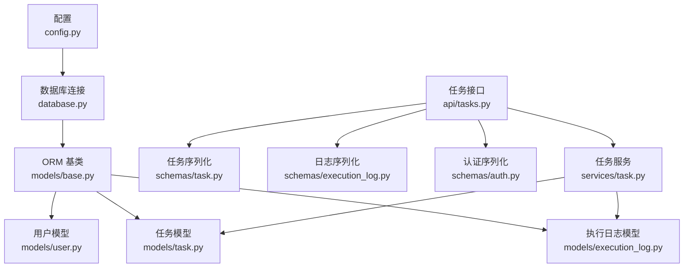
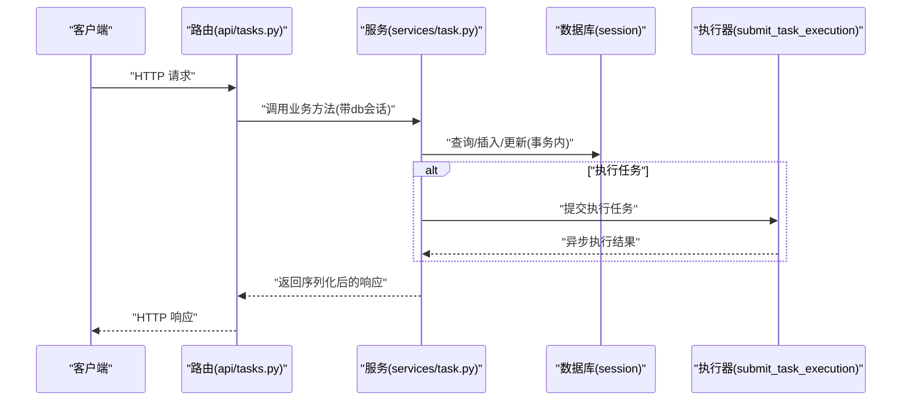
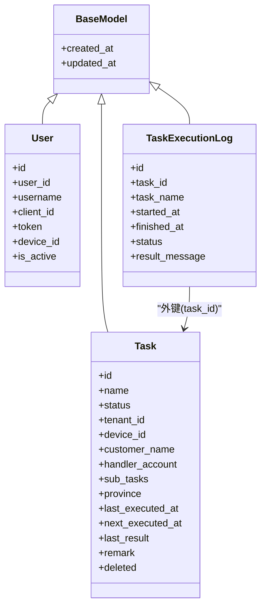
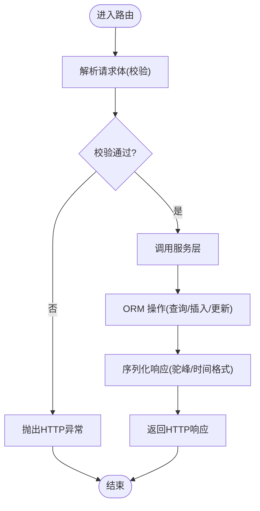
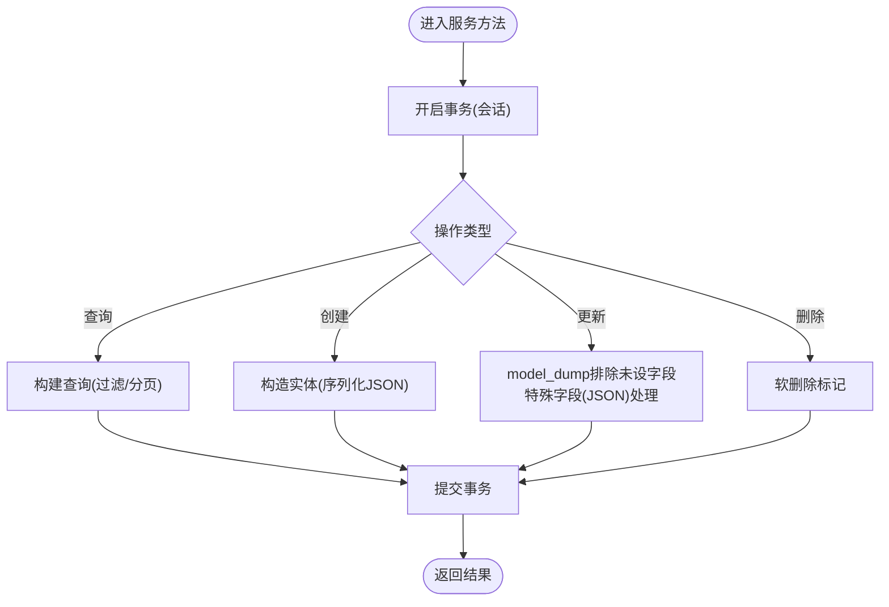
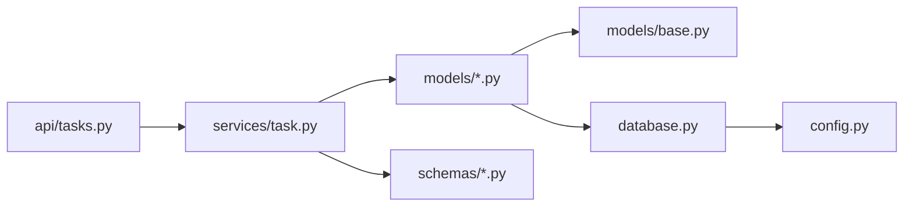

# 数据模型与访问

<cite>
**本文引用的文件**
- [app/models/base.py](file://app/models/base.py)
- [app/models/__init__.py](file://app/models/__init__.py)
- [app/models/task.py](file://app/models/task.py)
- [app/models/user.py](file://app/models/user.py)
- [app/models/execution_log.py](file://app/models/execution_log.py)
- [app/database.py](file://app/database.py)
- [app/config.py](file://app/config.py)
- [app/schemas/task.py](file://app/schemas/task.py)
- [app/schemas/execution_log.py](file://app/schemas/execution_log.py)
- [app/schemas/auth.py](file://app/schemas/auth.py)
- [app/api/tasks.py](file://app/api/tasks.py)
- [app/services/task.py](file://app/services/task.py)
</cite>

## 目录
1. [引言](#引言)
2. [项目结构](#项目结构)
3. [核心组件](#核心组件)
4. [架构总览](#架构总览)
5. [详细组件分析](#详细组件分析)
6. [依赖分析](#依赖分析)
7. [性能考虑](#性能考虑)
8. [故障排查指南](#故障排查指南)
9. [结论](#结论)
10. [附录](#附录)

## 引言
本文件聚焦于数据模型与访问层，系统梳理 SQLAlchemy ORM 模型设计、Pydantic 序列化与校验、服务层 CRUD 实现、事务管理、版本与兼容策略、性能与并发安全最佳实践，以及测试与验证方法。目标是帮助开发者在不直接阅读源码的情况下，快速理解并正确使用该模块。

## 项目结构
数据模型与访问层主要分布在以下目录与文件中：
- 配置与连接：config.py（读取环境变量生成数据库连接串）、database.py（创建引擎、会话工厂、依赖注入）
- 基类与模型：models/base.py（通用字段基类）、models/*.py（具体实体）
- 序列化与校验：schemas/*.py（Pydantic 模型）
- 接口与服务：api/tasks.py（FastAPI 路由）、services/task.py（业务逻辑与数据转换）

图表来源
- [app/config.py:1-22](file://app/config.py#L1-L22)
- [app/database.py:1-19](file://app/database.py#L1-L19)
- [app/models/base.py:1-11](file://app/models/base.py#L1-L11)
- [app/models/user.py:1-17](file://app/models/user.py#L1-L17)
- [app/models/task.py:1-25](file://app/models/task.py#L1-L25)
- [app/models/execution_log.py:1-17](file://app/models/execution_log.py#L1-L17)
- [app/schemas/task.py:1-58](file://app/schemas/task.py#L1-L58)
- [app/schemas/execution_log.py:1-19](file://app/schemas/execution_log.py#L1-L19)
- [app/schemas/auth.py:1-26](file://app/schemas/auth.py#L1-L26)
- [app/api/tasks.py:1-76](file://app/api/tasks.py#L1-L76)
- [app/services/task.py:1-157](file://app/services/task.py#L1-L157)

章节来源
- [app/config.py:1-22](file://app/config.py#L1-L22)
- [app/database.py:1-19](file://app/database.py#L1-L19)
- [app/models/base.py:1-11](file://app/models/base.py#L1-L11)
- [app/models/__init__.py:1-5](file://app/models/__init__.py#L1-L5)
- [app/models/user.py:1-17](file://app/models/user.py#L1-L17)
- [app/models/task.py:1-25](file://app/models/task.py#L1-L25)
- [app/models/execution_log.py:1-17](file://app/models/execution_log.py#L1-L17)
- [app/schemas/task.py:1-58](file://app/schemas/task.py#L1-L58)
- [app/schemas/execution_log.py:1-19](file://app/schemas/execution_log.py#L1-L19)
- [app/schemas/auth.py:1-26](file://app/schemas/auth.py#L1-L26)
- [app/api/tasks.py:1-76](file://app/api/tasks.py#L1-L76)
- [app/services/task.py:1-157](file://app/services/task.py#L1-L157)

## 核心组件
- ORM 基类与通用字段
  - BaseModel 提供 created_at、updated_at 两个时间戳字段，并通过 server_default 与 onupdate 自动维护。
  - 所有业务模型继承自 BaseModel，统一具备审计字段。
- 实体模型
  - 用户模型：用户标识、登录凭据、设备绑定、激活状态等。
  - 任务模型：名称、状态、租户/设备/客户/经办人信息、子任务列表（JSON 字符串）、省市区、最近/下次执行时间、结果、备注、软删除标记。
  - 执行日志模型：关联任务、开始/结束时间、状态、结果消息。
- 序列化与校验
  - Pydantic 模型用于请求入参与响应出参，包含创建、更新、列表、单条、分页等结构；部分字段采用驼峰命名以适配前端。
- 数据访问与服务
  - FastAPI 路由负责参数解析与异常处理。
  - 服务层封装 CRUD、分页、过滤、JSON 字段处理、日期格式化、提交执行等逻辑。
- 连接与依赖
  - 使用数据库配置生成连接串，创建引擎与会话工厂，提供依赖注入 get_db，确保每个请求拥有独立会话并自动关闭。

章节来源
- [app/models/base.py:7-11](file://app/models/base.py#L7-L11)
- [app/models/user.py:7-17](file://app/models/user.py#L7-L17)
- [app/models/task.py:8-25](file://app/models/task.py#L8-L25)
- [app/models/execution_log.py:7-17](file://app/models/execution_log.py#L7-L17)
- [app/schemas/task.py:5-58](file://app/schemas/task.py#L5-L58)
- [app/schemas/execution_log.py:4-19](file://app/schemas/execution_log.py#L4-L19)
- [app/api/tasks.py:13-76](file://app/api/tasks.py#L13-L76)
- [app/services/task.py:44-157](file://app/services/task.py#L44-L157)
- [app/database.py:5-19](file://app/database.py#L5-L19)
- [app/config.py:6-22](file://app/config.py#L6-L22)

## 架构总览
下图展示从接口到服务再到数据库的调用链路与数据流。

图表来源
- [app/api/tasks.py:13-76](file://app/api/tasks.py#L13-L76)
- [app/services/task.py:44-157](file://app/services/task.py#L44-L157)

## 详细组件分析

### ORM 类与关系设计
- 继承体系
  - BaseModel 抽象基类提供 created_at/updated_at，所有实体共享。
  - 具体实体：User、Task、TaskExecutionLog。
- 关系映射
  - TaskExecutionLog 与 Task 之间存在外键关联（task_id），服务层按任务 ID 查询日志。
- 字段设计要点
  - 索引字段：name、status、device_id、tenant_id、deleted 等提升查询效率。
  - JSON 存储：sub_tasks 以文本存储 JSON 数组，服务层进行序列化/反序列化。
  - 时间字段：created_at/updated_at 由数据库默认值维护，服务层统一格式化输出。

图表来源
- [app/models/base.py:7-11](file://app/models/base.py#L7-L11)
- [app/models/user.py:7-17](file://app/models/user.py#L7-L17)
- [app/models/task.py:8-25](file://app/models/task.py#L8-L25)
- [app/models/execution_log.py:7-17](file://app/models/execution_log.py#L7-L17)

章节来源
- [app/models/base.py:7-11](file://app/models/base.py#L7-L11)
- [app/models/user.py:7-17](file://app/models/user.py#L7-L17)
- [app/models/task.py:8-25](file://app/models/task.py#L8-L25)
- [app/models/execution_log.py:7-17](file://app/models/execution_log.py#L7-L17)

### 数据验证与序列化（Pydantic）
- 请求模型
  - TaskCreate：创建任务所需字段集合。
  - TaskUpdate：可选字段集合，支持部分更新。
  - LoginRequest/LoginResponse/LogoutRequest/VerifyResponse：认证相关。
  - CompanySelectRequest：站点选择交互请求。
- 响应模型
  - TaskResponse：包含驼峰命名字段与格式化时间，Config.from_attributes=True 支持从 ORM 对象构造。
  - TaskListResponse：分页列表结构。
  - ExecutionLogResponse/ExecutionLogListResponse：执行日志列表结构。
- 校验规则
  - 字段类型约束、可空性、列表类型等由 Pydantic 自动校验。
  - 服务层对 JSON 字段（如 sub_tasks）进行显式序列化/反序列化，保证入库/出参一致性。
- 错误处理
  - FastAPI 路由在资源不存在或执行失败时抛出 HTTP 异常，便于上层统一处理。

图表来源
- [app/api/tasks.py:13-76](file://app/api/tasks.py#L13-L76)
- [app/schemas/task.py:5-58](file://app/schemas/task.py#L5-L58)
- [app/schemas/execution_log.py:4-19](file://app/schemas/execution_log.py#L4-L19)
- [app/schemas/auth.py:5-26](file://app/schemas/auth.py#L5-L26)
- [app/services/task.py:74-107](file://app/services/task.py#L74-L107)

章节来源
- [app/schemas/task.py:5-58](file://app/schemas/task.py#L5-L58)
- [app/schemas/execution_log.py:4-19](file://app/schemas/execution_log.py#L4-L19)
- [app/schemas/auth.py:5-26](file://app/schemas/auth.py#L5-L26)
- [app/api/tasks.py:13-76](file://app/api/tasks.py#L13-L76)
- [app/services/task.py:16-41](file://app/services/task.py#L16-L41)

### 数据访问模式与事务管理
- 依赖注入
  - get_db 在每次请求中创建会话，try/finally 确保关闭，避免连接泄漏。
- CRUD 实现
  - 查询：支持关键词模糊匹配、状态过滤、分页排序。
  - 创建：接收 Pydantic 模型，序列化 JSON 字段后入库。
  - 更新：使用 model_dump(exclude_unset=True) 只更新传入字段，特殊处理 JSON 字段。
  - 删除：软删除（设置 deleted=True）。
- 事务与并发
  - 服务层在单个方法内完成查询/修改/提交，遵循“一个请求一个事务”的原则。
  - 未发现显式锁或重试逻辑，建议在高并发场景结合数据库层面的唯一索引与幂等设计。
- 批量处理
  - 当前路由未提供批量接口；如需批量操作，可在服务层扩展批量插入/更新方法，并在事务中逐条提交或使用批量语句。

图表来源
- [app/database.py:13-19](file://app/database.py#L13-L19)
- [app/services/task.py:47-117](file://app/services/task.py#L47-L117)

章节来源
- [app/database.py:5-19](file://app/database.py#L5-L19)
- [app/services/task.py:47-117](file://app/services/task.py#L47-L117)

### 版本控制与向后兼容
- 字段演进
  - 新增非必填字段（nullable=True）可保持向后兼容。
  - JSON 字段（如 sub_tasks）通过服务层序列化/反序列化，便于未来结构变更。
- 响应命名
  - 响应模型采用驼峰命名（如 tenantId、deviceId），前端消费更友好；若历史客户端依赖旧命名，可在网关或中间层做字段映射。
- API 版本
  - 未见明确版本号路径；建议后续引入 /api/v1/... 路径，逐步迁移并在变更时保留旧版本以保障兼容。

章节来源
- [app/schemas/task.py:31-51](file://app/schemas/task.py#L31-L51)
- [app/schemas/execution_log.py:4-14](file://app/schemas/execution_log.py#L4-L14)

### 性能优化与并发安全
- 查询优化
  - 为高频过滤字段建立索引（如 name、status、deleted、task_id）。
  - 分页查询使用 order_by(id/desc)+offset+limit，注意大数据量下的 offset 性能，可考虑基于游标的分页。
- 写入优化
  - 批量插入/更新可减少往返次数；当前服务层逐条提交，必要时合并为批量语句。
- 并发安全
  - 使用软删除避免物理删除引发的数据一致性问题。
  - 对关键写入路径增加幂等校验（如重复提交），结合唯一索引与条件更新。
- 连接池
  - 已启用 pool_pre_ping 与 pool_recycle，有助于维持连接健康与回收。

章节来源
- [app/models/task.py:12-24](file://app/models/task.py#L12-L24)
- [app/models/execution_log.py:11](file://app/models/execution_log.py#L11)
- [app/database.py:5](file://app/database.py#L5)

### 测试与验证方法
- 单元测试建议
  - 路由层：使用 TestClient 验证 404/400 场景与响应结构。
  - 服务层：Mock 会话，覆盖 CRUD、JSON 处理、日期格式化、软删除等分支。
  - 模型层：验证字段类型、索引、默认值与约束。
- 集成测试建议
  - 启动真实数据库（或容器化 MySQL），验证完整流程（创建-执行-查询日志）。
- 工具与规范
  - 使用 Pydantic 的 model_validate/model_validate_json 校验输入。
  - 使用 pytest + pytest-mock + sqlalchemy-utils 等工具组织测试。

[本节为通用指导，无需特定文件引用]

## 依赖分析
- 模块耦合
  - 路由依赖服务层；服务层依赖模型与序列化；模型依赖基类与数据库。
  - 序列化模型仅作为接口契约，不直接依赖 ORM，降低耦合。
- 外部依赖
  - SQLAlchemy（ORM/引擎/会话）、Pydantic（校验/序列化）、FastAPI（路由）。
- 循环依赖
  - 未发现循环导入；各层职责清晰。

图表来源
- [app/api/tasks.py:1-76](file://app/api/tasks.py#L1-L76)
- [app/services/task.py:1-157](file://app/services/task.py#L1-L157)
- [app/models/__init__.py:1-5](file://app/models/__init__.py#L1-L5)
- [app/database.py:1-19](file://app/database.py#L1-L19)
- [app/config.py:1-22](file://app/config.py#L1-L22)

章节来源
- [app/api/tasks.py:1-76](file://app/api/tasks.py#L1-L76)
- [app/services/task.py:1-157](file://app/services/task.py#L1-L157)
- [app/models/__init__.py:1-5](file://app/models/__init__.py#L1-L5)
- [app/database.py:1-19](file://app/database.py#L1-L19)
- [app/config.py:1-22](file://app/config.py#L1-L22)

## 性能考虑
- 索引策略：为过滤与排序字段建立合适索引，避免全表扫描。
- 分页与排序：大偏移量分页成本高，建议游标分页或基于最后记录 ID 的增量分页。
- 序列化成本：批量序列化时尽量复用对象属性，避免重复计算。
- 连接池：合理设置连接池大小与回收策略，结合 pool_pre_ping 保持连接可用性。

[本节为通用指导，无需特定文件引用]

## 故障排查指南
- 404 资源不存在
  - 路由层在资源不存在时抛出 404，检查 ID 是否正确、是否已被软删除。
- 400 参数错误
  - Pydantic 校验失败或服务层执行失败时返回 400，检查请求体字段类型与范围。
- 事务未提交
  - 确认服务层在成功路径调用 commit；异常路径是否回滚。
- JSON 字段异常
  - sub_tasks 存储为字符串，服务层负责序列化/反序列化；若格式错误，需修正输入或添加容错处理。

章节来源
- [app/api/tasks.py:26-52](file://app/api/tasks.py#L26-L52)
- [app/services/task.py:74-107](file://app/services/task.py#L74-L107)

## 结论
该数据模型与访问层以 SQLAlchemy 与 Pydantic 为核心，实现了清晰的分层与职责分离：路由负责接口契约与异常，服务层负责业务与数据转换，模型层负责持久化结构。通过软删除、索引与连接池等手段兼顾了可用性与性能。建议后续引入版本化 API、批量接口与更完善的并发控制策略，持续提升系统的稳定性与可维护性。

## 附录
- 快速定位参考
  - 模型定义：[models/task.py:8-25](file://app/models/task.py#L8-L25)、[models/user.py:7-17](file://app/models/user.py#L7-L17)、[models/execution_log.py:7-17](file://app/models/execution_log.py#L7-L17)
  - 基类与通用字段：[models/base.py:7-11](file://app/models/base.py#L7-L11)
  - 序列化模型：[schemas/task.py:5-58](file://app/schemas/task.py#L5-L58)、[schemas/execution_log.py:4-19](file://app/schemas/execution_log.py#L4-L19)、[schemas/auth.py:5-26](file://app/schemas/auth.py#L5-L26)
  - 数据库配置与会话：[config.py:6-22](file://app/config.py#L6-L22)、[database.py:5-19](file://app/database.py#L5-L19)
  - 接口与服务：[api/tasks.py:13-76](file://app/api/tasks.py#L13-L76)、[services/task.py:47-157](file://app/services/task.py#L47-L157)