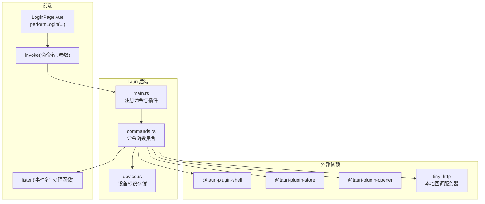
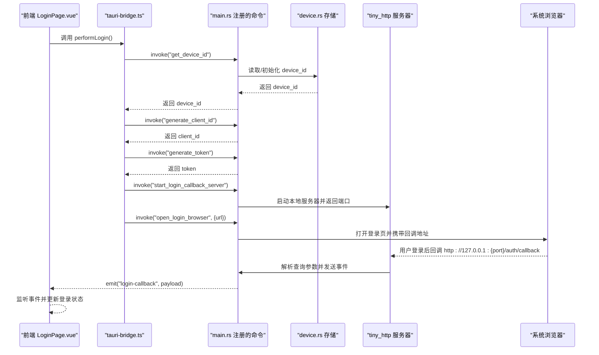
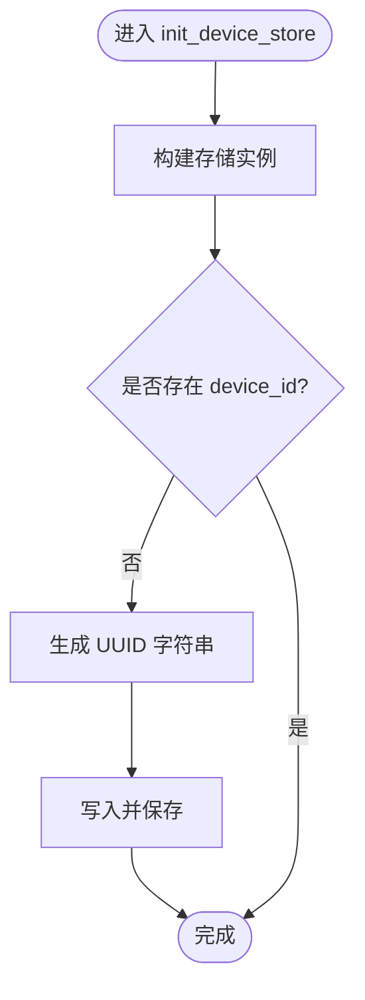
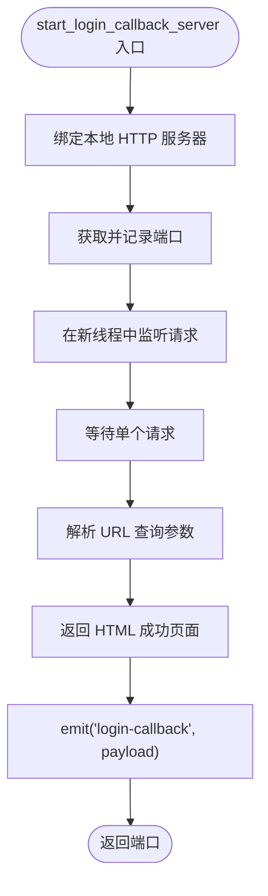
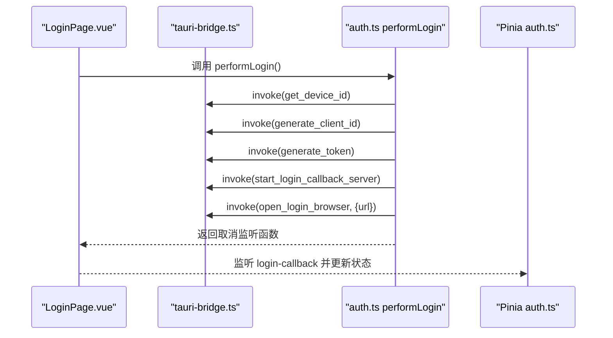
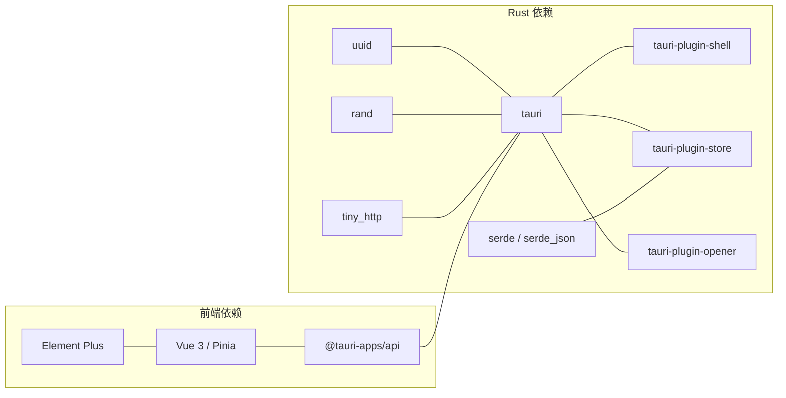

# Rust 命令系统

<cite>
**本文引用的文件**
- [commands.rs](file://CCC-BrowserV4/src-tauri/src/commands.rs)
- [device.rs](file://CCC-BrowserV4/src-tauri/src/device.rs)
- [main.rs](file://CCC-BrowserV4/src-tauri/src/main.rs)
- [Cargo.toml](file://CCC-BrowserV4/src-tauri/Cargo.toml)
- [tauri.conf.json](file://CCC-BrowserV4/src-tauri/tauri.conf.json)
- [tauri-bridge.ts](file://CCC-BrowserV4/frontend/src/utils/tauri-bridge.ts)
- [auth.ts](file://CCC-BrowserV4/frontend/src/stores/auth.ts)
- [LoginPage.vue](file://CCC-BrowserV4/frontend/src/pages/LoginPage.vue)
- [auth.ts](file://CCC-BrowserV4/frontend/src/api/auth.ts)
</cite>

## 目录
1. [简介](#简介)
2. [项目结构](#项目结构)
3. [核心组件](#核心组件)
4. [架构总览](#架构总览)
5. [详细组件分析](#详细组件分析)
6. [依赖关系分析](#依赖关系分析)
7. [性能考虑](#性能考虑)
8. [故障排查指南](#故障排查指南)
9. [结论](#结论)
10. [附录](#附录)

## 简介
本文件系统性解析基于 Tauri v2 的 Rust 命令系统实现，重点覆盖命令注册、参数与返回值的序列化/反序列化、错误处理与异步支持；并深入分析 commands.rs 中的五个命令函数：get_device_id、generate_client_id、generate_token、open_login_browser、start_login_callback_server；同时阐述 device.rs 中设备标识的生成与持久化逻辑。最后给出命令开发最佳实践与调试技巧。

## 项目结构
Tauri 后端位于 src-tauri，采用模块化组织：
- main.rs：应用入口，注册插件、命令处理器与应用初始化
- commands.rs：定义并导出所有命令函数
- device.rs：设备标识的初始化与读取
- Cargo.toml：依赖声明（含 tauri、tauri-plugin-*、uuid、rand、tiny_http 等）
- tauri.conf.json：应用配置与安全策略（CSP、窗口等）

前端位于 frontend，通过 @tauri-apps/api 的 invoke 与事件系统与后端通信，典型流程为：前端调用命令 -> 后端执行业务逻辑 -> 发送事件回前端 -> 前端更新状态。

图表来源
- [main.rs:7-28](file://CCC-BrowserV4/src-tauri/src/main.rs#L7-L28)
- [commands.rs:10-91](file://CCC-BrowserV4/src-tauri/src/commands.rs#L10-L91)
- [device.rs:5-31](file://CCC-BrowserV4/src-tauri/src/device.rs#L5-L31)

章节来源
- [main.rs:7-28](file://CCC-BrowserV4/src-tauri/src/main.rs#L7-L28)
- [Cargo.toml:9-22](file://CCC-BrowserV4/src-tauri/Cargo.toml#L9-L22)
- [tauri.conf.json:1-29](file://CCC-BrowserV4/src-tauri/tauri.conf.json#L1-L29)

## 核心组件
- 命令注册与分发
  - 在 main.rs 中通过 generate_handler! 宏注册命令，Tauri 运行时负责将前端 invoke 请求路由到对应函数
- 设备标识存储
  - 使用 tauri-plugin-store 将 device_id 持久化到本地 JSON 文件，首次运行自动生成并保存
- 浏览器与网络
  - tauri-plugin-opener 打开系统默认浏览器
  - tiny_http 提供本地回调服务器，接收登录成功后的授权回调并发送事件

章节来源
- [main.rs:12-18](file://CCC-BrowserV4/src-tauri/src/main.rs#L12-L18)
- [device.rs:6-20](file://CCC-BrowserV4/src-tauri/src/device.rs#L6-L20)
- [commands.rs:34-39](file://CCC-BrowserV4/src-tauri/src/commands.rs#L34-L39)
- [commands.rs:44-91](file://CCC-BrowserV4/src-tauri/src/commands.rs#L44-L91)

## 架构总览
下图展示从前端发起登录到后端处理、浏览器跳转、本地回调服务器响应与事件通知的完整链路。

图表来源
- [LoginPage.vue:129-169](file://CCC-BrowserV4/frontend/src/pages/LoginPage.vue#L129-L169)
- [tauri-bridge.ts:6-32](file://CCC-BrowserV4/frontend/src/utils/tauri-bridge.ts#L6-L32)
- [auth.ts:25-66](file://CCC-BrowserV4/frontend/src/api/auth.ts#L25-L66)
- [commands.rs:10-91](file://CCC-BrowserV4/src-tauri/src/commands.rs#L10-L91)
- [device.rs:22-31](file://CCC-BrowserV4/src-tauri/src/device.rs#L22-L31)

## 详细组件分析

### 命令注册与生命周期
- 插件注册
  - shell、store、opener 插件在 main.rs 中初始化，为命令提供系统级能力
- 命令注册
  - 通过 generate_handler! 宏将 commands.rs 中的函数暴露为可调用命令
- 应用初始化
  - setup 钩子中调用 device::init_device_store，确保设备标识可用

章节来源
- [main.rs:9-11](file://CCC-BrowserV4/src-tauri/src/main.rs#L9-L11)
- [main.rs:12-18](file://CCC-BrowserV4/src-tauri/src/main.rs#L12-L18)
- [main.rs:19-25](file://CCC-BrowserV4/src-tauri/src/main.rs#L19-L25)

### 设备标识管理（device.rs）
- 初始化逻辑
  - 若存储中不存在 device_id，则生成 UUID 并写入，随后保存到磁盘
- 读取逻辑
  - 从存储中读取字符串类型的 device_id，不存在则返回错误
- 作用域
  - 由命令 get_device_id 调用，保证跨会话持久化

图表来源
- [device.rs:6-20](file://CCC-BrowserV4/src-tauri/src/device.rs#L6-L20)

章节来源
- [device.rs:6-20](file://CCC-BrowserV4/src-tauri/src/device.rs#L6-L20)
- [device.rs:22-31](file://CCC-BrowserV4/src-tauri/src/device.rs#L22-L31)

### 命令实现详解

#### get_device_id
- 功能：返回设备唯一标识（持久化）
- 实现要点：
  - 异步命令，返回 Result<String, String>
  - 内部委托 device::get_device_id
- 参数与返回：
  - 入参：AppHandle（隐式注入）
  - 出参：设备 ID 字符串或错误字符串

章节来源
- [commands.rs:10-14](file://CCC-BrowserV4/src-tauri/src/commands.rs#L10-L14)
- [device.rs:22-31](file://CCC-BrowserV4/src-tauri/src/device.rs#L22-L31)

#### generate_client_id
- 功能：生成每次登录会话唯一的客户端标识
- 实现要点：
  - 异步命令，返回 Result<String, String>
  - 使用 uuid::Uuid::new_v4 生成
- 参数与返回：
  - 入参：无
  - 出参：UUID 字符串

章节来源
- [commands.rs:16-20](file://CCC-BrowserV4/src-tauri/src/commands.rs#L16-L20)

#### generate_token
- 功能：生成 32 位十六进制随机 token
- 实现要点：
  - 异步命令，返回 Result<String, String>
  - 使用 rand 生成 32 个十六进制字符
- 参数与返回：
  - 入参：无
  - 出参：32 位 hex 字符串

章节来源
- [commands.rs:22-30](file://CCC-BrowserV4/src-tauri/src/commands.rs#L22-L30)

#### open_login_browser
- 功能：打开系统默认浏览器访问指定 URL
- 实现要点：
  - 异步命令，返回 Result<(), String>
  - 使用 tauri-plugin-opener 打开 URL
  - 错误统一映射为字符串
- 参数与返回：
  - 入参：AppHandle、url(String)
  - 出参：空结果或错误字符串

章节来源
- [commands.rs:32-39](file://CCC-BrowserV4/src-tauri/src/commands.rs#L32-L39)

#### start_login_callback_server
- 功能：启动本地回调 HTTP 服务器，等待登录成功回调
- 实现要点：
  - 异步命令，返回 Result<u16, String>
  - 使用 tiny_http 在 127.0.0.1:0 绑定，自动分配端口
  - 单次请求处理：解析查询参数、构造 HTML 响应、发送事件
  - 通过 AppHandle.emit("login-callback", payload) 通知前端
- 参数与返回：
  - 入参：AppHandle
  - 出参：端口号或错误字符串
- 线程与并发：
  - 在独立线程中阻塞等待单个请求，避免阻塞主线程

图表来源
- [commands.rs:44-91](file://CCC-BrowserV4/src-tauri/src/commands.rs#L44-L91)

章节来源
- [commands.rs:44-91](file://CCC-BrowserV4/src-tauri/src/commands.rs#L44-L91)

### 前端集成与事件处理
- 命令桥接
  - tauri-bridge.ts 封装 invoke 调用，类型安全地暴露命令
- 登录流程
  - LoginPage.vue 触发 performLogin，按序调用 get_device_id、generate_client_id、generate_token、start_login_callback_server、open_login_browser
  - 监听 login-callback 事件，根据 payload 更新登录状态
- 认证状态持久化
  - auth.ts 使用 Pinia 与 localStorage 持久化登录态

图表来源
- [LoginPage.vue:129-169](file://CCC-BrowserV4/frontend/src/pages/LoginPage.vue#L129-L169)
- [tauri-bridge.ts:6-32](file://CCC-BrowserV4/frontend/src/utils/tauri-bridge.ts#L6-L32)
- [auth.ts:25-66](file://CCC-BrowserV4/frontend/src/api/auth.ts#L25-L66)
- [auth.ts:15-27](file://CCC-BrowserV4/frontend/src/stores/auth.ts#L15-L27)

章节来源
- [tauri-bridge.ts:6-32](file://CCC-BrowserV4/frontend/src/utils/tauri-bridge.ts#L6-L32)
- [auth.ts:25-66](file://CCC-BrowserV4/frontend/src/api/auth.ts#L25-L66)
- [LoginPage.vue:129-169](file://CCC-BrowserV4/frontend/src/pages/LoginPage.vue#L129-L169)
- [auth.ts:15-27](file://CCC-BrowserV4/frontend/src/stores/auth.ts#L15-L27)

## 依赖关系分析
- Rust 侧依赖
  - tauri、tauri-plugin-shell、tauri-plugin-store、tauri-plugin-opener 提供命令、系统交互与存储能力
  - uuid、rand 用于标识与随机数生成
  - tiny_http 用于本地回调服务
  - serde/serde_json 用于 JSON 序列化与存储值类型
- 前端依赖
  - @tauri-apps/api 提供 invoke 与事件监听
  - Element Plus、Vue 3/Pinia 用于界面与状态管理

图表来源
- [Cargo.toml:9-22](file://CCC-BrowserV4/src-tauri/Cargo.toml#L9-L22)
- [tauri.conf.json:24-26](file://CCC-BrowserV4/src-tauri/tauri.conf.json#L24-L26)

章节来源
- [Cargo.toml:9-22](file://CCC-BrowserV4/src-tauri/Cargo.toml#L9-L22)
- [tauri.conf.json:24-26](file://CCC-BrowserV4/src-tauri/tauri.conf.json#L24-L26)

## 性能考虑
- 异步与线程
  - start_login_callback_server 在独立线程处理请求，避免阻塞主线程
  - 建议对可能耗时的操作（如网络请求）均采用异步与线程池策略
- 序列化成本
  - JSON 序列化/反序列化在频繁调用场景下需关注开销，建议减少不必要的中间转换
- 存储 I/O
  - device.json 仅在初始化时写入一次，后续读取为内存/少量磁盘读取，性能影响较小
- 端口冲突
  - tiny_http 使用 127.0.0.1:0 自动分配端口，避免手动端口管理带来的冲突风险

## 故障排查指南
- 设备标识为空
  - 检查 device::init_device_store 是否在 setup 钩子中正确调用
  - 确认 tauri-plugin-store 初始化成功且路径可写
- 浏览器无法打开
  - 检查 tauri-plugin-opener 初始化与系统默认浏览器设置
  - 确认 URL 格式正确且包含必要查询参数
- 回调服务器未响应
  - 检查端口是否被占用（尽管使用 0 自动分配），确认防火墙放行 127.0.0.1
  - 确认 tiny_http 服务器线程正常运行且只处理一次请求
- 事件未到达前端
  - 检查前端是否正确监听 login-callback 事件
  - 确认 payload 结构与前端期望一致（status、user_id、username）
- CSP 限制
  - tauri.conf.json 中已允许本地 127.0.0.1 与登录域名，若仍受限请检查具体连接源

章节来源
- [main.rs:19-25](file://CCC-BrowserV4/src-tauri/src/main.rs#L19-L25)
- [device.rs:6-20](file://CCC-BrowserV4/src-tauri/src/device.rs#L6-L20)
- [commands.rs:34-39](file://CCC-BrowserV4/src-tauri/src/commands.rs#L34-L39)
- [commands.rs:44-91](file://CCC-BrowserV4/src-tauri/src/commands.rs#L44-L91)
- [tauri.conf.json:24-26](file://CCC-BrowserV4/src-tauri/tauri.conf.json#L24-L26)

## 结论
该命令系统以模块化方式组织，借助 Tauri 插件体系实现了设备标识持久化、会话标识生成、随机 token 生成、浏览器打开与本地回调服务器等核心能力。通过 invoke 与事件机制，前后端协作清晰，错误处理统一，具备良好的扩展性与可维护性。建议在生产环境中进一步增强日志、监控与容错机制。

## 附录

### 命令参数与返回值规范
- get_device_id
  - 入参：AppHandle（隐式）
  - 返回：Result<String, String>
- generate_client_id
  - 入参：无
  - 返回：Result<String, String>
- generate_token
  - 入参：无
  - 返回：Result<String, String>
- open_login_browser
  - 入参：AppHandle、url(String)
  - 返回：Result<(), String>
- start_login_callback_server
  - 入参：AppHandle
  - 返回：Result<u16, String>

章节来源
- [commands.rs:10-91](file://CCC-BrowserV4/src-tauri/src/commands.rs#L10-L91)

### 最佳实践
- 命令设计
  - 保持幂等与无副作用（除必要的持久化外）
  - 明确错误语义，统一返回 Result<T, String>
- 参数与序列化
  - 使用 serde/serde_json 进行结构化数据传输，避免手写字符串拼接
- 异步与并发
  - 对阻塞操作使用线程或异步任务，避免阻塞主线程
- 安全
  - 严格控制 CSP 与权限范围，最小化开放端口与协议
- 调试
  - 启用日志输出，区分 info/warn/error 级别
  - 前端监听关键事件，结合控制台输出定位问题