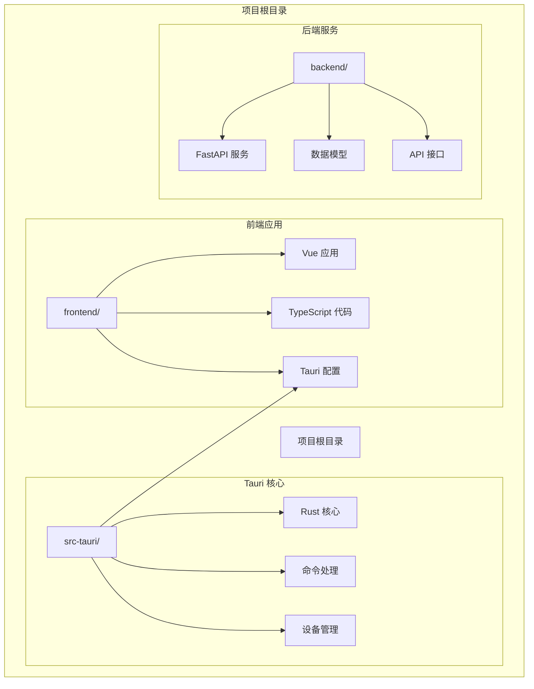
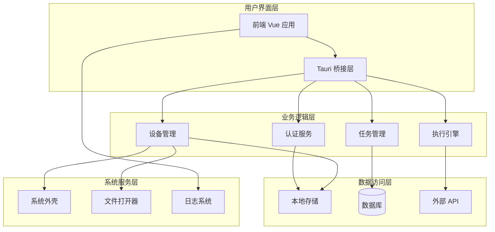
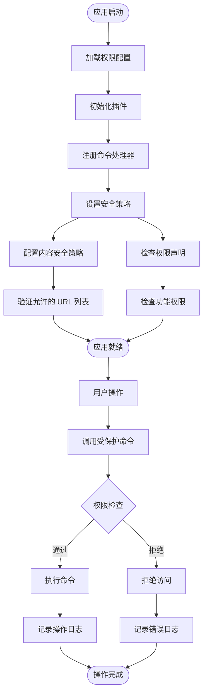
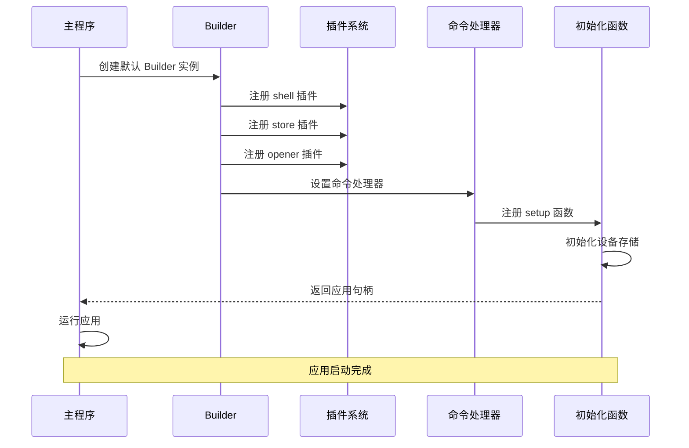
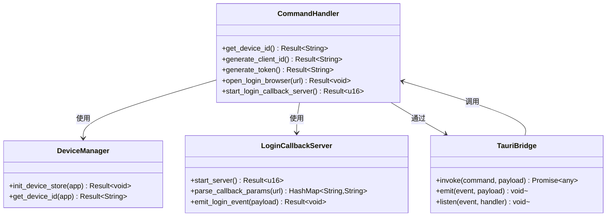
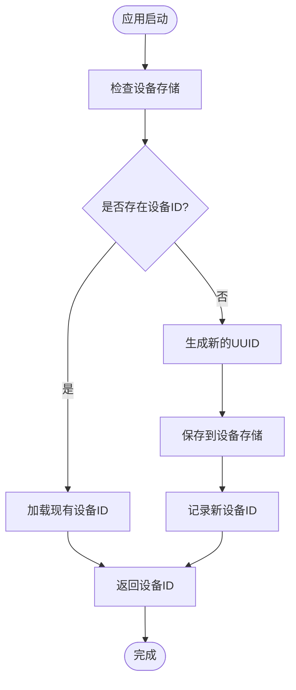
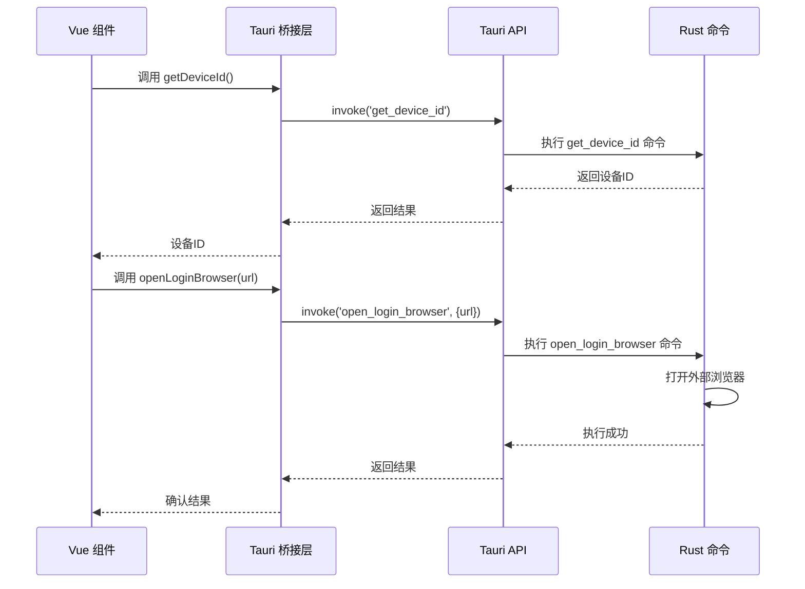
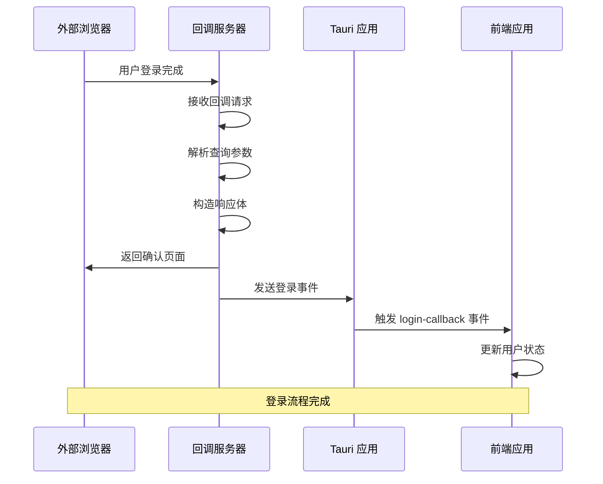
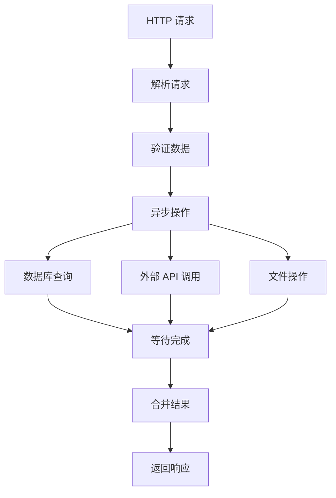

# Tauri 框架集成

<cite>
**本文档引用的文件**
- [Cargo.toml](file://CCC-BrowserV4/src-tauri/Cargo.toml)
- [tauri.conf.json](file://CCC-BrowserV4/src-tauri/tauri.conf.json)
- [main.rs](file://CCC-BrowserV4/src-tauri/src/main.rs)
- [commands.rs](file://CCC-BrowserV4/src-tauri/src/commands.rs)
- [device.rs](file://CCC-BrowserV4/src-tauri/src/device.rs)
- [default.json](file://CCC-BrowserV4/src-tauri/capabilities/default.json)
- [package.json](file://CCC-BrowserV4/frontend/package.json)
- [tauri-bridge.ts](file://CCC-BrowserV4/frontend/src/utils/tauri-bridge.ts)
- [vite.config.ts](file://CCC-BrowserV4/frontend/vite.config.ts)
- [main.ts](file://CCC-BrowserV4/frontend/src/main.ts)
- [App.vue](file://CCC-BrowserV4/frontend/src/App.vue)
- [HomePage.vue](file://CCC-BrowserV4/frontend/src/pages/HomePage.vue)
- [config.py](file://CCC-BrowserV4/backend/app/config.py)
- [requirements.txt](file://CCC-BrowserV4/backend/requirements.txt)
</cite>

## 目录
1. [简介](#简介)
2. [项目结构](#项目结构)
3. [核心组件](#核心组件)
4. [架构概览](#架构概览)
5. [详细组件分析](#详细组件分析)
6. [依赖关系分析](#依赖关系分析)
7. [性能考虑](#性能考虑)
8. [故障排除指南](#故障排除指南)
9. [结论](#结论)
10. [附录](#附录)

## 简介

本项目是一个基于 Tauri 2.0 框架的 RPA（机器人流程自动化）浏览器应用。该应用采用前后端分离架构，前端使用 Vue 3 + TypeScript + Vite 构建，后端使用 Python FastAPI 提供 REST API 服务。Tauri 作为跨平台桌面应用框架，提供了安全的原生 API 桥接和高效的前端渲染能力。

项目的核心目标是为用户提供一个功能丰富的 RPA 自动化浏览器，支持任务执行、设备管理、用户认证等功能。应用通过 Tauri 的安全沙箱模型，在保证安全性的同时提供原生应用体验。

## 项目结构

该项目采用模块化的组织方式，主要包含以下核心目录：



**图表来源**
- [main.rs:1-29](file://CCC-BrowserV4/src-tauri/src/main.rs#L1-L29)
- [package.json:1-29](file://CCC-BrowserV4/frontend/package.json#L1-L29)
- [config.py:1-52](file://CCC-BrowserV4/backend/app/config.py#L1-L52)

**章节来源**
- [main.rs:1-29](file://CCC-BrowserV4/src-tauri/src/main.rs#L1-L29)
- [package.json:1-29](file://CCC-BrowserV4/frontend/package.json#L1-L29)
- [config.py:1-52](file://CCC-BrowserV4/backend/app/config.py#L1-L52)

## 核心组件

### Tauri 应用核心

Tauri 2.0 框架提供了现代化的桌面应用开发解决方案，具有以下核心特性：

- **安全沙箱模型**：通过权限控制系统确保应用只能访问授权的功能
- **轻量级运行时**：相比 Electron 更加高效，内存占用更少
- **原生 API 桥接**：提供安全的系统调用接口
- **多平台支持**：统一的代码库支持 Windows、macOS 和 Linux

### 前端渲染层

前端采用现代的 Vue 3 技术栈，结合 TypeScript 提供类型安全的开发体验：

- **Vue 3 Composition API**：提供更好的逻辑复用和状态管理
- **Element Plus UI 组件库**：丰富的预构建 UI 组件
- **Pinia 状态管理**：现代化的状态管理方案
- **Vite 开发工具链**：快速的开发服务器和热重载

### 后端服务层

后端使用 Python FastAPI 提供高性能的 REST API 服务：

- **异步处理**：利用 asyncio 提供非阻塞的 API 调用
- **Pydantic 验证**：自动的数据验证和序列化
- **SQLAlchemy ORM**：强大的数据库抽象层
- **环境配置管理**：灵活的配置系统

**章节来源**
- [Cargo.toml:1-22](file://CCC-BrowserV4/src-tauri/Cargo.toml#L1-L22)
- [tauri.conf.json:1-29](file://CCC-BrowserV4/src-tauri/tauri.conf.json#L1-L29)
- [package.json:1-29](file://CCC-BrowserV4/frontend/package.json#L1-L29)
- [requirements.txt:1-13](file://CCC-BrowserV4/backend/requirements.txt#L1-L13)

## 架构概览

整个应用采用分层架构设计，各层之间职责清晰，耦合度低：



**图表来源**
- [main.rs:7-27](file://CCC-BrowserV4/src-tauri/src/main.rs#L7-L27)
- [commands.rs:1-92](file://CCC-BrowserV4/src-tauri/src/commands.rs#L1-L92)
- [device.rs:1-32](file://CCC-BrowserV4/src-tauri/src/device.rs#L1-L32)

### 安全模型

Tauri 2.0 实现了严格的权限控制机制：



**图表来源**
- [tauri.conf.json:24-26](file://CCC-BrowserV4/src-tauri/tauri.conf.json#L24-L26)
- [default.json:6-11](file://CCC-BrowserV4/src-tauri/capabilities/default.json#L6-L11)
- [main.rs:8-18](file://CCC-BrowserV4/src-tauri/src/main.rs#L8-L18)

**章节来源**
- [tauri.conf.json:24-26](file://CCC-BrowserV4/src-tauri/tauri.conf.json#L24-L26)
- [default.json:1-13](file://CCC-BrowserV4/src-tauri/capabilities/default.json#L1-L13)

## 详细组件分析

### 应用入口点配置

应用的入口点位于 `src-tauri/src/main.rs`，采用 Builder 模式进行初始化：

#### Builder 模式初始化流程



**图表来源**
- [main.rs:7-27](file://CCC-BrowserV4/src-tauri/src/main.rs#L7-L27)

#### 插件注册机制

应用注册了三个核心插件：

1. **Shell 插件**：提供系统外壳功能，用于打开外部应用程序
2. **Store 插件**：提供本地持久化存储功能
3. **Opener 插件**：提供文件和 URL 打开功能

**章节来源**
- [main.rs:8-11](file://CCC-BrowserV4/src-tauri/src/main.rs#L8-L11)

### 命令处理器系统

命令处理器是 Tauri 的核心功能模块，负责在 Rust 后端和 JavaScript 前端之间建立通信桥梁：

#### 命令定义与实现



**图表来源**
- [commands.rs:10-92](file://CCC-BrowserV4/src-tauri/src/commands.rs#L10-L92)
- [device.rs:5-32](file://CCC-BrowserV4/src-tauri/src/device.rs#L5-L32)

#### 设备标识管理系统

设备标识管理是应用的重要功能之一，负责为每个安装实例生成唯一的设备 ID：



**图表来源**
- [device.rs:6-20](file://CCC-BrowserV4/src-tauri/src/device.rs#L6-L20)

**章节来源**
- [commands.rs:10-92](file://CCC-BrowserV4/src-tauri/src/commands.rs#L10-L92)
- [device.rs:1-32](file://CCC-BrowserV4/src-tauri/src/device.rs#L1-L32)

### 前端桥接层

前端通过 `tauri-bridge.ts` 文件与 Tauri 原生功能进行交互：

#### 前端命令封装



**图表来源**
- [tauri-bridge.ts:6-32](file://CCC-BrowserV4/frontend/src/utils/tauri-bridge.ts#L6-L32)
- [main.ts:10-22](file://CCC-BrowserV4/frontend/src/main.ts#L10-L22)

**章节来源**
- [tauri-bridge.ts:1-33](file://CCC-BrowserV4/frontend/src/utils/tauri-bridge.ts#L1-L33)
- [main.ts:1-23](file://CCC-BrowserV4/frontend/src/main.ts#L1-L23)

### 登录回调服务器

应用实现了本地 HTTP 服务器来处理外部登录系统的回调：



**图表来源**
- [commands.rs:44-91](file://CCC-BrowserV4/src-tauri/src/commands.rs#L44-L91)

**章节来源**
- [commands.rs:44-91](file://CCC-BrowserV4/src-tauri/src/commands.rs#L44-L91)

## 依赖关系分析

### Rust 依赖管理

Tauri 应用的依赖关系清晰明确，遵循最小化原则：

```mermaid
graph TB
subgraph "核心依赖"
Tauri[tauri = "2"]
Serde[serde = "1"]
SerdeJson[serde_json = "1"]
end
subgraph "插件依赖"
Shell[tauri-plugin-shell = "2"]
Store[tauri-plugin-store = "2"]
Opener[tauri-plugin-opener = "2"]
end
subgraph "工具库"
UUID[uuid = "1"]
Rand[rand = "0.8"]
Log[log = "0.4"]
EnvLogger[env_logger = "0.11"]
Tokio[tokio = "1"]
TinyHTTP[tiny_http = "0.12"]
end
Tauri --> Shell
Tauri --> Store
Tauri --> Opener
Serde --> SerdeJson
UUID --> Rand
Log --> EnvLogger
Tokio --> TinyHTTP
```

**图表来源**
- [Cargo.toml:9-22](file://CCC-BrowserV4/src-tauri/Cargo.toml#L9-L22)

### 前端依赖管理

前端使用现代化的包管理工具，依赖关系简洁高效：

```mermaid
graph TB
subgraph "运行时依赖"
Vue[vue = "^3.5.0"]
Router[vue-router = "^4.5.0"]
Pinia[pinia = "^2.3.0"]
ElementPlus[element-plus = "^2.9.0"]
Axios[axios = "^1.18.1"]
TauriAPI[@tauri-apps/api = "^2.0.0"]
Icons[@element-plus/icons-vue = "^2.3.0"]
end
subgraph "开发依赖"
Vite[vite = "^5.4.0"]
VuePlugin[@vitejs/plugin-vue = "^5.2.0"]
TS[typescript = "~5.6.0"]
VueTSC[vue-tsc = "^2.2.0"]
TauriCLI[@tauri-apps/cli = "^2.11.3"]
end
Vue --> Router
Vue --> Pinia
Vue --> ElementPlus
ElementPlus --> Icons
```

**图表来源**
- [package.json:12-27](file://CCC-BrowserV4/frontend/package.json#L12-L27)

### 后端依赖管理

后端服务采用高性能的 Python 生态系统：

```mermaid
graph TB
subgraph "Web 框架"
FastAPI[fastapi = "0.115.0"]
Uvicorn[uvicorn[standard] = "0.30.6"]
end
subgraph "数据库层"
SQLAlchemy[sqlalchemy = "2.0.35"]
PyMySQL[pymysql = "1.1.1"]
Cryptography[cryptography = "43.0.1"]
end
subgraph "配置管理"
PydanticSettings[pydantic-settings = "2.5.2"]
DotEnv[python-dotenv = "1.0.1"]
end
FastAPI --> Uvicorn
FastAPI --> SQLAlchemy
SQLAlchemy --> PyMySQL
FastAPI --> PydanticSettings
PydanticSettings --> DotEnv
```

**图表来源**
- [requirements.txt:1-13](file://CCC-BrowserV4/backend/requirements.txt#L1-L13)

**章节来源**
- [Cargo.toml:1-22](file://CCC-BrowserV4/src-tauri/Cargo.toml#L1-L22)
- [package.json:1-29](file://CCC-BrowserV4/frontend/package.json#L1-L29)
- [requirements.txt:1-13](file://CCC-BrowserV4/backend/requirements.txt#L1-L13)

## 性能考虑

### 内存优化策略

Tauri 相比 Electron 在内存使用方面具有显著优势：

- **轻量级运行时**：Tauri 的运行时大小约为 Electron 的 1/10
- **按需加载**：插件系统支持延迟加载，减少启动时间
- **高效的原生桥接**：使用零拷贝技术减少数据传输开销

### 并发处理

应用采用了异步编程模型来提高并发性能：



**图表来源**
- [commands.rs:52-88](file://CCC-BrowserV4/src-tauri/src/commands.rs#L52-L88)

### 缓存策略

应用实现了多层次的缓存机制：

1. **设备标识缓存**：本地持久化存储设备信息
2. **会话缓存**：内存中的用户会话状态
3. **静态资源缓存**：前端构建产物的缓存

## 故障排除指南

### 常见问题诊断

#### 应用启动失败

当应用无法正常启动时，可以按照以下步骤排查：

1. **检查权限配置**：确认 `capabilities/default.json` 中的权限声明正确
2. **验证插件注册**：确保所有必需插件都已正确注册
3. **检查命令处理器**：确认命令处理器列表完整且无语法错误

#### 前端通信问题

如果前端无法与原生功能通信：

1. **验证桥接层**：检查 `tauri-bridge.ts` 中的命令映射
2. **检查 CSP 配置**：确认内容安全策略允许必要的网络请求
3. **调试日志**：启用详细日志输出以定位问题

#### 性能问题

针对性能问题的排查方法：

1. **内存监控**：使用系统监控工具检查内存使用情况
2. **CPU 分析**：识别 CPU 密集型操作
3. **网络分析**：监控网络请求和响应时间

**章节来源**
- [tauri.conf.json:24-26](file://CCC-BrowserV4/src-tauri/tauri.conf.json#L24-L26)
- [default.json:6-11](file://CCC-BrowserV4/src-tauri/capabilities/default.json#L6-L11)

## 结论

本项目成功展示了 Tauri 2.0 框架在现代桌面应用开发中的强大能力。通过合理的架构设计和组件划分，实现了安全、高效、可维护的应用系统。

### 主要优势

1. **安全性**：严格的权限控制和内容安全策略
2. **性能**：相比传统桌面应用框架具有显著的性能优势
3. **开发效率**：现代化的工具链和开发体验
4. **可扩展性**：清晰的架构层次便于功能扩展

### 最佳实践建议

1. **持续集成**：建立自动化测试和部署流程
2. **监控告警**：实施应用性能监控和错误追踪
3. **文档维护**：保持技术文档与代码同步更新
4. **安全审计**：定期审查权限配置和安全策略

## 附录

### 开发环境设置

#### 系统要求

- **操作系统**：Windows 10+ / macOS 10.15+ / Linux
- **Rust 工具链**：最新稳定版本
- **Node.js**：16.x 或更高版本
- **Python**：3.8 或更高版本

#### 开发命令

```bash
# 启动前端开发服务器
npm run dev

# 启动后端服务
uvicorn app.main:app --reload

# 构建 Tauri 应用
npm run tauri build

# 开发模式运行
npm run tauri dev
```

### 配置文件详解

#### Tauri 配置参数

| 参数 | 类型 | 默认值 | 描述 |
|------|------|--------|------|
| productName | string | "ccc-browser-v4" | 应用产品名称 |
| version | string | "1.0.0" | 应用版本号 |
| identifier | string | "com.ccc.browser-v4" | 应用标识符 |
| frontendDist | string | "../frontend/dist" | 前端构建输出目录 |
| devUrl | string | "http://localhost:5173" | 开发服务器地址 |
| minWidth/minHeight | number | 1024/768 | 窗口最小尺寸 |
| csp | string | 内容安全策略 | 定义允许的资源加载 |

### API 参考

#### 命令接口

| 命令名 | 参数 | 返回值 | 功能描述 |
|--------|------|--------|----------|
| get_device_id | 无 | string | 获取设备唯一标识 |
| generate_client_id | 无 | string | 生成客户端标识 |
| generate_token | 无 | string | 生成随机 token |
| open_login_browser | url: string | void | 打开外部浏览器 |
| start_login_callback_server | 无 | number | 启动回调服务器 |