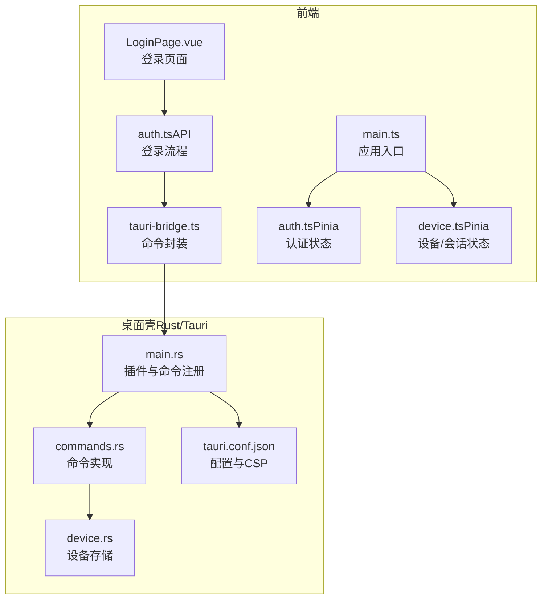
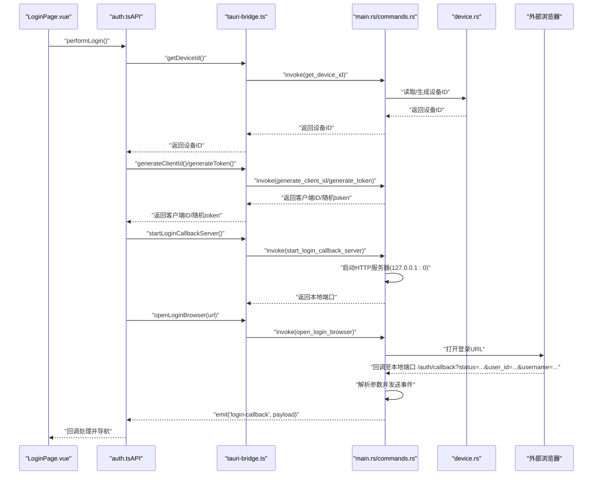
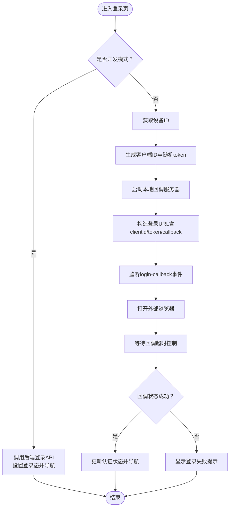
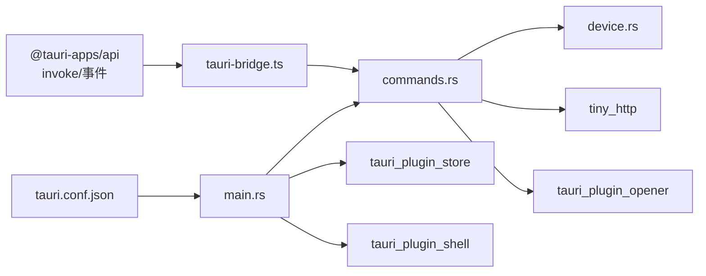

# 前端桌面集成

<cite>
**本文引用的文件**
- [tauri-bridge.ts](file://CCC-BrowserV4/frontend/src/utils/tauri-bridge.ts)
- [main.rs](file://CCC-BrowserV4/src-tauri/src/main.rs)
- [commands.rs](file://CCC-BrowserV4/src-tauri/src/commands.rs)
- [device.rs](file://CCC-BrowserV4/src-tauri/src/device.rs)
- [tauri.conf.json](file://CCC-BrowserV4/src-tauri/tauri.conf.json)
- [auth.ts（Pinia）](file://CCC-BrowserV4/frontend/src/stores/auth.ts)
- [device.ts（Pinia）](file://CCC-BrowserV4/frontend/src/stores/device.ts)
- [auth.ts（API）](file://CCC-BrowserV4/frontend/src/api/auth.ts)
- [LoginPage.vue](file://CCC-BrowserV4/frontend/src/pages/LoginPage.vue)
- [main.ts](file://CCC-BrowserV4/frontend/src/main.ts)
- [index.ts（类型定义）](file://CCC-BrowserV4/frontend/src/types/index.ts)
</cite>

## 目录
1. [简介](#简介)
2. [项目结构](#项目结构)
3. [核心组件](#核心组件)
4. [架构总览](#架构总览)
5. [组件详解](#组件详解)
6. [依赖关系分析](#依赖关系分析)
7. [性能考量](#性能考量)
8. [故障排查指南](#故障排查指南)
9. [结论](#结论)
10. [附录](#附录)

## 简介
本文件面向前端与桌面壳（Tauri）集成场景，系统性阐述前端应用与 Tauri 桌面壳之间的通信机制与数据交换协议。重点覆盖以下方面：
- tauri-bridge.ts 桥接层的命令封装、事件监听与状态同步策略
- 前端通过 Tauri API 访问原生能力（设备标识、外部浏览器、本地回调服务器等）
- 认证流程中的桌面应用集成（登录回调服务器、令牌管理、登录页交互）
- 最佳实践与性能优化建议

## 项目结构
前端采用 Vue 3 + Pinia + Element Plus 技术栈；桌面壳使用 Rust + Tauri，通过命令注册与事件机制实现前后端通信。配置文件集中于 src-tauri/tauri.conf.json，定义了窗口、安全策略与构建入口。

图表来源
- [main.ts:1-23](file://CCC-BrowserV4/frontend/src/main.ts#L1-L23)
- [tauri-bridge.ts:1-33](file://CCC-BrowserV4/frontend/src/utils/tauri-bridge.ts#L1-L33)
- [auth.ts（API）:1-67](file://CCC-BrowserV4/frontend/src/api/auth.ts#L1-L67)
- [auth.ts（Pinia）:1-79](file://CCC-BrowserV4/frontend/src/stores/auth.ts#L1-L79)
- [device.ts（Pinia）:1-40](file://CCC-BrowserV4/frontend/src/stores/device.ts#L1-L40)
- [LoginPage.vue:1-228](file://CCC-BrowserV4/frontend/src/pages/LoginPage.vue#L1-L228)
- [main.rs:1-29](file://CCC-BrowserV4/src-tauri/src/main.rs#L1-L29)
- [commands.rs:1-92](file://CCC-BrowserV4/src-tauri/src/commands.rs#L1-L92)
- [device.rs:1-32](file://CCC-BrowserV4/src-tauri/src/device.rs#L1-L32)
- [tauri.conf.json:1-29](file://CCC-BrowserV4/src-tauri/tauri.conf.json#L1-L29)

章节来源
- [main.ts:1-23](file://CCC-BrowserV4/frontend/src/main.ts#L1-L23)
- [tauri.conf.json:1-29](file://CCC-BrowserV4/src-tauri/tauri.conf.json#L1-L29)

## 核心组件
- 桥接层（tauri-bridge.ts）：封装 invoke 调用，暴露统一的命令接口（设备标识、客户端标识、随机 token、打开浏览器、启动登录回调服务器）。
- 命令实现（commands.rs）：提供设备标识读取、UUID 客户端标识生成、随机 token 生成、外部浏览器打开、本地回调 HTTP 服务器启动与事件分发。
- 设备存储（device.rs）：基于 tauri_plugin_store 在本地持久化设备标识，首次运行自动生成并写入。
- 认证状态（Pinia）：维护登录态、用户信息、会话 token，并支持本地持久化恢复。
- 登录流程（auth.ts（API）+ LoginPage.vue）：组合桥接层命令与事件监听，完成登录回调与路由跳转。
- 配置（tauri.conf.json）：定义窗口属性、CSP 白名单（允许本地 127.0.0.1 及特定域名）。

章节来源
- [tauri-bridge.ts:1-33](file://CCC-BrowserV4/frontend/src/utils/tauri-bridge.ts#L1-L33)
- [commands.rs:1-92](file://CCC-BrowserV4/src-tauri/src/commands.rs#L1-L92)
- [device.rs:1-32](file://CCC-BrowserV4/src-tauri/src/device.rs#L1-L32)
- [auth.ts（Pinia）:1-79](file://CCC-BrowserV4/frontend/src/stores/auth.ts#L1-L79)
- [auth.ts（API）:1-67](file://CCC-BrowserV4/frontend/src/api/auth.ts#L1-L67)
- [LoginPage.vue:1-228](file://CCC-BrowserV4/frontend/src/pages/LoginPage.vue#L1-L228)
- [tauri.conf.json:1-29](file://CCC-BrowserV4/src-tauri/tauri.conf.json#L1-L29)

## 架构总览
下图展示从前端发起登录到桌面壳处理回调并回传事件的完整链路，以及设备标识的持久化路径。

图表来源
- [auth.ts（API）:25-66](file://CCC-BrowserV4/frontend/src/api/auth.ts#L25-L66)
- [tauri-bridge.ts:6-32](file://CCC-BrowserV4/frontend/src/utils/tauri-bridge.ts#L6-L32)
- [main.rs:12-18](file://CCC-BrowserV4/src-tauri/src/main.rs#L12-L18)
- [commands.rs:44-91](file://CCC-BrowserV4/src-tauri/src/commands.rs#L44-L91)
- [LoginPage.vue:134-148](file://CCC-BrowserV4/frontend/src/pages/LoginPage.vue#L134-L148)

## 组件详解

### 桥接层（tauri-bridge.ts）
- 职责：以统一接口封装 invoke 调用，屏蔽底层命令细节，便于上层模块直接使用。
- 关键命令：
  - 获取设备唯一标识（持久化）
  - 生成客户端标识（每次会话唯一）
  - 生成随机 token（32 位十六进制）
  - 打开外部浏览器（登录 URL）
  - 启动登录回调服务器（返回本地端口）

章节来源
- [tauri-bridge.ts:1-33](file://CCC-BrowserV4/frontend/src/utils/tauri-bridge.ts#L1-L33)

### 命令实现（commands.rs）
- 设备标识：通过 device 模块读取或生成 UUID 并持久化。
- 客户端标识：使用 UUID 生成 v4。
- 随机 token：生成 32 位十六进制字符串。
- 外部浏览器：通过 tauri_plugin_opener 打开指定 URL。
- 登录回调服务器：启动本地 HTTP 服务器监听 127.0.0.1:0，接收一次回调请求后解析参数并通过事件通知前端。

章节来源
- [commands.rs:1-92](file://CCC-BrowserV4/src-tauri/src/commands.rs#L1-L92)
- [device.rs:1-32](file://CCC-BrowserV4/src-tauri/src/device.rs#L1-L32)

### 设备存储（device.rs）
- 首次运行自动创建设备标识并写入本地存储文件，后续直接读取。
- 使用 tauri_plugin_store 的 StoreBuilder 进行键值存取。

章节来源
- [device.rs:1-32](file://CCC-BrowserV4/src-tauri/src/device.rs#L1-L32)

### 认证状态与登录流程
- Pinia 认证状态：维护登录态、用户 ID、用户名、服务端 token、客户端 token，并支持本地持久化恢复。
- 登录流程 API：组合桥接层命令与事件监听，构造登录 URL，打开浏览器，等待回调事件，更新状态并导航。
- 登录页交互：在开发模式下可走后端 API 虚拟登录，在生产模式下走桌面壳回调流程。

图表来源
- [auth.ts（API）:25-66](file://CCC-BrowserV4/frontend/src/api/auth.ts#L25-L66)
- [LoginPage.vue:93-169](file://CCC-BrowserV4/frontend/src/pages/LoginPage.vue#L93-L169)
- [auth.ts（Pinia）:15-27](file://CCC-BrowserV4/frontend/src/stores/auth.ts#L15-L27)

章节来源
- [auth.ts（Pinia）:1-79](file://CCC-BrowserV4/frontend/src/stores/auth.ts#L1-L79)
- [auth.ts（API）:1-67](file://CCC-BrowserV4/frontend/src/api/auth.ts#L1-L67)
- [LoginPage.vue:1-228](file://CCC-BrowserV4/frontend/src/pages/LoginPage.vue#L1-L228)

### 类型与状态模型
- 认证状态类型：包含登录态、用户信息、服务端 token、客户端 token。
- 设备状态类型：包含设备唯一标识、客户端标识。
- 任务信息类型：用于执行面板的数据模型。

章节来源
- [index.ts（类型定义）:1-42](file://CCC-BrowserV4/frontend/src/types/index.ts#L1-L42)

## 依赖关系分析
- 前端依赖：
  - @tauri-apps/api：invoke 与事件监听
  - Element Plus：UI 组件库
  - Pinia：状态管理
- 桌面壳依赖：
  - tauri_plugin_shell、tauri_plugin_store、tauri_plugin_opener：系统工具与原生能力
  - tiny_http：本地回调服务器
  - uuid、rand：标识与 token 生成
- 配置依赖：
  - tauri.conf.json：窗口、CSP、构建入口

图表来源
- [main.rs:8-18](file://CCC-BrowserV4/src-tauri/src/main.rs#L8-L18)
- [commands.rs:1-8](file://CCC-BrowserV4/src-tauri/src/commands.rs#L1-L8)
- [tauri.conf.json:1-29](file://CCC-BrowserV4/src-tauri/tauri.conf.json#L1-L29)
- [tauri-bridge.ts](file://CCC-BrowserV4/frontend/src/utils/tauri-bridge.ts#L1)

章节来源
- [main.rs:1-29](file://CCC-BrowserV4/src-tauri/src/main.rs#L1-L29)
- [tauri.conf.json:1-29](file://CCC-BrowserV4/src-tauri/tauri.conf.json#L1-L29)

## 性能考量
- 本地回调服务器仅处理一次请求并关闭线程，避免资源泄漏。
- 设备标识一次性生成并持久化，减少重复 IO。
- 事件监听在组件卸载时清理，防止内存泄漏与重复回调。
- CSP 限制仅允许本地 127.0.0.1 与指定域名，降低 XSS 风险。
- 建议：
  - 将频繁的 invoke 调用合并或节流，避免阻塞 UI。
  - 对事件监听采用防抖策略，确保只保留最新监听器。
  - 在生产环境启用最小权限原则，仅开放必要命令与插件。
  - 对大对象序列化/反序列化进行压缩或分批传输。

## 故障排查指南
- 登录超时：检查本地回调服务器是否正确启动与端口返回，确认浏览器已打开并访问回调地址。
- 回调未触发：确认 CSP 允许 127.0.0.1 访问，检查事件名称与 payload 字段一致性。
- 设备标识异常：确认 tauri_plugin_store 文件存在且可写，检查初始化逻辑是否执行。
- 浏览器无法打开：检查 tauri_plugin_opener 是否正确初始化，确认 URL 格式与协议。
- 事件监听失效：确保在组件卸载时调用取消函数，避免重复监听导致内存泄漏。

章节来源
- [commands.rs:44-91](file://CCC-BrowserV4/src-tauri/src/commands.rs#L44-L91)
- [auth.ts（API）:47-56](file://CCC-BrowserV4/frontend/src/api/auth.ts#L47-L56)
- [LoginPage.vue:83-91](file://CCC-BrowserV4/frontend/src/pages/LoginPage.vue#L83-L91)
- [tauri.conf.json:24-26](file://CCC-BrowserV4/src-tauri/tauri.conf.json#L24-L26)

## 结论
该前端桌面集成为登录认证提供了安全、可控的本地回调方案：通过 Tauri 桥接层统一封装原生命令，结合事件机制实现前后端解耦；借助本地回调服务器与 CSP 控制，既满足跨域登录需求，又保障应用安全。配合 Pinia 状态管理与生命周期清理，整体具备良好的可维护性与扩展性。

## 附录
- 最佳实践清单
  - 明确命令边界：每个命令职责单一，参数与返回值明确。
  - 事件命名规范：使用语义化事件名，避免冲突。
  - 生命周期管理：组件挂载时建立监听，卸载时及时清理。
  - 安全优先：严格配置 CSP，限制连接源，避免内联脚本。
  - 错误处理：对 invoke 与事件回调进行统一错误捕获与提示。
  - 性能优化：减少不必要的 invoke 次数，合并状态更新，延迟加载非关键资源。