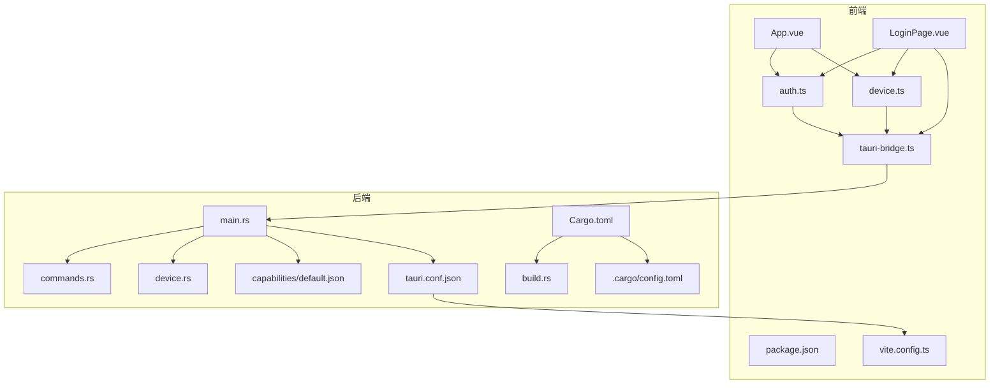
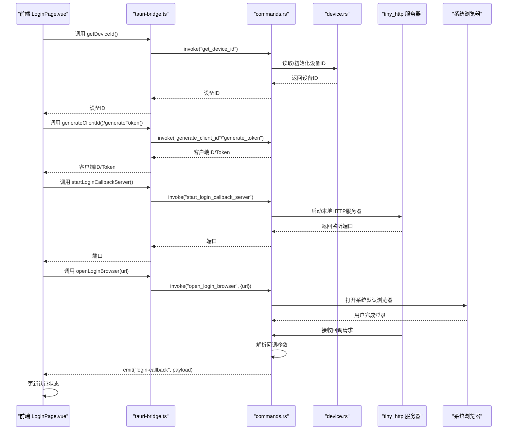
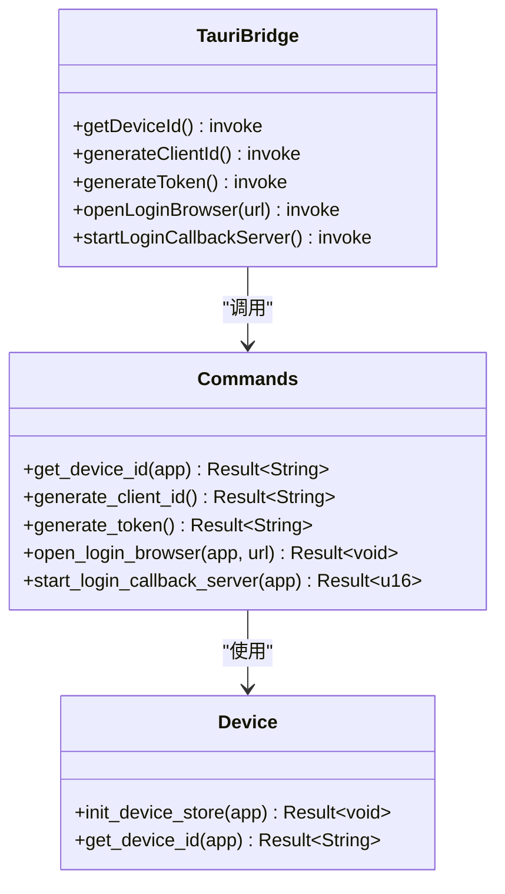
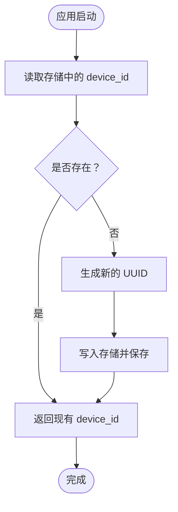
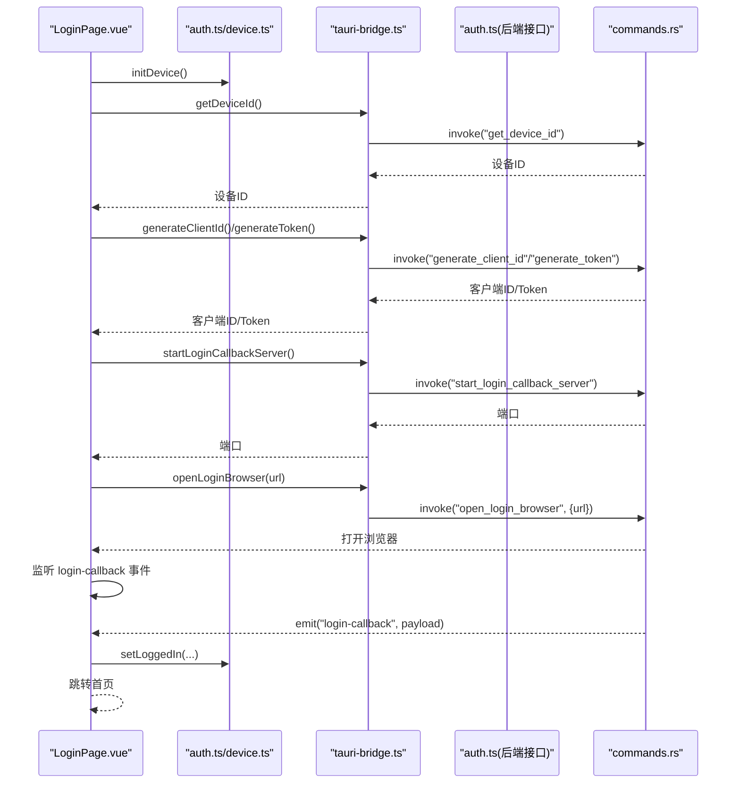
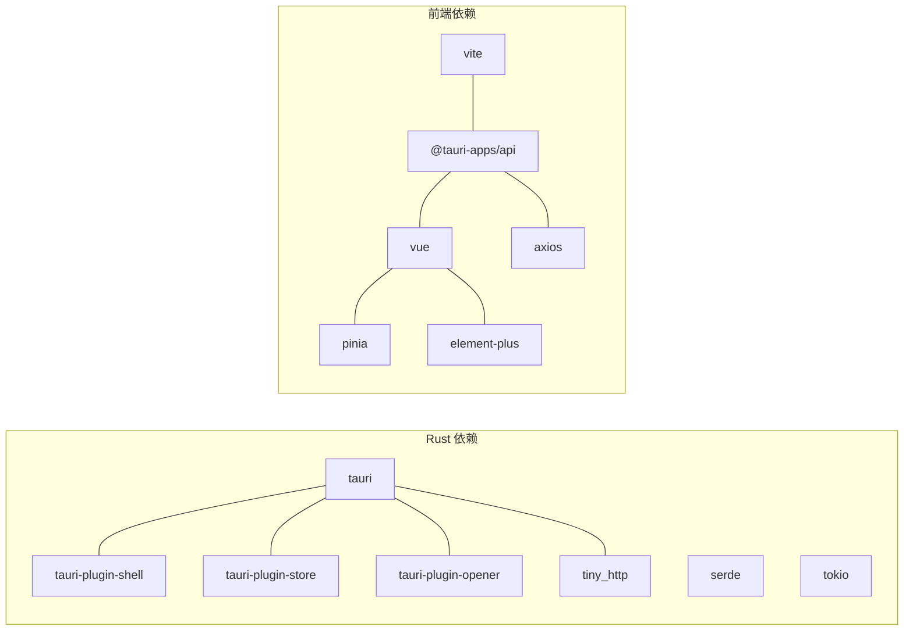

# 桌面应用开发

<cite>
**本文引用的文件**
- [Cargo.toml](file://CCC-BrowserV4/src-tauri/Cargo.toml)
- [tauri.conf.json](file://CCC-BrowserV4/src-tauri/tauri.conf.json)
- [main.rs](file://CCC-BrowserV4/src-tauri/src/main.rs)
- [commands.rs](file://CCC-BrowserV4/src-tauri/src/commands.rs)
- [device.rs](file://CCC-BrowserV4/src-tauri/src/device.rs)
- [default.json](file://CCC-BrowserV4/src-tauri/capabilities/default.json)
- [build.rs](file://CCC-BrowserV4/src-tauri/build.rs)
- [config.toml](file://CCC-BrowserV4/src-tauri/.cargo/config.toml)
- [tauri-bridge.ts](file://CCC-BrowserV4/frontend/src/utils/tauri-bridge.ts)
- [auth.ts](file://CCC-BrowserV4/frontend/src/stores/auth.ts)
- [device.ts](file://CCC-BrowserV4/frontend/src/stores/device.ts)
- [auth.ts](file://CCC-BrowserV4/frontend/src/api/auth.ts)
- [LoginPage.vue](file://CCC-BrowserV4/frontend/src/pages/LoginPage.vue)
- [App.vue](file://CCC-BrowserV4/frontend/src/App.vue)
- [package.json](file://CCC-BrowserV4/frontend/package.json)
- [vite.config.ts](file://CCC-BrowserV4/frontend/vite.config.ts)
</cite>

## 目录
1. [简介](#简介)
2. [项目结构](#项目结构)
3. [核心组件](#核心组件)
4. [架构总览](#架构总览)
5. [详细组件分析](#详细组件分析)
6. [依赖关系分析](#依赖关系分析)
7. [性能考虑](#性能考虑)
8. [故障排查指南](#故障排查指南)
9. [结论](#结论)
10. [附录](#附录)

## 简介
本项目是一个基于 Tauri 2.0 的跨平台桌面应用，采用 Rust 实现后端命令与系统能力，Vue 3 + TypeScript 实现前端界面与状态管理。应用通过 Tauri Bridge 在前端与原生能力之间建立通信，实现设备标识持久化、外部浏览器打开、本地回调服务器等核心功能，并提供完整的登录流程与状态管理。

## 项目结构
项目采用前后端分离的多模块组织方式：
- 前端：Vue 3 单页应用，使用 Vite 构建，Pinia 管理状态，Element Plus 提供 UI 组件。
- 后端：Tauri 应用，Rust 编写，通过命令系统暴露能力给前端。
- 资源：图标、窗口配置、权限声明、构建脚本等。

图表来源
- [main.rs:1-29](file://CCC-BrowserV4/src-tauri/src/main.rs#L1-L29)
- [commands.rs:1-92](file://CCC-BrowserV4/src-tauri/src/commands.rs#L1-L92)
- [device.rs:1-32](file://CCC-BrowserV4/src-tauri/src/device.rs#L1-L32)
- [tauri.conf.json:1-29](file://CCC-BrowserV4/src-tauri/tauri.conf.json#L1-L29)
- [default.json:1-13](file://CCC-BrowserV4/src-tauri/capabilities/default.json#L1-L13)
- [tauri-bridge.ts:1-33](file://CCC-BrowserV4/frontend/src/utils/tauri-bridge.ts#L1-L33)
- [auth.ts:1-79](file://CCC-BrowserV4/frontend/src/stores/auth.ts#L1-L79)
- [device.ts:1-40](file://CCC-BrowserV4/frontend/src/stores/device.ts#L1-L40)
- [auth.ts:1-67](file://CCC-BrowserV4/frontend/src/api/auth.ts#L1-L67)
- [LoginPage.vue:1-228](file://CCC-BrowserV4/frontend/src/pages/LoginPage.vue#L1-L228)
- [App.vue:1-21](file://CCC-BrowserV4/frontend/src/App.vue#L1-L21)
- [package.json:1-29](file://CCC-BrowserV4/frontend/package.json#L1-L29)
- [vite.config.ts:1-35](file://CCC-BrowserV4/frontend/vite.config.ts#L1-L35)
- [Cargo.toml:1-22](file://CCC-BrowserV4/src-tauri/Cargo.toml#L1-L22)
- [build.rs:1-4](file://CCC-BrowserV4/src-tauri/build.rs#L1-L4)
- [config.toml:1-16](file://CCC-BrowserV4/src-tauri/.cargo/config.toml#L1-L16)

章节来源
- [main.rs:1-29](file://CCC-BrowserV4/src-tauri/src/main.rs#L1-L29)
- [tauri.conf.json:1-29](file://CCC-BrowserV4/src-tauri/tauri.conf.json#L1-L29)
- [Cargo.toml:1-22](file://CCC-BrowserV4/src-tauri/Cargo.toml#L1-L22)

## 核心组件
- Tauri 命令系统：通过装饰器注册命令，统一由 invoke_handler 注册，前端通过 @tauri-apps/api 调用。
- 设备标识持久化：使用 tauri-plugin-store 将设备 ID 写入本地 JSON 文件，应用启动时初始化。
- 外部浏览器打开：通过 tauri-plugin-shell 的 opener 打开系统默认浏览器。
- 本地回调服务器：启动 tiny_http 监听本地随机端口，接收登录回调并通过事件通知前端。
- 前端状态管理：Pinia 管理认证与设备信息，localStorage 持久化登录态。
- 登录流程：前端生成 client_id 与 token，启动本地回调服务器，打开外部浏览器完成登录，接收回调并更新状态。

章节来源
- [commands.rs:1-92](file://CCC-BrowserV4/src-tauri/src/commands.rs#L1-L92)
- [device.rs:1-32](file://CCC-BrowserV4/src-tauri/src/device.rs#L1-L32)
- [tauri-bridge.ts:1-33](file://CCC-BrowserV4/frontend/src/utils/tauri-bridge.ts#L1-L33)
- [auth.ts:1-79](file://CCC-BrowserV4/frontend/src/stores/auth.ts#L1-L79)
- [auth.ts:1-67](file://CCC-BrowserV4/frontend/src/api/auth.ts#L1-L67)
- [LoginPage.vue:1-228](file://CCC-BrowserV4/frontend/src/pages/LoginPage.vue#L1-L228)

## 架构总览
下图展示了从前端发起登录请求到后端启动回调服务器、打开浏览器、接收回调并返回前端的完整流程。

图表来源
- [commands.rs:1-92](file://CCC-BrowserV4/src-tauri/src/commands.rs#L1-L92)
- [device.rs:1-32](file://CCC-BrowserV4/src-tauri/src/device.rs#L1-L32)
- [tauri-bridge.ts:1-33](file://CCC-BrowserV4/frontend/src/utils/tauri-bridge.ts#L1-L33)
- [auth.ts:1-67](file://CCC-BrowserV4/frontend/src/api/auth.ts#L1-L67)
- [LoginPage.vue:1-228](file://CCC-BrowserV4/frontend/src/pages/LoginPage.vue#L1-L228)

## 详细组件分析

### Tauri 命令系统与桥接
- 命令注册：在主程序中通过 invoke_handler 注册命令，统一暴露给前端。
- 参数与返回值：命令函数接收 AppHandle 或自定义参数，返回 Result 类型；前端通过 invoke 调用，自动序列化/反序列化。
- 权限控制：通过 capabilities/default.json 声明 shell/store/opener 权限，确保最小权限原则。

图表来源
- [main.rs:12-18](file://CCC-BrowserV4/src-tauri/src/main.rs#L12-L18)
- [commands.rs:10-92](file://CCC-BrowserV4/src-tauri/src/commands.rs#L10-L92)
- [device.rs:5-31](file://CCC-BrowserV4/src-tauri/src/device.rs#L5-L31)
- [tauri-bridge.ts:6-32](file://CCC-BrowserV4/frontend/src/utils/tauri-bridge.ts#L6-L32)

章节来源
- [main.rs:7-27](file://CCC-BrowserV4/src-tauri/src/main.rs#L7-L27)
- [default.json:6-12](file://CCC-BrowserV4/src-tauri/capabilities/default.json#L6-L12)
- [tauri-bridge.ts:1-33](file://CCC-BrowserV4/frontend/src/utils/tauri-bridge.ts#L1-L33)

### 设备标识持久化与本地存储
- 初始化：应用启动时检查设备 ID 是否存在，不存在则生成并保存至 JSON 存储。
- 访问：后续通过命令读取，保证跨会话一致性。
- 存储位置：JSON 文件由插件维护，避免手动路径管理。

图表来源
- [device.rs:6-20](file://CCC-BrowserV4/src-tauri/src/device.rs#L6-L20)
- [main.rs:19-25](file://CCC-BrowserV4/src-tauri/src/main.rs#L19-L25)

章节来源
- [device.rs:1-32](file://CCC-BrowserV4/src-tauri/src/device.rs#L1-L32)
- [main.rs:19-25](file://CCC-BrowserV4/src-tauri/src/main.rs#L19-L25)

### 登录流程与前端交互
- 前端状态：Pinia 管理登录态与用户信息，localStorage 用于持久化恢复。
- 流程：生成 client_id 与 token，启动本地回调服务器，构造登录 URL，打开系统浏览器，监听 login-callback 事件，完成后跳转首页。
- 开发模式：若后端不可用，回退到本地虚拟登录。

图表来源
- [LoginPage.vue:79-169](file://CCC-BrowserV4/frontend/src/pages/LoginPage.vue#L79-L169)
- [auth.ts:25-66](file://CCC-BrowserV4/frontend/src/api/auth.ts#L25-L66)
- [auth.ts:5-79](file://CCC-BrowserV4/frontend/src/stores/auth.ts#L5-L79)
- [device.ts:12-16](file://CCC-BrowserV4/frontend/src/stores/device.ts#L12-L16)
- [tauri-bridge.ts:10-31](file://CCC-BrowserV4/frontend/src/utils/tauri-bridge.ts#L10-L31)
- [commands.rs:44-91](file://CCC-BrowserV4/src-tauri/src/commands.rs#L44-L91)

章节来源
- [LoginPage.vue:1-228](file://CCC-BrowserV4/frontend/src/pages/LoginPage.vue#L1-L228)
- [auth.ts:1-67](file://CCC-BrowserV4/frontend/src/api/auth.ts#L1-L67)
- [auth.ts:1-79](file://CCC-BrowserV4/frontend/src/stores/auth.ts#L1-L79)
- [device.ts:1-40](file://CCC-BrowserV4/frontend/src/stores/device.ts#L1-L40)
- [tauri-bridge.ts:1-33](file://CCC-BrowserV4/frontend/src/utils/tauri-bridge.ts#L1-L33)

### 安全与 CSP 配置
- 内容安全策略：仅允许同源脚本、内联样式、特定连接目标（本地回环与指定域名），降低 XSS 与不安全连接风险。
- 权限最小化：通过 capabilities 显式声明所需权限，避免授予无关能力。

章节来源
- [tauri.conf.json:24-26](file://CCC-BrowserV4/src-tauri/tauri.conf.json#L24-L26)
- [default.json:6-12](file://CCC-BrowserV4/src-tauri/capabilities/default.json#L6-L12)

## 依赖关系分析
- Rust 依赖：tauri、tauri-plugin-shell、tauri-plugin-store、tauri-plugin-opener、serde、tokio、tiny_http 等。
- 前端依赖：@tauri-apps/api、vue、pinia、element-plus、axios、vite 等。
- 构建链路：build.rs 触发 tauri_build，生成权限与 schema；Cargo.toml 管理 Rust 依赖；package.json 管理前端依赖与脚本。

图表来源
- [Cargo.toml:9-21](file://CCC-BrowserV4/src-tauri/Cargo.toml#L9-L21)
- [package.json:12-27](file://CCC-BrowserV4/frontend/package.json#L12-L27)
- [build.rs:1-4](file://CCC-BrowserV4/src-tauri/build.rs#L1-L4)

章节来源
- [Cargo.toml:1-22](file://CCC-BrowserV4/src-tauri/Cargo.toml#L1-L22)
- [package.json:1-29](file://CCC-BrowserV4/frontend/package.json#L1-L29)
- [build.rs:1-4](file://CCC-BrowserV4/src-tauri/build.rs#L1-L4)

## 性能考虑
- 命令调用：尽量减少频繁小粒度调用，合并必要参数，避免阻塞主线程。
- 本地回调：tiny_http 仅处理一次请求，避免长连接开销；注意端口冲突与防火墙影响。
- 前端渲染：组件按需加载、状态分片，避免不必要的响应式计算。
- 构建优化：生产环境启用压缩与源码映射开关，合理设置目标浏览器兼容性。

## 故障排查指南
- 命令未注册：确认 main.rs 中 invoke_handler 已包含对应命令；检查命令名与前端调用一致。
- 权限不足：检查 capabilities/default.json 是否包含 shell/store/opener 权限。
- 回调服务器无法启动：检查端口占用与防火墙；确认本地回环地址可达。
- 浏览器无法打开：验证系统默认浏览器配置；检查 URL 格式与协议支持。
- 设备 ID 为空：确认 device.rs 初始化逻辑执行且存储保存成功；检查文件权限。

章节来源
- [main.rs:12-18](file://CCC-BrowserV4/src-tauri/src/main.rs#L12-L18)
- [default.json:6-12](file://CCC-BrowserV4/src-tauri/capabilities/default.json#L6-L12)
- [commands.rs:44-91](file://CCC-BrowserV4/src-tauri/src/commands.rs#L44-L91)
- [device.rs:6-20](file://CCC-BrowserV4/src-tauri/src/device.rs#L6-L20)

## 结论
该桌面应用以 Tauri 2.0 为核心，结合 Rust 的高性能与安全性，以及 Vue 3 的现代前端生态，实现了稳定的跨平台桌面体验。通过命令系统与桥接层，应用在本地存储、系统集成与安全策略方面具备清晰的设计与实现。登录流程覆盖开发与生产两种场景，具备良好的可维护性与扩展性。

## 附录

### 跨平台部署要点
- Windows/macOS/Linux：Tauri 支持三平台统一构建，需分别配置签名与打包参数；Windows 使用 pfx 证书，macOS 使用 Apple Developer 证书。
- 打包产物：根据平台输出对应安装包或便携版本；建议在 CI 中缓存 Cargo 与 npm 依赖以提升速度。
- 自动更新：可结合 Tauri Updater 插件实现增量更新，需在服务端准备更新元数据与签名。

### 前端与后端通信协议
- 命令命名：遵循语义化命名，如 get_device_id、open_login_browser。
- 参数传递：优先使用对象参数，便于扩展；避免传递大对象，必要时拆分多次调用。
- 错误处理：命令返回 Result 类型，前端统一捕获并提示；事件用于异步通知，如 login-callback。

### 安全最佳实践
- 最小权限：仅授予业务所需的系统能力。
- 输入校验：对来自浏览器回调的参数进行严格解析与校验。
- 密钥管理：client_id 与 token 仅在内存中使用，避免持久化敏感信息。
- 内容安全：CSP 限制脚本与连接来源，防止注入攻击。