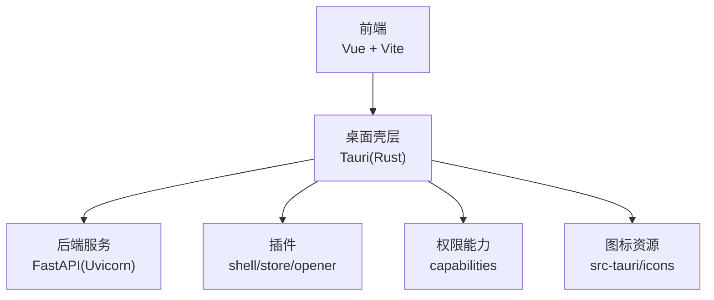
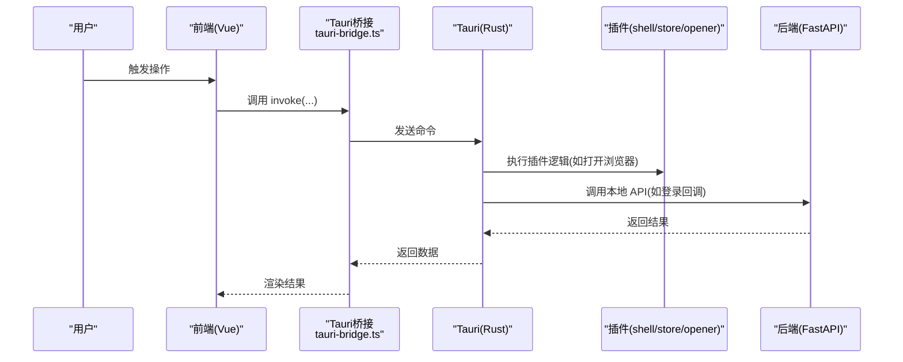
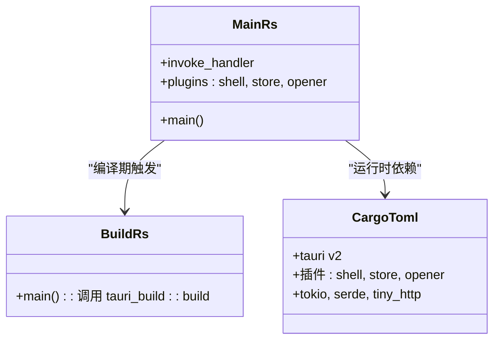
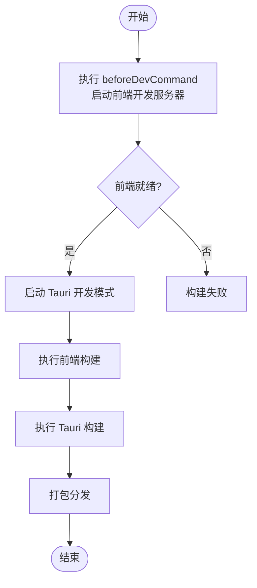
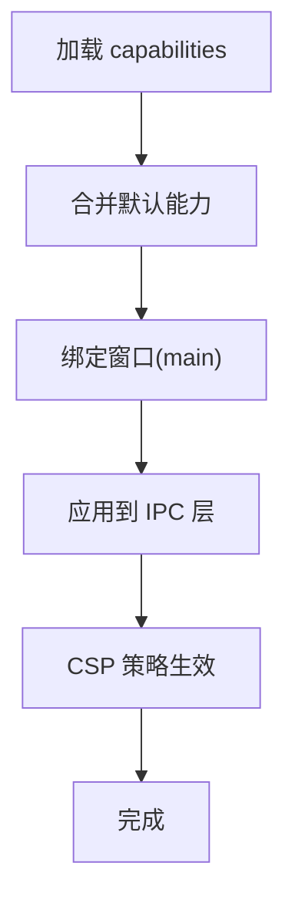
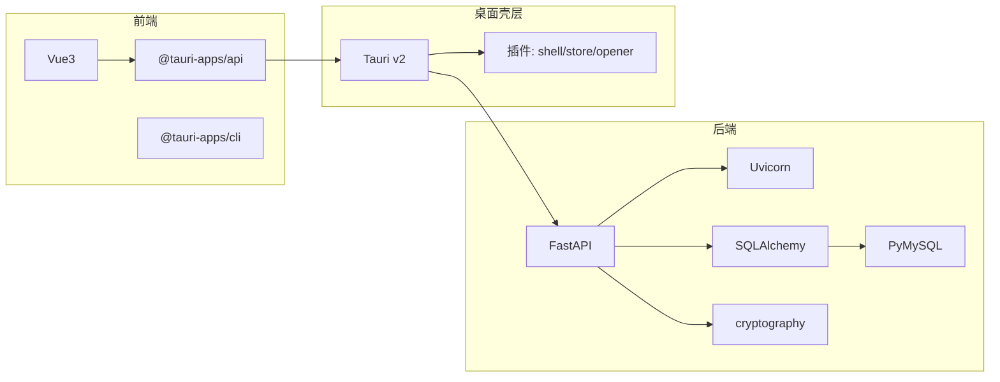

# 跨平台部署

<cite>
**本文引用的文件**
- [Cargo.toml](file://CCC-BrowserV4/src-tauri/Cargo.toml)
- [tauri.conf.json](file://CCC-BrowserV4/src-tauri/tauri.conf.json)
- [default.json](file://CCC-BrowserV4/src-tauri/capabilities/default.json)
- [build.rs](file://CCC-BrowserV4/src-tauri/build.rs)
- [.cargo/config.toml](file://CCC-BrowserV4/src-tauri/.cargo/config.toml)
- [package.json](file://CCC-BrowserV4/frontend/package.json)
- [vite.config.ts](file://CCC-BrowserV4/frontend/vite.config.ts)
- [main.rs](file://CCC-BrowserV4/src-tauri/src/main.rs)
- [tauri-bridge.ts](file://CCC-BrowserV4/frontend/src/utils/tauri-bridge.ts)
- [capabilities.json](file://CCC-BrowserV4/src-tauri/gen/schemas/capabilities.json)
- [desktop-schema.json](file://CCC-BrowserV4/src-tauri/gen/schemas/desktop-schema.json)
- [requirements.txt](file://CCC-BrowserV4/backend/requirements.txt)
</cite>

## 目录
1. [简介](#简介)
2. [项目结构](#项目结构)
3. [核心组件](#核心组件)
4. [架构总览](#架构总览)
5. [详细组件分析](#详细组件分析)
6. [依赖关系分析](#依赖关系分析)
7. [性能考虑](#性能考虑)
8. [故障排查指南](#故障排查指南)
9. [结论](#结论)
10. [附录](#附录)

## 简介
本文件面向跨平台部署场景，系统性梳理该 Tauri 应用在 Windows、macOS 与 Linux 平台上的差异化配置与部署流程。内容覆盖：
- 构建工具链：Rust 工具链、目标平台设置、依赖管理
- 权限模型：capabilities 配置文件的作用、默认权限与自定义权限
- 图标资源：平台特定图标格式与管理策略
- 打包与发布：签名、上架与自动更新（概念性指导）

## 项目结构
该项目采用“前端 Vue + 后端 Python（FastAPI）”的双栈架构，Tauri 作为桌面壳层承载前端界面与后端服务桥接。关键目录与职责如下：
- 前端：Vue3 + Vite，负责用户界面与调用 Tauri 命令
- 后端：Python FastAPI，提供任务执行、会话管理等 API
- 桌面壳层：Tauri（Rust），负责窗口、权限、插件与打包

图表来源
- [package.json:1-29](file://CCC-BrowserV4/frontend/package.json#L1-L29)
- [tauri.conf.json:1-29](file://CCC-BrowserV4/src-tauri/tauri.conf.json#L1-L29)
- [Cargo.toml:1-22](file://CCC-BrowserV4/src-tauri/Cargo.toml#L1-L22)
- [main.rs:1-29](file://CCC-BrowserV4/src-tauri/src/main.rs#L1-L29)

章节来源
- [package.json:1-29](file://CCC-BrowserV4/frontend/package.json#L1-L29)
- [tauri.conf.json:1-29](file://CCC-BrowserV4/src-tauri/tauri.conf.json#L1-L29)
- [Cargo.toml:1-22](file://CCC-BrowserV4/src-tauri/Cargo.toml#L1-L22)
- [main.rs:1-29](file://CCC-BrowserV4/src-tauri/src/main.rs#L1-L29)

## 核心组件
- 构建与运行时
  - Rust 工具链：使用 Tauri v2 及相关插件，通过 Cargo 管理依赖
  - 前端构建：Vite + Vue，开发与生产构建脚本由 package.json 定义
- 权限与安全
  - capabilities：以 JSON 文件定义窗口与权限边界，控制 IPC 访问
  - CSP：内联策略限制脚本、样式、连接源
- 插件生态
  - shell：打开外部程序或链接
  - store：键值存储
  - opener：系统默认应用打开文件/链接
- 图标与窗口
  - 图标资源位于 src-tauri/icons，用于打包阶段生成平台图标
  - 窗口尺寸、最小尺寸、居中等属性在 tauri.conf.json 中配置

章节来源
- [Cargo.toml:1-22](file://CCC-BrowserV4/src-tauri/Cargo.toml#L1-L22)
- [tauri.conf.json:12-27](file://CCC-BrowserV4/src-tauri/tauri.conf.json#L12-L27)
- [default.json:1-13](file://CCC-BrowserV4/src-tauri/capabilities/default.json#L1-L13)
- [main.rs:7-27](file://CCC-BrowserV4/src-tauri/src/main.rs#L7-L27)

## 架构总览
下图展示从用户操作到后端服务的整体调用链路，以及权限与插件在其中的角色。

图表来源
- [tauri-bridge.ts:1-32](file://CCC-BrowserV4/frontend/src/utils/tauri-bridge.ts#L1-L32)
- [main.rs:12-18](file://CCC-BrowserV4/src-tauri/src/main.rs#L12-L18)
- [tauri.conf.json:24-26](file://CCC-BrowserV4/src-tauri/tauri.conf.json#L24-L26)

## 详细组件分析

### Rust 构建与插件体系
- 依赖与特性
  - 使用 Tauri v2 与相关插件，启用 shell/store/opener 能力
  - tokio 全栈运行时，tiny_http 提供轻量 HTTP 服务
- 插件初始化
  - 在 main.rs 中注册插件，统一在 invoke_handler 中暴露命令
- 构建流程
  - build.rs 调用 tauri_build::build，驱动 Tauri 编译期生成与校验

图表来源
- [main.rs:7-27](file://CCC-BrowserV4/src-tauri/src/main.rs#L7-L27)
- [build.rs:1-4](file://CCC-BrowserV4/src-tauri/build.rs#L1-L4)
- [Cargo.toml:9-22](file://CCC-BrowserV4/src-tauri/Cargo.toml#L9-L22)

章节来源
- [Cargo.toml:1-22](file://CCC-BrowserV4/src-tauri/Cargo.toml#L1-L22)
- [main.rs:1-29](file://CCC-BrowserV4/src-tauri/src/main.rs#L1-L29)
- [build.rs:1-4](file://CCC-BrowserV4/src-tauri/build.rs#L1-L4)

### 前端构建与开发环境
- 开发与构建
  - package.json 定义 dev/build/tauri 脚本
  - Vite 配置包含代理、目标浏览器、调试开关与 sourcemap
- 开发服务器
  - tauri.conf.json 的 devUrl 指向前端本地地址
  - beforeDevCommand 自动启动前端开发服务器

图表来源
- [tauri.conf.json:6-11](file://CCC-BrowserV4/src-tauri/tauri.conf.json#L6-L11)
- [package.json:6-11](file://CCC-BrowserV4/frontend/package.json#L6-L11)
- [vite.config.ts:13-33](file://CCC-BrowserV4/frontend/vite.config.ts#L13-L33)

章节来源
- [package.json:1-29](file://CCC-BrowserV4/frontend/package.json#L1-L29)
- [vite.config.ts:1-35](file://CCC-BrowserV4/frontend/vite.config.ts#L1-L35)
- [tauri.conf.json:6-11](file://CCC-BrowserV4/src-tauri/tauri.conf.json#L6-L11)

### 权限与能力（capabilities）
- 默认能力
  - default.json 定义默认权限集合，包含 core、shell、store、opener
  - 通过 windows 字段绑定窗口名称，形成 IPC 访问边界
- 运行时映射
  - capabilities.json 为生成的运行时映射，default 能力被启用
- 窗口与平台
  - desktop-schema.json 定义了能力的结构与字段约束

图表来源
- [default.json:1-13](file://CCC-BrowserV4/src-tauri/capabilities/default.json#L1-L13)
- [capabilities.json:1-1](file://CCC-BrowserV4/src-tauri/gen/schemas/capabilities.json#L1-L1)
- [desktop-schema.json:27-39](file://CCC-BrowserV4/src-tauri/gen/schemas/desktop-schema.json#L27-L39)

章节来源
- [default.json:1-13](file://CCC-BrowserV4/src-tauri/capabilities/default.json#L1-L13)
- [capabilities.json:1-1](file://CCC-BrowserV4/src-tauri/gen/schemas/capabilities.json#L1-L1)
- [desktop-schema.json:14-39](file://CCC-BrowserV4/src-tauri/gen/schemas/desktop-schema.json#L14-L39)

### 安全策略（CSP）
- 内联 CSP
  - tauri.conf.json 的 security.csp 限制脚本、样式与连接源
  - 包含本地回环与特定域名，确保仅允许受控来源

章节来源
- [tauri.conf.json:24-26](file://CCC-BrowserV4/src-tauri/tauri.conf.json#L24-L26)

### 图标与窗口配置
- 图标资源
  - src-tauri/icons 目录存放图标，用于打包阶段生成平台图标
- 窗口属性
  - tauri.conf.json 的 windows 数组定义标题、尺寸、最小尺寸、可调整与居中

章节来源
- [tauri.conf.json:13-23](file://CCC-BrowserV4/src-tauri/tauri.conf.json#L13-L23)

## 依赖关系分析
- 前端依赖
  - @tauri-apps/api 与 @tauri-apps/cli 提供 IPC 与 CLI 能力
  - Vue3、Element Plus、Pinia、Axios 组成前端技术栈
- 后端依赖
  - FastAPI + Uvicorn 提供高性能异步服务
  - SQLAlchemy + PyMySQL + cryptography 提供数据库访问与加密
- Rust 依赖
  - Tauri v2 与插件，tokio、serde、tiny_http 等支撑运行时

图表来源
- [package.json:12-27](file://CCC-BrowserV4/frontend/package.json#L12-L27)
- [requirements.txt:1-13](file://CCC-BrowserV4/backend/requirements.txt#L1-L13)
- [Cargo.toml:9-22](file://CCC-BrowserV4/src-tauri/Cargo.toml#L9-L22)

章节来源
- [package.json:1-29](file://CCC-BrowserV4/frontend/package.json#L1-L29)
- [requirements.txt:1-13](file://CCC-BrowserV4/backend/requirements.txt#L1-L13)
- [Cargo.toml:1-22](file://CCC-BrowserV4/src-tauri/Cargo.toml#L1-L22)

## 性能考虑
- 前端构建
  - 生产构建启用压缩，调试模式关闭压缩并开启 sourcemap
  - 目标浏览器版本针对现代浏览器优化
- 后端性能
  - 使用异步 FastAPI + Uvicorn，适合高并发请求
- 桌面壳层
  - tokio 运行时提供异步事件循环，tiny_http 适合作为轻量本地服务

章节来源
- [vite.config.ts:29-33](file://CCC-BrowserV4/frontend/vite.config.ts#L29-L33)
- [requirements.txt:1-13](file://CCC-BrowserV4/backend/requirements.txt#L1-L13)
- [Cargo.toml:20-22](file://CCC-BrowserV4/src-tauri/Cargo.toml#L20-L22)

## 故障排查指南
- 构建失败
  - 检查 Rust 工具链与网络配置，确认 .cargo/config.toml 的镜像源可用
  - 确认 beforeDevCommand 能成功启动前端开发服务器
- 权限问题
  - 若页面无法调用命令，检查 default.json 是否包含所需权限
  - 确认窗口名称与 capabilities 的 windows 字段匹配
- CSP 导致的资源加载失败
  - 根据实际域名扩展 csp.connect-src 列表
- 插件行为异常
  - 检查 main.rs 中插件初始化顺序与命令注册

章节来源
- [.cargo/config.toml:1-16](file://CCC-BrowserV4/src-tauri/.cargo/config.toml#L1-L16)
- [tauri.conf.json:6-11](file://CCC-BrowserV4/src-tauri/tauri.conf.json#L6-L11)
- [default.json:1-13](file://CCC-BrowserV4/src-tauri/capabilities/default.json#L1-L13)
- [main.rs:9-11](file://CCC-BrowserV4/src-tauri/src/main.rs#L9-L11)

## 结论
本项目已具备跨平台部署的基础能力：统一的前端构建流程、明确的权限边界与插件体系、以及可扩展的后端服务。后续可在各平台实现签名、上架与自动更新的完整流水线，结合 capabilities 的细粒度权限控制，进一步提升安全性与用户体验。

## 附录

### 平台差异化配置与部署流程（Windows/macOS/Linux）
- Windows
  - 使用 Windows SDK 与 MSVC 工具链进行原生打包
  - 可选启用 tauri.windows.conf.json 进行平台特有配置
  - 代码签名：准备证书与时间戳服务器，配置 tauri.conf.json 的 bundle.signingIdentity 与 provider
  - 应用商店发布：遵循 Microsoft Store 审核规范，提交安装包与元数据
  - 自动更新：集成 tauri-plugin-updater 或第三方方案，配置更新通道与签名验证
- macOS
  - 使用 Xcode 工具链与 codesign 进行签名与公证
  - 可选启用 tauri.macos.conf.json 进行平台特有配置
  - 应用商店发布：遵循 Mac App Store 审核规范，提交 .app 或 .pkg 包
  - 自动更新：使用 Sparkle 或内置更新器，配置 DMG/PKG 签名与校验
- Linux
  - 使用本地 gnu 工具链，常见发行版打包格式为 AppImage、deb、rpm
  - 可选启用 tauri.linux.conf.json 进行平台特有配置
  - 应用商店发布：根据分发渠道（如 Flathub、Snap）准备沙箱与权限声明
  - 自动更新：基于发行版仓库或自建更新服务，确保签名与完整性校验

[本节为通用实践说明，不直接分析具体文件，故无章节来源]

### Rust 工具链与目标平台设置
- 工具链
  - 使用 rustup 管理稳定版与目标平台
  - 在 CI 中缓存 cargo registry 与构建产物，加速多平台构建
- 目标平台
  - 通过 rustup target add 添加 x86_64-pc-windows-gnu、aarch64-apple-darwin、x86_64-unknown-linux-gnu
  - 在 CI 中按平台分别构建并上传 Artifacts

[本节为通用实践说明，不直接分析具体文件，故无章节来源]

### 依赖库管理
- 前端
  - 使用 npm/yarn/pnpm 管理依赖，锁定版本于 package-lock.json
- 后端
  - 使用 requirements.txt 管理 Python 依赖，建议配合虚拟环境
- Rust
  - 使用 Cargo 管理依赖，.cargo/config.toml 配置镜像源与网络参数

章节来源
- [package.json:1-29](file://CCC-BrowserV4/frontend/package.json#L1-L29)
- [requirements.txt:1-13](file://CCC-BrowserV4/backend/requirements.txt#L1-L13)
- [.cargo/config.toml:1-16](file://CCC-BrowserV4/src-tauri/.cargo/config.toml#L1-L16)

### capabilities 配置详解
- 默认权限
  - core:default：基础命令访问
  - shell:allow-open：允许打开外部程序或链接
  - store:default：允许键值存储读写
  - opener:default：允许系统默认应用打开文件/链接
- 自定义权限
  - 可在 capabilities 下新增能力文件，限定窗口与路径范围
  - 通过 desktop-schema.json 的字段约束，确保结构正确

章节来源
- [default.json:6-11](file://CCC-BrowserV4/src-tauri/capabilities/default.json#L6-L11)
- [desktop-schema.json:27-39](file://CCC-BrowserV4/src-tauri/gen/schemas/desktop-schema.json#L27-L39)

### 图标资源管理
- 存放位置
  - src-tauri/icons 目录用于生成各平台图标
- 平台要求
  - Windows：推荐 ICO 格式，包含多种尺寸
  - macOS：推荐 PNG 或 ICNS，支持透明背景
  - Linux：推荐 PNG 多尺寸，适配不同 DPI
- 生成流程
  - 构建时由 Tauri 自动生成各平台图标，无需手动维护

章节来源
- [tauri.conf.json:13-23](file://CCC-BrowserV4/src-tauri/tauri.conf.json#L13-L23)

### 打包、签名与发布流程
- 打包
  - 前端：npm run build 生成 dist
  - 桌面壳层：tauri build 生成平台可执行文件
- 签名
  - Windows：使用 signtool 或第三方证书服务
  - macOS：使用 codesign 对 .app 进行签名与公证
  - Linux：生成 AppImage/deb/rpm 并附加校验信息
- 发布
  - Windows：Microsoft Store 或官网直发
  - macOS：Mac App Store 或官网直发
  - Linux：发行版仓库或应用商店
- 自动更新
  - 配置更新服务器与签名验证，确保下载包完整性与来源可信

[本节为通用实践说明，不直接分析具体文件，故无章节来源]