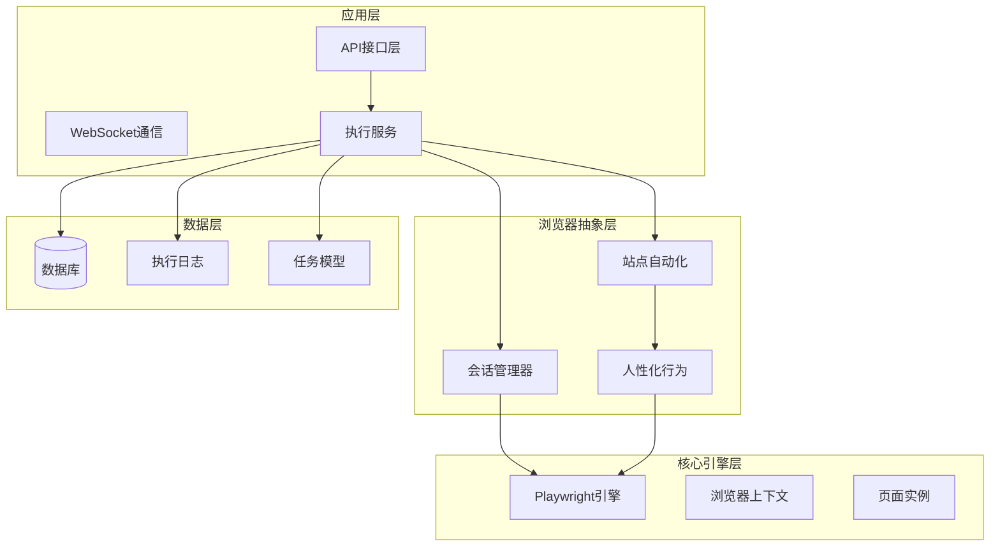
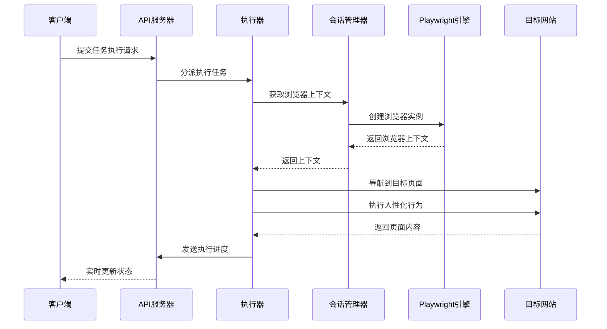
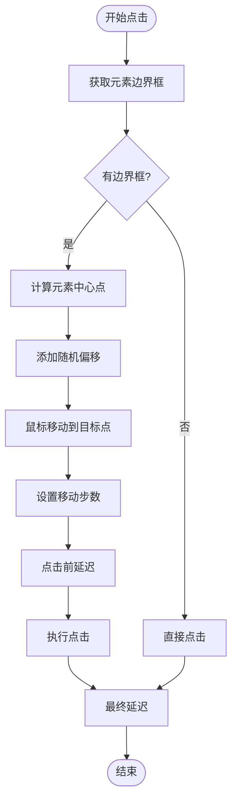
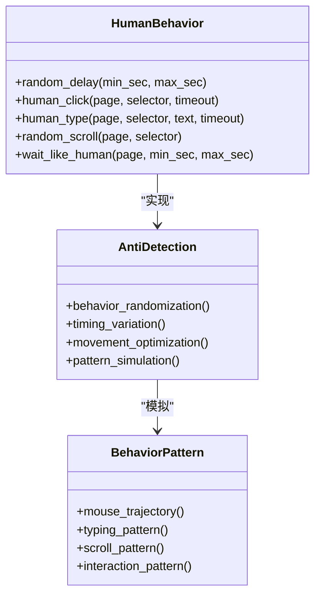
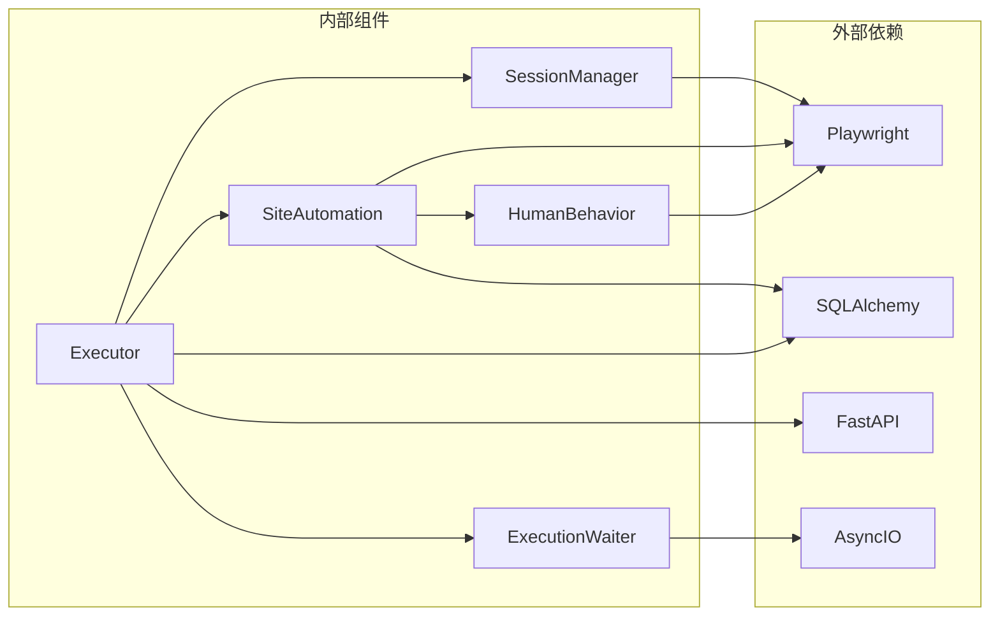

# 人性化行为模拟

<cite>
**本文档引用的文件**
- [human_behavior.py](file://CCC_RPA_API/app/browser/human_behavior.py)
- [site_automation.py](file://CCC_RPA_API/app/browser/site_automation.py)
- [session_manager.py](file://CCC_RPA_API/app/browser/session_manager.py)
- [executor.py](file://CCC_RPA_API/app/services/executor.py)
- [waiter.py](file://CCC_RPA_API/app/browser/waiter.py)
- [tasks.py](file://CCC_RPA_API/app/api/tasks.py)
- [manager.py](file://CCC_RPA_API/app/ws/manager.py)
- [main.py](file://CCC_RPA_API/app/main.py)
- [task.py](file://CCC_RPA_API/app/models/task.py)
- [execution_log.py](file://CCC_RPA_API/app/models/execution_log.py)
</cite>

## 目录
1. [简介](#简介)
2. [项目结构](#项目结构)
3. [核心组件](#核心组件)
4. [架构概览](#架构概览)
5. [详细组件分析](#详细组件分析)
6. [依赖关系分析](#依赖关系分析)
7. [性能考虑](#性能考虑)
8. [故障排除指南](#故障排除指南)
9. [结论](#结论)
10. [附录](#附录)

## 简介

人性化行为模拟系统是一个专为绕过网站行为分析而设计的自动化框架。该系统通过模拟真实用户的鼠标移动轨迹、键盘输入间隔和页面滚动行为，有效降低被检测为机器人程序的风险。系统采用Playwright作为底层浏览器引擎，结合Python的异步编程特性，实现了高度逼真的用户行为模拟。

该系统特别针对WZWS（Web行为分析）进行了优化，通过随机延迟、自然的鼠标移动和键盘输入模式，以及智能的页面交互策略，确保自动化操作看起来如同真实用户一般。

## 项目结构

项目采用清晰的分层架构，主要分为以下几个层次：

**图表来源**
- [main.py:1-127](file://CCC_RPA_API/app/main.py#L1-L127)
- [session_manager.py:1-183](file://CCC_RPA_API/app/browser/session_manager.py#L1-L183)
- [human_behavior.py:1-86](file://CCC_RPA_API/app/browser/human_behavior.py#L1-L86)

**章节来源**
- [main.py:1-127](file://CCC_RPA_API/app/main.py#L1-L127)
- [session_manager.py:1-183](file://CCC_RPA_API/app/browser/session_manager.py#L1-L183)

## 核心组件

### 人性化行为模拟器 (HumanBehavior)

HumanBehavior类是整个系统的核心，提供了三种主要的人性化行为模拟功能：

1. **鼠标点击模拟** - 模拟真实用户的点击行为，包括鼠标移动轨迹和随机延迟
2. **键盘输入模拟** - 模拟真实用户的打字行为，包括字符间的随机延迟
3. **页面滚动模拟** - 模拟真实用户的浏览行为，包括随机滚动和等待

### 站点自动化器 (SiteAutomation)

SiteAutomation类封装了特定网站的自动化操作逻辑，包括：
- 登录状态检查
- 页面导航和元素交互
- 数据抓取和业务处理
- 页面保活机制

### 会话管理器 (BrowserSessionManager)

BrowserSessionManager负责管理Playwright浏览器会话，确保：
- 多线程安全的浏览器操作
- 用户状态的持久化存储
- 自动化的会话恢复机制

**章节来源**
- [human_behavior.py:12-86](file://CCC_RPA_API/app/browser/human_behavior.py#L12-L86)
- [site_automation.py:16-586](file://CCC_RPA_API/app/browser/site_automation.py#L16-L586)
- [session_manager.py:7-183](file://CCC_RPA_API/app/browser/session_manager.py#L7-L183)

## 架构概览

系统采用异步事件驱动架构，通过专用的工作线程执行浏览器操作，避免与FastAPI的异步事件循环产生冲突。

**图表来源**
- [executor.py:68-308](file://CCC_RPA_API/app/services/executor.py#L68-L308)
- [session_manager.py:77-94](file://CCC_RPA_API/app/browser/session_manager.py#L77-L94)

**章节来源**
- [executor.py:1-308](file://CCC_RPA_API/app/services/executor.py#L1-L308)
- [session_manager.py:1-183](file://CCC_RPA_API/app/browser/session_manager.py#L1-L183)

## 详细组件分析

### 人性化行为模拟算法

#### 鼠标移动轨迹生成

系统通过以下策略生成逼真的鼠标移动轨迹：

**图表来源**
- [human_behavior.py:21-44](file://CCC_RPA_API/app/browser/human_behavior.py#L21-L44)

**算法特点**：
- **随机偏移**：在元素边界内添加0.3-0.7范围的随机偏移，模拟真实点击位置
- **分步移动**：使用5-15步的移动轨迹，避免直线移动
- **延迟控制**：点击前后添加0.1-0.8秒的随机延迟

#### 键盘输入间隔控制

键盘输入模拟采用逐字符输入策略：

**章节来源**
- [human_behavior.py:46-58](file://CCC_RPA_API/app/browser/human_behavior.py#L46-L58)

**输入策略**：
- **字符级延迟**：每个字符间延迟50-200毫秒
- **真实打字节奏**：模拟人类打字的不规律性
- **元素定位**：自动定位到第一个匹配元素

#### 页面滚动模拟

滚动行为通过随机化策略实现：

**章节来源**
- [human_behavior.py:60-79](file://CCC_RPA_API/app/browser/human_behavior.py#L60-L79)

**滚动策略**：
- **随机次数**：1-3次滚动动作
- **滚动幅度**：100-400像素的随机滚动
- **延迟间隔**：每次滚动后0.3-0.8秒延迟

### 反检测策略实现

系统采用多层次的反检测策略：

#### 行为特征伪装

**图表来源**
- [human_behavior.py:12-86](file://CCC_RPA_API/app/browser/human_behavior.py#L12-L86)

#### 访问模式模拟

系统通过以下方式模拟真实用户访问模式：

**章节来源**
- [site_automation.py:460-524](file://CCC_RPA_API/app/browser/site_automation.py#L460-L524)

**保活机制**：
- **多样化操作**：滚动、点击刷新、随机点击、等待
- **时间间隔**：30-120秒的随机间隔
- **状态检查**：实时检测待处理业务

### 页面滚动行为详解

#### 平滑滚动实现

系统通过Playwright的wheel API实现页面滚动：

**章节来源**
- [human_behavior.py:75-76](file://CCC_RPA_API/app/browser/human_behavior.py#L75-L76)

#### 滚动位置控制

滚动前的位置控制通过以下步骤实现：

1. **元素定位**：使用`scroll_into_view_if_needed()`确保元素可见
2. **边界检查**：验证元素边界框的有效性
3. **随机化处理**：添加适当的延迟和随机因素

#### 可视区域检测

系统通过多种方式检测页面可视区域：

**章节来源**
- [site_automation.py:526-578](file://CCC_RPA_API/app/browser/siteautomation.py#L526-L578)

**检测策略**：
- **徽章计数器**：查找`.badge`、`.count`等元素
- **关键词匹配**：搜索"待处理"、"未处理"等关键词
- **父元素关联**：通过父元素文本内容识别业务类型

## 依赖关系分析

系统采用松耦合的设计，各组件之间的依赖关系如下：

**图表来源**
- [executor.py:13-15](file://CCC_RPA_API/app/services/executor.py#L13-L15)
- [session_manager.py:4](file://CCC_RPA_API/app/browser/session_manager.py#L4)

**章节来源**
- [executor.py:1-308](file://CCC_RPA_API/app/services/executor.py#L1-L308)
- [session_manager.py:1-183](file://CCC_RPA_API/app/browser/session_manager.py#L1-L183)

## 性能考虑

### 线程安全设计

系统采用专用工作线程执行浏览器操作，避免与异步事件循环冲突：

**章节来源**
- [session_manager.py:39-74](file://CCC_RPA_API/app/browser/session_manager.py#L39-L74)

### 内存管理

- **上下文复用**：按省份缓存BrowserContext，减少创建开销
- **状态持久化**：自动保存和恢复浏览器状态
- **资源清理**：及时关闭不再使用的页面和上下文

### 网络优化

- **超时控制**：合理设置各种操作的超时时间
- **重试机制**：对关键操作实施有限重试
- **降级策略**：在失败时自动采用备用方案

## 故障排除指南

### 常见问题及解决方案

#### 浏览器会话异常

**症状**：执行过程中浏览器意外关闭
**解决**：系统自动检测并恢复会话，重新建立连接

**章节来源**
- [executor.py:42-59](file://CCC_RPA_API/app/services/executor.py#L42-L59)

#### 元素定位失败

**症状**：无法找到目标元素
**解决**：采用多选择器策略和降级方案

**章节来源**
- [site_automation.py:213-261](file://CCC_RPA_API/app/browser/site_automation.py#L213-L261)

#### 扫码登录超时

**症状**：用户扫码超时
**解决**：提供超时错误提示和重新开始选项

**章节来源**
- [executor.py:122-129](file://CCC_RPA_API/app/services/executor.py#L122-L129)

### 调试技巧

1. **启用详细日志**：查看`/tmp/`目录下的截图文件
2. **监控执行进度**：通过WebSocket实时查看执行状态
3. **检查浏览器状态**：确认Playwright进程正常运行

## 结论

人性化行为模拟系统通过精心设计的算法和策略，成功实现了对真实用户行为的高度仿真。系统的主要优势包括：

1. **逼真度高**：通过随机化和延迟控制，模拟真实用户的所有行为特征
2. **稳定性强**：完善的错误处理和会话恢复机制
3. **可扩展性好**：模块化设计便于功能扩展和定制
4. **易于集成**：提供完整的API接口和WebSocket通信

该系统为RPA应用提供了强大的技术支持，能够有效绕过各种行为分析检测，确保自动化操作的稳定性和可靠性。

## 附录

### 行为参数配置指南

#### 鼠标点击参数
- **随机偏移范围**：0.3-0.7（元素边界内的相对位置）
- **移动步数**：5-15步（模拟自然移动轨迹）
- **点击前延迟**：0.1-0.3秒
- **最终延迟**：0.3-0.8秒

#### 键盘输入参数
- **字符间延迟**：50-200毫秒
- **最小延迟**：0.5秒
- **最大延迟**：2.0秒

#### 滚动行为参数
- **滚动次数**：1-3次
- **滚动幅度**：100-400像素
- **滚动间隔**：0.3-0.8秒

### 自定义行为扩展方法

#### 添加新的行为类型

1. 在`HumanBehavior`类中添加新方法
2. 定义合适的参数范围和延迟策略
3. 确保与现有行为的一致性

#### 修改现有行为策略

1. 分析当前行为的统计特征
2. 调整随机参数的分布范围
3. 测试新策略的效果和稳定性

#### 集成新的反检测技术

1. 研究目标网站的行为分析机制
2. 设计相应的伪装策略
3. 实施并测试效果