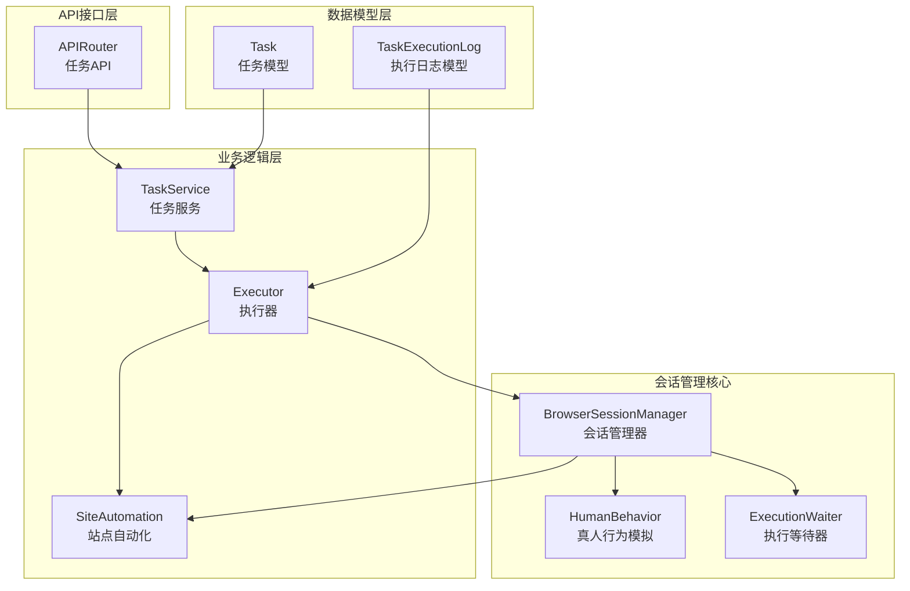
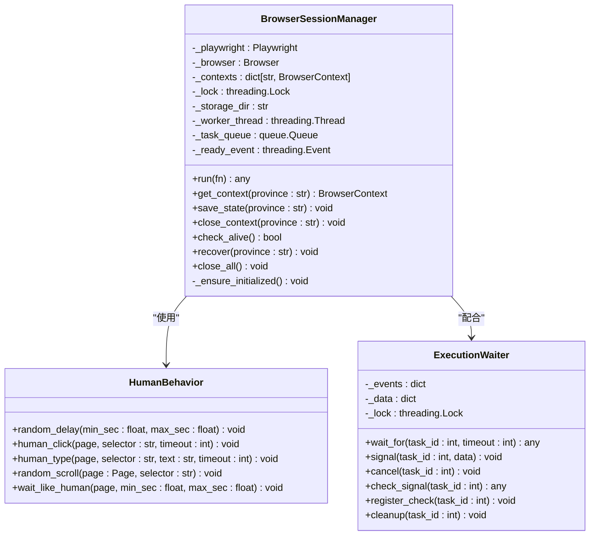
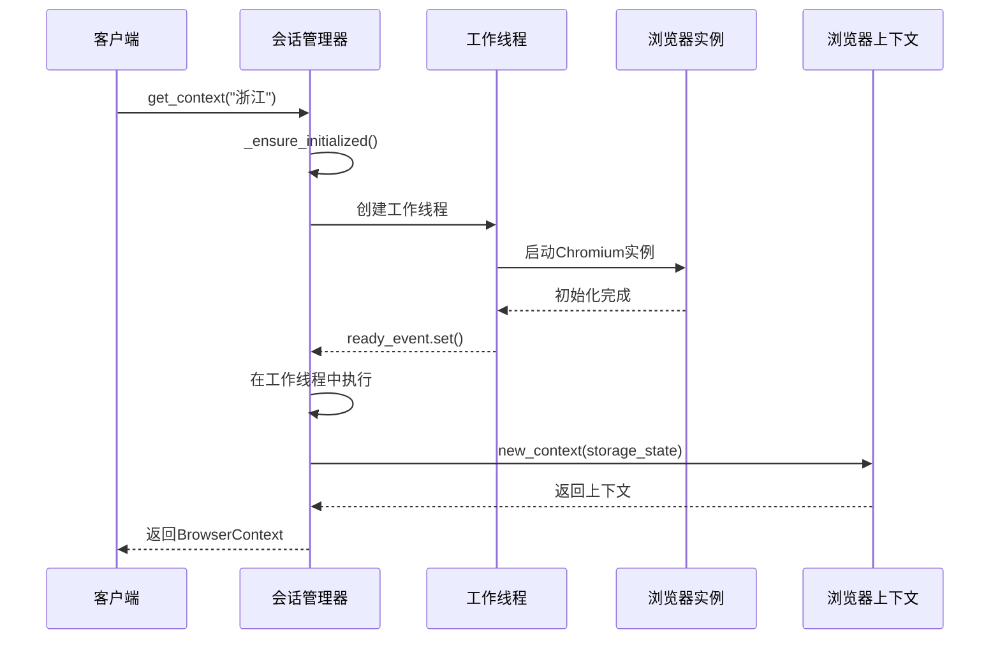
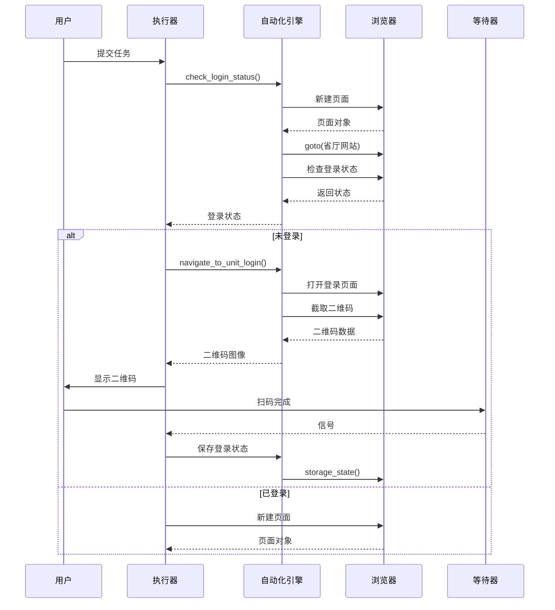
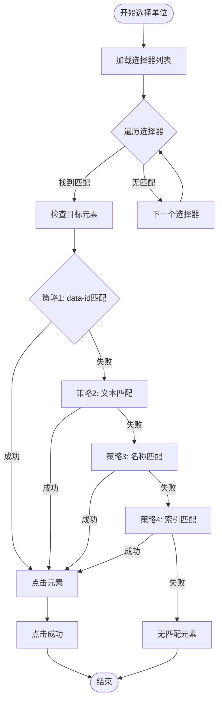
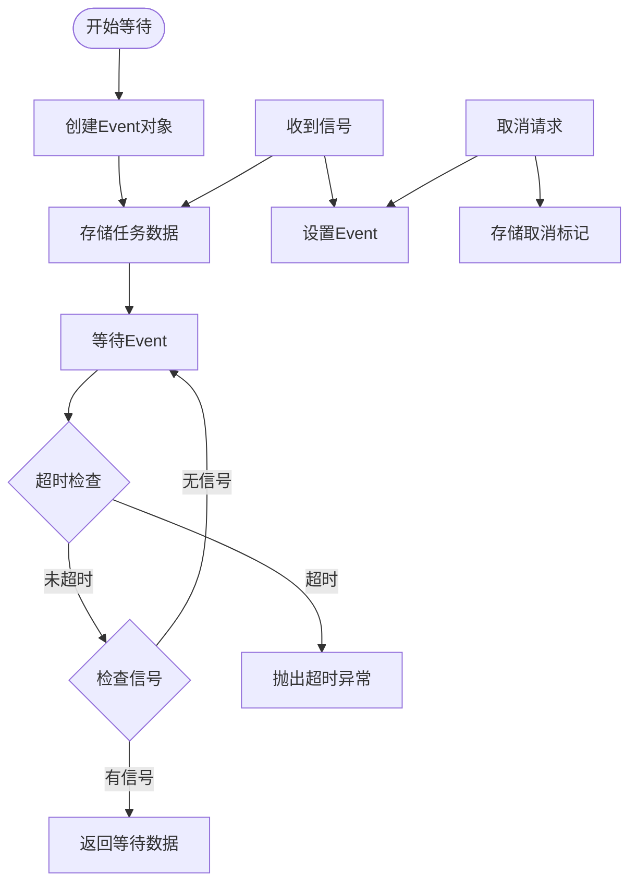
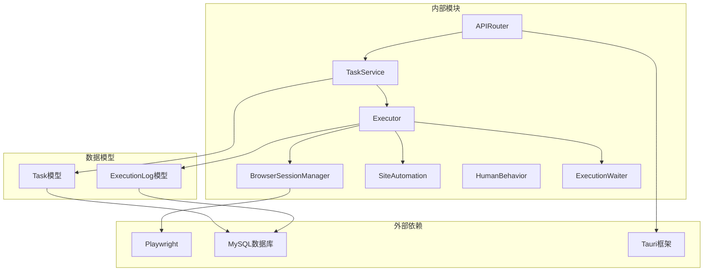

# 会话管理系统

<cite>
**本文档引用的文件**
- [session_manager.py](file://CCC_RPA_API/app/browser/session_manager.py)
- [site_automation.py](file://CCC_RPA_API/app/browser/site_automation.py)
- [human_behavior.py](file://CCC_RPA_API/app/browser/human_behavior.py)
- [waiter.py](file://CCC_RPA_API/app/browser/waiter.py)
- [executor.py](file://CCC_RPA_API/app/services/executor.py)
- [tasks.py](file://CCC_RPA_API/app/api/tasks.py)
- [task.py](file://CCC_RPA_API/app/models/task.py)
- [execution_log.py](file://CCC_RPA_API/app/models/execution_log.py)
- [config.py](file://CCC_RPA_API/app/config.py)
</cite>

## 目录
1. [简介](#简介)
2. [项目结构](#项目结构)
3. [核心组件](#核心组件)
4. [架构概览](#架构概览)
5. [详细组件分析](#详细组件分析)
6. [依赖关系分析](#依赖关系分析)
7. [性能考虑](#性能考虑)
8. [故障排除指南](#故障排除指南)
9. [结论](#结论)

## 简介

会话管理系统是基于 Playwright 的 RPA（机器人流程自动化）平台的核心组件，专门设计用于管理浏览器会话状态，支持多省份并发操作和用户交互。该系统实现了以下关键功能：

- **浏览器会话生命周期管理**：创建、初始化、维护和销毁浏览器会话
- **多会话并发处理**：支持按省份隔离的多会话并发执行
- **会话状态持久化**：通过 storage_state 实现登录状态的持久化
- **异常恢复机制**：自动检测和恢复浏览器异常状态
- **用户交互协调**：通过 ExecutionWaiter 实现用户操作的异步等待

## 项目结构

会话管理系统主要位于 `CCC_RPA_API/app/browser/` 目录下，采用模块化设计：



**图表来源**
- [session_manager.py:1-183](file://CCC_RPA_API/app/browser/session_manager.py#L1-L183)
- [site_automation.py:1-562](file://CCC_RPA_API/app/browser/site_automation.py#L1-L562)
- [executor.py:1-308](file://CCC_RPA_API/app/services/executor.py#L1-L308)

**章节来源**
- [session_manager.py:1-183](file://CCC_RPA_API/app/browser/session_manager.py#L1-L183)
- [site_automation.py:1-562](file://CCC_RPA_API/app/browser/site_automation.py#L1-L562)
- [executor.py:1-308](file://CCC_RPA_API/app/services/executor.py#L1-L308)

## 核心组件

### BrowserSessionManager 类

BrowserSessionManager 是会话管理系统的核心类，负责管理 Playwright 浏览器实例和上下文。其主要特性包括：

- **专用工作线程**：所有 Playwright 操作都在独立的工作线程中执行，避免线程冲突
- **多会话隔离**：按省份维度管理不同的浏览器上下文，实现会话隔离
- **状态持久化**：通过 storage_state 文件实现登录状态的持久化
- **自动恢复**：检测浏览器异常并自动恢复会话

### SiteAutomation 类

SiteAutomation 封装了针对特定网站的自动化操作逻辑，包括：

- **登录状态检查**：验证用户是否已登录
- **扫码登录流程**：处理二维码登录的完整流程
- **单位选择**：自动化选择目标单位
- **业务保活**：维持会话活跃状态

### ExecutionWaiter 类

ExecutionWaiter 提供了基于 threading.Event 的异步等待机制：

- **用户交互等待**：等待用户完成扫码或选择单位等操作
- **任务取消支持**：支持任务取消信号的检测和处理
- **非阻塞检查**：提供非阻塞的信号检查功能

**章节来源**
- [session_manager.py:7-183](file://CCC_RPA_API/app/browser/session_manager.py#L7-L183)
- [site_automation.py:16-562](file://CCC_RPA_API/app/browser/site_automation.py#L16-L562)
- [waiter.py:7-84](file://CCC_RPA_API/app/browser/waiter.py#L7-L84)

## 架构概览

会话管理系统采用分层架构设计，确保各组件职责清晰且松耦合：

```mermaid
graph TB
subgraph "用户界面层"
UI[Web界面<br/>用户交互]
end
subgraph "API接口层"
API[FastAPI接口<br/>RESTful API]
end
subgraph "业务逻辑层"
EXEC[执行器<br/>任务执行]
WAIT[等待器<br/>用户交互]
TASK[任务服务<br/>任务管理]
end
subgraph "会话管理层"
SM[会话管理器<br/>Playwright管理]
CTX[上下文管理<br/>浏览器上下文]
STATE[状态持久化<br/>storage_state]
end
subgraph "数据访问层"
DB[(数据库)<br/>MySQL]
FS[(文件系统)<br/>状态文件]
end
UI --> API
API --> TASK
TASK --> EXEC
EXEC --> WAIT
EXEC --> SM
SM --> CTX
CTX --> STATE
STATE --> FS
EXEC --> DB
TASK --> DB
```

**图表来源**
- [executor.py:1-308](file://CCC_RPA_API/app/services/executor.py#L1-L308)
- [session_manager.py:1-183](file://CCC_RPA_API/app/browser/session_manager.py#L1-L183)
- [tasks.py:1-76](file://CCC_RPA_API/app/api/tasks.py#L1-L76)

## 详细组件分析

### BrowserSessionManager 组件分析

BrowserSessionManager 实现了完整的浏览器会话生命周期管理：

#### 类图设计



**图表来源**
- [session_manager.py:7-183](file://CCC_RPA_API/app/browser/session_manager.py#L7-L183)
- [human_behavior.py:12-86](file://CCC_RPA_API/app/browser/human_behavior.py#L12-L86)
- [waiter.py:7-84](file://CCC_RPA_API/app/browser/waiter.py#L7-L84)

#### 会话创建流程



**图表来源**
- [session_manager.py:27-123](file://CCC_RPA_API/app/browser/session_manager.py#L27-L123)

#### 会话状态管理机制

会话状态管理通过以下机制实现：

1. **活跃状态监控**：通过 `check_alive()` 方法定期检查浏览器连接状态
2. **超时处理**：工作线程中的任务执行设置了超时机制（120秒）
3. **异常恢复**：当检测到浏览器异常时，自动执行恢复流程

**章节来源**
- [session_manager.py:76-183](file://CCC_RPA_API/app/browser/session_manager.py#L76-L183)

### SiteAutomation 组件分析

SiteAutomation 实现了针对特定业务场景的自动化操作：

#### 登录流程序列图



**图表来源**
- [executor.py:68-185](file://CCC_RPA_API/app/services/executor.py#L68-L185)
- [site_automation.py:38-146](file://CCC_RPA_API/app/browser/site_automation.py#L38-L146)

#### 单位选择算法流程图



**图表来源**
- [site_automation.py:294-420](file://CCC_RPA_API/app/browser/site_automation.py#L294-L420)

**章节来源**
- [site_automation.py:16-562](file://CCC_RPA_API/app/browser/site_automation.py#L16-L562)

### ExecutionWaiter 组件分析

ExecutionWaiter 提供了灵活的异步等待机制：

#### 等待流程图



**图表来源**
- [waiter.py:14-84](file://CCC_RPA_API/app/browser/waiter.py#L14-L84)

**章节来源**
- [waiter.py:7-84](file://CCC_RPA_API/app/browser/waiter.py#L7-L84)

## 依赖关系分析

会话管理系统具有清晰的依赖层次结构：



**图表来源**
- [session_manager.py:4-5](file://CCC_RPA_API/app/browser/session_manager.py#L4-L5)
- [executor.py:13-15](file://CCC_RPA_API/app/services/executor.py#L13-L15)
- [config.py:2-3](file://CCC_RPA_API/app/config.py#L2-L3)

**章节来源**
- [session_manager.py:1-183](file://CCC_RPA_API/app/browser/session_manager.py#L1-L183)
- [executor.py:1-308](file://CCC_RPA_API/app/services/executor.py#L1-L308)
- [config.py:1-22](file://CCC_RPA_API/app/config.py#L1-L22)

## 性能考虑

会话管理系统在设计时充分考虑了性能优化：

### 内存使用控制

1. **上下文隔离**：每个省份维护独立的浏览器上下文，避免内存泄漏
2. **状态文件管理**：通过 storage_state 文件实现状态持久化，减少重复登录开销
3. **资源清理**：提供 `close_all()` 方法确保资源完全释放

### 进程管理策略

1. **专用工作线程**：所有 Playwright 操作在独立线程中执行，避免阻塞主线程
2. **线程池管理**：使用 ThreadPoolExecutor 管理任务执行线程
3. **超时控制**：为长时间运行的操作设置超时机制

### 并发处理优化

1. **队列调度**：通过 queue.Queue 实现任务的有序执行
2. **锁机制**：使用 threading.Lock 确保线程安全
3. **异步等待**：ExecutionWaiter 支持非阻塞的等待机制

## 故障排除指南

### 常见问题及解决方案

#### 浏览器初始化失败

**症状**：会话管理器启动时抛出初始化失败异常

**原因分析**：
- Playwright 启动失败
- Chromium 启动参数配置错误
- 系统环境不满足要求

**解决步骤**：
1. 检查 Playwright 版本兼容性
2. 验证系统依赖是否安装
3. 确认启动参数配置正确

#### 会话超时问题

**症状**：任务执行过程中出现超时异常

**原因分析**：
- 网络连接不稳定
- 页面加载时间过长
- 等待用户操作超时

**解决步骤**：
1. 增加超时时间配置
2. 优化网络连接
3. 检查页面加载状态

#### 内存泄漏问题

**症状**：长时间运行后内存使用持续增长

**原因分析**：
- 浏览器上下文未正确关闭
- 事件监听器未清理
- 状态文件未及时清理

**解决步骤**：
1. 定期调用 `close_all()` 方法
2. 检查上下文生命周期管理
3. 清理临时状态文件

**章节来源**
- [session_manager.py:76-93](file://CCC_RPA_API/app/browser/session_manager.py#L76-L93)
- [executor.py:257-303](file://CCC_RPA_API/app/services/executor.py#L257-L303)

## 结论

会话管理系统通过精心设计的架构和实现，提供了稳定可靠的浏览器会话管理能力。系统的主要优势包括：

1. **高可靠性**：完善的异常检测和恢复机制
2. **高性能**：专用工作线程和异步处理机制
3. **易扩展**：模块化设计支持功能扩展
4. **用户友好**：直观的 API 接口和错误处理

该系统为 RPA 业务提供了坚实的技术基础，能够有效支持复杂的自动化任务执行需求。通过合理的配置和使用，可以实现稳定高效的会话管理服务。