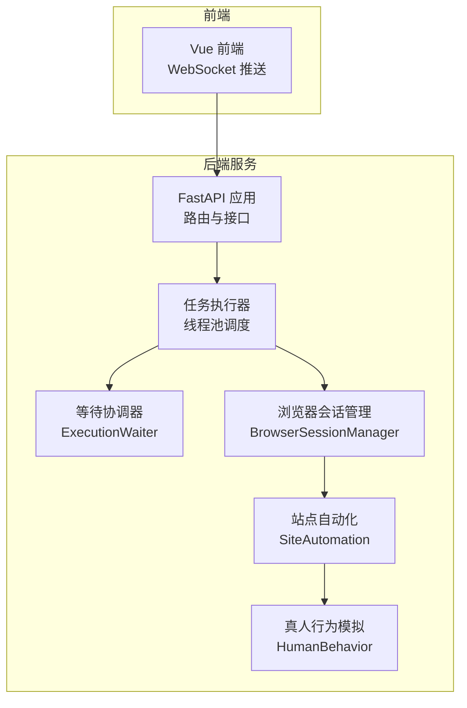
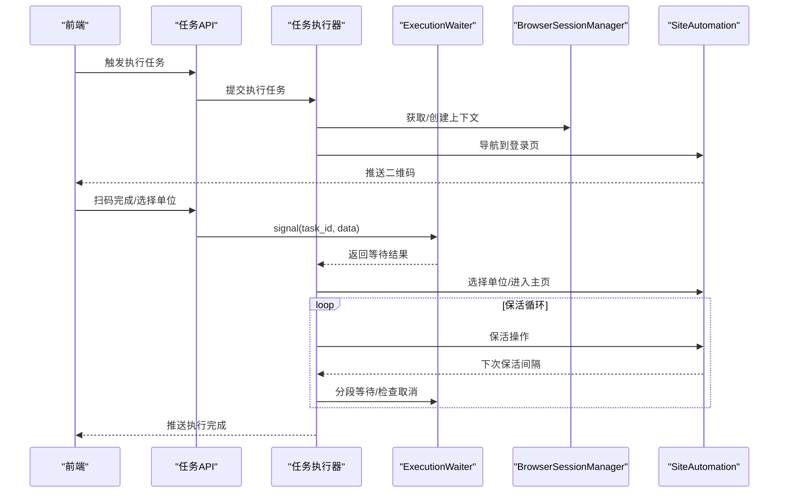
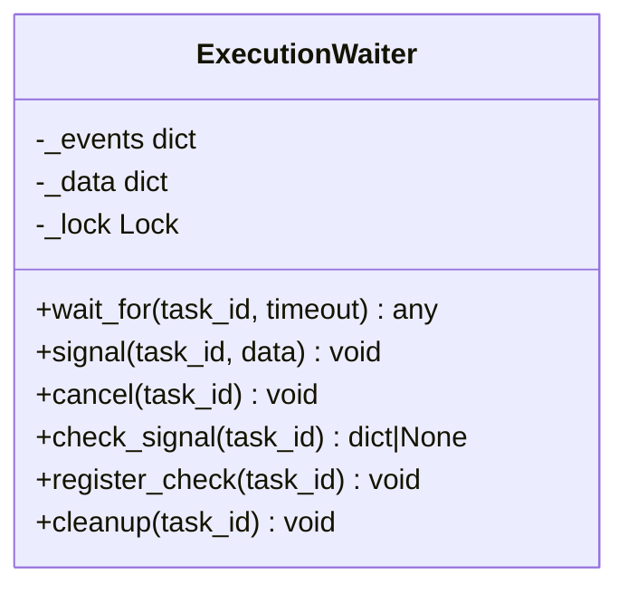
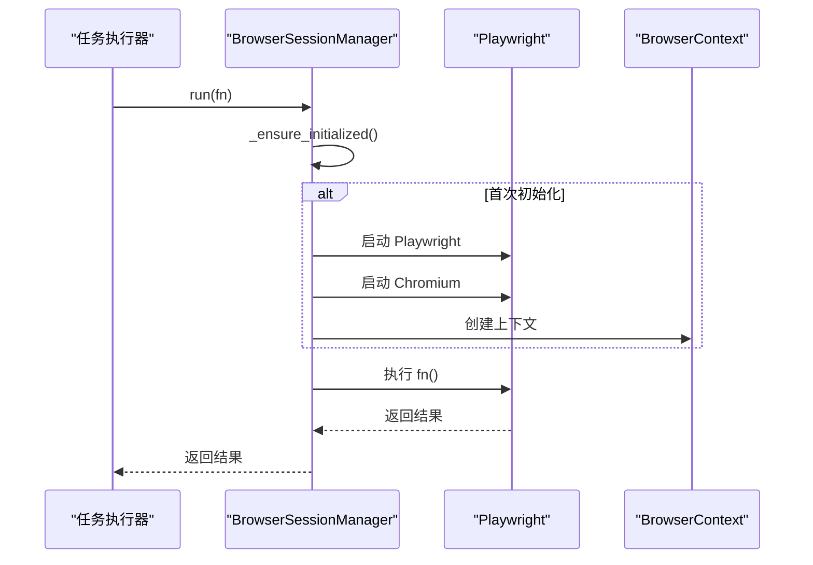
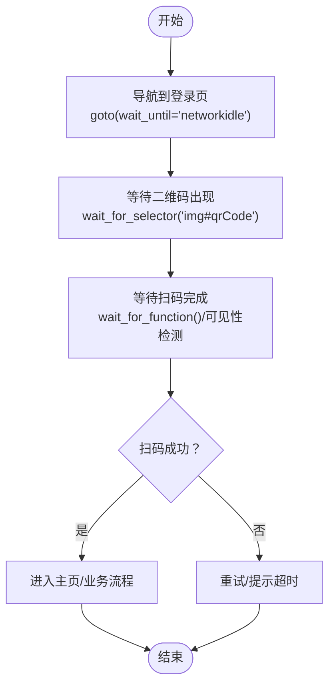
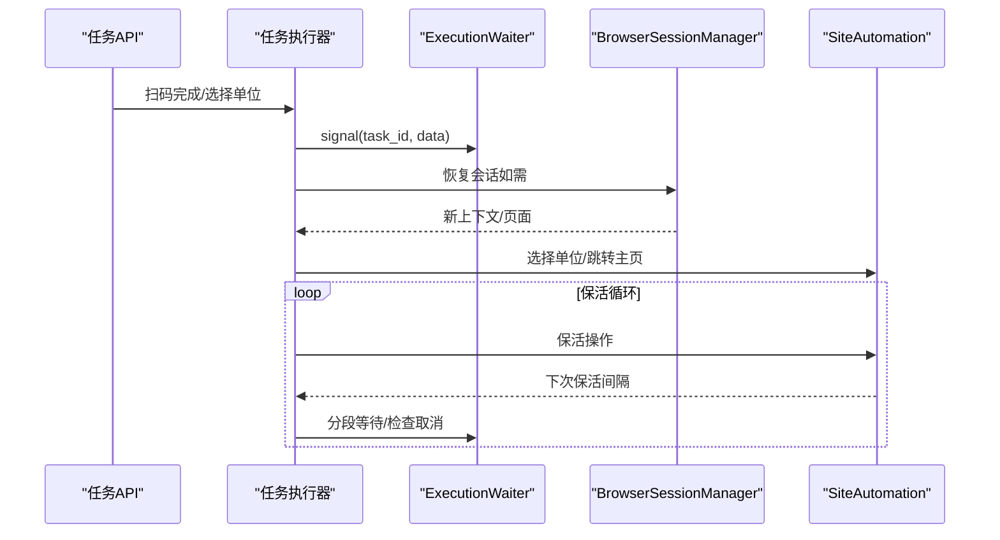
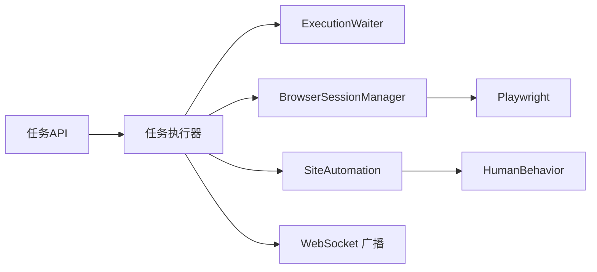

# 智能等待机制

<cite>
**本文档引用的文件**
- [waiter.py](file://CCC_RPA_API/app/browser/waiter.py)
- [session_manager.py](file://CCC_RPA_API/app/browser/session_manager.py)
- [site_automation.py](file://CCC_RPA_API/app/browser/site_automation.py)
- [human_behavior.py](file://CCC_RPA_API/app/browser/human_behavior.py)
- [executor.py](file://CCC_RPA_API/app/services/executor.py)
- [tasks.py](file://CCC_RPA_API/app/api/tasks.py)
- [main.py](file://CCC_RPA_API/app/main.py)
- [config.py](file://CCC_RPA_API/app/config.py)
</cite>

## 目录
1. [简介](#简介)
2. [项目结构](#项目结构)
3. [核心组件](#核心组件)
4. [架构总览](#架构总览)
5. [详细组件分析](#详细组件分析)
6. [依赖关系分析](#依赖关系分析)
7. [性能考虑](#性能考虑)
8. [故障排查指南](#故障排查指南)
9. [结论](#结论)
10. [附录](#附录)

## 简介
本技术文档围绕“智能等待机制”展开，系统性阐述 Waiter 的等待策略实现，包括元素可见性检测、网络请求监控和页面加载状态判断；深入说明动态等待算法，涵盖轮询机制、超时控制与条件判断逻辑；并覆盖多种等待场景的处理方式（AJAX 请求等待、DOM 元素加载、页面跳转完成检测），以及等待性能优化策略（智能等待时间计算与资源消耗控制）、错误处理机制（等待超时处理、异常捕获与重试策略）。最后提供配置示例与调试技巧，帮助读者在实际工程中高效落地。

## 项目结构
本项目采用前后端分离架构，后端基于 FastAPI 提供 API，前端基于 Vue + Tauri 构建桌面应用。RPA 核心逻辑位于后端 Python 服务中，浏览器自动化由 Playwright 在专用工作线程中执行，避免与 asyncio 事件循环冲突。

图表来源
- [main.py:30-127](file://CCC_RPA_API/app/main.py#L30-L127)
- [executor.py:18-318](file://CCC_RPA_API/app/services/executor.py#L18-L318)
- [waiter.py:7-84](file://CCC_RPA_API/app/browser/waiter.py#L7-L84)
- [session_manager.py:7-183](file://CCC_RPA_API/app/browser/session_manager.py#L7-L183)
- [site_automation.py:16-586](file://CCC_RPA_API/app/browser/site_automation.py#L16-L586)
- [human_behavior.py:12-86](file://CCC_RPA_API/app/browser/human_behavior.py#L12-L86)

章节来源
- [main.py:30-127](file://CCC_RPA_API/app/main.py#L30-L127)
- [executor.py:18-318](file://CCC_RPA_API/app/services/executor.py#L18-L318)

## 核心组件
- ExecutionWaiter：基于 threading.Event 的轻量级等待/唤醒机制，支持阻塞等待、非阻塞检查、取消信号与资源清理，用于协调用户交互与任务执行。
- BrowserSessionManager：Playwright 专用工作线程管理器，负责浏览器实例生命周期、上下文复用、线程安全的任务提交与结果返回，并提供会话恢复能力。
- SiteAutomation：面向站点的自动化流程封装，包含登录状态检查、扫码登录、单位选择、页面保活与业务检测等，广泛使用 Playwright 的等待 API。
- HumanBehavior：真人行为模拟工具，提供元素可见等待、鼠标移动与点击、键盘输入、随机滚动与等待等方法，增强自动化稳定性。
- 任务执行器与 API：通过线程池隔离阻塞等待，避免阻塞 Playwright 工作线程；通过 WebSocket 推送执行进度与状态。

章节来源
- [waiter.py:7-84](file://CCC_RPA_API/app/browser/waiter.py#L7-L84)
- [session_manager.py:7-183](file://CCC_RPA_API/app/browser/session_manager.py#L7-L183)
- [site_automation.py:16-586](file://CCC_RPA_API/app/browser/site_automation.py#L16-L586)
- [human_behavior.py:12-86](file://CCC_RPA_API/app/browser/human_behavior.py#L12-L86)
- [executor.py:18-318](file://CCC_RPA_API/app/services/executor.py#L18-L318)
- [tasks.py:60-76](file://CCC_RPA_API/app/api/tasks.py#L60-L76)

## 架构总览
智能等待机制贯穿于任务执行的多个阶段：
- 用户交互等待：通过 ExecutionWaiter 在独立线程中阻塞等待前端扫码或选择单位的信号。
- 页面加载等待：通过 SiteAutomation 使用 Playwright 的 wait_for_selector、wait_for_load_state、wait_for_function 等 API 实现元素可见性检测与页面状态判断。
- 保活与业务触发：在长时间空闲状态下，通过保活循环检测待处理业务，必要时中断等待并执行业务逻辑。
- 超时与异常处理：统一的超时控制与异常捕获，结合会话恢复机制保证鲁棒性。

图表来源
- [executor.py:72-318](file://CCC_RPA_API/app/services/executor.py#L72-L318)
- [waiter.py:14-84](file://CCC_RPA_API/app/browser/waiter.py#L14-L84)
- [site_automation.py:174-586](file://CCC_RPA_API/app/browser/site_automation.py#L174-L586)
- [tasks.py:60-76](file://CCC_RPA_API/app/api/tasks.py#L60-L76)

## 详细组件分析

### ExecutionWaiter 组件分析
ExecutionWaiter 是智能等待机制的核心协调者，提供以下能力：
- 阻塞等待：wait_for(task_id, timeout) 在独立线程中阻塞，直到收到 signal 或超时。
- 唤醒与取消：signal(task_id, data) 唤醒等待；cancel(task_id) 发送取消信号；cleanup(task_id) 清理资源。
- 非阻塞检查：check_signal(task_id) 支持保活循环等场景的快速轮询，及时响应取消。
- 事件注册：register_check(task_id) 为保活循环注册可检查事件，便于分段等待。

图表来源
- [waiter.py:7-84](file://CCC_RPA_API/app/browser/waiter.py#L7-L84)

章节来源
- [waiter.py:7-84](file://CCC_RPA_API/app/browser/waiter.py#L7-L84)
- [executor.py:72-318](file://CCC_RPA_API/app/services/executor.py#L72-L318)
- [tasks.py:60-76](file://CCC_RPA_API/app/api/tasks.py#L60-L76)

### BrowserSessionManager 组件分析
BrowserSessionManager 负责 Playwright 的线程化执行与会话管理：
- 专用工作线程：启动专用线程运行 Playwright，避免与 asyncio 冲突；通过队列提交任务，Event 同步结果。
- 上下文管理：按省份维护 BrowserContext，自动持久化 storage_state，支持会话恢复与关闭。
- 存活检查与恢复：check_alive() 检查连接状态；recover() 在异常时重建浏览器与上下文。
- 超时控制：run() 与 get_context() 对外部调用设置超时，防止阻塞。

图表来源
- [session_manager.py:27-183](file://CCC_RPA_API/app/browser/session_manager.py#L27-L183)

章节来源
- [session_manager.py:7-183](file://CCC_RPA_API/app/browser/session_manager.py#L7-L183)

### SiteAutomation 组件分析
SiteAutomation 将智能等待策略应用于具体业务场景：
- 登录状态检查：通过 goto(wait_until="networkidle") 与 locator.is_visible() 检测登录态。
- 扫码等待：wait_for_function() 检测 URL 变化或成功元素，实现页面跳转完成检测。
- 单位选择：wait_for_load_state("domcontentloaded") 等待 DOM 加载完成，再进行元素定位与点击。
- 保活循环：keep_alive() 随机滚动/点击/等待，周期性检查待处理业务；wait_for_scan() 支持分段等待与取消。

图表来源
- [site_automation.py:60-192](file://CCC_RPA_API/app/browser/site_automation.py#L60-L192)

章节来源
- [site_automation.py:16-586](file://CCC_RPA_API/app/browser/site_automation.py#L16-L586)

### HumanBehavior 组件分析
HumanBehavior 提供更贴近真人的等待与交互策略：
- human_click/human_type：先等待元素可见，再进行鼠标移动与点击/键盘输入，提升稳定性。
- random_scroll：随机滚动页面，模拟真实浏览行为。
- wait_like_human：随机等待，降低被风控概率。

章节来源
- [human_behavior.py:12-86](file://CCC_RPA_API/app/browser/human_behavior.py#L12-L86)

### 任务执行器与 API 集成
任务执行器通过线程池隔离阻塞等待，避免阻塞 Playwright 工作线程：
- _wait_for_user()：在独立线程中调用 ExecutionWaiter.wait_for()，支持超时与取消。
- 保活循环：register_check() 注册事件，check_signal() 非阻塞检查取消；分段等待（每次最多等待固定时间）以快速响应取消。
- 会话恢复：_recover_checkpoint() 在浏览器异常时恢复会话并重新打开页面。

图表来源
- [executor.py:72-318](file://CCC_RPA_API/app/services/executor.py#L72-L318)
- [tasks.py:60-76](file://CCC_RPA_API/app/api/tasks.py#L60-L76)
- [waiter.py:14-84](file://CCC_RPA_API/app/browser/waiter.py#L14-L84)

章节来源
- [executor.py:72-318](file://CCC_RPA_API/app/services/executor.py#L72-L318)
- [tasks.py:60-76](file://CCC_RPA_API/app/api/tasks.py#L60-L76)

## 依赖关系分析
- API 层依赖任务执行器，任务执行器依赖等待协调器与浏览器会话管理器。
- 浏览器会话管理器依赖 Playwright，SiteAutomation 依赖 Playwright 的等待 API。
- 任务执行器通过 WebSocket 广播执行状态，前端实时接收并驱动用户交互。

图表来源
- [tasks.py:60-76](file://CCC_RPA_API/app/api/tasks.py#L60-L76)
- [executor.py:18-318](file://CCC_RPA_API/app/services/executor.py#L18-L318)
- [waiter.py:7-84](file://CCC_RPA_API/app/browser/waiter.py#L7-L84)
- [session_manager.py:7-183](file://CCC_RPA_API/app/browser/session_manager.py#L7-L183)
- [site_automation.py:16-586](file://CCC_RPA_API/app/browser/site_automation.py#L16-L586)
- [human_behavior.py:12-86](file://CCC_RPA_API/app/browser/human_behavior.py#L12-L86)

章节来源
- [main.py:30-127](file://CCC_RPA_API/app/main.py#L30-L127)
- [executor.py:18-318](file://CCC_RPA_API/app/services/executor.py#L18-L318)

## 性能考虑
- 线程隔离：阻塞等待在独立线程中执行，避免阻塞 Playwright 工作线程，提高并发效率。
- 分段等待：保活循环中将长等待拆分为小步长等待（例如每次最多等待固定秒数），以便快速响应取消信号。
- 智能等待时间：根据业务场景动态调整等待超时（如扫码等待、选择单位等待），减少无效等待。
- 资源消耗控制：通过 register_check 与 check_signal 实现非阻塞轮询，降低 CPU 占用；在保活循环中使用随机间隔，避免频繁轮询。
- 会话恢复：在浏览器异常时自动恢复，减少人工干预与重试成本。

章节来源
- [executor.py:72-318](file://CCC_RPA_API/app/services/executor.py#L72-L318)
- [site_automation.py:460-524](file://CCC_RPA_API/app/browser/site_automation.py#L460-L524)

## 故障排查指南
- 等待超时处理
  - 扫码等待超时：检查前端是否正确推送扫码完成信号；确认 ExecutionWaiter.signal() 调用路径。
  - 选择单位等待超时：确认前端是否发送选择单位请求；检查 API 路由与 ExecutionWaiter.signal()。
  - 页面加载超时：检查 wait_until 参数与网络环境；适当增大超时时间。
- 异常捕获与重试
  - 浏览器关闭异常：通过 _is_browser_closed_error() 检测并抛出，避免静默失败。
  - 会话恢复：在异常时调用 BrowserSessionManager.recover() 重建上下文与页面。
- 调试技巧
  - 截图与日志：在关键节点保存截图（如二维码、失败截图）与日志，辅助定位问题。
  - WebSocket 推送：通过执行进度与错误消息实时观察执行状态。
  - 超时参数调优：针对不同网络环境与页面复杂度，逐步调整等待超时时间。

章节来源
- [site_automation.py:10-58](file://CCC_RPA_API/app/browser/site_automation.py#L10-L58)
- [executor.py:42-70](file://CCC_RPA_API/app/services/executor.py#L42-L70)
- [tasks.py:60-76](file://CCC_RPA_API/app/api/tasks.py#L60-L76)

## 结论
本智能等待机制通过 ExecutionWaiter 的事件协调、BrowserSessionManager 的线程化执行与 SiteAutomation 的页面等待策略，实现了稳定高效的自动化流程。配合保活循环、分段等待与会话恢复，系统在复杂网络环境下仍能保持高可用性。建议在实际部署中结合业务场景调优等待参数，并持续完善日志与监控体系，以进一步提升稳定性与可观测性。

## 附录

### 等待场景与配置示例
- 扫码等待
  - 超时时间：建议 120 秒
  - 条件判断：URL 变化或成功元素出现
  - 触发方式：前端推送扫码完成信号
- 单位选择等待
  - 超时时间：建议 300 秒
  - 条件判断：前端选择单位请求
- 页面跳转完成检测
  - 使用 wait_for_function() 检测 URL 变化或特定元素可见
- DOM 元素加载
  - 使用 wait_for_load_state("domcontentloaded") 等待 DOM 加载完成
- AJAX 请求等待
  - 使用 wait_until="networkidle" 等待网络空闲

章节来源
- [site_automation.py:60-192](file://CCC_RPA_API/app/browser/site_automation.py#L60-L192)
- [site_automation.py:174-192](file://CCC_RPA_API/app/browser/site_automation.py#L174-L192)
- [site_automation.py:418-420](file://CCC_RPA_API/app/browser/site_automation.py#L418-L420)

### 调试技巧
- 关键节点截图：二维码、失败截图、保活检查点截图
- 日志级别：INFO/DEBUG/WARNING/ERROR 分层记录
- WebSocket 实时监控：执行进度、错误消息、任务状态更新
- 超时参数微调：根据网络与页面复杂度逐步调整

章节来源
- [site_automation.py:148-173](file://CCC_RPA_API/app/browser/site_automation.py#L148-L173)
- [site_automation.py:293-444](file://CCC_RPA_API/app/browser/site_automation.py#L293-L444)
- [executor.py:22-33](file://CCC_RPA_API/app/services/executor.py#L22-L33)