# 浏览器自动化

<cite>
**本文档引用的文件**
- [session_manager.py](file://CCC_RPA_API/app/browser/session_manager.py)
- [site_automation.py](file://CCC_RPA_API/app/browser/site_automation.py)
- [human_behavior.py](file://CCC_RPA_API/app/browser/human_behavior.py)
- [waiter.py](file://CCC_RPA_API/app/browser/waiter.py)
- [executor.py](file://CCC_RPA_API/app/services/executor.py)
- [main.py](file://CCC_RPA_API/app/main.py)
- [tasks.py](file://CCC_RPA_API/app/api/tasks.py)
- [execution.ts](file://CCC-BrowserV4/frontend/src/stores/execution.ts)
- [ExecutionPanel.vue](file://CCC-BrowserV4/frontend/src/components/ExecutionPanel.vue)
- [execution.ts 类型定义](file://CCC-BrowserV4/frontend/src/types/execution.ts)
- [manager.py](file://CCC_RPA_API/app/ws/manager.py)
- [task.py](file://CCC_RPA_API/app/models/task.py)
- [execution_log.py](file://CCC_RPA_API/app/models/execution_log.py)
- [database.py](file://CCC_RPA_API/app/database.py)
- [config.py](file://CCC_RPA_API/app/config.py)
- [contract_entry.py](file://CCC_RPA_API/app/browser/sub_tasks/contract_entry.py)
- [filing.py](file://CCC_RPA_API/app/browser/sub_tasks/filing.py)
- [base.py](file://CCC_RPA_API/app/browser/sub_tasks/base.py)
- [__init__.py](file://CCC_RPA_API/app/browser/sub_tasks/__init__.py)
</cite>

## 目录
1. [简介](#简介)
2. [项目结构](#项目结构)
3. [核心组件](#核心组件)
4. [架构总览](#架构总览)
5. [详细组件分析](#详细组件分析)
6. [依赖关系分析](#依赖关系分析)
7. [性能考量](#性能考量)
8. [故障排查指南](#故障排查指南)
9. [结论](#结论)
10. [附录](#附录)

## 简介
本项目是一个基于 Playwright 的浏览器自动化系统，围绕"122.gov.cn"网站构建，提供完整的会话生命周期管理、页面操作与数据提取能力。系统通过专用工作线程隔离 Playwright 同步 API，避免与 FastAPI 的异步事件循环冲突；通过人性化行为模拟提升反检测能力；通过智能等待机制保障稳定性；并通过 WebSocket 实时推送执行状态，配合前端交互完成扫码登录、单位选择与业务保活。

**更新** 新增合同录入自动化功能，扩展了浏览器自动化能力，支持政府平台(122.gov.cn)的自动化合同注册流程，包括复杂的导航策略、表单填充能力和错误处理机制。

## 项目结构
后端采用 FastAPI + SQLAlchemy 架构，前端使用 Vue + Pinia + Element Plus，浏览器自动化逻辑集中在后端 Python 模块中，通过 API 与前端交互。

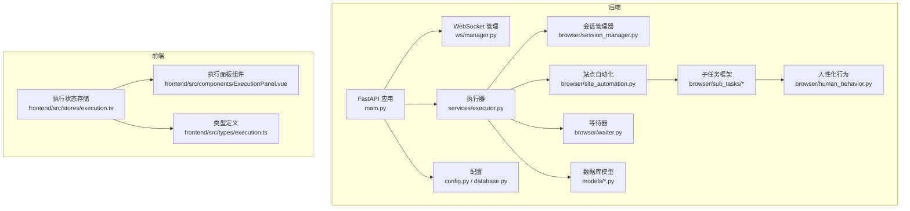

**图表来源**
- [main.py:1-117](file://CCC_RPA_API/app/main.py#L1-L117)
- [executor.py:1-372](file://CCC_RPA_API/app/services/executor.py#L1-L372)
- [session_manager.py:1-183](file://CCC_RPA_API/app/browser/session_manager.py#L1-L183)
- [site_automation.py:1-751](file://CCC_RPA_API/app/browser/site_automation.py#L1-L751)
- [human_behavior.py:1-86](file://CCC_RPA_API/app/browser/human_behavior.py#L1-L86)
- [waiter.py:1-84](file://CCC_RPA_API/app/browser/waiter.py#L1-L84)
- [contract_entry.py:1-849](file://CCC_RPA_API/app/browser/sub_tasks/contract_entry.py#L1-L849)
- [filing.py:1-344](file://CCC_RPA_API/app/browser/sub_tasks/filing.py#L1-L344)
- [base.py:1-121](file://CCC_RPA_API/app/browser/sub_tasks/base.py#L1-L121)
- [manager.py:1-29](file://CCC_RPA_API/app/ws/manager.py#L1-L29)
- [task.py:1-25](file://CCC_RPA_API/app/models/task.py#L1-L25)
- [execution_log.py:1-17](file://CCC_RPA_API/app/models/execution_log.py#L1-L17)
- [config.py:1-22](file://CCC_RPA_API/app/config.py#L1-L22)
- [database.py:1-19](file://CCC_RPA_API/app/database.py#L1-L19)
- [execution.ts:1-229](file://CCC-BrowserV4/frontend/src/stores/execution.ts#L1-L229)
- [ExecutionPanel.vue:1-322](file://CCC-BrowserV4/frontend/src/components/ExecutionPanel.vue#L1-L322)
- [execution.ts 类型定义:1-17](file://CCC-BrowserV4/frontend/src/types/execution.ts#L1-L17)

**章节来源**
- [main.py:1-117](file://CCC_RPA_API/app/main.py#L1-L117)
- [config.py:1-22](file://CCC_RPA_API/app/config.py#L1-L22)
- [database.py:1-19](file://CCC_RPA_API/app/database.py#L1-L19)

## 核心组件
- 会话生命周期管理：BrowserSessionManager 提供跨线程的 Playwright 会话创建、上下文复用、状态持久化与恢复。
- 网站自动化脚本：SiteAutomation 封装登录、扫码、单位选择、数据抓取与保活逻辑，并支持子任务执行。
- 人性化行为模拟：HumanBehavior 提供鼠标移动轨迹、键盘输入间隔、滚动与等待等模拟。
- 智能等待机制：ExecutionWaiter 提供任务级阻塞/唤醒与取消信号。
- 执行器与控制流：executor 将前端交互与浏览器操作串联，通过 WebSocket 推送状态。
- 子任务框架：SubTaskRegistry 管理多种业务子任务，包括合同录入和合同备案。
- 前端交互：store 与组件根据 WebSocket 消息驱动 UI 状态流转。

**更新** 新增子任务框架，支持多种业务自动化任务的扩展。

**章节来源**
- [session_manager.py:7-183](file://CCC_RPA_API/app/browser/session_manager.py#L7-L183)
- [site_automation.py:16-751](file://CCC_RPA_API/app/browser/site_automation.py#L16-L751)
- [human_behavior.py:12-86](file://CCC_RPA_API/app/browser/human_behavior.py#L12-L86)
- [waiter.py:7-84](file://CCC_RPA_API/app/browser/waiter.py#L7-L84)
- [executor.py:68-372](file://CCC_RPA_API/app/services/executor.py#L68-L372)
- [contract_entry.py:10-849](file://CCC_RPA_API/app/browser/sub_tasks/contract_entry.py#L10-L849)
- [filing.py:8-344](file://CCC_RPA_API/app/browser/sub_tasks/filing.py#L8-L344)
- [base.py:8-121](file://CCC_RPA_API/app/browser/sub_tasks/base.py#L8-L121)
- [execution.ts:1-229](file://CCC-BrowserV4/frontend/src/stores/execution.ts#L1-L229)

## 架构总览
系统以"后端 API + 执行器 + 浏览器自动化 + 前端交互"的分层架构运行。后端通过专用线程承载 Playwright，避免与异步事件循环冲突；前端通过 WebSocket 实时接收执行进度与结果。

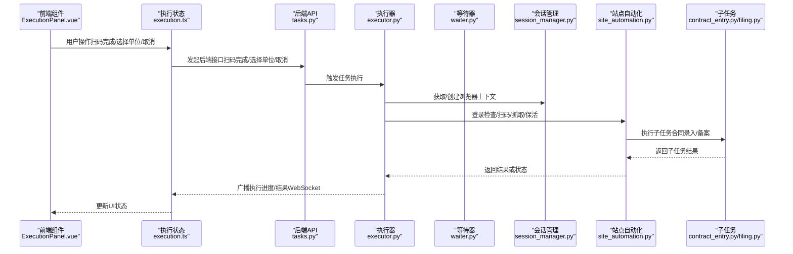

**图表来源**
- [ExecutionPanel.vue:1-322](file://CCC-BrowserV4/frontend/src/components/ExecutionPanel.vue#L1-L322)
- [execution.ts:1-229](file://CCC-BrowserV4/frontend/src/stores/execution.ts#L1-L229)
- [tasks.py:47-76](file://CCC_RPA_API/app/api/tasks.py#L47-L76)
- [executor.py:68-372](file://CCC_RPA_API/app/services/executor.py#L68-L372)
- [waiter.py:14-84](file://CCC_RPA_API/app/browser/waiter.py#L14-L84)
- [session_manager.py:95-141](file://CCC_RPA_API/app/browser/session_manager.py#L95-L141)
- [site_automation.py:38-751](file://CCC_RPA_API/app/browser/site_automation.py#L38-L751)
- [contract_entry.py:45-105](file://CCC_RPA_API/app/browser/sub_tasks/contract_entry.py#L45-L105)
- [filing.py:11-74](file://CCC_RPA_API/app/browser/sub_tasks/filing.py#L11-L74)

## 详细组件分析

### 会话生命周期管理（BrowserSessionManager）
- 设计要点
  - 单例工作线程：启动专用线程承载 Playwright，避免与 asyncio 冲突。
  - 上下文按省区分：以 province 为键缓存 BrowserContext，支持 storage_state 持久化。
  - 线程安全：使用队列与 Event 串行化执行，确保 Playwright API 在同一线程调用。
  - 存活检测与恢复：提供 check_alive 与 recover，异常时重建浏览器实例。
- 关键方法
  - get_context：按省创建或复用上下文，注入 user_agent、viewport、反检测脚本。
  - save_state/close_context：持久化状态与关闭上下文。
  - run：在工作线程中执行任意可调用对象并返回结果。
  - recover/close_all：恢复与关闭全量资源。

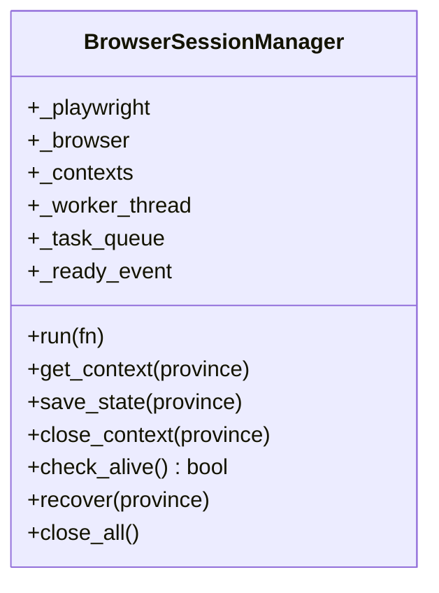

**图表来源**
- [session_manager.py:7-183](file://CCC_RPA_API/app/browser/session_manager.py#L7-L183)

**章节来源**
- [session_manager.py:27-183](file://CCC_RPA_API/app/browser/session_manager.py#L27-L183)

### 网站自动化脚本（SiteAutomation）
- 功能范围
  - 登录状态检查、统一登录页导航、二维码截图与等待扫码。
  - 单位列表抓取（多选择器降级策略）、单位选择（多策略匹配与点击）。
  - 页面保活（滚动/点击/等待）、待处理业务检测、子任务占位执行。
- 人性化集成
  - 与 HumanBehavior 协作，模拟鼠标移动轨迹、键盘输入间隔与随机滚动。
- 错误处理
  - 统一识别"浏览器已关闭"类错误，触发恢复流程。
- 子任务执行
  - 通过 SubTaskRegistry 支持多种业务子任务的动态调度。

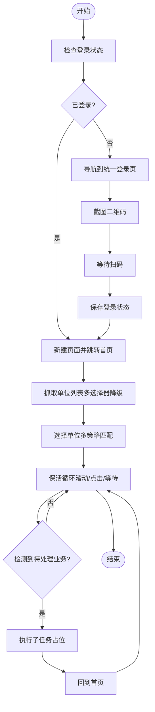

**图表来源**
- [site_automation.py:38-751](file://CCC_RPA_API/app/browser/site_automation.py#L38-L751)
- [human_behavior.py:12-86](file://CCC_RPA_API/app/browser/human_behavior.py#L12-L86)

**章节来源**
- [site_automation.py:38-751](file://CCC_RPA_API/app/browser/site_automation.py#L38-L751)

### 子任务框架（SubTaskRegistry）
- 设计要点
  - 基于 BaseSubTask 的子任务基类，提供统一的工具方法和进度广播。
  - 支持多种业务类型的子任务注册和动态调度。
  - 内置合同录入和合同备案两大核心业务子任务。
- 关键功能
  - execute_sub_task：根据子任务类型动态创建并执行对应处理器。
  - 进度广播：向执行器发送详细的子任务执行进度和状态。
  - 截图调试：自动保存关键节点的调试截图。

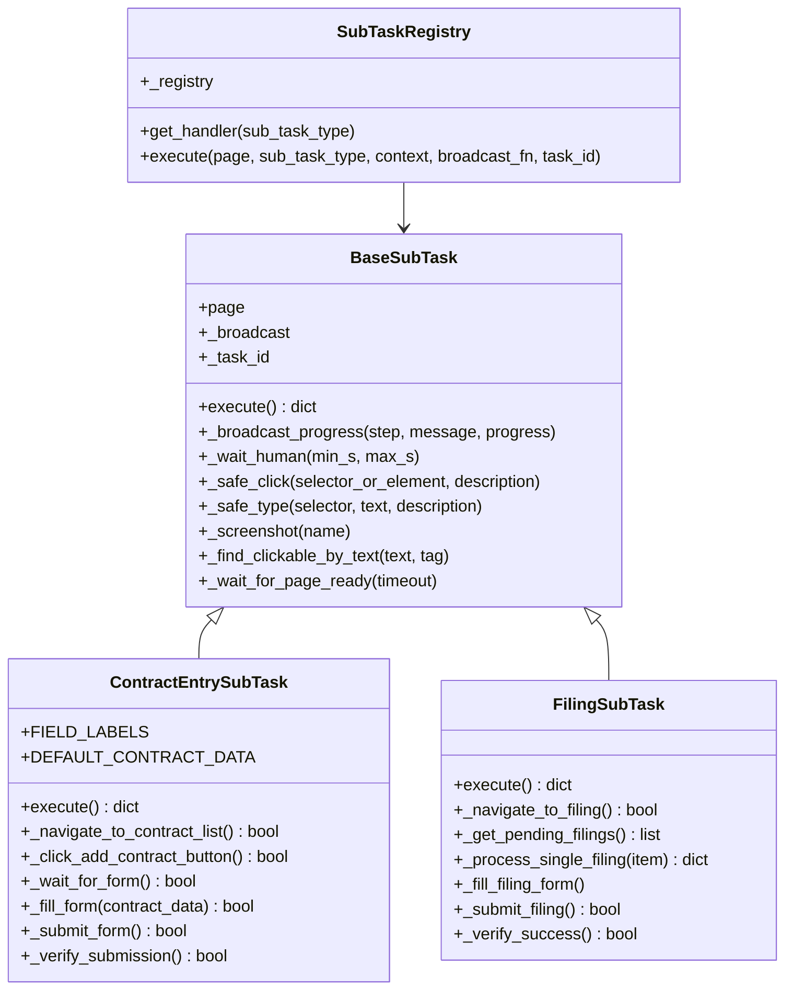

**图表来源**
- [contract_entry.py:10-849](file://CCC_RPA_API/app/browser/sub_tasks/contract_entry.py#L10-L849)
- [filing.py:8-344](file://CCC_RPA_API/app/browser/sub_tasks/filing.py#L8-L344)
- [base.py:8-121](file://CCC_RPA_API/app/browser/sub_tasks/base.py#L8-L121)
- [__init__.py:9-32](file://CCC_RPA_API/app/browser/sub_tasks/__init__.py#L9-L32)

**章节来源**
- [contract_entry.py:10-849](file://CCC_RPA_API/app/browser/sub_tasks/contract_entry.py#L10-L849)
- [filing.py:8-344](file://CCC_RPA_API/app/browser/sub_tasks/filing.py#L8-L344)
- [base.py:8-121](file://CCC_RPA_API/app/browser/sub_tasks/base.py#L8-L121)
- [__init__.py:9-32](file://CCC_RPA_API/app/browser/sub_tasks/__init__.py#L9-L32)

### 合同录入子任务（ContractEntrySubTask）
- 功能特性
  - 完整的合同录入流程：导航到合同管理页面 → 点击录入按钮 → 等待表单 → 填充数据 → 提交验证。
  - 多级导航降级策略：菜单点击 → URL 直达 → JS 查找，确保在不同页面结构下都能成功导航。
  - 智能表单填充：支持下拉选择、文本输入、日期时间等多种表单控件的自动化填充。
  - 错误处理与重试：每个步骤都有详细的错误处理和截图调试，失败时提供诊断信息。
- 表单字段支持
  - 号牌种类、号牌号码（省份+号码）、租赁类型、合同编号、合同签订时间、租赁开始/结束时间、身份证明名称、身份证明号码。
- 高级功能
  - 模拟人类行为：随机等待、鼠标移动轨迹、键盘输入延迟。
  - 进度广播：实时向执行器报告执行进度和状态。
  - 截图调试：关键节点自动保存截图，便于问题诊断。

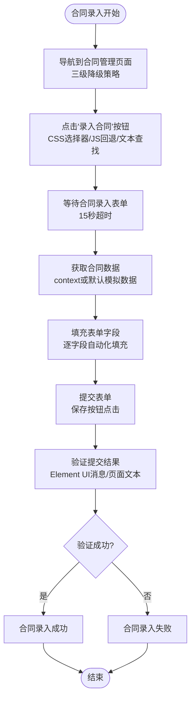

**图表来源**
- [contract_entry.py:45-105](file://CCC_RPA_API/app/browser/sub_tasks/contract_entry.py#L45-L105)
- [contract_entry.py:110-169](file://CCC_RPA_API/app/browser/sub_tasks/contract_entry.py#L110-L169)
- [contract_entry.py:175-235](file://CCC_RPA_API/app/browser/sub_tasks/contract_entry.py#L175-L235)
- [contract_entry.py:241-281](file://CCC_RPA_API/app/browser/sub_tasks/contract_entry.py#L241-L281)
- [contract_entry.py:310-394](file://CCC_RPA_API/app/browser/sub_tasks/contract_entry.py#L310-L394)
- [contract_entry.py:737-849](file://CCC_RPA_API/app/browser/sub_tasks/contract_entry.py#L737-L849)

**章节来源**
- [contract_entry.py:45-105](file://CCC_RPA_API/app/browser/sub_tasks/contract_entry.py#L45-L105)
- [contract_entry.py:110-169](file://CCC_RPA_API/app/browser/sub_tasks/contract_entry.py#L110-L169)
- [contract_entry.py:175-235](file://CCC_RPA_API/app/browser/sub_tasks/contract_entry.py#L175-L235)
- [contract_entry.py:241-281](file://CCC_RPA_API/app/browser/sub_tasks/contract_entry.py#L241-L281)
- [contract_entry.py:310-394](file://CCC_RPA_API/app/browser/sub_tasks/contract_entry.py#L310-L394)
- [contract_entry.py:737-849](file://CCC_RPA_API/app/browser/sub_tasks/contract_entry.py#L737-L849)

### 合同备案子任务（FilingSubTask）
- 功能特性
  - 自动化合同备案流程：导航到备案管理页面 → 获取待备案列表 → 逐条处理备案 → 提交验证。
  - 智能列表识别：通过关键词匹配自动识别待处理的合同记录。
  - 表单自动填写：检测页面表单字段，自动填写日期等必要信息。
  - 失败容错：单条记录失败不影响整体流程，自动返回列表继续处理。
- 导航策略
  - 菜单文本匹配 → URL 直达 → JS 查找链接，确保在不同页面结构下都能找到备案入口。
- 验证机制
  - 通过页面文本关键字检测提交结果，支持成功/失败/未知三种状态。

**章节来源**
- [filing.py:11-74](file://CCC_RPA_API/app/browser/sub_tasks/filing.py#L11-L74)
- [filing.py:79-137](file://CCC_RPA_API/app/browser/sub_tasks/filing.py#L79-L137)
- [filing.py:142-238](file://CCC_RPA_API/app/browser/sub_tasks/filing.py#L142-L238)
- [filing.py:282-344](file://CCC_RPA_API/app/browser/sub_tasks/filing.py#L282-L344)

### 人性化行为模拟（HumanBehavior）
- 行为策略
  - human_click：等待可见后，鼠标移动到元素中心附近（带随机偏移）再点击。
  - human_type：逐字符输入，字符间随机延迟。
  - random_scroll：滚动到元素或随机滚动，多次小幅度滚动并带延迟。
  - wait_like_human：随机等待时间。
- 注意事项
  - 所有 Page 操作需在后台线程执行，避免与事件循环冲突。

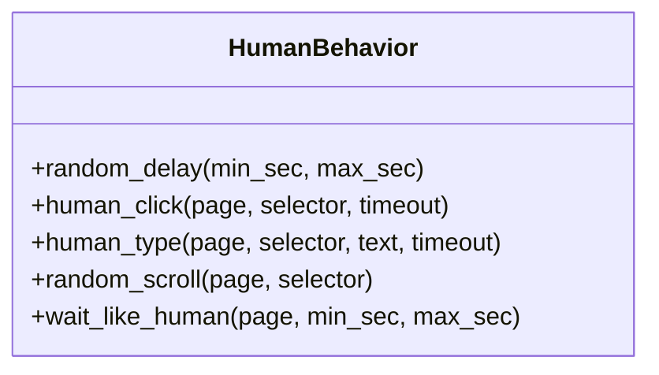

**图表来源**
- [human_behavior.py:12-86](file://CCC_RPA_API/app/browser/human_behavior.py#L12-L86)

**章节来源**
- [human_behavior.py:12-86](file://CCC_RPA_API/app/browser/human_behavior.py#L12-L86)

### 智能等待机制（ExecutionWaiter）
- 机制说明
  - 以 task_id 为键维护线程事件与数据，支持阻塞等待、唤醒与取消。
  - 提供非阻塞 check_signal，便于保活循环等场景快速轮询。
- 使用场景
  - 扫码登录等待、单位选择等待、执行取消信号。

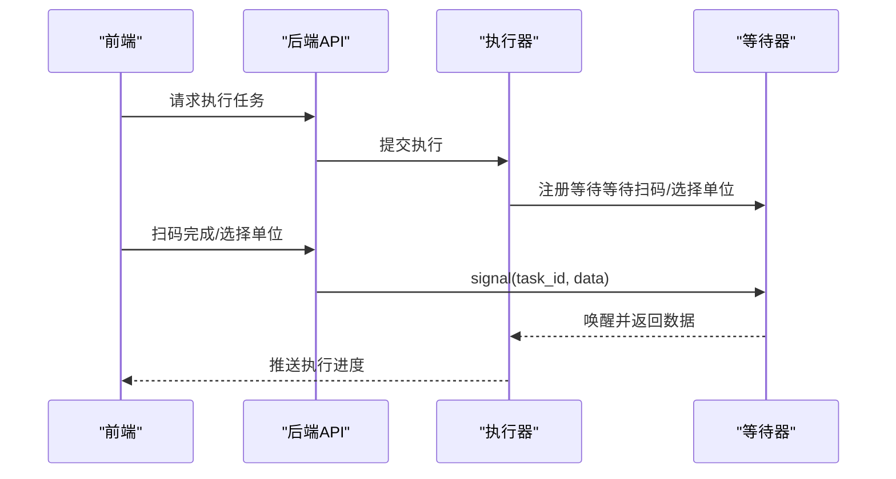

**图表来源**
- [waiter.py:14-84](file://CCC_RPA_API/app/browser/waiter.py#L14-L84)
- [tasks.py:60-76](file://CCC_RPA_API/app/api/tasks.py#L60-L76)
- [executor.py:62-66](file://CCC_RPA_API/app/services/executor.py#L62-L66)

**章节来源**
- [waiter.py:7-84](file://CCC_RPA_API/app/browser/waiter.py#L7-L84)
- [tasks.py:60-76](file://CCC_RPA_API/app/api/tasks.py#L60-L76)
- [executor.py:62-66](file://CCC_RPA_API/app/services/executor.py#L62-L66)

### 执行器与控制流（executor）
- 控制流
  - 初始化：记录执行日志，获取 province 与 sub_tasks。
  - 登录检查：若未登录，导航到登录页，截图二维码，推送前端，等待扫码。
  - 单位选择：抓取单位列表，推送前端，等待用户选择。
  - 保活循环：随机滚动/点击/等待，检测待处理业务并执行子任务。
  - 子任务执行：通过 SiteAutomation.execute_sub_task 调度具体业务处理。
  - 资源回收：关闭页面，更新任务状态与日志。
- 线程模型
  - Playwright 操作通过 BrowserSessionManager.run 在专用线程执行。
  - 等待用户输入在独立线程池中阻塞，避免阻塞 Playwright 工作线程。
  - WebSocket 广播通过主事件循环安全派发。

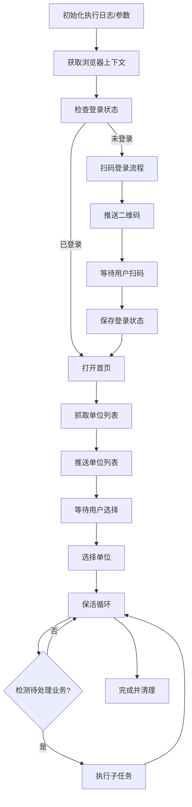

**图表来源**
- [executor.py:68-372](file://CCC_RPA_API/app/services/executor.py#L68-L372)
- [session_manager.py:95-141](file://CCC_RPA_API/app/browser/session_manager.py#L95-L141)
- [site_automation.py:38-751](file://CCC_RPA_API/app/browser/site_automation.py#L38-L751)

**章节来源**
- [executor.py:68-372](file://CCC_RPA_API/app/services/executor.py#L68-L372)

### 前端交互（Vue Store 与组件）
- Store（execution.ts）
  - 维护 taskId、step、message、qrImage、companies、selectedCompany 等状态。
  - 处理 WebSocket 消息，驱动 UI 状态流转。
  - 支持演示模式，模拟扫码与执行过程。
- 组件（ExecutionPanel.vue）
  - 根据 step 渲染不同 UI：检查登录、扫码、选择单位、执行/保活、完成/失败/取消。
  - 提供用户操作入口：扫码完成、选择单位、取消执行。
- 类型定义（execution.ts）
  - ExecutionStep 与 CompanyInfo 类型约束。

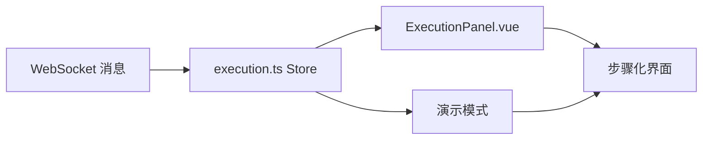

**图表来源**
- [execution.ts:1-229](file://CCC-BrowserV4/frontend/src/stores/execution.ts#L1-L229)
- [ExecutionPanel.vue:1-322](file://CCC-BrowserV4/frontend/src/components/ExecutionPanel.vue#L1-L322)
- [execution.ts 类型定义:1-17](file://CCC-BrowserV4/frontend/src/types/execution.ts#L1-L17)

**章节来源**
- [execution.ts:1-229](file://CCC-BrowserV4/frontend/src/stores/execution.ts#L1-L229)
- [ExecutionPanel.vue:1-322](file://CCC-BrowserV4/frontend/src/components/ExecutionPanel.vue#L1-L322)
- [execution.ts 类型定义:1-17](file://CCC-BrowserV4/frontend/src/types/execution.ts#L1-L17)

## 依赖关系分析
- 后端模块依赖
  - BrowserSessionManager 依赖 Playwright 同步 API，提供线程安全的浏览器操作。
  - SiteAutomation 依赖 HumanBehavior 与 BrowserSessionManager。
  - SubTaskRegistry 管理多种子任务类型，依赖 BaseSubTask 基类。
  - ExecutionWaiter 为执行器提供任务级等待/唤醒。
  - Executor 串联 API、等待器、会话管理与站点自动化。
  - WebSocket 管理器负责广播消息至前端。
- 数据模型
  - Task 与 TaskExecutionLog 用于记录任务状态与执行日志。
- 配置与数据库
  - config.py 与 database.py 提供数据库连接与模型初始化。

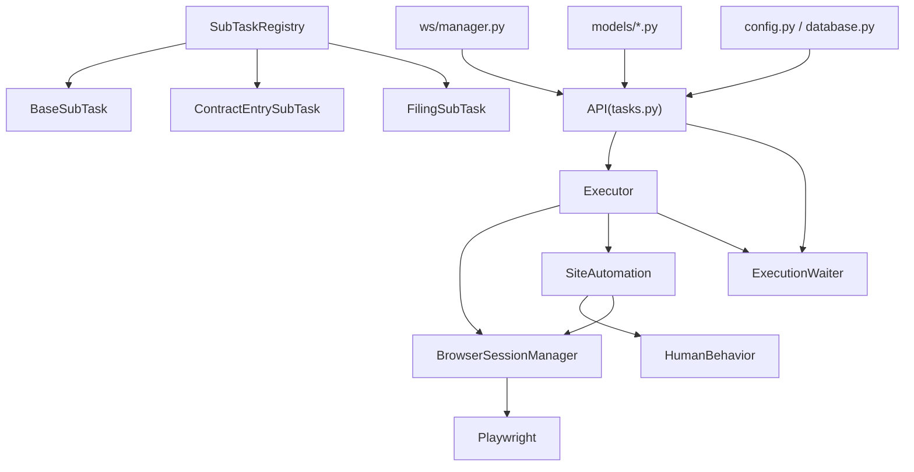

**图表来源**
- [session_manager.py:1-183](file://CCC_RPA_API/app/browser/session_manager.py#L1-L183)
- [site_automation.py:1-751](file://CCC_RPA_API/app/browser/site_automation.py#L1-L751)
- [human_behavior.py:1-86](file://CCC_RPA_API/app/browser/human_behavior.py#L1-L86)
- [contract_entry.py:1-849](file://CCC_RPA_API/app/browser/sub_tasks/contract_entry.py#L1-L849)
- [filing.py:1-344](file://CCC_RPA_API/app/browser/sub_tasks/filing.py#L1-L344)
- [base.py:1-121](file://CCC_RPA_API/app/browser/sub_tasks/base.py#L1-L121)
- [waiter.py:1-84](file://CCC_RPA_API/app/browser/waiter.py#L1-L84)
- [executor.py:1-372](file://CCC_RPA_API/app/services/executor.py#L1-L372)
- [tasks.py:1-76](file://CCC_RPA_API/app/api/tasks.py#L1-L76)
- [manager.py:1-29](file://CCC_RPA_API/app/ws/manager.py#L1-L29)
- [task.py:1-25](file://CCC_RPA_API/app/models/task.py#L1-L25)
- [execution_log.py:1-17](file://CCC_RPA_API/app/models/execution_log.py#L1-L17)
- [config.py:1-22](file://CCC_RPA_API/app/config.py#L1-L22)
- [database.py:1-19](file://CCC_RPA_API/app/database.py#L1-L19)

**章节来源**
- [executor.py:1-372](file://CCC_RPA_API/app/services/executor.py#L1-L372)
- [tasks.py:1-76](file://CCC_RPA_API/app/api/tasks.py#L1-L76)
- [manager.py:1-29](file://CCC_RPA_API/app/ws/manager.py#L1-L29)
- [task.py:1-25](file://CCC_RPA_API/app/models/task.py#L1-L25)
- [execution_log.py:1-17](file://CCC_RPA_API/app/models/execution_log.py#L1-L17)
- [config.py:1-22](file://CCC_RPA_API/app/config.py#L1-L22)
- [database.py:1-19](file://CCC_RPA_API/app/database.py#L1-L19)

## 性能考量
- 线程隔离
  - Playwright 同步 API 在专用线程执行，避免阻塞主事件循环与执行器线程池。
- 资源复用
  - 按省缓存 BrowserContext，减少启动成本；storage_state 持久化降低重复登录开销。
- 等待策略
  - 使用 networkidle、load_state 等等待点，结合随机延迟与滚动，平衡稳定性与效率。
- 并发控制
  - 执行器线程池大小固定，避免过度并发导致资源争用。
- 子任务优化
  - 子任务间适当的冷却间隔，控制每分钟操作次数（PPM），避免被反爬系统检测。

[本节为通用指导，无需特定文件来源]

## 故障排查指南
- 浏览器异常
  - 现象：页面操作报错，提示"浏览器已关闭"。
  - 处理：执行器会检测存活并调用 recover 自动恢复；若仍失败，重启后端服务。
  - 参考：[executor.py:42-59](file://CCC_RPA_API/app/services/executor.py#L42-L59)，[session_manager.py:154-167](file://CCC_RPA_API/app/browser/session_manager.py#L154-L167)
- 扫码/选择超时
  - 现象：等待用户操作超时。
  - 处理：确认前端 WebSocket 连接正常；后端 API 能够正确 signal/cancel。
  - 参考：[executor.py:122-129](file://CCC_RPA_API/app/services/executor.py#L122-L129)，[tasks.py:60-76](file://CCC_RPA_API/app/api/tasks.py#L60-L76)，[waiter.py:14-33](file://CCC_RPA_API/app/browser/waiter.py#L14-L33)
- 登录状态异常
  - 现象：检查登录状态失败或二维码无法加载。
  - 处理：确认网络可达；必要时关闭并恢复会话；查看截图与日志定位问题。
  - 参考：[site_automation.py:38-59](file://CCC_RPA_API/app/browser/site_automation.py#L38-L59)，[site_automation.py:148-173](file://CCC_RPA_API/app/browser/site_automation.py#L148-L173)
- 数据抓取失败
  - 现象：单位列表为空或解析异常。
  - 处理：检查降级策略是否生效；确认页面结构变化；必要时更新选择器。
  - 参考：[site_automation.py:194-291](file://CCC_RPA_API/app/browser/site_automation.py#L194-L291)
- 合同录入失败
  - 现象：合同录入流程中断或提交失败。
  - 处理：检查导航策略是否成功；确认表单字段映射正确；查看截图定位问题。
  - 参考：[contract_entry.py:110-169](file://CCC_RPA_API/app/browser/sub_tasks/contract_entry.py#L110-L169)，[contract_entry.py:310-394](file://CCC_RPA_API/app/browser/sub_tasks/contract_entry.py#L310-L394)
- 子任务执行异常
  - 现象：子任务无法识别或执行失败。
  - 处理：确认子任务类型配置正确；检查 SubTaskRegistry 注册表；查看子任务日志。
  - 参考：[site_automation.py:738-750](file://CCC_RPA_API/app/browser/site_automation.py#L738-L750)，[__init__.py:9-32](file://CCC_RPA_API/app/browser/sub_tasks/__init__.py#L9-L32)

**章节来源**
- [executor.py:42-59](file://CCC_RPA_API/app/services/executor.py#L42-L59)
- [session_manager.py:154-167](file://CCC_RPA_API/app/browser/session_manager.py#L154-L167)
- [tasks.py:60-76](file://CCC_RPA_API/app/api/tasks.py#L60-L76)
- [waiter.py:14-33](file://CCC_RPA_API/app/browser/waiter.py#L14-L33)
- [site_automation.py:38-59](file://CCC_RPA_API/app/browser/site_automation.py#L38-L59)
- [site_automation.py:148-173](file://CCC_RPA_API/app/browser/site_automation.py#L148-L173)
- [site_automation.py:194-291](file://CCC_RPA_API/app/browser/site_automation.py#L194-L291)
- [contract_entry.py:110-169](file://CCC_RPA_API/app/browser/sub_tasks/contract_entry.py#L110-L169)
- [contract_entry.py:310-394](file://CCC_RPA_API/app/browser/sub_tasks/contract_entry.py#L310-L394)
- [site_automation.py:738-750](file://CCC_RPA_API/app/browser/site_automation.py#L738-L750)
- [__init__.py:9-32](file://CCC_RPA_API/app/browser/sub_tasks/__init__.py#L9-L32)

## 结论
本系统通过专用线程隔离 Playwright、完善的会话管理与状态持久化、人性化行为模拟与智能等待机制，实现了稳定可靠的浏览器自动化流程。新增的子任务框架进一步增强了系统的扩展性，支持合同录入和合同备案等多种业务场景的自动化处理。前后端通过 WebSocket 实时通信，前端以清晰的状态机驱动用户交互，整体具备良好的扩展性与可维护性。建议后续在代理池与指纹伪装方面进一步增强，以应对更严格的反爬策略。

[本节为总结性内容，无需特定文件来源]

## 附录
- 会话管理与资源回收
  - 会话创建与复用：[session_manager.py:95-123](file://CCC_RPA_API/app/browser/session_manager.py#L95-L123)
  - 状态保存与关闭：[session_manager.py:126-141](file://CCC_RPA_API/app/browser/session_manager.py#L126-L141)
  - 全量关闭：[session_manager.py:170-182](file://CCC_RPA_API/app/browser/session_manager.py#L170-L182)
- 登录与扫码流程
  - 登录状态检查：[site_automation.py:38-59](file://CCC_RPA_API/app/browser/site_automation.py#L38-L59)
  - 导航与二维码：[site_automation.py:61-146](file://CCC_RPA_API/app/browser/site_automation.py#L61-L146)
  - 等待扫码：[site_automation.py:175-192](file://CCC_RPA_API/app/browser/site_automation.py#L175-L192)
- 单位选择与数据抓取
  - 抓取单位列表：[site_automation.py:194-291](file://CCC_RPA_API/app/browser/site_automation.py#L194-L291)
  - 选择单位：[site_automation.py:294-420](file://CCC_RPA_API/app/browser/site_automation.py#L294-L420)
- 保活与业务检测
  - 保活循环：[site_automation.py:436-500](file://CCC_RPA_API/app/browser/site_automation.py#L436-L500)
  - 待处理业务检测：[site_automation.py:502-554](file://CCC_RPA_API/app/browser/site_automation.py#L502-L554)
- 子任务执行
  - 子任务注册表：[__init__.py:9-32](file://CCC_RPA_API/app/browser/sub_tasks/__init__.py#L9-L32)
  - 基础子任务类：[base.py:8-121](file://CCC_RPA_API/app/browser/sub_tasks/base.py#L8-L121)
  - 合同录入主流程：[contract_entry.py:45-105](file://CCC_RPA_API/app/browser/sub_tasks/contract_entry.py#L45-L105)
  - 合同录入导航：[contract_entry.py:110-169](file://CCC_RPA_API/app/browser/sub_tasks/contract_entry.py#L110-L169)
  - 合同录入表单填充：[contract_entry.py:310-394](file://CCC_RPA_API/app/browser/sub_tasks/contract_entry.py#L310-L394)
  - 合同备案主流程：[filing.py:11-74](file://CCC_RPA_API/app/browser/sub_tasks/filing.py#L11-L74)
  - 合同备案导航：[filing.py:79-137](file://CCC_RPA_API/app/browser/sub_tasks/filing.py#L79-L137)
- 执行器与 WebSocket
  - 执行主流程：[executor.py:68-372](file://CCC_RPA_API/app/services/executor.py#L68-L372)
  - WebSocket 广播：[main.py:109-117](file://CCC_RPA_API/app/main.py#L109-L117)，[manager.py:17-26](file://CCC_RPA_API/app/ws/manager.py#L17-L26)
- 前端状态与组件
  - Store 状态机：[execution.ts:22-67](file://CCC-BrowserV4/frontend/src/stores/execution.ts#L22-L67)
  - 组件渲染：[ExecutionPanel.vue:1-108](file://CCC-BrowserV4/frontend/src/components/ExecutionPanel.vue#L1-L108)