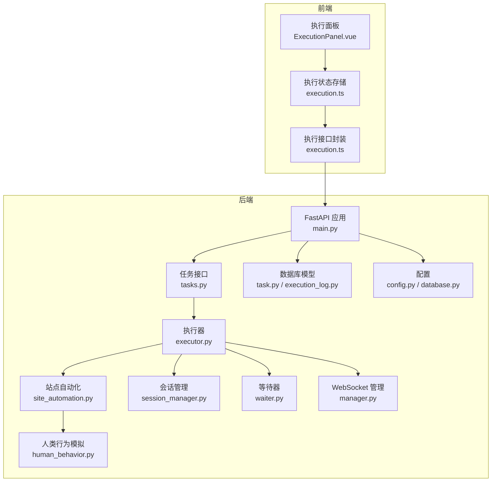
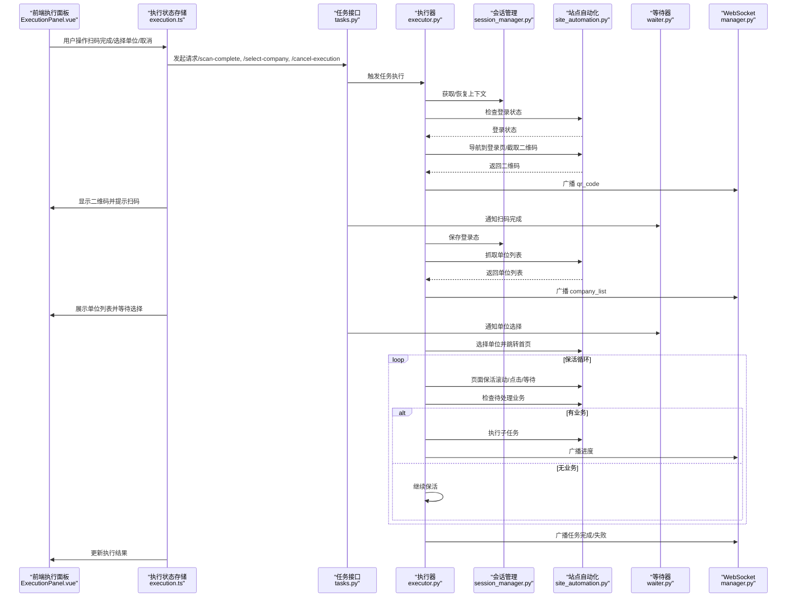
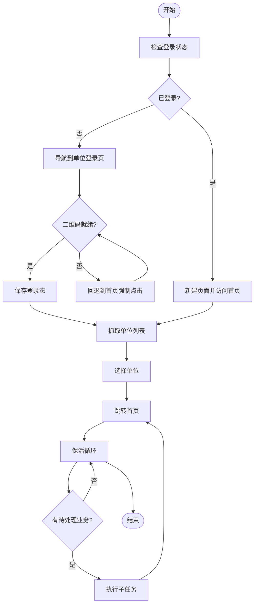
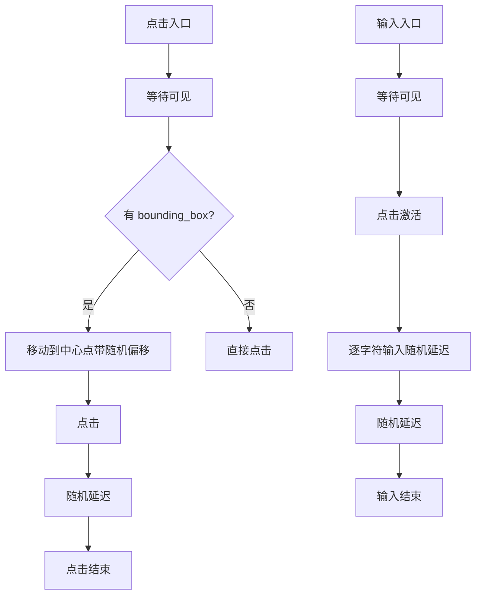
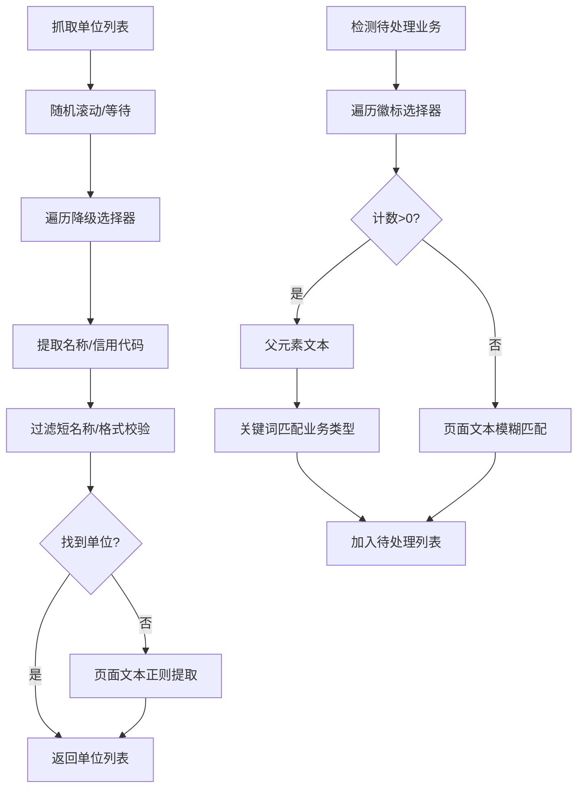
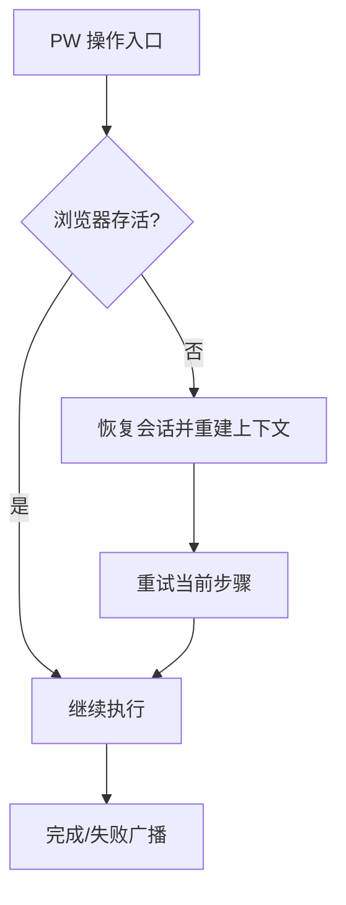
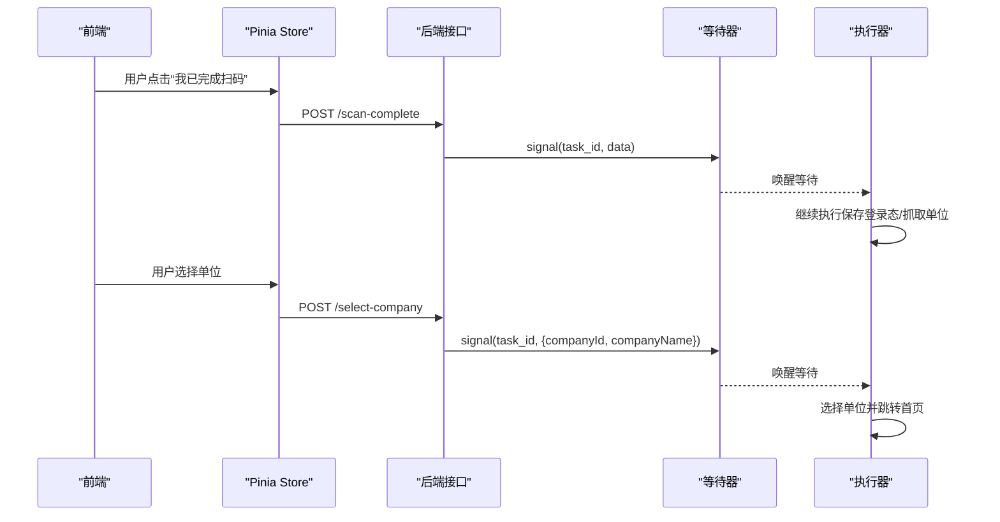
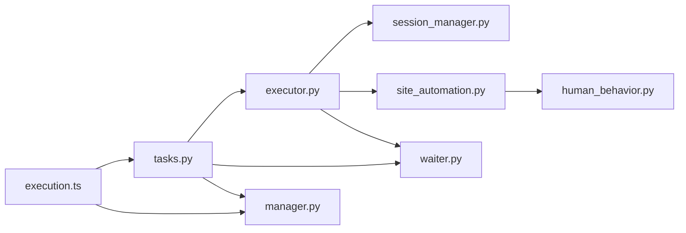

# 站点自动化

<cite>
**本文档引用的文件**
- [site_automation.py](file://CCC_RPA_API/app/browser/site_automation.py)
- [session_manager.py](file://CCC_RPA_API/app/browser/session_manager.py)
- [waiter.py](file://CCC_RPA_API/app/browser/waiter.py)
- [human_behavior.py](file://CCC_RPA_API/app/browser/human_behavior.py)
- [executor.py](file://CCC_RPA_API/app/services/executor.py)
- [tasks.py](file://CCC_RPA_API/app/api/tasks.py)
- [main.py](file://CCC_RPA_API/app/main.py)
- [manager.py](file://CCC_RPA_API/app/ws/manager.py)
- [task.py](file://CCC_RPA_API/app/models/task.py)
- [execution_log.py](file://CCC_RPA_API/app/models/execution_log.py)
- [database.py](file://CCC_RPA_API/app/database.py)
- [config.py](file://CCC_RPA_API/app/config.py)
- [ExecutionPanel.vue](file://CCC-BrowserV4/frontend/src/components/ExecutionPanel.vue)
- [execution.ts](file://CCC-BrowserV4/frontend/src/stores/execution.ts)
- [execution.ts](file://CCC-BrowserV4/frontend/src/api/execution.ts)
</cite>

## 目录
1. [简介](#简介)
2. [项目结构](#项目结构)
3. [核心组件](#核心组件)
4. [架构总览](#架构总览)
5. [详细组件分析](#详细组件分析)
6. [依赖关系分析](#依赖关系分析)
7. [性能考量](#性能考量)
8. [故障排查指南](#故障排查指南)
9. [结论](#结论)
10. [附录](#附录)

## 简介
本文件面向“站点自动化”能力，聚焦于 SiteAutomation 的网站自动化脚本执行机制，涵盖页面导航、元素定位与交互、页面跳转策略、数据提取与验证、错误处理与重试策略，并结合前后端协作流程，提供可复用的最佳实践与示例路径。

## 项目结构
整体采用前后端分离架构：
- 后端（Python + FastAPI + SQLAlchemy + Playwright）：负责任务编排、浏览器会话管理、页面自动化、数据持久化与 WebSocket 广播。
- 前端（Vue + Pinia + Element Plus）：负责用户交互、扫码登录、单位选择、执行状态展示与实时消息订阅。

图表来源
- [main.py:30-127](file://CCC_RPA_API/app/main.py#L30-L127)
- [tasks.py:1-76](file://CCC_RPA_API/app/api/tasks.py#L1-L76)
- [executor.py:1-308](file://CCC_RPA_API/app/services/executor.py#L1-L308)
- [session_manager.py:1-183](file://CCC_RPA_API/app/browser/session_manager.py#L1-L183)
- [site_automation.py:1-562](file://CCC_RPA_API/app/browser/site_automation.py#L1-L562)
- [waiter.py:1-84](file://CCC_RPA_API/app/browser/waiter.py#L1-L84)
- [human_behavior.py:1-86](file://CCC_RPA_API/app/browser/human_behavior.py#L1-L86)
- [manager.py:1-29](file://CCC_RPA_API/app/ws/manager.py#L1-L29)
- [task.py:1-25](file://CCC_RPA_API/app/models/task.py#L1-L25)
- [execution_log.py:1-17](file://CCC_RPA_API/app/models/execution_log.py#L1-L17)
- [config.py:1-22](file://CCC_RPA_API/app/config.py#L1-L22)
- [database.py:1-19](file://CCC_RPA_API/app/database.py#L1-L19)
- [ExecutionPanel.vue:1-322](file://CCC-BrowserV4/frontend/src/components/ExecutionPanel.vue#L1-L322)
- [execution.ts:1-229](file://CCC-BrowserV4/frontend/src/stores/execution.ts#L1-L229)
- [execution.ts:1-20](file://CCC-BrowserV4/frontend/src/api/execution.ts#L1-L20)

章节来源
- [main.py:30-127](file://CCC_RPA_API/app/main.py#L30-L127)
- [tasks.py:1-76](file://CCC_RPA_API/app/api/tasks.py#L1-L76)
- [executor.py:1-308](file://CCC_RPA_API/app/services/executor.py#L1-L308)
- [session_manager.py:1-183](file://CCC_RPA_API/app/browser/session_manager.py#L1-L183)
- [site_automation.py:1-562](file://CCC_RPA_API/app/browser/site_automation.py#L1-L562)
- [waiter.py:1-84](file://CCC_RPA_API/app/browser/waiter.py#L1-L84)
- [human_behavior.py:1-86](file://CCC_RPA_API/app/browser/human_behavior.py#L1-L86)
- [manager.py:1-29](file://CCC_RPA_API/app/ws/manager.py#L1-L29)
- [task.py:1-25](file://CCC_RPA_API/app/models/task.py#L1-L25)
- [execution_log.py:1-17](file://CCC_RPA_API/app/models/execution_log.py#L1-L17)
- [config.py:1-22](file://CCC_RPA_API/app/config.py#L1-L22)
- [database.py:1-19](file://CCC_RPA_API/app/database.py#L1-L19)
- [ExecutionPanel.vue:1-322](file://CCC-BrowserV4/frontend/src/components/ExecutionPanel.vue#L1-L322)
- [execution.ts:1-229](file://CCC-BrowserV4/frontend/src/stores/execution.ts#L1-L229)
- [execution.ts:1-20](file://CCC-BrowserV4/frontend/src/api/execution.ts#L1-L20)

## 核心组件
- SiteAutomation：封装页面导航、元素交互、数据提取、保活与待处理业务检测等自动化逻辑。
- BrowserSessionManager：按省份管理 Playwright 上下文，保证线程安全与会话持久化。
- ExecutionWaiter：基于 Event 的用户交互阻塞/唤醒机制，支持取消与检查。
- HumanBehavior：模拟人类点击、输入、滚动与等待，降低反爬检测风险。
- Executor：任务执行编排器，协调登录、扫码、单位选择、保活与业务触发。
- API/WS/Frontend：REST 接口与 WebSocket 广播，前端执行面板驱动用户交互。

章节来源
- [site_automation.py:16-562](file://CCC_RPA_API/app/browser/site_automation.py#L16-L562)
- [session_manager.py:7-183](file://CCC_RPA_API/app/browser/session_manager.py#L7-L183)
- [waiter.py:7-84](file://CCC_RPA_API/app/browser/waiter.py#L7-L84)
- [human_behavior.py:12-86](file://CCC_RPA_API/app/browser/human_behavior.py#L12-L86)
- [executor.py:68-308](file://CCC_RPA_API/app/services/executor.py#L68-L308)
- [tasks.py:47-76](file://CCC_RPA_API/app/api/tasks.py#L47-L76)
- [manager.py:5-29](file://CCC_RPA_API/app/ws/manager.py#L5-L29)
- [ExecutionPanel.vue:1-322](file://CCC-BrowserV4/frontend/src/components/ExecutionPanel.vue#L1-L322)
- [execution.ts:1-229](file://CCC-BrowserV4/frontend/src/stores/execution.ts#L1-L229)

## 架构总览
以下序列图展示了从任务提交到执行完成的端到端流程，包括扫码登录、单位选择、保活与业务触发。

图表来源
- [tasks.py:47-76](file://CCC_RPA_API/app/api/tasks.py#L47-L76)
- [executor.py:68-308](file://CCC_RPA_API/app/services/executor.py#L68-L308)
- [session_manager.py:96-123](file://CCC_RPA_API/app/browser/session_manager.py#L96-L123)
- [site_automation.py:38-192](file://CCC_RPA_API/app/browser/site_automation.py#L38-L192)
- [site_automation.py:194-420](file://CCC_RPA_API/app/browser/site_automation.py#L194-L420)
- [site_automation.py:436-554](file://CCC_RPA_API/app/browser/site_automation.py#L436-L554)
- [waiter.py:14-84](file://CCC_RPA_API/app/browser/waiter.py#L14-L84)
- [manager.py:17-28](file://CCC_RPA_API/app/ws/manager.py#L17-L28)
- [ExecutionPanel.vue:1-322](file://CCC-BrowserV4/frontend/src/components/ExecutionPanel.vue#L1-L322)
- [execution.ts:69-120](file://CCC-BrowserV4/frontend/src/stores/execution.ts#L69-L120)

## 详细组件分析

### 页面导航与跳转策略
- 登录状态检查：新建页面访问省平台首页，通过可见元素判断登录状态；失败时记录告警并兜底返回未登录。
- 单位登录页导航：优先直连统一登录页；若失败，回退至首页并以 JS 强制点击隐藏按钮，再等待二维码出现。
- 选择单位后跳转：完成单位选择后，回到省平台首页，准备业务保活与触发。
- 保活跳转：检测到待处理业务后，自动回到首页以确保业务入口可见。

图表来源
- [site_automation.py:38-146](file://CCC_RPA_API/app/browser/site_automation.py#L38-L146)
- [site_automation.py:194-420](file://CCC_RPA_API/app/browser/site_automation.py#L194-L420)
- [site_automation.py:422-434](file://CCC_RPA_API/app/browser/site_automation.py#L422-L434)
- [executor.py:96-184](file://CCC_RPA_API/app/services/executor.py#L96-L184)
- [executor.py:186-256](file://CCC_RPA_API/app/services/executor.py#L186-L256)

章节来源
- [site_automation.py:38-146](file://CCC_RPA_API/app/browser/site_automation.py#L38-L146)
- [site_automation.py:194-420](file://CCC_RPA_API/app/browser/site_automation.py#L194-L420)
- [site_automation.py:422-434](file://CCC_RPA_API/app/browser/site_automation.py#L422-L434)
- [executor.py:96-184](file://CCC_RPA_API/app/services/executor.py#L96-L184)
- [executor.py:186-256](file://CCC_RPA_API/app/services/executor.py#L186-L256)

### 元素交互方法
- 点击：优先使用 bounding_box 计算中心点并鼠标移动后点击，模拟人类轨迹；若不可用则降级为直接 click。
- 输入：等待元素可见后，逐字符输入，字符间加入随机延迟。
- 滚动：支持滚动到元素可见与随机滚动，配合随机步数与延迟。
- 等待：随机等待与网络状态等待相结合，提升稳定性。

图表来源
- [human_behavior.py:21-44](file://CCC_RPA_API/app/browser/human_behavior.py#L21-L44)
- [human_behavior.py:46-58](file://CCC_RPA_API/app/browser/human_behavior.py#L46-L58)
- [human_behavior.py:60-79](file://CCC_RPA_API/app/browser/human_behavior.py#L60-L79)
- [human_behavior.py:81-86](file://CCC_RPA_API/app/browser/human_behavior.py#L81-L86)

章节来源
- [human_behavior.py:21-44](file://CCC_RPA_API/app/browser/human_behavior.py#L21-L44)
- [human_behavior.py:46-58](file://CCC_RPA_API/app/browser/human_behavior.py#L46-L58)
- [human_behavior.py:60-79](file://CCC_RPA_API/app/browser/human_behavior.py#L60-L79)
- [human_behavior.py:81-86](file://CCC_RPA_API/app/browser/human_behavior.py#L81-L86)

### 数据提取与验证
- 单位列表抓取：多级降级选择器遍历，优先匹配列表项容器，提取名称与统一社会信用代码；若仍失败，回退到页面文本正则提取。
- 待处理业务检测：通过徽标计数与关键词匹配，识别“备案/违章/合同调整/转移”等业务类型。
- 选择单位：支持 data-id、文本行、名称匹配与索引降级策略，点击后等待网络空闲。

图表来源
- [site_automation.py:194-291](file://CCC_RPA_API/app/browser/site_automation.py#L194-L291)
- [site_automation.py:502-554](file://CCC_RPA_API/app/browser/site_automation.py#L502-L554)
- [site_automation.py:294-420](file://CCC_RPA_API/app/browser/site_automation.py#L294-L420)

章节来源
- [site_automation.py:194-291](file://CCC_RPA_API/app/browser/site_automation.py#L194-L291)
- [site_automation.py:502-554](file://CCC_RPA_API/app/browser/site_automation.py#L502-L554)
- [site_automation.py:294-420](file://CCC_RPA_API/app/browser/site_automation.py#L294-L420)

### 错误处理与重试策略
- 浏览器关闭检测：统一错误分类，区分“浏览器已关闭”与一般异常，前者直接抛出以便上层恢复。
- 会话恢复：执行器在关键步骤前检查浏览器存活，若断开则恢复会话并重新打开首页。
- 保活循环：每轮保活后检查取消信号与待处理业务，分段等待便于快速响应取消。
- 执行日志：记录任务生命周期与结果，便于追踪与审计。

图表来源
- [executor.py:35-59](file://CCC_RPA_API/app/services/executor.py#L35-L59)
- [executor.py:186-256](file://CCC_RPA_API/app/services/executor.py#L186-L256)
- [session_manager.py:154-167](file://CCC_RPA_API/app/browser/session_manager.py#L154-L167)
- [site_automation.py:10-13](file://CCC_RPA_API/app/browser/site_automation.py#L10-L13)

章节来源
- [executor.py:35-59](file://CCC_RPA_API/app/services/executor.py#L35-L59)
- [executor.py:186-256](file://CCC_RPA_API/app/services/executor.py#L186-L256)
- [session_manager.py:154-167](file://CCC_RPA_API/app/browser/session_manager.py#L154-L167)
- [site_automation.py:10-13](file://CCC_RPA_API/app/browser/site_automation.py#L10-L13)

### 前后端协作与用户交互
- WebSocket 广播：执行器在关键节点推送进度、二维码、单位列表与任务状态更新。
- 前端执行面板：根据步骤渲染不同 UI，支持扫码完成、单位选择与取消执行。
- 用户信号：后端通过 ExecutionWaiter 等待前端确认，避免阻塞 Playwright 工作线程。

图表来源
- [ExecutionPanel.vue:12-107](file://CCC-BrowserV4/frontend/src/components/ExecutionPanel.vue#L12-L107)
- [execution.ts:69-120](file://CCC-BrowserV4/frontend/src/stores/execution.ts#L69-L120)
- [execution.ts:1-20](file://CCC-BrowserV4/frontend/src/api/execution.ts#L1-L20)
- [tasks.py:60-75](file://CCC_RPA_API/app/api/tasks.py#L60-L75)
- [waiter.py:34-69](file://CCC_RPA_API/app/browser/waiter.py#L34-L69)
- [executor.py:122-170](file://CCC_RPA_API/app/services/executor.py#L122-L170)

章节来源
- [ExecutionPanel.vue:12-107](file://CCC-BrowserV4/frontend/src/components/ExecutionPanel.vue#L12-L107)
- [execution.ts:69-120](file://CCC-BrowserV4/frontend/src/stores/execution.ts#L69-L120)
- [execution.ts:1-20](file://CCC-BrowserV4/frontend/src/api/execution.ts#L1-L20)
- [tasks.py:60-75](file://CCC_RPA_API/app/api/tasks.py#L60-L75)
- [waiter.py:34-69](file://CCC_RPA_API/app/browser/waiter.py#L34-L69)
- [executor.py:122-170](file://CCC_RPA_API/app/services/executor.py#L122-L170)

## 依赖关系分析
- 执行器依赖会话管理器进行上下文获取与恢复，依赖站点自动化执行页面操作，依赖等待器处理用户交互信号。
- 站点自动化依赖人类行为模拟以规避反爬，依赖 Playwright 的定位器与等待机制。
- API 层提供 REST 接口与 WebSocket 广播，前端通过 Store 与 API 封装进行交互。

图表来源
- [executor.py:13-15](file://CCC_RPA_API/app/services/executor.py#L13-L15)
- [session_manager.py:12-13](file://CCC_RPA_API/app/browser/session_manager.py#L12-L13)
- [site_automation.py:5](file://CCC_RPA_API/app/browser/site_automation.py#L5)
- [human_behavior.py:5](file://CCC_RPA_API/app/browser/human_behavior.py#L5)
- [tasks.py:8](file://CCC_RPA_API/app/api/tasks.py#L8)
- [manager.py:1](file://CCC_RPA_API/app/ws/manager.py#L1)
- [execution.ts:3](file://CCC-BrowserV4/frontend/src/stores/execution.ts#L3)

章节来源
- [executor.py:13-15](file://CCC_RPA_API/app/services/executor.py#L13-L15)
- [session_manager.py:12-13](file://CCC_RPA_API/app/browser/session_manager.py#L12-L13)
- [site_automation.py:5](file://CCC_RPA_API/app/browser/site_automation.py#L5)
- [human_behavior.py:5](file://CCC_RPA_API/app/browser/human_behavior.py#L5)
- [tasks.py:8](file://CCC_RPA_API/app/api/tasks.py#L8)
- [manager.py:1](file://CCC_RPA_API/app/ws/manager.py#L1)
- [execution.ts:3](file://CCC-BrowserV4/frontend/src/stores/execution.ts#L3)

## 性能考量
- 线程隔离：Playwright 在专用工作线程中运行，避免与 asyncio 事件循环冲突；UI 等待在独立线程中阻塞，不占用 PW 线程。
- 会话持久化：按省份存储 storage_state，减少重复登录成本。
- 降级策略：页面元素定位与数据提取采用多级降级，提高鲁棒性。
- 随机化行为：随机滚动、点击与等待，降低被检测概率，同时提升稳定性。

## 故障排查指南
- 浏览器异常：若报错包含“已关闭”，执行器会恢复会话并重新打开页面；检查浏览器进程与网络环境。
- 登录失败：确认二维码是否正确生成与传输；检查扫码完成信号是否到达。
- 单位列表为空：检查页面结构是否变化；确认登录状态与网络空闲时机。
- 保活无效：检查取消信号是否被正确传递；确认分段等待逻辑是否被中断。
- 数据库连接：确认数据库配置与连接池参数；关注迁移脚本执行情况。

章节来源
- [executor.py:42-59](file://CCC_RPA_API/app/services/executor.py#L42-L59)
- [site_automation.py:10-13](file://CCC_RPA_API/app/browser/site_automation.py#L10-L13)
- [config.py:6-22](file://CCC_RPA_API/app/config.py#L6-L22)
- [database.py:1-19](file://CCC_RPA_API/app/database.py#L1-L19)

## 结论
SiteAutomation 通过“会话管理 + 人类行为模拟 + 多级降级 + 保活循环”的组合，实现了对复杂站点的稳健自动化。配合前后端协作与完善的错误处理，能够在真实生产环境中持续、可靠地执行业务任务。

## 附录
- 示例与最佳实践建议
  - 页面导航：优先直连目标页，失败时回退到首页强制点击；始终等待网络空闲后再继续。
  - 元素交互：优先使用 bounding_box 精确点击；输入时逐字符延迟；滚动前尽量先滚动到可视区域。
  - 数据提取：多选择器降级 + 正则兜底；对关键字段做格式校验与长度限制。
  - 错误处理：区分浏览器关闭与普通异常；在关键步骤前检查存活并恢复；分段等待便于取消。
  - 用户交互：使用等待器阻塞等待，避免阻塞 Playwright 工作线程；通过 WebSocket 实时反馈进度。