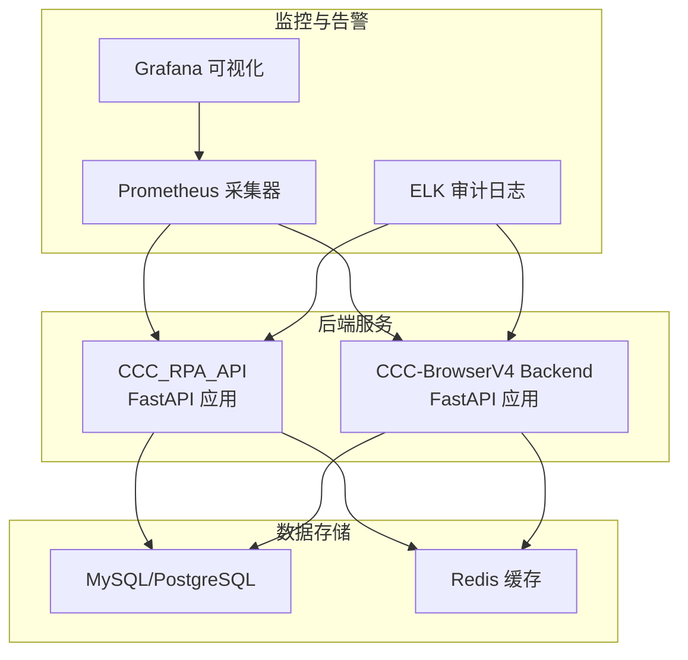
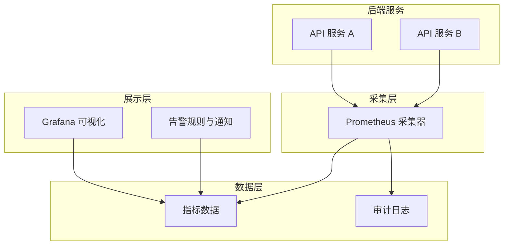
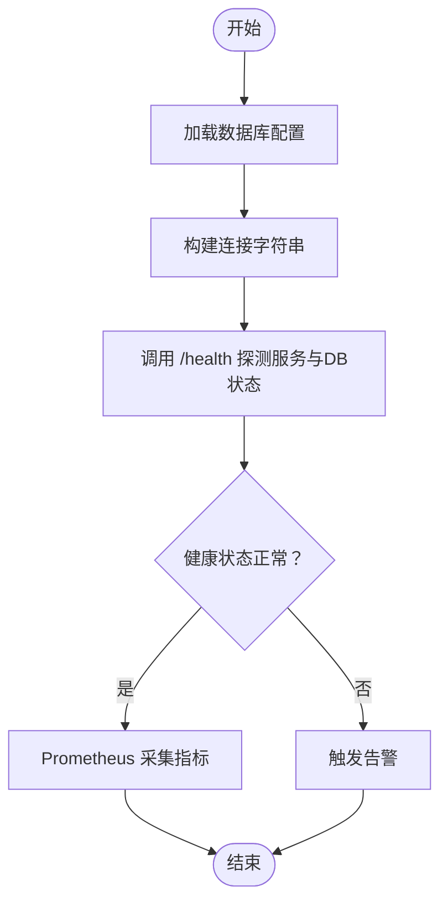
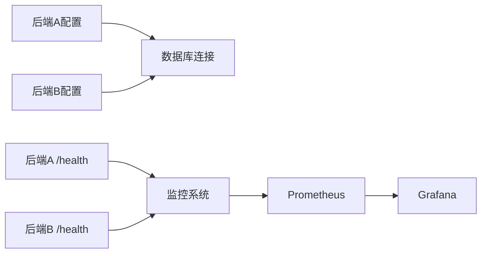

# 可视化监控面板

<cite>
**本文引用的文件**
- [project.md](file://project.md)
- [docker-compose.yml](file://CCC-BrowserV4/docker-compose.yml)
- [backend/app/config.py](file://CCC-BrowserV4/backend/app/config.py)
- [backend/app/database.py](file://CCC-BrowserV4/backend/app/database.py)
- [backend/app/api/health.py](file://CCC-BrowserV4/backend/app/api/health.py)
- [backend/README.md](file://CCC-BrowserV4/backend/README.md)
- [app/main.py](file://CCC_RPA_API/app/main.py)
- [app/config.py](file://CCC_RPA_API/app/config.py)
- [app/api/tasks.py](file://CCC_RPA_API/app/api/tasks.py)
- [app/models/task.py](file://CCC_RPA_API/app/models/task.py)
- [app/services/task.py](file://CCC_RPA_API/app/services/task.py)
</cite>

## 目录
1. [简介](#简介)
2. [项目结构](#项目结构)
3. [核心组件](#核心组件)
4. [架构总览](#架构总览)
5. [详细组件分析](#详细组件分析)
6. [依赖关系分析](#依赖关系分析)
7. [性能考量](#性能考量)
8. [故障排查指南](#故障排查指南)
9. [结论](#结论)
10. [附录](#附录)

## 简介
本文件面向“可视化监控面板”的设计与配置，围绕 Grafana 监控面板展开，结合仓库中明确的监控与告警需求，系统阐述数据源配置、面板布局与图表类型选择、关键监控仪表板组成（系统健康状态、业务指标趋势、性能瓶颈分析）、告警规则配置方法（阈值设置、触发条件与通知策略）、自定义查询语句编写与优化（PromQL 语法与聚合函数）、以及面板模板使用与定制化修改（主题与响应式布局）。  
本项目在需求层面已明确 Prometheus 指标采集与 Grafana 可视化大盘的建设目标，并要求区分全局与租户双维度指标，以支撑业务可观测性与运维保障。

章节来源
- [project.md:425-433](file://project.md#L425-L433)

## 项目结构
本仓库包含两套后端服务与前端工程，其中与监控相关的关键点如下：
- 监控与告警需求：Prometheus 指标采集、Grafana 可视化、ELK 审计日志、异常告警规则。
- 数据源与连接：MySQL/PostgreSQL 数据库连接配置与健康检查接口。
- 健康检查：提供 /health 接口用于探活与数据库连接状态检查。
- 部署与环境：提供 docker-compose 一键启动 MySQL，便于本地或测试环境快速搭建。

图表来源
- [project.md:425-433](file://project.md#L425-L433)
- [docker-compose.yml:1-21](file://CCC-BrowserV4/docker-compose.yml#L1-L21)
- [backend/app/config.py:1-51](file://CCC-BrowserV4/backend/app/config.py#L1-L51)
- [app/config.py:1-22](file://CCC_RPA_API/app/config.py#L1-L22)

章节来源
- [project.md:425-433](file://project.md#L425-L433)
- [docker-compose.yml:1-21](file://CCC-BrowserV4/docker-compose.yml#L1-L21)
- [backend/README.md:1-66](file://CCC-BrowserV4/backend/README.md#L1-L66)

## 核心组件
- 监控与告警需求（来自需求文档）：Prometheus 统一采集指标（Pod/进程 CPU、内存、CDP 长连接数量、AI 推理耗时、会话崩溃次数、代理 IP 失效数量），Grafana 可视化监控大盘（区分全局/租户双维度），ELK 收集全量操作审计日志，异常告警规则（会话批量崩溃、AI 推理超时、集群资源耗尽、代理 IP 批量失效）。
- 数据源与连接：两套后端服务均提供 /health 健康检查接口，便于监控系统探测服务可用性与数据库连接状态；数据库连接通过配置类集中管理，便于统一接入监控采集。
- 面板与告警：需求文档明确要求 Grafana 可视化大盘与告警配置模板，便于开箱即用。

章节来源
- [project.md:425-433](file://project.md#L425-L433)
- [backend/app/api/health.py:10-17](file://CCC-BrowserV4/backend/app/api/health.py#L10-L17)
- [app/main.py:114-116](file://CCC_RPA_API/app/main.py#L114-L116)
- [backend/app/config.py:28-47](file://CCC-BrowserV4/backend/app/config.py#L28-L47)
- [app/config.py:13-15](file://CCC_RPA_API/app/config.py#L13-L15)

## 架构总览
下图展示了监控与告警在整体系统中的位置与交互关系，强调 Prometheus 采集、Grafana 可视化与 ELK 审计日志的协同作用。

图表来源
- [project.md:425-433](file://project.md#L425-L433)

## 详细组件分析

### 数据源配置
- 数据库连接配置：两套后端服务均通过配置类集中管理数据库连接参数（主机、端口、用户名、密码、数据库名），并提供连接 URL 工厂属性，便于统一接入监控采集与健康检查。
- 健康检查接口：后端服务提供 /health 接口，返回服务状态与数据库连接状态，可用于 Prometheus 的 HTTP 探针或服务发现健康检查。
- 本地数据库启动：提供 docker-compose 一键启动 MySQL，便于本地或测试环境快速搭建数据库，确保监控采集与业务服务在同一网络环境下运行。

图表来源
- [backend/app/config.py:28-47](file://CCC-BrowserV4/backend/app/config.py#L28-L47)
- [app/config.py:13-15](file://CCC_RPA_API/app/config.py#L13-L15)
- [backend/app/api/health.py:10-17](file://CCC-BrowserV4/backend/app/api/health.py#L10-L17)
- [app/main.py:114-116](file://CCC_RPA_API/app/main.py#L114-L116)
- [docker-compose.yml:1-21](file://CCC-BrowserV4/docker-compose.yml#L1-L21)

章节来源
- [backend/app/config.py:28-47](file://CCC-BrowserV4/backend/app/config.py#L28-L47)
- [app/config.py:13-15](file://CCC_RPA_API/app/config.py#L13-L15)
- [backend/app/api/health.py:10-17](file://CCC-BrowserV4/backend/app/api/health.py#L10-L17)
- [app/main.py:114-116](file://CCC_RPA_API/app/main.py#L114-L116)
- [docker-compose.yml:1-21](file://CCC-BrowserV4/docker-compose.yml#L1-L21)

### 面板布局与图表类型选择
- 双维度指标：需求明确区分全局与租户双维度指标，因此面板应提供租户筛选器与全局概览视图，便于多租户场景下的资源与业务使用情况对比。
- 图表类型建议：
  - 趋势类：折线图用于展示 CPU/内存/会话数量随时间的变化。
  - 分布类：堆叠柱状图用于展示不同租户的资源占用分布。
  - 指标卡片：用于展示关键指标当前值与阈值状态。
  - 热力图：用于展示任务执行成功率或错误分布。
- 布局原则：将系统健康状态（CPU/内存/连接数/崩溃率）置于顶部，业务指标趋势居中，性能瓶颈分析（如推理耗时、代理 IP 失效率）放在底部，便于快速定位问题。

章节来源
- [project.md:429](file://project.md#L429)

### 关键监控仪表板组成
- 系统健康状态：CPU 使用率、内存使用率、CDP 长连接数量、会话崩溃次数、代理 IP 失效数量。
- 业务指标趋势：任务执行次数、任务成功率、租户并发峰值、会话运行时长。
- 性能瓶颈分析：AI 推理耗时、页面操作延迟、数据库连接池使用率、WebSocket 在线连接数。

章节来源
- [project.md:427-429](file://project.md#L427-L429)

### 告警规则配置
- 阈值设置：针对 CPU/内存/崩溃率/推理耗时/代理 IP 失效率设定阈值，结合业务 SLA 与容量规划确定合理阈值。
- 触发条件：单一指标超阈值、多指标组合触发、滑动窗口内的平均值或峰值触发。
- 通知策略：邮件/IM/短信等多通道通知，区分严重/警告级别，避免告警风暴。

章节来源
- [project.md:433](file://project.md#L433)

### 自定义查询语句编写与优化
- PromQL 语法：使用 rate()、increase()、histogram_quantile()、sum()、avg()、max()、by()/without() 等聚合函数，结合 label 过滤与时间窗口进行查询。
- 优化建议：避免使用过于宽泛的时间范围；对高基数标签进行过滤；使用聚合替代明细查询；利用 recording rules 预计算热点查询。

章节来源
- [project.md:427-429](file://project.md#L427-L429)

### 面板模板使用与定制化修改
- 模板使用：基于需求文档提供的“开箱即用 Grafana 监控大盘与告警通知配置模板”，快速部署全局与租户维度的监控面板。
- 主题配置：统一图表颜色、字体大小与间距，确保在不同分辨率与设备上的可读性。
- 响应式布局：根据屏幕尺寸自动调整面板布局，优先展示关键指标与趋势图，次要指标折叠至二级面板。

章节来源
- [project.md:556](file://project.md#L556)

## 依赖关系分析
- 后端服务与数据库：两套后端服务均通过配置类管理数据库连接，统一暴露 /health 接口，便于监控系统统一采集。
- 监控采集：Prometheus 从后端服务拉取指标，结合数据库连接状态与业务指标，形成完整的可观测性闭环。
- 健康检查：/health 接口返回服务状态与数据库连接状态，是监控系统判定服务健康的重要依据。

图表来源
- [backend/app/config.py:28-47](file://CCC-BrowserV4/backend/app/config.py#L28-L47)
- [app/config.py:13-15](file://CCC_RPA_API/app/config.py#L13-L15)
- [backend/app/api/health.py:10-17](file://CCC-BrowserV4/backend/app/api/health.py#L10-L17)
- [app/main.py:114-116](file://CCC_RPA_API/app/main.py#L114-L116)

章节来源
- [backend/app/config.py:28-47](file://CCC-BrowserV4/backend/app/config.py#L28-L47)
- [app/config.py:13-15](file://CCC_RPA_API/app/config.py#L13-L15)
- [backend/app/api/health.py:10-17](file://CCC-BrowserV4/backend/app/api/health.py#L10-L17)
- [app/main.py:114-116](file://CCC_RPA_API/app/main.py#L114-L116)

## 性能考量
- 指标粒度：避免过度细化导致查询与存储压力过大；对高频指标进行采样与聚合。
- 查询优化：使用 recording rules 降低查询复杂度；合理设置 scrape interval 与 retention。
- 资源隔离：Prometheus 与业务服务分离部署，避免相互影响；为数据库与缓存设置合理的连接池与超时参数。

## 故障排查指南
- 服务不可达：检查 /health 接口返回状态与数据库连接状态，确认后端服务与数据库连通性。
- 指标缺失：确认 Prometheus 抓取配置正确，目标地址可达且端口开放；检查防火墙与网络策略。
- 告警未触发：核对告警规则表达式、阈值与时间窗口；检查通知通道配置与静默规则。

章节来源
- [backend/app/api/health.py:10-17](file://CCC-BrowserV4/backend/app/api/health.py#L10-L17)
- [app/main.py:114-116](file://CCC_RPA_API/app/main.py#L114-L116)

## 结论
本项目在需求层面已明确 Prometheus 与 Grafana 的监控与告警目标，并要求区分全局与租户双维度指标。结合后端服务的健康检查接口与数据库连接配置，可快速构建覆盖系统健康、业务趋势与性能瓶颈的可视化监控面板，并通过告警规则与通知策略保障线上问题的及时发现与处置。建议在实际落地时遵循“先模板后定制”的原则，优先使用开箱即用的面板与告警模板，再根据业务场景进行细化与优化。

## 附录
- 部署与环境：使用 docker-compose 一键启动 MySQL，便于本地或测试环境快速搭建数据库。
- 配置文件：后端服务通过配置类集中管理数据库连接参数，便于统一接入监控采集。

章节来源
- [docker-compose.yml:1-21](file://CCC-BrowserV4/docker-compose.yml#L1-L21)
- [backend/README.md:1-66](file://CCC-BrowserV4/backend/README.md#L1-L66)