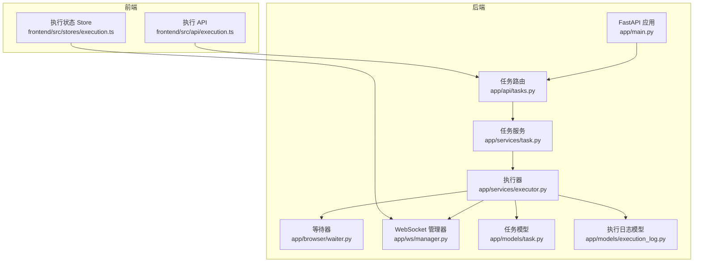
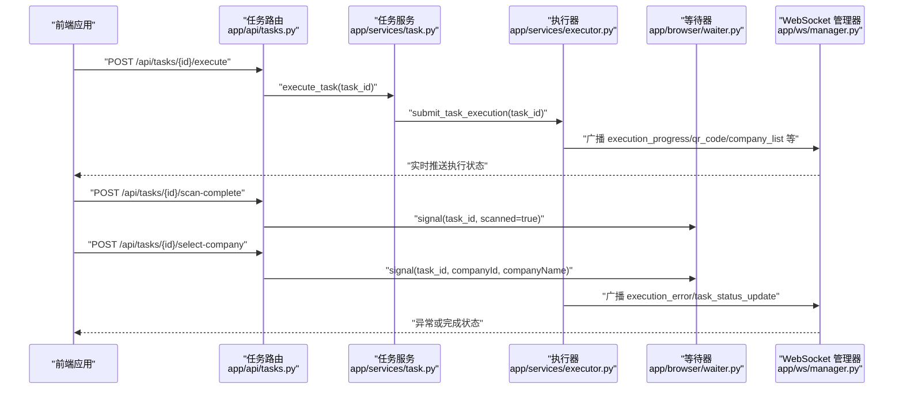
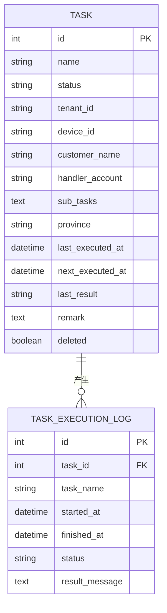
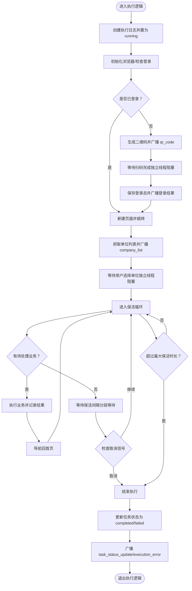
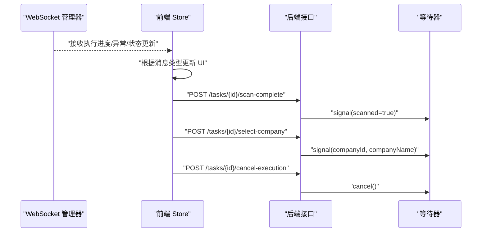
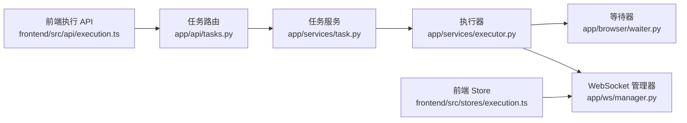

# 告警通知系统

<cite>
**本文引用的文件**
- [main.py](file://CCC_RPA_API/app/main.py)
- [config.py](file://CCC_RPA_API/app/config.py)
- [task.py](file://CCC_RPA_API/app/models/task.py)
- [execution_log.py](file://CCC_RPA_API/app/models/execution_log.py)
- [executor.py](file://CCC_RPA_API/app/services/executor.py)
- [task_service.py](file://CCC_RPA_API/app/services/task.py)
- [tasks_api.py](file://CCC_RPA_API/app/api/tasks.py)
- [waiter.py](file://CCC_RPA_API/app/browser/waiter.py)
- [manager.py](file://CCC_RPA_API/app/ws/manager.py)
- [project.md](file://project.md)
- [execution.ts](file://CCC-BrowserV4/frontend/src/api/execution.ts)
- [execution_store.ts](file://CCC-BrowserV4/frontend/src/stores/execution.ts)
</cite>

## 目录
1. [简介](#简介)
2. [项目结构](#项目结构)
3. [核心组件](#核心组件)
4. [架构总览](#架构总览)
5. [详细组件分析](#详细组件分析)
6. [依赖关系分析](#依赖关系分析)
7. [性能考量](#性能考量)
8. [故障排查指南](#故障排查指南)
9. [结论](#结论)
10. [附录](#附录)

## 简介
本文件面向“告警通知系统”的实现与运维，结合仓库现有代码与项目文档，系统化梳理异常告警机制、通知渠道集成、去重与抑制策略、处理流程（自动/人工/升级）、策略优化建议以及监控与维护方法。当前代码库以任务执行为主线，通过 WebSocket 实时推送执行状态与异常，形成基础的告警触达能力；项目文档明确了监控与告警的整体目标与范围，为后续扩展邮件、短信、企业微信、钉钉等通知渠道提供蓝图。

## 项目结构
- 后端采用 FastAPI 提供 REST API 与 WebSocket，负责任务编排、执行状态广播与异常上报。
- 任务模型与执行日志模型用于持久化任务生命周期与结果。
- 执行器负责 Playwright 会话管理、业务执行、异常捕获与状态广播。
- 前端通过 WebSocket 接收实时状态，驱动用户交互（扫码、选择单位、取消执行）。

图表来源
- [main.py:1-127](file://CCC_RPA_API/app/main.py#L1-L127)
- [task_service.py:1-157](file://CCC_RPA_API/app/services/task.py#L1-L157)
- [executor.py:1-318](file://CCC_RPA_API/app/services/executor.py#L1-L318)
- [waiter.py:1-84](file://CCC_RPA_API/app/browser/waiter.py#L1-L84)
- [manager.py:1-29](file://CCC_RPA_API/app/ws/manager.py#L1-L29)
- [task.py:1-25](file://CCC_RPA_API/app/models/task.py#L1-L25)
- [execution_log.py:1-17](file://CCC_RPA_API/app/models/execution_log.py#L1-L17)
- [tasks_api.py:1-76](file://CCC_RPA_API/app/api/tasks.py#L1-L76)
- [execution.ts:1-19](file://CCC-BrowserV4/frontend/src/api/execution.ts#L1-L19)
- [execution_store.ts:1-67](file://CCC-BrowserV4/frontend/src/stores/execution.ts#L1-L67)

章节来源
- [main.py:1-127](file://CCC_RPA_API/app/main.py#L1-L127)
- [tasks_api.py:1-76](file://CCC_RPA_API/app/api/tasks.py#L1-L76)
- [task_service.py:1-157](file://CCC_RPA_API/app/services/task.py#L1-L157)
- [executor.py:1-318](file://CCC_RPA_API/app/services/executor.py#L1-L318)
- [waiter.py:1-84](file://CCC_RPA_API/app/browser/waiter.py#L1-L84)
- [manager.py:1-29](file://CCC_RPA_API/app/ws/manager.py#L1-L29)
- [task.py:1-25](file://CCC_RPA_API/app/models/task.py#L1-L25)
- [execution_log.py:1-17](file://CCC_RPA_API/app/models/execution_log.py#L1-L17)
- [execution.ts:1-19](file://CCC-BrowserV4/frontend/src/api/execution.ts#L1-L19)
- [execution_store.ts:1-67](file://CCC-BrowserV4/frontend/src/stores/execution.ts#L1-L67)

## 核心组件
- 任务模型与执行日志：记录任务状态、执行时间、结果与备注，支撑告警触发与回溯。
- 执行器：封装 Playwright 会话、业务执行、异常捕获与状态广播，是告警产生的源头。
- WebSocket 管理器：统一广播消息，前端订阅并展示实时状态。
- 等待器：在关键阶段阻塞/唤醒，支持用户扫码、选择单位、取消执行，间接影响告警策略。
- 任务服务与路由：对外暴露执行、取消、扫码完成、选择单位等接口，驱动执行器。
- 前端 Store：接收 WebSocket 消息，更新 UI 状态，触发用户交互。

章节来源
- [task.py:1-25](file://CCC_RPA_API/app/models/task.py#L1-L25)
- [execution_log.py:1-17](file://CCC_RPA_API/app/models/execution_log.py#L1-L17)
- [executor.py:1-318](file://CCC_RPA_API/app/services/executor.py#L1-L318)
- [manager.py:1-29](file://CCC_RPA_API/app/ws/manager.py#L1-L29)
- [waiter.py:1-84](file://CCC_RPA_API/app/browser/waiter.py#L1-L84)
- [task_service.py:1-157](file://CCC_RPA_API/app/services/task.py#L1-L157)
- [tasks_api.py:1-76](file://CCC_RPA_API/app/api/tasks.py#L1-L76)
- [execution_store.ts:1-67](file://CCC-BrowserV4/frontend/src/stores/execution.ts#L1-L67)

## 架构总览
下图展示了从任务执行到前端实时反馈的关键路径，以及异常发生时的状态广播与前端处理流程。

图表来源
- [tasks_api.py:47-76](file://CCC_RPA_API/app/api/tasks.py#L47-L76)
- [task_service.py:120-133](file://CCC_RPA_API/app/services/task.py#L120-L133)
- [executor.py:78-317](file://CCC_RPA_API/app/services/executor.py#L78-L317)
- [waiter.py:35-69](file://CCC_RPA_API/app/browser/waiter.py#L35-L69)
- [manager.py:17-26](file://CCC_RPA_API/app/ws/manager.py#L17-L26)
- [execution.ts:1-19](file://CCC-BrowserV4/frontend/src/api/execution.ts#L1-L19)
- [execution_store.ts:22-67](file://CCC-BrowserV4/frontend/src/stores/execution.ts#L22-L67)

## 详细组件分析

### 任务模型与执行日志
- 任务模型包含状态、上次/下次执行时间、结果、备注等字段，用于判断任务健康度与异常趋势。
- 执行日志记录每次执行的开始/结束时间、状态与结果描述，便于审计与回放。

图表来源
- [task.py:8-25](file://CCC_RPA_API/app/models/task.py#L8-L25)
- [execution_log.py:7-17](file://CCC_RPA_API/app/models/execution_log.py#L7-L17)

章节来源
- [task.py:1-25](file://CCC_RPA_API/app/models/task.py#L1-L25)
- [execution_log.py:1-17](file://CCC_RPA_API/app/models/execution_log.py#L1-L17)

### 执行器：异常捕获与状态广播
- 在执行过程中，遇到异常会更新任务与日志状态，并通过 WebSocket 广播异常消息与最终状态更新。
- 广播消息类型包括执行进度、二维码、单位列表、登录结果、异常与任务状态更新等，前端据此更新 UI 并触发用户交互。

图表来源
- [executor.py:78-317](file://CCC_RPA_API/app/services/executor.py#L78-L317)

章节来源
- [executor.py:1-318](file://CCC_RPA_API/app/services/executor.py#L1-L318)

### WebSocket 管理器与前端交互
- WebSocket 管理器负责连接接入、广播消息与清理断开连接。
- 前端 Store 根据消息类型更新执行步骤、提示信息与二维码/公司列表等 UI 状态。
- 前端 API 提供扫码完成、选择单位、取消执行等接口，向后端发送信号。

图表来源
- [manager.py:17-26](file://CCC_RPA_API/app/ws/manager.py#L17-L26)
- [execution_store.ts:22-67](file://CCC-BrowserV4/frontend/src/stores/execution.ts#L22-L67)
- [execution.ts:1-19](file://CCC-BrowserV4/frontend/src/api/execution.ts#L1-L19)
- [tasks_api.py:60-76](file://CCC_RPA_API/app/api/tasks.py#L60-L76)
- [waiter.py:35-69](file://CCC_RPA_API/app/browser/waiter.py#L35-L69)

章节来源
- [manager.py:1-29](file://CCC_RPA_API/app/ws/manager.py#L1-L29)
- [execution_store.ts:1-67](file://CCC-BrowserV4/frontend/src/stores/execution.ts#L1-L67)
- [execution.ts:1-19](file://CCC-BrowserV4/frontend/src/api/execution.ts#L1-L19)
- [tasks_api.py:1-76](file://CCC_RPA_API/app/api/tasks.py#L1-L76)
- [waiter.py:1-84](file://CCC_RPA_API/app/browser/waiter.py#L1-L84)

### 告警规则配置、触发条件与级别
基于现有代码与项目文档，可抽象出如下告警规则框架（概念性说明，非现有实现）：
- 触发条件
  - 任务执行失败：当执行器捕获异常并广播失败消息时触发。
  - 登录态异常：二维码长时间未扫码、选择单位超时等。
  - 保活中断：超过最大保活时长仍未检测到业务，或保活循环被取消。
  - 浏览器异常：会话崩溃、页面断连等（需外部监控指标接入）。
- 告警级别
  - 严重：任务失败、浏览器崩溃、登录态失效。
  - 警告：扫码超时、选择单位超时、保活异常。
  - 通知：执行进度、登录成功等常规状态。
- 告警去重与抑制
  - 去重：按任务 ID 与告警类型聚合，同一周期内相同告警只保留一条。
  - 抑制：严重告警触发后，抑制同源同类的低级别告警，直至恢复。

[本节为概念性设计说明，不直接分析具体文件，故不附加章节来源]

### 通知渠道集成（邮件/短信/企业微信/钉钉）
- 现状：后端通过 WebSocket 推送执行状态，前端接收并展示；项目文档明确“异常告警规则：支持消息推送”，但未给出具体实现。
- 建议集成点
  - 在执行器异常分支增加通知服务调用，将告警事件写入消息队列或直接调用第三方通道。
  - 通知内容包含任务 ID、任务名称、异常类型、时间戳、上下文链接等。
  - 通知渠道参数化配置，支持按租户/任务动态选择。

[本节为概念性设计说明，不直接分析具体文件，故不附加章节来源]

### 告警处理流程（自动/人工/升级）
- 自动处理：对可恢复的异常（如短暂网络波动）进行重试或降级处理。
- 人工干预：在扫码、选择单位等环节等待用户输入，前端提供取消按钮。
- 升级机制：若同一问题在短时间内反复出现，提升告警级别并通知更高优先级渠道。

[本节为概念性设计说明，不直接分析具体文件，故不附加章节来源]

### 告警策略优化建议
- 阈值调优：根据历史成功率与失败原因分布，调整保活间隔、扫码/选择超时阈值。
- 告警延迟：对瞬时抖动设置延迟窗口，避免噪声告警。
- 静默窗口：在业务低峰时段设置静默窗口，减少干扰。
- 告警收敛：合并相似告警，限制单周期告警数量。

[本节为通用建议，不直接分析具体文件，故不附加章节来源]

## 依赖关系分析
- 组件耦合
  - 任务服务依赖执行器提交任务；执行器依赖等待器与 WebSocket 管理器。
  - 前端通过 API 与等待器交互，等待器再与执行器协作。
- 外部依赖
  - 数据库：SQLAlchemy 连接与迁移。
  - 浏览器自动化：Playwright 与 stealth。
  - WebSocket：FastAPI 原生支持。

图表来源
- [tasks_api.py:1-76](file://CCC_RPA_API/app/api/tasks.py#L1-L76)
- [task_service.py:1-157](file://CCC_RPA_API/app/services/task.py#L1-L157)
- [executor.py:1-318](file://CCC_RPA_API/app/services/executor.py#L1-L318)
- [waiter.py:1-84](file://CCC_RPA_API/app/browser/waiter.py#L1-L84)
- [manager.py:1-29](file://CCC_RPA_API/app/ws/manager.py#L1-L29)
- [execution.ts:1-19](file://CCC-BrowserV4/frontend/src/api/execution.ts#L1-L19)
- [execution_store.ts:1-67](file://CCC-BrowserV4/frontend/src/stores/execution.ts#L1-L67)

章节来源
- [tasks_api.py:1-76](file://CCC_RPA_API/app/api/tasks.py#L1-L76)
- [task_service.py:1-157](file://CCC_RPA_API/app/services/task.py#L1-L157)
- [executor.py:1-318](file://CCC_RPA_API/app/services/executor.py#L1-L318)
- [waiter.py:1-84](file://CCC_RPA_API/app/browser/waiter.py#L1-L84)
- [manager.py:1-29](file://CCC_RPA_API/app/ws/manager.py#L1-L29)
- [execution.ts:1-19](file://CCC-BrowserV4/frontend/src/api/execution.ts#L1-L19)
- [execution_store.ts:1-67](file://CCC-BrowserV4/frontend/src/stores/execution.ts#L1-L67)

## 性能考量
- 线程池与异步：执行器使用线程池执行阻塞操作，避免阻塞事件循环；WebSocket 广播通过主事件循环安全调度。
- 等待策略：保活循环采用分段等待，便于及时响应取消信号。
- 日志与审计：执行日志持久化，便于定位问题与统计趋势。

[本节提供通用指导，不直接分析具体文件，故不附加章节来源]

## 故障排查指南
- 常见问题
  - 扫码超时：检查前端扫码完成接口是否正确调用，后端等待器是否收到信号。
  - 选择单位超时：确认前端选择单位接口调用与等待器数据传递。
  - 任务失败：查看执行日志与异常广播消息，定位具体步骤。
- 关键路径
  - 任务执行入口：路由 -> 任务服务 -> 执行器。
  - 异常传播：执行器捕获异常 -> 更新任务/日志 -> 广播异常消息 -> 前端展示。
  - 用户交互：前端调用取消/扫码完成/选择单位 -> 等待器 -> 执行器继续/终止。

章节来源
- [tasks_api.py:47-76](file://CCC_RPA_API/app/api/tasks.py#L47-L76)
- [task_service.py:120-133](file://CCC_RPA_API/app/services/task.py#L120-L133)
- [executor.py:285-317](file://CCC_RPA_API/app/services/executor.py#L285-L317)
- [waiter.py:14-69](file://CCC_RPA_API/app/browser/waiter.py#L14-L69)
- [execution.ts:1-19](file://CCC-BrowserV4/frontend/src/api/execution.ts#L1-L19)
- [execution_store.ts:22-67](file://CCC-BrowserV4/frontend/src/stores/execution.ts#L22-L67)

## 结论
当前代码库已具备完善的任务执行与实时状态广播能力，能够满足基础告警触达需求。结合项目文档中“全链路监控与告警”目标，建议在执行器异常路径中接入通知服务，完善去重与抑制策略，并通过阈值调优、延迟与静默窗口等手段优化告警质量。前端交互与后端广播的清晰边界，为后续扩展多渠道通知提供了良好基础。

[本节为总结性内容，不直接分析具体文件，故不附加章节来源]

## 附录
- 监控与运维要点
  - 指标采集：参考项目文档的 Prometheus 指标清单，补充任务执行成功率、异常类型分布、告警送达率等。
  - 可视化：Grafana 大盘展示全局与租户维度指标。
  - 审计：ELK 收集全量操作审计日志，保障可追溯。
  - 容错：分层容错规范已在文档中明确，执行器与前端交互需遵循。

章节来源
- [project.md:425-443](file://project.md#L425-L443)