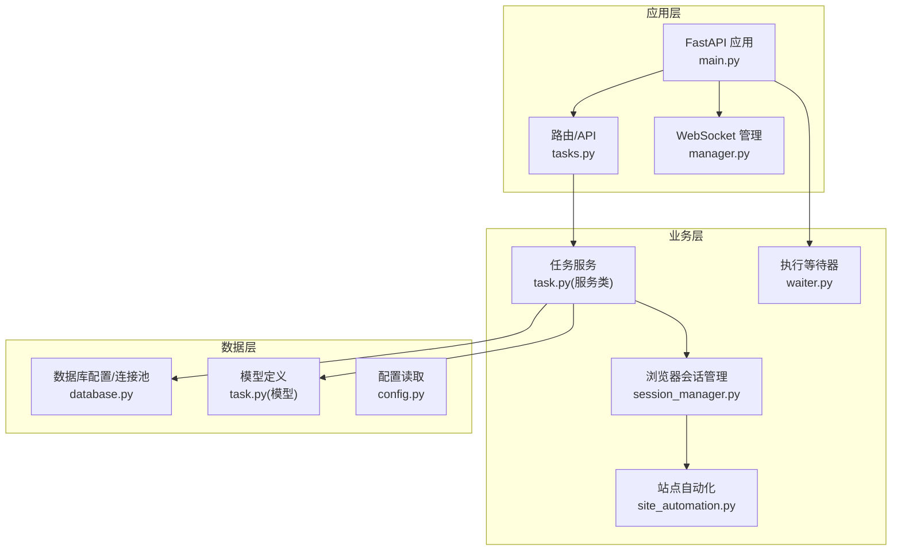
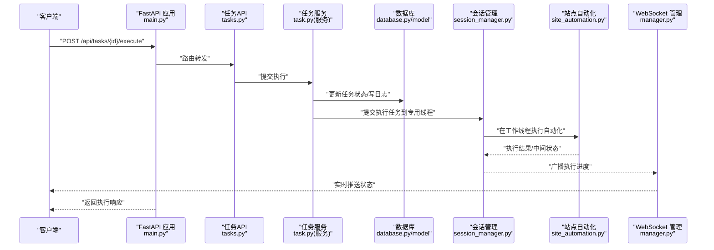
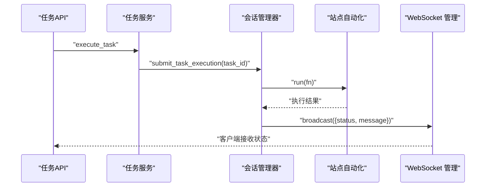
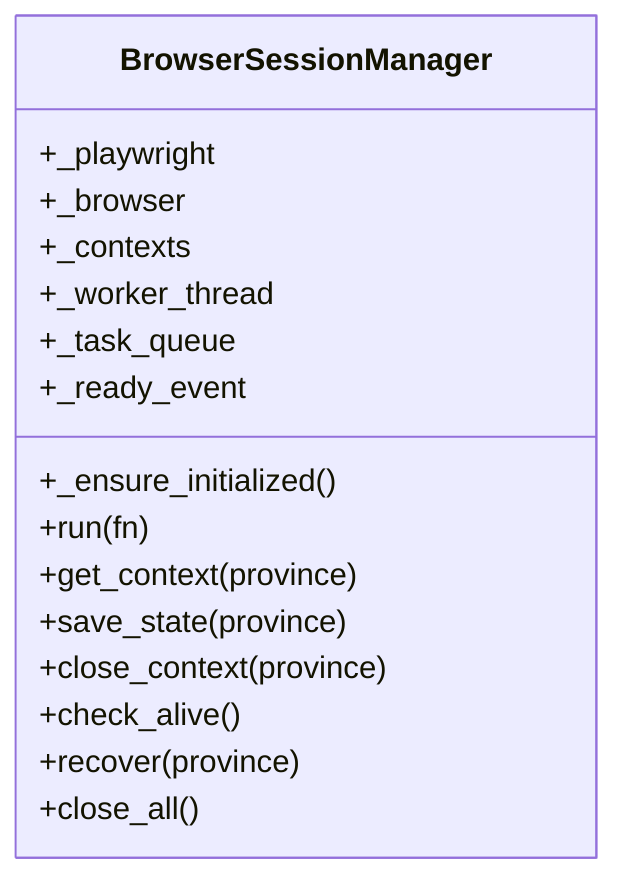
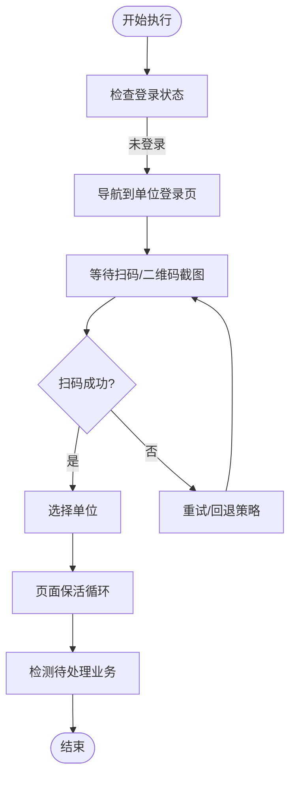
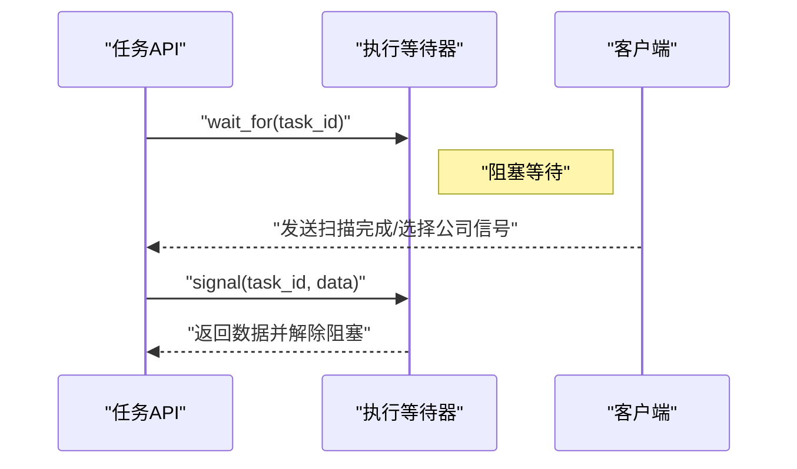
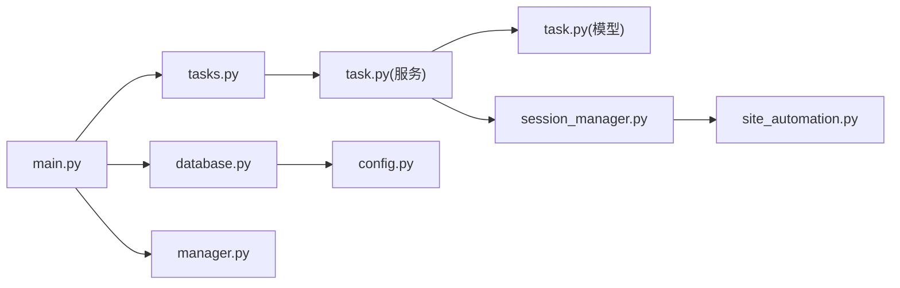

# 性能监控与容量规划

<cite>
**本文引用的文件**
- [main.py](file://CCC_RPA_API/app/main.py)
- [config.py](file://CCC_RPA_API/app/config.py)
- [database.py](file://CCC_RPA_API/app/database.py)
- [tasks.py](file://CCC_RPA_API/app/api/tasks.py)
- [task.py](file://CCC_RPA_API/app/models/task.py)
- [session_manager.py](file://CCC_RPA_API/app/browser/session_manager.py)
- [site_automation.py](file://CCC_RPA_API/app/browser/site_automation.py)
- [waiter.py](file://CCC_RPA_API/app/browser/waiter.py)
- [manager.py](file://CCC_RPA_API/app/ws/manager.py)
</cite>

## 目录
1. [简介](#简介)
2. [项目结构](#项目结构)
3. [核心组件](#核心组件)
4. [架构总览](#架构总览)
5. [详细组件分析](#详细组件分析)
6. [依赖分析](#依赖分析)
7. [性能监控方法与工具](#性能监控方法与工具)
8. [容量规划实施步骤](#容量规划实施步骤)
9. [性能瓶颈识别与分析](#性能瓶颈识别与分析)
10. [性能优化实践案例](#性能优化实践案例)
11. [量化指标与计算方法](#量化指标与计算方法)
12. [性能测试与压测指南](#性能测试与压测指南)
13. [故障排查指南](#故障排查指南)
14. [结论](#结论)

## 简介
本文件面向AI RPA系统的性能监控与容量规划，结合现有代码库的架构与实现，系统阐述以下主题：
- 性能监控：系统资源、应用性能、业务指标的观测与告警
- 容量规划：需求预测、资源评估、扩容策略
- 瓶颈识别：CPU、内存、磁盘I/O、网络带宽的定位与分析
- 优化实践：数据库、缓存、并发控制的实操建议
- 量化指标：QPS预估、存储需求、网络带宽规划
- 压测指南：端到端流程、脚本设计、稳定性保障

## 项目结构
后端基于FastAPI，采用模块化分层：
- 应用入口与路由注册、健康检查、WebSocket广播
- 数据库配置与连接池、模型定义
- API层：任务管理、执行控制、日志查询
- 业务层：任务服务、浏览器会话管理、站点自动化、执行等待器
- 通信层：WebSocket连接管理

图表来源
- [main.py:12-127](file://CCC_RPA_API/app/main.py#L12-L127)
- [tasks.py:1-76](file://CCC_RPA_API/app/api/tasks.py#L1-L76)
- [manager.py:1-29](file://CCC_RPA_API/app/ws/manager.py#L1-L29)
- [database.py:1-19](file://CCC_RPA_API/app/database.py#L1-L19)
- [task.py:1-25](file://CCC_RPA_API/app/models/task.py#L1-L25)
- [session_manager.py:1-186](file://CCC_RPA_API/app/browser/session_manager.py#L1-L186)
- [site_automation.py:1-683](file://CCC_RPA_API/app/browser/site_automation.py#L1-L683)
- [waiter.py:1-84](file://CCC_RPA_API/app/browser/waiter.py#L1-L84)
- [config.py:1-22](file://CCC_RPA_API/app/config.py#L1-L22)

章节来源
- [main.py:12-127](file://CCC_RPA_API/app/main.py#L12-L127)
- [tasks.py:1-76](file://CCC_RPA_API/app/api/tasks.py#L1-L76)
- [database.py:1-19](file://CCC_RPA_API/app/database.py#L1-L19)
- [config.py:1-22](file://CCC_RPA_API/app/config.py#L1-L22)

## 核心组件
- 应用入口与生命周期
  - 启动事件：创建数据库表、迁移扩展字段、插入示例数据、延迟初始化浏览器
  - 关闭事件：关闭所有浏览器会话
  - 健康检查：/health
  - WebSocket：/ws 广播执行状态
- 数据库与模型
  - 连接池配置：pre_ping、recycle
  - 任务模型：状态、时间、租户/设备/客户/经办人、省/子任务等字段
- API与服务
  - 任务API：分页、CRUD、执行、日志、交互信号
  - 任务服务：查询、创建、更新、删除、执行提交、日志查询
- 浏览器自动化
  - 专用线程+队列：Playwright Chromium实例、上下文复用、状态持久化
  - 站点自动化：登录、扫码、单位选择、页面保活、待处理业务检测
  - 执行等待器：基于Event的用户交互暂停/恢复机制

章节来源
- [main.py:30-127](file://CCC_RPA_API/app/main.py#L30-L127)
- [database.py:1-19](file://CCC_RPA_API/app/database.py#L1-L19)
- [task.py:8-25](file://CCC_RPA_API/app/models/task.py#L8-L25)
- [tasks.py:1-76](file://CCC_RPA_API/app/api/tasks.py#L1-L76)
- [session_manager.py:1-186](file://CCC_RPA_API/app/browser/session_manager.py#L1-L186)
- [site_automation.py:1-683](file://CCC_RPA_API/app/browser/site_automation.py#L1-L683)
- [waiter.py:1-84](file://CCC_RPA_API/app/browser/waiter.py#L1-L84)

## 架构总览
下图展示请求从API到浏览器自动化执行的关键路径，以及WebSocket广播与数据库交互。

图表来源
- [main.py:114-127](file://CCC_RPA_API/app/main.py#L114-L127)
- [tasks.py:47-52](file://CCC_RPA_API/app/api/tasks.py#L47-L52)
- [session_manager.py:80-96](file://CCC_RPA_API/app/browser/session_manager.py#L80-L96)
- [site_automation.py:1-683](file://CCC_RPA_API/app/browser/site_automation.py#L1-L683)
- [manager.py:17-27](file://CCC_RPA_API/app/ws/manager.py#L17-L27)
- [database.py:1-19](file://CCC_RPA_API/app/database.py#L1-L19)

## 详细组件分析

### 组件A：任务执行与状态广播
- 触发点：API调用执行任务
- 服务侧：更新任务状态、提交执行任务至会话管理器
- 会话管理器：专用线程执行浏览器自动化，必要时恢复会话
- WebSocket：向所有连接广播执行状态

图表来源
- [tasks.py:120-133](file://CCC_RPA_API/app/services/task.py#L120-L133)
- [session_manager.py:80-96](file://CCC_RPA_API/app/browser/session_manager.py#L80-L96)
- [site_automation.py:1-683](file://CCC_RPA_API/app/browser/site_automation.py#L1-L683)
- [manager.py:17-27](file://CCC_RPA_API/app/ws/manager.py#L17-L27)

章节来源
- [tasks.py:47-52](file://CCC_RPA_API/app/api/tasks.py#L47-L52)
- [tasks.py:120-133](file://CCC_RPA_API/app/services/task.py#L120-L133)
- [session_manager.py:80-96](file://CCC_RPA_API/app/browser/session_manager.py#L80-L96)
- [manager.py:17-27](file://CCC_RPA_API/app/ws/manager.py#L17-L27)

### 组件B：浏览器会话管理与线程模型
- 专用工作线程：集中管理Playwright/Chromium生命周期
- 上下文复用：按省维度持久化storage_state，减少登录成本
- 队列调度：安全地在线程间传递函数与结果
- 超时与错误：统一异常传播与超时处理

图表来源
- [session_manager.py:10-186](file://CCC_RPA_API/app/browser/session_manager.py#L10-L186)

章节来源
- [session_manager.py:10-186](file://CCC_RPA_API/app/browser/session_manager.py#L10-L186)

### 组件C：站点自动化与保活策略
- 登录与扫码：统一登录页直连、首页JS点击回退、二维码截图
- 单位选择：多选择器降级、文本匹配、索引回退、JS回退
- 页面保活：随机滚动/点击/等待，维持会话活性
- 待处理业务检测：徽标计数、关键词匹配

图表来源
- [site_automation.py:38-192](file://CCC_RPA_API/app/browser/site_automation.py#L38-L192)
- [site_automation.py:294-540](file://CCC_RPA_API/app/browser/site_automation.py#L294-L540)
- [site_automation.py:557-620](file://CCC_RPA_API/app/browser/site_automation.py#L557-L620)
- [site_automation.py:623-675](file://CCC_RPA_API/app/browser/site_automation.py#L623-L675)

章节来源
- [site_automation.py:38-192](file://CCC_RPA_API/app/browser/site_automation.py#L38-L192)
- [site_automation.py:294-540](file://CCC_RPA_API/app/browser/site_automation.py#L294-L540)
- [site_automation.py:557-620](file://CCC_RPA_API/app/browser/site_automation.py#L557-L620)
- [site_automation.py:623-675](file://CCC_RPA_API/app/browser/site_automation.py#L623-L675)

### 组件D：执行等待器与交互信号
- 等待：阻塞等待用户输入/确认
- 信号：收到数据后唤醒
- 取消：设置取消标记并唤醒
- 非阻塞检查：保活循环等场景使用

图表来源
- [waiter.py:14-43](file://CCC_RPA_API/app/browser/waiter.py#L14-L43)
- [tasks.py:60-75](file://CCC_RPA_API/app/api/tasks.py#L60-L75)

章节来源
- [waiter.py:14-43](file://CCC_RPA_API/app/browser/waiter.py#L14-L43)
- [tasks.py:60-75](file://CCC_RPA_API/app/api/tasks.py#L60-L75)

## 依赖分析
- 应用层依赖
  - main.py 依赖数据库初始化、路由注册、WebSocket管理
  - tasks.py 依赖数据库会话、任务服务、等待器
- 业务层依赖
  - 任务服务依赖模型、执行器提交、日志模型
  - 会话管理器依赖Playwright、线程、队列、存储目录
  - 站点自动化依赖人类行为模拟、等待器
- 数据层依赖
  - database.py 依赖配置；模型依赖基类

图表来源
- [main.py:1-127](file://CCC_RPA_API/app/main.py#L1-L127)
- [tasks.py:1-76](file://CCC_RPA_API/app/api/tasks.py#L1-L76)
- [database.py:1-19](file://CCC_RPA_API/app/database.py#L1-L19)
- [task.py:1-25](file://CCC_RPA_API/app/models/task.py#L1-L25)
- [session_manager.py:1-186](file://CCC_RPA_API/app/browser/session_manager.py#L1-L186)
- [site_automation.py:1-683](file://CCC_RPA_API/app/browser/site_automation.py#L1-L683)
- [manager.py:1-29](file://CCC_RPA_API/app/ws/manager.py#L1-L29)
- [config.py:1-22](file://CCC_RPA_API/app/config.py#L1-L22)

章节来源
- [main.py:1-127](file://CCC_RPA_API/app/main.py#L1-L127)
- [tasks.py:1-76](file://CCC_RPA_API/app/api/tasks.py#L1-L76)
- [database.py:1-19](file://CCC_RPA_API/app/database.py#L1-L19)
- [config.py:1-22](file://CCC_RPA_API/app/config.py#L1-L22)

## 性能监控方法与工具
- 系统资源监控
  - CPU：进程CPU使用率、线程数、阻塞点定位
  - 内存：堆栈、会话上下文数量、storage_state大小
  - 磁盘I/O：浏览器状态文件写入频率、截图文件清理
  - 网络：站点访问延迟、重定向次数、超时统计
- 应用性能监控
  - API响应时间：路由层耗时、数据库查询耗时、序列化开销
  - WebSocket广播吞吐：连接数、消息大小、发送失败率
  - 任务执行时延：提交到完成、扫码等待、页面保活周期
- 业务指标监控
  - 任务成功率、失败原因分类、平均执行时长
  - 登录成功率、扫码超时率、单位选择命中率
  - 会话存活率、恢复次数、超时次数

[本节为概念性指导，无需列出具体文件来源]

## 容量规划实施步骤
- 需求预测
  - 基于历史任务量、增长趋势、业务高峰时段估算并发
  - 明确省份数量与并发上下文上限
- 资源评估
  - CPU/内存：单上下文资源消耗、线程队列长度对CPU的影响
  - 存储：每个省的状态文件大小、截图缓存上限
  - 网络：站点访问带宽、重试与超时策略
- 扩容策略
  - 垂直扩容：增加CPU/内存、扩大连接池
  - 水平扩容：多实例部署、会话隔离、共享数据库
  - 异步解耦：队列限流、背压策略、重试退避

[本节为概念性指导，无需列出具体文件来源]

## 性能瓶颈识别与分析
- CPU瓶颈
  - 现象：主线程阻塞、WebSocket广播卡顿、数据库查询慢
  - 排查：线程堆栈采样、数据库SQL剖析、浏览器操作耗时
- 内存瓶颈
  - 现象：上下文过多、storage_state过大、频繁截图
  - 排查：上下文数量、状态文件大小、临时文件清理
- 磁盘I/O瓶颈
  - 现象：状态文件写入频繁、截图过多导致IO抖动
  - 排查：写入频率、文件大小、磁盘队列深度
- 网络瓶颈
  - 现象：站点访问超时、重试增多、带宽峰值
  - 排查：DNS解析、TLS握手、页面资源加载

[本节为概念性指导，无需列出具体文件来源]

## 性能优化实践案例
- 数据库优化
  - 连接池参数：pre_ping、recycle、最大连接数
  - 查询优化：索引字段（状态、名称、租户/设备）、分页查询
  - 写入优化：批量提交、事务边界控制
- 缓存策略
  - 会话复用：按省持久化storage_state，减少登录成本
  - 结果缓存：单位列表、页面元素选择器结果短期缓存
- 并发控制
  - 专用线程+队列：避免UI/异步事件循环冲突
  - 限流与背压：任务队列长度、超时阈值、重试退避

章节来源
- [database.py:5-6](file://CCC_RPA_API/app/database.py#L5-L6)
- [task.py:12-24](file://CCC_RPA_API/app/models/task.py#L12-L24)
- [session_manager.py:38-77](file://CCC_RPA_API/app/browser/session_manager.py#L38-L77)
- [site_automation.py:148-173](file://CCC_RPA_API/app/browser/site_automation.py#L148-L173)

## 量化指标与计算方法
- QPS预估
  - 并发用户数 × 每用户每分钟请求数
  - 考虑WebSocket推送频率与数据库写入占比
- 存储需求
  - 每省状态文件大小 × 省份数量 + 截图缓存上限 × 并发数 × 会话时长
- 网络带宽
  - 页面资源大小 × PV + 图片/视频上传带宽峰值

[本节为概念性指导，无需列出具体文件来源]

## 性能测试与压测指南
- 场景设计
  - 登录+扫码+单位选择+页面保活的完整链路
  - 并发用户数阶梯式提升，观察失败率与P95/P99时延
- 关键指标
  - API响应时间、WebSocket消息延迟、数据库查询耗时
  - 会话存活率、恢复次数、超时次数
- 稳定性保障
  - 设置合理超时与重试退避
  - 限流与熔断，防止雪崩

[本节为概念性指导，无需列出具体文件来源]

## 故障排查指南
- 启动/关闭问题
  - 启动：数据库表创建、迁移字段、示例数据插入
  - 关闭：浏览器会话关闭、Playwright停止
- 执行失败
  - 登录失败：检查登录页直连与首页JS点击回退
  - 扫码超时：检查二维码截图与等待逻辑
  - 单位选择失败：检查选择器降级与JS回退
- WebSocket异常
  - 广播失败：连接断开清理、重连策略
- 数据库异常
  - 连接池耗尽：调整最大连接数、回收策略
  - 查询慢：检查索引、分页、序列化

章节来源
- [main.py:37-102](file://CCC_RPA_API/app/main.py#L37-L102)
- [main.py:108-111](file://CCC_RPA_API/app/main.py#L108-L111)
- [site_automation.py:68-145](file://CCC_RPA_API/app/browser/site_automation.py#L68-L145)
- [site_automation.py:148-173](file://CCC_RPA_API/app/browser/site_automation.py#L148-L173)
- [site_automation.py:294-540](file://CCC_RPA_API/app/browser/site_automation.py#L294-L540)
- [manager.py:17-27](file://CCC_RPA_API/app/ws/manager.py#L17-L27)
- [database.py:5-6](file://CCC_RPA_API/app/database.py#L5-L6)

## 结论
通过专用线程+队列的浏览器执行模型、按省上下文复用与持久化、以及WebSocket实时广播，系统在复杂站点自动化场景下具备较好的稳定性与可观测性。结合本文的监控方法、容量规划步骤、瓶颈识别与优化实践，可在高负载下持续保障系统性能与可靠性。