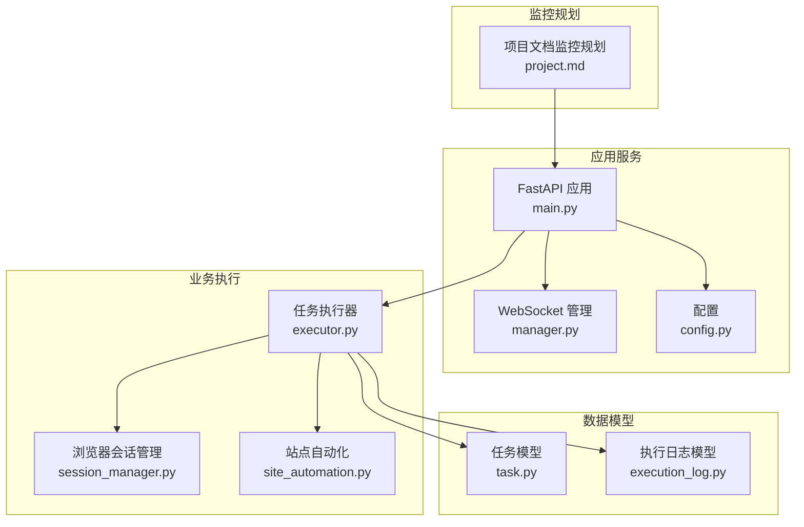
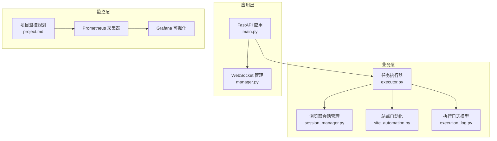
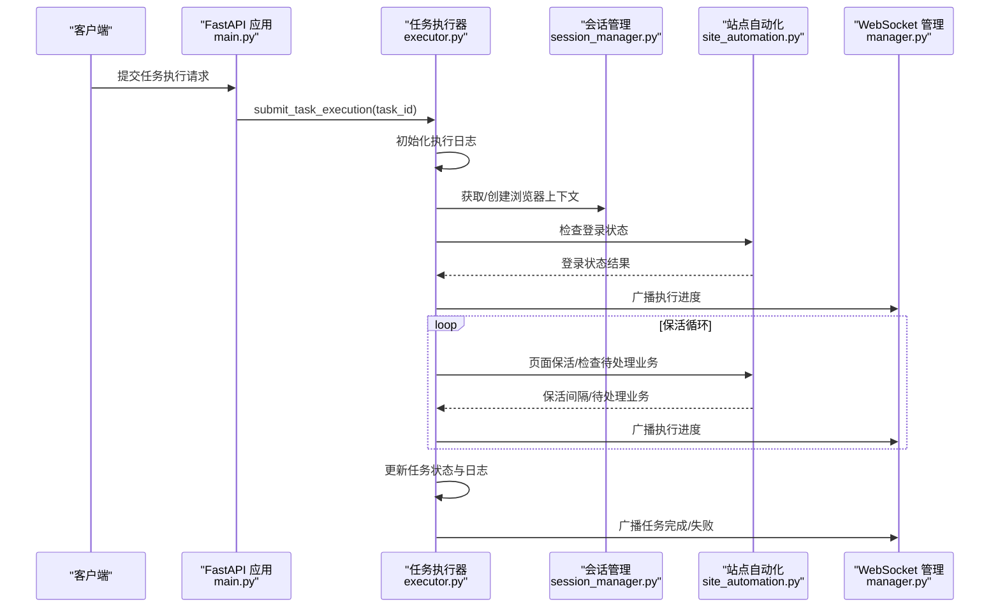
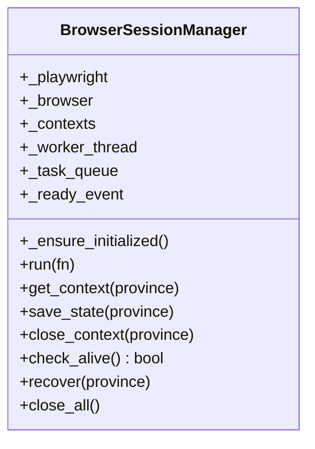
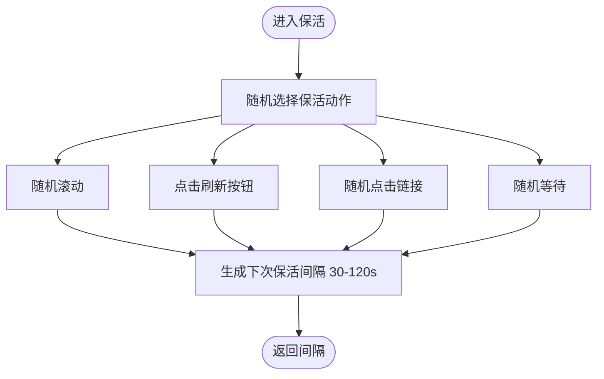
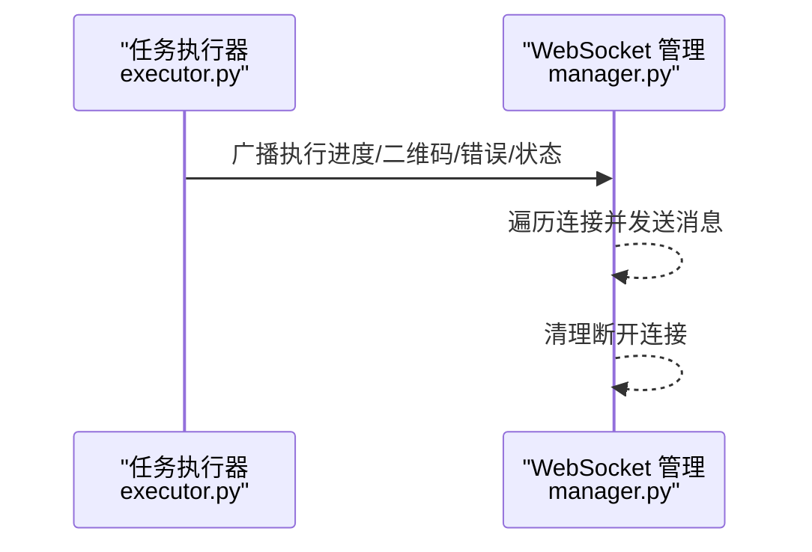
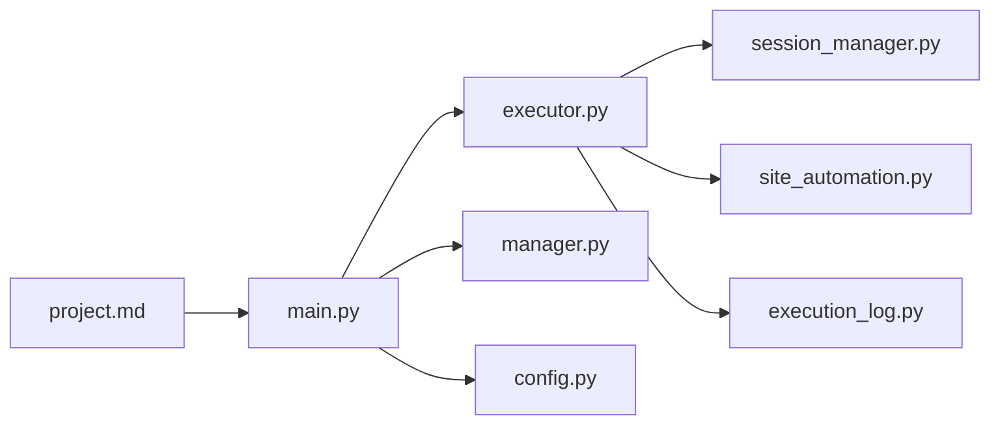

# 指标采集系统

<cite>
**本文档引用的文件**
- [main.py](file://CCC_RPA_API/app/main.py)
- [config.py](file://CCC_RPA_API/app/config.py)
- [executor.py](file://CCC_RPA_API/app/services/executor.py)
- [session_manager.py](file://CCC_RPA_API/app/browser/session_manager.py)
- [site_automation.py](file://CCC_RPA_API/app/browser/site_automation.py)
- [manager.py](file://CCC_RPA_API/app/ws/manager.py)
- [task.py](file://CCC_RPA_API/app/models/task.py)
- [execution_log.py](file://CCC_RPA_API/app/models/execution_log.py)
- [project.md](file://project.md)
- [requirements.txt](file://CCC_RPA_API/requirements.txt)
</cite>

## 目录
1. [简介](#简介)
2. [项目结构](#项目结构)
3. [核心组件](#核心组件)
4. [架构总览](#架构总览)
5. [详细组件分析](#详细组件分析)
6. [依赖关系分析](#依赖关系分析)
7. [性能考虑](#性能考虑)
8. [故障排查指南](#故障排查指南)
9. [结论](#结论)
10. [附录](#附录)

## 简介
本文件面向指标采集系统，围绕基于 Prometheus 的指标采集实现进行深入说明，涵盖自定义指标定义、指标注册与暴露机制、关键业务指标采集方案（任务执行成功率、会话连接数、AI 推理耗时、浏览器自动化性能）、指标数据格式规范、标签设计与命名约定、采集频率控制、数据聚合与存储策略，并提供配置示例与最佳实践，以及扩展新业务指标与处理异常情况的方法。

根据项目文档，系统已规划使用 Prometheus 统一采集指标，包括 Pod/进程 CPU、内存、CDP 长连接数量、AI 推理耗时、会话崩溃次数、代理 IP 失效数量等；并通过 Grafana 可视化监控大盘，区分全局/租户双维度指标。

## 项目结构
本项目采用分层架构，核心后端服务位于 CCC_RPA_API，前端位于 CCC-BrowserV4，Prometheus/Grafana 监控作为外部基础设施集成。关键模块包括：
- 应用入口与路由：FastAPI 应用、健康检查、WebSocket 管理
- 业务执行器：任务执行、浏览器会话管理、站点自动化
- 数据模型：任务与执行日志
- 配置：数据库连接参数
- 监控规划：项目文档中明确的 Prometheus 指标类别与可视化要求

图表来源
- [main.py:1-127](file://CCC_RPA_API/app/main.py#L1-L127)
- [manager.py:1-29](file://CCC_RPA_API/app/ws/manager.py#L1-L29)
- [config.py:1-22](file://CCC_RPA_API/app/config.py#L1-L22)
- [executor.py:1-308](file://CCC_RPA_API/app/services/executor.py#L1-L308)
- [session_manager.py:1-183](file://CCC_RPA_API/app/browser/session_manager.py#L1-L183)
- [site_automation.py:1-562](file://CCC_RPA_API/app/browser/site_automation.py#L1-L562)
- [task.py:1-25](file://CCC_RPA_API/app/models/task.py#L1-L25)
- [execution_log.py:1-17](file://CCC_RPA_API/app/models/execution_log.py#L1-L17)
- [project.md:425-433](file://project.md#L425-L433)

章节来源
- [main.py:1-127](file://CCC_RPA_API/app/main.py#L1-L127)
- [project.md:425-433](file://project.md#L425-L433)

## 核心组件
- FastAPI 应用与路由：提供健康检查、WebSocket 通道、CORS 中间件与数据库初始化
- 任务执行器：封装任务生命周期、浏览器会话管理、站点自动化、执行日志与状态广播
- 浏览器会话管理：Playwright 工作线程、上下文管理、状态持久化与恢复
- 站点自动化：登录检查、二维码捕获、单位列表抓取、业务保活与待处理业务检测
- WebSocket 管理：连接维护、广播消息、断开清理
- 数据模型：任务与执行日志的数据结构
- 配置：数据库连接参数

章节来源
- [main.py:1-127](file://CCC_RPA_API/app/main.py#L1-L127)
- [executor.py:1-308](file://CCC_RPA_API/app/services/executor.py#L1-L308)
- [session_manager.py:1-183](file://CCC_RPA_API/app/browser/session_manager.py#L1-L183)
- [site_automation.py:1-562](file://CCC_RPA_API/app/browser/site_automation.py#L1-L562)
- [manager.py:1-29](file://CCC_RPA_API/app/ws/manager.py#L1-L29)
- [task.py:1-25](file://CCC_RPA_API/app/models/task.py#L1-L25)
- [execution_log.py:1-17](file://CCC_RPA_API/app/models/execution_log.py#L1-L17)
- [config.py:1-22](file://CCC_RPA_API/app/config.py#L1-L22)

## 架构总览
下图展示指标采集系统与现有业务模块的关系：业务执行器产生可观测数据，通过日志与状态广播传递到监控系统；项目文档明确了 Prometheus 指标类别与可视化需求。

图表来源
- [executor.py:1-308](file://CCC_RPA_API/app/services/executor.py#L1-L308)
- [session_manager.py:1-183](file://CCC_RPA_API/app/browser/session_manager.py#L1-L183)
- [site_automation.py:1-562](file://CCC_RPA_API/app/browser/site_automation.py#L1-L562)
- [execution_log.py:1-17](file://CCC_RPA_API/app/models/execution_log.py#L1-L17)
- [main.py:1-127](file://CCC_RPA_API/app/main.py#L1-L127)
- [manager.py:1-29](file://CCC_RPA_API/app/ws/manager.py#L1-L29)
- [project.md:425-433](file://project.md#L425-L433)

## 详细组件分析

### 任务执行器与执行日志
任务执行器负责任务的完整生命周期：初始化、浏览器上下文获取、登录检查、单位选择、保活循环、业务执行、结果记录与状态广播。执行日志模型记录每次任务的开始/结束时间、状态与结果描述。

图表来源
- [executor.py:68-308](file://CCC_RPA_API/app/services/executor.py#L68-L308)
- [session_manager.py:96-123](file://CCC_RPA_API/app/browser/session_manager.py#L96-L123)
- [site_automation.py:436-500](file://CCC_RPA_API/app/browser/site_automation.py#L436-L500)
- [manager.py:17-26](file://CCC_RPA_API/app/ws/manager.py#L17-L26)

章节来源
- [executor.py:68-308](file://CCC_RPA_API/app/services/executor.py#L68-L308)
- [execution_log.py:1-17](file://CCC_RPA_API/app/models/execution_log.py#L1-L17)

### 浏览器会话管理
浏览器会话管理通过专用工作线程执行 Playwright 操作，避免与 asyncio 事件循环冲突；支持上下文持久化与恢复、检查浏览器存活状态、关闭所有会话等。

图表来源
- [session_manager.py:7-183](file://CCC_RPA_API/app/browser/session_manager.py#L7-L183)

章节来源
- [session_manager.py:1-183](file://CCC_RPA_API/app/browser/session_manager.py#L1-L183)

### 站点自动化与保活
站点自动化封装登录检查、二维码捕获、单位列表抓取、单位选择、首页跳转、保活与待处理业务检测等操作；保活采用随机滚动、点击刷新、随机点击链接与随机等待，间隔在 30-120 秒之间。

图表来源
- [site_automation.py:436-499](file://CCC_RPA_API/app/browser/site_automation.py#L436-L499)

章节来源
- [site_automation.py:1-562](file://CCC_RPA_API/app/browser/site_automation.py#L1-L562)

### WebSocket 管理与状态广播
WebSocket 管理器维护连接集合，支持广播消息；执行器在关键阶段通过广播推送执行进度、二维码、错误与任务状态更新。

图表来源
- [executor.py:22-32](file://CCC_RPA_API/app/services/executor.py#L22-L32)
- [manager.py:17-26](file://CCC_RPA_API/app/ws/manager.py#L17-L26)

章节来源
- [manager.py:1-29](file://CCC_RPA_API/app/ws/manager.py#L1-L29)
- [executor.py:22-32](file://CCC_RPA_API/app/services/executor.py#L22-L32)

## 依赖关系分析
- 应用层依赖：FastAPI、CORS、数据库初始化、WebSocket 管理
- 业务层依赖：任务执行器依赖会话管理与站点自动化；执行日志模型用于持久化
- 监控层依赖：项目文档规划 Prometheus 指标类别与 Grafana 可视化

图表来源
- [main.py:1-127](file://CCC_RPA_API/app/main.py#L1-L127)
- [executor.py:1-308](file://CCC_RPA_API/app/services/executor.py#L1-L308)
- [session_manager.py:1-183](file://CCC_RPA_API/app/browser/session_manager.py#L1-L183)
- [site_automation.py:1-562](file://CCC_RPA_API/app/browser/site_automation.py#L1-L562)
- [execution_log.py:1-17](file://CCC_RPA_API/app/models/execution_log.py#L1-L17)
- [config.py:1-22](file://CCC_RPA_API/app/config.py#L1-L22)
- [project.md:425-433](file://project.md#L425-L433)

章节来源
- [main.py:1-127](file://CCC_RPA_API/app/main.py#L1-L127)
- [project.md:425-433](file://project.md#L425-L433)

## 性能考虑
- 会话保活间隔：30-120 秒，平衡页面活跃度与资源消耗
- 线程池与工作线程：任务执行器与等待线程池避免阻塞；Playwright 在专用工作线程执行
- 广播与连接清理：WebSocket 管理器遍历连接并清理断开连接，降低广播成本
- 数据库连接：应用启动时创建表与迁移，减少运行时开销

章节来源
- [site_automation.py:436-499](file://CCC_RPA_API/app/browser/site_automation.py#L436-L499)
- [executor.py:17-33](file://CCC_RPA_API/app/services/executor.py#L17-L33)
- [manager.py:17-26](file://CCC_RPA_API/app/ws/manager.py#L17-L26)
- [main.py:37-87](file://CCC_RPA_API/app/main.py#L37-L87)

## 故障排查指南
- 浏览器异常恢复：当检测到浏览器关闭或目标页面异常时，执行器会广播进度并尝试恢复会话，重新打开页面
- 扫码等待超时：用户扫码等待超时或取消时，执行器记录失败并广播错误
- 保活循环中断：用户取消或超时导致保活循环提前结束
- WebSocket 广播失败：主事件循环不可用或异常时记录警告并跳过广播

章节来源
- [executor.py:42-59](file://CCC_RPA_API/app/services/executor.py#L42-L59)
- [executor.py:123-129](file://CCC_RPA_API/app/services/executor.py#L123-L129)
- [executor.py:208-215](file://CCC_RPA_API/app/services/executor.py#L208-L215)
- [executor.py:25-32](file://CCC_RPA_API/app/services/executor.py#L25-L32)

## 结论
本项目已具备完善的业务执行与可观测性基础：任务执行器、浏览器会话管理、站点自动化与 WebSocket 广播。结合项目文档的监控规划，建议在现有基础上引入 Prometheus 指标采集器，将任务执行成功率、会话连接数、AI 推理耗时、浏览器自动化性能等关键指标纳入统一采集与可视化体系，以支撑全局与租户维度的监控与告警。

## 附录

### 指标采集方案与命名约定
- 任务执行成功率
  - 指标：任务总数、成功数、失败数
  - 标签：任务类型、省份、租户ID、设备ID
  - 计算：成功/总，按时间窗口聚合
- 会话连接数
  - 指标：活动会话数、上下文数
  - 标签：省份、租户ID、状态（活跃/空闲/关闭）
- AI 推理耗时
  - 指标：单次推理耗时分布（p50/p90/p99）
  - 标签：模型版本、输入类型（DOM/截图/图像）
- 浏览器自动化性能
  - 指标：页面保活间隔、单位选择耗时、业务执行耗时
  - 标签：省份、业务类型、结果（成功/失败）

命名约定与格式规范
- 指标名：小写、下划线分隔（如：task_success_count）
- 标签名：小写、下划线分隔（如：province、tenant_id）
- 时间戳：Unix 毫秒或秒（与 Prometheus 保持一致）
- 标签值：字符串或数值，避免高基数键（如使用枚举值）

### 指标注册与暴露机制
- 使用 Prometheus 客户端库在应用内注册指标
- 在任务执行器的关键节点更新指标（开始、成功、失败、超时）
- 暴露 /metrics 端点供 Prometheus 抓取
- 通过 Grafana 配置数据源与仪表盘，区分全局/租户维度

### 采集频率控制、数据聚合与存储策略
- 采集频率：任务类指标按执行事件触发；会话类指标按定时轮询（如每分钟）
- 聚合策略：按分钟/小时粒度聚合，保留最近 N 天数据
- 存储策略：短期（7 天）内存缓存，长期（90 天）落盘或外部时序数据库

### 配置示例与最佳实践
- 配置示例
  - Prometheus 抓取配置：job 名称、目标、超时、标签
  - Grafana 数据源：Prometheus 地址、查询超时
  - 仪表盘：任务成功率趋势、会话数热力图、耗时分布直方图
- 最佳实践
  - 为每个关键路径添加指标与标签
  - 使用直方图/摘要记录耗时，避免高基数标签
  - 异常指标独立上报，便于告警
  - 指标命名与标签设计遵循统一规范，便于聚合与查询

### 扩展新业务指标与异常处理
- 扩展步骤
  - 在业务逻辑中新增指标对象与标签
  - 在关键节点更新指标值（计数/计时/状态）
  - 在 /metrics 暴露端点可见
- 异常处理
  - 指标更新失败不影响主流程，记录日志并降级处理
  - 对于关键异常（浏览器崩溃、AI 超时），增加独立告警指标

章节来源
- [project.md:425-433](file://project.md#L425-L433)