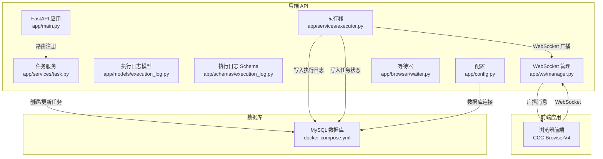
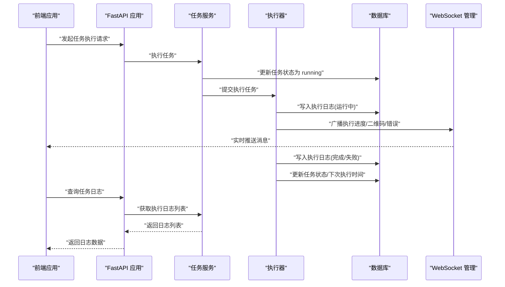
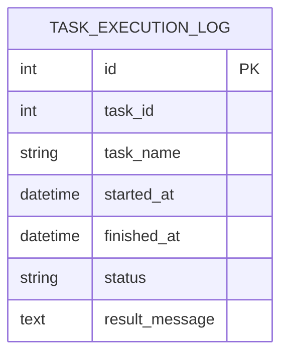
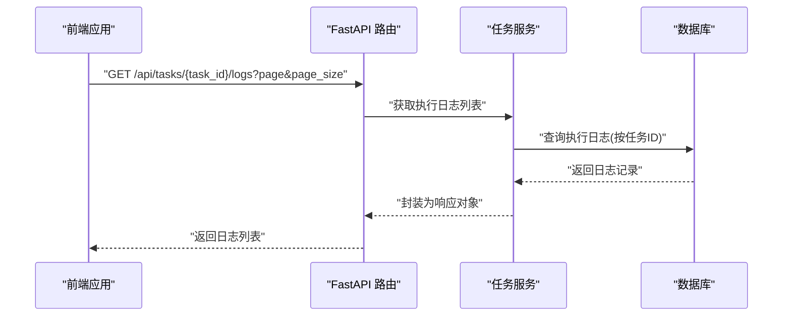
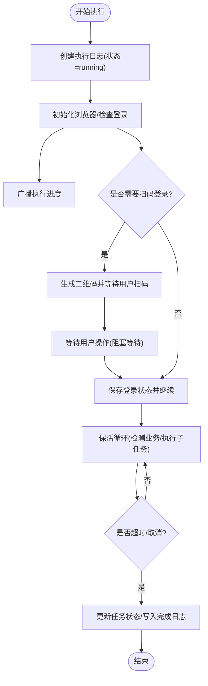
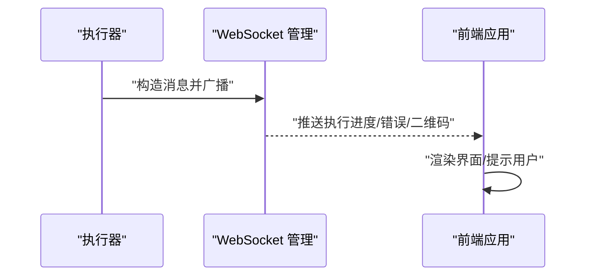
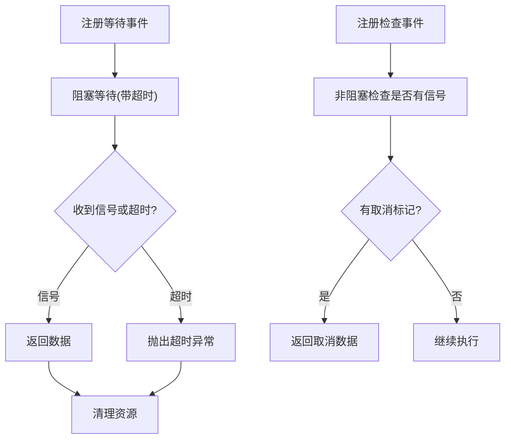
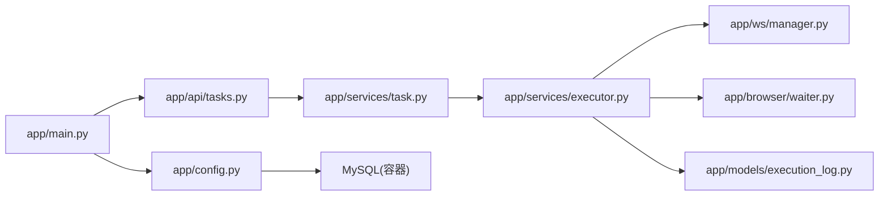

# 日志审计系统

<cite>
**本文引用的文件**
- [main.py](file://CCC_RPA_API/app/main.py)
- [config.py](file://CCC_RPA_API/app/config.py)
- [execution_log.py](file://CCC_RPA_API/app/models/execution_log.py)
- [execution_log.py](file://CCC_RPA_API/app/schemas/execution_log.py)
- [executor.py](file://CCC_RPA_API/app/services/executor.py)
- [tasks.py](file://CCC_RPA_API/app/api/tasks.py)
- [base.py](file://CCC_RPA_API/app/models/base.py)
- [task.py](file://CCC_RPA_API/app/services/task.py)
- [waiter.py](file://CCC_RPA_API/app/browser/waiter.py)
- [manager.py](file://CCC_RPA_API/app/ws/manager.py)
- [docker-compose.yml](file://CCC-BrowserV4/docker-compose.yml)
</cite>

## 目录
1. [简介](#简介)
2. [项目结构](#项目结构)
3. [核心组件](#核心组件)
4. [架构总览](#架构总览)
5. [详细组件分析](#详细组件分析)
6. [依赖关系分析](#依赖关系分析)
7. [性能考虑](#性能考虑)
8. [故障排查指南](#故障排查指南)
9. [结论](#结论)
10. [附录](#附录)

## 简介
本文件面向“日志审计系统”的设计与实现，聚焦于本仓库中现有的日志采集、存储与查询能力，并结合 ELK Stack（Logstash、Elasticsearch、Kibana）在本项目中的落地实践进行说明。内容涵盖：
- 日志格式标准化与结构化处理（业务日志、系统日志、错误日志）
- 日志收集与传输（WebSocket 广播、数据库持久化）
- 索引管理与查询检索（基于现有数据库模型与接口）
- 轮转与归档策略（基于数据库表结构与字段设计）
- 实时监控、历史检索与统计分析（通过 API 与前端交互）
- 性能优化与故障排查建议

## 项目结构
本项目包含后端 API 服务与前端浏览器应用两部分。与日志审计直接相关的后端模块位于 CCC_RPA_API 中，前端位于 CCC-BrowserV4。日志审计的关键路径包括：
- 后端 API：FastAPI 应用、数据库连接与模型、任务执行服务、WebSocket 管理
- 前端应用：与后端通过 WebSocket 实时接收执行进度与错误信息
- 数据库存储：任务与执行日志的结构化存储

图表来源
- [main.py:12-28](file://CCC_RPA_API/app/main.py#L12-L28)
- [config.py:6-18](file://CCC_RPA_API/app/config.py#L6-L18)
- [execution_log.py:7-17](file://CCC_RPA_API/app/models/execution_log.py#L7-L17)
- [execution_log.py:4-14](file://CCC_RPA_API/app/schemas/execution_log.py#L4-L14)
- [task.py:44-157](file://CCC_RPA_API/app/services/task.py#L44-L157)
- [executor.py:78-314](file://CCC_RPA_API/app/services/executor.py#L78-L314)
- [manager.py:5-29](file://CCC_RPA_API/app/ws/manager.py#L5-L29)
- [waiter.py:7-84](file://CCC_RPA_API/app/browser/waiter.py#L7-L84)
- [docker-compose.yml:4-17](file://CCC-BrowserV4/docker-compose.yml#L4-L17)

章节来源
- [main.py:12-28](file://CCC_RPA_API/app/main.py#L12-L28)
- [config.py:6-18](file://CCC_RPA_API/app/config.py#L6-L18)
- [docker-compose.yml:4-17](file://CCC-BrowserV4/docker-compose.yml#L4-L17)

## 核心组件
- 执行日志模型与 Schema：定义了任务执行的结构化日志字段，包括任务 ID、任务名称、开始时间、结束时间、状态、结果消息等，便于后续在 Elasticsearch 中进行结构化检索与聚合。
- 任务服务：提供任务列表、创建、更新、删除、执行与日志查询等接口，统一输出标准的 JSON 响应。
- 执行器：负责任务执行全流程，包括浏览器会话管理、步骤推进、错误处理与 WebSocket 广播，同时写入执行日志与更新任务状态。
- WebSocket 管理：集中维护客户端连接，向前端推送执行进度、二维码、错误信息等。
- 等待器：提供阻塞等待与取消机制，支持扫码登录、单位选择等交互式步骤。

章节来源
- [execution_log.py:7-17](file://CCC_RPA_API/app/models/execution_log.py#L7-L17)
- [execution_log.py:4-14](file://CCC_RPA_API/app/schemas/execution_log.py#L4-L14)
- [task.py:44-157](file://CCC_RPA_API/app/services/task.py#L44-L157)
- [executor.py:78-314](file://CCC_RPA_API/app/services/executor.py#L78-L314)
- [manager.py:5-29](file://CCC_RPA_API/app/ws/manager.py#L5-L29)
- [waiter.py:7-84](file://CCC_RPA_API/app/browser/waiter.py#L7-L84)

## 架构总览
下图展示了从任务执行到日志落库与前端展示的整体流程，以及与 ELK Stack 的对接位置（Logstash 收集、Elasticsearch 存储、Kibana 展示）：

图表来源
- [tasks.py:47-57](file://CCC_RPA_API/app/api/tasks.py#L47-L57)
- [task.py:120-133](file://CCC_RPA_API/app/services/task.py#L120-L133)
- [executor.py:78-314](file://CCC_RPA_API/app/services/executor.py#L78-L314)
- [manager.py:17-26](file://CCC_RPA_API/app/ws/manager.py#L17-L26)

## 详细组件分析

### 执行日志模型与 Schema
- 模型字段覆盖：任务标识、任务名称、开始/结束时间、状态、结果消息等，满足审计与回溯需求。
- Schema 输出：统一 JSON 字段命名风格，便于前端展示与 ELK 解析。
- 关系映射：与任务表通过 task_id 建立关联，支持按任务维度检索。

图表来源
- [execution_log.py:7-17](file://CCC_RPA_API/app/models/execution_log.py#L7-L17)

章节来源
- [execution_log.py:7-17](file://CCC_RPA_API/app/models/execution_log.py#L7-L17)
- [execution_log.py:4-14](file://CCC_RPA_API/app/schemas/execution_log.py#L4-L14)

### 任务服务与日志查询
- 提供任务日志列表查询接口，支持分页与排序，返回结构化日志数据。
- 统一时间格式化，确保前端与 ELK 的时间字段一致性。

图表来源
- [tasks.py:55-57](file://CCC_RPA_API/app/api/tasks.py#L55-L57)
- [task.py:135-157](file://CCC_RPA_API/app/services/task.py#L135-L157)

章节来源
- [tasks.py:55-57](file://CCC_RPA_API/app/api/tasks.py#L55-L57)
- [task.py:135-157](file://CCC_RPA_API/app/services/task.py#L135-L157)

### 执行器与日志写入
- 在任务执行过程中，按阶段写入执行日志，记录状态变化与结果消息。
- 使用线程池与异步事件循环协作，保证 WebSocket 广播与数据库写入的稳定性。
- 错误处理：捕获异常并写入失败日志，同时向前端广播错误信息。

图表来源
- [executor.py:78-314](file://CCC_RPA_API/app/services/executor.py#L78-L314)

章节来源
- [executor.py:78-314](file://CCC_RPA_API/app/services/executor.py#L78-L314)

### WebSocket 广播与前端交互
- WebSocket 管理器集中维护连接，支持广播消息给所有在线客户端。
- 执行器在关键节点发送进度、二维码、错误等消息，前端实时展示。

图表来源
- [executor.py:22-33](file://CCC_RPA_API/app/services/executor.py#L22-L33)
- [manager.py:17-26](file://CCC_RPA_API/app/ws/manager.py#L17-L26)

章节来源
- [executor.py:22-33](file://CCC_RPA_API/app/services/executor.py#L22-L33)
- [manager.py:17-26](file://CCC_RPA_API/app/ws/manager.py#L17-L26)

### 等待器与交互式流程
- 提供阻塞等待、信号唤醒与取消机制，支撑扫码登录、单位选择等交互步骤。
- 保活循环中使用非阻塞检查，及时响应取消信号。

图表来源
- [waiter.py:14-33](file://CCC_RPA_API/app/browser/waiter.py#L14-L33)
- [waiter.py:56-69](file://CCC_RPA_API/app/browser/waiter.py#L56-L69)

章节来源
- [waiter.py:14-33](file://CCC_RPA_API/app/browser/waiter.py#L14-L33)
- [waiter.py:56-69](file://CCC_RPA_API/app/browser/waiter.py#L56-L69)

## 依赖关系分析
- 应用层依赖：FastAPI 应用依赖数据库引擎与模型，注册路由并启动时初始化数据库与迁移。
- 服务层依赖：任务服务依赖执行器与数据库；执行器依赖浏览器会话管理、等待器与 WebSocket 管理。
- 数据层依赖：执行日志模型依赖 SQLAlchemy 基类与数据库引擎；配置模块提供数据库连接字符串。

图表来源
- [main.py:30-39](file://CCC_RPA_API/app/main.py#L30-L39)
- [config.py:6-18](file://CCC_RPA_API/app/config.py#L6-L18)
- [tasks.py:10](file://CCC_RPA_API/app/api/tasks.py#L10)
- [task.py:44-157](file://CCC_RPA_API/app/services/task.py#L44-L157)
- [executor.py:78-314](file://CCC_RPA_API/app/services/executor.py#L78-L314)
- [manager.py:5-29](file://CCC_RPA_API/app/ws/manager.py#L5-L29)
- [waiter.py:7-84](file://CCC_RPA_API/app/browser/waiter.py#L7-L84)
- [execution_log.py:7-17](file://CCC_RPA_API/app/models/execution_log.py#L7-L17)
- [docker-compose.yml:4-17](file://CCC-BrowserV4/docker-compose.yml#L4-L17)

章节来源
- [main.py:30-39](file://CCC_RPA_API/app/main.py#L30-L39)
- [config.py:6-18](file://CCC_RPA_API/app/config.py#L6-L18)
- [docker-compose.yml:4-17](file://CCC-BrowserV4/docker-compose.yml#L4-L17)

## 性能考虑
- 线程池与事件循环：执行器使用线程池执行阻塞操作，避免阻塞主事件循环；WebSocket 广播通过主事件循环安全调度，降低并发问题风险。
- 日志写入：按阶段写入执行日志，减少一次性大批量写入；建议在高并发场景下对日志写入进行批量提交或异步队列缓冲。
- 查询优化：日志查询按任务 ID 过滤并按主键倒序分页，具备良好可扩展性；建议在任务 ID 上建立索引以提升查询效率。
- 数据库连接：统一使用 SessionLocal 管理连接生命周期，避免连接泄漏；在高负载场景下启用连接池参数调优。
- 前端交互：WebSocket 广播需注意死连接清理，避免内存泄漏；建议设置心跳与断线重连策略。

## 故障排查指南
- 执行失败定位
  - 查看执行日志中的状态与结果消息，确认失败原因与发生时间。
  - 检查浏览器会话是否存活，必要时触发恢复逻辑并重试。
- WebSocket 不通
  - 确认连接管理器是否正确接受连接并清理死连接。
  - 检查广播消息是否在主事件循环中安全调度。
- 数据库异常
  - 核对数据库连接字符串与容器状态，确保服务正常启动。
  - 检查迁移脚本是否成功执行，确认表结构与索引存在。
- 性能问题
  - 观察日志写入频率与查询耗时，必要时增加索引或调整分页大小。
  - 对高频广播消息进行去重与节流，避免前端渲染压力过大。

章节来源
- [executor.py:285-314](file://CCC_RPA_API/app/services/executor.py#L285-L314)
- [manager.py:17-26](file://CCC_RPA_API/app/ws/manager.py#L17-L26)
- [docker-compose.yml:4-17](file://CCC-BrowserV4/docker-compose.yml#L4-L17)

## 结论
本项目已具备完善的日志审计基础：结构化的执行日志模型、统一的 API 输出、实时的 WebSocket 广播与数据库持久化。结合 ELK Stack，可在 Logstash 中实现日志采集与解析、在 Elasticsearch 中进行高效索引与查询、在 Kibana 中构建可视化仪表盘与告警。建议在此基础上进一步完善日志格式标准化、索引模板与别名策略、查询性能调优与轮转归档方案，以满足生产环境的长期审计需求。

## 附录

### ELK Stack 集成建议
- Logstash
  - 输入：监听后端日志文件或通过 beats/HTTP 输入接入
  - 过滤：使用 grok/geoip/date 等插件解析字段，标准化时间与级别
  - 输出：写入 Elasticsearch
- Elasticsearch
  - 索引模板：为执行日志定义动态映射与字段类型
  - 别名与滚动：按天/周滚动索引，使用别名统一查询
  - 冷热分层：近期活跃数据放热节点，历史数据迁移到冷节点
- Kibana
  - 创建仪表盘：展示任务成功率、失败率、平均耗时、错误分布
  - 设置告警：针对失败率阈值、超时任务、浏览器异常等触发告警

### 日志格式标准化与分类
- 业务日志：包含任务 ID、步骤、状态、耗时、业务结果
- 系统日志：包含时间戳、级别、模块、线程、消息体
- 错误日志：包含异常堆栈、错误码、重试次数、恢复动作

### 日志轮转与归档策略
- 存储空间管理：按大小/时间轮转，限制单文件大小与保留份数
- 长期保留：区分短期活跃索引与长期归档索引，设定不同保留周期
- 成本控制：压缩存储、去重、删除低价值字段

### 查询与分析功能
- 实时监控：通过 WebSocket 与 Kibana 实时看板联动
- 历史检索：基于任务 ID、时间范围、状态等多维过滤
- 统计分析：按任务、地区、浏览器版本等维度聚合统计