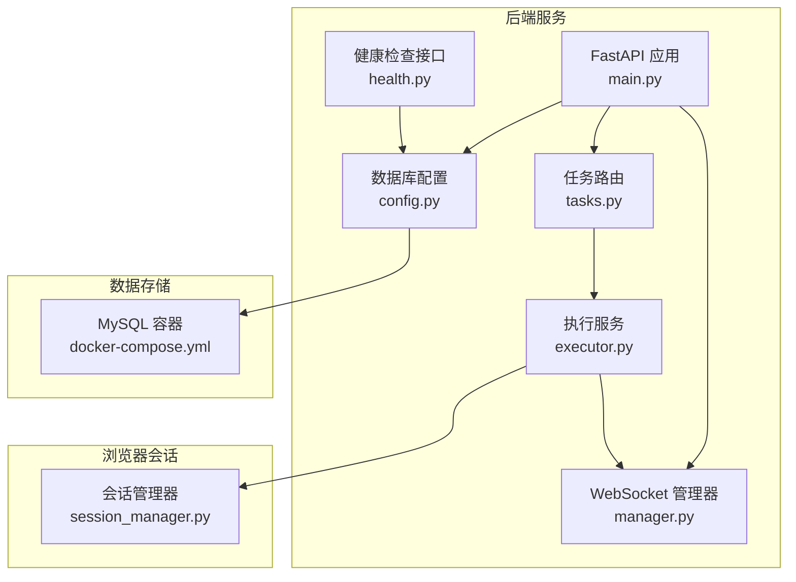
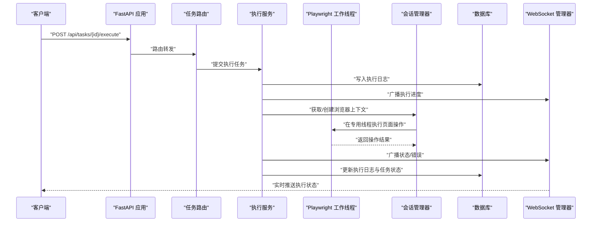
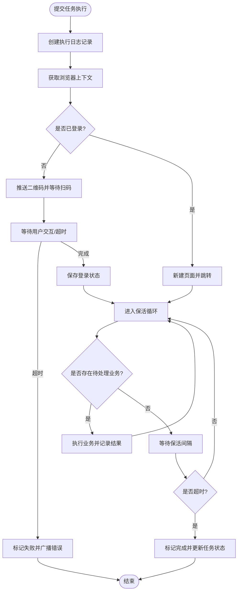
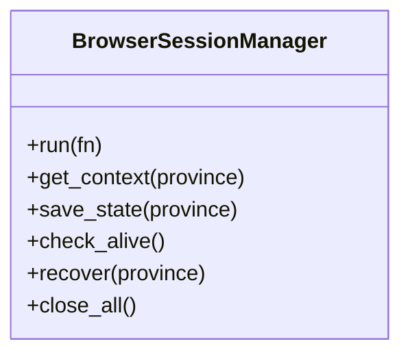
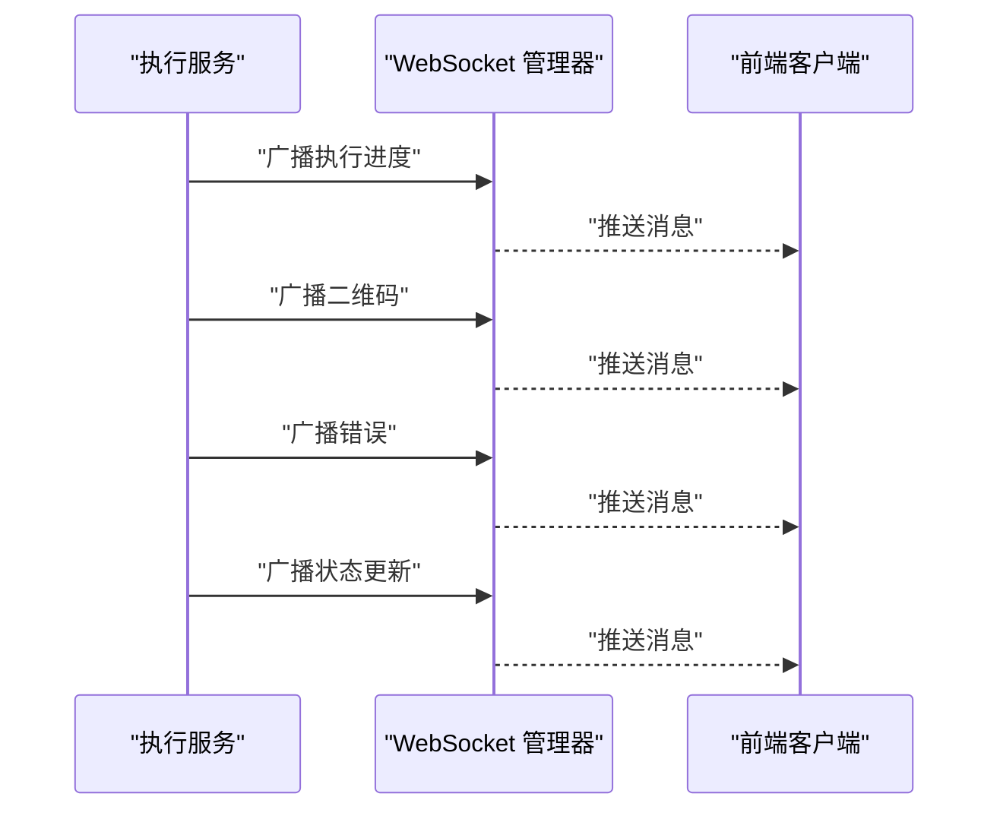
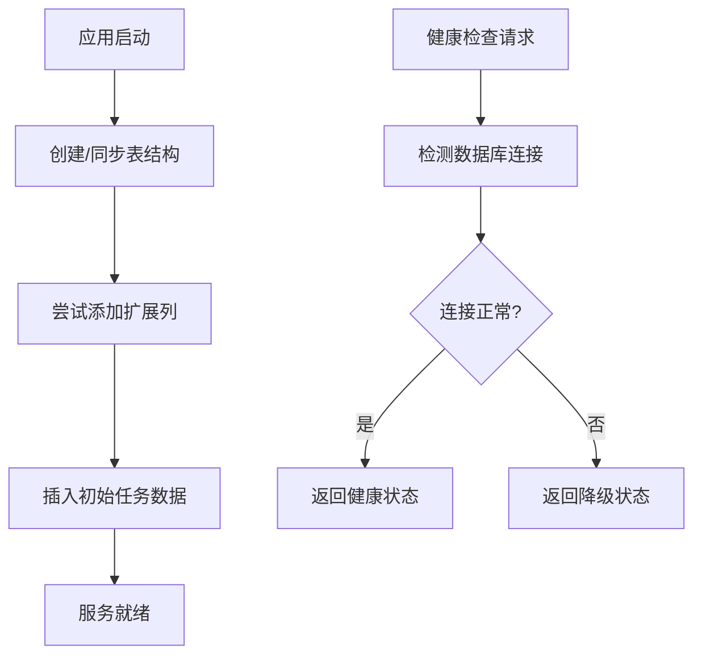
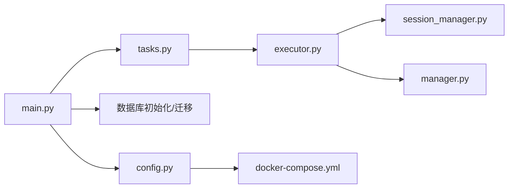

# 监控运维

<cite>
**本文引用的文件**
- [main.py](file://CCC_RPA_API/app/main.py)
- [tasks.py](file://CCC_RPA_API/app/api/tasks.py)
- [execution_log.py](file://CCC_RPA_API/app/models/execution_log.py)
- [executor.py](file://CCC_RPA_API/app/services/executor.py)
- [session_manager.py](file://CCC_RPA_API/app/browser/session_manager.py)
- [manager.py](file://CCC_RPA_API/app/ws/manager.py)
- [config.py](file://CCC_RPA_API/app/config.py)
- [docker-compose.yml](file://CCC-BrowserV4/docker-compose.yml)
- [health.py](file://CCC-BrowserV4/backend/app/api/health.py)
- [project.md](file://project.md)
</cite>

## 目录
1. [简介](#简介)
2. [项目结构](#项目结构)
3. [核心组件](#核心组件)
4. [架构总览](#架构总览)
5. [组件详解](#组件详解)
6. [依赖关系分析](#依赖关系分析)
7. [性能与容量规划](#性能与容量规划)
8. [故障排查与告警](#故障排查与告警)
9. [结论](#结论)
10. [附录](#附录)

## 简介
本文件面向“监控运维”主题，围绕基于 Prometheus 的指标采集、Grafana 可视化与告警、ELK 全链路审计日志、异常告警与故障处理流程展开。结合仓库现有代码与需求文档，梳理系统在任务执行、浏览器会话、WebSocket 推送、数据库健康检查等方面的可观测性现状与扩展方向，提供可落地的运维实践指南。

## 项目结构
- 后端服务采用 FastAPI，提供 REST/WS 接口与健康检查。
- 任务执行通过线程池与专用 Playwright 工作线程协调，执行过程通过 WebSocket 实时广播进度与状态。
- 数据库通过 SQLAlchemy 迁移与初始化，提供任务与执行日志的数据持久化。
- Docker Compose 提供 MySQL 服务，支撑本地开发与测试。

**图示来源**
- [main.py:1-127](file://CCC_RPA_API/app/main.py#L1-L127)
- [tasks.py:1-76](file://CCC_RPA_API/app/api/tasks.py#L1-L76)
- [executor.py:1-308](file://CCC_RPA_API/app/services/executor.py#L1-L308)
- [session_manager.py:1-183](file://CCC_RPA_API/app/browser/session_manager.py#L1-L183)
- [manager.py:1-29](file://CCC_RPA_API/app/ws/manager.py#L1-L29)
- [config.py:1-22](file://CCC_RPA_API/app/config.py#L1-L22)
- [docker-compose.yml:1-21](file://CCC-BrowserV4/docker-compose.yml#L1-L21)
- [health.py:1-18](file://CCC-BrowserV4/backend/app/api/health.py#L1-L18)

**章节来源**
- [main.py:1-127](file://CCC_RPA_API/app/main.py#L1-L127)
- [docker-compose.yml:1-21](file://CCC-BrowserV4/docker-compose.yml#L1-L21)

## 核心组件
- FastAPI 应用与路由：提供 REST 接口、CORS 中间件、WebSocket 端点、健康检查。
- 任务执行服务：线程池调度、Playwright 工作线程、浏览器会话管理、执行日志记录、WebSocket 广播。
- WebSocket 管理器：集中维护连接、广播消息。
- 数据库配置与迁移：MySQL 连接、表结构初始化与扩展列添加。
- 健康检查：数据库连通性检测，返回服务状态。

**章节来源**
- [main.py:114-127](file://CCC_RPA_API/app/main.py#L114-L127)
- [tasks.py:13-76](file://CCC_RPA_API/app/api/tasks.py#L13-L76)
- [executor.py:68-308](file://CCC_RPA_API/app/services/executor.py#L68-L308)
- [manager.py:1-29](file://CCC_RPA_API/app/ws/manager.py#L1-L29)
- [config.py:1-22](file://CCC_RPA_API/app/config.py#L1-L22)
- [health.py:10-18](file://CCC-BrowserV4/backend/app/api/health.py#L10-L18)

## 架构总览
系统以“任务执行—浏览器会话—实时推送—数据持久化”为主线，结合健康检查与数据库连接状态，形成可观测闭环。Prometheus 与 Grafana、ELK Stack 在需求文档中被明确为统一的监控与审计方案，当前仓库未包含具体配置文件，但可据此扩展。

**图示来源**
- [tasks.py:47-52](file://CCC_RPA_API/app/api/tasks.py#L47-L52)
- [executor.py:68-308](file://CCC_RPA_API/app/services/executor.py#L68-L308)
- [session_manager.py:77-94](file://CCC_RPA_API/app/browser/session_manager.py#L77-L94)
- [manager.py:17-26](file://CCC_RPA_API/app/ws/manager.py#L17-L26)
- [execution_log.py:7-17](file://CCC_RPA_API/app/models/execution_log.py#L7-L17)

## 组件详解

### 任务执行与指标采集
- 执行服务通过线程池调度任务逻辑，使用专用 Playwright 工作线程执行页面操作，避免与 asyncio 事件循环冲突。
- 执行过程中通过 WebSocket 广播多种消息类型（如执行进度、二维码、错误、状态更新），便于前端实时反馈与监控系统采集。
- 执行日志模型记录任务开始/结束时间、状态与结果描述，用于历史趋势与故障回溯。

**图示来源**
- [executor.py:68-308](file://CCC_RPA_API/app/services/executor.py#L68-L308)

**章节来源**
- [executor.py:17-33](file://CCC_RPA_API/app/services/executor.py#L17-L33)
- [executor.py:68-308](file://CCC_RPA_API/app/services/executor.py#L68-L308)
- [execution_log.py:7-17](file://CCC_RPA_API/app/models/execution_log.py#L7-L17)

### 浏览器会话与 CDP 连接
- 会话管理器在专用线程中启动 Playwright/Chromium，按省份维护 BrowserContext，支持持久化 storage_state。
- 提供上下文存活检查、异常恢复、关闭与清理等能力，保障长时间运行的稳定性。
- CDP 连接数量与会话状态可作为 Prometheus 指标采集对象（见需求文档）。

**图示来源**
- [session_manager.py:7-183](file://CCC_RPA_API/app/browser/session_manager.py#L7-L183)

**章节来源**
- [session_manager.py:27-94](file://CCC_RPA_API/app/browser/session_manager.py#L27-L94)
- [session_manager.py:144-167](file://CCC_RPA_API/app/browser/session_manager.py#L144-L167)

### WebSocket 实时推送与监控
- WebSocket 管理器负责连接接入、断开清理与广播消息，消息格式为 JSON 字符串。
- 执行服务在多个关键节点广播消息（如执行进度、二维码、错误、状态更新），便于前端与监控系统消费。

**图示来源**
- [executor.py:90-295](file://CCC_RPA_API/app/services/executor.py#L90-L295)
- [manager.py:17-26](file://CCC_RPA_API/app/ws/manager.py#L17-L26)

**章节来源**
- [manager.py:1-29](file://CCC_RPA_API/app/ws/manager.py#L1-L29)
- [executor.py:22-32](file://CCC_RPA_API/app/services/executor.py#L22-L32)

### 数据库健康检查与迁移
- 应用启动时创建数据库表并尝试添加扩展列，保证结构演进的兼容性。
- 健康检查接口检测数据库连接状态，返回服务整体健康状况。

**图示来源**
- [main.py:37-102](file://CCC_RPA_API/app/main.py#L37-L102)
- [health.py:10-18](file://CCC-BrowserV4/backend/app/api/health.py#L10-L18)

**章节来源**
- [main.py:37-102](file://CCC_RPA_API/app/main.py#L37-L102)
- [health.py:10-18](file://CCC-BrowserV4/backend/app/api/health.py#L10-L18)

## 依赖关系分析
- 应用层依赖数据库配置与连接，任务路由调用执行服务，执行服务依赖会话管理器与 WebSocket 管理器。
- Docker Compose 提供 MySQL 服务，满足本地开发与测试场景。

**图示来源**
- [main.py:1-127](file://CCC_RPA_API/app/main.py#L1-L127)
- [config.py:1-22](file://CCC_RPA_API/app/config.py#L1-L22)
- [docker-compose.yml:1-21](file://CCC-BrowserV4/docker-compose.yml#L1-L21)
- [tasks.py:1-76](file://CCC_RPA_API/app/api/tasks.py#L1-L76)
- [executor.py:1-308](file://CCC_RPA_API/app/services/executor.py#L1-L308)
- [session_manager.py:1-183](file://CCC_RPA_API/app/browser/session_manager.py#L1-L183)
- [manager.py:1-29](file://CCC_RPA_API/app/ws/manager.py#L1-L29)

**章节来源**
- [main.py:1-127](file://CCC_RPA_API/app/main.py#L1-L127)
- [docker-compose.yml:1-21](file://CCC-BrowserV4/docker-compose.yml#L1-L21)

## 性能与容量规划
- 资源使用趋势分析：结合任务执行日志的时间戳与状态，评估平均执行时长、成功率与失败率，识别高峰期与异常波动。
- 瓶颈识别：关注浏览器上下文创建、页面导航、扫码等待、保活间隔等环节的耗时分布；结合 WebSocket 广播频率与前端渲染开销定位前端瓶颈。
- 优化建议：
  - 合理设置线程池大小与保活间隔，避免过度竞争与资源浪费。
  - 对高频广播消息进行去抖与合并，降低前端渲染压力。
  - 使用数据库索引优化日志查询（如按任务 ID、时间范围）。
  - 在生产环境引入 Prometheus 指标采集（CPU、内存、CDP 连接数、AI 推理耗时、崩溃次数、代理 IP 失效数量），并配合 Grafana 可视化与告警。

[本节为通用指导，不直接分析具体文件，故无“章节来源”]

## 故障排查与告警
- 健康检查：通过健康接口快速判断数据库连通性与服务状态，辅助快速定位数据库侧问题。
- 执行异常：执行服务在异常分支中更新任务与日志状态，并通过 WebSocket 广播错误消息，便于前端与监控系统感知。
- 会话恢复：当浏览器异常时，执行服务触发会话恢复流程，重新打开页面并提示用户，减少人工干预。
- 告警规则建议（基于需求文档指标）：
  - 会话批量崩溃、AI 推理超时、集群资源耗尽、代理 IP 批量失效。
  - 通知渠道：邮件、IM、电话等（需结合企业现有通知平台配置）。
  - 故障处理流程：自动恢复、告警升级、人工介入、根因分析与修复闭环。

**章节来源**
- [health.py:10-18](file://CCC-BrowserV4/backend/app/api/health.py#L10-L18)
- [executor.py:275-300](file://CCC_RPA_API/app/services/executor.py#L275-L300)
- [session_manager.py:154-167](file://CCC_RPA_API/app/browser/session_manager.py#L154-L167)
- [project.md:425-433](file://project.md#L425-L433)

## 结论
当前代码库已具备任务执行、浏览器会话管理、WebSocket 实时推送与数据库健康检查的基础能力，能够支撑监控与运维体系的扩展。结合需求文档中关于 Prometheus、Grafana、ELK 与告警的统一要求，建议在现有基础上补充指标采集、可视化面板与告警规则配置，形成完整的可观测性闭环。

[本节为总结性内容，不直接分析具体文件，故无“章节来源”]

## 附录

### Prometheus 指标采集建议
- 指标类型与来源（基于需求文档与现有代码）：
  - Pod/进程 CPU、内存：由容器运行时与系统监控提供。
  - CDP 长连接数量：可从会话管理器状态统计。
  - AI 推理耗时：可在 AI 服务侧埋点。
  - 会话崩溃次数：从执行日志与会话恢复事件统计。
  - 代理 IP 失效数量：从代理池对接接口统计。
- 指标命名与标签：遵循统一命名规范，增加租户、会话、任务等标签以便聚合分析。

[本节为概念性建议，不直接分析具体文件，故无“章节来源”]

### Grafana 可视化与告警配置
- 监控大盘布局建议：
  - 全局维度：在线会话总数、CPU/内存使用率、任务执行成功率、错误率、AI 推理耗时。
  - 租户维度：按租户聚合的会话数、任务数、资源消耗与告警次数。
- 图表类型：折线图（趋势）、堆叠柱状图（资源占比）、热力图（错误分布）。
- 告警规则：基于阈值与同比/环比异常检测，结合通知渠道分级处理。

[本节为概念性建议，不直接分析具体文件，故无“章节来源”]

### ELK 全链路审计日志
- 日志收集：统一输出结构化日志（JSON），包含时间戳、租户、会话、任务、操作、结果等字段。
- 索引管理：按天/周滚动索引，设置生命周期策略（保留 90 天）。
- 查询检索：提供按租户、时间、操作类型、关键词的检索能力，支持导出与报表。

[本节为概念性建议，不直接分析具体文件，故无“章节来源”]

### 运维工具与脚本使用指南
- 系统健康检查：调用健康接口，检查数据库连接与服务状态。
- 日志分析：结合执行日志模型字段，按任务 ID 与时间范围筛选，定位异常。
- 故障排查：关注浏览器会话恢复、扫码等待超时、页面保活失败等关键节点，结合 WebSocket 消息与日志进行复盘。

**章节来源**
- [health.py:10-18](file://CCC-BrowserV4/backend/app/api/health.py#L10-L18)
- [execution_log.py:7-17](file://CCC_RPA_API/app/models/execution_log.py#L7-L17)
- [executor.py:122-129](file://CCC_RPA_API/app/services/executor.py#L122-L129)
- [executor.py:208-255](file://CCC_RPA_API/app/services/executor.py#L208-L255)