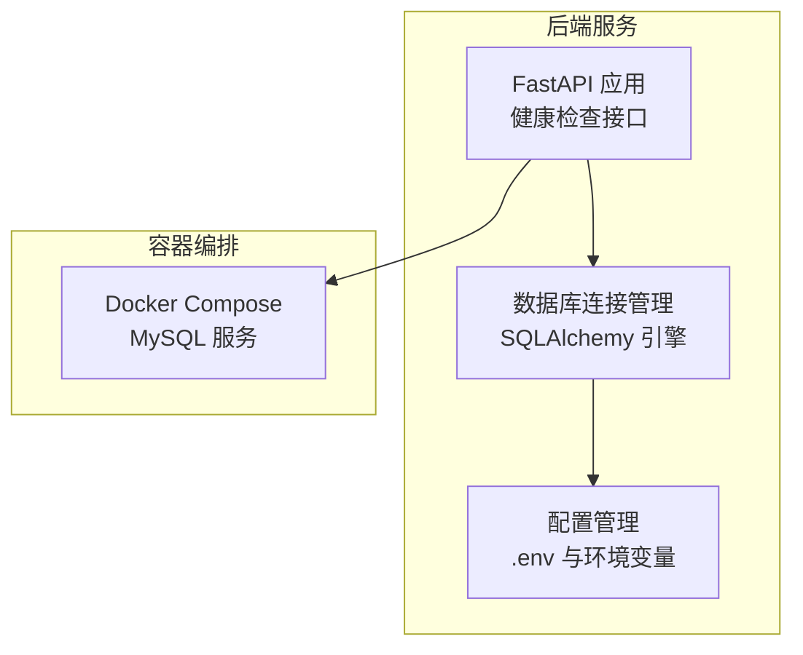
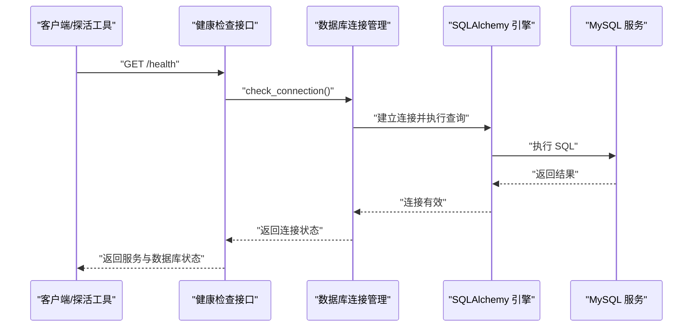
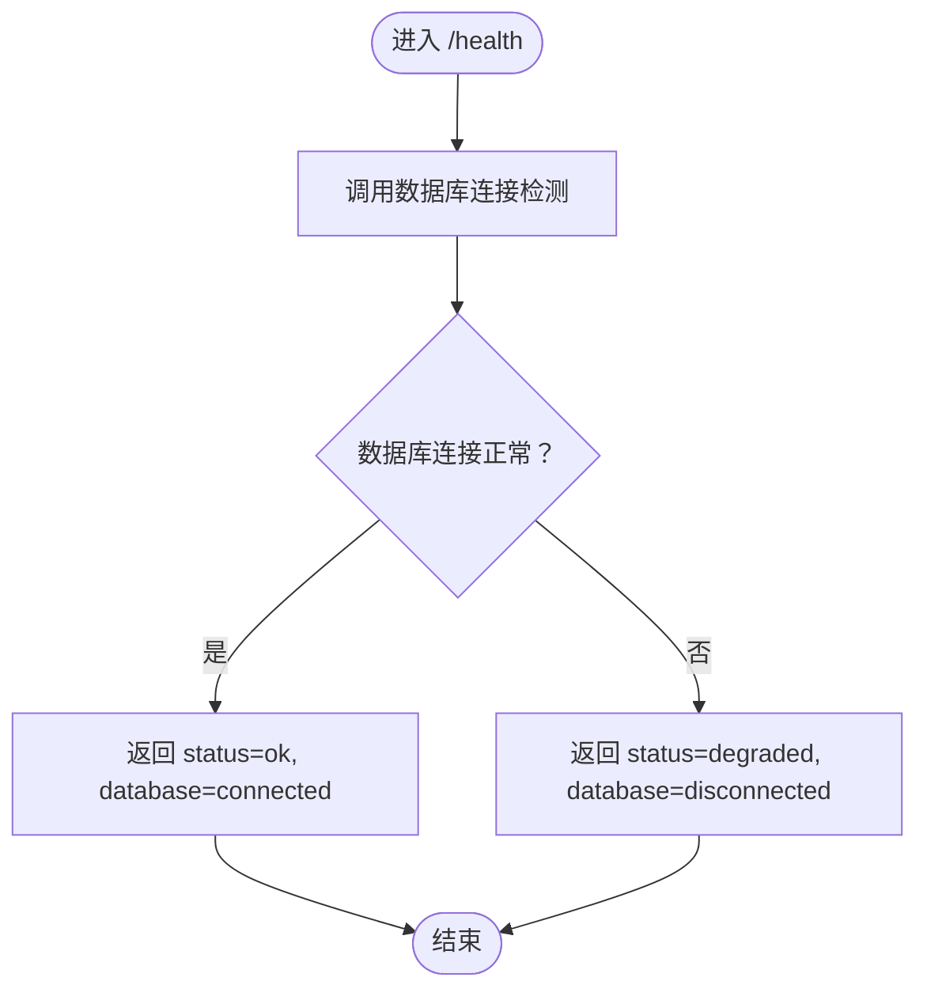
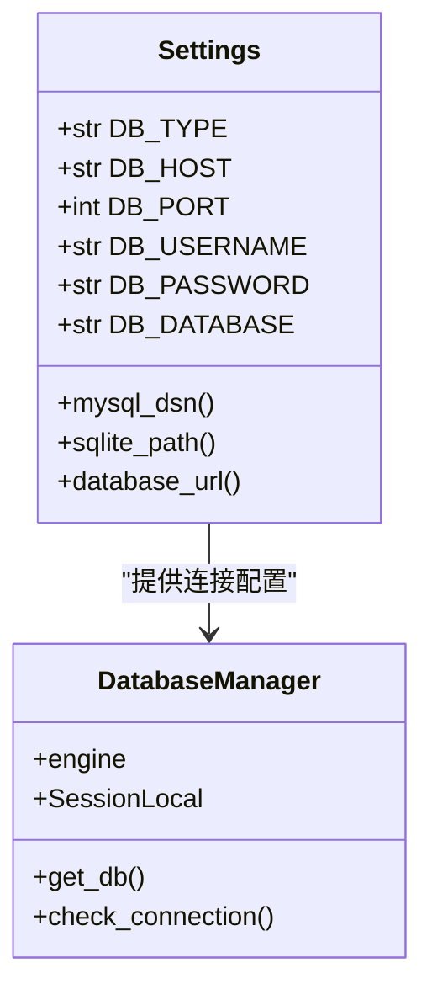
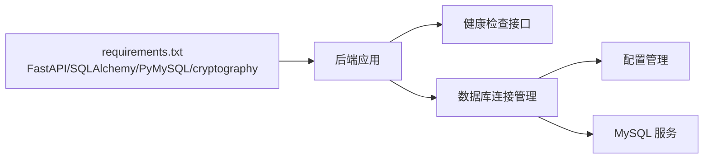

# 运维工具与脚本

<cite>
**本文引用的文件**   
- [docker-compose.yml](file://CCC-BrowserV4/docker-compose.yml)
- [health.py](file://CCC-BrowserV4/backend/app/api/health.py)
- [database.py](file://CCC-BrowserV4/backend/app/database.py)
- [config.py](file://CCC-BrowserV4/backend/app/config.py)
- [requirements.txt](file://CCC-BrowserV4/backend/requirements.txt)
- [project.md](file://project.md)
</cite>

## 目录
1. [简介](#简介)
2. [项目结构](#项目结构)
3. [核心组件](#核心组件)
4. [架构总览](#架构总览)
5. [详细组件分析](#详细组件分析)
6. [依赖分析](#依赖分析)
7. [性能考虑](#性能考虑)
8. [故障排查指南](#故障排查指南)
9. [结论](#结论)
10. [附录](#附录)

## 简介
本文件面向运维与平台工程团队，围绕本仓库中的系统组件，系统化梳理运维工具与脚本的使用方法与最佳实践，覆盖以下主题：
- 系统健康检查工具与日志分析思路
- 故障排查脚本与应急处置流程
- 自动化运维脚本（部署、备份、监控）的编写与落地
- 容器化环境（Docker Compose 与 Kubernetes）的运维管理要点
- 数据库运维工具（MySQL 连接管理、备份恢复、性能调优）实操指引
- 运维最佳实践与安全加固措施

## 项目结构
本项目包含前端、后端与容器编排三个主要部分，其中与运维密切相关的组件集中在后端服务与容器编排层：
- 后端服务：基于 FastAPI 的健康检查接口与数据库连接管理
- 数据库：通过 SQLAlchemy 连接 MySQL 或 SQLite
- 容器编排：使用 Docker Compose 快速拉起 MySQL 与应用服务

图表来源
- [health.py:1-18](file://CCC-BrowserV4/backend/app/api/health.py#L1-L18)
- [database.py:1-45](file://CCC-BrowserV4/backend/app/database.py#L1-L45)
- [config.py:1-52](file://CCC-BrowserV4/backend/app/config.py#L1-L52)
- [docker-compose.yml:1-21](file://CCC-BrowserV4/docker-compose.yml#L1-L21)

章节来源
- [docker-compose.yml:1-21](file://CCC-BrowserV4/docker-compose.yml#L1-L21)
- [health.py:1-18](file://CCC-BrowserV4/backend/app/api/health.py#L1-L18)
- [database.py:1-45](file://CCC-BrowserV4/backend/app/database.py#L1-L45)
- [config.py:1-52](file://CCC-BrowserV4/backend/app/config.py#L1-L52)
- [requirements.txt:1-13](file://CCC-BrowserV4/backend/requirements.txt#L1-L13)

## 核心组件
- 健康检查接口：提供服务与数据库连接状态的统一健康检查入口，便于探活与自动化编排
- 数据库连接管理：集中式引擎与会话工厂，支持 MySQL 与 SQLite，具备连接池与连接有效性检测
- 配置管理：统一从 .env 与环境变量读取配置，支持 MySQL/SQLite 切换
- 容器编排：通过 Docker Compose 拉起 MySQL，便于本地开发与测试环境快速搭建

章节来源
- [health.py:10-18](file://CCC-BrowserV4/backend/app/api/health.py#L10-L18)
- [database.py:8-45](file://CCC-BrowserV4/backend/app/database.py#L8-L45)
- [config.py:18-47](file://CCC-BrowserV4/backend/app/config.py#L18-L47)
- [docker-compose.yml:3-21](file://CCC-BrowserV4/docker-compose.yml#L3-L21)

## 架构总览
下图展示了健康检查与数据库连接在整体系统中的位置与交互关系。

图表来源
- [health.py:10-18](file://CCC-BrowserV4/backend/app/api/health.py#L10-L18)
- [database.py:37-45](file://CCC-BrowserV4/backend/app/database.py#L37-L45)
- [database.py:8-25](file://CCC-BrowserV4/backend/app/database.py#L8-L25)
- [docker-compose.yml:4-17](file://CCC-BrowserV4/docker-compose.yml#L4-L17)

## 详细组件分析

### 健康检查接口
- 作用：对外暴露统一健康检查端点，返回服务与数据库连接状态
- 关键行为：调用数据库连接检测函数，返回“ok/degraded”与数据库连接状态
- 使用场景：容器探活、负载均衡摘除、CI/CD 健检

图表来源
- [health.py:10-18](file://CCC-BrowserV4/backend/app/api/health.py#L10-L18)
- [database.py:37-45](file://CCC-BrowserV4/backend/app/database.py#L37-L45)

章节来源
- [health.py:10-18](file://CCC-BrowserV4/backend/app/api/health.py#L10-L18)

### 数据库连接管理
- 引擎创建：根据配置选择 MySQL 或 SQLite，设置连接池大小、溢出、回收与预检
- 会话工厂：基于引擎创建会话工厂，用于依赖注入
- 连接检测：通过执行简单查询验证连接可用性
- 适用场景：ORM 初始化、健康检查、事务管理

图表来源
- [config.py:9-52](file://CCC-BrowserV4/backend/app/config.py#L9-L52)
- [database.py:8-45](file://CCC-BrowserV4/backend/app/database.py#L8-L45)

章节来源
- [database.py:8-45](file://CCC-BrowserV4/backend/app/database.py#L8-L45)
- [config.py:18-47](file://CCC-BrowserV4/backend/app/config.py#L18-L47)

### 配置管理
- 配置来源：.env 文件与环境变量，大小写不敏感
- 数据库类型：支持 mysql 与 sqlite，自动拼接连接串
- 适用场景：本地开发、测试、生产环境差异化配置

章节来源
- [config.py:9-52](file://CCC-BrowserV4/backend/app/config.py#L9-L52)

### 容器编排（Docker Compose）
- 服务定义：MySQL 服务，映射端口、设置环境变量、持久化卷
- 适用场景：本地开发与测试环境快速拉起数据库

章节来源
- [docker-compose.yml:3-21](file://CCC-BrowserV4/docker-compose.yml#L3-L21)

## 依赖分析
后端服务依赖关系如下：

图表来源
- [requirements.txt:1-13](file://CCC-BrowserV4/backend/requirements.txt#L1-L13)
- [health.py:1-18](file://CCC-BrowserV4/backend/app/api/health.py#L1-L18)
- [database.py:1-45](file://CCC-BrowserV4/backend/app/database.py#L1-L45)
- [config.py:1-52](file://CCC-BrowserV4/backend/app/config.py#L1-L52)
- [docker-compose.yml:4-17](file://CCC-BrowserV4/docker-compose.yml#L4-L17)

章节来源
- [requirements.txt:1-13](file://CCC-BrowserV4/backend/requirements.txt#L1-L13)

## 性能考虑
- 连接池参数：合理设置 pool_size 与 max_overflow，避免连接争用与资源耗尽
- 连接回收与预检：pool_recycle 与 pool_pre_ping 提升连接稳定性
- 数据库类型选择：生产建议使用 MySQL，开发可选 SQLite 以降低资源占用
- 健康检查频率：结合探活策略设置合理的探测间隔与超时，避免误判

## 故障排查指南
- 健康检查失败
  - 现象：/health 返回 degraded
  - 排查步骤：确认数据库连接串、凭据、网络连通性；检查连接池状态与回收策略
  - 参考路径：[health.py:10-18](file://CCC-BrowserV4/backend/app/api/health.py#L10-L18)，[database.py:37-45](file://CCC-BrowserV4/backend/app/database.py#L37-L45)
- 数据库连接异常
  - 现象：连接失败或超时
  - 排查步骤：核对 .env/环境变量配置；确认 MySQL 服务状态与端口映射；检查防火墙与网络策略
  - 参考路径：[config.py:18-47](file://CCC-BrowserV4/backend/app/config.py#L18-L47)，[docker-compose.yml:4-17](file://CCC-BrowserV4/docker-compose.yml#L4-L17)
- 容器环境问题
  - 现象：MySQL 无法启动或端口冲突
  - 排查步骤：检查宿主机端口占用、卷权限、镜像版本；必要时清理历史容器与卷
  - 参考路径：[docker-compose.yml:4-17](file://CCC-BrowserV4/docker-compose.yml#L4-L17)

章节来源
- [health.py:10-18](file://CCC-BrowserV4/backend/app/api/health.py#L10-L18)
- [database.py:37-45](file://CCC-BrowserV4/backend/app/database.py#L37-L45)
- [config.py:18-47](file://CCC-BrowserV4/backend/app/config.py#L18-L47)
- [docker-compose.yml:4-17](file://CCC-BrowserV4/docker-compose.yml#L4-L17)

## 结论
本仓库提供了可直接落地的健康检查与数据库连接管理能力，并通过 Docker Compose 快速搭建 MySQL 环境。结合项目文档中的统一非功能性需求与运维交付标准，可在本地与生产环境中形成一致的运维基线。建议在此基础上扩展自动化部署、备份与监控脚本，完善容器化与数据库运维流程。

## 附录

### 自动化运维脚本建议
- 部署脚本
  - 目标：一键拉起后端服务与数据库，支持环境变量注入与配置热更新
  - 建议：基于 Docker Compose 的 up/down/restart 流程，配合探活与灰度发布
  - 参考路径：[docker-compose.yml:3-21](file://CCC-BrowserV4/docker-compose.yml#L3-L21)
- 备份脚本
  - 目标：定期备份数据库与关键配置，支持增量与全量策略
  - 建议：MySQL 采用逻辑备份（mysqldump）或物理备份（Percona XtraBackup），结合压缩与归档
  - 参考路径：[config.py:18-47](file://CCC-BrowserV4/backend/app/config.py#L18-L47)
- 监控脚本
  - 目标：采集服务与数据库指标，接入 Prometheus/Grafana
  - 建议：结合健康检查接口与数据库慢查询日志，设置告警阈值与通知渠道
  - 参考路径：[health.py:10-18](file://CCC-BrowserV4/backend/app/api/health.py#L10-L18)

### 容器化环境运维（Docker Compose 与 Kubernetes）
- Docker Compose
  - 用途：本地开发与测试环境快速搭建
  - 建议：将环境变量与卷路径抽象为模板，支持多环境切换
  - 参考路径：[docker-compose.yml:3-21](file://CCC-BrowserV4/docker-compose.yml#L3-L21)
- Kubernetes
  - 用途：生产级容器编排与弹性伸缩
  - 建议：结合项目文档中的 Pod 模板与资源限制，配置 HPA、网络策略与持久化存储
  - 参考路径：[project.md:734-765](file://project.md#L734-L765)

### 数据库运维工具与实践
- 连接管理
  - 建议：使用连接池参数平衡吞吐与稳定性；定期巡检连接状态与慢查询
  - 参考路径：[database.py:8-25](file://CCC-BrowserV4/backend/app/database.py#L8-L25)
- 备份恢复
  - 建议：制定备份计划与演练流程，确保可恢复点符合 RPO/RTO 要求
  - 参考路径：[config.py:18-47](file://CCC-BrowserV4/backend/app/config.py#L18-L47)
- 性能调优
  - 建议：结合慢查询日志与索引策略，定期评估与优化热点表
  - 参考路径：[project.md:425-433](file://project.md#L425-L433)

### 故障应急处理流程
- 快速定位
  - 步骤：检查健康检查状态、数据库连接、容器日志与资源使用率
  - 参考路径：[health.py:10-18](file://CCC-BrowserV4/backend/app/api/health.py#L10-L18)，[database.py:37-45](file://CCC-BrowserV4/backend/app/database.py#L37-L45)
- 快速恢复
  - 步骤：重启服务、回滚镜像版本、恢复备份、扩容资源
  - 参考路径：[docker-compose.yml:3-21](file://CCC-BrowserV4/docker-compose.yml#L3-L21)

### 运维最佳实践与安全加固
- 最佳实践
  - 配置管理：统一从 .env 与环境变量读取，避免硬编码
  - 健康检查：设置合理的探活间隔与超时，避免误摘除
  - 备份策略：定期演练恢复流程，确保可恢复性
  - 参考路径：[config.py:18-47](file://CCC-BrowserV4/backend/app/config.py#L18-L47)，[health.py:10-18](file://CCC-BrowserV4/backend/app/api/health.py#L10-L18)
- 安全加固
  - 传输安全：强制使用 TLS 加密通信
  - 存储安全：敏感配置与快照采用加密存储
  - 访问控制：基于 RBAC 的权限体系，最小权限原则
  - 参考路径：[project.md:518-531](file://project.md#L518-L531)