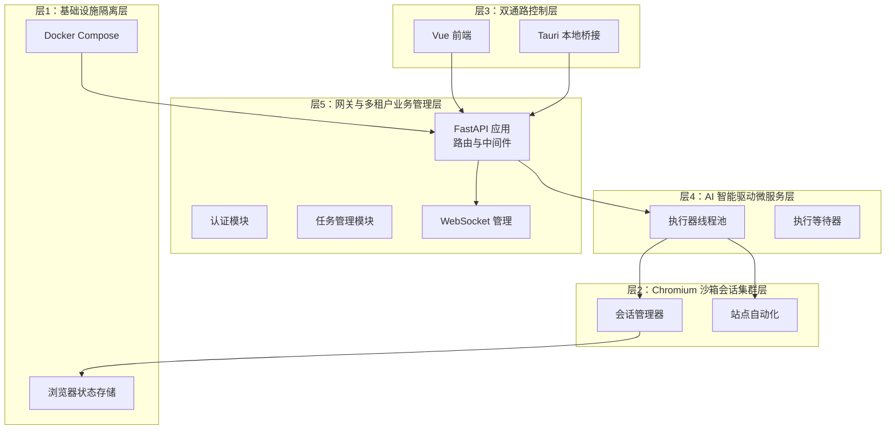
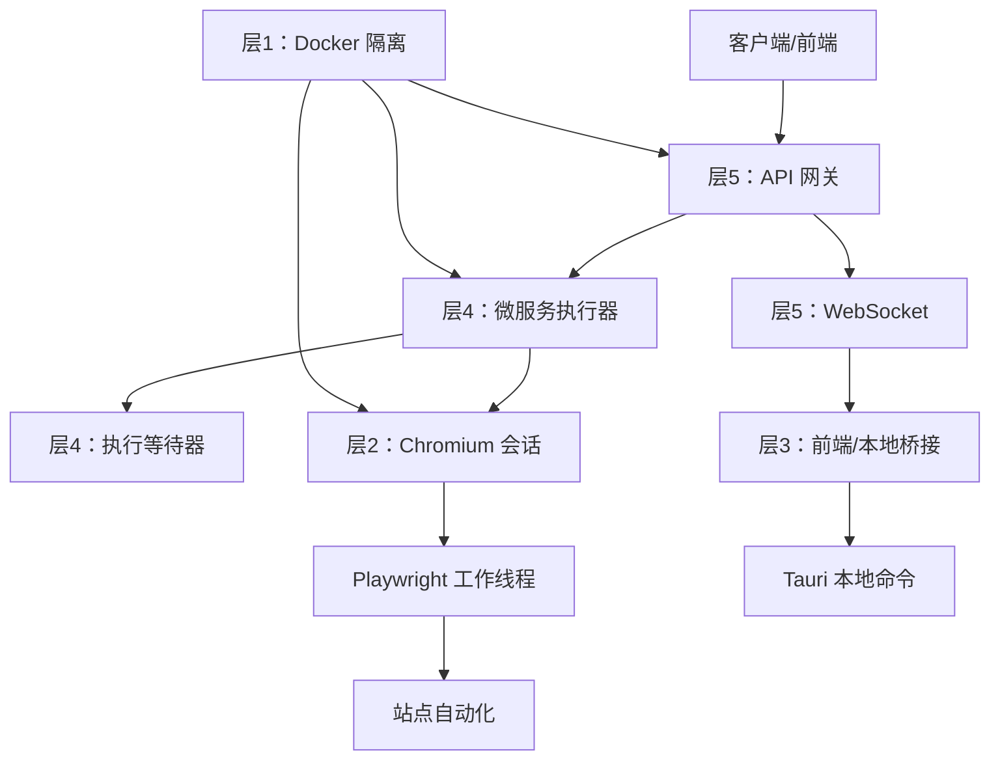
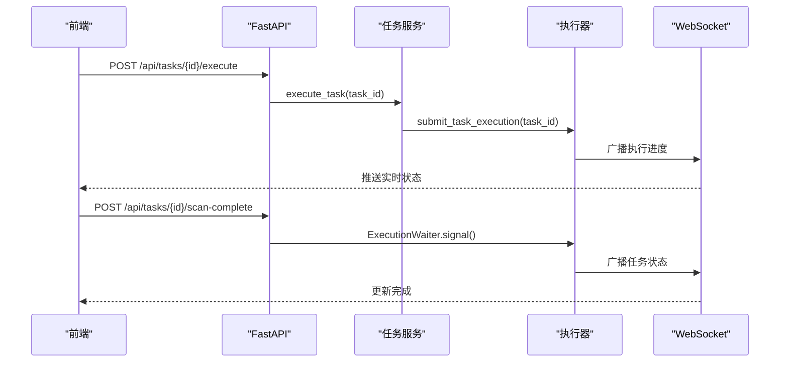
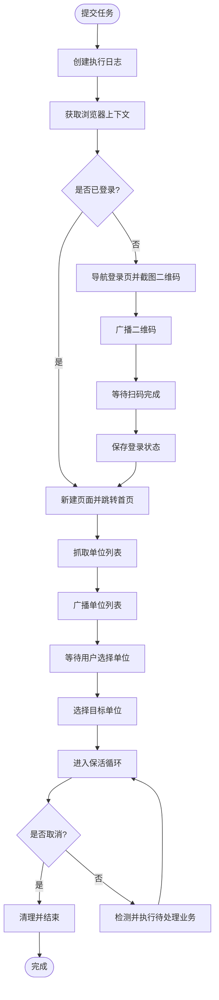
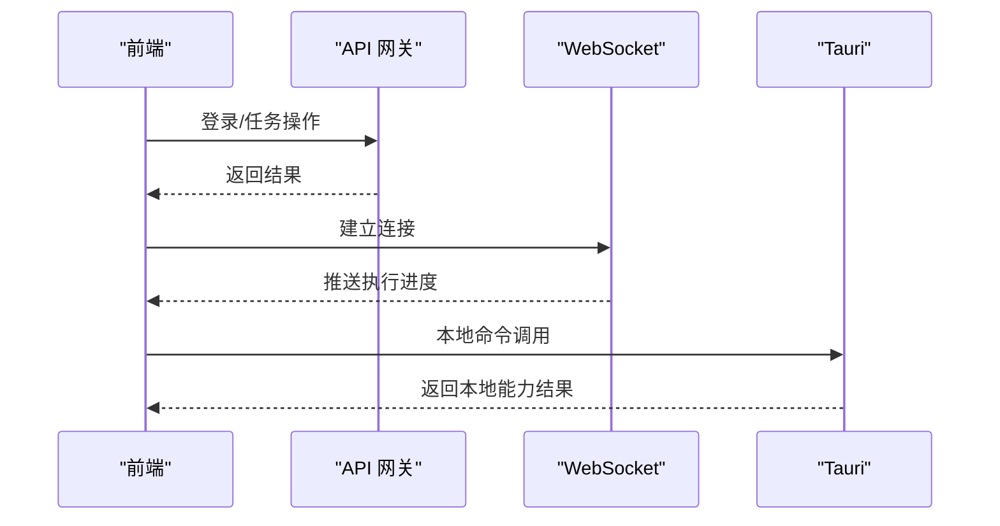
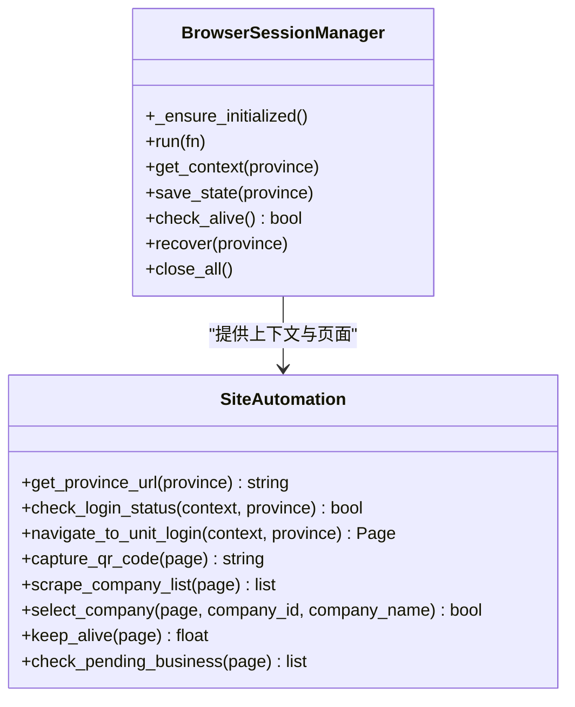
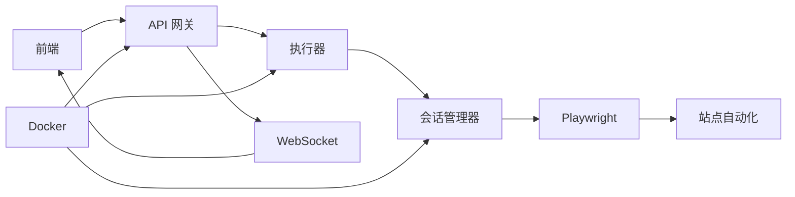

# 五层标准分层架构

<cite>
**本文档引用的文件**
- [main.py](file://CCC_RPA_API/app/main.py)
- [tasks.py](file://CCC_RPA_API/app/api/tasks.py)
- [auth.py](file://CCC_RPA_API/app/api/auth.py)
- [task.py](file://CCC_RPA_API/app/services/task.py)
- [executor.py](file://CCC_RPA_API/app/services/executor.py)
- [session_manager.py](file://CCC_RPA_API/app/browser/session_manager.py)
- [site_automation.py](file://CCC_RPA_API/app/browser/site_automation.py)
- [waiter.py](file://CCC_RPA_API/app/browser/waiter.py)
- [manager.py](file://CCC_RPA_API/app/ws/manager.py)
- [task.py](file://CCC_RPA_API/app/models/task.py)
- [index.ts](file://CCC-BrowserV4/frontend/src/router/index.ts)
- [auth.ts](file://CCC-BrowserV4/frontend/src/api/auth.ts)
- [execution.ts](file://CCC-BrowserV4/frontend/src/api/execution.ts)
- [ws.ts](file://CCC-BrowserV4/frontend/src/api/ws.ts)
- [App.vue](file://CCC-BrowserV4/frontend/src/App.vue)
- [main.ts](file://CCC-BrowserV4/frontend/src/main.ts)
- [commands.rs](file://CCC-BrowserV4/src-tauri/src/commands.rs)
- [device.rs](file://CCC-BrowserV4/src-tauri/src/device.rs)
- [main.rs](file://CCC-BrowserV4/src-tauri/src/main.rs)
- [tauri.conf.json](file://CCC-BrowserV4/src-tauri/tauri.conf.json)
- [docker-compose.yml](file://CCC-BrowserV4/docker-compose.yml)
</cite>

## 目录
1. [简介](#简介)
2. [项目结构](#项目结构)
3. [核心组件](#核心组件)
4. [架构总览](#架构总览)
5. [详细组件分析](#详细组件分析)
6. [依赖关系分析](#依赖关系分析)
7. [性能考虑](#性能考虑)
8. [故障排查指南](#故障排查指南)
9. [结论](#结论)
10. [附录](#附录)

## 简介
本项目是一个商用级 AI 浏览器系统，采用五层标准分层架构设计，自上而下分别为：
- 层5：网关与多租户业务管理层（API 网关、认证授权、任务编排）
- 层4：AI 智能驱动微服务层（智能调度、执行引擎、人机行为模拟）
- 层3：双通路控制层（用户交互与业务控制、执行等待机制）
- 层2：Chromium 沙箱会话集群层（Playwright 会话管理、页面自动化）
- 层1：基础设施隔离层（Docker 容器化、网络与存储隔离）

该架构通过清晰的分层职责划分与严格的层间交互约束，确保系统的可扩展性、稳定性与安全性。

## 项目结构
项目采用前后端分离与多模块协同的组织方式：
- 后端 API 服务：基于 FastAPI，提供认证、任务管理、WebSocket 推送等功能
- 前端应用：基于 Vue + Tauri，提供用户界面与本地命令桥接
- 浏览器自动化：基于 Playwright，实现多省份会话管理与站点自动化
- 数据模型：基于 SQLAlchemy，定义任务与执行日志等实体
- 部署：通过 Docker Compose 进行容器化部署

**图表来源**
- [main.py:12-27](file://CCC_RPA_API/app/main.py#L12-L27)
- [executor.py:18-33](file://CCC_RPA_API/app/services/executor.py#L18-L33)
- [session_manager.py:7-26](file://CCC_RPA_API/app/browser/session_manager.py#L7-L26)
- [docker-compose.yml](file://CCC-BrowserV4/docker-compose.yml)

**章节来源**
- [main.py:12-27](file://CCC_RPA_API/app/main.py#L12-L27)
- [docker-compose.yml](file://CCC-BrowserV4/docker-compose.yml)

## 核心组件
- 层5 网关与多租户业务管理层
  - FastAPI 应用：CORS 配置、路由注册、健康检查、WebSocket 端点
  - 认证模块：登录、登出、验证接口
  - 任务模块：任务 CRUD、执行、日志查询、用户交互信号
  - WebSocket 管理：连接管理与广播推送
- 层4 AI 智能驱动微服务层
  - 执行器：线程池执行任务逻辑，跨线程安全广播消息
  - 执行等待器：基于 Event 的用户交互与取消控制
- 层3 双通路控制层
  - 前端 Vue 应用：路由、页面组件、状态管理
  - Tauri 本地桥接：系统命令与设备管理
- 层2 Chromium 沙箱会话集群层
  - 会话管理器：按省份管理 Playwright 上下文，持久化状态
  - 站点自动化：登录检查、二维码截取、单位列表抓取、业务保活
- 层1 基础设施隔离层
  - Docker Compose：容器化部署与服务编排

**章节来源**
- [main.py:12-27](file://CCC_RPA_API/app/main.py#L12-L27)
- [auth.py:10-23](file://CCC_RPA_API/app/api/auth.py#L10-L23)
- [tasks.py:13-75](file://CCC_RPA_API/app/api/tasks.py#L13-L75)
- [executor.py:18-33](file://CCC_RPA_API/app/services/executor.py#L18-L33)
- [waiter.py:14-32](file://CCC_RPA_API/app/browser/waiter.py#L14-L32)
- [session_manager.py:7-26](file://CCC_RPA_API/app/browser/session_manager.py#L7-L26)
- [site_automation.py:38-58](file://CCC_RPA_API/app/browser/site_automation.py#L38-L58)
- [manager.py:5-28](file://CCC_RPA_API/app/ws/manager.py#L5-L28)

## 架构总览
五层架构的职责与交互如下：
- 层5：对外提供 REST API 与 WebSocket，负责多租户信息注入、任务编排与状态上报
- 层4：通过线程池与等待器实现异步执行与用户交互控制，保证长时间保活与可中断性
- 层3：前端通过 API 与 WebSocket 与后端交互，Tauri 提供本地能力扩展
- 层2：Playwright 在专用线程中执行页面操作，按省份隔离会话状态
- 层1：Docker 将各服务容器化，实现网络与存储隔离

**图表来源**
- [main.py:12-27](file://CCC_RPA_API/app/main.py#L12-L27)
- [executor.py:306-308](file://CCC_RPA_API/app/services/executor.py#L306-L308)
- [session_manager.py:39-74](file://CCC_RPA_API/app/browser/session_manager.py#L39-L74)
- [docker-compose.yml](file://CCC-BrowserV4/docker-compose.yml)

## 详细组件分析

### 层5：网关与多租户业务管理层
- FastAPI 应用
  - CORS 配置允许跨域请求
  - 路由注册：认证、任务、租户、设备
  - 启动事件：数据库初始化、表结构迁移、Mock 数据插入
  - 关闭事件：关闭所有浏览器会话
  - 健康检查与 WebSocket 端点
- 认证模块
  - 登录、登出、验证接口，返回用户态信息
- 任务模块
  - 任务 CRUD、执行、日志查询
  - 用户交互信号：扫码完成、选择单位、取消执行
- WebSocket 管理
  - 维护连接集合，广播执行进度、错误与状态更新

**图表来源**
- [tasks.py:47-52](file://CCC_RPA_API/app/api/tasks.py#L47-L52)
- [executor.py:22-33](file://CCC_RPA_API/app/services/executor.py#L22-L33)
- [manager.py:17-26](file://CCC_RPA_API/app/ws/manager.py#L17-L26)

**章节来源**
- [main.py:12-27](file://CCC_RPA_API/app/main.py#L12-L27)
- [auth.py:10-23](file://CCC_RPA_API/app/api/auth.py#L10-L23)
- [tasks.py:13-75](file://CCC_RPA_API/app/api/tasks.py#L13-L75)
- [manager.py:5-28](file://CCC_RPA_API/app/ws/manager.py#L5-L28)

### 层4：AI 智能驱动微服务层
- 执行器
  - 线程池执行任务逻辑，避免阻塞主线程
  - 跨线程安全广播 WebSocket 消息
  - 浏览器存活检查与异常恢复
  - 保活循环与业务触发检测
- 执行等待器
  - 基于 Event 的阻塞等待与信号唤醒
  - 支持取消与非阻塞检查
  - 保活循环中轮询取消信号

**图表来源**
- [executor.py:68-304](file://CCC_RPA_API/app/services/executor.py#L68-L304)
- [waiter.py:14-32](file://CCC_RPA_API/app/browser/waiter.py#L14-L32)

**章节来源**
- [executor.py:18-33](file://CCC_RPA_API/app/services/executor.py#L18-L33)
- [executor.py:68-304](file://CCC_RPA_API/app/services/executor.py#L68-L304)
- [waiter.py:7-84](file://CCC_RPA_API/app/browser/waiter.py#L7-L84)

### 层3：双通路控制层
- 前端
  - 路由与页面组件：登录、任务编辑、执行面板
  - 状态管理：认证、设备、执行状态
  - API 调用：认证、任务、执行、WebSocket
- Tauri 本地桥接
  - 系统命令与设备管理，提供本地能力扩展
  - 与前端通过桥接通信

**图表来源**
- [index.ts](file://CCC-BrowserV4/frontend/src/router/index.ts)
- [auth.ts](file://CCC-BrowserV4/frontend/src/api/auth.ts)
- [execution.ts](file://CCC-BrowserV4/frontend/src/api/execution.ts)
- [ws.ts](file://CCC-BrowserV4/frontend/src/api/ws.ts)
- [main.rs](file://CCC-BrowserV4/src-tauri/src/main.rs)

**章节来源**
- [index.ts](file://CCC-BrowserV4/frontend/src/router/index.ts)
- [auth.ts](file://CCC-BrowserV4/frontend/src/api/auth.ts)
- [execution.ts](file://CCC-BrowserV4/frontend/src/api/execution.ts)
- [ws.ts](file://CCC-BrowserV4/frontend/src/api/ws.ts)
- [main.rs](file://CCC-BrowserV4/src-tauri/src/main.rs)

### 层2：Chromium 沙箱会话集群层
- 会话管理器
  - 专用工作线程执行 Playwright 操作
  - 按省份管理上下文，持久化 storage_state
  - 存活检查与异常恢复
- 站点自动化
  - 登录状态检查、二维码截取
  - 单位列表抓取、单位选择
  - 页面保活、待处理业务检测与执行

**图表来源**
- [session_manager.py:7-183](file://CCC_RPA_API/app/browser/session_manager.py#L7-L183)
- [site_automation.py:16-562](file://CCC_RPA_API/app/browser/site_automation.py#L16-L562)

**章节来源**
- [session_manager.py:7-183](file://CCC_RPA_API/app/browser/session_manager.py#L7-L183)
- [site_automation.py:38-58](file://CCC_RPA_API/app/browser/site_automation.py#L38-L58)
- [site_automation.py:148-173](file://CCC_RPA_API/app/browser/site_automation.py#L148-L173)
- [site_automation.py:194-291](file://CCC_RPA_API/app/browser/site_automation.py#L194-L291)
- [site_automation.py:294-419](file://CCC_RPA_API/app/browser/site_automation.py#L294-L419)
- [site_automation.py:436-499](file://CCC_RPA_API/app/browser/site_automation.py#L436-L499)
- [site_automation.py:502-554](file://CCC_RPA_API/app/browser/site_automation.py#L502-L554)

### 层1：基础设施隔离层
- Docker Compose
  - 容器化部署，隔离网络与存储
  - 服务编排与依赖管理
- 浏览器状态存储
  - 会话状态持久化目录，按省份区分

**章节来源**
- [docker-compose.yml](file://CCC-BrowserV4/docker-compose.yml)
- [session_manager.py:16-20](file://CCC_RPA_API/app/browser/session_manager.py#L16-L20)

## 依赖关系分析
- 层5 依赖层4的服务能力，通过线程池与等待器实现异步执行
- 层4 依赖层2的浏览器会话与页面自动化能力
- 层3 通过 API 与 WebSocket 与层5交互，Tauri 提供本地能力
- 层2 依赖 Playwright 专用线程，避免与 asyncio 冲突
- 层1 通过 Docker 提供运行环境隔离

**图表来源**
- [main.py:12-27](file://CCC_RPA_API/app/main.py#L12-L27)
- [executor.py:306-308](file://CCC_RPA_API/app/services/executor.py#L306-L308)
- [session_manager.py:39-74](file://CCC_RPA_API/app/browser/session_manager.py#L39-L74)
- [docker-compose.yml](file://CCC-BrowserV4/docker-compose.yml)

**章节来源**
- [main.py:12-27](file://CCC_RPA_API/app/main.py#L12-L27)
- [executor.py:306-308](file://CCC_RPA_API/app/services/executor.py#L306-L308)
- [session_manager.py:39-74](file://CCC_RPA_API/app/browser/session_manager.py#L39-L74)
- [docker-compose.yml](file://CCC-BrowserV4/docker-compose.yml)

## 性能考虑
- 线程池与专用工作线程
  - 使用线程池执行耗时任务，避免阻塞主线程
  - Playwright 在专用线程中执行，避免与 asyncio 事件循环冲突
- 跨线程广播
  - 通过主事件循环安全广播 WebSocket 消息
- 保活策略
  - 随机滚动、点击刷新、随机等待，降低风控风险
  - 分段等待取消信号，提升响应性
- 存储与状态
  - 按省份持久化 storage_state，减少重复登录成本

**章节来源**
- [executor.py:18-33](file://CCC_RPA_API/app/services/executor.py#L18-L33)
- [executor.py:42-59](file://CCC_RPA_API/app/services/executor.py#L42-L59)
- [site_automation.py:436-499](file://CCC_RPA_API/app/browser/site_automation.py#L436-L499)

## 故障排查指南
- 浏览器异常恢复
  - 检查浏览器存活状态，异常时恢复会话并重新打开页面
- WebSocket 广播失败
  - 主事件循环不可用时记录告警，检查事件循环状态
- 登录状态异常
  - 登录检查失败时记录告警，尝试重新登录流程
- 执行超时
  - 等待扫码与选择单位设置超时时间，超时后记录错误
- 数据库迁移
  - 启动时自动添加列，避免迁移失败影响启动

**章节来源**
- [executor.py:42-59](file://CCC_RPA_API/app/services/executor.py#L42-L59)
- [executor.py:22-33](file://CCC_RPA_API/app/services/executor.py#L22-L33)
- [site_automation.py:38-58](file://CCC_RPA_API/app/browser/site_automation.py#L38-L58)
- [main.py:41-86](file://CCC_RPA_API/app/main.py#L41-L86)

## 结论
本五层架构通过明确的职责划分与严格的层间交互约束，实现了商用级 AI 浏览器系统的高可用与可维护性。层5 提供统一网关与多租户能力，层4 以线程池与等待器实现智能执行，层3 通过前端与本地桥接提供双通路控制，层2 以 Playwright 保障页面自动化稳定性，层1 通过 Docker 实现基础设施隔离。整体设计兼顾性能、安全与扩展性，适合大规模商用部署。

## 附录
- 数据模型
  - 任务模型包含多租户字段、设备标识、客户名称、处理账号、子任务列表、省份、执行时间与备注等
- 前端入口
  - 应用入口与路由配置，提供页面导航与状态管理
- Tauri 配置
  - 应用配置与权限声明，启用本地命令与设备管理

**章节来源**
- [task.py:8-25](file://CCC_RPA_API/app/models/task.py#L8-L25)
- [main.ts](file://CCC-BrowserV4/frontend/src/main.ts)
- [App.vue](file://CCC-BrowserV4/frontend/src/App.vue)
- [tauri.conf.json](file://CCC-BrowserV4/src-tauri/tauri.conf.json)