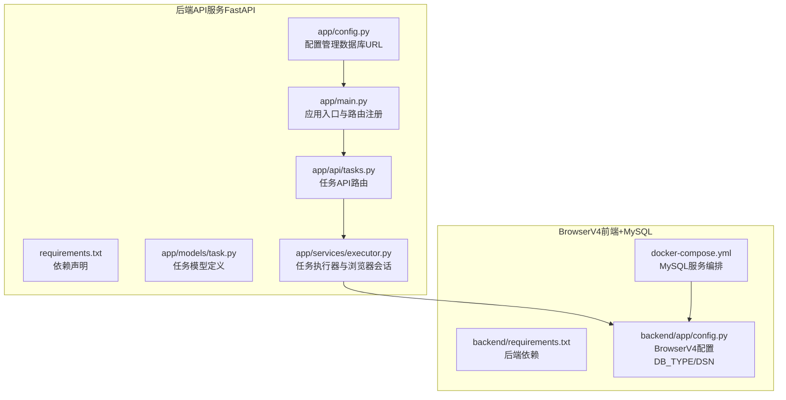
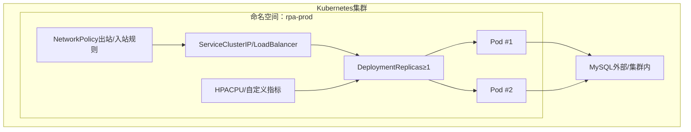
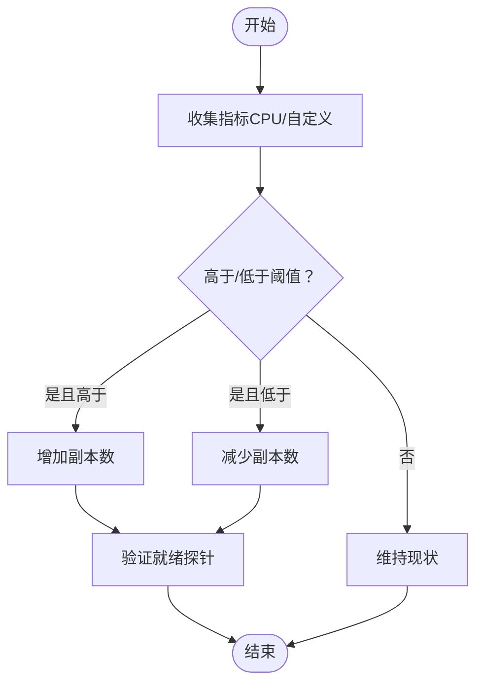
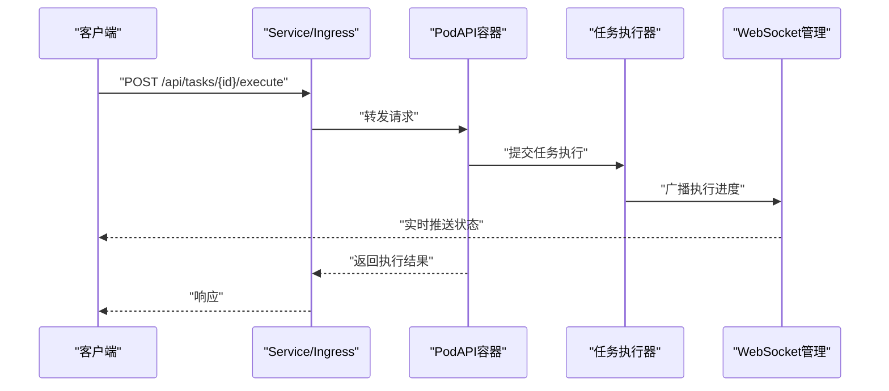
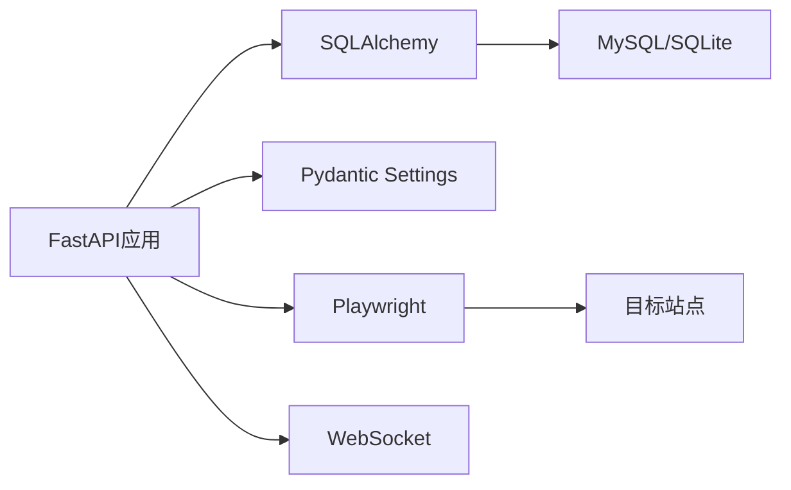

# K8s容器编排

<cite>
**本文档引用的文件**
- [app/main.py](file://CCC_RPA_API/app/main.py)
- [app/config.py](file://CCC_RPA_API/app/config.py)
- [requirements.txt](file://CCC_RPA_API/requirements.txt)
- [app/api/tasks.py](file://CCC_RPA_API/app/api/tasks.py)
- [app/models/task.py](file://CCC_RPA_API/app/models/task.py)
- [app/services/executor.py](file://CCC_RPA_API/app/services/executor.py)
- [docker-compose.yml](file://CCC-BrowserV4/docker-compose.yml)
- [backend/requirements.txt](file://CCC-BrowserV4/backend/requirements.txt)
- [backend/app/config.py](file://CCC-BrowserV4/backend/app/config.py)
</cite>

## 目录
1. [简介](#简介)
2. [项目结构](#项目结构)
3. [核心组件](#核心组件)
4. [架构总览](#架构总览)
5. [详细组件分析](#详细组件分析)
6. [依赖分析](#依赖分析)
7. [性能考虑](#性能考虑)
8. [故障排查指南](#故障排查指南)
9. [结论](#结论)
10. [附录](#附录)

## 简介
本项目是一个基于FastAPI的RPA（机器人流程自动化）后端服务，提供任务编排、站点自动化、浏览器会话管理、WebSocket实时通信与数据库持久化能力。虽然仓库未直接包含Kubernetes资源配置文件，但本文件将结合现有后端代码与依赖，给出面向Kubernetes的容器编排设计与落地建议，涵盖Pod编排、Deployment管理、HPA弹性扩缩容、NetworkPolicy网络隔离、健康检查、服务发现与负载均衡、存储挂载与环境变量注入等主题，并提供可参考的资源配置思路与最佳实践。

## 项目结构
项目分为两部分：
- 后端API服务（FastAPI）：位于 CCC_RPA_API，负责REST接口、任务调度、浏览器会话管理与WebSocket通信。
- 前端与浏览器相关服务（BrowserV4）：位于 CCC-BrowserV4，包含前端Vue应用、Tauri桌面桥接以及MySQL服务编排（docker-compose）。

图表来源
- [app/main.py:1-127](file://CCC_RPA_API/app/main.py#L1-L127)
- [app/config.py:1-22](file://CCC_RPA_API/app/config.py#L1-L22)
- [requirements.txt](file://CCC_RPA_API/requirements.txt)
- [app/api/tasks.py:1-76](file://CCC_RPA_API/app/api/tasks.py#L1-L76)
- [app/models/task.py:1-25](file://CCC_RPA_API/app/models/task.py#L1-L25)
- [app/services/executor.py:1-319](file://CCC_RPA_API/app/services/executor.py#L1-L319)
- [docker-compose.yml:1-21](file://CCC-BrowserV4/docker-compose.yml#L1-L21)
- [backend/requirements.txt](file://CCC-BrowserV4/backend/requirements.txt)
- [backend/app/config.py:1-52](file://CCC-BrowserV4/backend/app/config.py#L1-L52)

章节来源
- [app/main.py:1-127](file://CCC_RPA_API/app/main.py#L1-L127)
- [app/config.py:1-22](file://CCC_RPA_API/app/config.py#L1-L22)
- [requirements.txt](file://CCC_RPA_API/requirements.txt)
- [docker-compose.yml:1-21](file://CCC-BrowserV4/docker-compose.yml#L1-L21)
- [backend/requirements.txt](file://CCC-BrowserV4/backend/requirements.txt)
- [backend/app/config.py:1-52](file://CCC-BrowserV4/backend/app/config.py#L1-L52)

## 核心组件
- 应用入口与生命周期
  - 应用通过FastAPI创建实例，注册CORS中间件与路由模块；在启动阶段进行数据库表初始化与迁移，并注入Mock任务数据；在关闭阶段释放浏览器会话资源。
  - 健康检查端点提供服务可用性反馈。
- 配置管理
  - 使用Pydantic Settings统一读取环境变量与.env文件，生成数据库连接URL；支持MySQL与SQLite两种模式（BrowserV4侧）。
- API层
  - 提供任务的增删改查、执行、日志查询、扫码完成与公司选择等接口；集成WebSocket用于实时进度推送。
- 任务模型
  - 定义任务字段（名称、状态、租户/设备标识、省/市、下次执行时间、备注等），并与数据库表映射。
- 任务执行器
  - 基于线程池并发执行任务逻辑；与Playwright浏览器会话管理器协作；通过WebSocket广播执行进度与错误；具备保活循环与取消信号处理。

章节来源
- [app/main.py:12-127](file://CCC_RPA_API/app/main.py#L12-L127)
- [app/config.py:6-22](file://CCC_RPA_API/app/config.py#L6-L22)
- [app/api/tasks.py:10-76](file://CCC_RPA_API/app/api/tasks.py#L10-L76)
- [app/models/task.py:8-25](file://CCC_RPA_API/app/models/task.py#L8-L25)
- [app/services/executor.py:17-319](file://CCC_RPA_API/app/services/executor.py#L17-L319)

## 架构总览
下图展示了后端服务在Kubernetes中的典型部署形态：一个或多个Pod承载API服务，通过Service暴露REST与WebSocket；数据库（MySQL）作为外部服务或集群内服务；浏览器会话与页面操作在容器内运行，必要时可挂载共享存储以持久化状态。

图表来源
- [app/main.py:12-127](file://CCC_RPA_API/app/main.py#L12-L127)
- [app/api/tasks.py:10-76](file://CCC_RPA_API/app/api/tasks.py#L10-L76)
- [app/services/executor.py:17-319](file://CCC_RPA_API/app/services/executor.py#L17-L319)
- [docker-compose.yml:1-21](file://CCC-BrowserV4/docker-compose.yml#L1-L21)

## 详细组件分析

### Pod编排与模板配置
- 资源请求与限制
  - CPU与内存建议：根据任务执行器的线程池大小（默认3个）与Playwright页面操作的内存占用，为容器设置合理的requests与limits，避免突发流量导致OOM或调度失败。
  - 存储：若需持久化浏览器状态或截图，可挂载临时卷或持久化卷（ReadWriteOnce），并确保Pod亲和性与节点选择满足浏览器渲染需求。
- 环境变量注入
  - 通过ConfigMap/Secret注入数据库连接参数（主机、端口、用户名、密码、数据库名）、WebSocket广播所需的事件循环引用（在K8s中通常通过服务发现与端口暴露实现，无需额外注入）。
- 健康检查
  - HTTP探针：利用现有健康检查端点提供存活与就绪探针，保障滚动升级期间的流量切换。
  - 进程探针：可选，用于检测进程卡死或异常退出。
- 安全上下文
  - 非特权运行、只读根文件系统、禁用CAP_SYS_ADMIN等，降低攻击面。

章节来源
- [app/main.py:114-116](file://CCC_RPA_API/app/main.py#L114-L116)
- [app/config.py:6-22](file://CCC_RPA_API/app/config.py#L6-L22)
- [requirements.txt](file://CCC_RPA_API/requirements.txt)

### Deployment管理
- 副本数与更新策略
  - 设置最小不可用/最大超额，保证滚动升级过程中的服务连续性；副本数≥2以满足高可用。
- 选择器与标签
  - 选择器与Pod模板标签保持一致，确保Service正确路由流量。
- 就绪与存活探针
  - 就绪探针延迟启动时间应覆盖数据库初始化与依赖加载；存活探针周期适中，避免频繁重启。
- 滚动更新策略
  - 分批更新，结合HPA与PodDisruptionBudget（PDB）保障SLA。

章节来源
- [app/main.py:30-103](file://CCC_RPA_API/app/main.py#L30-L103)
- [app/api/tasks.py:10-76](file://CCC_RPA_API/app/api/tasks.py#L10-L76)

### HPA弹性扩缩容
- 指标选择
  - CPU利用率：适用于通用场景；自定义指标（如每Pod任务队列长度、WebSocket连接数、数据库查询延迟）更贴合业务。
- 触发条件
  - CPU阈值（如70%）或自定义指标阈值（如每Pod平均任务排队时间超过阈值）触发扩容；缩容阈值避免抖动。
- 下限与上限
  - 最小副本数确保冷启动与突发流量；最大副本数防止资源耗尽。
- 与Deployment的关系
  - HPA通过Deployment的标签选择器关联，动态调整replicas。

图表来源
- [app/services/executor.py:17-319](file://CCC_RPA_API/app/services/executor.py#L17-L319)
- [app/api/tasks.py:10-76](file://CCC_RPA_API/app/api/tasks.py#L10-L76)

### NetworkPolicy网络隔离
- 入站规则
  - 仅允许来自Ingress/网关与内部监控系统的流量访问Service端口。
- 出站规则
  - 限制对外出站访问，仅放行必要的上游域名（如目标站点域名）与下游服务（数据库、消息队列）。
- 例外与调试
  - 为运维与可观测性保留特定CIDR白名单；生产环境默认拒绝，开发/测试环境可放宽。

章节来源
- [app/main.py:14-21](file://CCC_RPA_API/app/main.py#L14-L21)
- [app/api/tasks.py:10-76](file://CCC_RPA_API/app/api/tasks.py#L10-L76)

### 服务发现与负载均衡
- Service类型
  - 内部服务：ClusterIP；对外暴露：LoadBalancer或Ingress；WebSocket可通过Ingress或专用Service支持。
- 会话亲和
  - 如需浏览器会话粘性，可在Service层启用会话亲和（基于客户端IP），但需结合HPA与滚动升级策略谨慎评估。
- DNS与端口
  - 通过标准DNS解析访问Service；端口与协议（HTTP/WS）需与探针与Ingress配置一致。

章节来源
- [app/main.py:12-21](file://CCC_RPA_API/app/main.py#L12-L21)
- [app/api/tasks.py:10-76](file://CCC_RPA_API/app/api/tasks.py#L10-L76)

### 存储挂载与环境变量注入
- 存储
  - 临时卷：用于截图、缓存；持久卷：用于浏览器会话状态或日志归档，需配合PVC与StorageClass。
- 环境变量
  - 通过ConfigMap注入静态配置；通过Secret注入敏感信息（数据库凭据、第三方密钥）。
- 初始化容器
  - 可选：用于数据库迁移或依赖准备，确保主容器启动前依赖就绪。

章节来源
- [app/config.py:6-22](file://CCC_RPA_API/app/config.py#L6-L22)
- [backend/app/config.py:18-47](file://CCC-BrowserV4/backend/app/config.py#L18-L47)

### 健康检查机制
- 存活探针
  - 周期性调用健康检查端点，失败时重启容器。
- 就绪探针
  - 在数据库初始化、依赖加载完成后才标记就绪，避免流量进入未就绪实例。
- 探针参数
  - 初始延迟、超时、周期、成功率阈值需结合启动时间与依赖复杂度调整。

章节来源
- [app/main.py:114-116](file://CCC_RPA_API/app/main.py#L114-L116)
- [app/main.py:37-87](file://CCC_RPA_API/app/main.py#L37-L87)

### 任务执行与浏览器会话（与K8s编排的关系）
- 线程池与并发
  - 任务执行器使用固定大小线程池，K8s副本数与HPA共同决定整体并发容量。
- 浏览器会话管理
  - 会话状态可能需要持久化或在Pod间共享，建议通过共享存储或集中式会话管理服务实现。
- WebSocket广播
  - 通过K8s Service与Ingress暴露，实现前端实时进度展示。

图表来源
- [app/api/tasks.py:47-52](file://CCC_RPA_API/app/api/tasks.py#L47-L52)
- [app/services/executor.py:22-33](file://CCC_RPA_API/app/services/executor.py#L22-L33)
- [app/main.py:119-127](file://CCC_RPA_API/app/main.py#L119-L127)

## 依赖分析
- 后端依赖
  - FastAPI/Uvicorn：Web框架与ASGI服务器。
  - SQLAlchemy/PyMySQL：数据库ORM与驱动。
  - Pydantic Settings/Python-dotenv：配置管理。
  - Playwright/Stealth：浏览器自动化与反爬策略。
- 前端与MySQL
  - BrowserV4提供MySQL服务编排示例，可用于本地开发或测试环境的数据库支撑。

图表来源
- [requirements.txt](file://CCC_RPA_API/requirements.txt)
- [backend/requirements.txt](file://CCC-BrowserV4/backend/requirements.txt)
- [app/config.py:6-22](file://CCC_RPA_API/app/config.py#L6-L22)
- [backend/app/config.py:18-47](file://CCC-BrowserV4/backend/app/config.py#L18-L47)

章节来源
- [requirements.txt](file://CCC_RPA_API/requirements.txt)
- [backend/requirements.txt](file://CCC-BrowserV4/backend/requirements.txt)
- [app/config.py:6-22](file://CCC_RPA_API/app/config.py#L6-L22)
- [backend/app/config.py:18-47](file://CCC-BrowserV4/backend/app/config.py#L18-L47)

## 性能考虑
- 资源配额
  - 根据任务执行器线程池规模与浏览器页面数量，合理设置CPU与内存requests/limits，避免争抢与OOM。
- 并发与队列
  - 通过HPA与副本数控制并发；对慢查询与外部站点访问设置超时与重试策略。
- 存储与I/O
  - 截图与日志写入SSD卷；避免在容器内写入大量临时文件，影响I/O性能。
- 网络
  - 将浏览器访问的目标站点域名加入出站白名单，减少DNS与TLS握手开销；必要时使用连接池与复用。

## 故障排查指南
- 健康检查失败
  - 检查就绪探针延迟与超时设置；确认数据库连接参数正确；查看启动日志与迁移输出。
- 任务执行异常
  - 关注浏览器会话恢复逻辑与截图保存路径；检查WebSocket广播是否正常；核对取消信号与保活循环。
- 数据库连接问题
  - 对照配置类中的DATABASE_URL构造逻辑；确认网络连通性与凭据正确性；区分BrowserV4与API侧配置差异。
- 浏览器会话丢失
  - 检查会话状态保存与恢复流程；确认共享存储权限与路径；评估Pod驱逐与重启对会话的影响。

章节来源
- [app/main.py:37-103](file://CCC_RPA_API/app/main.py#L37-L103)
- [app/services/executor.py:42-69](file://CCC_RPA_API/app/services/executor.py#L42-L69)
- [app/config.py:13-15](file://CCC_RPA_API/app/config.py#L13-L15)
- [backend/app/config.py:28-47](file://CCC-BrowserV4/backend/app/config.py#L28-L47)

## 结论
本项目提供了完整的RPA后端能力：任务编排、浏览器自动化、实时通信与数据库持久化。结合Kubernetes的Pod编排、Deployment管理、HPA弹性扩缩容与NetworkPolicy网络隔离，可实现高可用、可扩展、可观测的容器化部署。建议在生产环境中配套完善的监控告警、日志聚合与备份策略，并持续优化资源配额与并发控制以提升用户体验与系统稳定性。

## 附录
- 部署脚本与配置建议（思路）
  - 使用Helm Chart或Kustomize管理多环境配置；通过ConfigMap/Secret注入环境变量；为数据库与浏览器状态准备持久化卷；为Ingress与Service配置TLS与WSS支持。
- 监控配置（思路）
  - 指标：CPU/内存/请求速率/错误率/任务执行时延/WebSocket连接数；日志：stdout/stderr与结构化日志；告警：阈值与趋势告警结合。
- 示例清单（概念性，非仓库内容）
  - Deployment：副本数、探针、资源、滚动更新策略。
  - Service：ClusterIP/LoadBalancer，端口与协议。
  - HPA：CPU/自定义指标阈值与范围。
  - NetworkPolicy：入站/出站规则。
  - PVC/PV：浏览器状态与截图持久化。
  - ConfigMap/Secret：数据库连接与敏感配置。