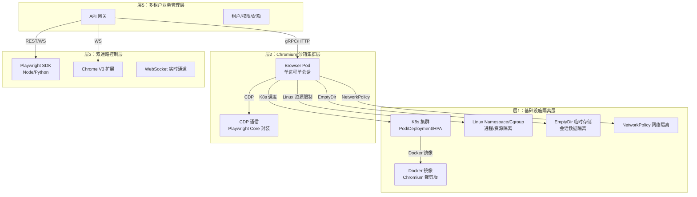
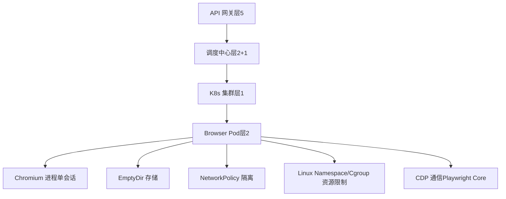
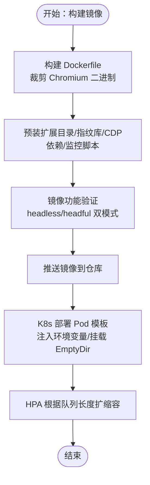
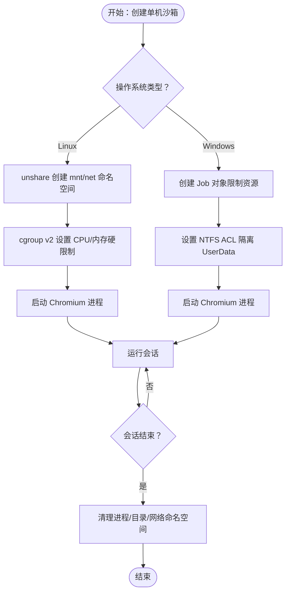
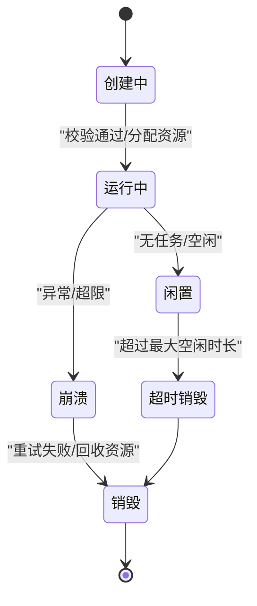
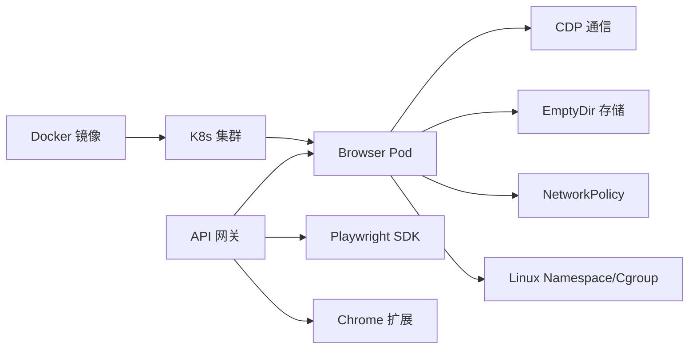
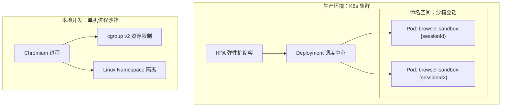

# 层1：基础设施隔离层

<cite>
**本文引用的文件**
- [project.md](file://project.md)
- [docker-compose.yml](file://CCC-BrowserV4/docker-compose.yml)
- [config.py](file://CCC-BrowserV4/backend/app/config.py)
- [database.py](file://CCC-BrowserV4/backend/app/database.py)
- [main.py](file://CCC_RPA_API/app/main.py)
- [config.py](file://CCC_RPA_API/app/config.py)
- [tasks.py](file://CCC_RPA_API/app/api/tasks.py)
- [task.py](file://CCC_RPA_API/app/models/task.py)
</cite>

## 目录
1. [引言](#引言)
2. [项目结构](#项目结构)
3. [核心组件](#核心组件)
4. [架构总览](#架构总览)
5. [详细组件分析](#详细组件分析)
6. [依赖关系分析](#依赖关系分析)
7. [性能考量](#性能考量)
8. [故障排查指南](#故障排查指南)
9. [结论](#结论)
10. [附录](#附录)

## 引言
本文件面向“层1：基础设施隔离层”的完整架构与实现，聚焦以下目标：
- 解释K8s容器编排、Linux Namespace/Cgroup、CPU/内存资源硬限制、独立临时存储隔离的设计与落地
- 说明单机进程沙箱与容器两级强隔离的技术路径
- 阐述EmptyDir存储与NetworkPolicy网络隔离的实现要点
- 梳理Docker镜像构建、K8s Pod模板、资源配额管理与安全策略配置
- 提供部署架构图、配置示例与运维指南，帮助开发者快速理解并实施

## 项目结构
本仓库包含三层与两套前端/后端工程，其中与“层1基础设施隔离层”直接相关的内容主要来自：
- 顶层需求与规范：项目总体设计、分层要求、隔离与资源限制规范
- 浏览器前端工程（Tauri + Vue）：用于演示与集成，便于本地开发与调试
- RPA后端工程（FastAPI）：提供REST/WS API、数据库连接与任务执行入口

图表来源
- [project.md: 173-236:173-236](file://project.md#L173-L236)
- [project.md: 239-291:239-291](file://project.md#L239-L291)
- [project.md: 734-765:734-765](file://project.md#L734-L765)

章节来源
- [project.md: 173-236:173-236](file://project.md#L173-L236)
- [project.md: 239-291:239-291](file://project.md#L239-L291)
- [project.md: 734-765:734-765](file://project.md#L734-L765)

## 核心组件
- 定制Chromium镜像与Dockerfile：裁剪二进制、移除上报组件、预装扩展目录与指纹伪装库、内置监控上报逻辑
- K8s Pod模板：资源硬限制、EmptyDir独立存储、环境变量注入、生命周期钩子
- 单机进程沙箱：Linux unshare创建独立mnt/net命名空间、cgroup v2限制资源；Windows使用Job对象与NTFS ACL
- 调度与生命周期：会话状态机、创建前置校验、销毁回收、自愈重试
- 网络隔离：NetworkPolicy确保Pod间不可互相访问
- 资源配额：CPU/内存硬上限、全局并发配额、HPA弹性扩缩容

章节来源
- [project.md: 241-250:241-250](file://project.md#L241-L250)
- [project.md: 251-262:251-262](file://project.md#L251-L262)
- [project.md: 263-276:263-276](file://project.md#L263-L276)
- [project.md: 277-291:277-291](file://project.md#L277-L291)
- [project.md: 293-299:293-299](file://project.md#L293-L299)
- [project.md: 734-765:734-765](file://project.md#L734-L765)

## 架构总览
下图展示了“层1基础设施隔离层”在整体系统中的定位与交互关系。

图表来源
- [project.md: 173-236:173-236](file://project.md#L173-L236)
- [project.md: 239-291:239-291](file://project.md#L239-L291)
- [project.md: 734-765:734-765](file://project.md#L734-L765)

## 详细组件分析

### 1) Docker 镜像与容器编排
- 镜像目标：裁剪Chromium二进制、移除媒体与上报组件；支持headless/headful双模式；预装扩展目录、指纹伪装库、CDP依赖与监控脚本
- K8s Pod模板要点：resources limits/requests设置CPU/内存硬限制；env注入SESSION_ID/PROXY_URL/TENANT_ID等；volumeMounts挂载EmptyDir到用户数据目录；生命周期钩子初始化隔离目录与销毁前清理
- HPA：依据任务队列长度自动扩缩容，闲置Pod自动销毁释放资源

图表来源
- [project.md: 241-250:241-250](file://project.md#L241-L250)
- [project.md: 251-262:251-262](file://project.md#L251-L262)
- [project.md: 734-765:734-765](file://project.md#L734-L765)

章节来源
- [project.md: 241-250:241-250](file://project.md#L241-L250)
- [project.md: 251-262:251-262](file://project.md#L251-L262)
- [project.md: 734-765:734-765](file://project.md#L734-L765)

### 2) 单机进程沙箱（Linux/Windows）
- Linux：使用unshare创建独立mnt/net命名空间，结合cgroup v2对CPU/内存进行硬限制；进程退出时清理UserData目录
- Windows：使用Win32 Job对象限制资源，使用NTFS ACL隔离UserData目录访问权限

图表来源
- [project.md: 203-208:203-208](file://project.md#L203-L208)

章节来源
- [project.md: 203-208:203-208](file://project.md#L203-L208)

### 3) 会话调度与生命周期管理
- 状态机：pending → running → idle → timeout/crash → destroy
- 创建前置校验：租户并发配额、代理IP可用性、集群资源
- 销毁触发：主动关闭、达到最大存活时长、内存超限、页面连续崩溃3次
- 自愈重试：CDP断连、代理网络超时自动重试2次，失败则销毁并上报

图表来源
- [project.md: 263-276:263-276](file://project.md#L263-L276)

章节来源
- [project.md: 263-276:263-276](file://project.md#L263-L276)

### 4) 全维度强隔离设计
- 文件层：独立UserData、磁盘缓存、下载目录、扩展本地存储
- 网络层：独立代理IP、独立网络命名空间、独立DNS缓存
- 进程层：独立Chromium进程/Pod，单会话崩溃不影响其他会话
- 浏览器存储：Cookie、LocalStorage、IndexedDB、SessionStorage完全隔离
- 指纹层：随机UA/WebGL/Canvas/Audio/时区/分辨率/字体列表
- 插件层：每个会话加载独立V3扩展实例，扩展存储互不互通

章节来源
- [project.md: 277-291:277-291](file://project.md#L277-L291)

### 5) 资源硬限制与配额管理
- 单会话硬上限：内存1~2Gi、CPU单核上限、最大打开标签10个、会话最长存活30分钟~24小时
- 集群全局并发会话上限：达到上限拒绝新会话创建请求
- 资源回收：超阈值标记异常，超时强制销毁会话

章节来源
- [project.md: 293-299:293-299](file://project.md#L293-L299)

### 6) EmptyDir 存储与 NetworkPolicy 隔离
- EmptyDir：为每个会话挂载独立临时存储目录，Pod删除自动销毁全部会话数据
- NetworkPolicy：隔离Pod网络，Pod间无法互相访问，避免横向移动

章节来源
- [project.md: 257](file://project.md#L257)
- [project.md: 201](file://project.md#L201)

### 7) Playwright Core CDP 轻量化封装
- 封装基础CDP指令：页面打开/关闭、截图、DOM获取、请求拦截、自定义JS注入
- 动态配置：指纹、代理、存储隔离参数
- 异常处理：捕获进程崩溃、CDP断连，回调上报调度中心状态

章节来源
- [project.md: 301-310:301-310](file://project.md#L301-L310)

### 8) 部署架构与配置示例

#### 8.1 K8s 浏览器沙箱 Pod 模板（示例）
- 资源限制：limits.cpu/memory、requests.cpu/memory
- 环境变量：SESSION_ID、PROXY_URL、TENANT_ID
- 存储：EmptyDir挂载到用户数据目录
- 生命周期钩子：启动前初始化隔离目录、销毁前终止Chromium进程并清理临时文件

章节来源
- [project.md: 734-765:734-765](file://project.md#L734-L765)

#### 8.2 单机进程沙箱（Linux/Windows）
- Linux：unshare + cgroup v2
- Windows：Job对象 + NTFS ACL

章节来源
- [project.md: 203-208:203-208](file://project.md#L203-L208)

#### 8.3 数据库与后端服务（示例）
- 使用MySQL或SQLite，通过配置类读取环境变量
- FastAPI应用注册路由、健康检查、WebSocket广播

章节来源
- [config.py:1-52](file://CCC-BrowserV4/backend/app/config.py#L1-L52)
- [database.py:1-45](file://CCC-BrowserV4/backend/app/database.py#L1-L45)
- [main.py:1-127](file://CCC_RPA_API/app/main.py#L1-L127)
- [config.py:1-22](file://CCC_RPA_API/app/config.py#L1-L22)

## 依赖关系分析
- 层1（基础设施隔离层）依赖于：
  - 定制Chromium镜像（Docker）
  - K8s集群（Pod/Deployment/HPA）
  - Linux Namespace/Cgroup（进程/资源隔离）
  - EmptyDir（临时存储）
  - NetworkPolicy（网络隔离）
- 层2（Chromium 沙箱集群层）依赖于：
  - Pod模板与资源配额
  - CDP通信与Playwright Core封装
- 层3（双通路控制层）依赖于：
  - API网关与WebSocket
  - Playwright SDK与Chrome扩展
- 层5（多租户业务管理层）依赖于：
  - 租户/权限/配额管理
  - 数据库与监控

图表来源
- [project.md: 173-236:173-236](file://project.md#L173-L236)
- [project.md: 239-291:239-291](file://project.md#L239-L291)
- [project.md: 734-765:734-765](file://project.md#L734-L765)

章节来源
- [project.md: 173-236:173-236](file://project.md#L173-L236)
- [project.md: 239-291:239-291](file://project.md#L239-L291)
- [project.md: 734-765:734-765](file://project.md#L734-L765)

## 性能考量
- 会话创建耗时：K8s集群≤3s，单机进程模式≤1s
- AI单条自然语言指令推理响应：7B本地模型≤1.5s
- 单集群稳定并发会话：最低支持200个，长期运行无持续内存泄漏
- API网关QPS≥100，WebSocket在线≥1000路
- CDP页面操作延迟≤200ms

章节来源
- [project.md: 506-517:506-517](file://project.md#L506-L517)

## 故障排查指南
- 会话内存持续泄漏：设置硬内存阈值自动销毁、强制超时回收、定时清理Chromium磁盘缓存、异常告警
- 网站识别自动化：全维度随机指纹、抹平CDP自动化特征、模拟真人轨迹、随机输入间隔
- 会话数据跨沙箱泄露：容器完全隔离文件系统、禁用全局磁盘缓存、销毁时递归删除UserData目录
- 集群并发过高：多副本负载均衡、任务队列削峰限流、租户独立并发配额
- AI推理延迟：多副本集群、本地GPU推理加速、通用操作模板预缓存

章节来源
- [project.md: 641-657:641-657](file://project.md#L641-L657)

## 结论
层1基础设施隔离层通过“容器+进程双层强隔离、EmptyDir存储、NetworkPolicy网络隔离、资源硬限制与HPA弹性扩缩容”，实现了商用级多租户浏览器沙箱的高隔离、高性能与高可用。结合定制Chromium镜像与K8s Pod模板，可在单机与K8s集群两种形态下稳定运行，并满足严格的隔离与安全要求。

## 附录

### A. 部署架构图（概念示意）

[此图为概念示意，不直接映射具体源文件，故不提供图表来源]

### B. 配置示例（路径指引）
- K8s Pod模板示例：[project.md: 734-765:734-765](file://project.md#L734-L765)
- 单机进程沙箱（Linux/Windows）：[project.md: 203-208:203-208](file://project.md#L203-L208)
- 数据库配置（FastAPI）：[config.py:1-22](file://CCC_RPA_API/app/config.py#L1-L22)
- 数据库连接与会话管理：[database.py:1-45](file://CCC-BrowserV4/backend/app/database.py#L1-L45)
- API应用与路由：[main.py:1-127](file://CCC_RPA_API/app/main.py#L1-L127)
- 任务API路由：[tasks.py:1-76](file://CCC_RPA_API/app/api/tasks.py#L1-L76)
- 任务模型定义：[task.py:1-25](file://CCC_RPA_API/app/models/task.py#L1-L25)

### C. 运维指南
- 镜像构建：遵循裁剪Chromium、移除上报组件、预装扩展目录与监控脚本的要求
- K8s部署：使用Pod模板注入环境变量、挂载EmptyDir、设置资源硬限制、启用HPA
- 单机调试：Linux使用unshare+cgroup v2，Windows使用Job对象+ACL
- 监控与告警：Prometheus指标采集、Grafana可视化、ELK审计日志、异常告警推送
- 安全基线：TLS加密、AES-256-CBC加密存储、RBAC权限、NetworkPolicy隔离

章节来源
- [project.md: 518-558:518-558](file://project.md#L518-L558)
- [project.md: 734-765:734-765](file://project.md#L734-L765)
- [project.md: 203-208:203-208](file://project.md#L203-L208)