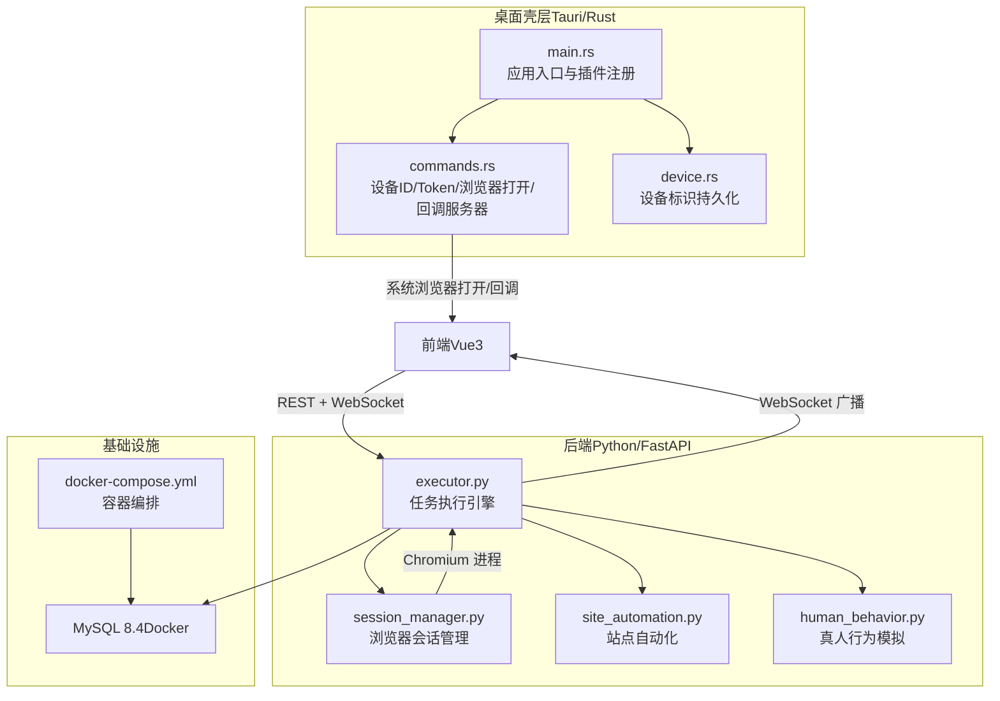
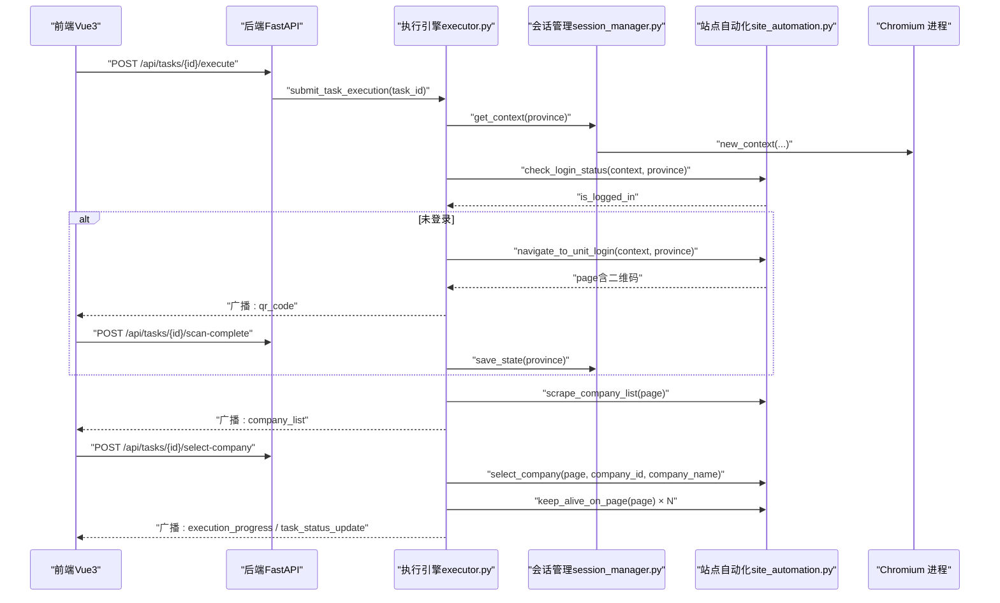
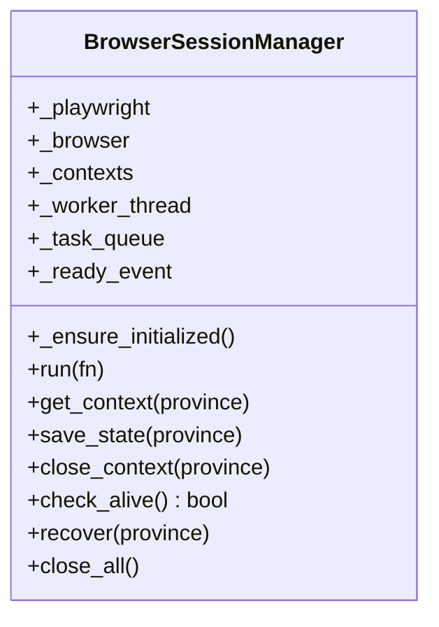
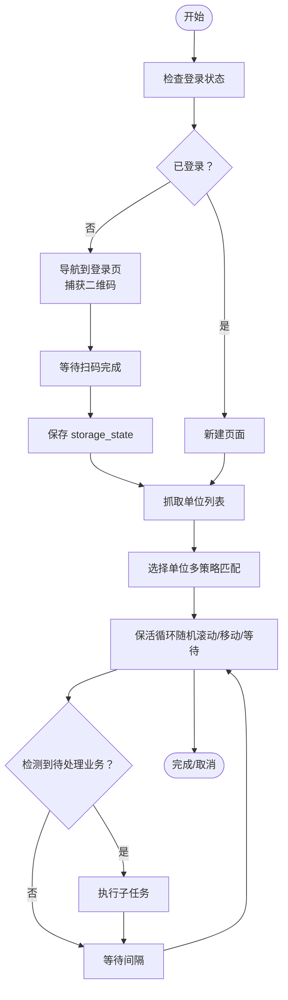
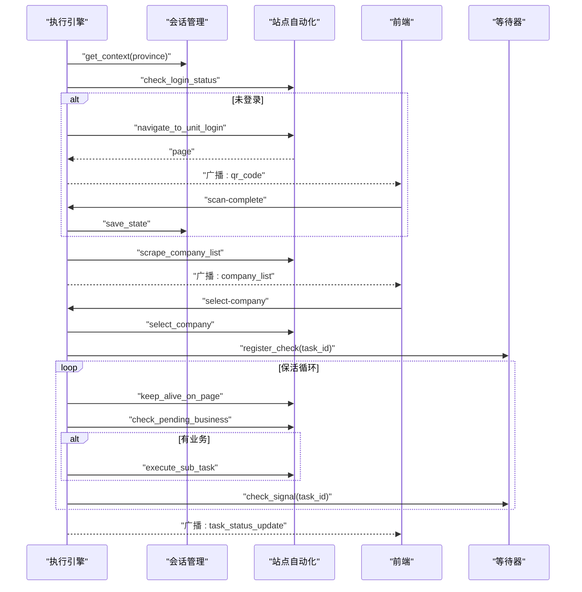
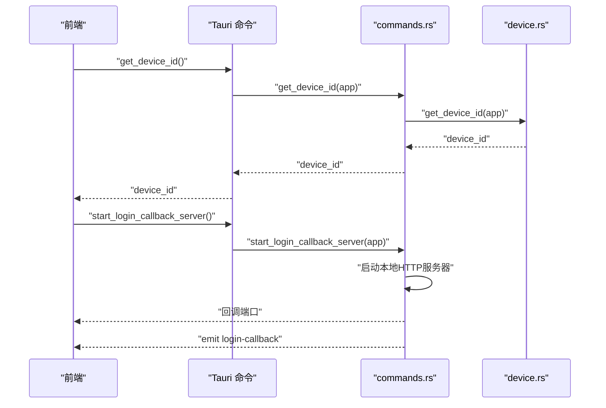
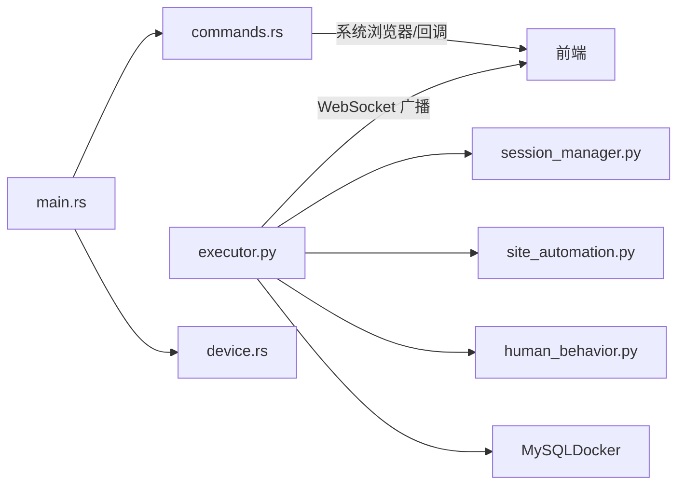

# 进程容器沙箱

<cite>
**本文引用的文件**
- [project.md](file://project.md)
- [main.rs](file://CCC-BrowserV4/src-tauri/src/main.rs)
- [commands.rs](file://CCC-BrowserV4/src-tauri/src/commands.rs)
- [device.rs](file://CCC-BrowserV4/src-tauri/src/device.rs)
- [docker-compose.yml](file://CCC-BrowserV4/docker-compose.yml)
- [session_manager.py](file://CCC_RPA_API/app/browser/session_manager.py)
- [site_automation.py](file://CCC_RPA_API/app/browser/site_automation.py)
- [executor.py](file://CCC_RPA_API/app/services/executor.py)
- [human_behavior.py](file://CCC_RPA_API/app/browser/human_behavior.py)
</cite>

## 目录
1. [简介](#简介)
2. [项目结构](#项目结构)
3. [核心组件](#核心组件)
4. [架构总览](#架构总览)
5. [详细组件分析](#详细组件分析)
6. [依赖关系分析](#依赖关系分析)
7. [性能考量](#性能考量)
8. [故障排查指南](#故障排查指南)
9. [结论](#结论)
10. [附录](#附录)

## 简介
本文件面向“进程容器沙箱系统”的实现与运维，聚焦于跨平台自动化执行场景下的隔离与资源管控。结合仓库现有实现，重点说明以下方面：
- Linux Namespace/Cgroup 隔离与单机进程沙箱：当前仓库以 Chromium 浏览器进程为核心载体，通过专用工作线程与任务队列实现隔离与串行化执行，具备基础的进程边界与资源隔离效果。
- Windows Job 对象管控：当前仓库未直接使用 Windows Job 对象，但可通过系统命令或第三方库在 Windows 平台对子进程进行资源限制与回收。
- mnt/net 命名空间与 cgroup v2：当前仓库未显式创建 Linux mnt/net 命名空间或挂载 cgroup v2 控制器，但可作为扩展方向引入。
- NTFS ACL 权限控制：当前仓库未涉及 NTFS ACL 的直接实现，可在 Windows 平台通过系统命令或 PowerShell 在沙箱目录层面进行权限控制。
- 进程资源监控：当前仓库通过日志与截图进行运行态观测，未内置系统级资源监控指标采集。

本文件同时提供配置示例、隔离测试方法与故障排查建议，帮助开发者理解并扩展跨平台沙箱实现。

## 项目结构
仓库采用“三层后端 + 桌面壳层 + 前端”的分层架构：
- 后端（Python FastAPI）：核心执行引擎、浏览器自动化、WebSocket 广播、数据库交互。
- 桌面壳层（Tauri/Rust）：设备标识持久化、系统浏览器打开、登录回调 HTTP 服务器。
- 前端（Vue3 + TypeScript）：任务管理、执行状态展示、WebSocket 消息分发。

**图表来源**
- [main.rs:1-29](file://CCC-BrowserV4/src-tauri/src/main.rs#L1-L29)
- [commands.rs:1-92](file://CCC-BrowserV4/src-tauri/src/commands.rs#L1-L92)
- [device.rs:1-32](file://CCC-BrowserV4/src-tauri/src/device.rs#L1-L32)
- [executor.py:1-319](file://CCC_RPA_API/app/services/executor.py#L1-L319)
- [session_manager.py:1-186](file://CCC_RPA_API/app/browser/session_manager.py#L1-L186)
- [site_automation.py:1-743](file://CCC_RPA_API/app/browser/site_automation.py#L1-L743)
- [human_behavior.py:1-86](file://CCC_RPA_API/app/browser/human_behavior.py#L1-L86)
- [docker-compose.yml:1-21](file://CCC-BrowserV4/docker-compose.yml#L1-L21)

**章节来源**
- [project.md:159-260](file://project.md#L159-L260)

## 核心组件
- 浏览器会话管理（BrowserSessionManager）
  - 专用工作线程承载 Chromium 实例，所有 Playwright 操作通过队列串行执行，避免多线程冲突。
  - 支持按省份隔离的 BrowserContext，持久化 storage_state，崩溃恢复与关闭清理。
- 站点自动化（SiteAutomation）
  - 面向 122.gov.cn 的完整自动化流程：登录状态检查、扫码登录、单位列表抓取、单位选择、页面保活、业务检测与执行。
- 任务执行引擎（Executor）
  - 线程池提交任务，串行化执行任务生命周期；通过 WebSocket 广播进度与错误；集成取消信号与超时控制。
- 真人行为模拟（HumanBehavior）
  - 随机延迟、随机点击、随机打字、随机滚动与阅读等待，降低被检测概率。
- 桌面壳层（Tauri/Rust）
  - 设备标识持久化、系统浏览器打开、登录回调 HTTP 服务器，支撑前端交互与登录流程。

**章节来源**
- [session_manager.py:10-186](file://CCC_RPA_API/app/browser/session_manager.py#L10-L186)
- [site_automation.py:16-743](file://CCC_RPA_API/app/browser/site_automation.py#L16-L743)
- [executor.py:78-319](file://CCC_RPA_API/app/services/executor.py#L78-L319)
- [human_behavior.py:12-86](file://CCC_RPA_API/app/browser/human_behavior.py#L12-L86)
- [main.rs:7-28](file://CCC-BrowserV4/src-tauri/src/main.rs#L7-L28)
- [commands.rs:10-92](file://CCC-BrowserV4/src-tauri/src/commands.rs#L10-L92)
- [device.rs:5-32](file://CCC-BrowserV4/src-tauri/src/device.rs#L5-L32)

## 架构总览
整体数据流从桌面客户端发起，经 REST/WS 到后端执行引擎，再驱动浏览器自动化执行，并通过 WebSocket 实时反馈状态。

**图表来源**
- [executor.py:78-319](file://CCC_RPA_API/app/services/executor.py#L78-L319)
- [session_manager.py:98-126](file://CCC_RPA_API/app/browser/session_manager.py#L98-L126)
- [site_automation.py:37-146](file://CCC_RPA_API/app/browser/site_automation.py#L37-L146)

## 详细组件分析

### 组件A：浏览器会话管理（BrowserSessionManager）
- 设计要点
  - 专用工作线程承载 Chromium，所有 Playwright 操作通过队列串行执行，避免多线程竞争。
  - 按省份隔离 BrowserContext，持久化 storage_state，支持崩溃恢复与关闭清理。
- 关键流程
  - 初始化：创建专用线程，启动 Chromium，等待就绪。
  - 执行：将任务封装为可调用，入队等待执行，阻塞等待结果。
  - 恢复：检测浏览器存活，异常时重建上下文并恢复页面状态。
- 代码片段路径
  - [BrowserSessionManager._ensure_initialized:30-78](file://CCC_RPA_API/app/browser/session_manager.py#L30-L78)
  - [BrowserSessionManager.run:80-96](file://CCC_RPA_API/app/browser/session_manager.py#L80-L96)
  - [BrowserSessionManager.get_context:98-126](file://CCC_RPA_API/app/browser/session_manager.py#L98-L126)
  - [BrowserSessionManager.recover:156-170](file://CCC_RPA_API/app/browser/session_manager.py#L156-L170)

**图表来源**
- [session_manager.py:10-186](file://CCC_RPA_API/app/browser/session_manager.py#L10-L186)

**章节来源**
- [session_manager.py:10-186](file://CCC_RPA_API/app/browser/session_manager.py#L10-L186)

### 组件B：站点自动化（SiteAutomation）
- 设计要点
  - 面向特定站点的完整自动化流程，包含登录状态检查、扫码登录、单位列表抓取、单位选择、页面保活、业务检测与执行。
  - 多级降级策略与 JS 回退，提升稳定性。
- 关键流程
  - 登录状态检查：进入省份首页，检测“退出”或用户信息元素。
  - 扫码登录：导航到统一登录页，等待扫码成功或页面跳转。
  - 单位选择：多策略匹配（文本/属性/索引/JS），点击登录按钮。
  - 保活循环：在当前页面执行非侵入式随机操作，自动关闭意外弹窗。
- 代码片段路径
  - [SiteAutomation.check_login_status:37-53](file://CCC_RPA_API/app/browser/site_automation.py#L37-L53)
  - [SiteAutomation.navigate_to_unit_login:60-146](file://CCC_RPA_API/app/browser/site_automation.py#L60-L146)
  - [SiteAutomation.capture_qr_code:147-173](file://CCC_RPA_API/app/browser/site_automation.py#L147-L173)
  - [SiteAutomation.scrape_company_list:193-291](file://CCC_RPA_API/app/browser/site_automation.py#L193-L291)
  - [SiteAutomation.select_company:293-541](file://CCC_RPA_API/app/browser/site_automation.py#L293-L541)
  - [SiteAutomation.keep_alive_on_page:613-681](file://CCC_RPA_API/app/browser/site_automation.py#L613-L681)

**图表来源**
- [site_automation.py:37-743](file://CCC_RPA_API/app/browser/site_automation.py#L37-L743)

**章节来源**
- [site_automation.py:16-743](file://CCC_RPA_API/app/browser/site_automation.py#L16-L743)

### 组件C：任务执行引擎（Executor）
- 设计要点
  - 线程池提交任务，串行化执行任务生命周期；通过 WebSocket 广播进度与错误；集成取消信号与超时控制。
  - 在专用线程中阻塞等待用户输入，避免阻塞 Playwright 工作线程。
- 关键流程
  - 初始化与登录检查：获取上下文、检查登录状态。
  - 扫码登录：推送二维码、等待扫码完成、保存状态。
  - 单位选择：抓取列表、等待前端选择、选择单位并登录。
  - 保活循环：检测业务、执行子任务、非侵入式保活、分段等待取消信号。
  - 结束：更新任务状态与日志，清理资源。
- 代码片段路径
  - [submit_task_execution:317-319](file://CCC_RPA_API/app/services/executor.py#L317-L319)
  - [任务主流程（片段）:78-314](file://CCC_RPA_API/app/services/executor.py#L78-L314)

**图表来源**
- [executor.py:78-319](file://CCC_RPA_API/app/services/executor.py#L78-L319)

**章节来源**
- [executor.py:1-319](file://CCC_RPA_API/app/services/executor.py#L1-L319)

### 组件D：桌面壳层（Tauri/Rust）
- 设计要点
  - 注册命令：获取设备ID、生成客户端ID/Token、打开系统浏览器、启动登录回调 HTTP 服务器。
  - 设备标识持久化：使用本地存储插件，首次启动生成 UUID 并保存。
- 代码片段路径
  - [main.rs 插件与命令注册:7-28](file://CCC-BrowserV4/src-tauri/src/main.rs#L7-L28)
  - [commands.rs 命令实现:10-92](file://CCC-BrowserV4/src-tauri/src/commands.rs#L10-L92)
  - [device.rs 设备标识持久化:5-32](file://CCC-BrowserV4/src-tauri/src/device.rs#L5-L32)

**图表来源**
- [main.rs:7-28](file://CCC-BrowserV4/src-tauri/src/main.rs#L7-L28)
- [commands.rs:41-92](file://CCC-BrowserV4/src-tauri/src/commands.rs#L41-L92)
- [device.rs:5-32](file://CCC-BrowserV4/src-tauri/src/device.rs#L5-L32)

**章节来源**
- [main.rs:1-29](file://CCC-BrowserV4/src-tauri/src/main.rs#L1-L29)
- [commands.rs:1-92](file://CCC-BrowserV4/src-tauri/src/commands.rs#L1-L92)
- [device.rs:1-32](file://CCC-BrowserV4/src-tauri/src/device.rs#L1-L32)

## 依赖关系分析
- 组件耦合
  - 执行引擎依赖会话管理与站点自动化，二者均依赖 Playwright/Chromium。
  - 桌面壳层通过命令与前端交互，提供设备标识与登录回调。
- 外部依赖
  - MySQL 通过 Docker Compose 提供持久化存储。
  - Playwright 用于浏览器自动化，Chromium headful/headless 可配置。
- 潜在改进
  - 引入 Linux Namespace/Cgroup 与 Windows Job 对象，进一步强化进程隔离与资源限制。
  - 在 Windows 平台引入 NTFS ACL 权限控制，限制沙箱目录访问。
  - 增加系统级资源监控（CPU/内存/IO）与告警。

**图表来源**
- [executor.py:1-319](file://CCC_RPA_API/app/services/executor.py#L1-L319)
- [session_manager.py:1-186](file://CCC_RPA_API/app/browser/session_manager.py#L1-L186)
- [site_automation.py:1-743](file://CCC_RPA_API/app/browser/site_automation.py#L1-L743)
- [human_behavior.py:1-86](file://CCC_RPA_API/app/browser/human_behavior.py#L1-L86)
- [main.rs:1-29](file://CCC-BrowserV4/src-tauri/src/main.rs#L1-L29)
- [commands.rs:1-92](file://CCC-BrowserV4/src-tauri/src/commands.rs#L1-L92)
- [device.rs:1-32](file://CCC-BrowserV4/src-tauri/src/device.rs#L1-L32)
- [docker-compose.yml:1-21](file://CCC-BrowserV4/docker-compose.yml#L1-L21)

**章节来源**
- [project.md:159-260](file://project.md#L159-L260)

## 性能考量
- 线程模型
  - 专用 Playwright 工作线程串行执行浏览器操作，避免多线程冲突。
  - 任务执行线程池与等待线程池分离，避免阻塞浏览器线程。
- 等待策略
  - 保活循环采用分段等待，便于快速响应取消信号。
  - 登录状态检查使用网络空闲等待，避免超时。
- 资源占用
  - Chromium headful 模式占用较高内存，建议在资源受限环境考虑 headless 或减少并发。
  - storage_state 持久化减少重复登录成本，但需定期清理无效状态文件。

**章节来源**
- [project.md:661-680](file://project.md#L661-L680)
- [site_automation.py:542-681](file://CCC_RPA_API/app/browser/site_automation.py#L542-L681)
- [executor.py:18-19](file://CCC_RPA_API/app/services/executor.py#L18-L19)

## 故障排查指南
- 浏览器崩溃与恢复
  - 现象：页面报错或浏览器关闭。
  - 处理：执行引擎检测存活状态，自动恢复会话并重新打开页面。
  - 代码片段路径：[_recover_checkpoint:42-70](file://CCC_RPA_API/app/services/executor.py#L42-L70)
- 扫码登录超时
  - 现象：二维码长时间未扫描。
  - 处理：等待器超时抛出异常，前端提示重试。
  - 代码片段路径：[_wait_for_user:72-76](file://CCC_RPA_API/app/services/executor.py#L72-L76)
- 单位选择失败
  - 现象：CSS 选择器无法匹配目标单位。
  - 处理：启用 JS 回退策略，打印调试截图辅助定位。
  - 代码片段路径：[SiteAutomation.select_company:293-541](file://CCC_RPA_API/app/browser/site_automation.py#L293-L541)
- WebSocket 广播失败
  - 现象：前端收不到进度消息。
  - 处理：检查主事件循环状态与广播函数调用路径。
  - 代码片段路径：[_broadcast:22-33](file://CCC_RPA_API/app/services/executor.py#L22-L33)
- 设备标识缺失
  - 现象：设备 ID 为空。
  - 处理：初始化时自动生成并保存，确认存储文件存在。
  - 代码片段路径：[device.rs:5-32](file://CCC-BrowserV4/src-tauri/src/device.rs#L5-L32)

**章节来源**
- [executor.py:42-70](file://CCC_RPA_API/app/services/executor.py#L42-L70)
- [executor.py:72-76](file://CCC_RPA_API/app/services/executor.py#L72-L76)
- [site_automation.py:293-541](file://CCC_RPA_API/app/browser/site_automation.py#L293-L541)
- [executor.py:22-33](file://CCC_RPA_API/app/services/executor.py#L22-L33)
- [device.rs:5-32](file://CCC-BrowserV4/src-tauri/src/device.rs#L5-L32)

## 结论
本项目通过专用工作线程与任务队列实现了浏览器进程的隔离与串行化执行，具备基础的进程边界与资源隔离效果。对于更严格的跨平台沙箱需求，可扩展引入：
- Linux Namespace/Cgroup：创建 mnt/net 命名空间与 cgroup v2 控制器，实现更强的资源限制与隔离。
- Windows Job 对象：利用系统 Job 对象对子进程进行资源限制与回收。
- NTFS ACL 权限控制：在 Windows 平台对沙箱目录进行细粒度权限控制。
- 系统级资源监控：采集 CPU/内存/IO 指标，建立告警与自愈机制。

上述扩展建议可显著提升系统的安全性、稳定性与可运维性。

## 附录

### 沙箱配置示例（概念性）
- Linux（概念）
  - 使用 unshare 创建 mnt/net 命名空间，chroot 切换根目录，bind mount 隔离目录。
  - 使用 cgroup v2 memory/cpu 控制器设置配额与上限。
- Windows（概念）
  - 使用 Windows Job 对象限制 CPU/内存/IO，结合 NTFS ACL 限制目录访问。
  - 使用容器镜像（如 Windows Server Core）作为运行时，结合组策略与权限模型。

[本节为概念性说明，不直接对应具体源文件]

### 隔离测试方法（概念性）
- 进程边界验证：在沙箱内运行简单程序，验证无法访问宿主机敏感目录。
- 资源限制验证：在 cgroup v2 中设置内存上限，观察 OOM 行为；在 Windows Job 中设置 CPU 百分比，观察调度行为。
- 权限控制验证：在 Windows 上对沙箱目录设置 ACL，验证非授权访问被拒绝。

[本节为概念性说明，不直接对应具体源文件]

### 部署与启动
- 启动 MySQL（Docker）
  - [docker-compose.yml:1-21](file://CCC-BrowserV4/docker-compose.yml#L1-L21)
- 启动后端（FastAPI + Playwright）
  - [project.md 后端启动:581-591](file://project.md#L581-L591)
- 启动前端（Vite）与 Tauri
  - [project.md 前端与 Tauri 启动:592-614](file://project.md#L592-L614)

**章节来源**
- [docker-compose.yml:1-21](file://CCC-BrowserV4/docker-compose.yml#L1-L21)
- [project.md:581-614](file://project.md#L581-L614)