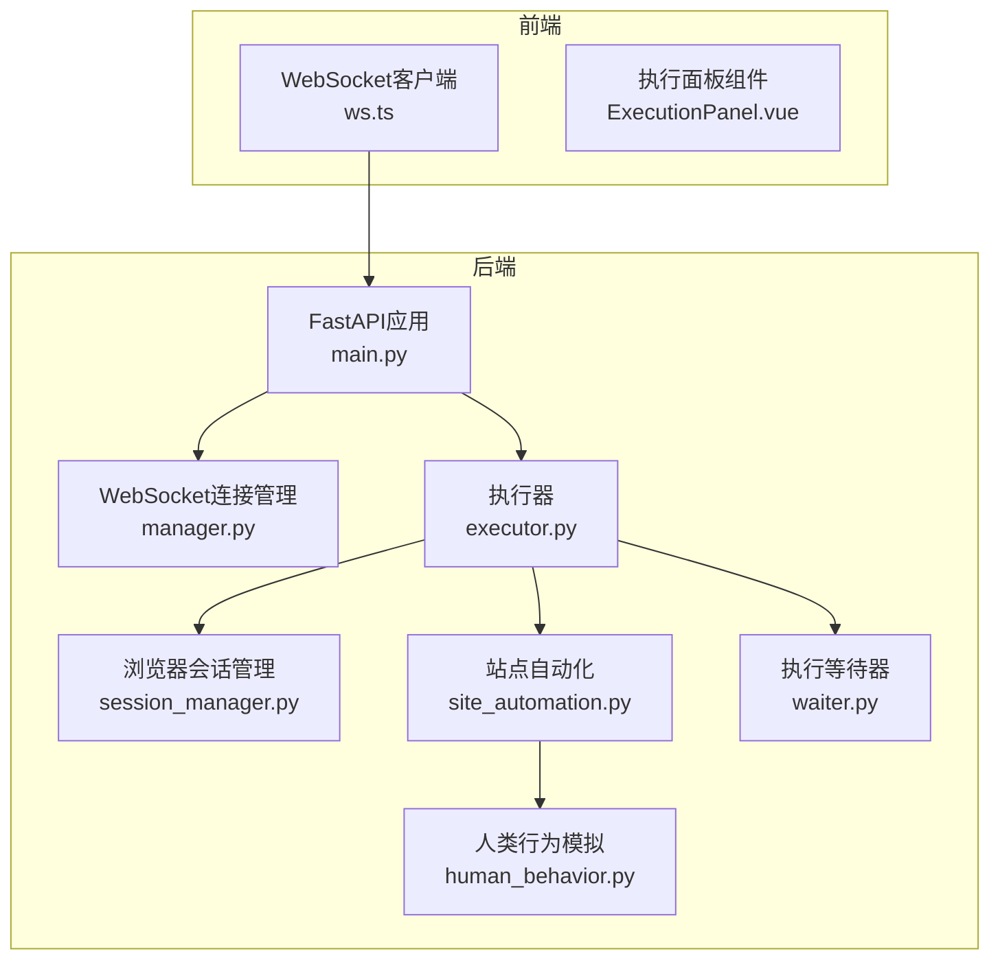
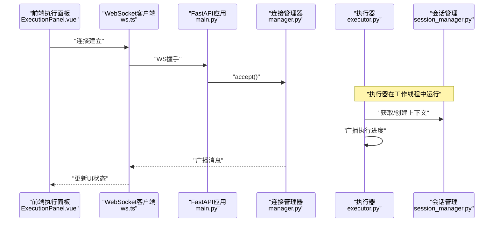
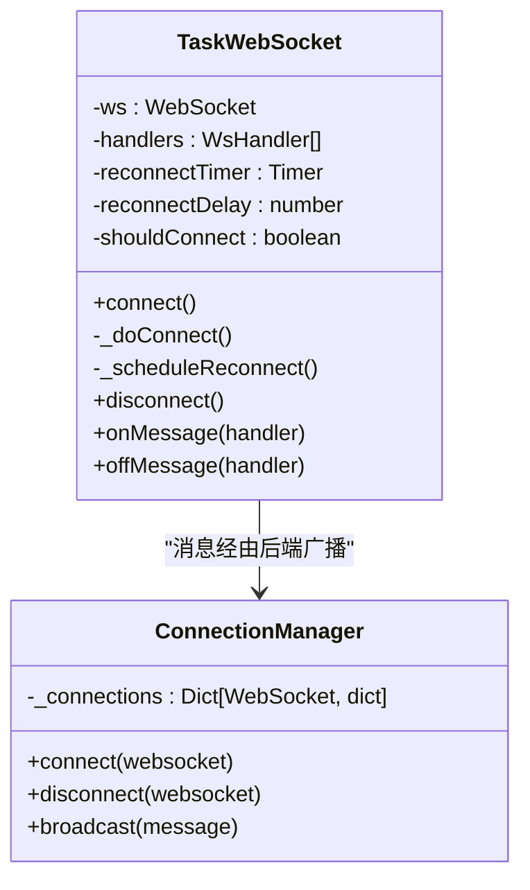
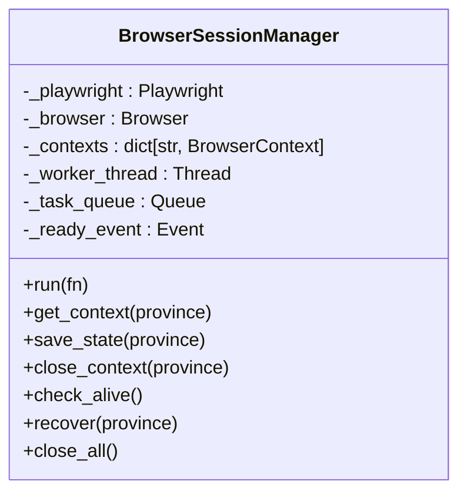
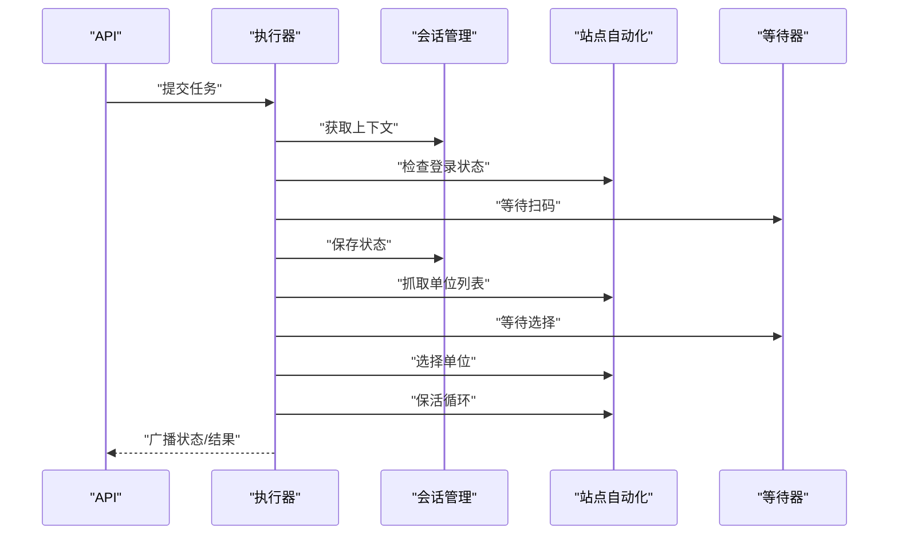
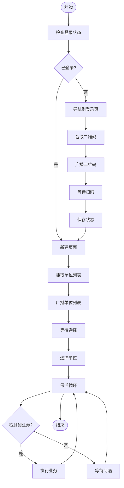
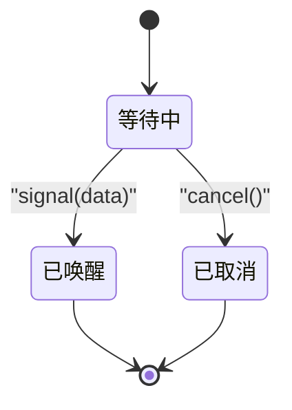
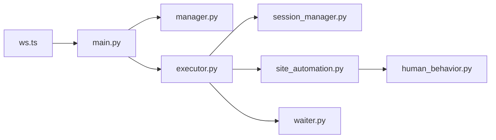

# CDP通信核心

<cite>
**本文档引用的文件**
- [main.py](file://CCC_RPA_API/app/main.py)
- [manager.py](file://CCC_RPA_API/app/ws/manager.py)
- [ws.ts](file://CCC-BrowserV4/frontend/src/api/ws.ts)
- [session_manager.py](file://CCC_RPA_API/app/browser/session_manager.py)
- [executor.py](file://CCC_RPA_API/app/services/executor.py)
- [site_automation.py](file://CCC_RPA_API/app/browser/site_automation.py)
- [human_behavior.py](file://CCC_RPA_API/app/browser/human_behavior.py)
- [waiter.py](file://CCC_RPA_API/app/browser/waiter.py)
- [ExecutionPanel.vue](file://CCC-BrowserV4/frontend/src/components/ExecutionPanel.vue)
</cite>

## 目录
1. [简介](#简介)
2. [项目结构](#项目结构)
3. [核心组件](#核心组件)
4. [架构总览](#架构总览)
5. [详细组件分析](#详细组件分析)
6. [依赖关系分析](#依赖关系分析)
7. [性能考虑](#性能考虑)
8. [故障排查指南](#故障排查指南)
9. [结论](#结论)
10. [附录](#附录)

## 简介
本文件面向CDP通信核心模块，系统性阐述基于Playwright Core的轻量化封装、CDP长连接通信与底层指令封装的技术实现。文档覆盖页面操作指令、网络拦截、JS注入与截图录屏的CDP协议封装思路，以及连接管理、异常处理、性能优化与调试支持机制，并提供CDP指令清单、通信协议规范与开发示例路径，帮助开发者理解底层通信机制并进行扩展开发。

## 项目结构
本项目采用前后端分离架构：
- 后端（FastAPI）：提供REST API与WebSocket服务，承载浏览器会话管理与自动化执行引擎
- 前端（Vue + TypeScript）：提供执行面板与WebSocket客户端，实时接收后端广播消息

**图表来源**
- [main.py:12-127](file://CCC_RPA_API/app/main.py#L12-L127)
- [manager.py:1-29](file://CCC_RPA_API/app/ws/manager.py#L1-L29)
- [ws.ts:1-88](file://CCC-BrowserV4/frontend/src/api/ws.ts#L1-L88)
- [executor.py:1-319](file://CCC_RPA_API/app/services/executor.py#L1-L319)
- [session_manager.py:1-186](file://CCC_RPA_API/app/browser/session_manager.py#L1-L186)
- [site_automation.py:1-743](file://CCC_RPA_API/app/browser/site_automation.py#L1-L743)
- [human_behavior.py:1-86](file://CCC_RPA_API/app/browser/human_behavior.py#L1-L86)
- [waiter.py:1-84](file://CCC_RPA_API/app/browser/waiter.py#L1-L84)

**章节来源**
- [main.py:12-127](file://CCC_RPA_API/app/main.py#L12-L127)
- [ws.ts:1-88](file://CCC-BrowserV4/frontend/src/api/ws.ts#L1-L88)
- [manager.py:1-29](file://CCC_RPA_API/app/ws/manager.py#L1-L29)

## 核心组件
- WebSocket通信层：前端WebSocket客户端与后端连接管理器，负责消息收发与广播
- 浏览器会话管理层：Playwright工作线程、上下文生命周期管理、状态持久化
- 执行引擎：任务调度、步骤编排、异常恢复与进度广播
- 自动化操作层：站点特定页面操作、JS注入、截图录屏与人类行为模拟
- 等待器：跨线程信号与取消机制，支撑保活循环与用户交互

**章节来源**
- [session_manager.py:10-186](file://CCC_RPA_API/app/browser/session_manager.py#L10-L186)
- [executor.py:22-319](file://CCC_RPA_API/app/services/executor.py#L22-L319)
- [site_automation.py:16-743](file://CCC_RPA_API/app/browser/site_automation.py#L16-L743)
- [waiter.py:7-84](file://CCC_RPA_API/app/browser/waiter.py#L7-L84)

## 架构总览
CDP通信核心以“后端线程隔离 + 前后端长连接”为核心设计：
- 后端通过专用工作线程运行Playwright，避免与异步事件循环冲突
- 前端通过WebSocket与后端建立长连接，实时接收执行进度、二维码、错误等消息
- 执行器在工作线程中封装Playwright页面操作，统一对外广播状态

**图表来源**
- [main.py:119-127](file://CCC_RPA_API/app/main.py#L119-L127)
- [manager.py:10-28](file://CCC_RPA_API/app/ws/manager.py#L10-L28)
- [ws.ts:20-84](file://CCC-BrowserV4/frontend/src/api/ws.ts#L20-L84)
- [executor.py:22-33](file://CCC_RPA_API/app/services/executor.py#L22-L33)
- [session_manager.py:79-96](file://CCC_RPA_API/app/browser/session_manager.py#L79-L96)

## 详细组件分析

### 组件A：WebSocket通信与连接管理
- 前端WebSocket客户端提供自动重连、消息解析与处理器注册
- 后端连接管理器维护活跃连接集合，支持广播与断连清理
- 主事件循环引用确保工作线程安全广播

**图表来源**
- [ws.ts:8-88](file://CCC-BrowserV4/frontend/src/api/ws.ts#L8-L88)
- [manager.py:5-29](file://CCC_RPA_API/app/ws/manager.py#L5-L29)

**章节来源**
- [ws.ts:20-84](file://CCC-BrowserV4/frontend/src/api/ws.ts#L20-L84)
- [manager.py:10-28](file://CCC_RPA_API/app/ws/manager.py#L10-L28)
- [main.py:30-35](file://CCC_RPA_API/app/main.py#L30-L35)

### 组件B：浏览器会话管理与Playwright封装
- 专用工作线程启动Chromium实例，避免与异步事件循环冲突
- 上下文按省份隔离，支持storage_state持久化与恢复
- 提供线程安全的任务队列与结果回传，内置超时与异常透传

**图表来源**
- [session_manager.py:10-186](file://CCC_RPA_API/app/browser/session_manager.py#L10-L186)

**章节来源**
- [session_manager.py:30-96](file://CCC_RPA_API/app/browser/session_manager.py#L30-L96)
- [session_manager.py:98-126](file://CCC_RPA_API/app/browser/session_manager.py#L98-L126)
- [session_manager.py:128-186](file://CCC_RPA_API/app/browser/session_manager.py#L128-L186)

### 组件C：执行器与任务编排
- 在工作线程中执行Playwright操作，统一广播执行进度与错误
- 支持扫码登录、单位选择、保活循环与业务触发
- 内置浏览器存活检查与自动恢复机制

**图表来源**
- [executor.py:78-315](file://CCC_RPA_API/app/services/executor.py#L78-L315)
- [site_automation.py:38-540](file://CCC_RPA_API/app/browser/site_automation.py#L38-L540)
- [waiter.py:14-84](file://CCC_RPA_API/app/browser/waiter.py#L14-L84)

**章节来源**
- [executor.py:22-33](file://CCC_RPA_API/app/services/executor.py#L22-L33)
- [executor.py:42-69](file://CCC_RPA_API/app/services/executor.py#L42-L69)
- [executor.py:119-151](file://CCC_RPA_API/app/services/executor.py#L119-L151)
- [executor.py:157-181](file://CCC_RPA_API/app/services/executor.py#L157-L181)
- [executor.py:196-267](file://CCC_RPA_API/app/services/executor.py#L196-L267)

### 组件D：站点自动化与人类行为模拟
- 提供登录状态检查、二维码截取、单位列表抓取、单位选择、保活与业务检测
- 人类行为模拟类提供随机延迟、滚动、点击与输入，降低检测风险

**图表来源**
- [site_automation.py:38-540](file://CCC_RPA_API/app/browser/site_automation.py#L38-L540)
- [human_behavior.py:12-86](file://CCC_RPA_API/app/browser/human_behavior.py#L12-L86)

**章节来源**
- [site_automation.py:148-173](file://CCC_RPA_API/app/browser/site_automation.py#L148-L173)
- [site_automation.py:194-291](file://CCC_RPA_API/app/browser/site_automation.py#L194-L291)
- [site_automation.py:294-540](file://CCC_RPA_API/app/browser/site_automation.py#L294-L540)
- [human_behavior.py:15-86](file://CCC_RPA_API/app/browser/human_behavior.py#L15-L86)

### 组件E：等待器与取消机制
- 基于threading.Event实现阻塞等待、信号唤醒与取消
- 支持非阻塞检查，便于保活循环快速轮询

**图表来源**
- [waiter.py:7-84](file://CCC_RPA_API/app/browser/waiter.py#L7-L84)

**章节来源**
- [waiter.py:14-84](file://CCC_RPA_API/app/browser/waiter.py#L14-L84)

## 依赖关系分析
- 后端模块耦合度低：WebSocket管理器与执行器解耦，执行器通过会话管理器间接依赖Playwright
- 前后端通过消息契约解耦：前端仅依赖消息类型与数据结构
- 线程安全：工作线程与主线程通过队列与事件进行通信

**图表来源**
- [main.py:12-127](file://CCC_RPA_API/app/main.py#L12-L127)
- [ws.ts:1-88](file://CCC-BrowserV4/frontend/src/api/ws.ts#L1-L88)
- [manager.py:1-29](file://CCC_RPA_API/app/ws/manager.py#L1-L29)
- [executor.py:1-319](file://CCC_RPA_API/app/services/executor.py#L1-L319)
- [session_manager.py:1-186](file://CCC_RPA_API/app/browser/session_manager.py#L1-L186)
- [site_automation.py:1-743](file://CCC_RPA_API/app/browser/site_automation.py#L1-L743)
- [human_behavior.py:1-86](file://CCC_RPA_API/app/browser/human_behavior.py#L1-L86)
- [waiter.py:1-84](file://CCC_RPA_API/app/browser/waiter.py#L1-L84)

**章节来源**
- [main.py:12-127](file://CCC_RPA_API/app/main.py#L12-L127)
- [executor.py:1-319](file://CCC_RPA_API/app/services/executor.py#L1-L319)

## 性能考虑
- 线程隔离：专用工作线程避免阻塞异步事件循环，提升并发稳定性
- 任务队列：批处理Playwright操作，减少线程切换开销
- 保活策略：轻量级滚动、鼠标移动与键盘Tab，降低页面负载
- 截图与日志：仅在必要节点生成截图，避免频繁IO
- 超时控制：各环节设置合理超时，防止资源泄漏

[本节为通用性能建议，无需具体文件引用]

## 故障排查指南
- 连接问题
  - 前端：检查WebSocket地址协议与主机名拼装，确认自动重连逻辑
  - 后端：验证CORS配置与WS端点，关注广播异常与断连清理
- 执行异常
  - 检查浏览器存活状态与自动恢复流程
  - 关注执行器超时与异常广播，定位具体步骤
- 截图调试
  - 确认截图路径权限与文件存在性
  - 检查页面加载状态后再截图

**章节来源**
- [ws.ts:15-64](file://CCC-BrowserV4/frontend/src/api/ws.ts#L15-L64)
- [manager.py:17-26](file://CCC_RPA_API/app/ws/manager.py#L17-L26)
- [executor.py:42-69](file://CCC_RPA_API/app/services/executor.py#L42-L69)
- [site_automation.py:148-173](file://CCC_RPA_API/app/browser/site_automation.py#L148-L173)

## 结论
本CDP通信核心通过“线程隔离 + 长连接 + 任务编排”的架构，实现了稳定可靠的浏览器自动化执行链路。前端通过WebSocket实时反馈执行状态，后端通过专用工作线程与会话管理保障稳定性与可恢复性。站点自动化层提供丰富的页面操作能力，结合人类行为模拟与调试截图，满足复杂业务场景需求。

[本节为总结性内容，无需具体文件引用]

## 附录

### CDP指令封装清单（概念性）
以下为典型CDP指令类别与用途（概念性说明，非具体实现）：
- 页面操作
  - Runtime.evaluate：注入与执行JS脚本
  - Input.dispatchMouseEvent/Input.dispatchKeyEvent：模拟鼠标与键盘事件
  - Page.navigate/Page.reload：页面导航与刷新
- 网络拦截
  - Network.enable：启用网络域
  - Network.setRequestInterception：设置请求拦截规则
  - Network.continueInterceptedRequest：放行或修改请求
- 截图录屏
  - Page.captureScreenshot：页面截图
  - Page.startScreencast：录屏流
  - Page.stopScreencast：停止录屏
- 会话管理
  - Target.createTarget/attachToTarget：创建与附加目标
  - Browser.close：关闭浏览器实例

[本节为概念性说明，无需具体文件引用]

### 通信协议规范（概念性）
- 消息格式
  - 类型：字符串，如"execution_progress"、"qr_code"、"execution_error"
  - 数据：JSON对象，包含taskId、step、message、companies等字段
- 广播策略
  - 后端在工作线程中通过主事件循环安全广播
  - 前端订阅消息并更新UI状态
- 错误处理
  - 执行器捕获异常并广播错误消息
  - 前端展示错误提示并允许用户取消

[本节为概念性说明，无需具体文件引用]

### 开发示例（路径指引）
- 前端WebSocket客户端
  - [ws.ts:20-84](file://CCC-BrowserV4/frontend/src/api/ws.ts#L20-L84)
- 后端WebSocket连接管理
  - [manager.py:10-28](file://CCC_RPA_API/app/ws/manager.py#L10-L28)
- 任务执行与进度广播
  - [executor.py:22-33](file://CCC_RPA_API/app/services/executor.py#L22-L33)
  - [executor.py:100-103](file://CCC_RPA_API/app/services/executor.py#L100-L103)
- 浏览器会话管理
  - [session_manager.py:79-96](file://CCC_RPA_API/app/browser/session_manager.py#L79-L96)
  - [session_manager.py:98-126](file://CCC_RPA_API/app/browser/session_manager.py#L98-L126)
- 站点自动化操作
  - [site_automation.py:38-540](file://CCC_RPA_API/app/browser/site_automation.py#L38-L540)
- 人类行为模拟
  - [human_behavior.py:15-86](file://CCC_RPA_API/app/browser/human_behavior.py#L15-L86)
- 等待器与取消
  - [waiter.py:14-84](file://CCC_RPA_API/app/browser/waiter.py#L14-L84)

**章节来源**
- [ws.ts:20-84](file://CCC-BrowserV4/frontend/src/api/ws.ts#L20-L84)
- [manager.py:10-28](file://CCC_RPA_API/app/ws/manager.py#L10-L28)
- [executor.py:22-33](file://CCC_RPA_API/app/services/executor.py#L22-L33)
- [session_manager.py:79-126](file://CCC_RPA_API/app/browser/session_manager.py#L79-L126)
- [site_automation.py:38-540](file://CCC_RPA_API/app/browser/site_automation.py#L38-L540)
- [human_behavior.py:15-86](file://CCC_RPA_API/app/browser/human_behavior.py#L15-L86)
- [waiter.py:14-84](file://CCC_RPA_API/app/browser/waiter.py#L14-L84)