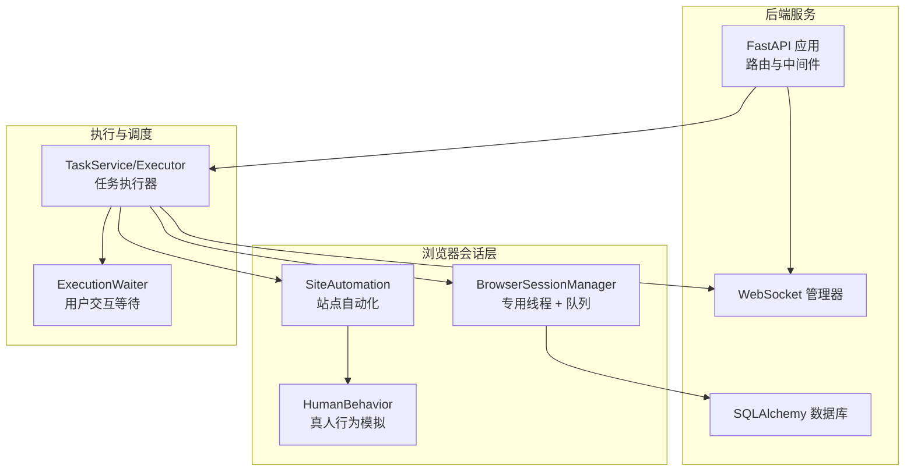
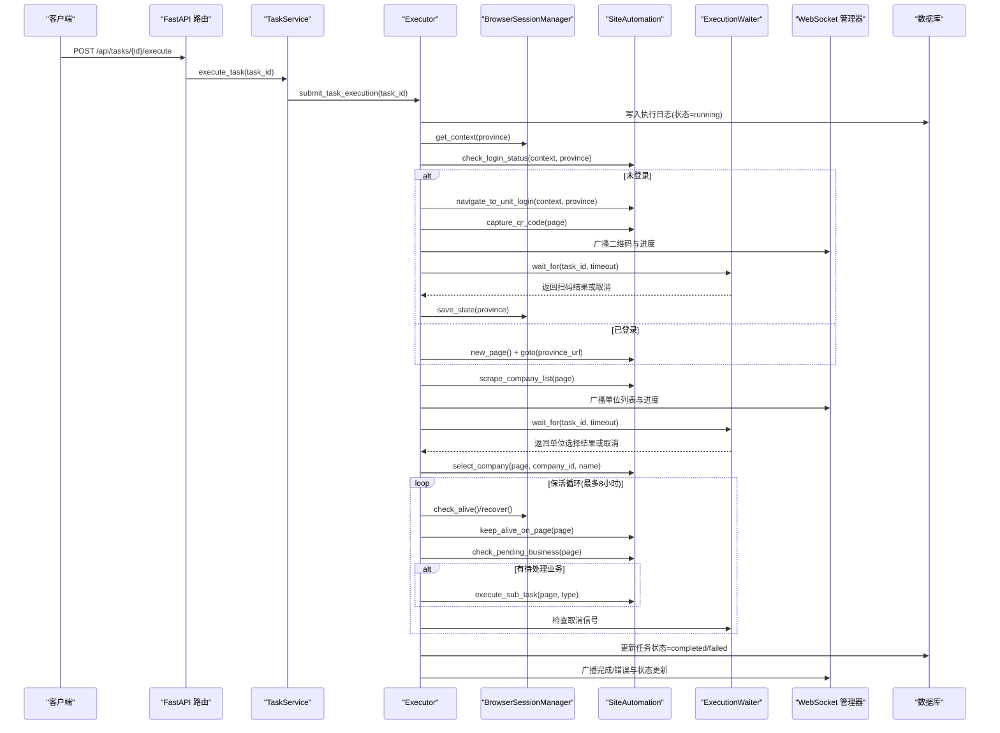
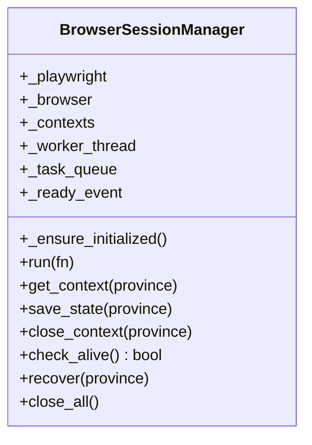
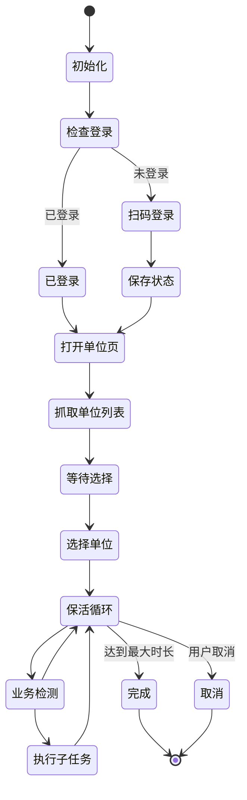
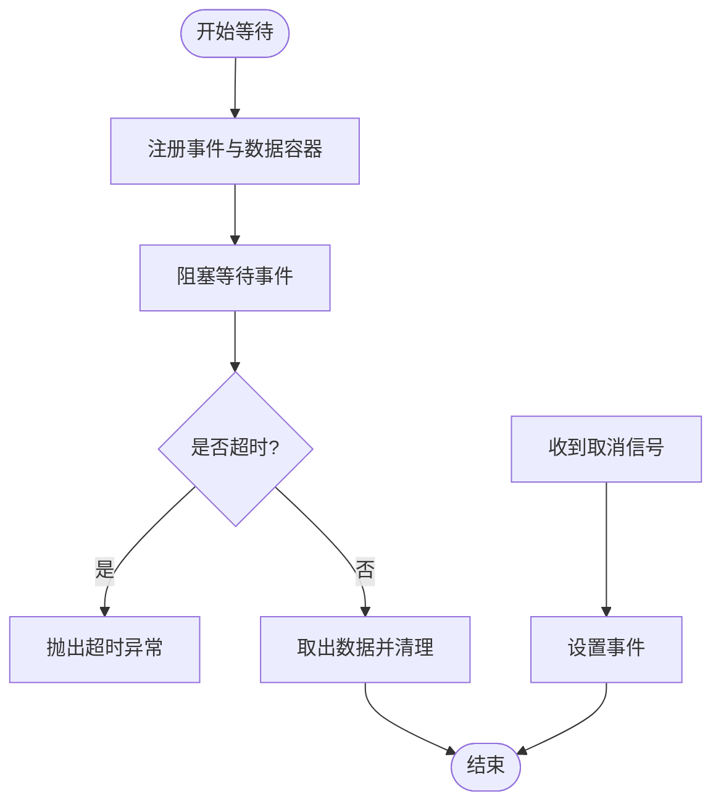
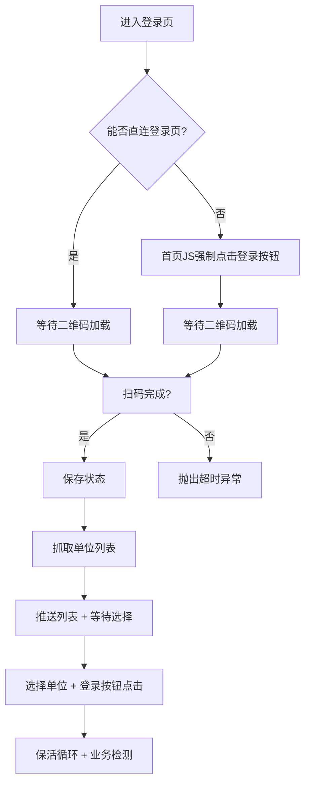
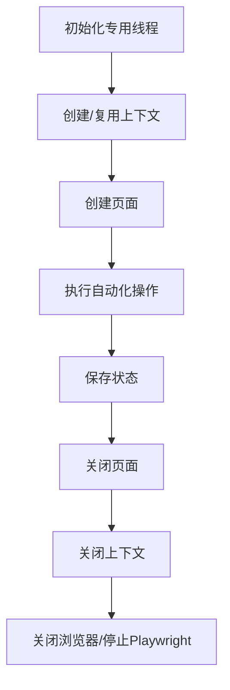
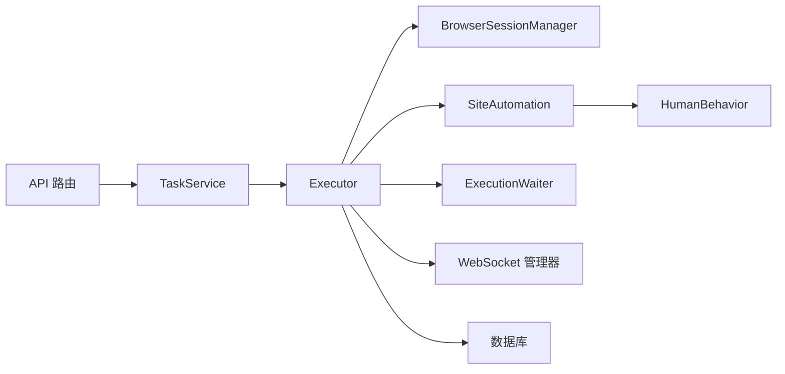
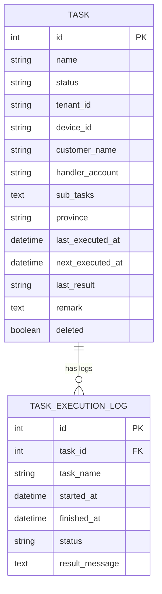

# 会话调度与生命周期

<cite>
**本文引用的文件**
- [session_manager.py](file://CCC_RPA_API/app/browser/session_manager.py)
- [waiter.py](file://CCC_RPA_API/app/browser/waiter.py)
- [executor.py](file://CCC_RPA_API/app/services/executor.py)
- [site_automation.py](file://CCC_RPA_API/app/browser/site_automation.py)
- [human_behavior.py](file://CCC_RPA_API/app/browser/human_behavior.py)
- [tasks.py](file://CCC_RPA_API/app/api/tasks.py)
- [task.py](file://CCC_RPA_API/app/services/task.py)
- [execution_log.py](file://CCC_RPA_API/app/models/execution_log.py)
- [manager.py](file://CCC_RPA_API/app/ws/manager.py)
- [main.py](file://CCC_RPA_API/app/main.py)
- [config.py](file://CCC_RPA_API/app/config.py)
- [task.py](file://CCC_RPA_API/app/models/task.py)
</cite>

## 目录
1. [简介](#简介)
2. [项目结构](#项目结构)
3. [核心组件](#核心组件)
4. [架构总览](#架构总览)
5. [详细组件分析](#详细组件分析)
6. [依赖分析](#依赖分析)
7. [性能考虑](#性能考虑)
8. [故障排查指南](#故障排查指南)
9. [结论](#结论)
10. [附录](#附录)

## 简介
本文件围绕“会话调度与生命周期”主题，系统梳理并解释以下方面：
- 全局调度中心：如何在专用工作线程中集中管理 Playwright 浏览器实例与上下文，确保线程安全与稳定性。
- 会话状态机：从初始化、登录校验、单位选择、业务保活到完成/失败的全流程状态流转。
- 资源分配与销毁：浏览器进程、上下文、页面的创建、复用、持久化与回收策略。
- 会话创建前置校验：登录状态检查、页面可达性验证、异常恢复。
- 超时与自愈重试：扫码等待超时、保活循环超时、浏览器崩溃自愈。
- sessionId 分配与 CDP 端口管理：浏览器实例生命周期与连接状态维护。
- 资源监控与异常处理：日志、截图、广播通知与数据库状态更新。
- 状态机图、调度流程图与配置参数说明。

## 项目结构
本项目采用前后端分离与模块化设计：
- 后端服务基于 FastAPI，提供任务管理、执行调度与 WebSocket 广播。
- 自动化逻辑集中在浏览器会话管理与站点自动化模块，通过专用工作线程隔离 Playwright 同步 API。
- 数据层使用 SQLAlchemy，任务与执行日志分别映射到数据库表。

**图表来源**
- [main.py:1-127](file://CCC_RPA_API/app/main.py#L1-L127)
- [executor.py:1-319](file://CCC_RPA_API/app/services/executor.py#L1-L319)
- [session_manager.py:1-186](file://CCC_RPA_API/app/browser/session_manager.py#L1-L186)
- [site_automation.py:1-743](file://CCC_RPA_API/app/browser/site_automation.py#L1-L743)
- [human_behavior.py:1-86](file://CCC_RPA_API/app/browser/human_behavior.py#L1-L86)
- [manager.py:1-29](file://CCC_RPA_API/app/ws/manager.py#L1-L29)

**章节来源**
- [main.py:1-127](file://CCC_RPA_API/app/main.py#L1-L127)
- [config.py:1-22](file://CCC_RPA_API/app/config.py#L1-L22)

## 核心组件
- 全局调度中心：BrowserSessionManager 提供专用工作线程与任务队列，统一分发 Playwright 操作；支持上下文按省域隔离、状态持久化与崩溃恢复。
- 会话状态机：由执行器驱动，覆盖初始化、登录校验、扫码登录、单位选择、保活循环、业务触发与完成/失败收尾。
- 用户交互等待：ExecutionWaiter 以线程事件实现任务级阻塞等待与取消信号，避免阻塞专用线程。
- 站点自动化：SiteAutomation 封装登录页导航、二维码抓取、单位列表抓取、单位选择、保活与业务检测等。
- 资源监控与广播：执行器在关键节点广播进度、错误与状态更新，同时记录执行日志并更新数据库。

**章节来源**
- [session_manager.py:10-186](file://CCC_RPA_API/app/browser/session_manager.py#L10-L186)
- [executor.py:78-319](file://CCC_RPA_API/app/services/executor.py#L78-L319)
- [waiter.py:7-84](file://CCC_RPA_API/app/browser/waiter.py#L7-L84)
- [site_automation.py:16-743](file://CCC_RPA_API/app/browser/site_automation.py#L16-L743)

## 架构总览
下图展示从 API 触发到浏览器自动化执行的关键交互路径，以及状态广播与数据库更新。

**图表来源**
- [tasks.py:47-76](file://CCC_RPA_API/app/api/tasks.py#L47-L76)
- [task.py:120-133](file://CCC_RPA_API/app/services/task.py#L120-L133)
- [executor.py:78-319](file://CCC_RPA_API/app/services/executor.py#L78-L319)
- [session_manager.py:98-186](file://CCC_RPA_API/app/browser/session_manager.py#L98-L186)
- [site_automation.py:38-743](file://CCC_RPA_API/app/browser/site_automation.py#L38-L743)
- [waiter.py:14-84](file://CCC_RPA_API/app/browser/waiter.py#L14-L84)
- [manager.py:17-27](file://CCC_RPA_API/app/ws/manager.py#L17-L27)

## 详细组件分析

### 组件一：全局调度中心（BrowserSessionManager）
- 专用工作线程与任务队列：所有 Playwright 操作通过队列投递至专用线程，避免与 asyncio 事件循环冲突；支持幂等初始化与就绪事件。
- 上下文管理：按省域隔离存储 storage_state，自动复用与失效重建；支持保存与关闭上下文。
- 崩溃自愈：check_alive 检测连接状态，recover 清理并重启浏览器，重新打开目标页面。
- 生命周期：close_all 统一关闭上下文与浏览器，释放资源。

**图表来源**
- [session_manager.py:10-186](file://CCC_RPA_API/app/browser/session_manager.py#L10-L186)

**章节来源**
- [session_manager.py:30-186](file://CCC_RPA_API/app/browser/session_manager.py#L30-L186)

### 组件二：会话状态机（执行器驱动）
- 状态节点：初始化浏览器、检查登录、扫码登录、保存状态、打开单位页、抓取单位列表、等待用户选择、选择单位、保活循环、业务检测与执行、完成/失败收尾。
- 超时与取消：扫码等待与单位选择等待设置超时；保活循环支持取消信号；最大保活时长为8小时。
- 自愈重试：浏览器异常时自动 recover，重新打开页面并继续执行。

**图表来源**
- [executor.py:78-319](file://CCC_RPA_API/app/services/executor.py#L78-L319)
- [site_automation.py:38-743](file://CCC_RPA_API/app/browser/site_automation.py#L38-L743)

**章节来源**
- [executor.py:78-319](file://CCC_RPA_API/app/services/executor.py#L78-L319)

### 组件三：用户交互等待（ExecutionWaiter）
- 阻塞等待：wait_for 在指定超时时间内阻塞等待用户操作，返回数据或抛出超时异常。
- 唤醒与取消：signal 唤醒等待并传递数据；cancel 发送取消信号；check_signal 支持非阻塞检查。
- 资源清理：cleanup 清理事件与数据，防止内存泄漏。

**图表来源**
- [waiter.py:14-84](file://CCC_RPA_API/app/browser/waiter.py#L14-L84)

**章节来源**
- [waiter.py:7-84](file://CCC_RPA_API/app/browser/waiter.py#L7-L84)

### 组件四：站点自动化（SiteAutomation）
- 登录页导航：优先直连登录页，失败则通过首页 JS 强制点击进入登录页；等待二维码加载。
- 二维码抓取：优先元素截图，失败则整页降级截图并返回 base64。
- 单位列表抓取：多级选择器降级策略，最终通过页面文本提取；失败抛出异常。
- 单位选择：优先按公司名文本匹配，其次 data-id/文本行匹配，最后索引降级；JS 回退策略；点击“登录”按钮完成切换。
- 保活与业务检测：在当前页面执行轻量保活，不触发导航；检测页面徽章与关键词识别待处理业务。

**图表来源**
- [site_automation.py:61-541](file://CCC_RPA_API/app/browser/site_automation.py#L61-L541)

**章节来源**
- [site_automation.py:16-743](file://CCC_RPA_API/app/browser/site_automation.py#L16-L743)

### 组件五：资源分配与销毁流程
- 分配：get_context 按省域创建或复用上下文；new_page 创建页面；二维码截图临时文件保存。
- 持久化：save_state 将 storage_state 写入 data/browser_states/{province}_state.json。
- 销毁：close_context 关闭指定上下文；close_all 关闭所有上下文与浏览器；页面 close 释放资源。
- 监控：执行器在关键节点记录日志、截图与广播消息；数据库记录执行日志与任务状态。

**图表来源**
- [session_manager.py:98-186](file://CCC_RPA_API/app/browser/session_manager.py#L98-L186)
- [executor.py:286-319](file://CCC_RPA_API/app/services/executor.py#L286-L319)

**章节来源**
- [session_manager.py:98-186](file://CCC_RPA_API/app/browser/session_manager.py#L98-L186)
- [executor.py:286-319](file://CCC_RPA_API/app/services/executor.py#L286-L319)

### 组件六：sessionId 分配与 CDP 端口管理
- sessionId：系统未显式定义 sessionId 字段；任务 ID 作为业务层标识贯穿执行链路。
- CDP 端口：Playwright 启动 Chromium 时由底层自动分配端口；本项目未暴露或修改 CDP 端口配置。
- 连接状态：check_alive 通过 is_connected 检测浏览器连接；recover 重启浏览器并重建上下文。

**章节来源**
- [session_manager.py:46-52](file://CCC_RPA_API/app/browser/session_manager.py#L46-L52)
- [session_manager.py:147-170](file://CCC_RPA_API/app/browser/session_manager.py#L147-L170)

### 组件七：异常处理与自愈重试
- 超时处理：扫码等待与单位选择等待设置超时；保活循环分段等待以便快速响应取消。
- 自愈重试：浏览器异常时 recover，重新打开页面并继续执行；页面状态检查与截图辅助定位问题。
- 错误广播：执行器捕获异常，更新任务与日志状态，并通过 WebSocket 广播错误消息。

**章节来源**
- [executor.py:133-140](file://CCC_RPA_API/app/services/executor.py#L133-L140)
- [executor.py:218-266](file://CCC_RPA_API/app/services/executor.py#L218-L266)
- [executor.py:286-311](file://CCC_RPA_API/app/services/executor.py#L286-L311)

## 依赖分析
- 组件耦合：
  - Executor 依赖 BrowserSessionManager、SiteAutomation、ExecutionWaiter、WebSocket 管理器与数据库。
  - API 路由依赖 TaskService，TaskService 调度 Executor。
  - SiteAutomation 依赖 HumanBehavior 与 Playwright。
- 外部依赖：
  - Playwright 同步 API 与 Chromium。
  - WebSocket 广播与数据库持久化。
- 循环依赖：未发现循环依赖。

**图表来源**
- [tasks.py:1-76](file://CCC_RPA_API/app/api/tasks.py#L1-L76)
- [task.py:120-133](file://CCC_RPA_API/app/services/task.py#L120-L133)
- [executor.py:1-319](file://CCC_RPA_API/app/services/executor.py#L1-L319)
- [session_manager.py:1-186](file://CCC_RPA_API/app/browser/session_manager.py#L1-L186)
- [site_automation.py:1-743](file://CCC_RPA_API/app/browser/site_automation.py#L1-L743)
- [waiter.py:1-84](file://CCC_RPA_API/app/browser/waiter.py#L1-L84)
- [manager.py:1-29](file://CCC_RPA_API/app/ws/manager.py#L1-L29)

**章节来源**
- [tasks.py:1-76](file://CCC_RPA_API/app/api/tasks.py#L1-L76)
- [task.py:120-133](file://CCC_RPA_API/app/services/task.py#L120-L133)
- [executor.py:1-319](file://CCC_RPA_API/app/services/executor.py#L1-L319)

## 性能考虑
- 线程隔离：专用工作线程避免 Playwright 同步 API 与 asyncio 事件循环竞争，提升稳定性。
- 线程池：执行器与等待器各使用独立线程池，避免阻塞与饥饿。
- 保活策略：在当前页面执行轻量保活，减少导航成本；随机间隔降低检测频率。
- 资源复用：按省域复用上下文与 storage_state，减少重复登录成本。
- I/O 优化：截图与广播异步进行，避免阻塞自动化主流程。

## 故障排查指南
- 浏览器初始化失败：检查专用线程初始化与 ready_event 设置；确认 Chromium 启动参数与权限。
- 登录页无法加载：检查直连登录页与首页 JS 点击策略；确认二维码元素可见性。
- 单位列表抓取失败：检查多级选择器与页面文本提取策略；关注页面结构变化。
- 扫码等待超时：检查前端推送与后端 wait_for 超时时间；确认 WebSocket 连接。
- 保活循环无响应：检查取消信号与分段等待逻辑；确认浏览器连接状态。
- 数据库迁移异常：检查迁移脚本与字段存在性；确保事务正确提交。

**章节来源**
- [session_manager.py:42-77](file://CCC_RPA_API/app/browser/session_manager.py#L42-L77)
- [site_automation.py:61-145](file://CCC_RPA_API/app/browser/site_automation.py#L61-L145)
- [executor.py:133-140](file://CCC_RPA_API/app/services/executor.py#L133-L140)
- [executor.py:218-266](file://CCC_RPA_API/app/services/executor.py#L218-L266)

## 结论
本系统通过专用工作线程与任务队列实现稳定的浏览器会话调度，结合多级降级策略与自愈机制，保障自动化流程的可靠性。执行器驱动的状态机清晰划分各阶段职责，配合 WebSocket 广播与数据库日志，形成完整的可观测性闭环。建议在生产环境中进一步细化超时阈值、增加健康检查与资源上限告警，并对页面选择器进行版本化管理以应对站点结构变化。

## 附录

### 配置参数说明
- 数据库连接：通过环境变量注入，生成 DATABASE_URL。
- 任务表扩展：运行时动态添加列（如 predecessor_id、sub_tasks、province 等）。
- Playwright 启动参数：headless=false、禁用自动化特征、沙箱选项。

**章节来源**
- [config.py:6-22](file://CCC_RPA_API/app/config.py#L6-L22)
- [main.py:40-86](file://CCC_RPA_API/app/main.py#L40-L86)
- [session_manager.py:46-52](file://CCC_RPA_API/app/browser/session_manager.py#L46-L52)

### 关键数据模型
- 任务模型：包含任务基本信息、状态、省域、设备与租户标识等。
- 执行日志模型：记录任务执行起止时间、状态与结果消息。

**图表来源**
- [task.py:8-25](file://CCC_RPA_API/app/models/task.py#L8-L25)
- [execution_log.py:7-17](file://CCC_RPA_API/app/models/execution_log.py#L7-L17)