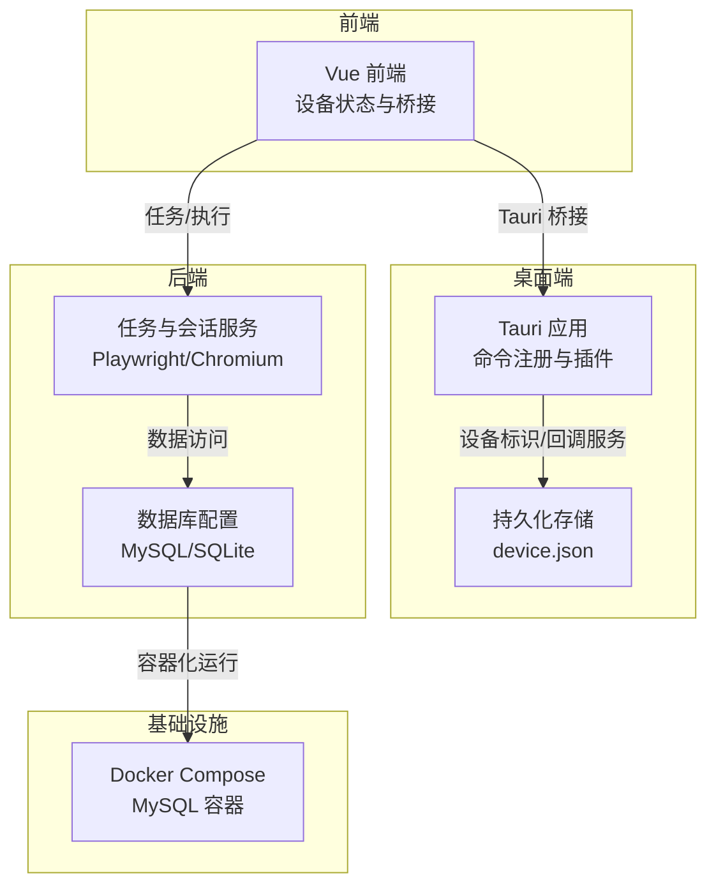
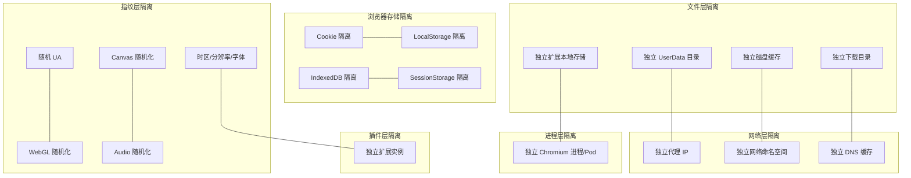
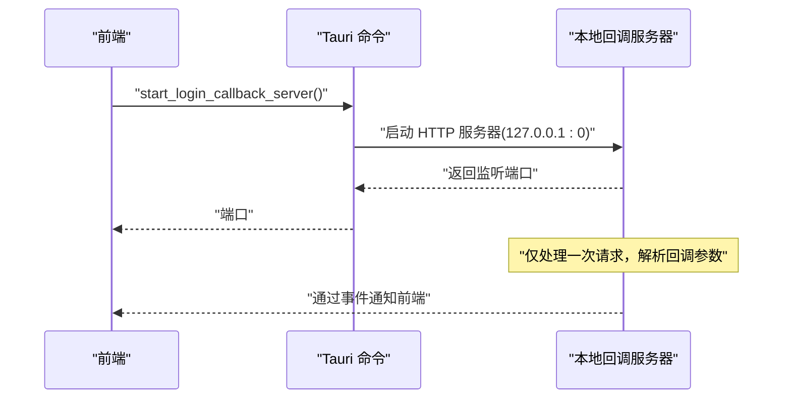
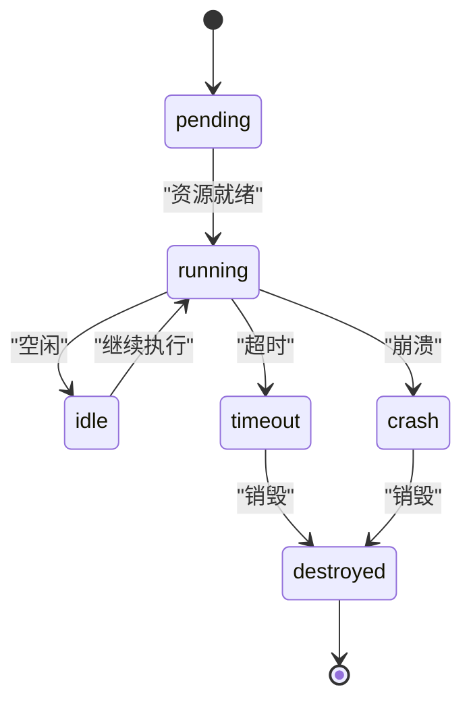
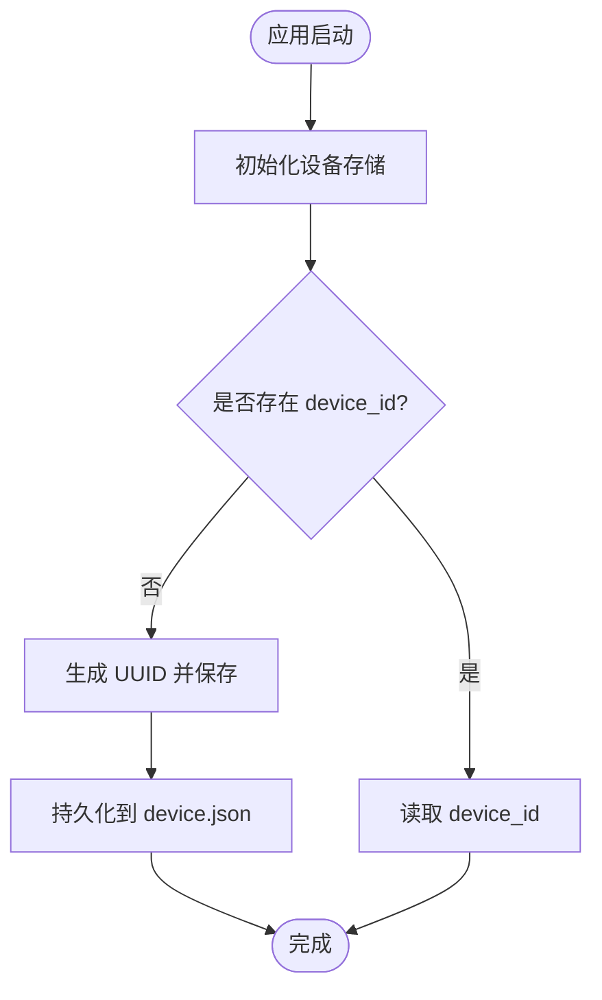
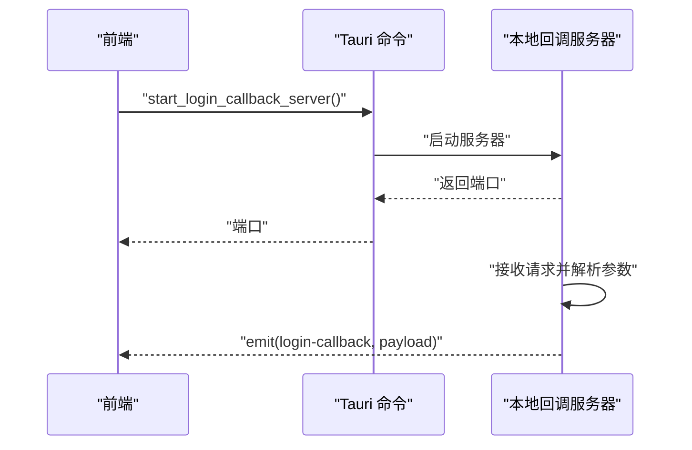
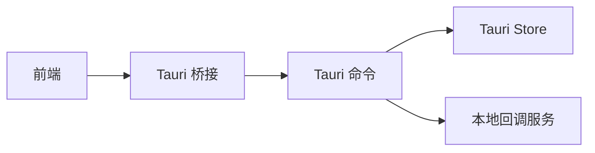

# 多维度强隔离

<cite>
**本文引用的文件**
- [tauri.conf.json](file://CCC-BrowserV4/src-tauri/tauri.conf.json)
- [main.rs](file://CCC-BrowserV4/src-tauri/src/main.rs)
- [device.rs](file://CCC-BrowserV4/src-tauri/src/device.rs)
- [commands.rs](file://CCC-BrowserV4/src-tauri/src/commands.rs)
- [device.ts](file://CCC-BrowserV4/frontend/src/stores/device.ts)
- [tauri-bridge.ts](file://CCC-BrowserV4/frontend/src/utils/tauri-bridge.ts)
- [docker-compose.yml](file://CCC-BrowserV4/docker-compose.yml)
- [config.py](file://CCC-BrowserV4/backend/app/config.py)
- [project.md](file://project.md)
</cite>

## 目录
1. [引言](#引言)
2. [项目结构](#项目结构)
3. [核心组件](#核心组件)
4. [架构总览](#架构总览)
5. [详细组件分析](#详细组件分析)
6. [依赖分析](#依赖分析)
7. [性能考虑](#性能考虑)
8. [故障排查指南](#故障排查指南)
9. [结论](#结论)
10. [附录](#附录)

## 引言
本文件围绕“多维度强隔离”主题，系统梳理并阐释文件层、网络层、进程层、浏览器存储、指纹层与插件层的隔离实现原理与工程落地方式。结合仓库中的 Tauri 客户端、前端桥接、后端配置与容器编排等现有能力，给出可操作的隔离配置示例、安全测试方法与合规性检查要点，帮助开发者快速理解并实施强隔离架构。

## 项目结构
该仓库由三层组成：
- 前端（Vue + Tauri Bridge）：负责用户交互与调用后端命令。
- 桌面端（Tauri）：提供原生能力（如系统存储、外部浏览器打开、本地回调服务）。
- 后端（Python + FastAPI/Playwright）：负责任务编排、会话生命周期与安全策略落地。

图表来源
- [tauri.conf.json:12-27](file://CCC-BrowserV4/src-tauri/tauri.conf.json#L12-L27)
- [main.rs:7-28](file://CCC-BrowserV4/src-tauri/src/main.rs#L7-L28)
- [device.rs:6-20](file://CCC-BrowserV4/src-tauri/src/device.rs#L6-L20)
- [docker-compose.yml:4-17](file://CCC-BrowserV4/docker-compose.yml#L4-L17)
- [config.py:18-47](file://CCC-BrowserV4/backend/app/config.py#L18-L47)

章节来源
- [tauri.conf.json:12-27](file://CCC-BrowserV4/src-tauri/tauri.conf.json#L12-L27)
- [main.rs:7-28](file://CCC-BrowserV4/src-tauri/src/main.rs#L7-L28)
- [docker-compose.yml:4-17](file://CCC-BrowserV4/docker-compose.yml#L4-L17)
- [config.py:18-47](file://CCC-BrowserV4/backend/app/config.py#L18-L47)

## 核心组件
- 设备标识与持久化存储：通过 Tauri Store 在本地持久化设备标识，避免跨会话共享。
- 登录回调与本地服务：启动本地 HTTP 服务器接收登录回调，确保登录流程在受控环境中完成。
- 前端桥接与命令调用：统一通过 Tauri 桥接调用后端命令，保证调用链路可控。
- 安全策略与 CSP：在 Tauri 配置中设置内容安全策略，限制资源加载来源。
- 数据库配置：支持 MySQL 与 SQLite，便于隔离部署与切换。

章节来源
- [device.rs:6-31](file://CCC-BrowserV4/src-tauri/src/device.rs#L6-L31)
- [commands.rs:10-91](file://CCC-BrowserV4/src-tauri/src/commands.rs#L10-L91)
- [tauri-bridge.ts:6-32](file://CCC-BrowserV4/frontend/src/utils/tauri-bridge.ts#L6-L32)
- [tauri.conf.json:24-26](file://CCC-BrowserV4/src-tauri/tauri.conf.json#L24-L26)
- [config.py:18-47](file://CCC-BrowserV4/backend/app/config.py#L18-L47)

## 架构总览
下图展示“多维度强隔离”的整体思路与实现边界：文件层、网络层、进程层、浏览器存储、指纹层、插件层各自独立，且通过严格的配置与运行时控制实现隔离。

图表来源
- [project.md:993-1007](file://project.md#L993-L1007)

## 详细组件分析

### 文件层隔离
- 独立 UserData 目录：每个会话拥有独立的用户数据目录，避免跨会话共享浏览数据。
- 独立磁盘缓存与下载目录：降低指纹泄露与跨会话数据关联风险。
- 独立扩展本地存储：扩展的持久化数据与主浏览器数据分离。
- 生命周期销毁：会话销毁时递归清理 UserData、缓存、下载目录与扩展本地存储，确保无残留。

章节来源
- [project.md:947-948](file://project.md#L947-L948)
- [project.md:997-998](file://project.md#L997-L998)

### 网络层隔离
- 独立代理 IP：每个会话绑定唯一独立代理出站 IP，禁止多会话共享网络出口。
- 独立网络命名空间与 DNS 缓存：进一步隔离网络行为，避免跨会话指纹与流量关联。
- 本地回调服务：登录回调在 127.0.0.1 的随机端口监听，减少外网暴露面。

图表来源
- [commands.rs:44-91](file://CCC-BrowserV4/src-tauri/src/commands.rs#L44-L91)

章节来源
- [project.md:945-946](file://project.md#L945-L946)
- [project.md:999-1000](file://project.md#L999-L1000)
- [commands.rs:44-91](file://CCC-BrowserV4/src-tauri/src/commands.rs#L44-L91)

### 进程层隔离
- 独立 Chromium 进程或 Pod：单会话崩溃不影响集群其他会话。
- 会话生命周期管理：创建、运行、闲置、超时销毁、崩溃销毁等状态机，销毁时回收代理 IP、归还 CDP 端口、删除 UserData。

图表来源
- [project.md:979-991](file://project.md#L979-L991)

章节来源
- [project.md:981-989](file://project.md#L981-L989)
- [project.md:1001](file://project.md#L1001)

### 浏览器存储隔离
- Cookie、LocalStorage、IndexedDB、SessionStorage 完全隔离，避免跨会话识别与数据泄露。
- 会话销毁触发后必须清空上述存储，确保无账号与 Cookie 残留。

章节来源
- [project.md:1003-1004](file://project.md#L1003-L1004)
- [project.md:947](file://project.md#L947)

### 指纹层隔离
- 随机独立 UA、WebGL、Canvas、Audio、时区、分辨率、字体列表等，降低指纹一致性。
- 禁用全局共享磁盘缓存与预连接池，防止跨会话指纹与数据泄露。

章节来源
- [project.md:1005-1006](file://project.md#L1005-L1006)
- [project.md:949](file://project.md#L949)

### 插件层隔离
- 每个会话加载独立 V3 扩展实例，扩展存储互不互通，避免跨会话扩展数据共享。

章节来源
- [project.md:1007](file://project.md#L1007)

### 设备标识与持久化存储
- 使用 Tauri Store 在本地持久化设备标识，首次启动生成 UUID 并写入文件，后续读取复用。
- 前端通过 Pinia store 管理设备与客户端标识，提供初始化与重置能力。

图表来源
- [device.rs:6-20](file://CCC-BrowserV4/src-tauri/src/device.rs#L6-L20)

章节来源
- [device.rs:6-31](file://CCC-BrowserV4/src-tauri/src/device.rs#L6-L31)
- [device.ts:12-30](file://CCC-BrowserV4/frontend/src/stores/device.ts#L12-L30)
- [tauri-bridge.ts:10-20](file://CCC-BrowserV4/frontend/src/utils/tauri-bridge.ts#L10-L20)

### 登录回调与本地服务
- 启动本地 HTTP 服务器监听 127.0.0.1 的随机端口，仅处理一次回调请求。
- 解析回调参数并通过事件通知前端，随后返回成功页面并关闭窗口。

图表来源
- [commands.rs:44-91](file://CCC-BrowserV4/src-tauri/src/commands.rs#L44-L91)

章节来源
- [commands.rs:44-91](file://CCC-BrowserV4/src-tauri/src/commands.rs#L44-L91)

### 安全策略与 CSP
- 在 Tauri 配置中设置 CSP，限制默认、脚本、样式、连接源，仅允许本地回环地址与指定域名，降低 XSS 与不安全资源加载风险。

章节来源
- [tauri.conf.json:24-26](file://CCC-BrowserV4/src-tauri/tauri.conf.json#L24-L26)

### 数据库与容器化
- 支持 MySQL 与 SQLite，便于在不同环境间切换；MySQL 通过 Docker Compose 提供，便于隔离部署。

章节来源
- [config.py:18-47](file://CCC-BrowserV4/backend/app/config.py#L18-L47)
- [docker-compose.yml:4-17](file://CCC-BrowserV4/docker-compose.yml#L4-L17)

## 依赖分析
- 前端依赖 Tauri 桥接进行命令调用，命令由 Tauri 注册并在后台线程处理。
- Tauri Store 作为轻量持久化存储，避免跨会话共享。
- 登录回调服务在独立线程中运行，仅处理一次请求，降低资源占用与安全风险。

图表来源
- [tauri-bridge.ts:6-32](file://CCC-BrowserV4/frontend/src/utils/tauri-bridge.ts#L6-L32)
- [main.rs:12-18](file://CCC-BrowserV4/src-tauri/src/main.rs#L12-L18)
- [device.rs:6-20](file://CCC-BrowserV4/src-tauri/src/device.rs#L6-L20)
- [commands.rs:44-91](file://CCC-BrowserV4/src-tauri/src/commands.rs#L44-L91)

章节来源
- [main.rs:7-28](file://CCC-BrowserV4/src-tauri/src/main.rs#L7-L28)
- [tauri-bridge.ts:6-32](file://CCC-BrowserV4/frontend/src/utils/tauri-bridge.ts#L6-L32)

## 性能考虑
- 独立进程与存储隔离带来额外资源消耗，需按会话并发与代理 IP 数量合理规划硬件资源。
- 本地回调服务仅处理一次请求，建议在会话生命周期内复用端口并及时销毁，避免端口泄漏。
- 禁用全局共享缓存与预连接池可降低指纹一致性，但可能影响页面加载性能，需在安全与性能间权衡。

## 故障排查指南
- 设备标识缺失：检查 Tauri Store 是否成功初始化与保存 device.json。
- 登录回调未到达：确认本地回调服务器已启动并监听正确端口，检查事件发射与前端监听。
- 端口冲突：当本地回调端口为 0 时由系统分配，若多次启动仍冲突，检查是否有残留进程占用。
- 数据库连接失败：核对 MySQL 密码、端口映射与容器状态，确保网络可达。

章节来源
- [device.rs:6-20](file://CCC-BrowserV4/src-tauri/src/device.rs#L6-L20)
- [commands.rs:44-91](file://CCC-BrowserV4/src-tauri/src/commands.rs#L44-L91)
- [docker-compose.yml:8-14](file://CCC-BrowserV4/docker-compose.yml#L8-L14)
- [config.py:21-26](file://CCC-BrowserV4/backend/app/config.py#L21-L26)

## 结论
本项目在文件层、网络层、进程层、浏览器存储、指纹层与插件层均体现了强隔离的设计思想。通过 Tauri Store 实现设备标识持久化、通过本地回调服务保障登录流程可控、通过 CSP 限制资源加载来源，并以项目文档明确的生命周期与销毁策略确保无残留。结合容器化与数据库配置，可在不同环境下稳定落地强隔离方案。

## 附录

### 隔离配置示例（步骤说明）
- 文件层
  - 为每个会话配置独立 UserData 目录与扩展本地存储目录。
  - 在会话销毁时递归删除缓存、下载目录与扩展存储。
- 网络层
  - 为每个会话分配独立代理 IP 并绑定网络命名空间。
  - 仅允许本地回环地址与必要域名访问，拒绝公网直连。
- 进程层
  - 为每个会话启动独立 Chromium 进程或容器实例。
  - 实施会话状态机与超时/崩溃自愈机制。
- 浏览器存储
  - 启用每会话独立 Cookie/LocalStorage/IndexedDB/SessionStorage。
  - 销毁时清空所有存储。
- 指纹层
  - 随机化 UA、WebGL、Canvas、Audio、时区、分辨率与字体列表。
  - 禁用全局共享缓存与预连接池。
- 插件层
  - 每个会话加载独立扩展实例，扩展存储互不互通。

章节来源
- [project.md:945-950](file://project.md#L945-L950)
- [project.md:993-1007](file://project.md#L993-L1007)

### 安全测试方法
- 指纹一致性测试：验证 UA、Canvas、WebGL、Audio 等是否随会话变化。
- 存储隔离测试：在同一主机上同时运行多个会话，验证 Cookie、LocalStorage、IndexedDB 不互通。
- 网络隔离测试：验证各会话的出站 IP 与 DNS 行为是否独立。
- 生命周期测试：模拟超时、崩溃与主动销毁，验证 UserData 与缓存是否被完整清理。

章节来源
- [project.md:979-991](file://project.md#L979-L991)

### 合规性检查清单
- 是否启用 TLS 加密（对外 HTTPS、内部 gRPC TLS、wss）。
- 是否禁用官方 Chrome，改用裁剪后的 Chromium。
- 是否对会话登录快照采用 AES-256-CBC 加密存储。
- 是否实现多维度强隔离并具备销毁即清空的机制。
- 是否禁止调用第三方公有大模型 API，AI 推理本地化部署。

章节来源
- [project.md:939-950](file://project.md#L939-L950)