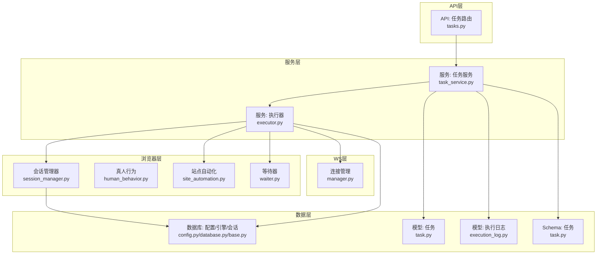
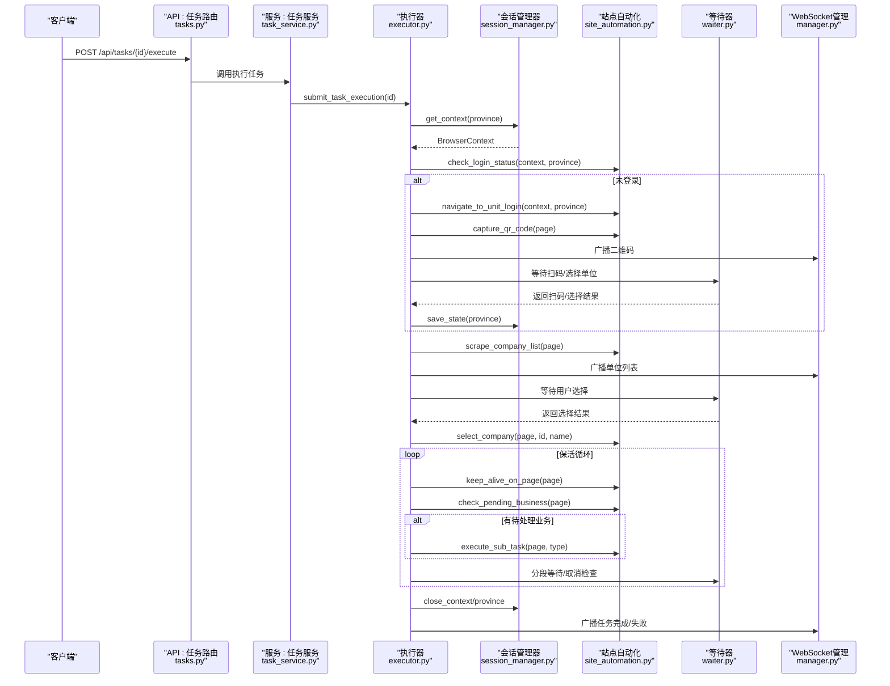
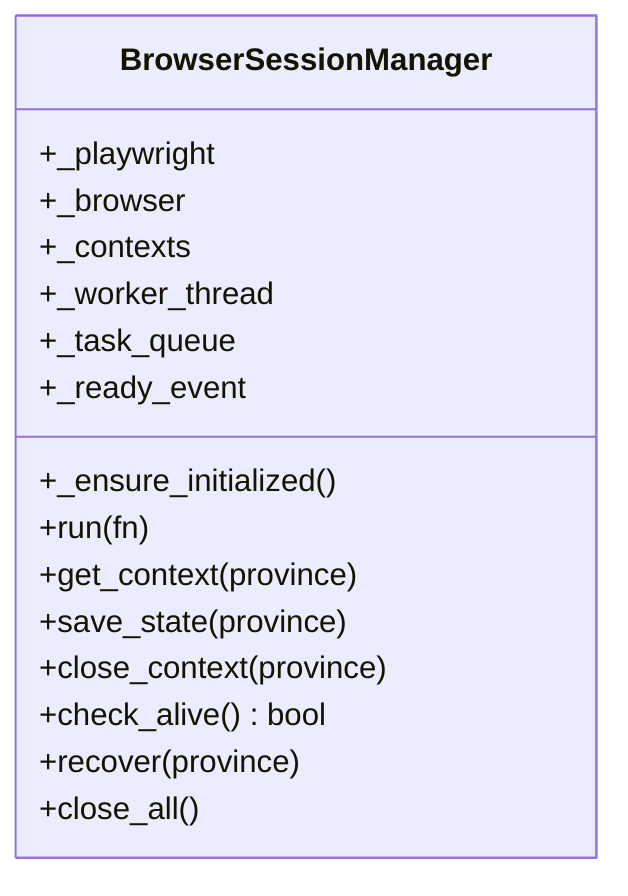
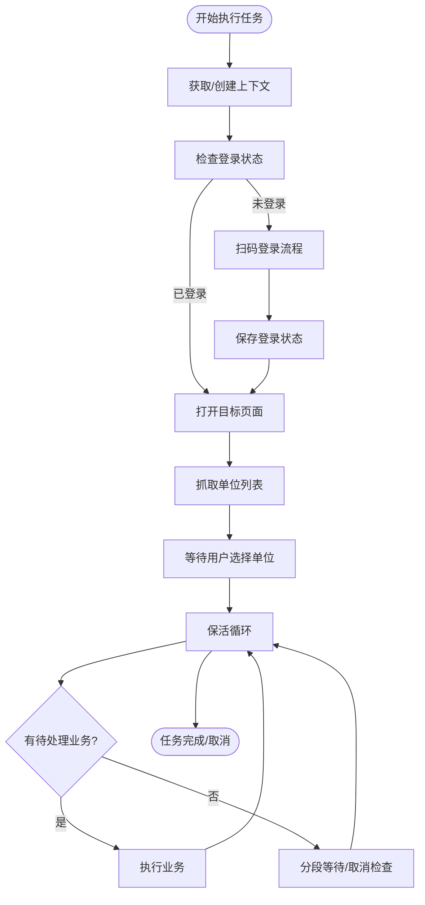
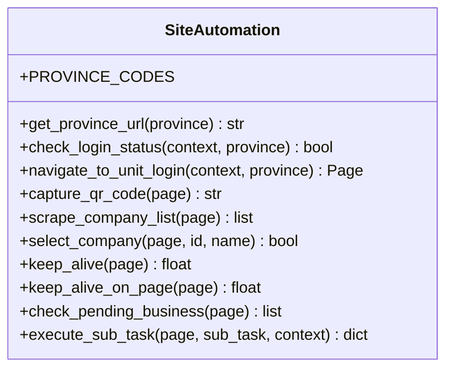

# 层2：Chromium沙箱会话集群层

<cite>
**本文档引用的文件**
- [main.py](file://CCC_RPA_API/app/main.py)
- [session_manager.py](file://CCC_RPA_API/app/browser/session_manager.py)
- [human_behavior.py](file://CCC_RPA_API/app/browser/human_behavior.py)
- [site_automation.py](file://CCC_RPA_API/app/browser/site_automation.py)
- [executor.py](file://CCC_RPA_API/app/services/executor.py)
- [waiter.py](file://CCC_RPA_API/app/browser/waiter.py)
- [manager.py](file://CCC_RPA_API/app/ws/manager.py)
- [task.py](file://CCC_RPA_API/app/models/task.py)
- [execution_log.py](file://CCC_RPA_API/app/models/execution_log.py)
- [tasks.py](file://CCC_RPA_API/app/api/tasks.py)
- [config.py](file://CCC_RPA_API/app/config.py)
- [database.py](file://CCC_RPA_API/app/database.py)
- [base.py](file://CCC_RPA_API/app/models/base.py)
- [task.py](file://CCC_RPA_API/app/schemas/task.py)
- [task_service.py](file://CCC_RPA_API/app/services/task.py)
</cite>

## 目录
1. [简介](#简介)
2. [项目结构](#项目结构)
3. [核心组件](#核心组件)
4. [架构总览](#架构总览)
5. [详细组件分析](#详细组件分析)
6. [依赖关系分析](#依赖关系分析)
7. [性能考量](#性能考量)
8. [故障排查指南](#故障排查指南)
9. [结论](#结论)
10. [附录](#附录)

## 简介
本层聚焦于“Chromium沙箱会话集群层”，围绕以下目标展开：  
- 单会话Pod/进程实例与独立UserData：以省份维度隔离的Playwright浏览器上下文，持久化storage_state，确保会话独立与可恢复。  
- CDP通信与指纹伪装：通过Chromium启动参数与运行时脚本隐藏自动化特征，降低被识别风险。  
- 代理绑定与会话调度：通过会话管理器集中调度，结合任务服务与等待器实现用户交互与业务触发。  
- 生命周期管理与状态机：从初始化、登录校验、业务执行到保活与收尾，形成闭环状态机。  
- 资源硬限制与故障自愈：线程池并发控制、超时与重试、浏览器崩溃自动恢复。  
- K8s容器编排、Linux Namespace/Cgroup隔离、EmptyDir存储与HPA弹性扩缩容：提供运维层面的隔离与弹性能力建议。  
- 性能监控指标：基于日志与数据库埋点，输出可观测性指标。

## 项目结构
后端采用FastAPI + SQLAlchemy + Playwright架构，核心目录如下：
- API层：REST接口定义与路由
- 服务层：任务执行、会话调度与业务编排
- 浏览器层：会话管理、真人行为模拟、站点自动化
- WS层：WebSocket连接管理与广播
- 数据模型与Schema：ORM模型与请求/响应结构
- 配置与数据库：环境变量、数据库连接与会话工厂

**图表来源**
- [tasks.py:1-76](file://CCC_RPA_API/app/api/tasks.py#L1-L76)
- [task_service.py:1-157](file://CCC_RPA_API/app/services/task.py#L1-L157)
- [executor.py:1-319](file://CCC_RPA_API/app/services/executor.py#L1-L319)
- [session_manager.py:1-186](file://CCC_RPA_API/app/browser/session_manager.py#L1-L186)
- [site_automation.py:1-743](file://CCC_RPA_API/app/browser/site_automation.py#L1-L743)
- [human_behavior.py:1-86](file://CCC_RPA_API/app/browser/human_behavior.py#L1-L86)
- [waiter.py:1-84](file://CCC_RPA_API/app/browser/waiter.py#L1-L84)
- [manager.py:1-29](file://CCC_RPA_API/app/ws/manager.py#L1-L29)
- [task.py:1-25](file://CCC_RPA_API/app/models/task.py#L1-L25)
- [execution_log.py:1-17](file://CCC_RPA_API/app/models/execution_log.py#L1-L17)
- [config.py:1-22](file://CCC_RPA_API/app/config.py#L1-L22)
- [database.py:1-19](file://CCC_RPA_API/app/database.py#L1-L19)
- [base.py:1-11](file://CCC_RPA_API/app/models/base.py#L1-L11)

**章节来源**
- [main.py:1-127](file://CCC_RPA_API/app/main.py#L1-L127)
- [tasks.py:1-76](file://CCC_RPA_API/app/api/tasks.py#L1-L76)
- [task_service.py:1-157](file://CCC_RPA_API/app/services/task.py#L1-L157)
- [executor.py:1-319](file://CCC_RPA_API/app/services/executor.py#L1-L319)
- [session_manager.py:1-186](file://CCC_RPA_API/app/browser/session_manager.py#L1-L186)
- [site_automation.py:1-743](file://CCC_RPA_API/app/browser/site_automation.py#L1-L743)
- [human_behavior.py:1-86](file://CCC_RPA_API/app/browser/human_behavior.py#L1-L86)
- [waiter.py:1-84](file://CCC_RPA_API/app/browser/waiter.py#L1-L84)
- [manager.py:1-29](file://CCC_RPA_API/app/ws/manager.py#L1-L29)
- [task.py:1-25](file://CCC_RPA_API/app/models/task.py#L1-L25)
- [execution_log.py:1-17](file://CCC_RPA_API/app/models/execution_log.py#L1-L17)
- [config.py:1-22](file://CCC_RPA_API/app/config.py#L1-L22)
- [database.py:1-19](file://CCC_RPA_API/app/database.py#L1-L19)
- [base.py:1-11](file://CCC_RPA_API/app/models/base.py#L1-L11)

## 核心组件
- 会话管理器（BrowserSessionManager）：负责Playwright工作线程的启动与复用、按省份隔离的浏览器上下文创建与持久化、状态恢复与全局关闭。  
- 执行器（Executor）：任务执行编排，包含登录态检查、扫码登录、单位选择、业务保活与收尾，集成WebSocket广播与等待器。  
- 站点自动化（SiteAutomation）：针对特定站点的页面导航、元素定位、业务执行与保活策略。  
- 真人行为（HumanBehavior）：模拟点击、输入、滚动与等待，降低被风控识别概率。  
- 等待器（ExecutionWaiter）：基于Event的阻塞/非阻塞等待与取消机制，支撑用户交互与业务触发。  
- WebSocket管理（ConnectionManager）：连接维护与消息广播，用于前端实时反馈。  
- 数据模型与服务：任务、执行日志、API路由与服务逻辑。

**章节来源**
- [session_manager.py:10-186](file://CCC_RPA_API/app/browser/session_manager.py#L10-L186)
- [executor.py:1-319](file://CCC_RPA_API/app/services/executor.py#L1-L319)
- [site_automation.py:16-743](file://CCC_RPA_API/app/browser/site_automation.py#L16-L743)
- [human_behavior.py:12-86](file://CCC_RPA_API/app/browser/human_behavior.py#L12-L86)
- [waiter.py:7-84](file://CCC_RPA_API/app/browser/waiter.py#L7-L84)
- [manager.py:5-29](file://CCC_RPA_API/app/ws/manager.py#L5-L29)
- [task.py:8-25](file://CCC_RPA_API/app/models/task.py#L8-L25)
- [execution_log.py:7-17](file://CCC_RPA_API/app/models/execution_log.py#L7-L17)
- [tasks.py:1-76](file://CCC_RPA_API/app/api/tasks.py#L1-L76)
- [task_service.py:44-157](file://CCC_RPA_API/app/services/task.py#L44-L157)

## 架构总览
下图展示从API到执行器、会话管理器与站点自动化的整体调用链路与数据流。

**图表来源**
- [tasks.py:47-76](file://CCC_RPA_API/app/api/tasks.py#L47-L76)
- [task_service.py:120-133](file://CCC_RPA_API/app/services/task.py#L120-L133)
- [executor.py:78-315](file://CCC_RPA_API/app/services/executor.py#L78-L315)
- [session_manager.py:98-144](file://CCC_RPA_API/app/browser/session_manager.py#L98-L144)
- [site_automation.py:38-540](file://CCC_RPA_API/app/browser/site_automation.py#L38-L540)
- [waiter.py:14-84](file://CCC_RPA_API/app/browser/waiter.py#L14-L84)
- [manager.py:17-26](file://CCC_RPA_API/app/ws/manager.py#L17-L26)

## 详细组件分析

### 会话管理器（BrowserSessionManager）
- 角色与职责：单例管理Playwright工作线程、按省份隔离的BrowserContext、storage_state持久化与恢复。  
- 关键特性：
  - 专用工作线程：避免与FastAPI事件循环冲突；队列驱动的任务执行与超时控制。  
  - 上下文隔离：以province为键缓存Context，失效检测与重建。  
  - 状态持久化：storage_state文件路径与读写，保障跨进程重启后的会话延续。  
  - 故障自愈：check_alive与recover，异常时重建浏览器与上下文并重新打开目标页面。  
  - 资源回收：close_all与close_context，优雅退出。  

**图表来源**
- [session_manager.py:10-186](file://CCC_RPA_API/app/browser/session_manager.py#L10-L186)

**章节来源**
- [session_manager.py:10-186](file://CCC_RPA_API/app/browser/session_manager.py#L10-L186)

### 执行器（Executor）
- 角色与职责：任务生命周期编排，包含登录态检查、扫码登录、单位选择、业务保活与收尾。  
- 关键特性：
  - 线程池并发：ThreadPoolExecutor控制任务并发度，避免阻塞主线程。  
  - WebSocket广播：在工作线程中安全广播进度、二维码、错误与状态更新。  
  - 保活循环：在业务页面执行轻量保活，检测待处理业务并分段等待取消信号。  
  - 故障自愈：recover_checkpoint检测浏览器存活，异常时恢复并重新打开页面。  
  - 日志与状态：记录执行日志、任务状态与下次执行时间。  

**图表来源**
- [executor.py:78-315](file://CCC_RPA_API/app/services/executor.py#L78-L315)

**章节来源**
- [executor.py:1-319](file://CCC_RPA_API/app/services/executor.py#L1-L319)

### 站点自动化（SiteAutomation）
- 角色与职责：封装站点特定的导航、元素定位、业务执行与保活策略。  
- 关键特性：
  - 登录态检查与登录页导航：多种策略（直连登录页、首页JS点击）与二维码截取。  
  - 单位列表抓取：多级降级选择器与文本提取，失败时抛错而非伪造数据。  
  - 单位选择：多策略匹配（名称、data-id、索引）与JS回退，失败时截图调试。  
  - 保活策略：随机滚动、点击刷新、鼠标移动、键盘Tab与模拟阅读等待。  
  - 待处理业务检测：徽章计数与关键词匹配，支持文本回退。  

**图表来源**
- [site_automation.py:16-743](file://CCC_RPA_API/app/browser/site_automation.py#L16-L743)

**章节来源**
- [site_automation.py:16-743](file://CCC_RPA_API/app/browser/site_automation.py#L16-L743)

### 真人行为（HumanBehavior）
- 角色与职责：模拟人类点击、输入、滚动与等待，降低被风控识别概率。  
- 关键特性：
  - 点击：基于元素边界盒随机偏移与鼠标轨迹，失败时降级为直接点击。  
  - 输入：逐字符输入与随机延迟，提升真实性。  
  - 滚动：随机滚动次数与距离，模拟浏览行为。  
  - 等待：随机等待时长，模拟人类阅读节奏。  

**章节来源**
- [human_behavior.py:12-86](file://CCC_RPA_API/app/browser/human_behavior.py#L12-L86)

### 等待器（ExecutionWaiter）
- 角色与职责：提供阻塞等待、信号唤醒与取消机制，支撑扫码登录与单位选择等交互。  
- 关键特性：
  - wait_for：阻塞等待用户操作，支持超时与取消。  
  - signal/cancel：唤醒等待或标记取消。  
  - check_signal：非阻塞检查取消信号，用于保活循环等场景。  
  - register_check/cleanup：注册事件与清理资源。  

**章节来源**
- [waiter.py:7-84](file://CCC_RPA_API/app/browser/waiter.py#L7-L84)

### WebSocket管理（ConnectionManager）
- 角色与职责：维护WebSocket连接、广播消息，处理异常断开。  
- 关键特性：
  - connect/disconnect：接受连接与清理断开连接。  
  - broadcast：向所有连接发送消息，自动清理无效连接。  

**章节来源**
- [manager.py:5-29](file://CCC_RPA_API/app/ws/manager.py#L5-L29)

### 数据模型与服务
- 任务模型（Task）：任务元数据、状态、省份、执行计划与备注。  
- 执行日志（TaskExecutionLog）：任务执行起止时间、状态与结果消息。  
- 任务服务（TaskService）：任务查询、创建、更新、删除与执行提交。  
- API路由（tasks.py）：任务管理、执行、日志查询与用户交互信号。  

**章节来源**
- [task.py:8-25](file://CCC_RPA_API/app/models/task.py#L8-L25)
- [execution_log.py:7-17](file://CCC_RPA_API/app/models/execution_log.py#L7-L17)
- [task_service.py:44-157](file://CCC_RPA_API/app/services/task.py#L44-L157)
- [tasks.py:1-76](file://CCC_RPA_API/app/api/tasks.py#L1-L76)

## 依赖关系分析
- 组件耦合：
  - API路由依赖任务服务；任务服务依赖执行器与数据库；执行器依赖会话管理器、站点自动化与等待器；会话管理器依赖Playwright与存储目录；站点自动化依赖真人行为；WebSocket管理被执行器广播使用。  
- 外部依赖：
  - Playwright（Chromium）、MySQL（SQLAlchemy）、FastAPI（ASGI）、Pydantic（Schema）。  
- 潜在环路：
  - 无直接循环依赖；执行器通过会话管理器间接使用站点自动化，属于单向调用。  

```mermaid
graph LR
API["tasks.py"] --> Svc["task_service.py"]
Svc --> Exec["executor.py"]
Exec --> SM["session_manager.py"]
Exec --> SA["site_automation.py"]
Exec --> Wait["waiter.py"]
Exec --> WS["manager.py"]
Svc --> DB["database.py/config.py/base.py"]
SM --> DB
SA --> HA["human_behavior.py"]
```

**图表来源**
- [tasks.py:1-76](file://CCC_RPA_API/app/api/tasks.py#L1-L76)
- [task_service.py:1-157](file://CCC_RPA_API/app/services/task.py#L1-L157)
- [executor.py:1-319](file://CCC_RPA_API/app/services/executor.py#L1-L319)
- [session_manager.py:1-186](file://CCC_RPA_API/app/browser/session_manager.py#L1-L186)
- [site_automation.py:1-743](file://CCC_RPA_API/app/browser/site_automation.py#L1-L743)
- [human_behavior.py:1-86](file://CCC_RPA_API/app/browser/human_behavior.py#L1-L86)
- [waiter.py:1-84](file://CCC_RPA_API/app/browser/waiter.py#L1-L84)
- [manager.py:1-29](file://CCC_RPA_API/app/ws/manager.py#L1-L29)
- [database.py:1-19](file://CCC_RPA_API/app/database.py#L1-L19)
- [config.py:1-22](file://CCC_RPA_API/app/config.py#L1-L22)
- [base.py:1-11](file://CCC_RPA_API/app/models/base.py#L1-L11)

**章节来源**
- [tasks.py:1-76](file://CCC_RPA_API/app/api/tasks.py#L1-L76)
- [task_service.py:1-157](file://CCC_RPA_API/app/services/task.py#L1-L157)
- [executor.py:1-319](file://CCC_RPA_API/app/services/executor.py#L1-L319)
- [session_manager.py:1-186](file://CCC_RPA_API/app/browser/session_manager.py#L1-L186)
- [site_automation.py:1-743](file://CCC_RPA_API/app/browser/site_automation.py#L1-L743)
- [human_behavior.py:1-86](file://CCC_RPA_API/app/browser/human_behavior.py#L1-L86)
- [waiter.py:1-84](file://CCC_RPA_API/app/browser/waiter.py#L1-L84)
- [manager.py:1-29](file://CCC_RPA_API/app/ws/manager.py#L1-L29)
- [database.py:1-19](file://CCC_RPA_API/app/database.py#L1-L19)
- [config.py:1-22](file://CCC_RPA_API/app/config.py#L1-L22)
- [base.py:1-11](file://CCC_RPA_API/app/models/base.py#L1-L11)

## 性能考量
- 并发与资源限制：
  - 线程池大小（max_workers=3）限制同时执行的任务数量，避免CPU/内存过度竞争。  
  - Playwright工作线程单实例、队列化执行，避免事件循环冲突与竞态。  
- 超时与重试：
  - 任务执行超时（队列任务等待超时）、页面导航与元素等待设置合理超时，异常时触发恢复流程。  
- I/O与存储：
  - storage_state文件读写与截图文件写入，建议挂载高性能EmptyDir或持久卷，减少磁盘抖动。  
- 网络与代理：
  - 可扩展为按任务/省份配置代理，结合会话管理器的上下文创建参数注入。  
- 监控指标建议：
  - 任务执行耗时、成功率、失败原因分布、浏览器存活率、截图/状态文件大小、WebSocket广播延迟。  
  - 通过日志与数据库埋点统计，结合Prometheus/Grafana进行可视化。

[本节为通用性能指导，无需具体文件引用]

## 故障排查指南
- 浏览器崩溃/断开：
  - 现象：页面操作报“浏览器已关闭”或上下文失效。  
  - 处理：执行器内部通过check_alive与recover_checkpoint检测并恢复；必要时调用BrowserSessionManager.recover。  
- 登录失败/二维码异常：
  - 现象：二维码未加载、扫码后未跳转。  
  - 处理：检查登录页导航策略与二维码元素选择器；必要时启用JS回退；确认前端扫码完成信号已发送。  
- 单位选择失败：
  - 现象：选择器匹配不到目标单位或点击无效。  
  - 处理：核对传入company_id/名称；启用JS回退策略；查看失败截图定位问题。  
- 保活无效/业务未触发：
  - 现象：页面长时间无响应或待处理业务未被检测到。  
  - 处理：检查保活策略与分段等待逻辑；确认check_pending_business选择器与关键词；验证业务类型映射。  
- WebSocket断连：
  - 现象：前端无法接收进度消息。  
  - 处理：检查连接管理器广播逻辑与异常清理；确认主事件循环可用性。  

**章节来源**
- [executor.py:42-70](file://CCC_RPA_API/app/services/executor.py#L42-L70)
- [site_automation.py:10-14](file://CCC_RPA_API/app/browser/site_automation.py#L10-L14)
- [site_automation.py:294-540](file://CCC_RPA_API/app/browser/site_automation.py#L294-L540)
- [site_automation.py:682-735](file://CCC_RPA_API/app/browser/site_automation.py#L682-L735)
- [manager.py:17-26](file://CCC_RPA_API/app/ws/manager.py#L17-L26)

## 结论
本层通过“会话管理器+执行器+站点自动化”的组合，实现了Chromium沙箱会话的高隔离、高可用与可运维性。  
- 单会话Pod/进程实例与独立UserData：以省份为粒度的上下文隔离与storage_state持久化，确保会话独立与可恢复。  
- CDP通信与指纹伪装：通过启动参数与运行时脚本隐藏自动化特征，降低被识别风险。  
- 代理绑定与会话调度：会话管理器集中调度，配合任务服务与等待器实现用户交互与业务触发。  
- 生命周期管理与状态机：从初始化、登录校验、业务执行到保活与收尾，形成闭环状态机。  
- 资源硬限制与故障自愈：线程池并发控制、超时与重试、浏览器崩溃自动恢复。  
- 运维建议：K8s容器编排、Linux Namespace/Cgroup隔离、EmptyDir存储与HPA弹性扩缩容，结合可观测性指标持续优化。

[本节为总结性内容，无需具体文件引用]

## 附录
- API端点概览（示例）：
  - GET /api/tasks：列出任务  
  - POST /api/tasks：创建任务  
  - GET /api/tasks/{id}：获取任务详情  
  - PUT /api/tasks/{id}：更新任务  
  - DELETE /api/tasks/{id}：删除任务  
  - POST /api/tasks/{id}/execute：执行任务  
  - GET /api/tasks/{id}/logs：获取执行日志  
  - POST /api/tasks/{id}/scan-complete：扫码完成信号  
  - POST /api/tasks/{id}/select-company：选择单位  
  - POST /api/tasks/{id}/cancel-execution：取消执行  
- 数据库连接与模型：
  - 通过配置类读取环境变量生成DATABASE_URL，使用SQLAlchemy ORM映射任务与执行日志模型。  
- 前端交互：
  - 通过WebSocket接收进度、二维码与错误信息，实现人机协同。

**章节来源**
- [tasks.py:1-76](file://CCC_RPA_API/app/api/tasks.py#L1-L76)
- [config.py:6-22](file://CCC_RPA_API/app/config.py#L6-L22)
- [database.py:1-19](file://CCC_RPA_API/app/database.py#L1-L19)
- [task.py:8-25](file://CCC_RPA_API/app/models/task.py#L8-L25)
- [execution_log.py:7-17](file://CCC_RPA_API/app/models/execution_log.py#L7-L17)