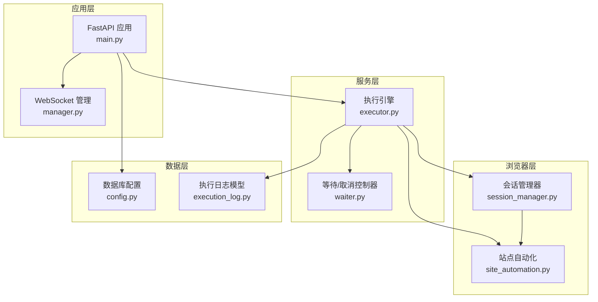
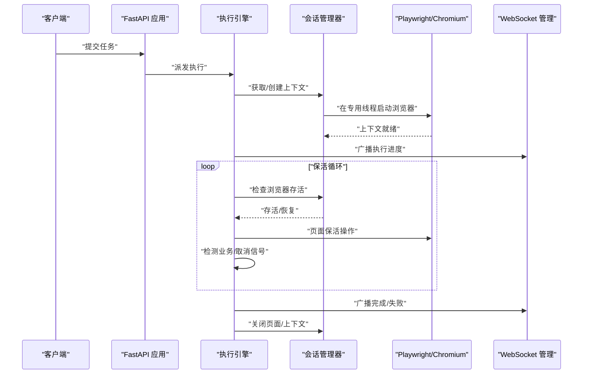
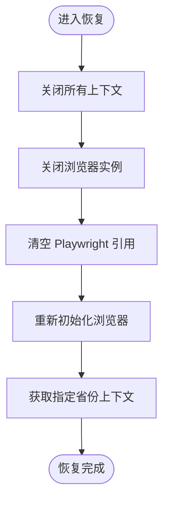
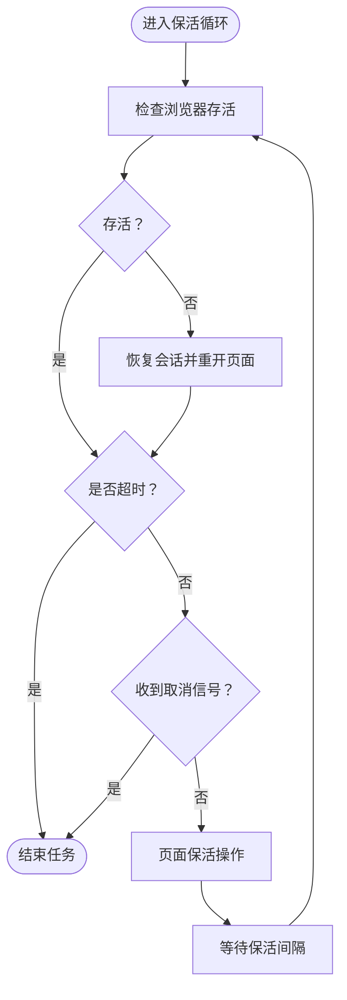
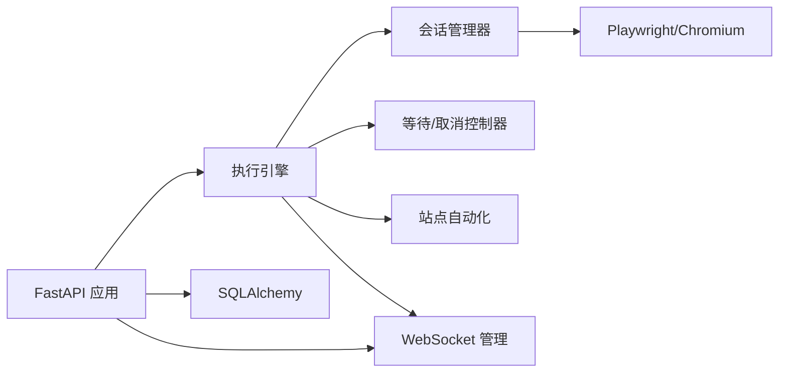

# 资源硬限制管控

<cite>
**本文引用的文件**
- [main.py](file://CCC_RPA_API/app/main.py)
- [config.py](file://CCC_RPA_API/app/config.py)
- [session_manager.py](file://CCC_RPA_API/app/browser/session_manager.py)
- [site_automation.py](file://CCC_RPA_API/app/browser/site_automation.py)
- [executor.py](file://CCC_RPA_API/app/services/executor.py)
- [waiter.py](file://CCC_RPA_API/app/browser/waiter.py)
- [execution_log.py](file://CCC_RPA_API/app/models/execution_log.py)
- [manager.py](file://CCC_RPA_API/app/ws/manager.py)
</cite>

## 目录
1. [简介](#简介)
2. [项目结构](#项目结构)
3. [核心组件](#核心组件)
4. [架构总览](#架构总览)
5. [详细组件分析](#详细组件分析)
6. [依赖分析](#依赖分析)
7. [性能考量](#性能考量)
8. [故障排查指南](#故障排查指南)
9. [结论](#结论)
10. [附录](#附录)

## 简介
本文件面向“资源硬限制管控系统”，聚焦于内存、CPU、标签页数量与会话时长的硬上限配置与监控机制，覆盖进程资源监控、阈值检测、异常处理与强制销毁策略，并结合 K8s 资源限制与 cgroup 配置给出落地建议。同时提供资源配置示例、监控指标说明与故障处理流程，帮助开发者理解实现方式与运维策略。

## 项目结构
该系统以 Python/FastAPI 后端为核心，配合 Playwright 浏览器自动化与 WebSocket 实时通信，形成“任务编排—浏览器执行—状态上报”的闭环。关键模块如下：
- 应用入口与生命周期：FastAPI 应用、数据库初始化、健康检查、WebSocket 管理
- 会话管理：Playwright 工作线程、浏览器上下文池、状态持久化
- 执行引擎：任务执行器、保活循环、取消/等待机制
- 自动化逻辑：站点交互、登录、单位选择、业务检测与执行
- 数据模型：任务与执行日志
- 通信层：WebSocket 广播

图表来源
- [main.py:30-127](file://CCC_RPA_API/app/main.py#L30-L127)
- [manager.py:1-29](file://CCC_RPA_API/app/ws/manager.py#L1-L29)
- [executor.py:1-319](file://CCC_RPA_API/app/services/executor.py#L1-L319)
- [session_manager.py:1-186](file://CCC_RPA_API/app/browser/session_manager.py#L1-L186)
- [site_automation.py:1-743](file://CCC_RPA_API/app/browser/site_automation.py#L1-L743)
- [waiter.py:1-84](file://CCC_RPA_API/app/browser/waiter.py#L1-L84)
- [config.py:1-22](file://CCC_RPA_API/app/config.py#L1-L22)
- [execution_log.py:1-17](file://CCC_RPA_API/app/models/execution_log.py#L1-L17)

章节来源
- [main.py:1-127](file://CCC_RPA_API/app/main.py#L1-L127)
- [config.py:1-22](file://CCC_RPA_API/app/config.py#L1-L22)

## 核心组件
- 会话管理器（BrowserSessionManager）
  - 专用工作线程承载 Playwright/Chromium，避免与 asyncio 冲突
  - 上下文池按“省份”维度管理，支持 storage_state 持久化
  - 提供检查存活、恢复、关闭等能力
- 执行引擎（Executor）
  - 任务执行线程池与等待线程池分离
  - 保活循环控制会话时长上限与业务触发
  - 统一广播执行进度、错误与状态更新
- 等待/取消控制器（ExecutionWaiter）
  - 基于 threading.Event 的非阻塞/阻塞等待与取消
  - 支持保活循环快速响应取消信号
- 站点自动化（SiteAutomation）
  - 登录、单位选择、保活、业务检测与执行
  - 多策略降级与异常检测（浏览器关闭类错误）
- WebSocket 管理（ConnectionManager）
  - 广播消息至所有连接客户端
- 数据模型（TaskExecutionLog）
  - 记录任务执行起止时间、状态与结果

章节来源
- [session_manager.py:10-186](file://CCC_RPA_API/app/browser/session_manager.py#L10-L186)
- [executor.py:1-319](file://CCC_RPA_API/app/services/executor.py#L1-L319)
- [waiter.py:7-84](file://CCC_RPA_API/app/browser/waiter.py#L7-L84)
- [site_automation.py:16-743](file://CCC_RPA_API/app/browser/site_automation.py#L16-L743)
- [manager.py:1-29](file://CCC_RPA_API/app/ws/manager.py#L1-L29)
- [execution_log.py:7-17](file://CCC_RPA_API/app/models/execution_log.py#L7-L17)

## 架构总览
系统通过“应用层—服务层—浏览器层—数据层—通信层”的分层设计，实现资源硬限制的端到端管控：
- 会话时长硬上限：保活循环中设置最大保活时长，到期自动结束
- 标签页数量硬上限：每个上下文仅维护必要页面，执行完成后及时关闭
- 异常处理与强制销毁：检测浏览器关闭、恢复会话；超时/取消触发清理
- 监控与告警：通过 WebSocket 广播执行状态，结合日志记录异常

图表来源
- [executor.py:78-315](file://CCC_RPA_API/app/services/executor.py#L78-L315)
- [session_manager.py:30-186](file://CCC_RPA_API/app/browser/session_manager.py#L30-L186)
- [manager.py:17-29](file://CCC_RPA_API/app/ws/manager.py#L17-L29)

## 详细组件分析

### 会话管理器（BrowserSessionManager）
- 设计要点
  - 专用工作线程承载 Playwright/Chromium，避免与 asyncio 事件循环冲突
  - 上下文池按“省份”维度管理，支持 storage_state 持久化，减少重复登录成本
  - 提供检查存活、恢复、关闭等能力，确保异常时可重建
- 资源硬限制关联
  - 通过“专用线程+上下文池”降低多任务并发对内存/CPU 的峰值冲击
  - 显式关闭页面与上下文，避免标签页无限增长
- 关键流程（恢复会话）

图表来源
- [session_manager.py:156-170](file://CCC_RPA_API/app/browser/session_manager.py#L156-L170)

章节来源
- [session_manager.py:10-186](file://CCC_RPA_API/app/browser/session_manager.py#L10-L186)

### 执行引擎（Executor）
- 设计要点
  - 使用线程池执行耗时任务，避免阻塞主事件循环
  - 保活循环严格控制最大会话时长，到期自动结束
  - 在关键节点进行浏览器存活检查，异常时恢复并重开页面
- 资源硬限制实现
  - 会话时长硬上限：保活循环中设置最大保活时长，到期即终止
  - 标签页数量硬上限：每次执行完成后关闭页面，避免累积
  - 超时/取消：扫码等待、选择单位等待均设置超时，触发异常处理
- 关键流程（保活循环与异常恢复）

图表来源
- [executor.py:196-267](file://CCC_RPA_API/app/services/executor.py#L196-L267)
- [executor.py:42-69](file://CCC_RPA_API/app/services/executor.py#L42-L69)

章节来源
- [executor.py:1-319](file://CCC_RPA_API/app/services/executor.py#L1-L319)

### 等待/取消控制器（ExecutionWaiter）
- 设计要点
  - 基于 threading.Event 的阻塞/非阻塞等待与取消
  - 支持注册检查事件，保活循环可快速响应取消信号
- 资源硬限制关联
  - 通过非阻塞检查取消信号，避免保活循环长时间阻塞
  - 超时控制保障任务不会无限等待用户输入

章节来源
- [waiter.py:7-84](file://CCC_RPA_API/app/browser/waiter.py#L7-L84)

### 站点自动化（SiteAutomation）
- 设计要点
  - 多策略降级：二维码截图、单位列表抓取、登录按钮点击等均有降级方案
  - 异常检测：识别浏览器关闭类错误，触发恢复流程
  - 保活操作：在当前页面执行轻量级动作，避免导航导致的状态丢失
- 资源硬限制关联
  - 保活操作不触发业务按钮，避免额外 CPU/网络消耗
  - 多种降级策略减少失败重试带来的资源浪费

章节来源
- [site_automation.py:16-743](file://CCC_RPA_API/app/browser/site_automation.py#L16-L743)

### WebSocket 管理（ConnectionManager）
- 设计要点
  - 广播消息至所有连接客户端，支持实时状态展示
  - 断连清理，避免僵尸连接占用资源
- 资源硬限制关联
  - 广播频率需受控，避免过多消息导致网络与 CPU 开销

章节来源
- [manager.py:1-29](file://CCC_RPA_API/app/ws/manager.py#L1-L29)

### 数据模型（TaskExecutionLog）
- 设计要点
  - 记录任务执行起止时间、状态与结果，支撑审计与监控
- 资源硬限制关联
  - 日志可用于追踪任务执行时长、失败原因，辅助优化资源使用

章节来源
- [execution_log.py:7-17](file://CCC_RPA_API/app/models/execution_log.py#L7-L17)

## 依赖分析
- 组件耦合
  - 执行引擎依赖会话管理器与等待控制器，耦合度适中
  - 站点自动化作为工具集被执行引擎调用，职责清晰
  - WebSocket 管理器与执行引擎通过广播解耦
- 外部依赖
  - Playwright/Chromium：浏览器自动化核心
  - SQLAlchemy：数据库访问
  - FastAPI/WebSocket：接口与通信

图表来源
- [executor.py:13-15](file://CCC_RPA_API/app/services/executor.py#L13-L15)
- [session_manager.py:4-6](file://CCC_RPA_API/app/browser/session_manager.py#L4-L6)
- [main.py:4-7](file://CCC_RPA_API/app/main.py#L4-L7)

章节来源
- [executor.py:1-319](file://CCC_RPA_API/app/services/executor.py#L1-L319)
- [session_manager.py:1-186](file://CCC_RPA_API/app/browser/session_manager.py#L1-L186)
- [main.py:1-127](file://CCC_RPA_API/app/main.py#L1-L127)

## 性能考量
- 线程与事件循环分离
  - 专用工作线程承载浏览器操作，避免与 asyncio 冲突
  - 任务线程池与等待线程池分离，避免阻塞
- 保活策略
  - 在当前页面执行轻量级动作，避免导航与额外请求
  - 分段等待，快速响应取消信号
- 资源回收
  - 执行完成后及时关闭页面与上下文，防止标签页堆积
  - 恢复会话时清理旧上下文，释放内存/CPU
- 监控与日志
  - 通过 WebSocket 广播执行状态，结合日志定位问题
  - 执行日志记录起止时间与结果，支撑容量规划

[本节为通用性能讨论，无需列出章节来源]

## 故障排查指南
- 浏览器异常/关闭
  - 现象：页面报错或提示浏览器已关闭
  - 处理：执行引擎检测后触发恢复流程，重新初始化浏览器并重开页面
  - 参考路径：[异常恢复流程:42-69](file://CCC_RPA_API/app/services/executor.py#L42-L69)，[会话恢复:156-170](file://CCC_RPA_API/app/browser/session_manager.py#L156-L170)
- 扫码/选择单位超时
  - 现象：等待用户操作超时
  - 处理：抛出超时异常，任务标记失败并广播错误
  - 参考路径：[扫码等待:133-139](file://CCC_RPA_API/app/services/executor.py#L133-L139)，[等待控制器:15-32](file://CCC_RPA_API/app/browser/waiter.py#L15-L32)
- 保活循环卡住
  - 现象：任务长时间无进展
  - 处理：检查取消信号与超时判断，确保分段等待生效
  - 参考路径：[保活循环:208-267](file://CCC_RPA_API/app/services/executor.py#L208-L267)，[取消检查:56-69](file://CCC_RPA_API/app/browser/waiter.py#L56-L69)
- 页面状态异常
  - 现象：页面元素缺失或结构变化
  - 处理：站点自动化具备多策略降级，必要时回退到 JS 匹配
  - 参考路径：[降级策略:194-291](file://CCC_RPA_API/app/browser/site_automation.py#L194-L291)，[JS 回退:426-461](file://CCC_RPA_API/app/browser/site_automation.py#L426-L461)

章节来源
- [executor.py:42-69](file://CCC_RPA_API/app/services/executor.py#L42-L69)
- [executor.py:133-139](file://CCC_RPA_API/app/services/executor.py#L133-L139)
- [executor.py:208-267](file://CCC_RPA_API/app/services/executor.py#L208-L267)
- [waiter.py:15-32](file://CCC_RPA_API/app/browser/waiter.py#L15-L32)
- [waiter.py:56-69](file://CCC_RPA_API/app/browser/waiter.py#L56-L69)
- [site_automation.py:194-291](file://CCC_RPA_API/app/browser/site_automation.py#L194-L291)
- [site_automation.py:426-461](file://CCC_RPA_API/app/browser/site_automation.py#L426-L461)

## 结论
本系统通过“专用浏览器工作线程+保活循环+异常恢复”的组合，实现了对会话时长、标签页数量与运行时异常的硬限制与可控处理。结合 WebSocket 实时广播与执行日志，能够有效支撑运维监控与容量规划。建议在生产环境中进一步引入 K8s 资源限制与 cgroup 配置，强化内存/CPU 的硬约束与隔离。

[本节为总结性内容，无需列出章节来源]

## 附录

### K8s 资源限制与 cgroup 配置建议
- Pod 资源限制
  - CPU：根据并发任务数与浏览器实例数设定 requests/limits
  - 内存：结合浏览器上下文数量与页面复杂度设定 limits，预留系统与网络栈开销
- cgroup 隔离
  - 使用 systemd 或容器运行时的 cgroup v1/v2 控制 CPU quota 与内存使用
  - 对浏览器进程单独设置 memory.max 与 cpu.max，避免任务互相影响
- 节点亲和与污点容忍
  - 将浏览器相关 Pod 调度到具备足够 GPU/内存的节点
  - 通过污点与容忍避免与高争用负载混部

[本节为通用配置建议，无需列出章节来源]

### 监控指标说明
- 执行指标
  - 任务成功率、失败率、平均执行时长、超时率
  - 浏览器重启次数、恢复耗时
- 资源指标
  - CPU 使用率、内存 RSS、PSS、堆外内存
  - 标签页数量、上下文数量、线程数
- 通信指标
  - WebSocket 连接数、广播消息速率、断连率

[本节为通用指标说明，无需列出章节来源]

### 配置示例（概念性）
- FastAPI 应用
  - CORS、数据库连接、WebSocket 广播
  - 参考路径：[应用初始化:12-127](file://CCC_RPA_API/app/main.py#L12-L127)
- 执行器线程池
  - 任务执行线程数、等待线程数、超时时间
  - 参考路径：[线程池定义:18-19](file://CCC_RPA_API/app/services/executor.py#L18-L19)
- 会话管理
  - 存储目录、上下文池大小、超时时间
  - 参考路径：[存储目录与队列:19-28](file://CCC_RPA_API/app/browser/session_manager.py#L19-L28)

章节来源
- [main.py:12-127](file://CCC_RPA_API/app/main.py#L12-L127)
- [executor.py:18-19](file://CCC_RPA_API/app/services/executor.py#L18-L19)
- [session_manager.py:19-28](file://CCC_RPA_API/app/browser/session_manager.py#L19-L28)