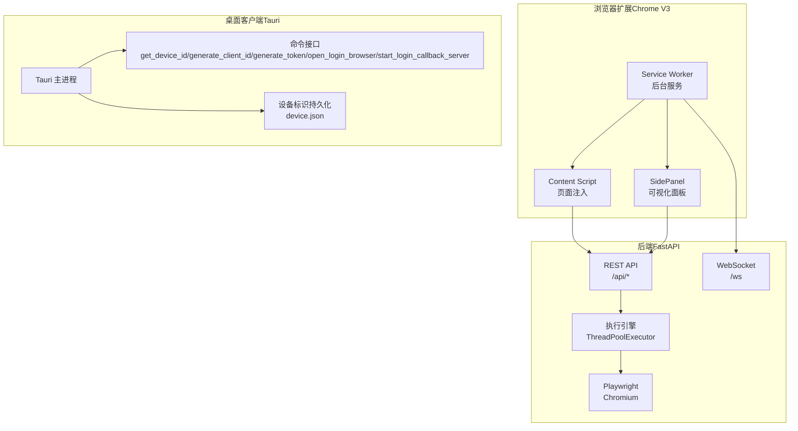
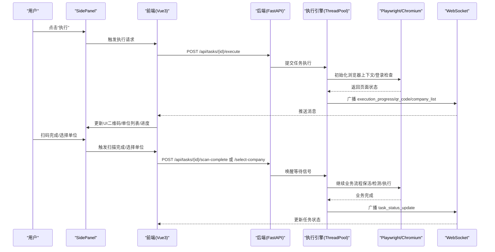
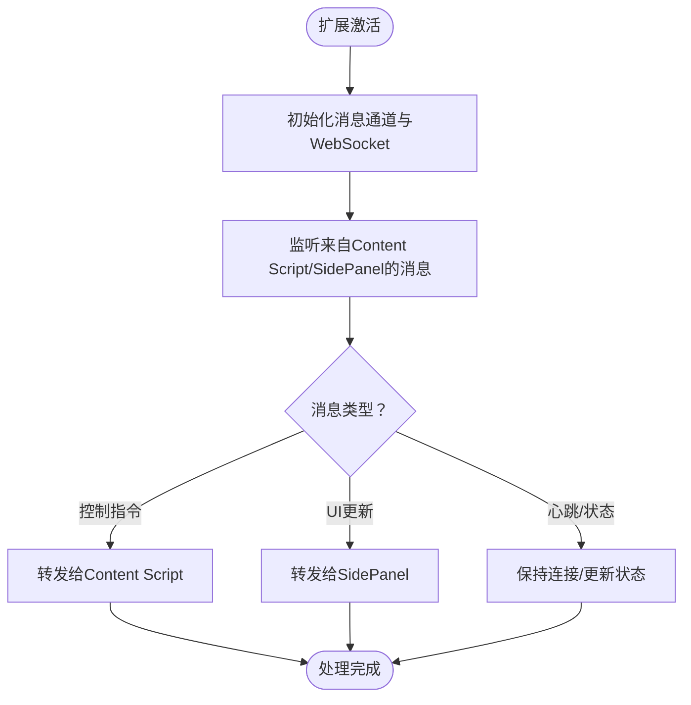
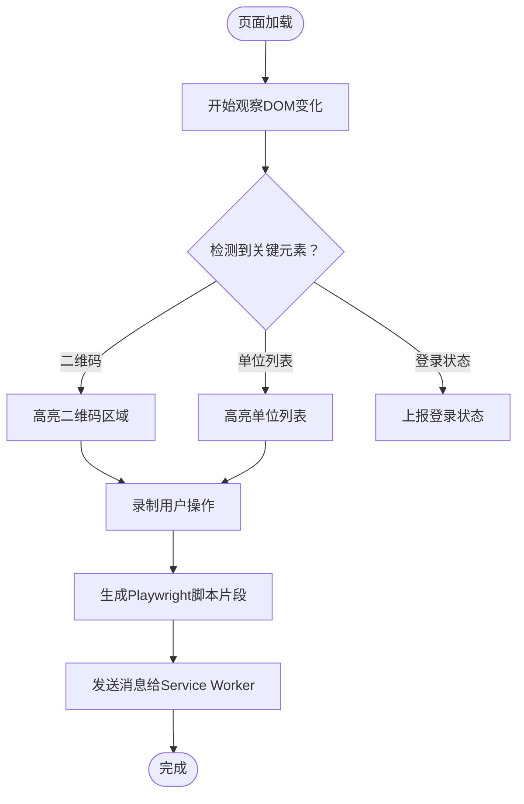
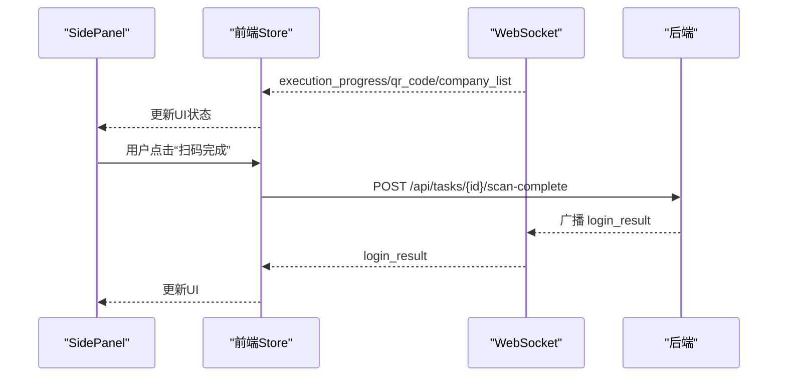
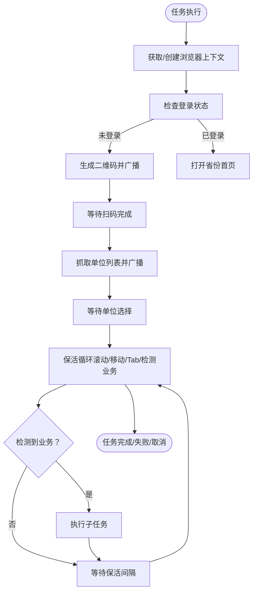
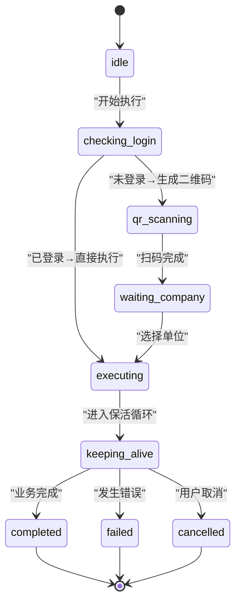
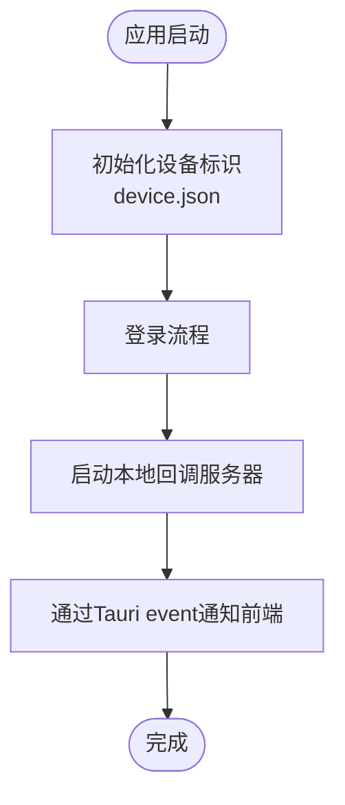
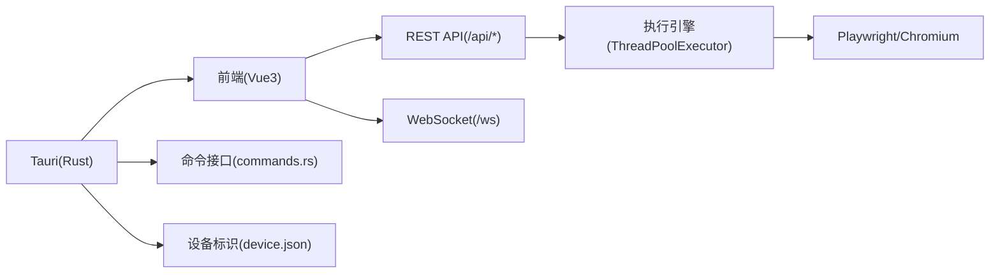

# Chrome V3扩展

<cite>
**本文引用的文件**
- [project.md](file://project.md)
- [main.py](file://CCC_RPA_API/app/main.py)
- [auth.py](file://CCC_RPA_API/app/api/auth.py)
- [tasks.py](file://CCC_RPA_API/app/api/tasks.py)
- [executor.py](file://CCC_RPA_API/app/services/executor.py)
- [session_manager.py](file://CCC_RPA_API/app/browser/session_manager.py)
- [site_automation.py](file://CCC_RPA_API/app/browser/site_automation.py)
- [human_behavior.py](file://CCC_RPA_API/app/browser/human_behavior.py)
- [waiter.py](file://CCC_RPA_API/app/browser/waiter.py)
- [manager.py](file://CCC_RPA_API/app/ws/manager.py)
- [request.ts](file://CCC-BrowserV4/frontend/src/api/request.ts)
- [auth.ts](file://CCC-BrowserV4/frontend/src/api/auth.ts)
- [tasks.ts](file://CCC-BrowserV4/frontend/src/api/tasks.ts)
- [execution.ts](file://CCC-BrowserV4/frontend/src/api/execution.ts)
- [ws.ts](file://CCC-BrowserV4/frontend/src/api/ws.ts)
- [auth.store.ts](file://CCC-BrowserV4/frontend/src/stores/auth.ts)
- [task.store.ts](file://CCC-BrowserV4/frontend/src/stores/task.ts)
- [execution.store.ts](file://CCC-BrowserV4/frontend/src/stores/execution.ts)
- [device.store.ts](file://CCC-BrowserV4/frontend/src/stores/device.ts)
- [router.index.ts](file://CCC-BrowserV4/frontend/src/router/index.ts)
- [main.ts](file://CCC-BrowserV4/frontend/src/main.ts)
- [commands.rs](file://CCC-BrowserV4/src-tauri/src/commands.rs)
- [device.rs](file://CCC-BrowserV4/src-tauri/src/device.rs)
- [main.rs](file://CCC-BrowserV4/src-tauri/src/main.rs)
- [tauri.conf.json](file://CCC-BrowserV4/src-tauri/tauri.conf.json)
- [vite.config.ts](file://CCC-BrowserV4/frontend/vite.config.ts)
- [docker-compose.yml](file://CCC-BrowserV4/docker-compose.yml)
</cite>

## 目录
1. [简介](#简介)
2. [项目结构](#项目结构)
3. [核心组件](#核心组件)
4. [架构总览](#架构总览)
5. [详细组件分析](#详细组件分析)
6. [依赖关系分析](#依赖关系分析)
7. [性能考虑](#性能考虑)
8. [故障排查指南](#故障排查指南)
9. [结论](#结论)
10. [附录](#附录)

## 简介
本项目是一个面向政府交通管理网站（122.gov.cn）的RPA自动化平台，采用Chrome V3扩展与桌面客户端（Tauri）协同的方式，结合Playwright浏览器引擎实现“自动登录→扫码认证→选择单位→页面保活→业务自动处理”的全流程自动化。系统分为三层：浏览器自动化层（Playwright + 反检测真人行为）、API与实时通信层（FastAPI + WebSocket）、前端交互层（Vue3 + Pinia）。本文档聚焦于Chrome V3扩展的后台服务（Service Worker）、页面注入（Content Script）、SidePanel可视化面板的架构设计与实现原理，并详细说明扩展生命周期管理、消息通信协议、页面DOM监听与元素高亮技术，以及人工操作录制、Playwright脚本生成、实时截图传输与状态同步机制。

## 项目结构
项目采用多模块分层架构，核心模块包括：
- 后端（Python FastAPI）：提供REST API与WebSocket，负责任务执行、浏览器会话管理与状态广播
- 前端（Vue3 + Pinia）：负责用户界面、状态管理、WebSocket消息分发与Tauri桥接
- Tauri层（Rust）：提供桌面壳层、设备标识持久化与登录回调服务器

图表来源
- [project.md:34-66](file://project.md#L34-L66)
- [project.md:161-260](file://project.md#L161-L260)

章节来源
- [project.md:159-260](file://project.md#L159-L260)

## 核心组件
- Service Worker：扩展生命周期管理、消息路由、与Content Script/SidePanel通信、与后端WebSocket连接
- Content Script：页面DOM监听、元素高亮、人工操作录制、Playwright脚本生成触发
- SidePanel：可视化面板，展示二维码、单位列表、执行进度与错误信息，触发扫描完成与单位选择
- 后端执行引擎：按省份隔离的浏览器会话管理、保活循环、业务检测与执行
- 前端状态管理：Pinia Store负责认证、任务、执行状态与设备标识的状态同步

章节来源
- [project.md:266-364](file://project.md#L266-L364)

## 架构总览
系统整体数据流如下：
- 用户在SidePanel发起任务执行，前端通过REST API触发后端执行
- 后端执行引擎通过Playwright在Chromium中执行自动化，期间通过WebSocket向前端推送进度与状态
- Content Script负责页面交互与录制，与后端通过消息协议进行双向通信
- Tauri层提供设备标识与登录回调，确保跨端一致性

图表来源
- [project.md:474-546](file://project.md#L474-L546)
- [project.md:404-418](file://project.md#L404-L418)

## 详细组件分析

### Service Worker后台服务
- 生命周期管理：注册扩展安装、更新、卸载事件，初始化消息通道与WebSocket连接
- 消息路由：根据消息类型将消息转发给Content Script或SidePanel，支持心跳、状态同步与控制指令
- 与后端通信：通过WebSocket订阅后端广播，解析消息类型并更新扩展状态

图表来源
- [project.md:404-418](file://project.md#L404-L418)

章节来源
- [project.md:366-418](file://project.md#L366-L418)

### Content Script页面注入
- DOM监听：监听页面元素变化，识别登录状态、二维码、单位列表等关键节点
- 元素高亮：对可交互元素进行高亮提示，辅助人工录制与调试
- 录制与脚本生成：记录用户操作序列，生成Playwright脚本片段，供后端执行引擎复用
- 与Service Worker通信：通过消息协议上报页面状态、截图与操作日志

图表来源
- [project.md:474-546](file://project.md#L474-L546)

章节来源
- [project.md:474-546](file://project.md#L474-L546)

### SidePanel可视化面板
- 功能入口：提供“执行”、“扫码完成”、“选择单位”等操作按钮
- 实时展示：显示二维码图片、单位列表、执行进度与错误信息
- 状态同步：与前端store联动，接收WebSocket消息并更新UI

图表来源
- [project.md:404-418](file://project.md#L404-L418)
- [project.md:366-418](file://project.md#L366-L418)

章节来源
- [project.md:366-418](file://project.md#L366-L418)

### 后端执行引擎与浏览器自动化
- 会话管理：按省份隔离的浏览器上下文，持久化storage_state，支持崩溃恢复
- 保活循环：非侵入式随机滚动、鼠标移动、Tab与阅读等待，维持会话有效
- 业务检测：检测待处理业务并执行子任务，支持取消与超时控制

图表来源
- [project.md:474-546](file://project.md#L474-L546)

章节来源
- [project.md:266-364](file://project.md#L266-L364)

### 前端状态管理与消息分发
- 认证状态：登录/登出/持久化，支持开发模式虚拟登录
- 任务状态：任务列表、执行状态、日志查询与WebSocket消息分发
- 执行状态机：idle/checking_login/qr_scanning/waiting_company/executing/keeping_alive/completed/failed/cancelled
- 设备标识：通过Tauri Bridge获取持久化device_id

图表来源
- [project.md:548-556](file://project.md#L548-L556)

章节来源
- [project.md:307-364](file://project.md#L307-L364)

### Tauri层与桌面集成
- 设备标识：通过tauri-plugin-store将device_id存储到device.json，应用启动时自动初始化
- 登录回调：启动本地HTTP服务器接收外部浏览器登录回调，通过Tauri event通知前端
- 命令接口：提供get_device_id、generate_client_id、generate_token、open_login_browser、start_login_callback_server五个命令

图表来源
- [project.md:347-364](file://project.md#L347-L364)

章节来源
- [project.md:347-364](file://project.md#L347-L364)

## 依赖关系分析
- 前端依赖：Axios实例（baseURL=/api）、WebSocket客户端（自动重连）、Pinia状态管理、Vue3路由与组件
- 后端依赖：FastAPI、Playwright、SQLAlchemy、WebSocket广播管理器
- Tauri依赖：tauri-plugin-shell、tauri-plugin-store、tauri-plugin-opener

图表来源
- [project.md:102-149](file://project.md#L102-L149)
- [project.md:161-260](file://project.md#L161-L260)

章节来源
- [project.md:102-149](file://project.md#L102-L149)
- [project.md:161-260](file://project.md#L161-L260)

## 性能考虑
- 浏览器自动化：使用Playwright Sync API在专用工作线程中执行，避免与asyncio事件循环冲突
- 并发模型：3个任务执行线程与3个等待线程，保活间隔随机化（30~120秒），降低被检测概率
- 线程安全：所有Playwright操作通过BrowserSessionManager.run()提交到专用playwright-worker线程执行
- WebSocket：后端通过asyncio.run_coroutine_threadsafe安全广播，前端3秒自动重连

章节来源
- [project.md:661-685](file://project.md#L661-L685)
- [project.md:655-659](file://project.md#L655-L659)

## 故障排查指南
- WebSocket连接问题：确认前端WebSocket自动重连逻辑（3秒间隔），检查后端uvicorn服务是否正常启动
- 登录回调：检查Tauri本地回调服务器端口是否被占用，确认event通知是否正确传递到前端
- Playwright崩溃：启用浏览器崩溃恢复机制，检查storage_state持久化路径与权限
- 状态不同步：核对前端store与WebSocket消息分发逻辑，确保task store作为中枢正确转发消息

章节来源
- [project.md:655-659](file://project.md#L655-L659)
- [project.md:687-713](file://project.md#L687-L713)

## 结论
本项目通过Chrome V3扩展与桌面客户端（Tauri）的协同，结合FastAPI后端与Playwright浏览器引擎，实现了从自动登录到业务自动处理的完整RPA流程。Service Worker负责扩展生命周期与消息路由，Content Script负责页面DOM监听与元素高亮，SidePanel提供可视化操作入口。后端通过按省份隔离的浏览器会话与保活循环确保自动化稳定性，前端通过Pinia状态管理与WebSocket实现状态同步。整体架构清晰、职责分离明确，具备良好的扩展性与可维护性。

## 附录

### 扩展开发指南
- Service Worker：注册消息监听与路由，初始化WebSocket连接，处理心跳与状态同步
- Content Script：实现DOM观察与元素高亮，录制用户操作并生成Playwright脚本片段
- SidePanel：提供UI入口与状态展示，触发后端控制指令并接收实时消息
- 前端：使用Axios与WebSocket客户端，Pinia管理状态，路由守卫保护页面访问
- Tauri：通过命令接口获取设备标识与启动回调服务器，持久化device_id

章节来源
- [project.md:307-364](file://project.md#L307-L364)
- [project.md:347-364](file://project.md#L347-L364)

### 消息协议规范
- WebSocket消息格式：{type: string, data: object}
- 消息类型与方向：
  - execution_progress：后端→前端，执行进度更新
  - qr_code：后端→前端，推送二维码
  - company_list：后端→前端，推送单位列表
  - login_result：后端→前端，登录结果
  - execution_error：后端→前端，执行错误
  - task_status_update：后端→前端，任务状态变更

章节来源
- [project.md:404-418](file://project.md#L404-L418)

### 集成示例
- 前端开发代理：Vite将/api代理到后端，/ws代理到WebSocket
- 后端启动：uvicorn启动FastAPI应用，Playwright安装Chromium
- Tauri开发：npm run tauri dev进行热更新，npm run tauri build构建生产版本
- Docker：docker-compose启动MySQL 8.4容器

章节来源
- [project.md:592-637](file://project.md#L592-L637)