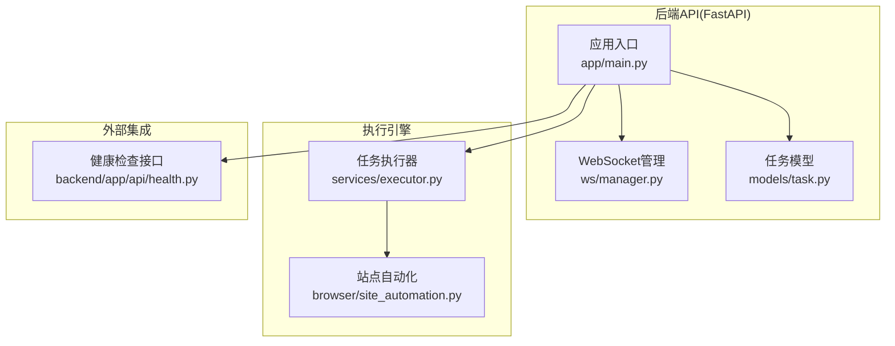
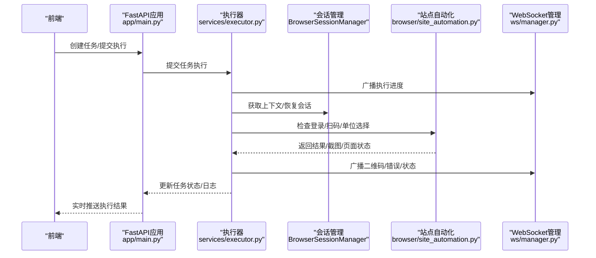
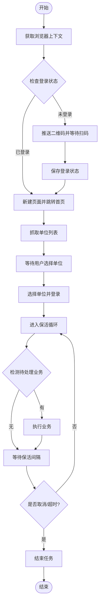
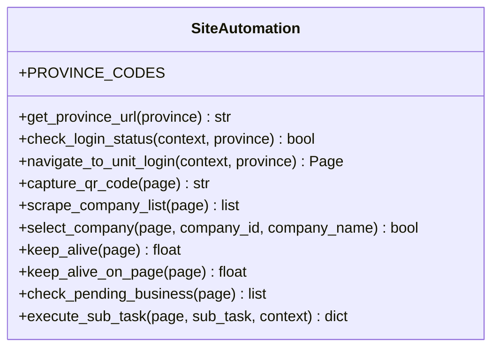
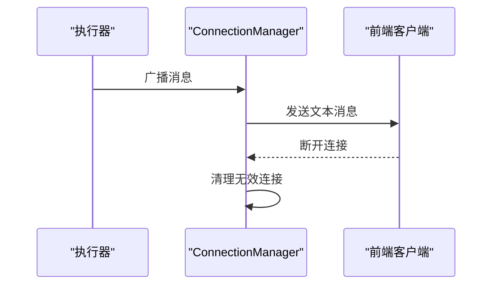
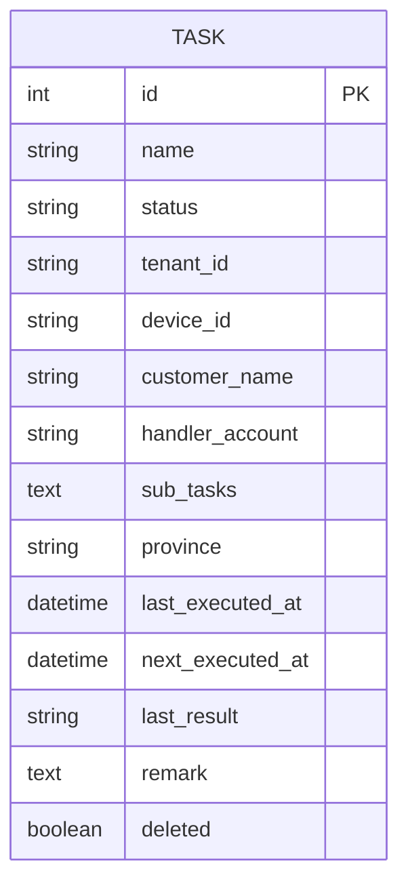
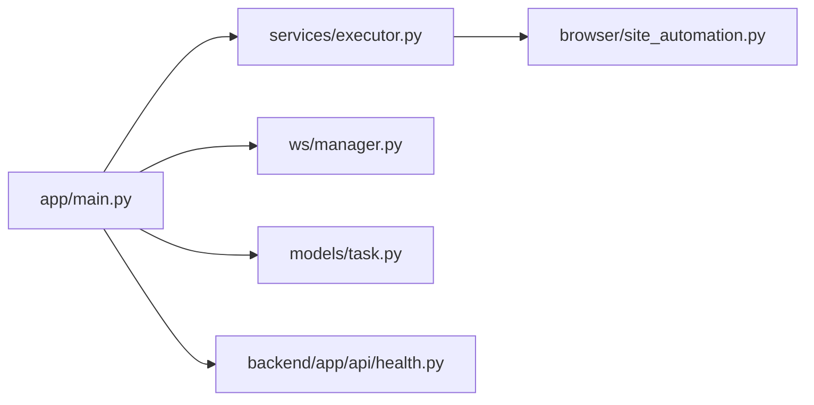

# Playwright自动化脚本

<cite>
**本文档引用的文件**
- [main.py](file://CCC_RPA_API/app/main.py)
- [executor.py](file://CCC_RPA_API/app/services/executor.py)
- [site_automation.py](file://CCC_RPA_API/app/browser/site_automation.py)
- [manager.py](file://CCC_RPA_API/app/ws/manager.py)
- [task.py](file://CCC_RPA_API/app/models/task.py)
- [health.py](file://CCC-BrowserV4/backend/app/api/health.py)
</cite>

## 目录
1. [简介](#简介)
2. [项目结构](#项目结构)
3. [核心组件](#核心组件)
4. [架构总览](#架构总览)
5. [详细组件分析](#详细组件分析)
6. [依赖分析](#依赖分析)
7. [性能考虑](#性能考虑)
8. [故障排查指南](#故障排查指南)
9. [结论](#结论)
10. [附录](#附录)

## 简介
本项目是一个基于Playwright的自动化脚本系统，提供Node.js与Python双语言SDK封装能力，支持远程脚本执行、任务队列管理与实时通信。系统围绕“任务驱动 + 页面自动化”的核心模式，实现从任务调度、浏览器会话管理、页面操作到实时状态推送的完整链路。同时具备异常处理与恢复、保活机制、以及面向前端的WebSocket实时通信能力。

## 项目结构
项目采用前后端分离与多模块协作的方式组织：
- 后端API（FastAPI）：负责任务管理、浏览器会话管理、任务执行、WebSocket广播与健康检查。
- 浏览器自动化模块：封装页面操作、登录流程、单位选择、业务检测与保活逻辑。
- 实时通信：通过WebSocket向前端推送执行进度、二维码、错误与状态更新。
- 数据模型：基于SQLAlchemy的任务与执行日志模型，支持任务元数据扩展（如省/设备/租户等）。

图表来源
- [main.py:1-127](file://CCC_RPA_API/app/main.py#L1-L127)
- [executor.py:1-319](file://CCC_RPA_API/app/services/executor.py#L1-L319)
- [site_automation.py:1-743](file://CCC_RPA_API/app/browser/site_automation.py#L1-L743)
- [manager.py:1-29](file://CCC_RPA_API/app/ws/manager.py#L1-L29)
- [task.py:1-25](file://CCC_RPA_API/app/models/task.py#L1-L25)
- [health.py:1-18](file://CCC-BrowserV4/backend/app/api/health.py#L1-L18)

章节来源
- [main.py:1-127](file://CCC_RPA_API/app/main.py#L1-L127)
- [executor.py:1-319](file://CCC_RPA_API/app/services/executor.py#L1-L319)
- [site_automation.py:1-743](file://CCC_RPA_API/app/browser/site_automation.py#L1-L743)
- [manager.py:1-29](file://CCC_RPA_API/app/ws/manager.py#L1-L29)
- [task.py:1-25](file://CCC_RPA_API/app/models/task.py#L1-L25)
- [health.py:1-18](file://CCC-BrowserV4/backend/app/api/health.py#L1-L18)

## 核心组件
- 应用入口与生命周期
  - 初始化FastAPI应用、CORS配置、数据库表与迁移、Mock任务数据插入。
  - 在启动时捕获主事件循环以供工作线程安全广播消息；在关闭时清理浏览器会话。
- 任务执行器
  - 使用线程池执行任务逻辑，隔离阻塞等待（如扫码等待）与Playwright工作线程。
  - 提供浏览器会话管理、异常恢复、进度广播、状态更新与日志记录。
- 站点自动化
  - 封装登录检查、二维码截图、单位列表抓取、单位选择、业务检测与保活。
  - 支持多种选择器与JS回退策略，增强页面适配能力。
- WebSocket管理
  - 维护客户端连接，广播执行进度、二维码、错误与任务状态更新。
- 数据模型
  - 任务模型支持状态、省/设备/租户、子任务、下次执行时间等字段，便于扩展。

章节来源
- [main.py:1-127](file://CCC_RPA_API/app/main.py#L1-L127)
- [executor.py:1-319](file://CCC_RPA_API/app/services/executor.py#L1-L319)
- [site_automation.py:1-743](file://CCC_RPA_API/app/browser/site_automation.py#L1-L743)
- [manager.py:1-29](file://CCC_RPA_API/app/ws/manager.py#L1-L29)
- [task.py:1-25](file://CCC_RPA_API/app/models/task.py#L1-L25)

## 架构总览
系统采用“API网关 + 执行引擎 + 自动化浏览器 + 实时通信”的分层架构。任务通过API创建与调度，执行器在独立线程中协调浏览器会话与页面操作，并通过WebSocket将状态实时推送到前端。

图表来源
- [main.py:119-127](file://CCC_RPA_API/app/main.py#L119-L127)
- [executor.py:317-319](file://CCC_RPA_API/app/services/executor.py#L317-L319)
- [site_automation.py:38-146](file://CCC_RPA_API/app/browser/site_automation.py#L38-L146)
- [manager.py:17-26](file://CCC_RPA_API/app/ws/manager.py#L17-L26)

## 详细组件分析

### 任务执行器（executor）
- 线程池设计
  - 使用两个线程池：任务执行线程池与等待线程池，避免阻塞Playwright工作线程。
- 执行流程
  - 初始化浏览器上下文与登录态检查。
  - 未登录时推送二维码并等待用户扫码，扫码成功后保存状态。
  - 抓取单位列表并等待用户选择，随后选择单位并进入保活循环。
  - 保活循环检测待处理业务并执行，支持取消与超时控制。
  - 任务完成后更新状态、记录日志并广播结果。
- 异常与恢复
  - 检测浏览器关闭错误并自动恢复会话，必要时重新打开页面。
  - 广播错误与状态更新，确保前端可见。

图表来源
- [executor.py:78-314](file://CCC_RPA_API/app/services/executor.py#L78-L314)

章节来源
- [executor.py:1-319](file://CCC_RPA_API/app/services/executor.py#L1-L319)

### 站点自动化（site_automation）
- 登录与扫码
  - 提供两种登录入口策略：直接导航与首页JS点击，增强稳定性。
  - 截取二维码元素并返回Base64，支持降级整页截图。
- 单位选择
  - 多选择器与多策略匹配（按名称、data-id、文本行、索引），并提供JS回退方案。
  - 成功后尝试点击“登录”按钮并等待跳转。
- 业务检测与保活
  - 通过徽标计数与关键词检测待处理业务类型。
  - 提供轻量保活动作（滚动、鼠标移动、键盘Tab、模拟阅读），避免页面跳转与表单提交。
- 错误识别
  - 识别浏览器关闭类错误，以便执行器进行恢复。

图表来源
- [site_automation.py:16-743](file://CCC_RPA_API/app/browser/site_automation.py#L16-L743)

章节来源
- [site_automation.py:1-743](file://CCC_RPA_API/app/browser/site_automation.py#L1-L743)

### WebSocket实时通信（manager）
- 连接管理
  - 维护WebSocket连接集合，接受新连接并处理断开。
- 广播机制
  - 对每个连接发送消息，自动清理无效连接，保证通信可靠性。
- 与执行器协作
  - 执行器在关键节点调用广播方法，推送二维码、进度、错误与状态更新。

图表来源
- [manager.py:10-26](file://CCC_RPA_API/app/ws/manager.py#L10-L26)
- [main.py:119-127](file://CCC_RPA_API/app/main.py#L119-L127)

章节来源
- [manager.py:1-29](file://CCC_RPA_API/app/ws/manager.py#L1-L29)
- [main.py:119-127](file://CCC_RPA_API/app/main.py#L119-L127)

### 数据模型（Task）
- 字段覆盖
  - 任务名、状态、省/设备/租户标识、处理人账号、子任务JSON、下次执行时间、备注与删除标记。
- 扩展性
  - 支持为不同省份、设备与租户定制任务参数，便于多租户与多地域部署。

图表来源
- [task.py:8-25](file://CCC_RPA_API/app/models/task.py#L8-L25)

章节来源
- [task.py:1-25](file://CCC_RPA_API/app/models/task.py#L1-L25)

### 健康检查（health）
- 提供服务与数据库连接状态检查，便于运维监控与容器编排。

章节来源
- [health.py:1-18](file://CCC-BrowserV4/backend/app/api/health.py#L1-L18)

## 依赖分析
- 组件耦合
  - 执行器依赖会话管理与站点自动化模块，通过统一的浏览器API进行页面操作。
  - WebSocket管理与应用入口解耦，便于在不同线程中广播消息。
- 外部依赖
  - FastAPI用于HTTP与WebSocket服务。
  - SQLAlchemy用于任务与日志持久化。
  - Playwright用于浏览器自动化（延迟初始化，避免事件循环冲突）。

图表来源
- [main.py:1-127](file://CCC_RPA_API/app/main.py#L1-L127)
- [executor.py:1-319](file://CCC_RPA_API/app/services/executor.py#L1-L319)
- [site_automation.py:1-743](file://CCC_RPA_API/app/browser/site_automation.py#L1-L743)
- [manager.py:1-29](file://CCC_RPA_API/app/ws/manager.py#L1-L29)
- [task.py:1-25](file://CCC_RPA_API/app/models/task.py#L1-L25)
- [health.py:1-18](file://CCC-BrowserV4/backend/app/api/health.py#L1-L18)

章节来源
- [main.py:1-127](file://CCC_RPA_API/app/main.py#L1-L127)
- [executor.py:1-319](file://CCC_RPA_API/app/services/executor.py#L1-L319)
- [site_automation.py:1-743](file://CCC_RPA_API/app/browser/site_automation.py#L1-L743)
- [manager.py:1-29](file://CCC_RPA_API/app/ws/manager.py#L1-L29)
- [task.py:1-25](file://CCC_RPA_API/app/models/task.py#L1-L25)
- [health.py:1-18](file://CCC-BrowserV4/backend/app/api/health.py#L1-L18)

## 性能考虑
- 线程池隔离
  - 将阻塞等待放入独立线程池，避免阻塞Playwright工作线程，提升并发与响应性。
- 保活策略
  - 保活采用随机动作与间隔，降低被风控概率；在业务页面执行轻量保活，避免导航与表单提交。
- 选择器与回退
  - 多选择器与JS回退策略减少页面结构变化带来的失败率，提高鲁棒性。
- 日志与截图
  - 在关键节点保存截图与日志，便于问题定位与性能优化。

## 故障排查指南
- 浏览器异常恢复
  - 当检测到浏览器关闭错误时，执行器会广播恢复提示并重建上下文与页面。
- 扫码超时与取消
  - 扫码等待与单位选择均设置超时与取消信号，超时或取消时记录错误并终止任务。
- WebSocket断连
  - 管理器会自动清理无效连接，若消息未送达，检查连接状态与网络环境。
- 登录失败
  - 检查二维码截图是否生成、页面跳转是否正常、登录按钮是否可点击。

章节来源
- [executor.py:42-69](file://CCC_RPA_API/app/services/executor.py#L42-L69)
- [executor.py:133-180](file://CCC_RPA_API/app/services/executor.py#L133-L180)
- [manager.py:17-26](file://CCC_RPA_API/app/ws/manager.py#L17-L26)
- [site_automation.py:148-173](file://CCC_RPA_API/app/browser/site_automation.py#L148-L173)

## 结论
该系统通过清晰的模块划分与线程池隔离，实现了稳定可靠的远程自动化执行。结合多策略页面操作与保活机制，能够在复杂页面环境中持续运行并响应业务触发。WebSocket实时通信保障了前端可观测性与交互体验。未来可在以下方面进一步完善：引入BullMQ任务队列以支持优先级、批量与定时任务；扩展SDK以支持Node.js与Python双语言脚本DSL；完善脚本DSL语法与条件/循环控制；加强异常重试与幂等设计。

## 附录

### SDK使用示例（概念性指导）
- Node.js侧
  - 通过HTTP API提交任务，使用WebSocket订阅执行状态。
  - 在任务中调用浏览器自动化API（由后端提供），实现扫码登录、单位选择与业务执行。
- Python侧
  - 使用requests调用后端任务接口，结合异步回调接收实时状态。
  - 在脚本中封装常用操作（登录、选择单位、业务执行），复用站点自动化模块。

### 脚本编写指南（概念性指导）
- 页面操作API
  - 登录检查：根据上下文判断是否已登录。
  - 二维码截图：返回Base64，前端渲染展示。
  - 单位列表抓取：支持多选择器与文本解析。
  - 单位选择：优先按名称匹配，其次按属性与索引回退。
  - 业务检测：通过徽标与关键词识别待处理业务。
  - 保活：在当前页面执行轻量动作，维持会话活跃。
- 条件判断与循环控制
  - 使用保活循环检测业务，遇取消或超时退出。
  - 业务执行前先确认页面状态，避免重复执行。
- 异常处理与重试
  - 捕获浏览器关闭错误并恢复会话。
  - 对超时与取消场景进行明确处理，记录日志并广播错误。

### 性能优化建议（概念性指导）
- 选择器优化：优先使用稳定的选择器，减少DOM遍历成本。
- 动作节流：保活动作随机化，避免过于频繁导致页面抖动。
- 线程池调优：根据并发需求调整线程数量，避免资源争用。
- 缓存与状态：复用已登录状态与上下文，减少重复初始化。