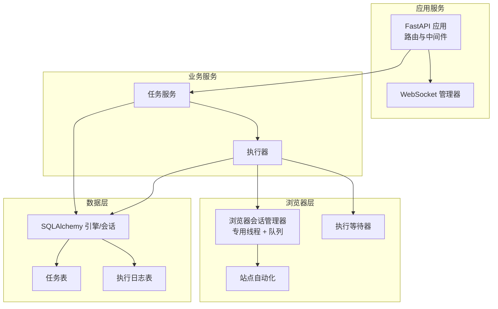
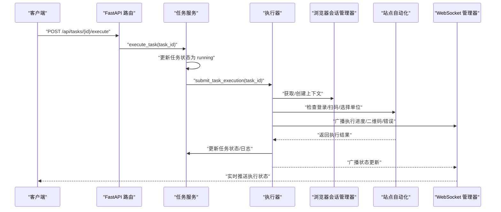
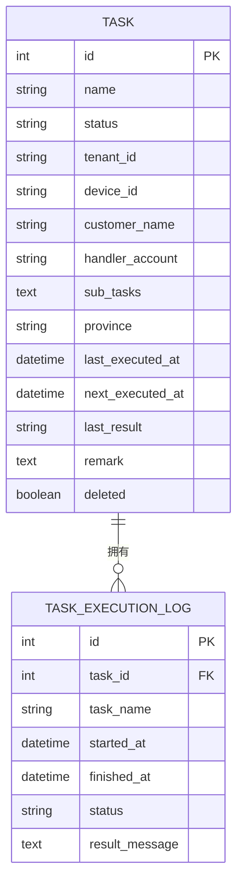
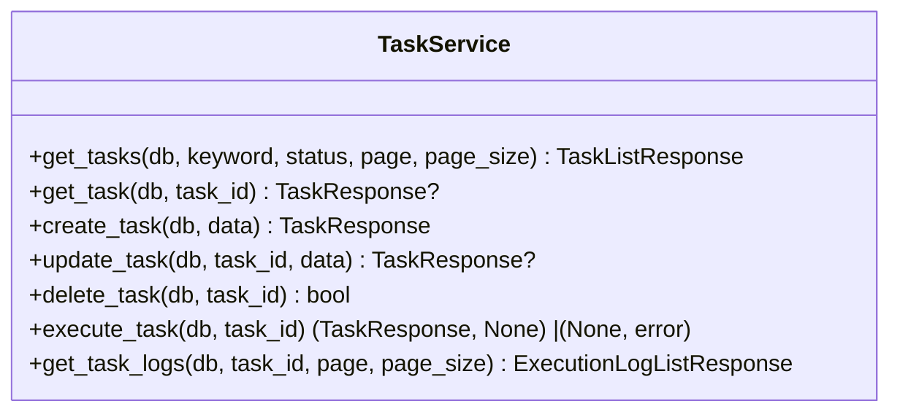
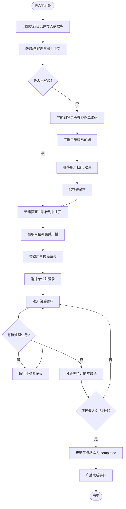
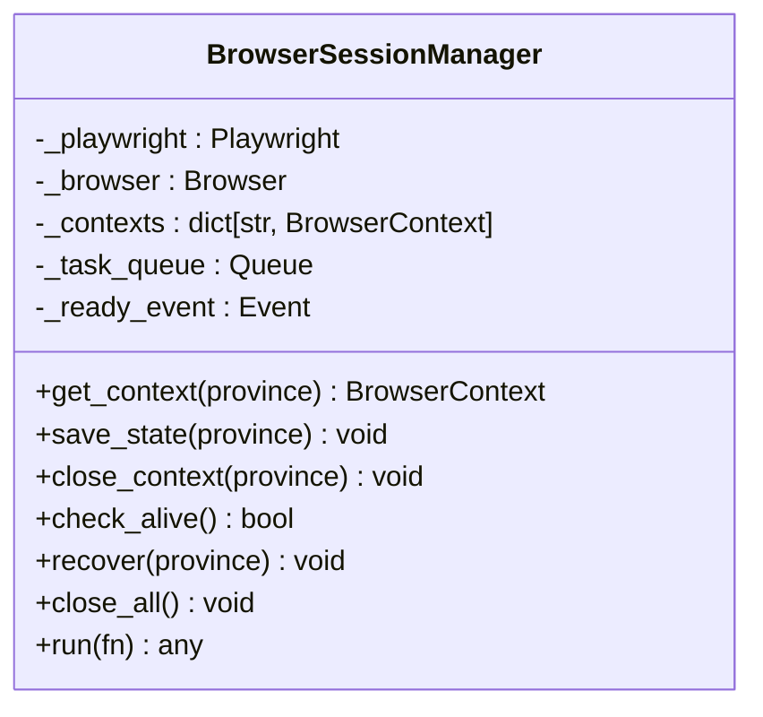
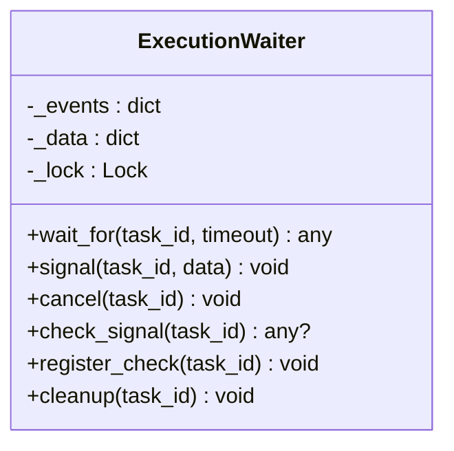
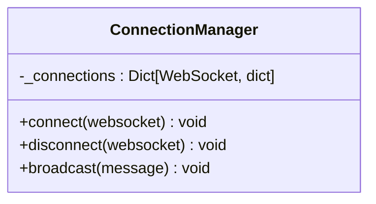
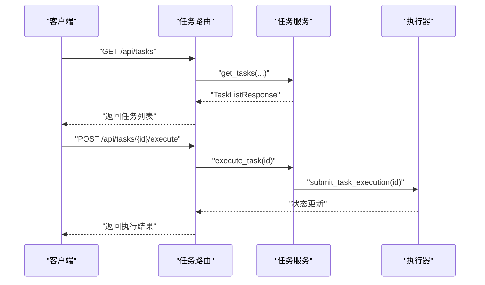
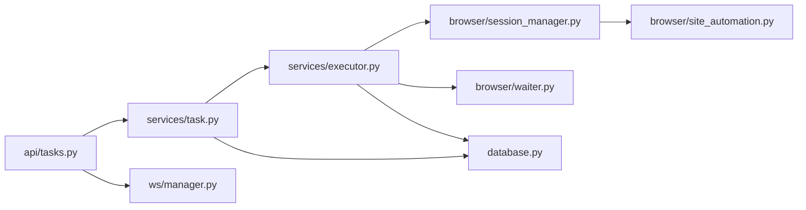

# 任务队列管理

<cite>
**本文档引用的文件**
- [main.py](file://CCC_RPA_API/app/main.py)
- [config.py](file://CCC_RPA_API/app/config.py)
- [database.py](file://CCC_RPA_API/app/database.py)
- [models/task.py](file://CCC_RPA_API/app/models/task.py)
- [models/execution_log.py](file://CCC_RPA_API/app/models/execution_log.py)
- [schemas/task.py](file://CCC_RPA_API/app/schemas/task.py)
- [schemas/execution_log.py](file://CCC_RPA_API/app/schemas/execution_log.py)
- [schemas/execution.py](file://CCC_RPA_API/app/schemas/execution.py)
- [api/tasks.py](file://CCC_RPA_API/app/api/tasks.py)
- [services/task.py](file://CCC_RPA_API/app/services/task.py)
- [services/executor.py](file://CCC_RPA_API/app/services/executor.py)
- [browser/session_manager.py](file://CCC_RPA_API/app/browser/session_manager.py)
- [browser/site_automation.py](file://CCC_RPA_API/app/browser/site_automation.py)
- [browser/waiter.py](file://CCC_RPA_API/app/browser/waiter.py)
- [ws/manager.py](file://CCC_RPA_API/app/ws/manager.py)
</cite>

## 目录
1. [简介](#简介)
2. [项目结构](#项目结构)
3. [核心组件](#核心组件)
4. [架构总览](#架构总览)
5. [详细组件分析](#详细组件分析)
6. [依赖关系分析](#依赖关系分析)
7. [性能考量](#性能考量)
8. [故障排查指南](#故障排查指南)
9. [结论](#结论)
10. [附录](#附录)

## 简介
本项目提供了一个面向网页自动化任务的队列执行系统，围绕“任务”这一核心实体，实现了任务生命周期管理、执行调度、状态广播、日志追踪与异常处理。系统采用异步 Web 服务与专用线程池执行浏览器自动化逻辑，结合 WebSocket 实时推送执行进度与结果，形成从 API 到执行再到监控的完整闭环。

## 项目结构
- 后端基于 FastAPI 提供 REST API 与 WebSocket 通道
- 数据层使用 SQLAlchemy ORM，MySQL 作为持久化存储
- 业务层包含任务服务与执行器，负责任务状态更新与浏览器自动化执行
- 浏览器层通过 Playwright 在专用工作线程中运行，保证与事件循环隔离
- 通信层通过 WebSocket 广播执行进度、错误与状态变更

图表来源
- [main.py:12-27](file://CCC_RPA_API/app/main.py#L12-L27)
- [api/tasks.py:10](file://CCC_RPA_API/app/api/tasks.py#L10)
- [services/task.py:44](file://CCC_RPA_API/app/services/task.py#L44)
- [services/executor.py:18](file://CCC_RPA_API/app/services/executor.py#L18)
- [browser/session_manager.py:10](file://CCC_RPA_API/app/browser/session_manager.py#L10)
- [browser/site_automation.py:16](file://CCC_RPA_API/app/browser/site_automation.py#L16)
- [browser/waiter.py:7](file://CCC_RPA_API/app/browser/waiter.py#L7)
- [database.py:5](file://CCC_RPA_API/app/database.py#L5)
- [models/task.py:8](file://CCC_RPA_API/app/models/task.py#L8)
- [models/execution_log.py:7](file://CCC_RPA_API/app/models/execution_log.py#L7)

章节来源
- [main.py:12-27](file://CCC_RPA_API/app/main.py#L12-L27)
- [config.py:6-22](file://CCC_RPA_API/app/config.py#L6-L22)
- [database.py:5-19](file://CCC_RPA_API/app/database.py#L5-L19)

## 核心组件
- 任务模型与日志模型：定义任务状态、时间戳、备注与执行日志字段，支撑任务生命周期与审计
- 任务服务：提供任务 CRUD、执行触发、日志查询等能力，并协调数据库事务
- 执行器：在独立线程池中执行浏览器自动化流程，负责状态推进、异常处理与进度广播
- 浏览器会话管理器：按省份维护 Playwright 上下文，提供线程安全的执行队列与恢复机制
- 执行等待器：基于线程事件实现用户交互阻塞/唤醒，支持取消与超时
- WebSocket 管理器：向客户端广播执行进度、二维码、错误与状态更新

章节来源
- [models/task.py:8-25](file://CCC_RPA_API/app/models/task.py#L8-L25)
- [models/execution_log.py:7-17](file://CCC_RPA_API/app/models/execution_log.py#L7-L17)
- [services/task.py:44-157](file://CCC_RPA_API/app/services/task.py#L44-L157)
- [services/executor.py:18-319](file://CCC_RPA_API/app/services/executor.py#L18-L319)
- [browser/session_manager.py:10-186](file://CCC_RPA_API/app/browser/session_manager.py#L10-L186)
- [browser/waiter.py:7-84](file://CCC_RPA_API/app/browser/waiter.py#L7-L84)
- [ws/manager.py:5-29](file://CCC_RPA_API/app/ws/manager.py#L5-L29)

## 架构总览
系统采用“API → 服务 → 执行器 → 浏览器专用线程”的分层设计，确保浏览器操作与 Web 事件循环隔离；同时通过 WebSocket 实时反馈执行状态，形成“请求驱动 + 事件推送”的执行模式。

图表来源
- [api/tasks.py:47-53](file://CCC_RPA_API/app/api/tasks.py#L47-L53)
- [services/task.py:120-134](file://CCC_RPA_API/app/services/task.py#L120-L134)
- [services/executor.py:317-319](file://CCC_RPA_API/app/services/executor.py#L317-L319)
- [browser/session_manager.py:98-126](file://CCC_RPA_API/app/browser/session_manager.py#L98-L126)
- [browser/site_automation.py:38-53](file://CCC_RPA_API/app/browser/site_automation.py#L38-L53)
- [ws/manager.py:17-26](file://CCC_RPA_API/app/ws/manager.py#L17-L26)

## 详细组件分析

### 任务模型与日志模型
- 任务模型包含状态、租户/设备标识、客户与经办人信息、子任务列表（JSON）、省/市、计划与上次执行时间、结果标记与删除标记等
- 执行日志模型包含任务 ID/名称、开始/结束时间、状态与结果消息，支持分页查询

图表来源
- [models/task.py:8-25](file://CCC_RPA_API/app/models/task.py#L8-L25)
- [models/execution_log.py:7-17](file://CCC_RPA_API/app/models/execution_log.py#L7-L17)

章节来源
- [models/task.py:8-25](file://CCC_RPA_API/app/models/task.py#L8-L25)
- [models/execution_log.py:7-17](file://CCC_RPA_API/app/models/execution_log.py#L7-L17)

### 任务服务（TaskService）
- 提供任务列表、详情、创建、更新、删除与执行触发
- 执行触发会将任务状态置为 running，并提交至执行器
- 支持按关键字与状态过滤，分页查询任务列表
- 支持查询任务执行日志并格式化输出

图表来源
- [services/task.py:44-157](file://CCC_RPA_API/app/services/task.py#L44-L157)

章节来源
- [services/task.py:44-157](file://CCC_RPA_API/app/services/task.py#L44-L157)

### 执行器（ThreadPoolExecutor 驱动）
- 使用线程池执行耗时的浏览器自动化流程，避免阻塞事件循环
- 在专用线程中执行 Playwright 操作，通过会话管理器的队列进行线程间通信
- 通过 WebSocket 广播执行进度、二维码、错误与状态更新
- 包含异常处理与状态回滚，确保任务与日志一致性
- 实现“保活循环”，在单位切换后持续检测待处理业务并执行

图表来源
- [services/executor.py:78-315](file://CCC_RPA_API/app/services/executor.py#L78-L315)

章节来源
- [services/executor.py:18-319](file://CCC_RPA_API/app/services/executor.py#L18-L319)

### 浏览器会话管理器（BrowserSessionManager）
- 在专用线程中启动 Playwright 与 Chromium，避免与 asyncio 事件循环冲突
- 维护按省份划分的浏览器上下文，支持持久化 storage_state
- 提供线程安全的任务队列与结果回传，支持恢复与关闭
- 提供检查存活、恢复会话与关闭所有上下文的能力

图表来源
- [browser/session_manager.py:10-186](file://CCC_RPA_API/app/browser/session_manager.py#L10-L186)

章节来源
- [browser/session_manager.py:10-186](file://CCC_RPA_API/app/browser/session_manager.py#L10-L186)

### 执行等待器（ExecutionWaiter）
- 基于线程事件实现阻塞等待与唤醒，支持超时与取消
- 提供非阻塞检查信号接口，用于保活循环等场景
- 清理阶段释放资源，避免内存泄漏

图表来源
- [browser/waiter.py:7-84](file://CCC_RPA_API/app/browser/waiter.py#L7-L84)

章节来源
- [browser/waiter.py:7-84](file://CCC_RPA_API/app/browser/waiter.py#L7-L84)

### WebSocket 管理器（ConnectionManager）
- 维护连接集合，支持广播消息
- 自动清理断开的连接，保证广播稳定性

图表来源
- [ws/manager.py:5-29](file://CCC_RPA_API/app/ws/manager.py#L5-L29)

章节来源
- [ws/manager.py:5-29](file://CCC_RPA_API/app/ws/manager.py#L5-L29)

### API 路由与任务管理
- 提供任务列表、详情、创建、更新、删除与执行触发
- 提供任务日志查询、扫码完成信号、单位选择信号与取消执行信号
- 通过任务服务协调数据库与执行器

图表来源
- [api/tasks.py:13-76](file://CCC_RPA_API/app/api/tasks.py#L13-L76)
- [services/task.py:120-134](file://CCC_RPA_API/app/services/task.py#L120-L134)
- [services/executor.py:317-319](file://CCC_RPA_API/app/services/executor.py#L317-L319)

章节来源
- [api/tasks.py:10-76](file://CCC_RPA_API/app/api/tasks.py#L10-L76)

## 依赖关系分析
- 应用层依赖数据库层与 WebSocket 管理器
- 任务服务依赖模型与数据库会话
- 执行器依赖会话管理器、等待器与日志模型
- 浏览器层依赖 Playwright 与人类行为模拟
- API 路由依赖任务服务与等待器

图表来源
- [api/tasks.py:10](file://CCC_RPA_API/app/api/tasks.py#L10)
- [services/task.py:44](file://CCC_RPA_API/app/services/task.py#L44)
- [services/executor.py:18](file://CCC_RPA_API/app/services/executor.py#L18)
- [browser/session_manager.py:10](file://CCC_RPA_API/app/browser/session_manager.py#L10)
- [browser/waiter.py:7](file://CCC_RPA_API/app/browser/waiter.py#L7)
- [browser/site_automation.py:16](file://CCC_RPA_API/app/browser/site_automation.py#L16)
- [database.py:5](file://CCC_RPA_API/app/database.py#L5)
- [ws/manager.py:5](file://CCC_RPA_API/app/ws/manager.py#L5)

章节来源
- [main.py:12-27](file://CCC_RPA_API/app/main.py#L12-L27)
- [database.py:5-19](file://CCC_RPA_API/app/database.py#L5-L19)

## 性能考量
- 线程隔离：浏览器操作在专用线程执行，避免阻塞事件循环
- 线程池大小：默认线程池大小为固定值，可根据并发需求调整
- 保活策略：在业务空闲时执行轻量保活，降低页面超时风险
- 日志与状态：通过数据库与 WebSocket 双通道记录与推送，减少轮询开销
- 资源回收：任务完成后清理等待器与浏览器上下文，防止资源泄漏

## 故障排查指南
- 浏览器异常恢复：若检测到浏览器关闭，自动恢复并重新打开页面
- 执行异常处理：捕获异常并更新任务状态与日志，同时广播错误信息
- 用户交互超时：扫码与单位选择设置超时时间，超时后终止流程
- 连接断开：WebSocket 管理器自动清理无效连接，确保广播稳定

章节来源
- [services/executor.py:42-70](file://CCC_RPA_API/app/services/executor.py#L42-L70)
- [services/executor.py:286-315](file://CCC_RPA_API/app/services/executor.py#L286-L315)
- [browser/session_manager.py:157-170](file://CCC_RPA_API/app/browser/session_manager.py#L157-L170)
- [browser/waiter.py:14-32](file://CCC_RPA_API/app/browser/waiter.py#L14-L32)
- [ws/manager.py:17-26](file://CCC_RPA_API/app/ws/manager.py#L17-L26)

## 结论
该系统通过明确的分层设计与线程隔离策略，实现了稳定的浏览器自动化任务执行与实时状态反馈。任务模型与日志模型提供了完整的生命周期追踪，执行器与会话管理器保障了执行的可靠性与可恢复性，WebSocket 通道提升了用户体验。整体架构具备良好的扩展性与可维护性。

## 附录

### 队列配置参数与并发控制
- 线程池大小：默认固定大小，建议根据 CPU 与目标网站并发限制进行调优
- 保活时长：默认最大保活时长为固定值，可根据业务场景调整
- 超时阈值：扫码等待、单位选择等待与浏览器操作超时阈值需结合网络环境设定

章节来源
- [services/executor.py:18](file://CCC_RPA_API/app/services/executor.py#L18)
- [services/executor.py:204-206](file://CCC_RPA_API/app/services/executor.py#L204-L206)
- [browser/waiter.py:14-32](file://CCC_RPA_API/app/browser/waiter.py#L14-L32)

### 任务类型分类与调度策略
- 任务类型：按业务场景分为“单位信息采集”、“信用数据同步”、“司法公告监控”、“站点可用性检测”等
- 调度策略：通过 API 触发执行，执行器在独立线程中推进状态；支持用户交互中断与恢复

章节来源
- [models/task.py:12-22](file://CCC_RPA_API/app/models/task.py#L12-L22)
- [api/tasks.py:47-53](file://CCC_RPA_API/app/api/tasks.py#L47-L53)

### 优先级管理与重试机制
- 优先级：当前实现未显式区分任务优先级
- 重试：未实现自动重试策略，异常发生时通过日志与状态提示人工干预

章节来源
- [services/executor.py:286-315](file://CCC_RPA_API/app/services/executor.py#L286-L315)

### 任务状态跟踪与进度监控
- 状态字段：任务状态包含 pending/running/completed/failed
- 进度广播：通过 WebSocket 推送执行进度、二维码、错误与状态更新
- 日志查询：支持按任务分页查询执行日志

章节来源
- [models/task.py:12-22](file://CCC_RPA_API/app/models/task.py#L12-L22)
- [ws/manager.py:17-26](file://CCC_RPA_API/app/ws/manager.py#L17-L26)
- [services/task.py:135-157](file://CCC_RPA_API/app/services/task.py#L135-L157)

### 异常处理与性能优化
- 异常处理：捕获浏览器异常与业务异常，更新任务与日志状态并广播错误
- 性能优化：保活采用随机动作与分段等待，降低页面超时概率；线程池复用避免频繁创建销毁

章节来源
- [services/executor.py:286-315](file://CCC_RPA_API/app/services/executor.py#L286-L315)
- [browser/site_automation.py:557-611](file://CCC_RPA_API/app/browser/site_automation.py#L557-L611)

### 队列配置示例与监控指标
- 配置示例：数据库连接参数、线程池大小、保活时长与超时阈值
- 监控指标：任务总数、运行中数量、成功/失败率、平均执行时长、WebSocket 广播成功率

章节来源
- [config.py:6-22](file://CCC_RPA_API/app/config.py#L6-L22)
- [database.py:5](file://CCC_RPA_API/app/database.py#L5)
- [models/task.py:12-22](file://CCC_RPA_API/app/models/task.py#L12-L22)
- [models/execution_log.py:10-16](file://CCC_RPA_API/app/models/execution_log.py#L10-L16)