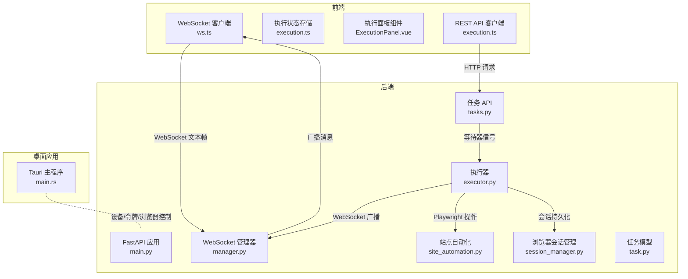
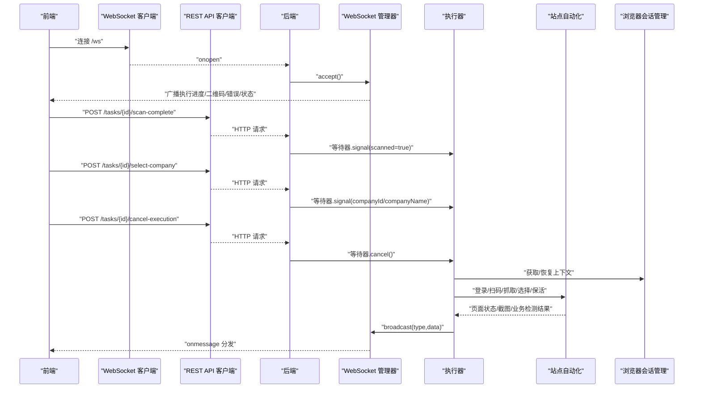
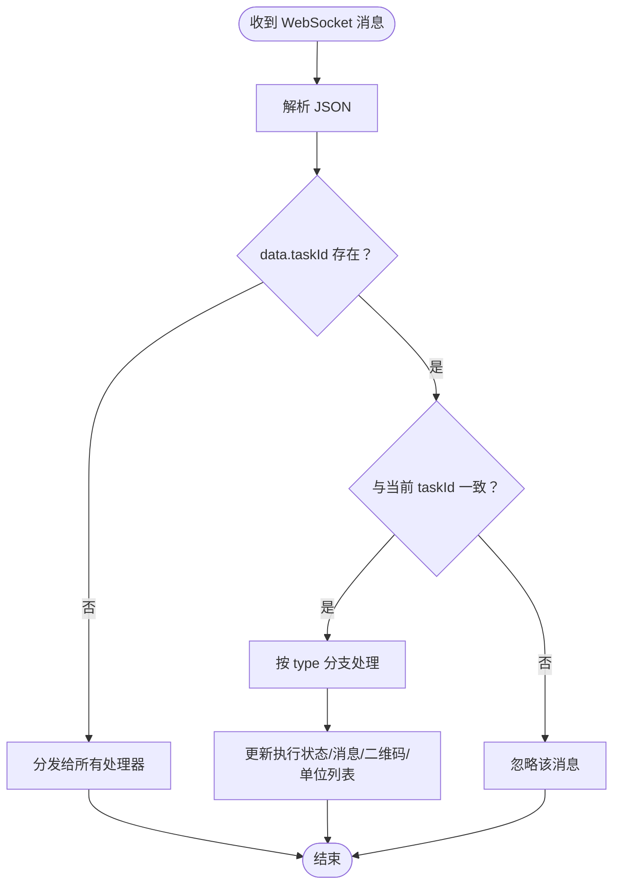
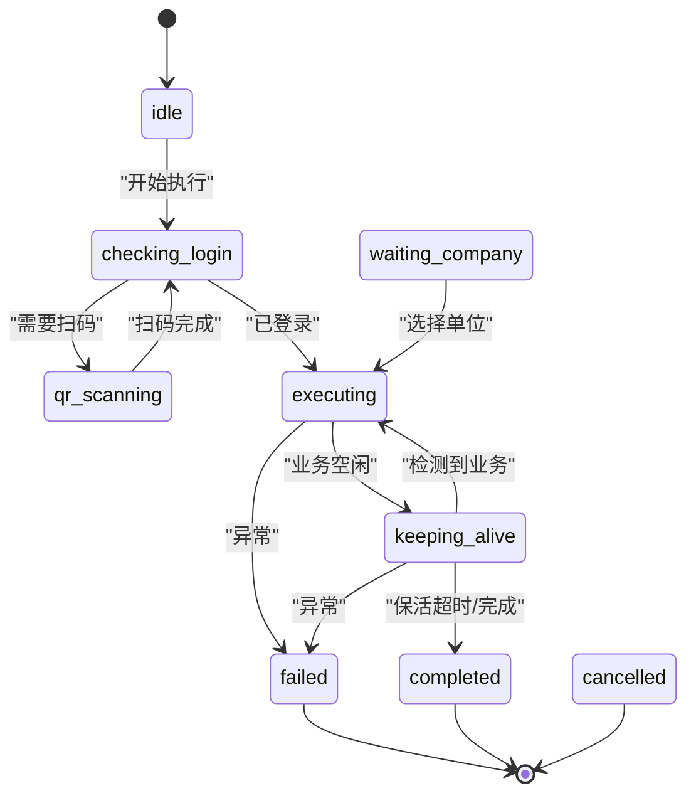
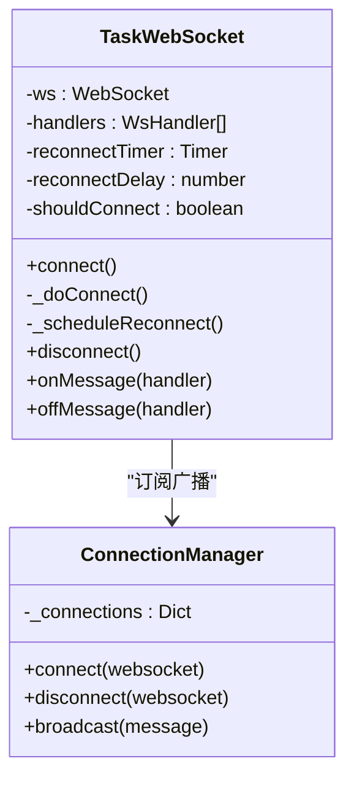
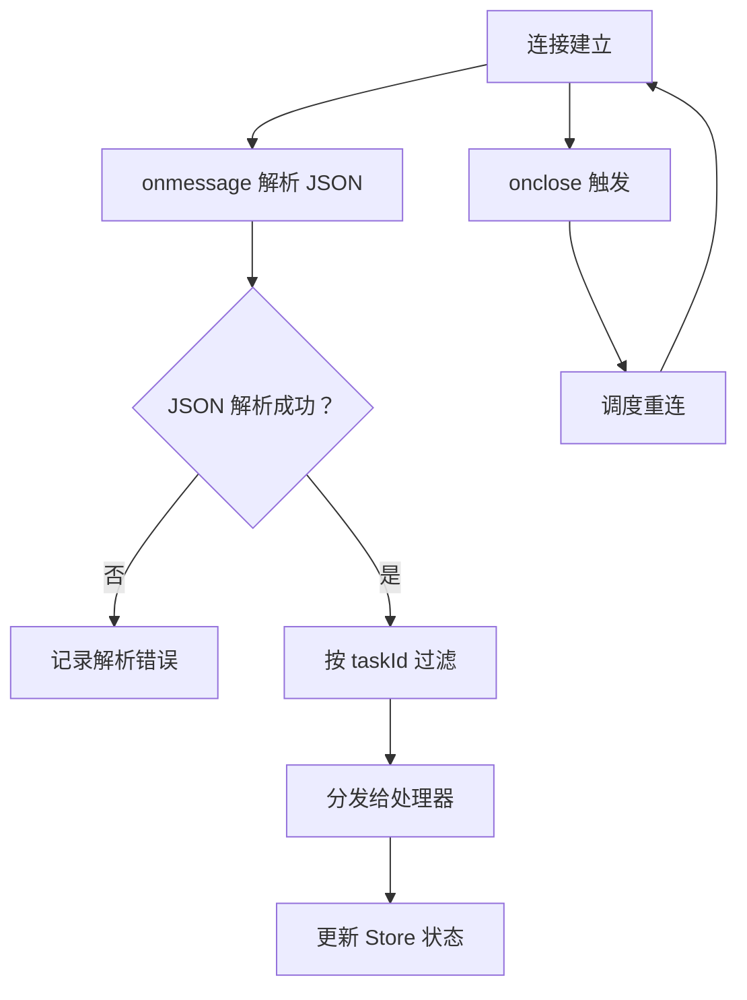
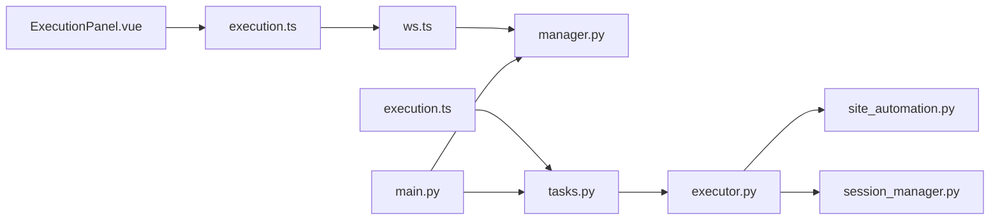
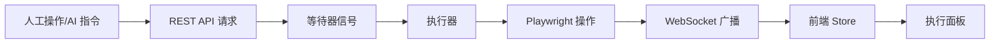

# 双通路消息桥接

<cite>
**本文档引用的文件**
- [ws.ts](file://CCC-BrowserV4/frontend/src/api/ws.ts)
- [execution.ts](file://CCC-BrowserV4/frontend/src/stores/execution.ts)
- [ExecutionPanel.vue](file://CCC-BrowserV4/frontend/src/components/ExecutionPanel.vue)
- [execution.ts](file://CCC-BrowserV4/frontend/src/api/execution.ts)
- [main.py](file://CCC_RPA_API/app/main.py)
- [manager.py](file://CCC_RPA_API/app/ws/manager.py)
- [executor.py](file://CCC_RPA_API/app/services/executor.py)
- [site_automation.py](file://CCC_RPA_API/app/browser/site_automation.py)
- [session_manager.py](file://CCC_RPA_API/app/browser/session_manager.py)
- [tasks.py](file://CCC_RPA_API/app/api/tasks.py)
- [task.py](file://CCC_RPA_API/app/models/task.py)
- [main.rs](file://CCC-BrowserV4/src-tauri/src/main.rs)
</cite>

## 目录
1. [简介](#简介)
2. [项目结构](#项目结构)
3. [核心组件](#核心组件)
4. [架构总览](#架构总览)
5. [详细组件分析](#详细组件分析)
6. [依赖分析](#依赖分析)
7. [性能考虑](#性能考虑)
8. [故障排查指南](#故障排查指南)
9. [结论](#结论)
10. [附录](#附录)

## 简介
本项目实现了一个“双通路消息桥接系统”，用于在人工操作与脚本执行之间建立实时、可靠的消息通道。系统通过以下两条通路协同工作：
- 人工操作到脚本录制：前端通过 WebSocket 实时接收后端广播的状态消息，驱动 UI 状态流转；同时，前端通过 REST API 发起扫码完成、选择单位、取消执行等动作，后端通过等待器（ExecutionWaiter）感知用户输入并推进执行流程。
- 远程脚本到扩展同步：后端执行器在 Playwright 工作线程中执行网页自动化，期间通过 WebSocket 广播执行进度、二维码、错误等事件，前端订阅这些事件以更新面板状态。

此外，系统还支持演示模式，以便在后端不可用时进行手动调试与流程验证。

## 项目结构
项目采用前后端分离架构：
- 前端（Vue + TypeScript + Pinia）：负责 UI、WebSocket 订阅、状态管理与交互。
- 后端（FastAPI）：提供 REST API、WebSocket 广播、任务执行与浏览器会话管理。
- 桌面应用（Tauri）：作为浏览器宿主，提供设备信息、客户端 ID、令牌生成与登录回调服务器等能力。

**图表来源**
- [ws.ts:1-88](file://CCC-BrowserV4/frontend/src/api/ws.ts#L1-L88)
- [execution.ts:1-229](file://CCC-BrowserV4/frontend/src/stores/execution.ts#L1-L229)
- [ExecutionPanel.vue:1-322](file://CCC-BrowserV4/frontend/src/components/ExecutionPanel.vue#L1-L322)
- [execution.ts:1-20](file://CCC-BrowserV4/frontend/src/api/execution.ts#L1-L20)
- [main.py:1-127](file://CCC_RPA_API/app/main.py#L1-L127)
- [manager.py:1-29](file://CCC_RPA_API/app/ws/manager.py#L1-L29)
- [executor.py:1-319](file://CCC_RPA_API/app/services/executor.py#L1-L319)
- [site_automation.py:1-743](file://CCC_RPA_API/app/browser/site_automation.py#L1-L743)
- [session_manager.py:1-186](file://CCC_RPA_API/app/browser/session_manager.py#L1-L186)
- [tasks.py:1-76](file://CCC_RPA_API/app/api/tasks.py#L1-L76)
- [task.py:1-25](file://CCC_RPA_API/app/models/task.py#L1-L25)
- [main.rs:1-29](file://CCC-BrowserV4/src-tauri/src/main.rs#L1-L29)

**章节来源**
- [main.py:119-127](file://CCC_RPA_API/app/main.py#L119-L127)
- [manager.py:1-29](file://CCC_RPA_API/app/ws/manager.py#L1-L29)
- [ws.ts:1-88](file://CCC-BrowserV4/frontend/src/api/ws.ts#L1-L88)
- [execution.ts:1-229](file://CCC-BrowserV4/frontend/src/stores/execution.ts#L1-L229)
- [ExecutionPanel.vue:1-322](file://CCC-BrowserV4/frontend/src/components/ExecutionPanel.vue#L1-L322)
- [execution.ts:1-20](file://CCC-BrowserV4/frontend/src/api/execution.ts#L1-L20)
- [tasks.py:1-76](file://CCC_RPA_API/app/api/tasks.py#L1-L76)
- [executor.py:1-319](file://CCC_RPA_API/app/services/executor.py#L1-L319)
- [site_automation.py:1-743](file://CCC_RPA_API/app/browser/site_automation.py#L1-L743)
- [session_manager.py:1-186](file://CCC_RPA_API/app/browser/session_manager.py#L1-L186)
- [task.py:1-25](file://CCC_RPA_API/app/models/task.py#L1-L25)
- [main.rs:1-29](file://CCC-BrowserV4/src-tauri/src/main.rs#L1-L29)

## 核心组件
- WebSocket 客户端（前端）：封装连接、消息分发、重连逻辑，统一处理后端广播事件。
- 执行状态存储（Pinia Store）：集中管理任务状态、步骤、提示信息、二维码与单位列表，根据事件类型更新 UI。
- 执行面板组件：根据当前步骤渲染不同 UI 片段，支持扫码完成、选择单位、取消执行等交互。
- REST API 客户端：向后端发送扫码完成、选择单位、取消执行等请求，配合等待器推进执行。
- WebSocket 管理器（后端）：维护连接集合，提供广播接口，自动清理无效连接。
- 执行器（后端）：在专用线程池中调度 Playwright 操作，周期性广播执行进度、二维码、错误与任务状态。
- 站点自动化（后端）：封装登录、扫码、单位列表抓取、单位选择、保活与业务检测等页面操作。
- 浏览器会话管理（后端）：按省份管理 Playwright 上下文，持久化 storage_state，提供工作线程安全的执行队列。
- 任务 API（后端）：提供 REST 接口，接收前端动作信号并通过等待器唤醒执行器。
- 任务模型（后端）：描述任务字段，包括状态、省、子任务、时间戳等。
- Tauri 主程序（桌面应用）：提供设备标识、客户端 ID、令牌生成与登录回调服务器等原生能力。

**章节来源**
- [ws.ts:8-88](file://CCC-BrowserV4/frontend/src/api/ws.ts#L8-L88)
- [execution.ts:6-229](file://CCC-BrowserV4/frontend/src/stores/execution.ts#L6-L229)
- [ExecutionPanel.vue:1-322](file://CCC-BrowserV4/frontend/src/components/ExecutionPanel.vue#L1-L322)
- [execution.ts:1-20](file://CCC-BrowserV4/frontend/src/api/execution.ts#L1-L20)
- [manager.py:5-29](file://CCC_RPA_API/app/ws/manager.py#L5-L29)
- [executor.py:22-33](file://CCC_RPA_API/app/services/executor.py#L22-L33)
- [site_automation.py:38-743](file://CCC_RPA_API/app/browser/site_automation.py#L38-L743)
- [session_manager.py:10-186](file://CCC_RPA_API/app/browser/session_manager.py#L10-L186)
- [tasks.py:60-76](file://CCC_RPA_API/app/api/tasks.py#L60-L76)
- [task.py:8-25](file://CCC_RPA_API/app/models/task.py#L8-L25)
- [main.rs:7-28](file://CCC-BrowserV4/src-tauri/src/main.rs#L7-L28)

## 架构总览
系统通过 WebSocket 实现双向消息传递：
- 后端在执行过程中周期性广播事件（如二维码、单位列表、执行进度、错误、任务状态），前端订阅并更新 UI。
- 前端通过 REST API 发送用户动作（扫码完成、选择单位、取消执行），后端通过等待器将信号传递给执行器，推进状态机。

**图表来源**
- [main.py:119-127](file://CCC_RPA_API/app/main.py#L119-L127)
- [manager.py:10-26](file://CCC_RPA_API/app/ws/manager.py#L10-L26)
- [executor.py:78-319](file://CCC_RPA_API/app/services/executor.py#L78-L319)
- [site_automation.py:38-743](file://CCC_RPA_API/app/browser/site_automation.py#L38-L743)
- [session_manager.py:99-126](file://CCC_RPA_API/app/browser/session_manager.py#L99-L126)
- [tasks.py:60-76](file://CCC_RPA_API/app/api/tasks.py#L60-L76)
- [ws.ts:20-56](file://CCC-BrowserV4/frontend/src/api/ws.ts#L20-L56)
- [execution.ts:22-67](file://CCC-BrowserV4/frontend/src/stores/execution.ts#L22-L67)
- [execution.ts:4-19](file://CCC-BrowserV4/frontend/src/api/execution.ts#L4-L19)

## 详细组件分析

### WebSocket 通信协议与消息格式
- 协议：基于 WebSocket 文本帧，消息为 JSON 对象。
- 字段：
  - type: 事件类型（字符串）
  - data: 事件载荷（对象）
- 事件类型与语义：
  - qr_code：推送二维码图片（base64 数据 URL），携带 taskId 与 qrImage。
  - company_list：推送单位列表，携带 taskId 与 companies 数组。
  - execution_progress：执行进度更新，携带 step 与 message。
  - login_result：登录结果，携带 success 与 message。
  - execution_error：执行异常，携带 message。
  - task_status_update：任务状态更新，携带 status、lastResult、lastExecutedAt 等。
- 前端订阅与过滤：
  - 前端 Store 在处理消息时会根据 data.taskId 与当前 taskId 进行匹配，仅处理属于当前任务的消息，避免跨任务干扰。

**图表来源**
- [ws.ts:35-42](file://CCC-BrowserV4/frontend/src/api/ws.ts#L35-L42)
- [execution.ts:22-67](file://CCC-BrowserV4/frontend/src/stores/execution.ts#L22-L67)

**章节来源**
- [ws.ts:1-88](file://CCC-BrowserV4/frontend/src/api/ws.ts#L1-L88)
- [execution.ts:22-67](file://CCC-BrowserV4/frontend/src/stores/execution.ts#L22-L67)

### 事件类型定义与状态同步策略
- 事件类型：
  - qr_code：触发 UI 显示二维码，进入扫码阶段。
  - company_list：触发 UI 展示单位列表，等待用户选择。
  - execution_progress：驱动 UI 显示当前步骤与提示信息。
  - login_result：根据登录结果更新 UI 或进入错误状态。
  - execution_error：捕获异常并更新 UI 为失败。
  - task_status_update：根据任务最终状态更新 UI 为完成或失败。
- 状态同步：
  - 前端 Store 维护 taskId、activeTaskId、step、message、qrImage、companies、selectedCompany 等状态。
  - Store 仅处理与当前 taskId 相关的消息，避免竞态与状态污染。
  - 执行面板根据 step 渲染不同 UI 片段，确保用户可见状态与后端广播一致。

**图表来源**
- [execution.ts:8-229](file://CCC-BrowserV4/frontend/src/stores/execution.ts#L8-L229)
- [ExecutionPanel.vue:1-322](file://CCC-BrowserV4/frontend/src/components/ExecutionPanel.vue#L1-L322)

**章节来源**
- [execution.ts:8-229](file://CCC-BrowserV4/frontend/src/stores/execution.ts#L8-L229)
- [ExecutionPanel.vue:1-322](file://CCC-BrowserV4/frontend/src/components/ExecutionPanel.vue#L1-L322)

### 消息路由与冲突处理
- 路由：
  - 后端通过 ConnectionManager 广播消息至所有连接。
  - 前端通过 TaskWebSocket 订阅消息并分发给所有处理器。
- 冲突处理：
  - 前端 Store 使用 taskId 过滤消息，避免跨任务状态覆盖。
  - 执行器在执行过程中通过等待器（ExecutionWaiter）感知用户动作信号，避免并发写入导致的竞态。
  - 浏览器会话管理器在专用线程中执行 Playwright 操作，避免线程冲突。

**图表来源**
- [ws.ts:8-88](file://CCC-BrowserV4/frontend/src/api/ws.ts#L8-L88)
- [manager.py:5-29](file://CCC_RPA_API/app/ws/manager.py#L5-L29)

**章节来源**
- [ws.ts:8-88](file://CCC-BrowserV4/frontend/src/api/ws.ts#L8-L88)
- [manager.py:5-29](file://CCC_RPA_API/app/ws/manager.py#L5-L29)

### 重连机制与数据一致性
- 重连：
  - 前端 TaskWebSocket 在连接断开时定时重连，指数退避策略可扩展。
  - 后端 WebSocket 端点接受连接并在异常时断开清理。
- 数据一致性：
  - 前端 Store 仅处理与当前 taskId 相关的消息，避免跨任务状态污染。
  - 执行器在执行过程中通过数据库事务记录执行日志与任务状态，确保最终一致性。
  - 浏览器会话通过 storage_state 持久化，异常恢复后可继续执行。

**图表来源**
- [ws.ts:20-64](file://CCC-BrowserV4/frontend/src/api/ws.ts#L20-L64)
- [execution.ts:22-67](file://CCC-BrowserV4/frontend/src/stores/execution.ts#L22-L67)

**章节来源**
- [ws.ts:20-64](file://CCC-BrowserV4/frontend/src/api/ws.ts#L20-L64)
- [execution.ts:22-67](file://CCC-BrowserV4/frontend/src/stores/execution.ts#L22-L67)

### AI 指令到面板展示的消息传递
- 当前代码库未包含 AI 指令解析与执行模块。若需接入 AI 指令，建议：
  - 在后端新增指令解析服务，将自然语言指令映射为标准任务字段（如 province、sub_tasks）。
  - 通过任务 API 创建任务或直接触发执行器，使现有 WebSocket 广播与前端 Store 自动适配。
  - 在前端 Store 中增加对 AI 指令相关事件类型的处理分支，实现面板展示。

[本节为概念性说明，不直接分析具体文件，故无“章节来源”]

## 依赖分析
- 前端依赖：
  - ws.ts 依赖浏览器 WebSocket API，封装连接、消息处理与重连。
  - execution.ts 依赖 Pinia Store，集中管理执行状态。
  - ExecutionPanel.vue 依赖 execution.ts 的状态与方法，渲染 UI。
  - execution.ts 依赖 REST API 客户端，发起用户动作请求。
- 后端依赖：
  - main.py 提供 WebSocket 端点与 CORS 支持，注册路由。
  - manager.py 提供连接管理与广播。
  - executor.py 依赖浏览器会话管理与站点自动化，通过 WebSocket 广播事件。
  - site_automation.py 封装页面操作，提供登录、扫码、单位选择、保活等功能。
  - session_manager.py 提供 Playwright 工作线程与上下文管理。
  - tasks.py 提供 REST API，接收用户动作信号。
  - task.py 定义任务模型字段。

**图表来源**
- [ws.ts:1-88](file://CCC-BrowserV4/frontend/src/api/ws.ts#L1-L88)
- [execution.ts:1-229](file://CCC-BrowserV4/frontend/src/stores/execution.ts#L1-L229)
- [ExecutionPanel.vue:1-322](file://CCC-BrowserV4/frontend/src/components/ExecutionPanel.vue#L1-L322)
- [execution.ts:1-20](file://CCC-BrowserV4/frontend/src/api/execution.ts#L1-L20)
- [main.py:1-127](file://CCC_RPA_API/app/main.py#L1-L127)
- [manager.py:1-29](file://CCC_RPA_API/app/ws/manager.py#L1-L29)
- [executor.py:1-319](file://CCC_RPA_API/app/services/executor.py#L1-L319)
- [site_automation.py:1-743](file://CCC_RPA_API/app/browser/site_automation.py#L1-L743)
- [session_manager.py:1-186](file://CCC_RPA_API/app/browser/session_manager.py#L1-L186)
- [tasks.py:1-76](file://CCC_RPA_API/app/api/tasks.py#L1-L76)

**章节来源**
- [main.py:1-127](file://CCC_RPA_API/app/main.py#L1-L127)
- [manager.py:1-29](file://CCC_RPA_API/app/ws/manager.py#L1-L29)
- [executor.py:1-319](file://CCC_RPA_API/app/services/executor.py#L1-L319)
- [site_automation.py:1-743](file://CCC_RPA_API/app/browser/site_automation.py#L1-L743)
- [session_manager.py:1-186](file://CCC_RPA_API/app/browser/session_manager.py#L1-L186)
- [tasks.py:1-76](file://CCC_RPA_API/app/api/tasks.py#L1-L76)
- [ws.ts:1-88](file://CCC-BrowserV4/frontend/src/api/ws.ts#L1-L88)
- [execution.ts:1-229](file://CCC-BrowserV4/frontend/src/stores/execution.ts#L1-L229)
- [ExecutionPanel.vue:1-322](file://CCC-BrowserV4/frontend/src/components/ExecutionPanel.vue#L1-L322)
- [execution.ts:1-20](file://CCC-BrowserV4/frontend/src/api/execution.ts#L1-L20)

## 性能考虑
- 线程与并发：
  - 后端使用线程池执行耗时操作，避免阻塞主事件循环与 WebSocket 广播。
  - 浏览器操作在专用工作线程中执行，防止与 asyncio 事件循环冲突。
- 连接管理：
  - WebSocket 管理器自动清理无效连接，减少内存泄漏风险。
- 前端渲染：
  - Store 仅处理当前任务消息，降低不必要的 UI 更新。
- I/O 优化：
  - 二维码图片以 base64 数据 URL 传输，减少额外请求。
  - 日志与截图仅在调试场景使用，避免生产环境性能开销。

[本节提供一般性指导，不直接分析具体文件，故无“章节来源”]

## 故障排查指南
- WebSocket 连接问题：
  - 检查前端 TaskWebSocket 的 onerror/onclose 回调与重连逻辑。
  - 确认后端 WebSocket 端点是否正常接受连接。
- 消息未到达：
  - 确认前端 Store 是否正确过滤 taskId。
  - 检查后端广播是否包含正确的 type 与 data。
- 执行异常：
  - 查看 execution_error 事件与任务日志。
  - 检查浏览器会话是否存活，必要时触发恢复。
- 用户动作未生效：
  - 确认 REST API 请求是否成功，等待器是否正确接收信号。

**章节来源**
- [ws.ts:44-55](file://CCC-BrowserV4/frontend/src/api/ws.ts#L44-L55)
- [execution.ts:50-53](file://CCC-BrowserV4/frontend/src/stores/execution.ts#L50-L53)
- [executor.py:286-311](file://CCC_RPA_API/app/services/executor.py#L286-L311)
- [session_manager.py:147-170](file://CCC_RPA_API/app/browser/session_manager.py#L147-L170)
- [tasks.py:60-76](file://CCC_RPA_API/app/api/tasks.py#L60-L76)

## 结论
本双通路消息桥接系统通过 WebSocket 与 REST API 的组合，实现了从前端到后端、从后端到前端的双向消息传递。系统具备完善的连接管理、事件分发与状态同步机制，并通过浏览器会话管理与线程池设计保障了执行稳定性与性能。未来可扩展 AI 指令解析模块，进一步增强自动化能力。

[本节为总结性内容，不直接分析具体文件，故无“章节来源”]

## 附录

### 消息协议规范
- 协议：WebSocket 文本帧，JSON 格式。
- 字段：
  - type: 事件类型（字符串）
  - data: 事件载荷（对象）
- 事件类型与字段：
  - qr_code：{ taskId, qrImage }
  - company_list：{ taskId, companies }
  - execution_progress：{ taskId, step, message }
  - login_result：{ taskId, success, message }
  - execution_error：{ taskId, message }
  - task_status_update：{ taskId, status, lastResult, lastExecutedAt }

**章节来源**
- [ws.ts:1-8](file://CCC-BrowserV4/frontend/src/api/ws.ts#L1-L8)
- [execution.ts:27-65](file://CCC-BrowserV4/frontend/src/stores/execution.ts#L27-L65)
- [executor.py:100-306](file://CCC_RPA_API/app/services/executor.py#L100-L306)

### 桥接流程图（概念）

[本图为概念性流程示意，不直接对应具体源码文件，故无“图表来源”]

### 调试工具使用
- 前端调试：
  - 在 Store 中添加日志输出，观察消息类型与数据。
  - 使用浏览器开发者工具 Network 面板查看 WebSocket 与 HTTP 请求。
- 后端调试：
  - 在执行器中打印关键步骤与异常堆栈。
  - 使用日志记录浏览器会话状态与页面截图路径。
- 桌面应用：
  - 通过 Tauri 原生能力输出日志，辅助定位设备与浏览器控制问题。

**章节来源**
- [execution.ts:31-48](file://CCC-BrowserV4/frontend/src/stores/execution.ts#L31-L48)
- [executor.py:46-69](file://CCC_RPA_API/app/services/executor.py#L46-L69)
- [main.rs:19-25](file://CCC-BrowserV4/src-tauri/src/main.rs#L19-L25)