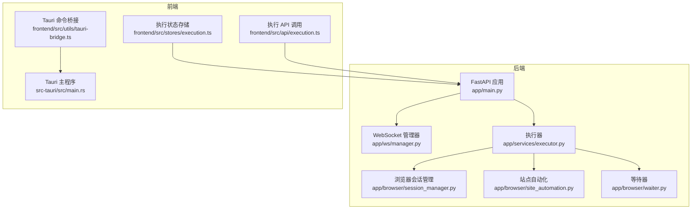
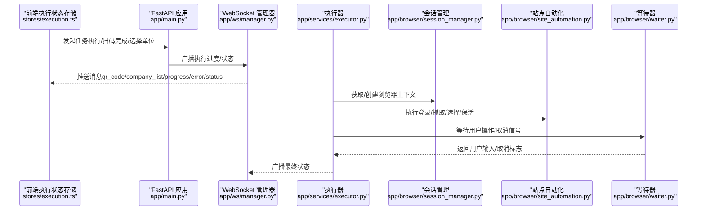
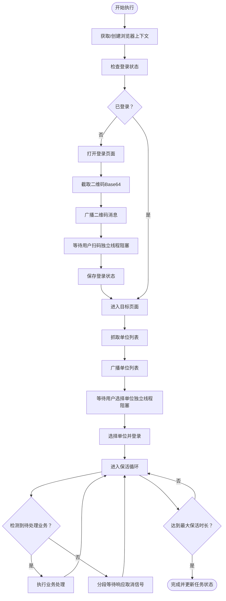
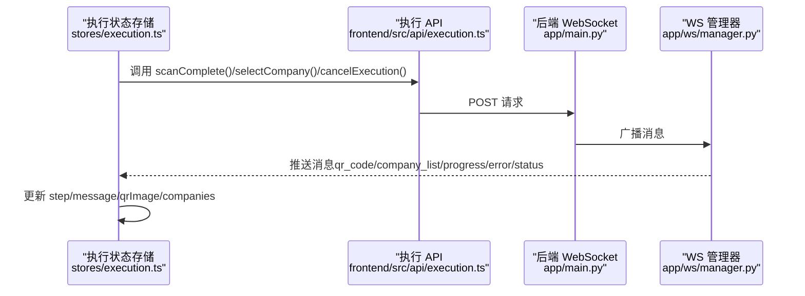
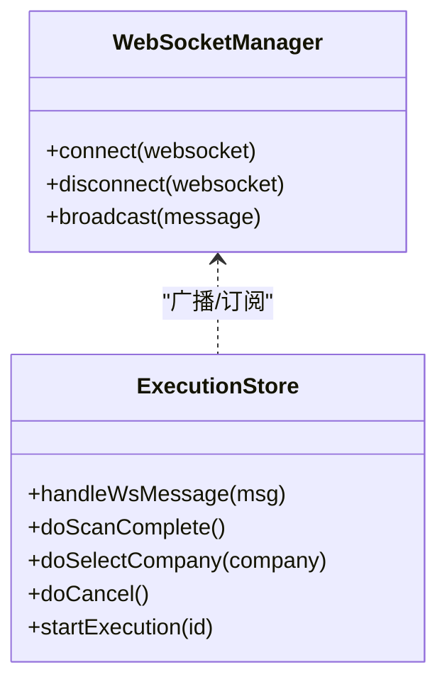
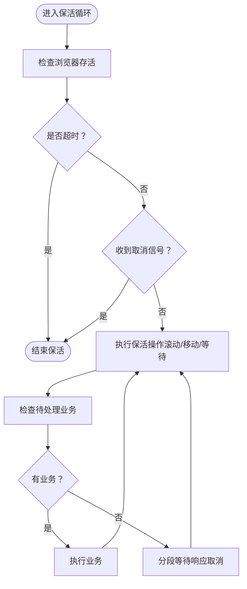
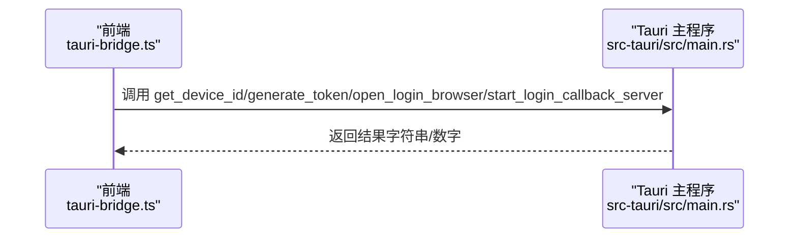
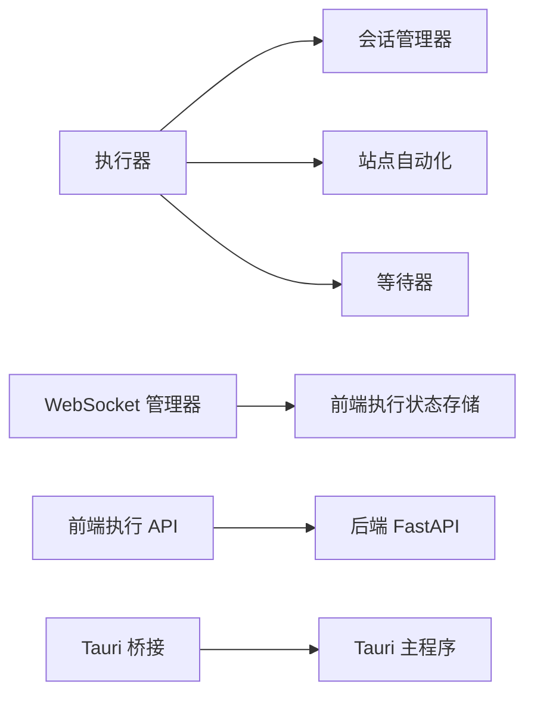

# 层3：双通路控制层

<cite>
**本文档引用的文件**
- [main.py](file://CCC_RPA_API/app/main.py)
- [manager.py](file://CCC_RPA_API/app/ws/manager.py)
- [executor.py](file://CCC_RPA_API/app/services/executor.py)
- [session_manager.py](file://CCC_RPA_API/app/browser/session_manager.py)
- [site_automation.py](file://CCC_RPA_API/app/browser/site_automation.py)
- [waiter.py](file://CCC_RPA_API/app/browser/waiter.py)
- [execution.ts](file://CCC_RPA_API/frontend/src/api/execution.ts)
- [execution.ts](file://CCC-BrowserV4/frontend/src/stores/execution.ts)
- [tauri-bridge.ts](file://CCC-BrowserV4/frontend/src/utils/tauri-bridge.ts)
- [main.rs](file://CCC-BrowserV4/src-tauri/src/main.rs)
- [health.py](file://CCC-BrowserV4/backend/app/api/health.py)
</cite>

## 目录
1. [简介](#简介)
2. [项目结构](#项目结构)
3. [核心组件](#核心组件)
4. [架构总览](#架构总览)
5. [详细组件分析](#详细组件分析)
6. [依赖分析](#依赖分析)
7. [性能考虑](#性能考虑)
8. [故障排查指南](#故障排查指南)
9. [结论](#结论)
10. [附录](#附录)

## 简介
本层聚焦于“双通路控制层”的设计与实现，涵盖两大执行通路：
- Playwright 自动化通路：基于浏览器自动化执行业务流程，适用于无人值守的远程脚本执行。
- Chrome V3 扩展可视化通路：通过桌面应用（Tauri + Vue）提供扩展面板的人工操作界面，实现扫码登录、单位选择等交互。

双通路通过统一的消息桥接与任务编排实现协同：Playwright 侧负责自动化执行与状态广播，前端侧负责用户交互与状态同步；二者通过 WebSocket 实时通信，形成“自动化+人工干预”的混合控制模式。同时，系统内置等待/信号机制，确保在保活循环中能及时响应用户操作与取消信号。

## 项目结构
双通路控制层横跨后端 Python API 与前端桌面应用两部分：
- 后端（FastAPI + Playwright）：提供任务执行、浏览器会话管理、WebSocket 广播与业务自动化逻辑。
- 前端（Vue + Tauri）：提供扩展面板 UI、与后端的 WebSocket 通信、与原生命令的桥接。



图表来源
- [main.py:1-127](file://CCC_RPA_API/app/main.py#L1-L127)
- [manager.py:1-29](file://CCC_RPA_API/app/ws/manager.py#L1-L29)
- [executor.py:1-319](file://CCC_RPA_API/app/services/executor.py#L1-L319)
- [session_manager.py:1-186](file://CCC_RPA_API/app/browser/session_manager.py#L1-L186)
- [site_automation.py:1-743](file://CCC_RPA_API/app/browser/site_automation.py#L1-L743)
- [waiter.py:1-84](file://CCC_RPA_API/app/browser/waiter.py#L1-L84)
- [execution.ts:1-229](file://CCC-BrowserV4/frontend/src/stores/execution.ts#L1-L229)
- [execution.ts:1-20](file://CCC-RPA_API/frontend/src/api/execution.ts#L1-L20)
- [tauri-bridge.ts:1-33](file://CCC-BrowserV4/frontend/src/utils/tauri-bridge.ts#L1-L33)
- [main.rs:1-29](file://CCC-BrowserV4/src-tauri/src/main.rs#L1-L29)

章节来源
- [main.py:1-127](file://CCC_RPA_API/app/main.py#L1-L127)
- [execution.ts:1-229](file://CCC-BrowserV4/frontend/src/stores/execution.ts#L1-L229)

## 核心组件
- WebSocket 管理器：集中维护连接、广播消息，保证前后端状态同步。
- 执行器：封装任务执行流程，协调浏览器会话、扫码登录、单位选择、保活循环与业务处理。
- 浏览器会话管理：以省份维度管理 Playwright 上下文，提供线程安全的异步执行队列。
- 站点自动化：针对特定站点的页面元素识别与交互策略，含多种降级与回退方案。
- 等待器：基于线程事件的阻塞/非阻塞等待机制，支持取消与超时。
- 前端执行状态存储：接收并解析后端广播消息，驱动 UI 状态流转。
- Tauri 命令桥接：提供设备标识、令牌生成、浏览器打开等原生能力调用。

章节来源
- [manager.py:1-29](file://CCC_RPA_API/app/ws/manager.py#L1-L29)
- [executor.py:1-319](file://CCC_RPA_API/app/services/executor.py#L1-L319)
- [session_manager.py:1-186](file://CCC_RPA_API/app/browser/session_manager.py#L1-L186)
- [site_automation.py:1-743](file://CCC_RPA_API/app/browser/site_automation.py#L1-L743)
- [waiter.py:1-84](file://CCC_RPA_API/app/browser/waiter.py#L1-L84)
- [execution.ts:1-229](file://CCC-BrowserV4/frontend/src/stores/execution.ts#L1-L229)
- [tauri-bridge.ts:1-33](file://CCC-BrowserV4/frontend/src/utils/tauri-bridge.ts#L1-L33)

## 架构总览
双通路控制层的总体架构围绕“任务执行”这一核心闭环展开：前端发起任务执行请求，后端通过 WebSocket 推送执行进度与状态；Playwright 在专用工作线程中执行页面自动化，必要时与前端进行人工交互（扫码登录、单位选择）。系统通过等待器与保活循环实现“自动化+人工干预”的协同。



图表来源
- [execution.ts:1-229](file://CCC-BrowserV4/frontend/src/stores/execution.ts#L1-L229)
- [main.py:119-127](file://CCC_RPA_API/app/main.py#L119-L127)
- [manager.py:1-29](file://CCC_RPA_API/app/ws/manager.py#L1-L29)
- [executor.py:1-319](file://CCC_RPA_API/app/services/executor.py#L1-L319)
- [session_manager.py:1-186](file://CCC_RPA_API/app/browser/session_manager.py#L1-L186)
- [site_automation.py:1-743](file://CCC_RPA_API/app/browser/site_automation.py#L1-L743)
- [waiter.py:1-84](file://CCC_RPA_API/app/browser/waiter.py#L1-L84)

## 详细组件分析

### 组件A：Playwright 自动化执行通路
该通路由执行器驱动，结合浏览器会话管理与站点自动化策略，实现从登录到业务处理的全流程自动化。



图表来源
- [executor.py:78-315](file://CCC_RPA_API/app/services/executor.py#L78-L315)
- [session_manager.py:98-126](file://CCC_RPA_API/app/browser/session_manager.py#L98-L126)
- [site_automation.py:38-540](file://CCC_RPA_API/app/browser/site_automation.py#L38-L540)
- [waiter.py:14-84](file://CCC_RPA_API/app/browser/waiter.py#L14-L84)

章节来源
- [executor.py:78-315](file://CCC_RPA_API/app/services/executor.py#L78-L315)
- [session_manager.py:98-126](file://CCC_RPA_API/app/browser/session_manager.py#L98-L126)
- [site_automation.py:38-540](file://CCC_RPA_API/app/browser/site_automation.py#L38-L540)
- [waiter.py:14-84](file://CCC_RPA_API/app/browser/waiter.py#L14-L84)

### 组件B：Chrome V3 扩展可视化通路
前端通过执行状态存储监听后端广播消息，驱动 UI 状态流转；同时通过 API 调用与后端交互，实现扫码完成、单位选择与取消执行。



图表来源
- [execution.ts:69-121](file://CCC-BrowserV4/frontend/src/stores/execution.ts#L69-L121)
- [execution.ts:1-20](file://CCC-RPA_API/frontend/src/api/execution.ts#L1-L20)
- [main.py:119-127](file://CCC_RPA_API/app/main.py#L119-L127)
- [manager.py:17-26](file://CCC_RPA_API/app/ws/manager.py#L17-L26)

章节来源
- [execution.ts:69-121](file://CCC-BrowserV4/frontend/src/stores/execution.ts#L69-L121)
- [execution.ts:1-20](file://CCC-RPA_API/frontend/src/api/execution.ts#L1-L20)
- [main.py:119-127](file://CCC_RPA_API/app/main.py#L119-L127)
- [manager.py:17-26](file://CCC_RPA_API/app/ws/manager.py#L17-L26)

### 组件C：消息桥接与状态同步
- 后端通过 WebSocket 管理器向所有连接广播消息，前端执行状态存储根据消息类型更新 UI。
- 执行器在关键节点广播执行进度、二维码、单位列表、错误与任务状态更新。
- 前端执行状态存储仅处理与当前任务 ID 相关的消息，避免状态污染。



图表来源
- [manager.py:1-29](file://CCC_RPA_API/app/ws/manager.py#L1-L29)
- [execution.ts:22-67](file://CCC-BrowserV4/frontend/src/stores/execution.ts#L22-L67)

章节来源
- [manager.py:1-29](file://CCC_RPA_API/app/ws/manager.py#L1-L29)
- [execution.ts:22-67](file://CCC-BrowserV4/frontend/src/stores/execution.ts#L22-L67)

### 组件D：等待器与保活循环
- 等待器提供阻塞等待与非阻塞检查能力，支持超时与取消。
- 保活循环在页面上执行轻量级随机动作，不改变页面导航，周期性检查待处理业务并执行。



图表来源
- [executor.py:208-266](file://CCC_RPA_API/app/services/executor.py#L208-L266)
- [waiter.py:56-69](file://CCC_RPA_API/app/browser/waiter.py#L56-L69)
- [site_automation.py:614-680](file://CCC_RPA_API/app/browser/site_automation.py#L614-L680)

章节来源
- [executor.py:208-266](file://CCC_RPA_API/app/services/executor.py#L208-L266)
- [waiter.py:56-69](file://CCC_RPA_API/app/browser/waiter.py#L56-L69)
- [site_automation.py:614-680](file://CCC_RPA_API/app/browser/site_automation.py#L614-L680)

### 组件E：Tauri 原生能力桥接
- 前端通过 Tauri 桥接调用原生命令，实现设备标识获取、令牌生成、浏览器打开与回调服务器启动等能力。
- Tauri 主程序注册命令处理器，初始化设备存储。



图表来源
- [tauri-bridge.ts:1-33](file://CCC-BrowserV4/frontend/src/utils/tauri-bridge.ts#L1-L33)
- [main.rs:12-26](file://CCC-BrowserV4/src-tauri/src/main.rs#L12-L26)

章节来源
- [tauri-bridge.ts:1-33](file://CCC-BrowserV4/frontend/src/utils/tauri-bridge.ts#L1-L33)
- [main.rs:12-26](file://CCC-BrowserV4/src-tauri/src/main.rs#L12-L26)

## 依赖分析
- 后端模块耦合清晰：执行器依赖会话管理器与站点自动化；WebSocket 管理器独立于业务逻辑，仅负责广播。
- 前端与后端通过 WebSocket 解耦：前端仅依赖消息协议，不关心后端实现细节。
- Tauri 与前端通过桥接模块解耦：前端只调用桥接方法，不直接接触原生命令。



图表来源
- [executor.py:1-319](file://CCC_RPA_API/app/services/executor.py#L1-L319)
- [session_manager.py:1-186](file://CCC_RPA_API/app/browser/session_manager.py#L1-L186)
- [site_automation.py:1-743](file://CCC_RPA_API/app/browser/site_automation.py#L1-L743)
- [waiter.py:1-84](file://CCC_RPA_API/app/browser/waiter.py#L1-L84)
- [manager.py:1-29](file://CCC_RPA_API/app/ws/manager.py#L1-L29)
- [execution.ts:1-229](file://CCC-BrowserV4/frontend/src/stores/execution.ts#L1-L229)
- [execution.ts:1-20](file://CCC-RPA_API/frontend/src/api/execution.ts#L1-L20)
- [tauri-bridge.ts:1-33](file://CCC-BrowserV4/frontend/src/utils/tauri-bridge.ts#L1-L33)
- [main.rs:1-29](file://CCC-BrowserV4/src-tauri/src/main.rs#L1-L29)

章节来源
- [executor.py:1-319](file://CCC_RPA_API/app/services/executor.py#L1-L319)
- [manager.py:1-29](file://CCC_RPA_API/app/ws/manager.py#L1-L29)
- [execution.ts:1-229](file://CCC-BrowserV4/frontend/src/stores/execution.ts#L1-L229)
- [tauri-bridge.ts:1-33](file://CCC-BrowserV4/frontend/src/utils/tauri-bridge.ts#L1-L33)

## 性能考虑
- 线程隔离与队列执行：浏览器操作在专用工作线程中执行，避免与 asyncio 事件循环冲突，提升稳定性。
- 分段等待与取消响应：保活循环采用分段等待，能快速响应取消信号，减少资源占用。
- 降级与回退策略：站点自动化包含多级选择器与回退方案，提高页面适配能力，降低失败率。
- WebSocket 广播去重：广播时清理无效连接，避免消息风暴。

## 故障排查指南
- 浏览器会话异常：检查会话管理器的存活检测与恢复逻辑，确认 storage_state 文件是否存在。
- 扫码登录超时：检查前端等待器超时配置与后端等待时间，确认网络与二维码生成是否正常。
- 单位选择失败：核对站点自动化的选择器策略与页面元素变化，必要时启用 JS 回退方案。
- WebSocket 断连：检查连接管理器的断开清理逻辑，确认前端是否正确过滤 taskId 相关消息。
- Tauri 命令失败：检查命令注册与权限配置，确认设备存储初始化是否成功。

章节来源
- [session_manager.py:147-170](file://CCC_RPA_API/app/browser/session_manager.py#L147-L170)
- [site_automation.py:294-540](file://CCC_RPA_API/app/browser/site_automation.py#L294-L540)
- [manager.py:14-26](file://CCC_RPA_API/app/ws/manager.py#L14-L26)
- [tauri-bridge.ts:1-33](file://CCC-BrowserV4/frontend/src/utils/tauri-bridge.ts#L1-L33)

## 结论
双通路控制层通过“Playwright 自动化通路 + Chrome V3 扩展可视化通路”的组合，实现了远程脚本执行与人工干预的无缝衔接。系统以 WebSocket 为纽带，将后端执行器与前端 UI 紧密耦合，同时通过等待器与保活循环保障了长时间运行的稳定性与可控性。该架构既满足了无人值守的高效执行需求，又保留了人工介入的灵活性，适合复杂业务场景下的混合控制。

## 附录

### 双通路架构图（概念示意）
```mermaid
graph TB
subgraph "自动化通路"
PW["Playwright 浏览器"]
EX["执行器"]
SM["会话管理器"]
SA["站点自动化"]
end
subgraph "可视化通路"
UI["扩展面板 UI"]
Store["执行状态存储"]
API["执行 API"]
end
EX --> PW
PW --> SA
EX --> SM
API --> EX
Store --> UI
Store <- --> EX
```

[此图为概念示意，无需图表来源]

### 消息协议规范（WebSocket）
- 类型：字符串
- 数据：JSON 对象，包含 type 与 data 字段
- 常见消息类型：
  - qr_code：推送二维码（Base64），用于扫码登录
  - company_list：推送单位列表，用于人工选择
  - execution_progress：执行进度更新
  - login_result：登录结果反馈
  - execution_error：执行异常
  - task_status_update：任务状态更新（完成/失败）

章节来源
- [manager.py:17-26](file://CCC_RPA_API/app/ws/manager.py#L17-L26)
- [execution.ts:27-66](file://CCC-BrowserV4/frontend/src/stores/execution.ts#L27-L66)

### 集成示例（步骤说明）
- 启动后端服务与 WebSocket
  - 启动 FastAPI 应用，注册路由与 WebSocket 端点
  - 初始化数据库与迁移字段
- 启动前端桌面应用
  - 初始化 Tauri 命令与设备存储
  - 订阅 WebSocket 消息并更新 UI
- 提交流程
  - 前端调用执行 API（扫码完成/选择单位/取消执行）
  - 后端广播消息至前端
  - 前端根据消息类型更新执行状态

章节来源
- [main.py:30-127](file://CCC_RPA_API/app/main.py#L30-L127)
- [execution.ts:69-121](file://CCC-BrowserV4/frontend/src/stores/execution.ts#L69-L121)
- [tauri-bridge.ts:1-33](file://CCC-BrowserV4/frontend/src/utils/tauri-bridge.ts#L1-L33)