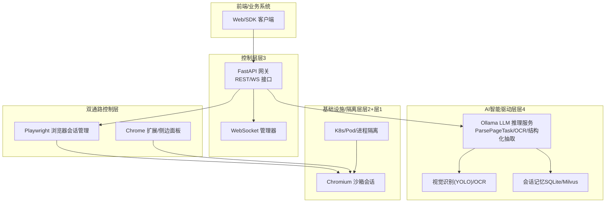
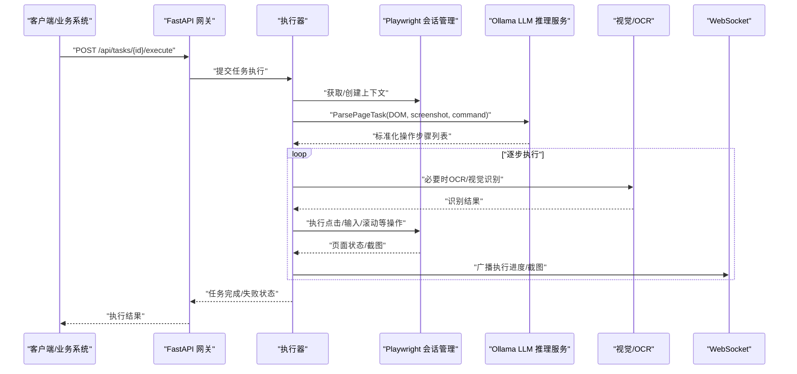
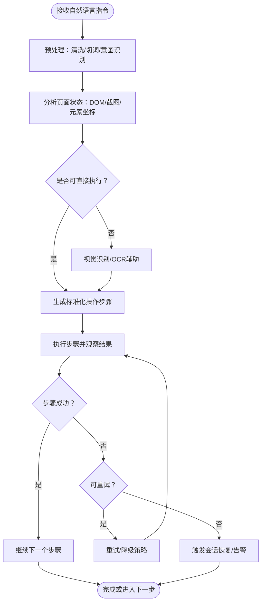
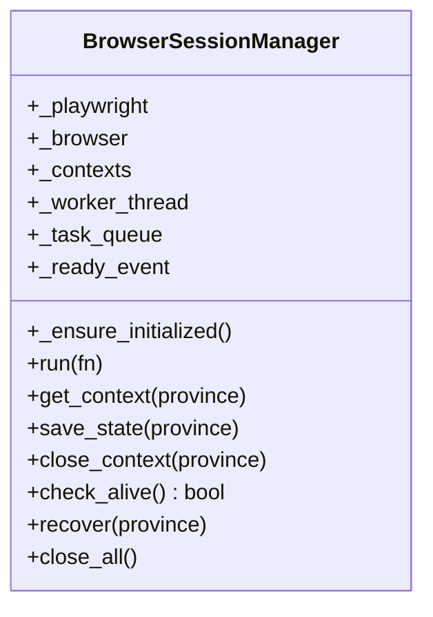
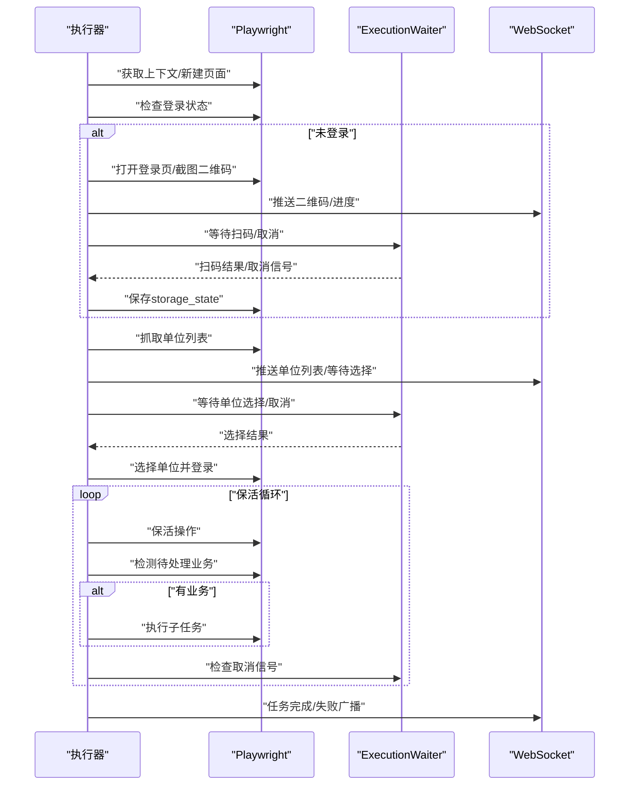
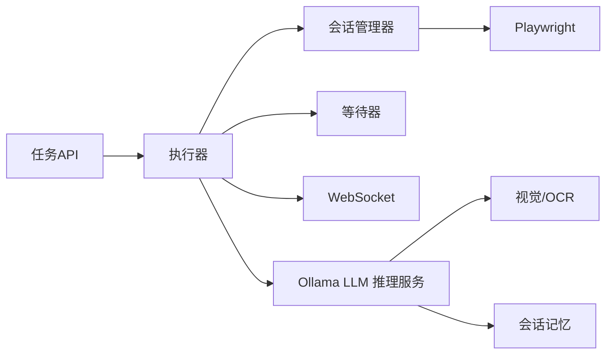

# LLM推理引擎

<cite>
**本文引用的文件**
- [project.md](file://project.md)
- [executor.py](file://CCC_RPA_API/app/services/executor.py)
- [session_manager.py](file://CCC_RPA_API/app/browser/session_manager.py)
- [site_automation.py](file://CCC_RPA_API/app/browser/site_automation.py)
- [human_behavior.py](file://CCC_RPA_API/app/browser/human_behavior.py)
- [waiter.py](file://CCC_RPA_API/app/browser/waiter.py)
- [tasks.py](file://CCC_RPA_API/app/api/tasks.py)
- [task.py](file://CCC_RPA_API/app/services/task.py)
- [main.py](file://CCC_RPA_API/app/main.py)
</cite>

## 目录
1. [简介](#简介)
2. [项目结构](#项目结构)
3. [核心组件](#核心组件)
4. [架构总览](#架构总览)
5. [详细组件分析](#详细组件分析)
6. [依赖关系分析](#依赖关系分析)
7. [性能考量](#性能考量)
8. [故障排查指南](#故障排查指南)
9. [结论](#结论)
10. [附录](#附录)

## 简介
本文件面向“LLM推理引擎”的实现与集成，聚焦于基于Ollama的本地大模型推理服务、自然语言指令解析与标准化操作序列生成。文档以仓库现有代码为基础，梳理推理引擎在系统中的定位、关键组件职责、数据与控制流、错误处理与重试策略，并给出接口规范、调用示例与性能基准建议，帮助开发者快速理解与集成。

## 项目结构
本项目为“商用级AI浏览器系统”，其中AI智能驱动微服务层（AgentC）包含Ollama LLM推理服务、视觉识别与结构化抽取等能力。LLM推理引擎位于三层控制层与Chromium沙箱之间，负责将自然语言浏览指令转化为可执行的Playwright操作序列，并在执行过程中进行自适应决策与失败重试。

**图表来源**
- [project.md: 383-412:383-412](file://project.md#L383-L412)
- [main.py: 12-27:12-27](file://CCC_RPA_API/app/main.py#L12-L27)
- [tasks.py: 10](file://CCC_RPA_API/app/api/tasks.py#L10)

**章节来源**
- [project.md: 383-412:383-412](file://project.md#L383-L412)
- [project.md: 445-480:445-480](file://project.md#L445-L480)

## 核心组件
- LLM推理服务（基于Ollama）
  - 职责：接收自然语言浏览指令，结合页面DOM/截图，解析为标准化Playwright操作步骤；支持自适应流程与失败重试；提供OCR与结构化抽取能力。
  - 与系统集成：通过GRPC方法暴露（ParsePageTask、OCRImage、ExtractStructData）。
- Playwright浏览器会话管理
  - 职责：在专用工作线程中启动Chromium，维护多省上下文，持久化storage_state，提供线程安全的执行队列。
- 自动化执行器
  - 职责：按任务编排执行，处理扫码登录、单位选择、业务保活与触发、异常恢复与广播。
- 人类行为模拟
  - 职责：模拟真实用户点击、输入、滚动与等待，降低被WZWS检测的风险。
- 等待与信号机制
  - 职责：在用户交互（扫码、单位选择）与任务取消场景中实现阻塞等待与非阻塞检查。
- WebSocket广播
  - 职责：将执行进度、截图、错误与状态推送到前端，支撑可视化与人工干预。

**章节来源**
- [project.md: 385-394:385-394](file://project.md#L385-L394)
- [session_manager.py: 10-186:10-186](file://CCC_RPA_API/app/browser/session_manager.py#L10-L186)
- [executor.py: 78-315:78-315](file://CCC_RPA_API/app/services/executor.py#L78-L315)
- [human_behavior.py: 12-86:12-86](file://CCC_RPA_API/app/browser/human_behavior.py#L12-L86)
- [waiter.py: 7-84:7-84](file://CCC_RPA_API/app/browser/waiter.py#L7-L84)

## 架构总览
LLM推理引擎在系统中的作用是将自然语言指令转化为可执行的浏览器操作序列，并在执行过程中与浏览器会话管理、视觉识别、记忆模块协同工作。整体流程如下：

**图表来源**
- [tasks.py: 47-52:47-52](file://CCC_RPA_API/app/api/tasks.py#L47-L52)
- [executor.py: 78-315:78-315](file://CCC_RPA_API/app/services/executor.py#L78-L315)
- [session_manager.py: 80-96:80-96](file://CCC_RPA_API/app/browser/session_manager.py#L80-L96)
- [project.md: 467-474:467-474](file://project.md#L467-L474)

## 详细组件分析

### LLM推理服务（基于Ollama）
- 模型封装与推理接口
  - 通过GRPC方法提供ParsePageTask、OCRImage、ExtractStructData，统一接收页面DOM、截图与用户指令，输出标准化操作步骤与结构化数据。
  - 支持GPU/CPU双模式：在具备CUDA的环境中优先使用GPU加速，否则回退至CPU离线推理。
- 指令解析与操作序列生成
  - 将自然语言指令映射为Playwright操作步骤，包含点击、输入、滚动、等待、截图等。
  - 在页面跳转、弹窗、验证码等场景下进行自适应决策，必要时插入OCR识别与视觉检测。
- 失败重试与自愈
  - 针对单步骤失败，执行局部重试与降级策略；若浏览器异常，触发会话恢复并重新打开目标页面。
- 记忆与上下文
  - 每个会话绑定独立AI记忆上下文，租户之间完全隔离，支持短期记忆与结构化知识检索。

**图表来源**
- [project.md: 387-393:387-393](file://project.md#L387-L393)
- [site_automation.py: 682-735:682-735](file://CCC_RPA_API/app/browser/site_automation.py#L682-L735)

**章节来源**
- [project.md: 385-394:385-394](file://project.md#L385-L394)
- [project.md: 467-474:467-474](file://project.md#L467-L474)

### Playwright会话管理（BrowserSessionManager）
- 专用工作线程与任务队列
  - 在独立线程中启动Playwright与Chromium，所有Playwright操作通过队列投递，避免与异步事件循环冲突。
- 上下文管理与持久化
  - 按省份维护BrowserContext，自动加载storage_state，支持UA/视口设置与反检测脚本注入。
- 健康检查与恢复
  - 提供check_alive与recover接口，异常时重建浏览器与上下文，确保任务连续性。

**图表来源**
- [session_manager.py: 10-186:10-186](file://CCC_RPA_API/app/browser/session_manager.py#L10-L186)

**章节来源**
- [session_manager.py: 10-186:10-186](file://CCC_RPA_API/app/browser/session_manager.py#L10-L186)

### 自动化执行器（executor）
- 任务编排与状态广播
  - 通过线程池提交任务执行逻辑，使用WebSocket广播执行进度、截图与错误信息。
- 登录与单位选择流程
  - 检查登录状态，若未登录则引导扫码登录并保存storage_state；随后抓取单位列表并等待用户选择。
- 保活与业务触发
  - 在长时间运行中执行页面保活操作，检测待处理业务并触发相应子任务。
- 异常恢复与重试
  - 检测浏览器异常，触发恢复流程并重新打开目标页面；对单步骤失败执行重试。

**图表来源**
- [executor.py: 78-315:78-315](file://CCC_RPA_API/app/services/executor.py#L78-L315)
- [site_automation.py: 38-58:38-58](file://CCC_RPA_API/app/browser/site_automation.py#L38-L58)
- [site_automation.py: 194-291:194-291](file://CCC_RPA_API/app/browser/site_automation.py#L194-L291)
- [site_automation.py: 557-680:557-680](file://CCC_RPA_API/app/browser/site_automation.py#L557-L680)

**章节来源**
- [executor.py: 78-315:78-315](file://CCC_RPA_API/app/services/executor.py#L78-L315)

### 人类行为模拟（HumanBehavior）
- 真人行为策略
  - 点击：鼠标移动到元素中心附近并随机步数移动后点击；输入：逐字符输入并随机延迟；滚动：随机滚轮像素；等待：随机等待时长。
- 与LLM的关系
  - 通过模拟人类行为降低被WZWS检测的概率，保证LLM生成的操作序列在真实页面上的成功率。

**章节来源**
- [human_behavior.py: 12-86:12-86](file://CCC_RPA_API/app/browser/human_behavior.py#L12-L86)

### 等待与信号机制（ExecutionWaiter）
- 阻塞等待与非阻塞检查
  - 提供wait_for、signal、cancel、check_signal等方法，支持扫码登录、单位选择等交互场景的异步协调。
- 保活循环中的应用
  - 在长时间保活中分段等待，以便及时响应取消信号。

**章节来源**
- [waiter.py: 7-84:7-84](file://CCC_RPA_API/app/browser/waiter.py#L7-L84)

### API与WebSocket（FastAPI）
- REST接口
  - 提供任务列表、创建、执行、日志查询与交互信号接口（扫码完成、选择单位、取消执行）。
- WebSocket
  - 统一推送执行进度、截图、错误与状态，支撑前端可视化与人工干预。

**章节来源**
- [tasks.py: 13-76:13-76](file://CCC_RPA_API/app/api/tasks.py#L13-L76)
- [main.py: 12-27:12-27](file://CCC_RPA_API/app/main.py#L12-L27)
- [main.py: 119-127:119-127](file://CCC_RPA_API/app/main.py#L119-L127)

## 依赖关系分析
- 组件耦合
  - 执行器依赖会话管理器（BrowserSessionManager）与等待器（ExecutionWaiter），并通过WebSocket广播状态。
  - 会话管理器依赖Playwright同步API，通过专用线程隔离浏览器操作。
  - LLM推理服务通过GRPC与视觉/OCR模块协作，提供标准化输出供执行器使用。
- 外部依赖
  - Ollama本地推理、Playwright浏览器、Redis（任务队列）、PostgreSQL（任务与日志）、Prometheus/Grafana（监控）。

**图表来源**
- [tasks.py: 47-52:47-52](file://CCC_RPA_API/app/api/tasks.py#L47-L52)
- [executor.py: 12-33:12-33](file://CCC_RPA_API/app/services/executor.py#L12-L33)
- [session_manager.py: 80-96:80-96](file://CCC_RPA_API/app/browser/session_manager.py#L80-L96)
- [project.md: 467-474:467-474](file://project.md#L467-L474)

**章节来源**
- [project.md: 445-480:445-480](file://project.md#L445-L480)

## 性能考量
- 推理延迟
  - 本地7B模型单条自然语言指令推理响应耗时应≤1.5s（统一非功能需求）。
- 并发与吞吐
  - API网关单接口QPS≥100，WebSocket长连接同时在线≥1000路。
- 浏览器操作延迟
  - CDP页面操作指令执行延迟≤200ms。
- 优化建议
  - 使用GPU加速（CUDA 12）优先；对高频操作步骤进行缓存与复用；合理设置保活间隔与重试退避；在WebSocket广播中合并消息减少抖动。

**章节来源**
- [project.md: 506-516:506-516](file://project.md#L506-L516)
- [project.md: 550](file://project.md#L550)

## 故障排查指南
- 浏览器异常
  - 现象：页面崩溃、CDP断连、浏览器关闭。
  - 处理：执行器检测后触发会话恢复，重建上下文并重新打开目标页面；必要时保存检查点截图用于调试。
- 扫码/选择超时
  - 现象：扫码等待超时或用户取消。
  - 处理：等待器抛出超时异常并回传错误；前端可重新发起扫码或取消任务。
- 登录状态异常
  - 现象：storage_state失效或页面结构变化导致登录失败。
  - 处理：重新扫码登录并保存storage_state；对页面元素选择器进行降级策略。
- OCR/视觉识别失败
  - 现象：验证码/元素识别失败。
  - 处理：降级为整页截图或使用JS回退匹配；必要时提示人工介入。

**章节来源**
- [executor.py: 42-69:42-69](file://CCC_RPA_API/app/services/executor.py#L42-L69)
- [executor.py: 133-140:133-140](file://CCC_RPA_API/app/services/executor.py#L133-L140)
- [site_automation.py: 148-173:148-173](file://CCC_RPA_API/app/browser/site_automation.py#L148-L173)
- [site_automation.py: 286-291:286-291](file://CCC_RPA_API/app/browser/site_automation.py#L286-L291)

## 结论
本LLM推理引擎以Ollama为核心，结合Playwright浏览器会话管理、视觉识别与人类行为模拟，实现了从自然语言到标准化操作序列的闭环。通过严格的错误恢复、自适应决策与失败重试机制，保障了在复杂网页场景下的稳定性与鲁棒性。开发者可基于现有GRPC接口与WebSocket协议快速集成，并遵循统一的性能与安全标准。

## 附录

### 推理接口规范（GRPC）
- 方法
  - ParsePageTask：输入DOM、screenshot、userCommand，输出Playwright操作步骤列表。
  - OCRImage：输入图像buffer，输出识别文本。
  - ExtractStructData：输入DOM与抽取规则JSON，输出结构化数据。
- 参数与返回
  - 统一字段与数据类型由GRPC定义，确保前后端一致性。
- 调用示例（伪代码）
  - 调用ParsePageTask获取操作序列后，依次在Playwright上下文中执行；必要时调用OCRImage与ExtractStructData进行辅助决策。

**章节来源**
- [project.md: 467-474:467-474](file://project.md#L467-L474)

### 推理接口规范（HTTP/WS）
- REST接口
  - POST /api/tasks/{id}/execute：提交任务执行。
  - GET /api/tasks/{id}/logs：获取任务执行日志。
  - POST /api/tasks/{id}/scan-complete：扫码完成信号。
  - POST /api/tasks/{id}/select-company：选择单位信号。
  - POST /api/tasks/{id}/cancel-execution：取消执行。
- WebSocket
  - /ws：实时推送执行进度、截图、错误与状态。

**章节来源**
- [tasks.py: 13-76:13-76](file://CCC_RPA_API/app/api/tasks.py#L13-L76)
- [main.py: 119-127:119-127](file://CCC_RPA_API/app/main.py#L119-L127)