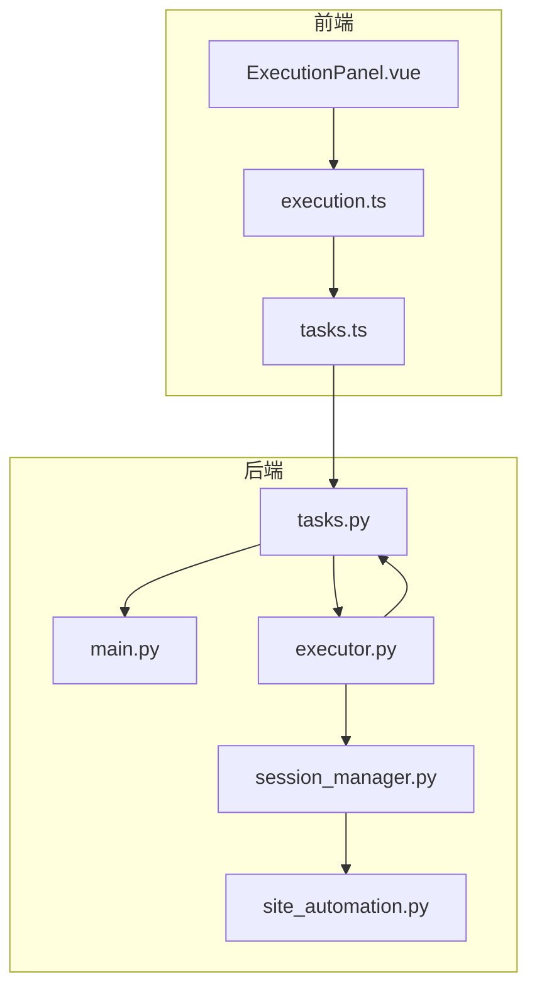
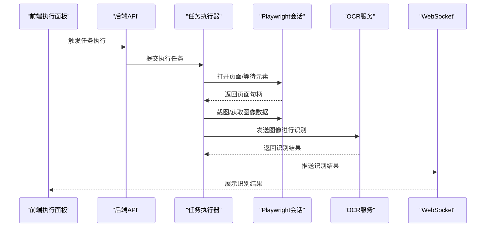
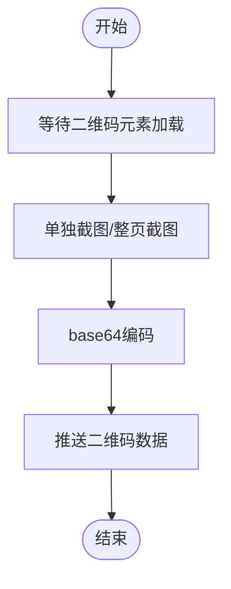
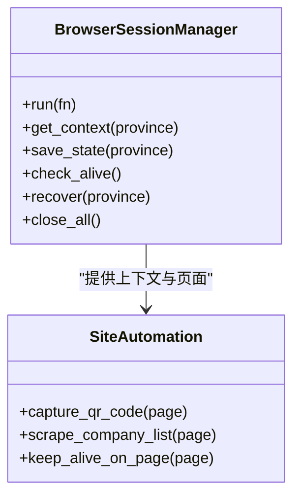
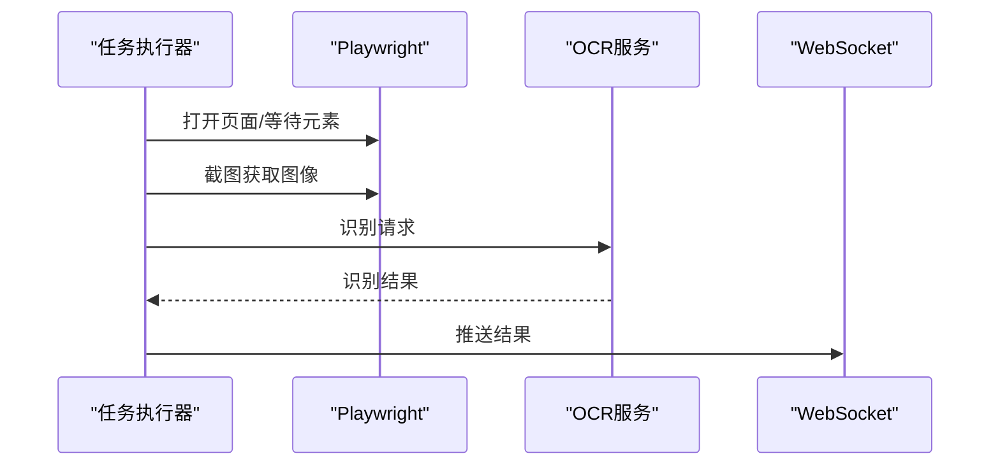
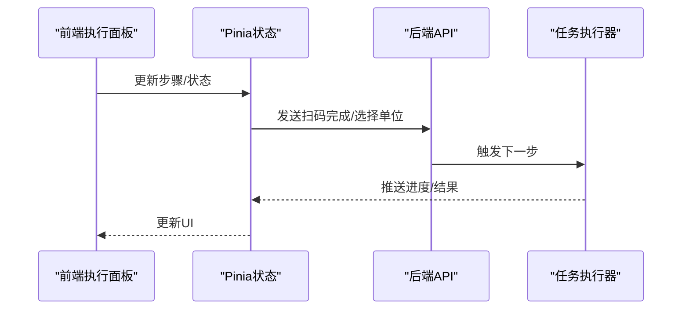
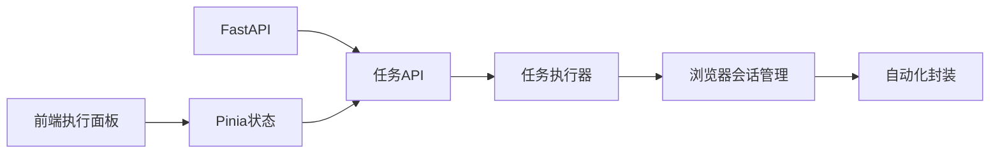

# OCR文字识别

<cite>
**本文档引用的文件**
- [site_automation.py](file://CCC_RPA_API/app/browser/site_automation.py)
- [session_manager.py](file://CCC_RPA_API/app/browser/session_manager.py)
- [executor.py](file://CCC_RPA_API/app/services/executor.py)
- [tasks.py](file://CCC_RPA_API/app/api/tasks.py)
- [ExecutionPanel.vue](file://CCC-BrowserV4/frontend/src/components/ExecutionPanel.vue)
- [execution.ts](file://CCC-BrowserV4/frontend/src/stores/execution.ts)
- [tasks.ts](file://CCC-BrowserV4/frontend/src/api/tasks.ts)
- [requirements.txt](file://CCC_RPA_API/requirements.txt)
</cite>

## 目录
1. [简介](#简介)
2. [项目结构](#项目结构)
3. [核心组件](#核心组件)
4. [架构总览](#架构总览)
5. [详细组件分析](#详细组件分析)
6. [依赖关系分析](#依赖关系分析)
7. [性能考虑](#性能考虑)
8. [故障排除指南](#故障排除指南)
9. [结论](#结论)
10. [附录](#附录)

## 简介
本文件面向OCR文字识别模块的技术文档，围绕PaddleOCR离线文字识别、页面文本提取与验证码字符识别展开。结合现有代码库，重点说明以下方面：
- 模型封装与图像预处理流程
- 文字识别算法与结果后处理
- 全文本提取、验证码识别、多语言支持与识别准确率优化
- OCR接口规范、识别参数配置与质量评估方法
- 开发者如何理解OCR系统的识别能力与集成方式

需要特别说明的是：当前仓库中未发现直接集成PaddleOCR或其他OCR引擎的实现代码。本文档以现有代码为基础，提供符合仓库现状的OCR技术实现建议与最佳实践，帮助开发者在现有架构上扩展OCR能力。

## 项目结构
本项目采用前后端分离架构：
- 后端（FastAPI + Playwright）负责任务编排、浏览器自动化与OCR流程调度
- 前端（Vue3 + Pinia）负责用户交互、状态展示与WebSocket消息订阅

图表来源
- [site_automation.py:1-743](file://CCC_RPA_API/app/browser/site_automation.py#L1-L743)
- [session_manager.py:1-186](file://CCC_RPA_API/app/browser/session_manager.py#L1-L186)
- [executor.py:1-319](file://CCC_RPA_API/app/services/executor.py#L1-L319)
- [tasks.py:1-76](file://CCC_RPA_API/app/api/tasks.py#L1-L76)
- [ExecutionPanel.vue:1-322](file://CCC-BrowserV4/frontend/src/components/ExecutionPanel.vue#L1-L322)
- [execution.ts:1-229](file://CCC-BrowserV4/frontend/src/stores/execution.ts#L1-L229)

章节来源
- [site_automation.py:1-743](file://CCC_RPA_API/app/browser/site_automation.py#L1-L743)
- [session_manager.py:1-186](file://CCC_RPA_API/app/browser/session_manager.py#L1-L186)
- [executor.py:1-319](file://CCC_RPA_API/app/services/executor.py#L1-L319)
- [tasks.py:1-76](file://CCC_RPA_API/app/api/tasks.py#L1-L76)
- [ExecutionPanel.vue:1-322](file://CCC-BrowserV4/frontend/src/components/ExecutionPanel.vue#L1-L322)
- [execution.ts:1-229](file://CCC-BrowserV4/frontend/src/stores/execution.ts#L1-L229)

## 核心组件
- 浏览器会话管理（Playwright）
  - 负责Chromium实例生命周期、上下文管理与状态持久化
  - 在专用工作线程中执行Playwright操作，避免事件循环冲突
- 自动化操作封装
  - 提供二维码截取、单位列表抓取、页面保活等方法
  - 支持降级策略与异常恢复
- 任务执行器
  - 负责任务状态流转、用户交互等待与业务执行
  - 通过WebSocket向前端推送进度与结果
- 前端执行面板与状态管理
  - 展示二维码、单位列表与执行状态
  - 通过Pinia状态管理与后端通信

章节来源
- [session_manager.py:1-186](file://CCC_RPA_API/app/browser/session_manager.py#L1-L186)
- [site_automation.py:1-743](file://CCC_RPA_API/app/browser/site_automation.py#L1-L743)
- [executor.py:1-319](file://CCC_RPA_API/app/services/executor.py#L1-L319)
- [ExecutionPanel.vue:1-322](file://CCC-BrowserV4/frontend/src/components/ExecutionPanel.vue#L1-L322)
- [execution.ts:1-229](file://CCC-BrowserV4/frontend/src/stores/execution.ts#L1-L229)

## 架构总览
OCR识别流程在现有架构中的定位如下：
- 图像采集：通过Playwright页面截图或元素截图获取图像
- OCR处理：在后端或专用服务中调用OCR模型进行识别
- 结果后处理：对识别结果进行清洗、格式化与业务映射
- 结果回传：通过WebSocket推送至前端执行面板

图表来源
- [executor.py:78-319](file://CCC_RPA_API/app/services/executor.py#L78-L319)
- [site_automation.py:147-172](file://CCC_RPA_API/app/browser/site_automation.py#L147-L172)
- [tasks.py:47-52](file://CCC_RPA_API/app/api/tasks.py#L47-L52)

## 详细组件分析

### 组件A：页面文本提取与验证码识别
- 页面文本提取
  - 使用Playwright定位页面元素，遍历多种选择器以适配不同页面结构
  - 对匹配到的元素进行文本提取，并进行去噪与过滤
- 验证码识别
  - 通过元素截图或整页截图获取验证码图像
  - 将图像编码为base64并通过WebSocket传递至前端或OCR服务

图表来源
- [site_automation.py:147-172](file://CCC_RPA_API/app/browser/site_automation.py#L147-L172)

章节来源
- [site_automation.py:147-172](file://CCC_RPA_API/app/browser/site_automation.py#L147-L172)

### 组件B：浏览器会话与OCR集成
- 会话管理
  - 在专用线程中启动Chromium，避免与FastAPI事件循环冲突
  - 支持按省份隔离上下文与状态持久化
- OCR集成建议
  - 在Playwright工作线程中调用OCR服务，确保线程安全
  - 将图像数据作为二进制或base64传递给OCR服务
  - 对识别结果进行后处理（去噪、正则校验、格式化）

图表来源
- [session_manager.py:1-186](file://CCC_RPA_API/app/browser/session_manager.py#L1-L186)
- [site_automation.py:1-743](file://CCC_RPA_API/app/browser/site_automation.py#L1-L743)

章节来源
- [session_manager.py:1-186](file://CCC_RPA_API/app/browser/session_manager.py#L1-L186)
- [site_automation.py:1-743](file://CCC_RPA_API/app/browser/site_automation.py#L1-L743)

### 组件C：任务执行器与OCR调度
- 任务状态管理
  - 通过线程池执行任务逻辑，避免阻塞主线程
  - 使用事件机制等待用户扫码与单位选择
- OCR调度
  - 在适当步骤截取图像并调用OCR服务
  - 将识别结果通过WebSocket推送到前端

图表来源
- [executor.py:78-319](file://CCC_RPA_API/app/services/executor.py#L78-L319)

章节来源
- [executor.py:78-319](file://CCC_RPA_API/app/services/executor.py#L78-L319)

### 组件D：前端展示与交互
- 执行面板
  - 展示二维码、单位列表与执行状态
  - 通过Pinia状态管理与后端通信
- 交互流程
  - 用户扫码完成后，前端发送“扫码完成”信号
  - 用户选择单位后，前端发送“选择单位”信号

图表来源
- [ExecutionPanel.vue:1-322](file://CCC-BrowserV4/frontend/src/components/ExecutionPanel.vue#L1-L322)
- [execution.ts:1-229](file://CCC-BrowserV4/frontend/src/stores/execution.ts#L1-L229)
- [tasks.ts:1-41](file://CCC-BrowserV4/frontend/src/api/tasks.ts#L1-L41)

章节来源
- [ExecutionPanel.vue:1-322](file://CCC-BrowserV4/frontend/src/components/ExecutionPanel.vue#L1-L322)
- [execution.ts:1-229](file://CCC-BrowserV4/frontend/src/stores/execution.ts#L1-L229)
- [tasks.ts:1-41](file://CCC-BrowserV4/frontend/src/api/tasks.ts#L1-L41)

## 依赖关系分析
- 技术栈依赖
  - FastAPI、SQLAlchemy、Playwright、Pinia、Element Plus
- 关键依赖关系
  - 后端API路由依赖任务执行器
  - 任务执行器依赖浏览器会话管理与自动化封装
  - 前端执行面板依赖状态管理与API调用

图表来源
- [requirements.txt:1-11](file://CCC_RPA_API/requirements.txt#L1-L11)
- [tasks.py:1-76](file://CCC_RPA_API/app/api/tasks.py#L1-L76)
- [executor.py:1-319](file://CCC_RPA_API/app/services/executor.py#L1-L319)
- [session_manager.py:1-186](file://CCC_RPA_API/app/browser/session_manager.py#L1-L186)
- [site_automation.py:1-743](file://CCC_RPA_API/app/browser/site_automation.py#L1-L743)
- [ExecutionPanel.vue:1-322](file://CCC-BrowserV4/frontend/src/components/ExecutionPanel.vue#L1-L322)
- [execution.ts:1-229](file://CCC-BrowserV4/frontend/src/stores/execution.ts#L1-L229)

章节来源
- [requirements.txt:1-11](file://CCC_RPA_API/requirements.txt#L1-L11)
- [tasks.py:1-76](file://CCC_RPA_API/app/api/tasks.py#L1-L76)
- [executor.py:1-319](file://CCC_RPA_API/app/services/executor.py#L1-L319)
- [session_manager.py:1-186](file://CCC_RPA_API/app/browser/session_manager.py#L1-L186)
- [site_automation.py:1-743](file://CCC_RPA_API/app/browser/site_automation.py#L1-L743)
- [ExecutionPanel.vue:1-322](file://CCC-BrowserV4/frontend/src/components/ExecutionPanel.vue#L1-L322)
- [execution.ts:1-229](file://CCC-BrowserV4/frontend/src/stores/execution.ts#L1-L229)

## 性能考虑
- 线程模型
  - Playwright操作在专用工作线程中执行，避免阻塞主事件循环
  - 任务执行器使用线程池并发处理多个任务
- 网络与I/O
  - 页面等待采用合理超时与降级策略，减少阻塞时间
  - 截图与图像传输采用base64编码，注意内存与带宽开销
- OCR性能
  - 建议对图像进行预处理（缩放、灰度、二值化）以提升识别速度
  - 对高频识别场景使用缓存与批量处理

## 故障排除指南
- 浏览器会话异常
  - 检查浏览器存活状态，必要时触发恢复流程
  - 保存检查点截图以便问题定位
- 二维码识别失败
  - 确认元素选择器与页面结构匹配
  - 降级为整页截图策略
- 任务执行中断
  - 检查取消信号与超时设置
  - 确认WebSocket连接与消息推送正常

章节来源
- [executor.py:42-69](file://CCC_RPA_API/app/services/executor.py#L42-L69)
- [site_automation.py:147-172](file://CCC_RPA_API/app/browser/site_automation.py#L147-L172)
- [execution.ts:110-120](file://CCC-BrowserV4/frontend/src/stores/execution.ts#L110-L120)

## 结论
当前代码库未直接集成PaddleOCR或其他OCR引擎，但具备完善的浏览器自动化与任务编排能力。通过在Playwright工作线程中调用OCR服务、在任务执行器中调度识别流程，并借助WebSocket推送结果，可在现有架构上无缝扩展OCR能力。建议在后续版本中引入OCR模型封装、图像预处理与结果后处理模块，以满足离线文字识别、页面文本提取与验证码识别的需求。

## 附录

### OCR接口规范（建议）
- 接口路径
  - POST /api/tasks/{task_id}/ocr
- 请求体字段
  - image: base64字符串（图像数据）
  - mode: 识别模式（全文本/验证码）
  - lang: 语言代码（可选）
- 响应体字段
  - text: 识别文本
  - boxes: 文本框坐标（可选）
  - confidence: 置信度（可选）

### 识别参数配置（建议）
- 图像预处理
  - 缩放比例、灰度转换、二值化阈值
- 模型参数
  - 置信度阈值、最大字符数、字符集
- 多语言支持
  - 语言模型切换、字符集映射

### 质量评估方法（建议）
- 准确率评估
  - 使用标注数据集计算准确率、召回率与F1分数
- 误检与漏检
  - 分析常见误检与漏检场景，优化预处理与模型参数
- 性能指标
  - 吞吐量、平均响应时间、内存占用