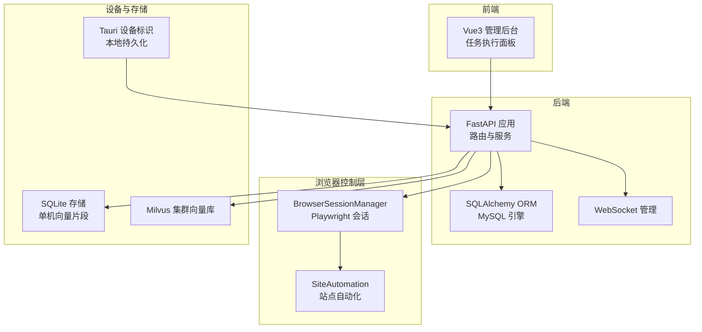
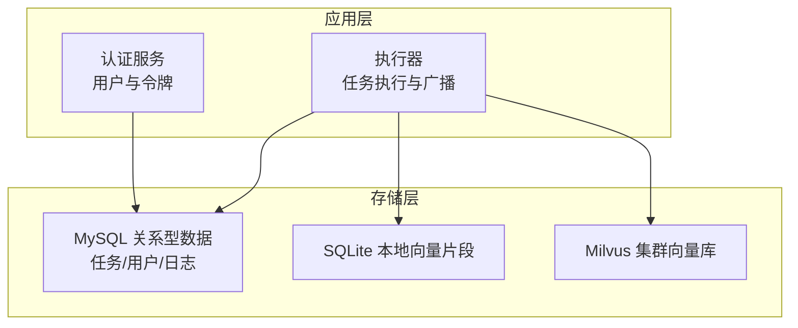
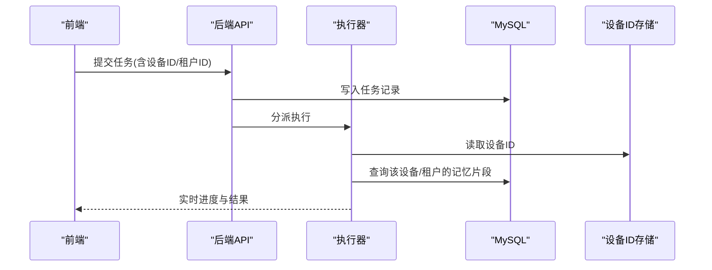
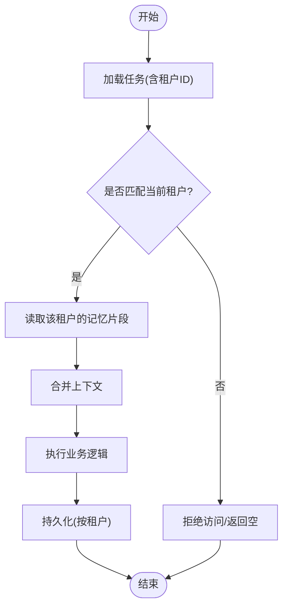
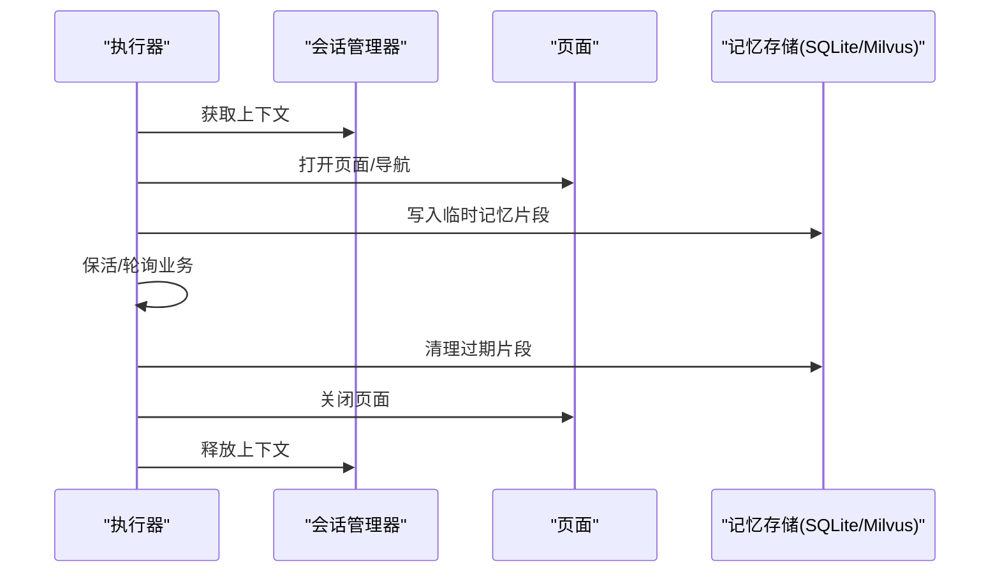
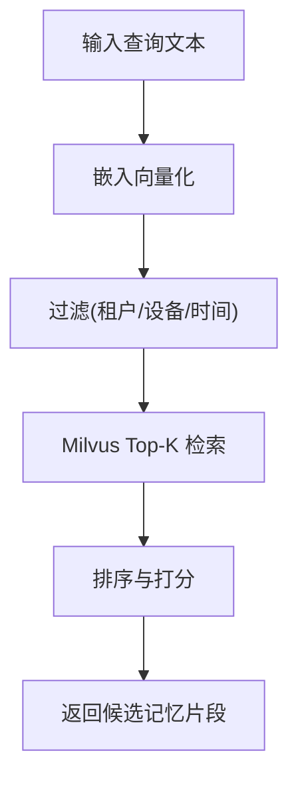
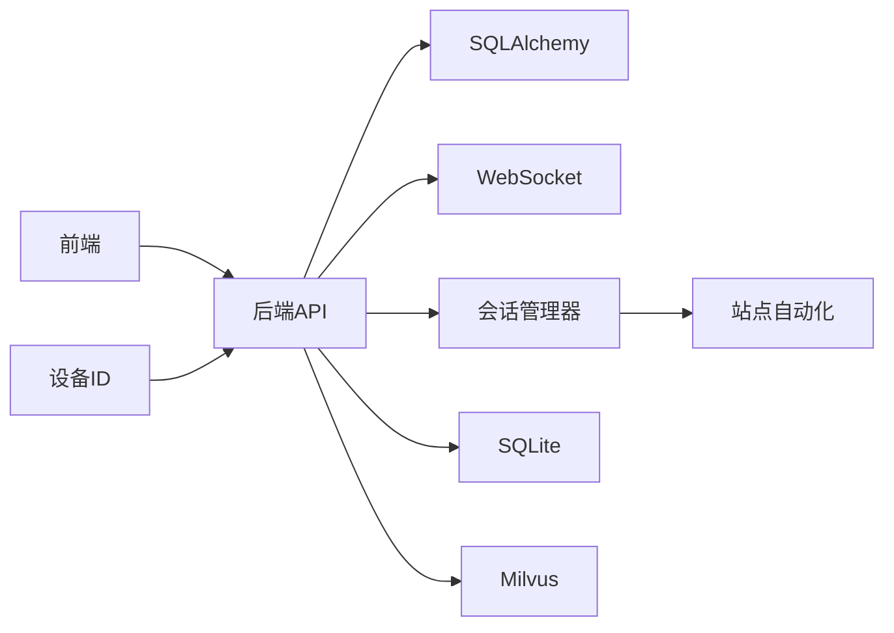
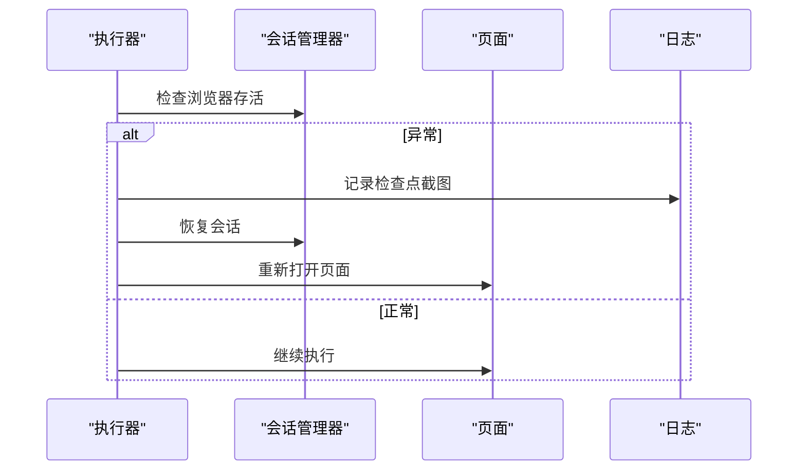

# 向量记忆库

<cite>
**本文引用的文件**
- [database.py](file://CCC_RPA_API/app/database.py)
- [config.py](file://CCC_RPA_API/app/config.py)
- [base.py](file://CCC_RPA_API/app/models/base.py)
- [task.py](file://CCC_RPA_API/app/models/task.py)
- [user.py](file://CCC_RPA_API/app/models/user.py)
- [execution_log.py](file://CCC_RPA_API/app/models/execution_log.py)
- [executor.py](file://CCC_RPA_API/app/services/executor.py)
- [site_automation.py](file://CCC_RPA_API/app/browser/site_automation.py)
- [device.rs](file://CCC-BrowserV4/src-tauri/src/device.rs)
- [README.md](file://CCC-BrowserV4/backend/README.md)
- [project.md](file://project.md)
</cite>

## 目录
1. [简介](#简介)
2. [项目结构](#项目结构)
3. [核心组件](#核心组件)
4. [架构总览](#架构总览)
5. [组件详解](#组件详解)
6. [依赖关系分析](#依赖关系分析)
7. [性能考量](#性能考量)
8. [故障排查指南](#故障排查指南)
9. [结论](#结论)
10. [附录](#附录)

## 简介
本文件面向“向量记忆库”的设计与实现，结合仓库现有代码与系统文档，系统化阐述：
- 单机SQLite存储与集群Milvus向量库的架构定位与职责边界
- 会话独立记忆管理与租户数据隔离机制
- 记忆上下文维护、临时记忆清理、持久化记忆加密与跨会话共享控制
- 向量相似度计算、记忆检索算法与性能优化策略
- 记忆库接口规范、配置参数与使用示例

说明：当前仓库以MySQL为主存储，系统文档明确指出“数据存储：PostgreSQL、Redis、Milvus（集群向量库）”。因此，本文件在“架构总览”“组件详解”等章节中，将以Milvus为集群向量库进行概念性说明，并结合现有MySQL/SQLite能力给出可落地的实现建议与接口规范。

## 项目结构
本项目后端采用Python FastAPI，数据库层通过SQLAlchemy连接MySQL；前端为Vue3应用，提供任务执行、会话管理与可视化界面；底层沙箱通过Playwright与Chromium交互，设备标识通过Tauri插件持久化。

图表来源
- [database.py:1-19](file://CCC_RPA_API/app/database.py#L1-L19)
- [config.py:1-22](file://CCC_RPA_API/app/config.py#L1-L22)
- [executor.py:1-319](file://CCC_RPA_API/app/services/executor.py#L1-L319)
- [device.rs:1-31](file://CCC-BrowserV4/src-tauri/src/device.rs#L1-L31)

章节来源
- [README.md:1-66](file://CCC-BrowserV4/backend/README.md#L1-L66)
- [project.md:1432-1449](file://project.md#L1432-L1449)

## 核心组件
- 数据库与ORM
  - 使用SQLAlchemy创建引擎与会话工厂，集中管理连接池与事务生命周期。
  - 通过基础模型类统一时间戳字段，确保审计与追踪能力。
- 任务与用户模型
  - 任务模型包含租户ID、设备ID、状态、下次执行时间等字段，支撑会话独立与租户隔离。
  - 用户模型包含设备ID与令牌，配合认证服务实现会话绑定。
- 执行器与会话管理
  - 执行器负责任务生命周期、进度广播、异常恢复与日志记录。
  - 会话管理器负责Playwright上下文与页面的创建、恢复与保活。
- 设备标识与本地存储
  - Tauri插件提供设备ID生成与持久化，保障跨会话一致性。

章节来源
- [database.py:1-19](file://CCC_RPA_API/app/database.py#L1-L19)
- [base.py:1-11](file://CCC_RPA_API/app/models/base.py#L1-L11)
- [task.py:1-25](file://CCC_RPA_API/app/models/task.py#L1-L25)
- [user.py:1-17](file://CCC_RPA_API/app/models/user.py#L1-L17)
- [executor.py:1-319](file://CCC_RPA_API/app/services/executor.py#L1-L319)
- [device.rs:1-31](file://CCC-BrowserV4/src-tauri/src/device.rs#L1-L31)

## 架构总览
向量记忆库在整体架构中的定位如下：
- 单机SQLite：用于本地快速检索与临时记忆片段，适合低延迟场景与离线兜底。
- 集群Milvus：用于大规模向量检索、跨会话共享与租户隔离，提供高吞吐相似度计算。
- 会话独立记忆：通过任务模型中的设备ID与租户ID，限定记忆可见范围。
- 租户数据隔离：通过数据库层面的租户字段与应用层过滤，确保跨租户不可见。

图表来源
- [executor.py:1-319](file://CCC_RPA_API/app/services/executor.py#L1-L319)
- [config.py:1-22](file://CCC_RPA_API/app/config.py#L1-L22)
- [project.md:1444](file://project.md#L1444)

## 组件详解

### 会话独立记忆管理
- 设备ID绑定
  - 通过Tauri生成并持久化设备ID，后端在任务与用户模型中记录设备ID，确保同一设备的会话记忆独立。
- 任务模型字段
  - 任务模型包含设备ID与租户ID，用于筛选与隔离。
- 执行器上下文
  - 执行器在任务执行过程中，根据任务设备ID与租户ID决定记忆可见范围与持久化策略。

图表来源
- [device.rs:23-31](file://CCC-BrowserV4/src-tauri/src/device.rs#L23-L31)
- [task.py:14-15](file://CCC_RPA_API/app/models/task.py#L14-L15)
- [executor.py:78-104](file://CCC_RPA_API/app/services/executor.py#L78-L104)

章节来源
- [device.rs:1-31](file://CCC-BrowserV4/src-tauri/src/device.rs#L1-L31)
- [task.py:1-25](file://CCC_RPA_API/app/models/task.py#L1-L25)
- [executor.py:1-319](file://CCC_RPA_API/app/services/executor.py#L1-L319)

### 租户数据隔离机制
- 租户字段
  - 任务模型包含租户ID字段，执行器在读取与写入记忆时应按租户过滤。
- 认证与权限
  - 认证服务维护用户令牌与设备ID，结合租户ID实现最小权限访问。
- 物理隔离
  - 系统文档强调“租户数据物理隔离”，需在应用层严格实施。

图表来源
- [task.py:14](file://CCC_RPA_API/app/models/task.py#L14)
- [executor.py:82-94](file://CCC_RPA_API/app/services/executor.py#L82-L94)

章节来源
- [task.py:1-25](file://CCC_RPA_API/app/models/task.py#L1-L25)
- [executor.py:1-319](file://CCC_RPA_API/app/services/executor.py#L1-L319)

### 记忆上下文维护与临时清理
- 上下文维护
  - 执行器在任务执行期间，通过会话管理器维持Playwright上下文，必要时进行恢复与保活。
- 临时清理
  - 会话销毁或任务结束后，清理临时记忆片段与上下文，避免跨会话污染。
- 清理策略
  - 建议：按会话ID与租户ID建立命名空间，定期清理过期片段。

图表来源
- [executor.py:196-267](file://CCC_RPA_API/app/services/executor.py#L196-L267)
- [site_automation.py:353-401](file://CCC_RPA_API/app/browser/site_automation.py#L353-L401)

章节来源
- [executor.py:1-319](file://CCC_RPA_API/app/services/executor.py#L1-L319)
- [site_automation.py:353-401](file://CCC_RPA_API/app/browser/site_automation.py#L353-L401)

### 持久化记忆加密与跨会话共享控制
- 加密策略
  - 系统文档明确“会话快照文件：AES-256-CBC加密，密钥存储在租户表独立字段”，可借鉴此思路对记忆片段进行加密存储。
- 共享控制
  - 通过租户ID与设备ID限定可见范围，禁止跨租户/跨设备共享。
- 密钥管理
  - 建议：为每个租户生成独立密钥，密钥存储于受保护的配置或密钥管理服务。

章节来源
- [project.md:1299-1302](file://project.md#L1299-L1302)

### 向量相似度计算与检索算法
- Milvus检索
  - 使用Milvus进行高维向量检索，支持Top-K相似度匹配与过滤条件（如租户ID、设备ID、时间窗口）。
- SQLite辅助
  - 对小规模片段或临时片段，可在SQLite中进行快速检索与预过滤。
- 算法建议
  - 嵌入向量化：对记忆文本进行分词与编码，输出定长向量。
  - 相似度：余弦相似度或点积归一化。
  - 过滤：先按租户/设备/时间过滤，再进行向量检索。

图表来源
- [project.md:1444](file://project.md#L1444)

### 性能优化策略
- 连接池与事务
  - 使用SQLAlchemy连接池与短事务，减少锁竞争与延迟。
- 索引与分区
  - 在任务模型的租户ID、设备ID、状态、时间字段建立索引，必要时按时间分区。
- 向量索引
  - 在Milvus中合理设置索引类型与参数，平衡召回率与查询延迟。
- 缓存与批处理
  - 对热点片段进行缓存，批量写入与异步刷新。

章节来源
- [database.py:1-19](file://CCC_RPA_API/app/database.py#L1-L19)
- [config.py:1-22](file://CCC_RPA_API/app/config.py#L1-L22)

## 依赖关系分析
- 后端依赖
  - FastAPI、SQLAlchemy、WebSocket管理器、会话管理器与站点自动化模块。
- 前端依赖
  - Vue3、路由与状态管理，WebSocket接收执行进度与结果。
- 设备与存储
  - Tauri插件提供设备ID，SQLite用于本地片段，Milvus用于集群检索。

图表来源
- [executor.py:1-319](file://CCC_RPA_API/app/services/executor.py#L1-L319)
- [device.rs:1-31](file://CCC-BrowserV4/src-tauri/src/device.rs#L1-L31)

章节来源
- [executor.py:1-319](file://CCC_RPA_API/app/services/executor.py#L1-L319)
- [device.rs:1-31](file://CCC-BrowserV4/src-tauri/src/device.rs#L1-L31)

## 性能考量
- 数据库层
  - 合理设置连接池大小与回收策略，避免连接泄漏。
  - 对高频查询字段建立索引，减少全表扫描。
- 向量检索
  - 在Milvus中选择合适的索引类型（如IVF、HNSW），并调优参数。
  - 使用过滤条件缩小候选集，降低向量计算复杂度。
- 会话与任务
  - 任务执行采用线程池与异步广播，避免阻塞主线程。
  - 保活循环分段等待，及时响应取消信号。

章节来源
- [database.py:1-19](file://CCC_RPA_API/app/database.py#L1-L19)
- [executor.py:18-33](file://CCC_RPA_API/app/services/executor.py#L18-L33)

## 故障排查指南
- 会话异常恢复
  - 执行器在检测到浏览器异常时，进行恢复并重新打开页面，同时记录检查点截图。
- 任务执行失败
  - 记录失败原因与时间，更新任务状态与日志条目，通过WebSocket广播错误信息。
- 设备ID缺失
  - Tauri插件初始化失败或读取失败时，检查存储文件与权限。

图表来源
- [executor.py:42-70](file://CCC_RPA_API/app/services/executor.py#L42-L70)

章节来源
- [executor.py:286-314](file://CCC_RPA_API/app/services/executor.py#L286-L314)
- [device.rs:6-31](file://CCC-BrowserV4/src-tauri/src/device.rs#L6-L31)

## 结论
本向量记忆库以“单机SQLite + 集群Milvus”为存储组合，结合任务模型的租户与设备字段，实现会话独立记忆与租户数据隔离。通过执行器的上下文维护与异常恢复机制，保障任务执行的稳定性；借助加密策略与严格的访问控制，确保数据安全。未来可在Milvus索引参数、缓存策略与批处理写入等方面进一步优化性能。

## 附录

### 接口规范（概念性）
- 记忆写入
  - 方法：POST /memory
  - 请求体：包含文本内容、租户ID、设备ID、时间戳、向量向量
  - 返回：记忆ID与写入状态
- 记忆检索
  - 方法：POST /memory/search
  - 请求体：查询文本、租户ID、设备ID、Top-K、过滤条件
  - 返回：相似度排序的记忆片段列表
- 记忆清理
  - 方法：DELETE /memory/batch
  - 请求体：按会话ID/租户ID/时间范围批量清理
  - 返回：清理结果与受影响条目数

### 配置参数
- 数据库
  - DB_HOST、DB_PORT、DB_USERNAME、DB_PASSWORD、DB_DATABASE
- 向量库
  - Milvus连接参数（地址、端口、集合名、索引参数）
- 本地存储
  - SQLite路径与表结构（建议与任务表同库）

章节来源
- [config.py:6-21](file://CCC_RPA_API/app/config.py#L6-L21)
- [project.md:1444](file://project.md#L1444)