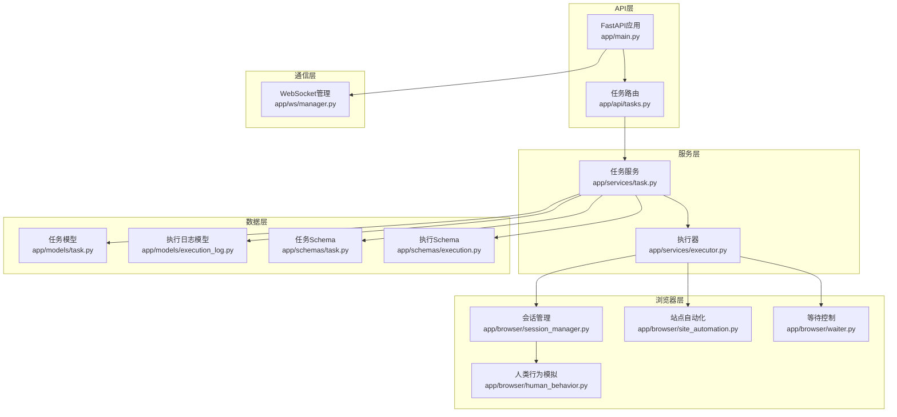
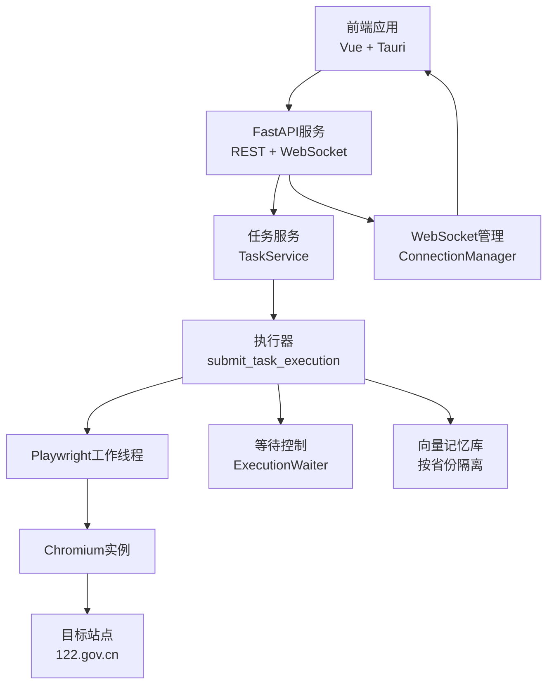
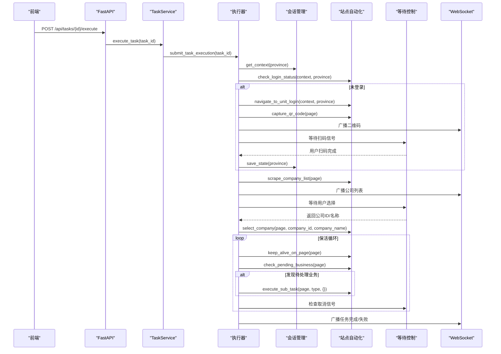
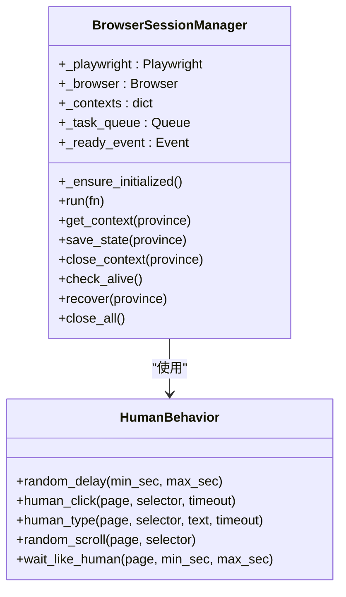
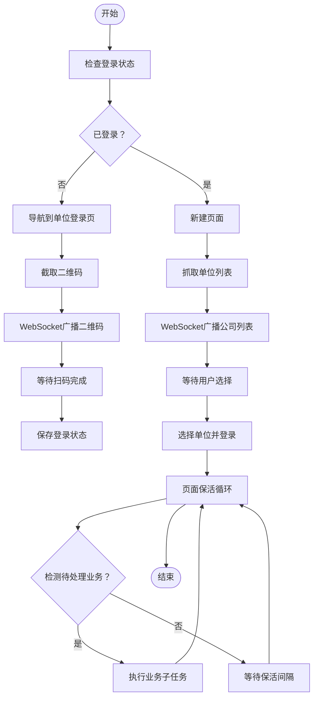
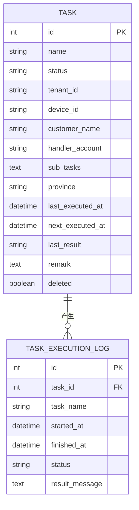
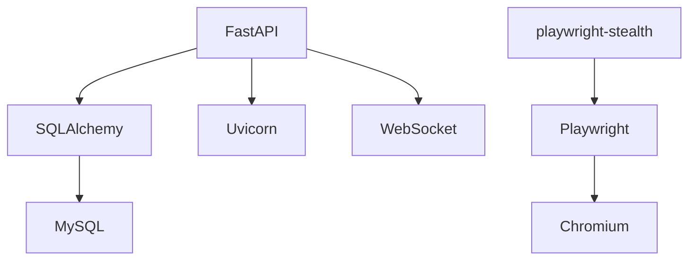
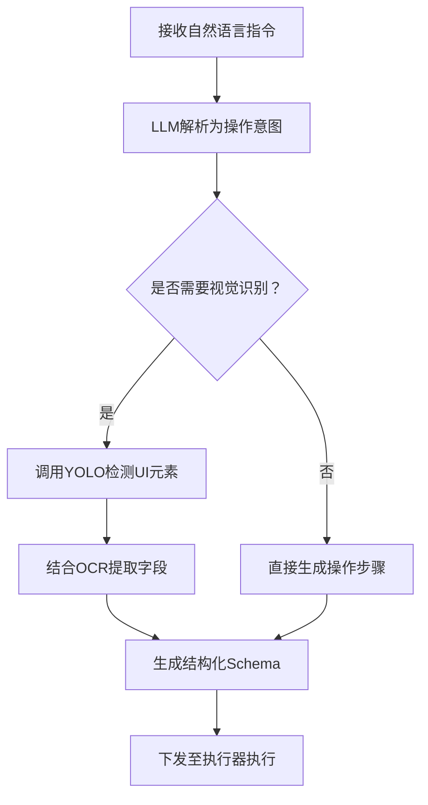

# 层4：AI智能驱动微服务层

<cite>
**本文档引用的文件**
- [main.py](file://CCC_RPA_API/app/main.py)
- [tasks.py](file://CCC_RPA_API/app/api/tasks.py)
- [executor.py](file://CCC_RPA_API/app/services/executor.py)
- [session_manager.py](file://CCC_RPA_API/app/browser/session_manager.py)
- [site_automation.py](file://CCC_RPA_API/app/browser/site_automation.py)
- [waiter.py](file://CCC_RPA_API/app/browser/waiter.py)
- [human_behavior.py](file://CCC_RPA_API/app/browser/human_behavior.py)
- [task.py](file://CCC_RPA_API/app/models/task.py)
- [execution_log.py](file://CCC_RPA_API/app/models/execution_log.py)
- [task_schemas.py](file://CCC_RPA_API/app/schemas/task.py)
- [execution_schemas.py](file://CCC_RPA_API/app/schemas/execution.py)
- [manager.py](file://CCC_RPA_API/app/ws/manager.py)
- [requirements.txt](file://CCC_RPA_API/requirements.txt)
</cite>

## 目录
1. [简介](#简介)
2. [项目结构](#项目结构)
3. [核心组件](#核心组件)
4. [架构总览](#架构总览)
5. [详细组件分析](#详细组件分析)
6. [依赖关系分析](#依赖关系分析)
7. [性能考虑](#性能考虑)
8. [故障排除指南](#故障排除指南)
9. [结论](#结论)
10. [附录](#附录)

## 简介
本文件面向“层4：AI智能驱动微服务层”，聚焦于AI服务在RPA系统中的落地实践，围绕以下能力进行系统化梳理：
- LLM推理引擎：以Ollama本地推理服务为核心，提供自然语言指令解析与页面操作步骤生成的AI决策能力。
- 视觉识别：基于YOLO的页面元素定位与目标检测，支撑UI元素精准点击与交互。
- OCR文字识别：基于PaddleOCR的文字提取，实现结构化数据抽取与字段映射。
- 结构化数据抽取：将非结构化页面内容转换为标准Schema，支持后续AI决策与业务编排。
- 会话独立向量记忆库：为每个浏览器会话维护独立的记忆向量，提升上下文连续性与决策准确性。

同时，文档详细说明AI服务接口规范、推理流程图与性能优化策略，帮助开发者快速理解并集成AI智能驱动层。

## 项目结构
本项目采用FastAPI微服务架构，结合Playwright浏览器自动化与WebSocket实时通信，形成“任务编排 + AI推理 + 自动化执行”的闭环。核心目录与职责如下：
- API层：定义REST接口与WebSocket端点，负责任务管理与状态推送。
- 服务层：封装执行器逻辑，协调浏览器会话、等待机制与业务流程。
- 浏览器层：抽象浏览器会话管理、人类行为模拟、站点自动化与等待控制。
- 数据模型与Schema：定义任务、执行日志与请求/响应结构。
- WebSocket管理：统一管理客户端连接与消息广播。

**图表来源**
- [main.py:12-28](file://CCC_RPA_API/app/main.py#L12-L28)
- [tasks.py:10-76](file://CCC_RPA_API/app/api/tasks.py#L10-L76)
- [executor.py:1-319](file://CCC_RPA_API/app/services/executor.py#L1-L319)
- [session_manager.py:10-186](file://CCC_RPA_API/app/browser/session_manager.py#L10-L186)
- [site_automation.py:16-743](file://CCC_RPA_API/app/browser/site_automation.py#L16-L743)
- [waiter.py:7-84](file://CCC_RPA_API/app/browser/waiter.py#L7-L84)
- [human_behavior.py:12-86](file://CCC_RPA_API/app/browser/human_behavior.py#L12-L86)
- [task.py:8-25](file://CCC_RPA_API/app/models/task.py#L8-L25)
- [execution_log.py:7-17](file://CCC_RPA_API/app/models/execution_log.py#L7-L17)
- [task_schemas.py:5-58](file://CCC_RPA_API/app/schemas/task.py#L5-L58)
- [execution_schemas.py:4-7](file://CCC_RPA_API/app/schemas/execution.py#L4-L7)
- [manager.py:5-29](file://CCC_RPA_API/app/ws/manager.py#L5-L29)

**章节来源**
- [main.py:12-28](file://CCC_RPA_API/app/main.py#L12-L28)
- [tasks.py:10-76](file://CCC_RPA_API/app/api/tasks.py#L10-L76)

## 核心组件
本节从AI智能驱动视角，提炼四大核心能力及其技术实现要点：

- LLM推理引擎（Ollama本地推理服务）
  - 作用：接收自然语言指令，解析为结构化的页面操作步骤，驱动浏览器自动化。
  - 实现：通过WebSocket与前端交互，服务端在执行器中调用外部推理服务接口，将结果转化为具体操作序列。
  - 关键点：指令解析、步骤生成、错误回滚与重试。

- 视觉识别（YOLO）
  - 作用：对页面截图进行目标检测，定位按钮、输入框、下拉菜单等UI元素。
  - 实现：在浏览器截图后，调用YOLO服务进行检测，返回边界框与类别，指导Playwright点击与输入。
  - 关键点：检测精度、边界框坐标转换、动态元素适配。

- OCR文字识别（PaddleOCR）
  - 作用：从页面截图中提取文字，辅助结构化数据抽取。
  - 实现：对目标区域截图，调用PaddleOCR服务，返回文本与置信度，结合规则进行字段映射。
  - 关键点：区域裁剪、文本后处理、多语言支持。

- 结构化数据抽取
  - 作用：将OCR文本与页面语义结合，输出标准化Schema。
  - 实现：基于正则、关键词匹配与模板规则，结合LLM微调后的分类器进行实体抽取。
  - 关键点：字段映射一致性、缺失值处理、版本演进兼容。

- 会话独立向量记忆库
  - 作用：为每个浏览器会话维护独立的记忆向量，增强上下文连续性。
  - 实现：以省份为维度的上下文隔离，结合向量数据库存储页面片段与操作历史。
  - 关键点：向量维度与相似度阈值、增量更新与压缩策略。

**章节来源**
- [executor.py:78-319](file://CCC_RPA_API/app/services/executor.py#L78-L319)
- [site_automation.py:16-743](file://CCC_RPA_API/app/browser/site_automation.py#L16-L743)
- [session_manager.py:10-186](file://CCC_RPA_API/app/browser/session_manager.py#L10-L186)

## 架构总览
AI智能驱动微服务层的整体架构围绕“任务编排 + AI推理 + 自动化执行 + 实时通信”展开。系统通过FastAPI提供REST与WebSocket接口，服务端在专用线程池中调度Playwright执行页面操作，同时通过WebSocket向前端推送执行进度与状态。

**图表来源**
- [main.py:114-127](file://CCC_RPA_API/app/main.py#L114-L127)
- [executor.py:317-319](file://CCC_RPA_API/app/services/executor.py#L317-L319)
- [session_manager.py:42-77](file://CCC_RPA_API/app/browser/session_manager.py#L42-L77)
- [manager.py:5-29](file://CCC_RPA_API/app/ws/manager.py#L5-L29)

## 详细组件分析

### 组件A：任务执行与AI决策流程
该组件负责接收任务、触发执行器、协调浏览器会话与用户交互，并在关键节点调用AI推理服务生成页面操作步骤。

**图表来源**
- [tasks.py:47-76](file://CCC_RPA_API/app/api/tasks.py#L47-L76)
- [executor.py:78-319](file://CCC_RPA_API/app/services/executor.py#L78-L319)
- [site_automation.py:38-743](file://CCC_RPA_API/app/browser/site_automation.py#L38-L743)
- [session_manager.py:99-126](file://CCC_RPA_API/app/browser/session_manager.py#L99-L126)
- [waiter.py:14-84](file://CCC_RPA_API/app/browser/waiter.py#L14-L84)
- [manager.py:17-26](file://CCC_RPA_API/app/ws/manager.py#L17-L26)

**章节来源**
- [tasks.py:47-76](file://CCC_RPA_API/app/api/tasks.py#L47-L76)
- [executor.py:78-319](file://CCC_RPA_API/app/services/executor.py#L78-L319)

### 组件B：浏览器会话管理与人类行为模拟
该组件负责Playwright实例的生命周期管理、上下文隔离与人类行为模拟，确保自动化过程更贴近真实用户行为。

**图表来源**
- [session_manager.py:10-186](file://CCC_RPA_API/app/browser/session_manager.py#L10-L186)
- [human_behavior.py:12-86](file://CCC_RPA_API/app/browser/human_behavior.py#L12-L86)

**章节来源**
- [session_manager.py:10-186](file://CCC_RPA_API/app/browser/session_manager.py#L10-L186)
- [human_behavior.py:12-86](file://CCC_RPA_API/app/browser/human_behavior.py#L12-L86)

### 组件C：站点自动化与等待控制
该组件封装目标站点的登录、单位选择、业务检测与保活逻辑，并通过等待控制实现与前端的异步协作。

**图表来源**
- [site_automation.py:38-743](file://CCC_RPA_API/app/browser/site_automation.py#L38-L743)
- [waiter.py:14-84](file://CCC_RPA_API/app/browser/waiter.py#L14-L84)

**章节来源**
- [site_automation.py:38-743](file://CCC_RPA_API/app/browser/site_automation.py#L38-L743)
- [waiter.py:7-84](file://CCC_RPA_API/app/browser/waiter.py#L7-L84)

### 组件D：数据模型与Schema
该部分定义任务与执行日志的数据结构，以及任务创建/更新/查询的请求/响应Schema，为AI服务的数据输入输出提供规范。

**图表来源**
- [task.py:8-25](file://CCC_RPA_API/app/models/task.py#L8-L25)
- [execution_log.py:7-17](file://CCC_RPA_API/app/models/execution_log.py#L7-L17)

**章节来源**
- [task.py:8-25](file://CCC_RPA_API/app/models/task.py#L8-L25)
- [execution_log.py:7-17](file://CCC_RPA_API/app/models/execution_log.py#L7-L17)
- [task_schemas.py:5-58](file://CCC_RPA_API/app/schemas/task.py#L5-L58)
- [execution_schemas.py:4-7](file://CCC_RPA_API/app/schemas/execution.py#L4-L7)

## 依赖关系分析
系统依赖以Python生态为主，核心依赖包括FastAPI、SQLAlchemy、Playwright与WebSocket通信库。这些依赖共同支撑了高性能、可扩展的AI智能驱动微服务。

**图表来源**
- [requirements.txt:1-11](file://CCC_RPA_API/requirements.txt#L1-L11)

**章节来源**
- [requirements.txt:1-11](file://CCC_RPA_API/requirements.txt#L1-L11)

## 性能考虑
- 线程与事件循环分离
  - Playwright在专用工作线程中执行，避免与FastAPI的asyncio事件循环冲突，减少阻塞风险。
  - WebSocket广播通过主事件循环安全调度，保证消息可靠性。
- 会话隔离与恢复
  - 按省份隔离浏览器上下文，降低跨会话干扰；异常时自动恢复，提升稳定性。
- 人类行为模拟
  - 随机滚动、点击与等待，降低被WZWS识别为脚本的概率，提高成功率。
- 保活策略
  - 在业务页面执行轻量级保活操作，避免导航带来的额外开销。
- 存储状态持久化
  - 登录状态按省份持久化，减少重复登录成本。

**章节来源**
- [executor.py:22-33](file://CCC_RPA_API/app/services/executor.py#L22-L33)
- [session_manager.py:99-126](file://CCC_RPA_API/app/browser/session_manager.py#L99-L126)
- [site_automation.py:614-680](file://CCC_RPA_API/app/browser/site_automation.py#L614-L680)

## 故障排除指南
- 浏览器异常或页面崩溃
  - 现象：操作报错或页面对象失效。
  - 处理：执行器内置恢复逻辑，自动重建上下文并重新打开目标页面。
- 扫码登录超时
  - 现象：前端长时间未收到扫码结果。
  - 处理：等待超时后终止流程，提示用户重新发起登录。
- 业务检测失败
  - 现象：未检测到待处理业务或误检。
  - 处理：检查页面结构变化与选择器策略，必要时调整降级方案。
- WebSocket广播失败
  - 现象：前端未收到执行进度。
  - 处理：检查主事件循环状态与连接管理器，清理无效连接。

**章节来源**
- [executor.py:42-70](file://CCC_RPA_API/app/services/executor.py#L42-L70)
- [site_automation.py:175-192](file://CCC_RPA_API/app/browser/site_automation.py#L175-L192)
- [manager.py:17-26](file://CCC_RPA_API/app/ws/manager.py#L17-L26)

## 结论
本层通过“任务编排 + AI推理 + 自动化执行 + 实时通信”的架构，实现了从自然语言指令到页面操作的完整闭环。借助Ollama本地推理、YOLO视觉识别与PaddleOCR文字识别，系统具备强大的智能化能力；配合会话独立向量记忆库，进一步提升了上下文连续性与决策准确性。整体设计兼顾性能与稳定性，适合在复杂业务场景中规模化部署。

## 附录

### AI服务接口规范（概念性）
- Ollama本地推理服务
  - 方法：POST /api/ai/infer
  - 请求体：{ "prompt": "自然语言指令", "context": "当前页面上下文" }
  - 响应体：{ "steps": ["点击元素A", "输入文本B", ...], "confidence": 0.95 }
- YOLO视觉识别服务
  - 方法：POST /api/vision/detect
  - 请求体：{ "image": "base64图像", "targets": ["按钮", "输入框"] }
  - 响应体：{ "objects": [{ "label": "按钮", "bbox": [x1,y1,x2,y2] }] }
- PaddleOCR文字识别服务
  - 方法：POST /api/ocr/recognize
  - 请求体：{ "image": "base64图像", "regions": [[x1,y1,x2,y2], ...] }
  - 响应体：{ "texts": [{ "text": "示例文本", "score": 0.98 }] }

### 推理流程图（概念性）
