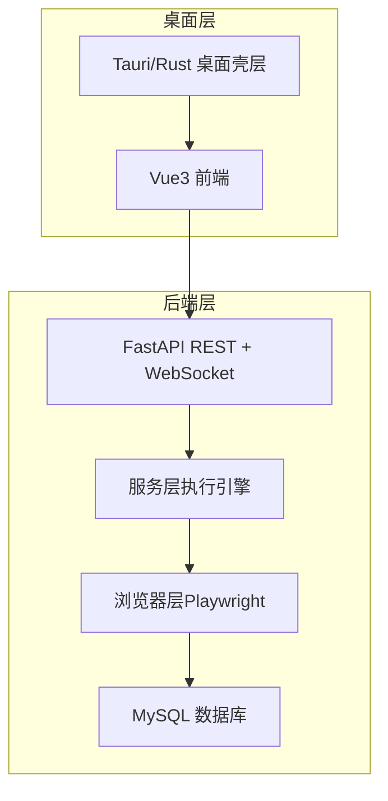
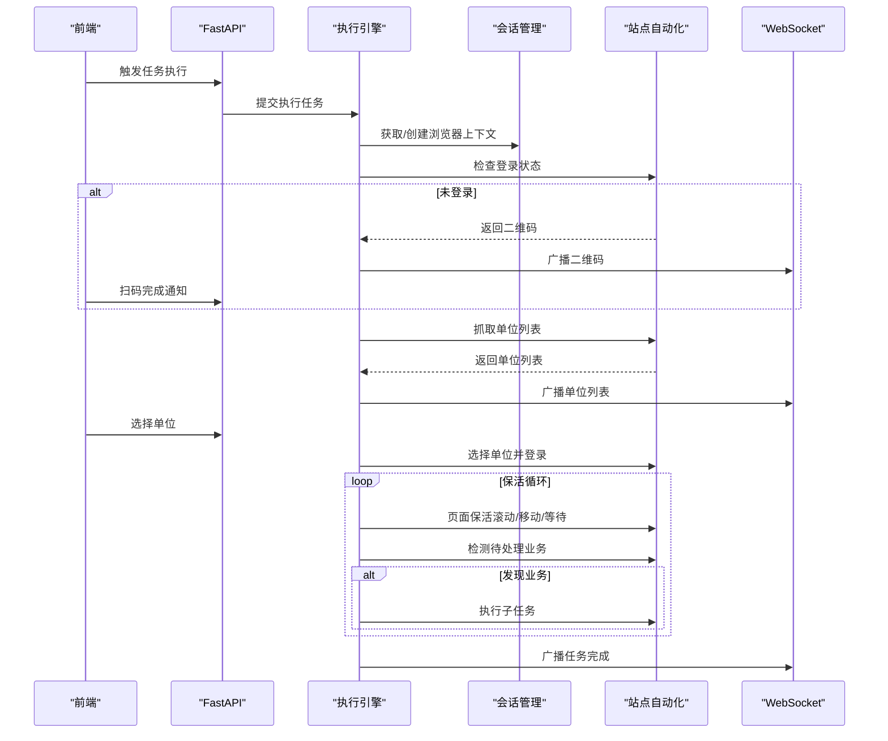
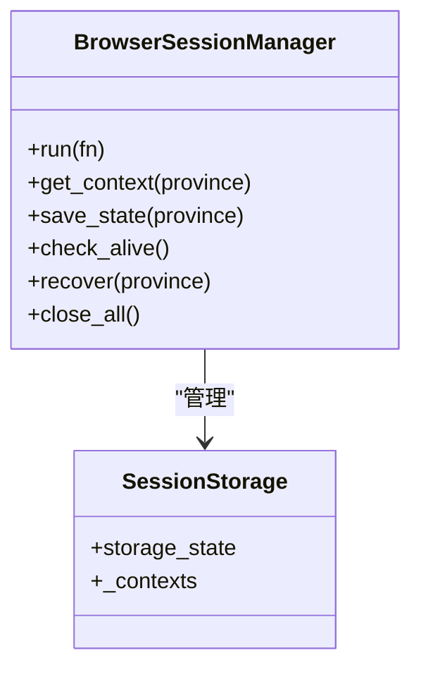
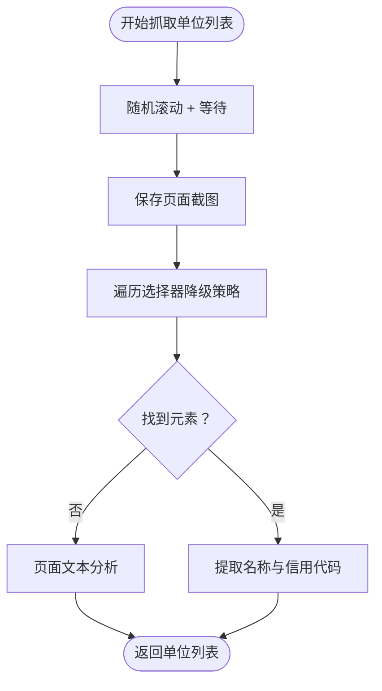
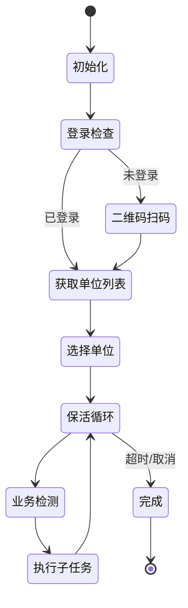
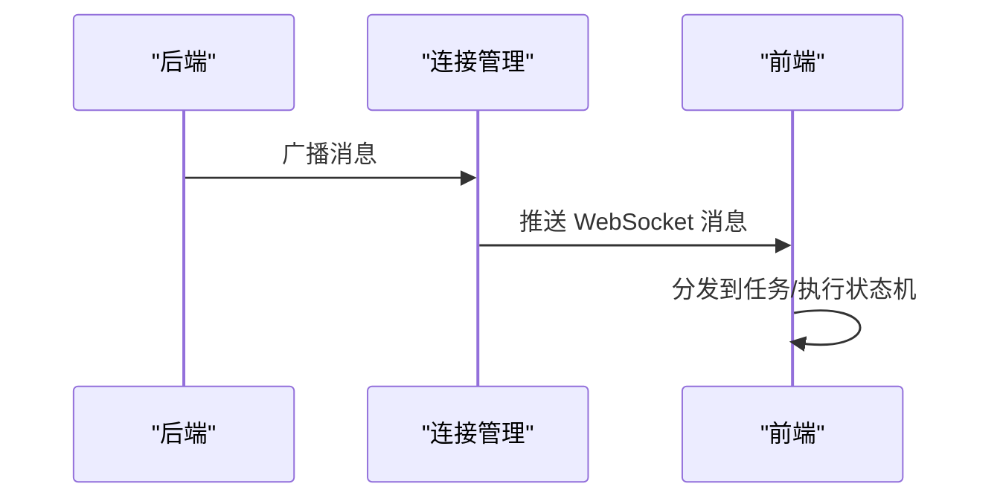
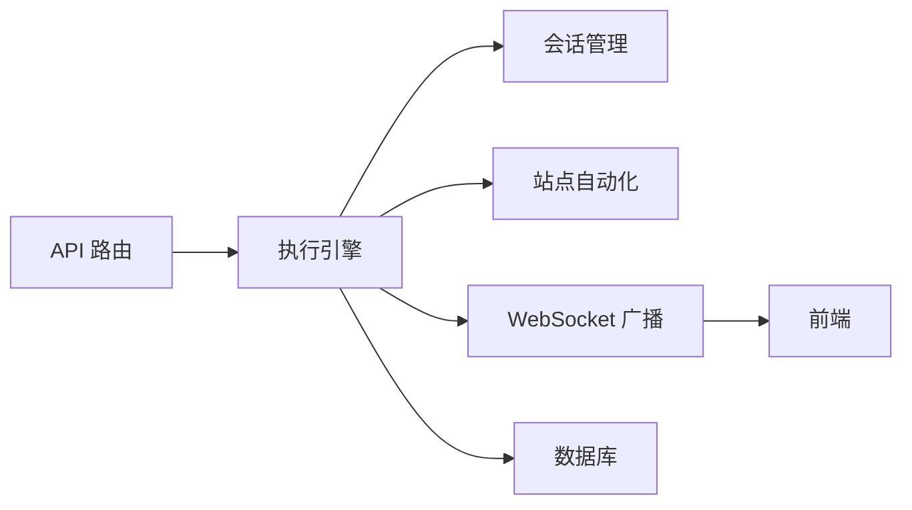

# 结构化数据抽取

<cite>
**本文档引用的文件**
- [main.py](file://CCC_RPA_API/app/main.py)
- [tasks.py](file://CCC_RPA_API/app/api/tasks.py)
- [executor.py](file://CCC_RPA_API/app/services/executor.py)
- [site_automation.py](file://CCC_RPA_API/app/browser/site_automation.py)
- [session_manager.py](file://CCC_RPA_API/app/browser/session_manager.py)
- [human_behavior.py](file://CCC_RPA_API/app/browser/human_behavior.py)
- [waiter.py](file://CCC_RPA_API/app/browser/waiter.py)
- [manager.py](file://CCC_RPA_API/app/ws/manager.py)
- [task.py](file://CCC_RPA_API/app/models/task.py)
- [execution_log.py](file://CCC_RPA_API/app/models/execution_log.py)
- [execution.py](file://CCC_RPA_API/app/schemas/execution.py)
- [project.md](file://project.md)
</cite>

## 目录
1. [简介](#简介)
2. [项目结构](#项目结构)
3. [核心组件](#核心组件)
4. [架构总览](#架构总览)
5. [详细组件分析](#详细组件分析)
6. [依赖分析](#依赖分析)
7. [性能考虑](#性能考虑)
8. [故障排查指南](#故障排查指南)
9. [结论](#结论)
10. [附录](#附录)

## 简介
本文件面向“结构化数据抽取”模块，聚焦于页面 DOM 解析、截图分析与自定义抽取规则的技术实现，系统性阐述数据抽取算法、规则引擎设计、JSON 结构化输出与数据验证机制，并结合表格识别、商品信息提取、表单数据获取与订单信息抽取的应用场景，提供抽取接口规范、规则配置示例与数据质量保证策略，帮助开发者快速理解并高效使用数据抽取系统。

## 项目结构
本项目采用五层架构：基础设施层（MySQL + Playwright）、浏览器自动化层、API 与实时通信层、前端交互层、桌面集成层。数据抽取能力主要位于浏览器自动化层与服务层，通过 Playwright 在受控环境中执行页面自动化，结合多级降级策略与真人行为模拟，实现稳定的数据抽取与结构化输出。

图表来源
- [project.md: 34-66:34-66](file://project.md#L34-L66)
- [project.md: 69-99:69-99](file://project.md#L69-L99)

章节来源
- [project.md: 13-31:13-31](file://project.md#L13-L31)
- [project.md: 159-260:159-260](file://project.md#L159-L260)

## 核心组件
- 浏览器会话管理：按省份隔离的 Playwright 会话，支持 storage_state 持久化与崩溃恢复。
- 页面自动化引擎：封装站点特定的自动化流程，包含登录检查、二维码截取、单位列表抓取、单位选择、页面保活与业务检测。
- 执行引擎：线程池驱动的任务执行器，负责任务生命周期管理、进度广播与错误处理。
- WebSocket 广播：后端向前端推送执行进度、二维码、单位列表与错误信息。
- 数据模型与日志：任务与执行日志的持久化，支撑数据质量追踪与审计。

章节来源
- [session_manager.py: 10-186:10-186](file://CCC_RPA_API/app/browser/session_manager.py#L10-L186)
- [site_automation.py: 16-743:16-743](file://CCC_RPA_API/app/browser/site_automation.py#L16-L743)
- [executor.py: 1-319:1-319](file://CCC_RPA_API/app/services/executor.py#L1-L319)
- [manager.py: 1-29:1-29](file://CCC_RPA_API/app/ws/manager.py#L1-L29)
- [task.py: 8-25:8-25](file://CCC_RPA_API/app/models/task.py#L8-L25)
- [execution_log.py: 7-17:7-17](file://CCC_RPA_API/app/models/execution_log.py#L7-L17)

## 架构总览
数据抽取系统以“任务驱动 + 浏览器自动化 + 规则引擎”的方式实现。前端通过 WebSocket 实时接收后端广播的消息，后端在专用线程中执行 Playwright 操作，确保与 asyncio 事件循环互不干扰。抽取过程遵循“多级降级策略 + 真人行为模拟 + 保活循环”的稳健设计，保障在复杂页面结构下的高成功率与稳定性。

图表来源
- [executor.py: 78-315:78-315](file://CCC_RPA_API/app/services/executor.py#L78-L315)
- [site_automation.py: 38-743:38-743](file://CCC_RPA_API/app/browser/site_automation.py#L38-L743)
- [manager.py: 17-26:17-26](file://CCC_RPA_API/app/ws/manager.py#L17-L26)

## 详细组件分析

### 浏览器会话管理（按省份隔离）
- 功能要点
  - 专用工作线程承载 Playwright 操作，避免与 asyncio 事件循环冲突。
  - 按省份维护独立的 BrowserContext，支持 storage_state 持久化与恢复。
  - 提供会话检查、恢复与关闭接口，确保浏览器崩溃后的自动恢复。
- 关键实现
  - 通过队列与 Event 机制串行执行浏览器操作，避免竞态。
  - storage_state 文件路径固定，便于调试与迁移。
- 线程模型
  - playwright-worker：执行 Playwright 操作。
  - task-exec ×3：执行任务逻辑。
  - wait-block ×3：阻塞等待用户交互。

图表来源
- [session_manager.py: 10-186:10-186](file://CCC_RPA_API/app/browser/session_manager.py#L10-L186)

章节来源
- [session_manager.py: 10-186:10-186](file://CCC_RPA_API/app/browser/session_manager.py#L10-L186)
- [project.md: 69-79:69-79](file://project.md#L69-L79)

### 页面自动化引擎（站点自动化）
- 功能要点
  - 登录状态检测、二维码截取与等待扫码。
  - 单位列表抓取：多级选择器降级策略，兼容不同页面结构。
  - 单位选择：多策略匹配（文本匹配、data-id、索引、JS 回退）。
  - 页面保活：非侵入式随机滚动、鼠标移动、键盘 Tab、阅读等待。
  - 业务检测：根据徽章与关键字检测待处理业务。
- 抽取算法与规则
  - 选择器降级策略：从卡片、列表、表格行到通用元素，逐步降低期望。
  - 文本分析：在找不到结构化元素时，从页面文本中提取单位名称与信用代码。
  - 匹配策略：优先文本匹配，其次属性匹配，最后索引回退。
- 截图分析
  - 关键步骤保存截图，便于问题定位与规则优化。
  - 二维码单独截图并返回 base64，前端直接渲染。

图表来源
- [site_automation.py: 194-291:194-291](file://CCC_RPA_API/app/browser/site_automation.py#L194-L291)

章节来源
- [site_automation.py: 38-743:38-743](file://CCC_RPA_API/app/browser/site_automation.py#L38-L743)
- [human_behavior.py: 12-86:12-86](file://CCC_RPA_API/app/browser/human_behavior.py#L12-L86)

### 执行引擎（任务生命周期）
- 功能要点
  - 任务状态机：pending → running → completed/failed。
  - 扫码登录、单位选择、保活循环、业务检测与执行。
  - 错误处理与广播：异常时更新任务状态并广播错误消息。
  - 资源清理：任务完成后清理等待信号与数据库连接。
- 关键流程
  - 初始化执行日志与任务状态。
  - 登录检查与扫码流程（若未登录）。
  - 抓取单位列表并等待前端选择。
  - 选择单位并登录，进入保活循环。
  - 检测业务并执行子任务，直至超时或取消。

图表来源
- [executor.py: 78-315:78-315](file://CCC_RPA_API/app/services/executor.py#L78-L315)

章节来源
- [executor.py: 1-319:1-319](file://CCC_RPA_API/app/services/executor.py#L1-L319)

### WebSocket 广播与前端交互
- 功能要点
  - 后端通过 ConnectionManager 广播执行进度、二维码、单位列表、登录结果与错误信息。
  - 前端通过 WebSocket 自动重连，接收并分发消息到任务与执行状态机。
- 消息类型
  - execution_progress：执行进度更新。
  - qr_code：推送二维码。
  - company_list：推送单位列表。
  - login_result：登录结果。
  - execution_error：执行错误。
  - task_status_update：任务状态变更。

图表来源
- [manager.py: 17-26:17-26](file://CCC_RPA_API/app/ws/manager.py#L17-L26)
- [project.md: 404-418:404-418](file://project.md#L404-L418)

章节来源
- [manager.py: 1-29:1-29](file://CCC_RPA_API/app/ws/manager.py#L1-L29)
- [project.md: 404-418:404-418](file://project.md#L404-L418)

### 数据模型与日志
- 任务模型（tasks 表）
  - 字段涵盖任务名称、状态、租户/设备/客户信息、省份、计划执行时间、备注与软删除标记。
- 执行日志模型（task_execution_log 表）
  - 记录任务执行的起止时间、状态与结果消息，支撑数据质量追踪。

章节来源
- [task.py: 8-25:8-25](file://CCC_RPA_API/app/models/task.py#L8-L25)
- [execution_log.py: 7-17:7-17](file://CCC_RPA_API/app/models/execution_log.py#L7-L17)

## 依赖分析
- 组件耦合
  - 执行引擎依赖会话管理与站点自动化，确保浏览器操作在专用线程中执行。
  - WebSocket 广播依赖 asyncio 事件循环，通过线程安全方式投递消息。
  - 前端通过 API 与 WebSocket 与后端交互，形成闭环。
- 外部依赖
  - Playwright：浏览器自动化与反检测。
  - FastAPI：REST 与 WebSocket。
  - MySQL：数据持久化。

图表来源
- [main.py: 24-27:24-27](file://CCC_RPA_API/app/main.py#L24-L27)
- [executor.py: 13-15:13-15](file://CCC_RPA_API/app/services/executor.py#L13-L15)
- [manager.py: 1-29:1-29](file://CCC_RPA_API/app/ws/manager.py#L1-L29)

章节来源
- [main.py: 1-127:1-127](file://CCC_RPA_API/app/main.py#L1-L127)
- [project.md: 69-99:69-99](file://project.md#L69-L99)

## 性能考虑
- 线程模型
  - 专用 Playwright 工作线程避免与 asyncio 事件循环冲突，提高稳定性。
  - 任务执行与等待分离，避免阻塞浏览器线程。
- 等待策略
  - 统一使用 domcontentloaded，减少网络空闲等待导致的超时。
  - 保活循环采用分段等待，便于及时响应取消信号。
- 反检测
  - 禁用 AutomationControlled 特征，模拟真人行为，降低被识别概率。

章节来源
- [project.md: 647-684:647-684](file://project.md#L647-L684)
- [site_automation.py: 557-680:557-680](file://CCC_RPA_API/app/browser/site_automation.py#L557-L680)

## 故障排查指南
- 浏览器崩溃恢复
  - 通过 check_alive 与 recover 机制自动重建会话，必要时重新打开页面。
- 扫码登录失败
  - 检查二维码截图是否成功生成，确认前端扫码完成通知是否到达后端。
- 单位列表抓取失败
  - 查看多级选择器降级日志，确认页面结构变化或尚未登录。
- 单位选择失败
  - 检查匹配策略日志，确认 company_id/公司名称是否正确传递。
- 保活循环异常
  - 检查保活操作日志，确认未触发非预期页面跳转或表单提交。

章节来源
- [executor.py: 42-69:42-69](file://CCC_RPA_API/app/services/executor.py#L42-L69)
- [site_automation.py: 147-192:147-192](file://CCC_RPA_API/app/browser/site_automation.py#L147-L192)
- [site_automation.py: 294-540:294-540](file://CCC_RPA_API/app/browser/site_automation.py#L294-L540)
- [site_automation.py: 614-680:614-680](file://CCC_RPA_API/app/browser/site_automation.py#L614-L680)

## 结论
本系统通过“按省份隔离的浏览器会话 + 多级降级策略 + 真人行为模拟 + 保活循环”的组合，实现了在复杂政府网站页面上的稳定数据抽取。结合 WebSocket 实时广播与完善的任务/日志模型，系统具备良好的可观测性与可维护性。未来可在规则引擎与 OCR 能力上进一步扩展，以支持更丰富的结构化输出场景。

## 附录

### 抽取接口规范
- 任务执行
  - POST /api/tasks/{id}/execute：触发任务执行，返回任务状态。
  - GET /api/tasks/{id}/logs：查询执行日志。
- 扫码与单位选择
  - POST /api/tasks/{id}/scan-complete：扫码完成通知。
  - POST /api/tasks/{id}/select-company：选择单位通知，携带 company_id 与 company_name。
- 取消执行
  - POST /api/tasks/{id}/cancel-execution：取消执行。

章节来源
- [project.md: 376-389:376-389](file://project.md#L376-L389)
- [tasks.py: 47-75:47-75](file://CCC_RPA_API/app/api/tasks.py#L47-L75)

### 规则配置示例（概念性）
- 选择器降级策略
  - 优先使用卡片/列表/表格行等结构性选择器，逐步降级到通用元素。
- 文本提取规则
  - 从页面文本中提取包含“公司/企业/单位”的行，尝试匹配统一社会信用代码。
- 匹配策略
  - 优先公司名称文本匹配，其次 data-id 属性匹配，最后索引回退。
- 截图与调试
  - 在关键步骤保存截图，便于规则优化与问题定位。

章节来源
- [site_automation.py: 213-291:213-291](file://CCC_RPA_API/app/browser/site_automation.py#L213-L291)
- [site_automation.py: 340-470:340-470](file://CCC_RPA_API/app/browser/site_automation.py#L340-L470)

### 数据质量保证
- 多级降级策略：提升抽取成功率。
- 截图与日志：便于问题定位与规则迭代。
- 保活循环：维持会话稳定，避免因超时导致的抽取中断。
- 任务与日志模型：记录执行全过程，支撑审计与回溯。

章节来源
- [project.md: 647-684:647-684](file://project.md#L647-L684)
- [task.py: 8-25:8-25](file://CCC_RPA_API/app/models/task.py#L8-L25)
- [execution_log.py: 7-17:7-17](file://CCC_RPA_API/app/models/execution_log.py#L7-L17)