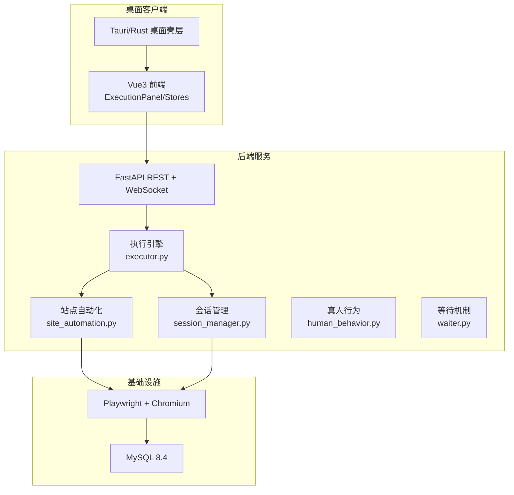
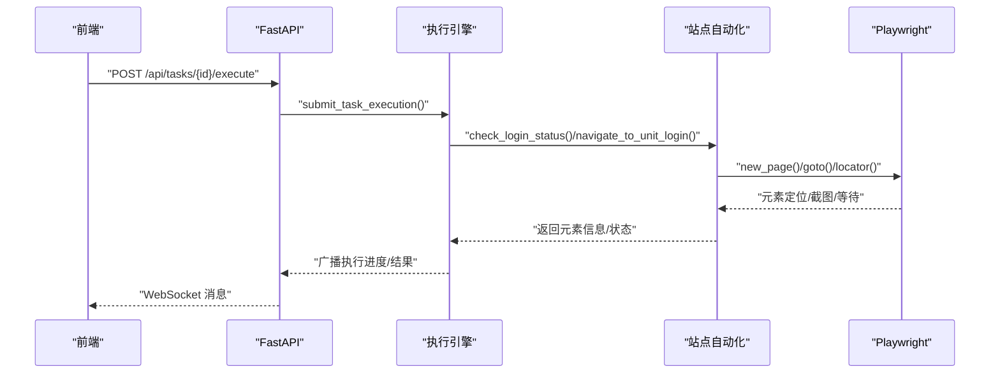
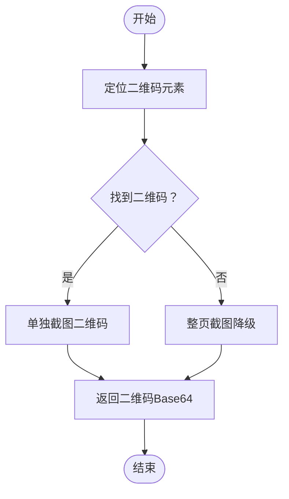
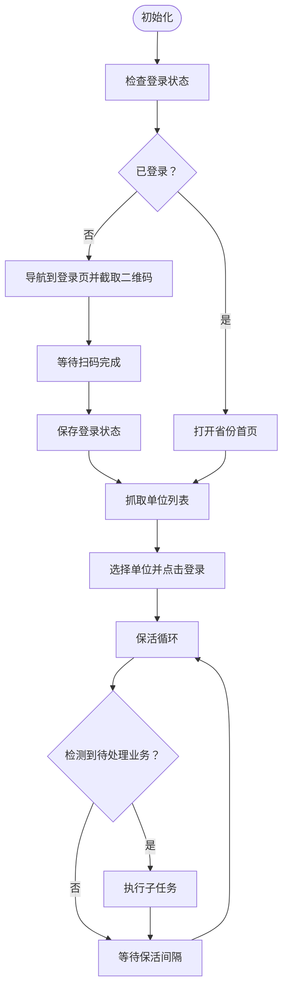
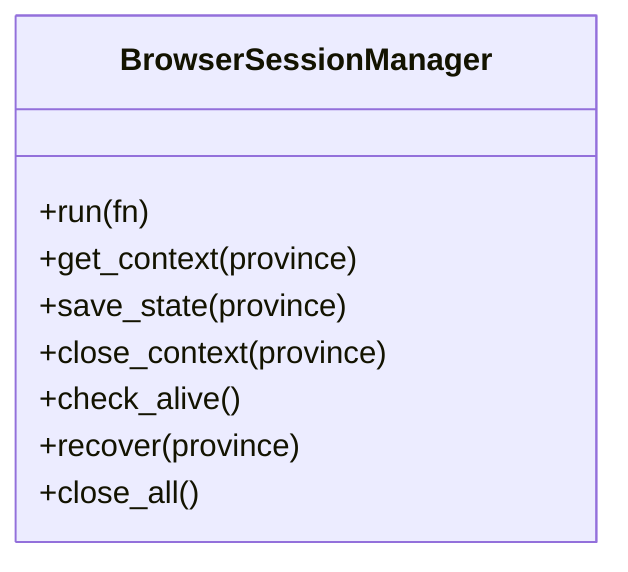
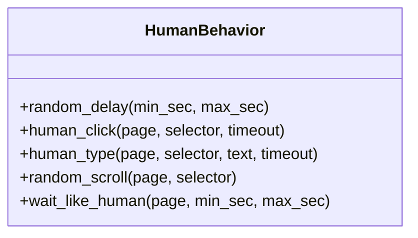
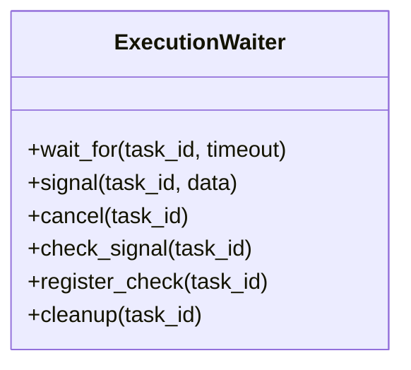
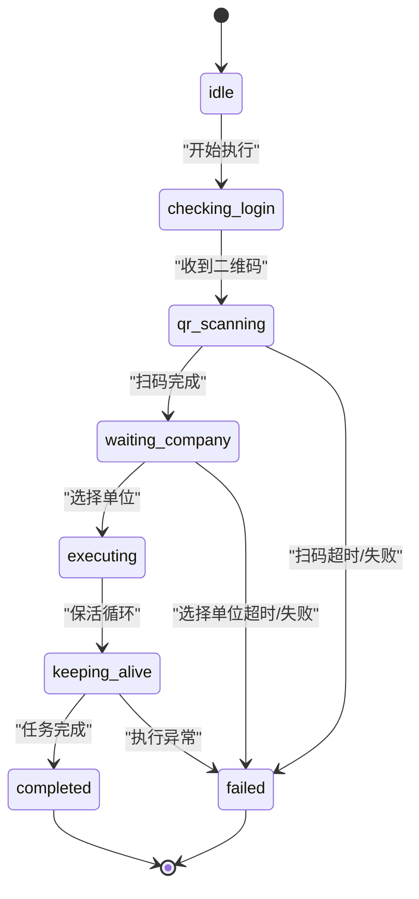
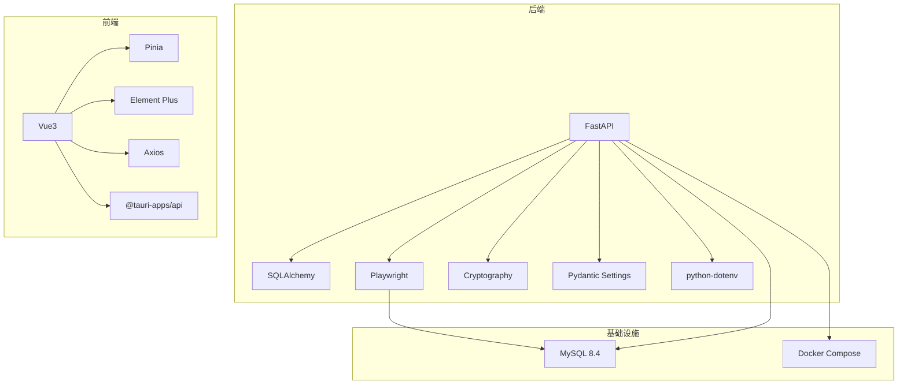

# 视觉识别系统

<cite>
**本文引用的文件**
- [main.py](file://CCC_RPA_API/app/main.py)
- [tasks.py](file://CCC_RPA_API/app/api/tasks.py)
- [executor.py](file://CCC_RPA_API/app/services/executor.py)
- [site_automation.py](file://CCC_RPA_API/app/browser/site_automation.py)
- [session_manager.py](file://CCC_RPA_API/app/browser/session_manager.py)
- [human_behavior.py](file://CCC_RPA_API/app/browser/human_behavior.py)
- [waiter.py](file://CCC_RPA_API/app/browser/waiter.py)
- [task.py](file://CCC_RPA_API/app/models/task.py)
- [tasks.ts](file://CCC-BrowserV4/frontend/src/api/tasks.ts)
- [execution.ts](file://CCC-BrowserV4/frontend/src/stores/execution.ts)
- [project.md](file://project.md)
- [requirements.txt](file://CCC_RPA_API/requirements.txt)
</cite>

## 目录
1. [简介](#简介)
2. [项目结构](#项目结构)
3. [核心组件](#核心组件)
4. [架构总览](#架构总览)
5. [详细组件分析](#详细组件分析)
6. [依赖分析](#依赖分析)
7. [性能考虑](#性能考虑)
8. [故障排查指南](#故障排查指南)
9. [结论](#结论)
10. [附录](#附录)

## 简介
本视觉识别系统并非直接基于 YOLOv8 或 OCR 的通用图像识别模块，而是围绕“政府交通管理网站（122.gov.cn）”的自动化执行流程，提供页面元素识别与交互能力。系统通过 Playwright 在 Chromium 中模拟真人操作，结合多级选择器与文本分析策略，实现按钮识别、输入框检测、弹窗定位与验证码区域识别等能力，支撑离线元素检测、页面元素识别与标准化坐标输出。

系统具备以下关键特性：
- 离线元素检测：基于 DOM 选择器与文本内容的元素定位，无需在线模型。
- 页面元素识别：多策略匹配（文本匹配、属性匹配、索引匹配、JS 回退）。
- 标准化坐标输出：返回元素边界盒坐标，便于上层交互或二次处理。
- 检测精度控制：多级降级策略与人工校验路径，确保高成功率。
- 实时性能保障：专用浏览器工作线程、线程池隔离与保活循环，降低延迟与提升稳定性。

## 项目结构
系统采用五层架构：基础设施层（MySQL + Playwright）、浏览器自动化层、API 与实时通信层、前端交互层、桌面集成层。视觉识别能力主要体现在浏览器自动化层的页面元素识别与交互模块。

图表来源
- [project.md:34-100](file://project.md#L34-L100)
- [requirements.txt:1-11](file://CCC_RPA_API/requirements.txt#L1-L11)

章节来源
- [project.md:13-100](file://project.md#L13-L100)

## 核心组件
- 执行引擎（executor.py）：任务生命周期管理、浏览器初始化、扫码登录、单位选择、保活循环与业务检测。
- 站点自动化（site_automation.py）：页面元素识别与交互的核心实现，包含多级选择器降级策略、弹窗处理与业务检测。
- 会话管理（session_manager.py）：按省份隔离的浏览器上下文管理，持久化 storage_state，崩溃恢复。
- 真人行为（human_behavior.py）：模拟点击、输入、滚动与等待，降低被反爬虫检测的风险。
- 等待机制（waiter.py）：基于线程事件的暂停/恢复/取消，支持阻塞等待与非阻塞检查。
- 前端执行状态机（execution.ts）：将后端 WebSocket 消息映射为前端执行状态，支持演示模式。

章节来源
- [executor.py:78-319](file://CCC_RPA_API/app/services/executor.py#L78-L319)
- [site_automation.py:16-743](file://CCC_RPA_API/app/browser/site_automation.py#L16-L743)
- [session_manager.py:10-186](file://CCC_RPA_API/app/browser/session_manager.py#L10-L186)
- [human_behavior.py:12-86](file://CCC_RPA_API/app/browser/human_behavior.py#L12-L86)
- [waiter.py:7-84](file://CCC_RPA_API/app/browser/waiter.py#L7-L84)
- [execution.ts:1-229](file://CCC-BrowserV4/frontend/src/stores/execution.ts#L1-L229)

## 架构总览
系统通过 FastAPI 提供 REST 与 WebSocket 接口，后端在专用线程中执行 Playwright 操作，前端通过 WebSocket 实时接收执行进度与结果。视觉识别能力以“元素定位 + 坐标输出”的形式嵌入到站点自动化流程中。

图表来源
- [project.md:474-547](file://project.md#L474-L547)
- [executor.py:78-319](file://CCC_RPA_API/app/services/executor.py#L78-L319)
- [site_automation.py:38-146](file://CCC_RPA_API/app/browser/site_automation.py#L38-L146)

## 详细组件分析

### 组件A：站点自动化（页面元素识别与交互）
站点自动化模块是视觉识别能力的核心实现，包含以下关键能力：
- 按钮识别：通过多级选择器与文本匹配，定位“登录”、“刷新”等按钮。
- 输入框检测：通过选择器与属性匹配，定位可输入元素。
- 弹窗定位：自动识别并关闭意外弹窗，减少干扰。
- 验证码区域识别：优先定位二维码元素，降级为整页截图，便于前端展示。
- 标准化坐标输出：返回元素边界盒坐标，便于上层交互。

图表来源
- [site_automation.py:148-173](file://CCC_RPA_API/app/browser/site_automation.py#L148-L173)

章节来源
- [site_automation.py:148-173](file://CCC_RPA_API/app/browser/site_automation.py#L148-L173)

### 组件B：执行引擎（任务生命周期与保活循环）
执行引擎负责任务的完整生命周期，包含浏览器初始化、扫码登录、单位选择、保活循环与业务检测。保活循环中，站点自动化执行非侵入式操作，自动关闭意外弹窗，并检测待处理业务。

图表来源
- [project.md:474-547](file://project.md#L474-L547)
- [executor.py:78-319](file://CCC_RPA_API/app/services/executor.py#L78-L319)
- [site_automation.py:542-743](file://CCC_RPA_API/app/browser/site_automation.py#L542-L743)

章节来源
- [executor.py:78-319](file://CCC_RPA_API/app/services/executor.py#L78-L319)
- [site_automation.py:542-743](file://CCC_RPA_API/app/browser/site_automation.py#L542-L743)

### 组件C：会话管理（按省份隔离与崩溃恢复）
会话管理模块为每个省份维护独立的浏览器上下文，持久化 storage_state，支持崩溃恢复与多线程安全调用。

图表来源
- [session_manager.py:10-186](file://CCC_RPA_API/app/browser/session_manager.py#L10-L186)

章节来源
- [session_manager.py:10-186](file://CCC_RPA_API/app/browser/session_manager.py#L10-L186)

### 组件D：真人行为（反检测策略）
真人行为模块通过随机延迟、随机点击位置、随机打字速度与随机滚动，降低被反爬虫检测的风险。

图表来源
- [human_behavior.py:12-86](file://CCC_RPA_API/app/browser/human_behavior.py#L12-L86)

章节来源
- [human_behavior.py:12-86](file://CCC_RPA_API/app/browser/human_behavior.py#L12-L86)

### 组件E：等待机制（暂停/恢复/取消）
等待机制基于线程事件实现，支持阻塞等待与非阻塞检查，避免阻塞浏览器工作线程。

图表来源
- [waiter.py:7-84](file://CCC_RPA_API/app/browser/waiter.py#L7-L84)

章节来源
- [waiter.py:7-84](file://CCC_RPA_API/app/browser/waiter.py#L7-L84)

### 组件F：前端执行状态机（WebSocket 消息分发）
前端执行状态机将后端 WebSocket 消息映射为执行状态，支持演示模式与错误处理。

图表来源
- [project.md:548-557](file://project.md#L548-L557)
- [execution.ts:1-229](file://CCC-BrowserV4/frontend/src/stores/execution.ts#L1-L229)

章节来源
- [execution.ts:1-229](file://CCC-BrowserV4/frontend/src/stores/execution.ts#L1-L229)

## 依赖分析
系统依赖关系如下：
- 后端依赖：FastAPI、SQLAlchemy、Playwright、Cryptography、Pydantic Settings、python-dotenv。
- 前端依赖：Vue3、Pinia、Element Plus、Axios、@tauri-apps/api、Vite、TypeScript。
- 基础设施：MySQL 8.4、Docker Compose。

图表来源
- [requirements.txt:1-11](file://CCC_RPA_API/requirements.txt#L1-L11)
- [project.md:102-156](file://project.md#L102-L156)

章节来源
- [requirements.txt:1-11](file://CCC_RPA_API/requirements.txt#L1-L11)
- [project.md:102-156](file://project.md#L102-L156)

## 性能考虑
- 专用浏览器工作线程：所有 Playwright 操作在专用线程中执行，避免与 asyncio 事件循环冲突。
- 线程池隔离：任务执行线程池与等待线程池分离，提高并发与响应性。
- 非侵入式保活：保活操作仅限小幅度滚动、鼠标移动、键盘 Tab 与模拟阅读等待，降低页面负载。
- 多级降级策略：DOM 选择器失败时自动降级为文本分析，提升鲁棒性。
- 反检测策略：禁用 AutomationControlled 特征，覆写 navigator.webdriver，模拟真人鼠标轨迹。

章节来源
- [project.md:640-713](file://project.md#L640-L713)
- [site_automation.py:557-743](file://CCC_RPA_API/app/browser/site_automation.py#L557-L743)
- [session_manager.py:10-186](file://CCC_RPA_API/app/browser/session_manager.py#L10-L186)

## 故障排查指南
- 浏览器崩溃恢复：会话管理器检测浏览器存活状态，崩溃时自动恢复并重新打开页面。
- 扫码登录失败：检查二维码元素是否存在、网络状态与超时设置；必要时降级为整页截图。
- 单位选择失败：确认选择器匹配策略与合成索引处理；必要时启用 JS 回退匹配。
- 保活循环异常：检查非侵入式保活操作是否被业务页面覆盖；确保意外弹窗被正确关闭。
- WebSocket 断线：前端自动重连（3 秒间隔），检查后端广播线程与主事件循环状态。

章节来源
- [executor.py:42-70](file://CCC_RPA_API/app/services/executor.py#L42-L70)
- [site_automation.py:294-541](file://CCC_RPA_API/app/browser/site_automation.py#L294-L541)
- [execution.ts:1-229](file://CCC-BrowserV4/frontend/src/stores/execution.ts#L1-L229)

## 结论
本视觉识别系统通过“页面元素识别 + 标准化坐标输出”的方式，实现了对政府交通管理网站关键元素的稳定定位与交互。系统采用多级降级策略与真人行为模拟，兼顾精度与稳定性；通过专用线程与线程池隔离，保障实时性能。尽管未直接集成 YOLOv8 或 OCR，但其 DOM 选择器与文本分析策略足以满足当前业务场景下的元素检测与交互需求。

## 附录

### 接口规范与识别结果格式
- 扫码完成通知：后端广播二维码 Base64，前端显示并提示用户扫码。
- 单位列表推送：后端推送单位列表，前端展示供用户选择。
- 执行进度与错误：后端通过 WebSocket 推送执行进度与错误信息。
- 识别结果格式：元素边界盒坐标（x, y, width, height），便于上层交互或二次处理。

章节来源
- [project.md:366-419](file://project.md#L366-L419)
- [site_automation.py:148-173](file://CCC_RPA_API/app/browser/site_automation.py#L148-L173)

### 应用场景示例
- 按钮识别：登录、刷新、关闭等按钮的定位与点击。
- 输入框检测：单位名称输入框的定位与模拟输入。
- 弹窗定位：意外弹窗的自动关闭，避免影响后续流程。
- 验证码区域识别：二维码元素的定位与截图，支持前端展示。

章节来源
- [site_automation.py:476-534](file://CCC_RPA_API/app/browser/site_automation.py#L476-L534)
- [execution.ts:1-229](file://CCC-BrowserV4/frontend/src/stores/execution.ts#L1-L229)