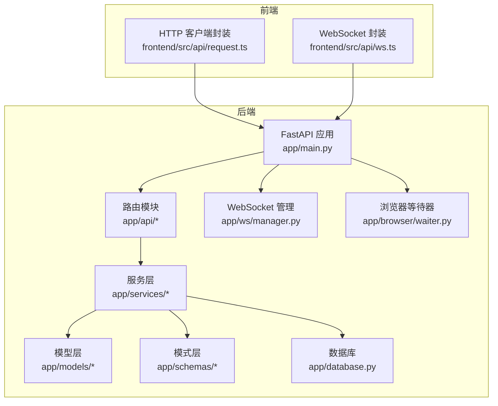
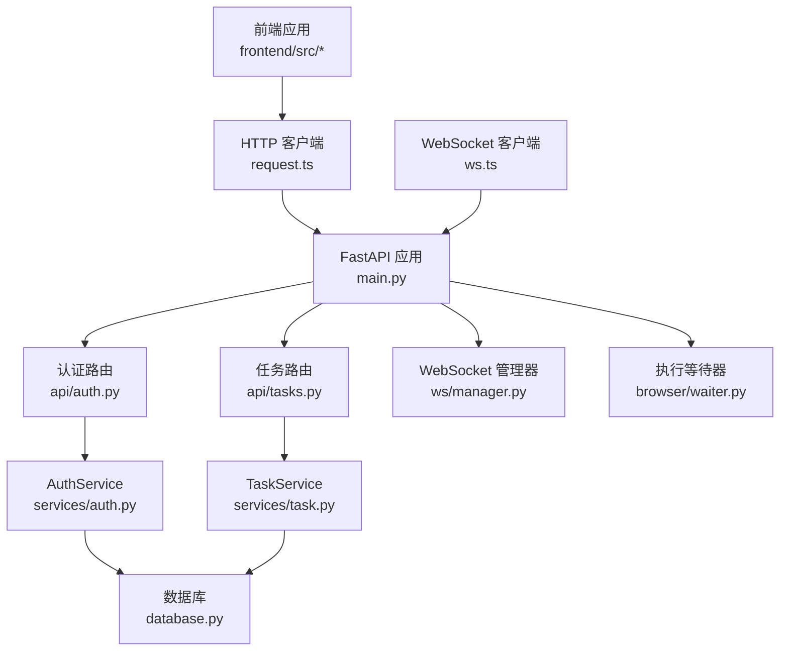
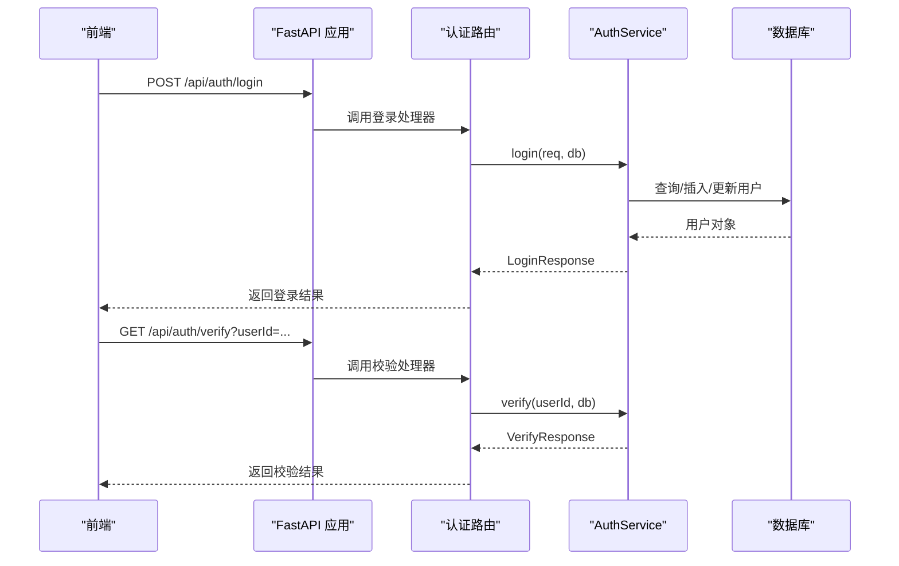
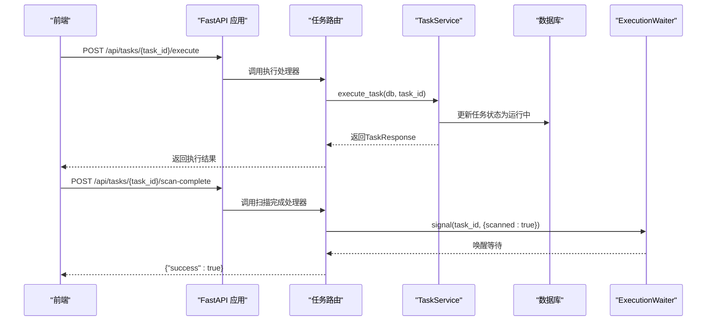
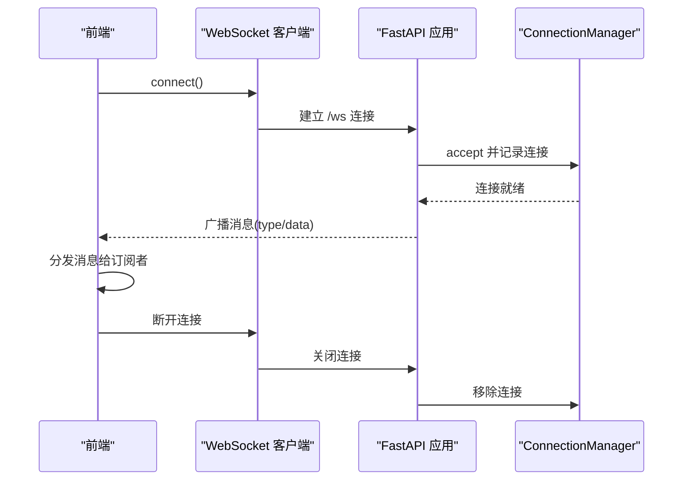
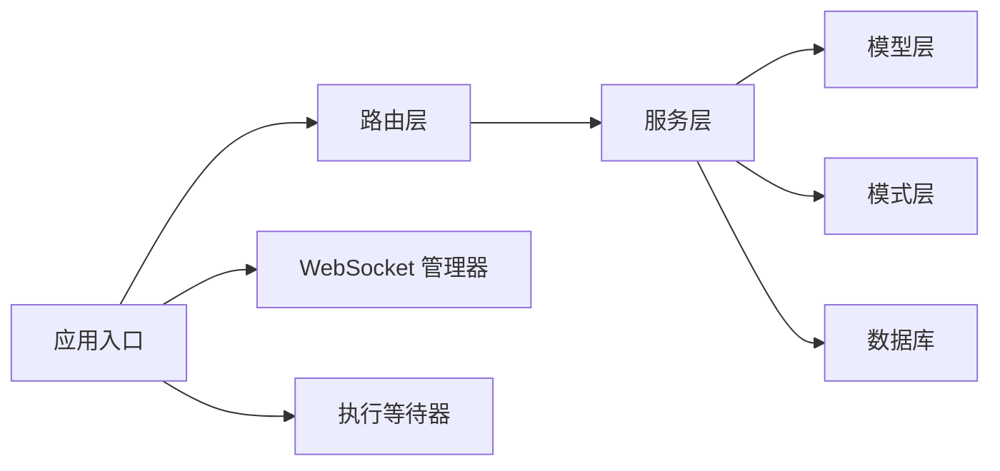

# API网关设计

<cite>
**本文档引用的文件**
- [main.py](file://CCC_RPA_API/app/main.py)
- [tasks.py](file://CCC_RPA_API/app/api/tasks.py)
- [auth.py](file://CCC_RPA_API/app/api/auth.py)
- [manager.py](file://CCC_RPA_API/app/ws/manager.py)
- [task.py](file://CCC_RPA_API/app/models/task.py)
- [user.py](file://CCC_RPA_API/app/models/user.py)
- [base.py](file://CCC_RPA_API/app/models/base.py)
- [database.py](file://CCC_RPA_API/app/database.py)
- [task.py](file://CCC_RPA_API/app/schemas/task.py)
- [auth.py](file://CCC_RPA_API/app/schemas/auth.py)
- [task.py](file://CCC_RPA_API/app/services/task.py)
- [auth.py](file://CCC_RPA_API/app/services/auth.py)
- [waiter.py](file://CCC_RPA_API/app/browser/waiter.py)
- [request.ts](file://CCC-BrowserV4/frontend/src/api/request.ts)
- [ws.ts](file://CCC-BrowserV4/frontend/src/api/ws.ts)
</cite>

## 目录
1. [引言](#引言)
2. [项目结构](#项目结构)
3. [核心组件](#核心组件)
4. [架构总览](#架构总览)
5. [详细组件分析](#详细组件分析)
6. [依赖分析](#依赖分析)
7. [性能考虑](#性能考虑)
8. [故障排查指南](#故障排查指南)
9. [结论](#结论)
10. [附录](#附录)

## 引言
本文件面向API网关的设计与实现，围绕统一RESTful接口、WebSocket实时通信、统一鉴权机制与接口限流策略进行系统化说明。同时给出API根路径规范、请求/响应格式、错误码标准以及OpenAPI 3.0文档生成建议，帮助开发者快速理解并正确使用网关能力。

## 项目结构
后端基于FastAPI构建，采用模块化组织：路由层(APIRouter)、服务层(Service)、模型层(SQLAlchemy)、模式层(Pydantic)、WebSocket连接管理与浏览器会话等待器。前端通过Axios封装基础请求，WebSocket封装连接与重连逻辑。

图表来源
- [main.py:12-27](file://CCC_RPA_API/app/main.py#L12-L27)
- [tasks.py:10](file://CCC_RPA_API/app/api/tasks.py#L10)
- [auth.py:7](file://CCC_RPA_API/app/api/auth.py#L7)
- [manager.py:5-28](file://CCC_RPA_API/app/ws/manager.py#L5-L28)
- [database.py:1-19](file://CCC_RPA_API/app/database.py#L1-L19)
- [request.ts:3-6](file://CCC-BrowserV4/frontend/src/api/request.ts#L3-L6)
- [ws.ts:15-18](file://CCC-BrowserV4/frontend/src/api/ws.ts#L15-L18)

章节来源
- [main.py:12-27](file://CCC_RPA_API/app/main.py#L12-L27)
- [database.py:1-19](file://CCC_RPA_API/app/database.py#L1-L19)
- [request.ts:3-6](file://CCC-BrowserV4/frontend/src/api/request.ts#L3-L6)
- [ws.ts:15-18](file://CCC-BrowserV4/frontend/src/api/ws.ts#L15-L18)

## 核心组件
- RESTful API 路由
  - 认证路由：登录、登出、校验
  - 任务路由：列表、创建、查询、更新、删除、执行、日志、扫描完成、选择公司、取消执行
- WebSocket 实时通道
  - 连接管理、广播消息、自动重连
- 统一鉴权机制
  - 用户模型、登录/登出/校验服务
- 接口限流策略
  - 当前未内置限流中间件，建议在网关或应用层引入速率限制中间件
- 数据模型与序列化
  - 任务、用户模型；任务/认证相关Pydantic模式
- 浏览器执行等待器
  - 任务执行过程中的交互式暂停/恢复

章节来源
- [auth.py:10-23](file://CCC_RPA_API/app/api/auth.py#L10-L23)
- [tasks.py:13-75](file://CCC_RPA_API/app/api/tasks.py#L13-L75)
- [manager.py:5-28](file://CCC_RPA_API/app/ws/manager.py#L5-L28)
- [task.py:8-25](file://CCC_RPA_API/app/models/task.py#L8-L25)
- [user.py:7-17](file://CCC_RPA_API/app/models/user.py#L7-L17)
- [task.py:5-58](file://CCC_RPA_API/app/schemas/task.py#L5-L58)
- [auth.py:5-26](file://CCC_RPA_API/app/schemas/auth.py#L5-L26)
- [task.py:44-157](file://CCC_RPA_API/app/services/task.py#L44-L157)
- [auth.py:6-58](file://CCC_RPA_API/app/services/auth.py#L6-L58)
- [waiter.py:7-84](file://CCC_RPA_API/app/browser/waiter.py#L7-L84)

## 架构总览
下图展示从客户端到后端各层的调用关系与职责边界。

图表来源
- [main.py:12-27](file://CCC_RPA_API/app/main.py#L12-L27)
- [auth.py:10-23](file://CCC_RPA_API/app/api/auth.py#L10-L23)
- [tasks.py:13-75](file://CCC_RPA_API/app/api/tasks.py#L13-L75)
- [task.py:44-157](file://CCC_RPA_API/app/services/task.py#L44-L157)
- [auth.py:6-58](file://CCC_RPA_API/app/services/auth.py#L6-L58)
- [database.py:1-19](file://CCC_RPA_API/app/database.py#L1-L19)
- [manager.py:5-28](file://CCC_RPA_API/app/ws/manager.py#L5-L28)
- [waiter.py:7-84](file://CCC_RPA_API/app/browser/waiter.py#L7-L84)
- [request.ts:3-6](file://CCC-BrowserV4/frontend/src/api/request.ts#L3-L6)
- [ws.ts:15-18](file://CCC-BrowserV4/frontend/src/api/ws.ts#L15-L18)

## 详细组件分析

### RESTful API 设计规范
- API 根路径
  - 后端路由前缀统一为 /api/{module}，如 /api/auth、/api/tasks
  - 前端HTTP客户端baseURL设置为 /api，便于统一转发
- 请求/响应格式
  - 统一使用 Pydantic 模型定义请求体与响应体
  - 错误通过HTTP状态码与异常抛出，前端以响应拦截器处理
- 错误码标准
  - 404：资源不存在（任务删除/查询）
  - 400：业务错误（执行任务时返回的错误信息）
  - 5xx：服务器内部错误（数据库异常、未捕获异常）

章节来源
- [tasks.py:13-75](file://CCC_RPA_API/app/api/tasks.py#L13-L75)
- [auth.py:10-23](file://CCC_RPA_API/app/api/auth.py#L10-L23)
- [request.ts:3-6](file://CCC-BrowserV4/frontend/src/api/request.ts#L3-L6)

### 认证与授权
- 登录
  - 路径：POST /api/auth/login
  - 输入：client_id、token、device_id、username（可选）
  - 输出：userId、username、token
  - 行为：若用户不存在则创建，否则更新token/device_id/用户名
- 登出
  - 路径：POST /api/auth/logout
  - 输入：userId
  - 输出：{"message": "登出成功"}
  - 行为：将用户标记为非活跃
- 校验
  - 路径：GET /api/auth/verify?userId=...
  - 输出：valid、userId、username（当有效时）

图表来源
- [auth.py:10-23](file://CCC_RPA_API/app/api/auth.py#L10-L23)
- [auth.py:6-58](file://CCC_RPA_API/app/services/auth.py#L6-L58)
- [user.py:7-17](file://CCC_RPA_API/app/models/user.py#L7-L17)
- [database.py:13-19](file://CCC_RPA_API/app/database.py#L13-L19)

章节来源
- [auth.py:10-23](file://CCC_RPA_API/app/api/auth.py#L10-L23)
- [auth.py:6-58](file://CCC_RPA_API/app/services/auth.py#L6-L58)
- [user.py:7-17](file://CCC_RPA_API/app/models/user.py#L7-L17)
- [database.py:13-19](file://CCC_RPA_API/app/database.py#L13-L19)

### 任务管理
- 列表查询
  - 路径：GET /api/tasks
  - 查询参数：keyword、status、page、page_size
  - 输出：分页列表（items、total、page、page_size）
- 新增任务
  - 路径：POST /api/tasks
  - 输入：TaskCreate（含子任务列表、省/市等）
  - 输出：TaskResponse
- 获取任务
  - 路径：GET /api/tasks/{task_id}
- 更新任务
  - 路径：PUT /api/tasks/{task_id}
  - 输入：TaskUpdate（部分字段可选）
- 删除任务
  - 路径：DELETE /api/tasks/{task_id}
  - 输出：{"message": "删除成功"}
- 执行任务
  - 路径：POST /api/tasks/{task_id}/execute
  - 输出：TaskResponse（状态置为运行中）
- 查看日志
  - 路径：GET /api/tasks/{task_id}/logs?page=&page_size=
  - 输出：ExecutionLogListResponse
- 交互式控制
  - 扫描完成：POST /api/tasks/{task_id}/scan-complete
  - 选择公司：POST /api/tasks/{task_id}/select-company（请求体：CompanySelectRequest）
  - 取消执行：POST /api/tasks/{task_id}/cancel-execution

图表来源
- [tasks.py:47-75](file://CCC_RPA_API/app/api/tasks.py#L47-L75)
- [task.py:120-133](file://CCC_RPA_API/app/services/task.py#L120-L133)
- [waiter.py:35-43](file://CCC_RPA_API/app/browser/waiter.py#L35-L43)

章节来源
- [tasks.py:13-75](file://CCC_RPA_API/app/api/tasks.py#L13-L75)
- [task.py:44-157](file://CCC_RPA_API/app/services/task.py#L44-L157)
- [task.py:5-58](file://CCC_RPA_API/app/schemas/task.py#L5-L58)
- [task.py:8-25](file://CCC_RPA_API/app/models/task.py#L8-L25)
- [waiter.py:7-84](file://CCC_RPA_API/app/browser/waiter.py#L7-L84)

### WebSocket 实时通信
- 连接入口
  - 路径：/ws（WebSocket）
  - 服务端接收连接并交由连接管理器维护
- 连接管理
  - ConnectionManager：接受连接、维护连接字典、广播消息、清理失效连接
- 前端集成
  - 自动协议切换（ws/wss）、自动重连、消息分发
- 实时状态同步
  - 通过广播消息向所有连接的客户端推送状态更新（例如任务执行进度/结果）

图表来源
- [main.py:119-127](file://CCC_RPA_API/app/main.py#L119-L127)
- [manager.py:10-26](file://CCC_RPA_API/app/ws/manager.py#L10-L26)
- [ws.ts:20-56](file://CCC-BrowserV4/frontend/src/api/ws.ts#L20-L56)

章节来源
- [main.py:119-127](file://CCC_RPA_API/app/main.py#L119-L127)
- [manager.py:5-28](file://CCC_RPA_API/app/ws/manager.py#L5-L28)
- [ws.ts:8-88](file://CCC-BrowserV4/frontend/src/api/ws.ts#L8-L88)

### OpenAPI 3.0 文档生成
- 应用标题与版本
  - 在FastAPI实例上设置title与version，自动生成OpenAPI元数据
- 路由标签
  - 使用tags为不同模块添加语义标签（如“认证”、“站点任务”）
- 模式驱动
  - Pydantic模型自动映射为JSON Schema，生成请求/响应文档
- 生成与访问
  - 启动应用后可通过 /openapi.json 或 /docs（Swagger UI）查看

章节来源
- [main.py:12](file://CCC_RPA_API/app/main.py#L12)
- [auth.py:7](file://CCC_RPA_API/app/api/auth.py#L7)
- [tasks.py:10](file://CCC_RPA_API/app/api/tasks.py#L10)

### 接口限流策略
- 当前实现
  - 未发现内置速率限制中间件或装饰器
- 建议方案
  - 在FastAPI中间件层引入限流组件（如基于Redis的令牌桶/滑动窗口）
  - 对高频接口（如任务日志、WebSocket广播）单独配置阈值
  - 结合IP/用户维度进行限流
- 配置要点
  - 区分读写接口限流强度
  - 提供白名单与熔断保护
  - 记录限流指标以便运维观测

[本节为通用实践建议，无需特定文件引用]

## 依赖分析
- 组件耦合
  - 路由层仅依赖服务层；服务层依赖模型层与数据库会话；WebSocket管理器独立于业务逻辑
- 外部依赖
  - FastAPI、SQLAlchemy、Pydantic、Axios、WebSocket
- 循环依赖
  - 未见循环导入；模块间通过依赖注入解耦

图表来源
- [main.py:12-27](file://CCC_RPA_API/app/main.py#L12-L27)
- [task.py:44-157](file://CCC_RPA_API/app/services/task.py#L44-L157)
- [auth.py:6-58](file://CCC_RPA_API/app/services/auth.py#L6-L58)
- [database.py:1-19](file://CCC_RPA_API/app/database.py#L1-L19)
- [manager.py:5-28](file://CCC_RPA_API/app/ws/manager.py#L5-L28)
- [waiter.py:7-84](file://CCC_RPA_API/app/browser/waiter.py#L7-L84)

章节来源
- [main.py:12-27](file://CCC_RPA_API/app/main.py#L12-L27)
- [database.py:1-19](file://CCC_RPA_API/app/database.py#L1-L19)

## 性能考虑
- 数据库连接池
  - 使用预热与回收参数，避免长事务占用连接
- 序列化开销
  - Pydantic模型序列化为JSON时注意字段数量与嵌套深度
- WebSocket 广播
  - 广播前先尝试发送，失败则清理连接，降低无效IO
- 任务执行
  - 执行状态更新与日志写入分离，避免阻塞主线程

[本节提供通用指导，无需特定文件引用]

## 故障排查指南
- 常见问题
  - 404：确认资源ID是否存在且未软删除
  - 400：执行任务返回的错误信息需结合日志定位
  - WebSocket断连：检查前端重连逻辑与服务端广播异常
- 排查步骤
  - 启用服务端日志，观察数据库操作与异常栈
  - 前端打印响应拦截器错误，定位网络层问题
  - 使用 /health 接口确认服务健康状态

章节来源
- [main.py:114-116](file://CCC_RPA_API/app/main.py#L114-L116)
- [request.ts:9-15](file://CCC-BrowserV4/frontend/src/api/request.ts#L9-L15)
- [manager.py:17-26](file://CCC_RPA_API/app/ws/manager.py#L17-L26)

## 结论
本API网关以FastAPI为核心，结合Pydantic与SQLAlchemy实现了清晰的分层架构。认证、任务管理与WebSocket实时通道覆盖了RPA场景的核心需求。建议后续补充统一鉴权中间件、接口限流与更完善的错误码体系，并持续完善OpenAPI文档以提升可维护性与可观测性。

## 附录

### API 规范速查
- 认证
  - POST /api/auth/login → LoginResponse
  - POST /api/auth/logout → {"message": "..."}
  - GET /api/auth/verify → VerifyResponse
- 任务
  - GET /api/tasks → TaskListResponse
  - POST /api/tasks → TaskResponse
  - GET /api/tasks/{task_id} → TaskResponse
  - PUT /api/tasks/{task_id} → TaskResponse
  - DELETE /api/tasks/{task_id} → {"message": "..."}
  - POST /api/tasks/{task_id}/execute → TaskResponse
  - GET /api/tasks/{task_id}/logs → ExecutionLogListResponse
  - POST /api/tasks/{task_id}/scan-complete → {"success": true}
  - POST /api/tasks/{task_id}/select-company → {"success": true}
  - POST /api/tasks/{task_id}/cancel-execution → {"success": true}

章节来源
- [auth.py:10-23](file://CCC_RPA_API/app/api/auth.py#L10-L23)
- [tasks.py:13-75](file://CCC_RPA_API/app/api/tasks.py#L13-L75)

### 请求/响应示例（路径参考）
- 登录请求体
  - 参考：[auth.py:5-10](file://CCC_RPA_API/app/schemas/auth.py#L5-L10)
- 登录响应体
  - 参考：[auth.py:12-16](file://CCC_RPA_API/app/schemas/auth.py#L12-L16)
- 任务创建请求体
  - 参考：[task.py:5-14](file://CCC_RPA_API/app/schemas/task.py#L5-L14)
- 任务列表响应体
  - 参考：[task.py:53-58](file://CCC_RPA_API/app/schemas/task.py#L53-L58)

### WebSocket 消息格式
- 前端消息结构
  - 参考：[ws.ts:1-4](file://CCC-BrowserV4/frontend/src/api/ws.ts#L1-L4)
- 服务端广播消息
  - 参考：[manager.py:17-18](file://CCC_RPA_API/app/ws/manager.py#L17-L18)