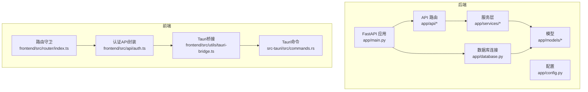
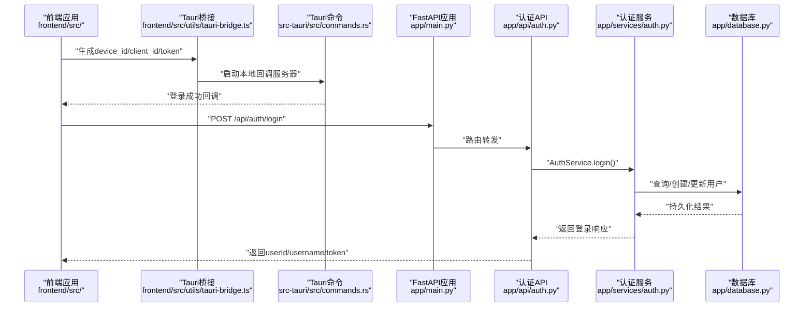
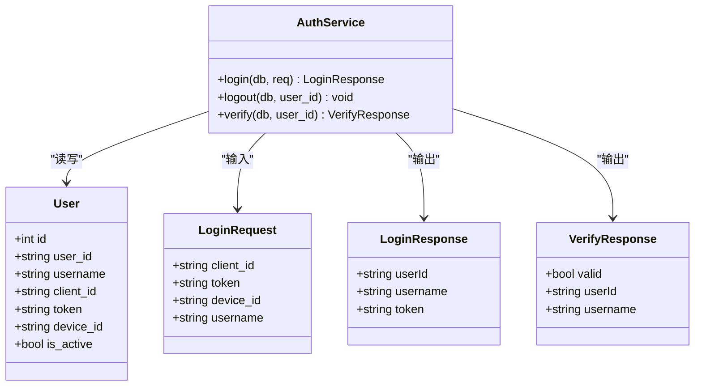
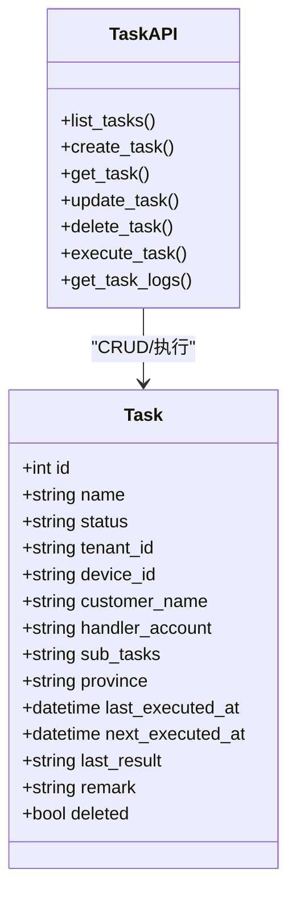
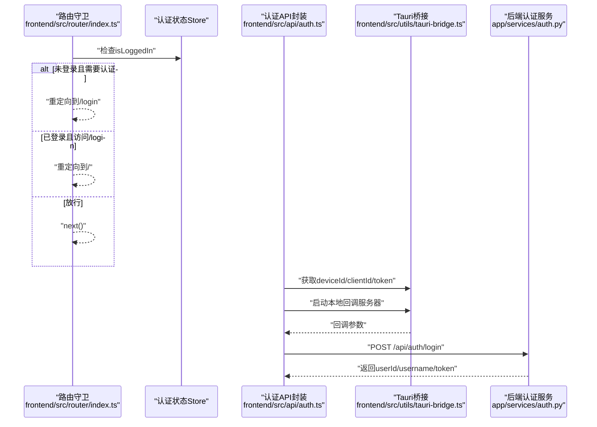
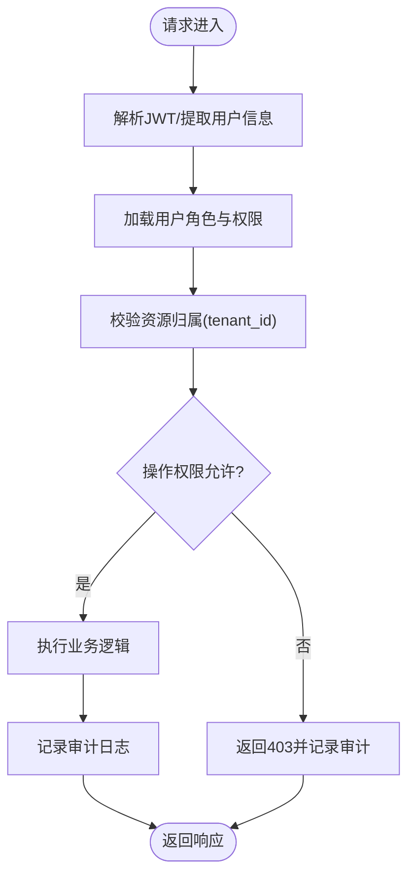
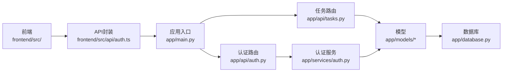

# RBAC权限控制

<cite>
**本文档引用的文件**
- [app/main.py](file://CCC_RPA_API/app/main.py)
- [app/config.py](file://CCC_RPA_API/app/config.py)
- [app/database.py](file://CCC_RPA_API/app/database.py)
- [app/models/user.py](file://CCC_RPA_API/app/models/user.py)
- [app/models/task.py](file://CCC_RPA_API/app/models/task.py)
- [app/models/base.py](file://CCC_RPA_API/app/models/base.py)
- [app/models/execution_log.py](file://CCC_RPA_API/app/models/execution_log.py)
- [app/api/auth.py](file://CCC_RPA_API/app/api/auth.py)
- [app/api/tasks.py](file://CCC_RPA_API/app/api/tasks.py)
- [app/schemas/auth.py](file://CCC_RPA_API/app/schemas/auth.py)
- [app/schemas/task.py](file://CCC_RPA_API/app/schemas/task.py)
- [app/services/auth.py](file://CCC_RPA_API/app/services/auth.py)
- [frontend/src/router/index.ts](file://CCC-BrowserV4/frontend/src/router/index.ts)
- [frontend/src/api/auth.ts](file://CCC-BrowserV4/frontend/src/api/auth.ts)
- [frontend/src/utils/tauri-bridge.ts](file://CCC-BrowserV4/frontend/src/utils/tauri-bridge.ts)
- [src-tauri/src/commands.rs](file://CCC-BrowserV4/src-tauri/src/commands.rs)
- [project.md](file://project.md)
</cite>

## 目录
1. [引言](#引言)
2. [项目结构](#项目结构)
3. [核心组件](#核心组件)
4. [架构总览](#架构总览)
5. [详细组件分析](#详细组件分析)
6. [依赖分析](#依赖分析)
7. [性能考虑](#性能考虑)
8. [故障排查指南](#故障排查指南)
9. [结论](#结论)
10. [附录](#附录)

## 引言
本文件面向开发者与运维人员，系统化梳理本项目的RBAC权限控制模块设计与实现。当前仓库在后端实现了基础的认证与会话状态管理能力，前端具备基于路由守卫的访问控制入口，但尚未在API层实现完整的四级角色权限矩阵与细粒度接口权限检查。本文将从系统架构、组件职责、数据流、处理逻辑、集成点与错误处理等方面进行深入解析，并结合项目文档中的“四级权限控制”目标，给出可落地的实现建议与最佳实践。

## 项目结构
后端采用FastAPI + SQLAlchemy架构，按领域模型与分层组织：
- 应用入口与路由注册：app/main.py
- 配置与数据库连接：app/config.py、app/database.py
- 数据模型：app/models/*（用户、任务、执行日志等）
- API层：app/api/*（认证、任务等）
- 服务层：app/services/*（认证服务等）
- 前端（BrowserV4）：Vue + Tauri桥接，提供登录流程与路由守卫

图表来源
- [app/main.py:12-27](file://CCC_RPA_API/app/main.py#L12-L27)
- [app/config.py:6-22](file://CCC_RPA_API/app/config.py#L6-L22)
- [app/database.py:1-19](file://CCC_RPA_API/app/database.py#L1-L19)
- [frontend/src/router/index.ts:1-62](file://CCC-BrowserV4/frontend/src/router/index.ts#L1-L62)
- [frontend/src/api/auth.ts:1-41](file://CCC-BrowserV4/frontend/src/api/auth.ts#L1-L41)
- [frontend/src/utils/tauri-bridge.ts:1-32](file://CCC-BrowserV4/frontend/src/utils/tauri-bridge.ts#L1-L32)
- [src-tauri/src/commands.rs:74-91](file://CCC-BrowserV4/src-tauri/src/commands.rs#L74-L91)

章节来源
- [app/main.py:12-27](file://CCC_RPA_API/app/main.py#L12-L27)
- [app/config.py:6-22](file://CCC_RPA_API/app/config.py#L6-L22)
- [app/database.py:1-19](file://CCC_RPA_API/app/database.py#L1-L19)
- [frontend/src/router/index.ts:1-62](file://CCC-BrowserV4/frontend/src/router/index.ts#L1-L62)
- [frontend/src/api/auth.ts:1-41](file://CCC-BrowserV4/frontend/src/api/auth.ts#L1-L41)
- [frontend/src/utils/tauri-bridge.ts:1-32](file://CCC-BrowserV4/frontend/src/utils/tauri-bridge.ts#L1-L32)
- [src-tauri/src/commands.rs:74-91](file://CCC-BrowserV4/src-tauri/src/commands.rs#L74-L91)

## 核心组件
- 用户模型与认证服务
  - 用户模型包含用户标识、客户端标识、设备标识、令牌与激活状态等字段，支撑会话与身份识别。
  - 认证服务提供登录、登出、验证接口，负责用户状态更新与令牌下发。
- 任务模型与API
  - 任务模型包含租户标识、设备标识、客户名称、处理账号等字段，便于后续实现多租户隔离与权限边界。
  - 任务API提供任务的增删改查、执行、日志查询等接口，是权限控制的主要受控资源。
- 前端路由守卫与登录流程
  - 路由守卫根据登录状态决定是否放行；登录流程通过Tauri桥接生成client_id/token并启动本地回调服务器，完成登录后回调前端。

章节来源
- [app/models/user.py:7-17](file://CCC_RPA_API/app/models/user.py#L7-L17)
- [app/services/auth.py:6-58](file://CCC_RPA_API/app/services/auth.py#L6-L58)
- [app/models/task.py:8-25](file://CCC_RPA_API/app/models/task.py#L8-L25)
- [app/api/tasks.py:10-76](file://CCC_RPA_API/app/api/tasks.py#L10-L76)
- [frontend/src/router/index.ts:47-60](file://CCC-BrowserV4/frontend/src/router/index.ts#L47-L60)
- [frontend/src/api/auth.ts:25-41](file://CCC-BrowserV4/frontend/src/api/auth.ts#L25-L41)

## 架构总览
下图展示从浏览器前端到后端API的典型请求链路，以及当前实现中的认证与会话状态管理位置。

图表来源
- [frontend/src/utils/tauri-bridge.ts:1-32](file://CCC-BrowserV4/frontend/src/utils/tauri-bridge.ts#L1-L32)
- [src-tauri/src/commands.rs:74-91](file://CCC-BrowserV4/src-tauri/src/commands.rs#L74-L91)
- [app/main.py:24-27](file://CCC_RPA_API/app/main.py#L24-L27)
- [app/api/auth.py:10-12](file://CCC_RPA_API/app/api/auth.py#L10-L12)
- [app/services/auth.py:9-38](file://CCC_RPA_API/app/services/auth.py#L9-L38)
- [app/database.py:13-19](file://CCC_RPA_API/app/database.py#L13-L19)

## 详细组件分析

### 用户模型与认证服务
- 用户模型字段用于标识用户身份、设备与令牌，支持激活状态用于会话失效控制。
- 认证服务提供登录、登出、验证三类操作：
  - 登录：根据client_id查找或创建用户，更新token与设备信息，返回userId/username/token。
  - 登出：将用户is_active置为False，实现会话失效。
  - 验证：返回用户有效性及基本信息。

图表来源
- [app/models/user.py:7-17](file://CCC_RPA_API/app/models/user.py#L7-L17)
- [app/services/auth.py:6-58](file://CCC_RPA_API/app/services/auth.py#L6-L58)
- [app/schemas/auth.py:5-26](file://CCC_RPA_API/app/schemas/auth.py#L5-L26)

章节来源
- [app/models/user.py:7-17](file://CCC_RPA_API/app/models/user.py#L7-L17)
- [app/services/auth.py:9-57](file://CCC_RPA_API/app/services/auth.py#L9-L57)
- [app/schemas/auth.py:5-26](file://CCC_RPA_API/app/schemas/auth.py#L5-L26)

### 任务模型与API
- 任务模型包含tenant_id、device_id、customer_name、handler_account等字段，为后续实现多租户隔离与角色权限边界提供数据基础。
- 任务API覆盖任务的查询、创建、更新、删除、执行、日志查询等，是权限控制的主要受控资源。

图表来源
- [app/models/task.py:8-25](file://CCC_RPA_API/app/models/task.py#L8-L25)
- [app/api/tasks.py:13-76](file://CCC_RPA_API/app/api/tasks.py#L13-L76)

章节来源
- [app/models/task.py:8-25](file://CCC_RPA_API/app/models/task.py#L8-L25)
- [app/api/tasks.py:13-76](file://CCC_RPA_API/app/api/tasks.py#L13-L76)

### 前端路由守卫与登录流程
- 路由守卫根据store中的登录状态决定是否放行，未登录则跳转至登录页，已登录访问登录页则跳转首页。
- 登录流程通过Tauri桥接生成device_id、client_id、token，启动本地回调服务器，接收登录成功回调后，调用后端认证接口完成登录。

图表来源
- [frontend/src/router/index.ts:47-60](file://CCC-BrowserV4/frontend/src/router/index.ts#L47-L60)
- [frontend/src/api/auth.ts:25-41](file://CCC-BrowserV4/frontend/src/api/auth.ts#L25-L41)
- [frontend/src/utils/tauri-bridge.ts:1-32](file://CCC-BrowserV4/frontend/src/utils/tauri-bridge.ts#L1-L32)
- [app/services/auth.py:9-38](file://CCC_RPA_API/app/services/auth.py#L9-L38)

章节来源
- [frontend/src/router/index.ts:47-60](file://CCC-BrowserV4/frontend/src/router/index.ts#L47-L60)
- [frontend/src/api/auth.ts:25-41](file://CCC-BrowserV4/frontend/src/api/auth.ts#L25-L41)
- [frontend/src/utils/tauri-bridge.ts:1-32](file://CCC-BrowserV4/frontend/src/utils/tauri-bridge.ts#L1-L32)
- [app/services/auth.py:9-38](file://CCC_RPA_API/app/services/auth.py#L9-L38)

### 权限控制设计与实现建议
当前仓库尚未在API层实现四级角色权限矩阵与接口级权限检查。结合项目文档中的“FR-202 多租户网关 & 业务管理层”的“四级权限控制”目标，建议如下设计：

- 角色定义
  - 超级管理员：系统级最高权限，可管理租户、用户、配置与审计。
  - 租户管理员：可管理本租户内的任务、设备、用户与配置。
  - 操作员：可在本租户内执行任务、查看任务与日志。
  - 只读用户：仅可查看任务与日志，不可修改。
- 权限矩阵
  - 基于资源（任务、设备、租户）与操作（创建、读取、更新、删除、执行、导出、审计）建立矩阵，明确各角色允许的操作集合。
- 资源访问控制
  - 在API层增加中间件或装饰器，校验请求用户所属租户与目标资源tenant_id是否一致，防止越权访问。
  - 对敏感操作（如执行、删除、导出）增加额外校验与审计记录。
- 越权拦截
  - 在进入业务逻辑前统一校验：用户角色、资源归属、操作权限。
  - 对越权行为返回403，并记录审计日志。
- JWT令牌管理
  - 当前实现使用client_id/token作为会话标识。建议引入短期JWT令牌与刷新机制，配合后端黑名单/白名单策略与过期时间控制。
- 接口权限检查
  - 为每个受控接口标注所需角色/权限，服务层在执行前进行角色与资源校验。
- 会话状态维护
  - 结合用户模型的is_active字段，实现登出即失效；可扩展token黑名单表以支持即时撤销。
- 权限配置与角色分配
  - 提供角色与权限映射配置，支持租户管理员为用户分配角色；支持批量导入/导出权限配置。
- 安全审计
  - 记录关键操作（登录、登出、任务执行、权限变更、越权尝试）的时间、用户、IP、资源与结果，支持检索与报表。

图表来源
- [app/models/user.py:7-17](file://CCC_RPA_API/app/models/user.py#L7-L17)
- [app/models/task.py:8-25](file://CCC_RPA_API/app/models/task.py#L8-L25)
- [app/services/auth.py:9-38](file://CCC_RPA_API/app/services/auth.py#L9-L38)

章节来源
- [project.md:1079-1081](file://project.md#L1079-L1081)

## 依赖分析
- 组件耦合与内聚
  - API层依赖服务层，服务层依赖模型层与数据库会话；前端通过API封装与Tauri桥接间接依赖后端。
- 直接与间接依赖
  - app/main.py直接注册路由与数据库初始化；app/api/*依赖app/services/*；app/services/*依赖app/models/*与数据库会话。
- 外部依赖与集成点
  - FastAPI、SQLAlchemy、Pydantic、Tauri等；前端通过Tauri命令与后端交互。
- 接口契约
  - 认证API提供登录/登出/验证接口；任务API提供任务相关接口；前端通过统一的API封装调用。

图表来源
- [app/main.py:24-27](file://CCC_RPA_API/app/main.py#L24-L27)
- [app/api/auth.py:10-23](file://CCC_RPA_API/app/api/auth.py#L10-L23)
- [app/api/tasks.py:13-76](file://CCC_RPA_API/app/api/tasks.py#L13-L76)
- [app/services/auth.py:9-57](file://CCC_RPA_API/app/services/auth.py#L9-L57)
- [app/database.py:13-19](file://CCC_RPA_API/app/database.py#L13-L19)

章节来源
- [app/main.py:24-27](file://CCC_RPA_API/app/main.py#L24-L27)
- [app/api/auth.py:10-23](file://CCC_RPA_API/app/api/auth.py#L10-L23)
- [app/api/tasks.py:13-76](file://CCC_RPA_API/app/api/tasks.py#L13-L76)
- [app/services/auth.py:9-57](file://CCC_RPA_API/app/services/auth.py#L9-L57)
- [app/database.py:13-19](file://CCC_RPA_API/app/database.py#L13-L19)

## 性能考虑
- 数据库连接池与会话复用
  - 使用SQLAlchemy会话工厂与预热连接，避免频繁创建/销毁连接。
- 查询优化
  - 为常用过滤字段（如tenant_id、user_id、task_id）添加索引，减少慢查询。
- 缓存策略
  - 对高频读取的角色/权限映射进行轻量缓存，降低重复查询成本。
- 并发与锁
  - 在高并发场景下，注意用户状态更新与权限校验的原子性，必要时使用数据库事务。
- 日志与审计
  - 审计日志写入异步队列，避免阻塞主业务路径。

## 故障排查指南
- 登录失败
  - 检查前端生成的client_id/token/device_id是否正确传递至后端；确认后端数据库中是否存在对应client_id的用户记录。
- 会话无效
  - 若用户被登出（is_active=False），前端需重新登录；确认后端AuthService.verify返回的valid状态。
- 越权访问
  - 当前API未实现资源归属校验，若出现跨租户访问，需在服务层增加tenant_id匹配逻辑。
- 审计缺失
  - 当前未记录审计日志，建议在关键操作前后增加审计记录，便于问题追踪。

章节来源
- [app/services/auth.py:40-57](file://CCC_RPA_API/app/services/auth.py#L40-L57)
- [app/models/user.py:7-17](file://CCC_RPA_API/app/models/user.py#L7-L17)

## 结论
本项目在认证与会话状态管理方面已具备基础能力，前端路由守卫提供了访问控制入口，后端认证服务支持登录/登出/验证。但尚未在API层实现四级角色权限矩阵与细粒度接口权限检查。建议按照本文的权限设计与实现建议，逐步完善角色定义、权限矩阵、资源访问控制、越权拦截、JWT令牌管理、接口权限检查与安全审计机制，最终达成项目文档中“四级权限控制”的目标。

## 附录
- 权限配置示例（示意）
  - 角色：超级管理员
    - 允许：所有资源的所有操作
  - 角色：租户管理员
    - 允许：本租户内任务、设备、用户、配置的CRUD；任务执行；日志查看
  - 角色：操作员
    - 允许：本租户内任务执行、查看；日志查看
  - 角色：只读用户
    - 允许：本租户内任务与日志查看
- 角色分配流程（示意）
  - 租户管理员在管理后台为用户分配角色；
  - 系统持久化角色映射；
  - 用户登录后，后端加载其角色与权限，后续请求按权限矩阵校验。
- 安全审计机制（示意）
  - 关键操作（登录、登出、任务执行、权限变更、越权尝试）记录时间、用户、IP、资源、结果；
  - 提供审计日志检索与报表导出。

章节来源
- [project.md:1079-1081](file://project.md#L1079-L1081)