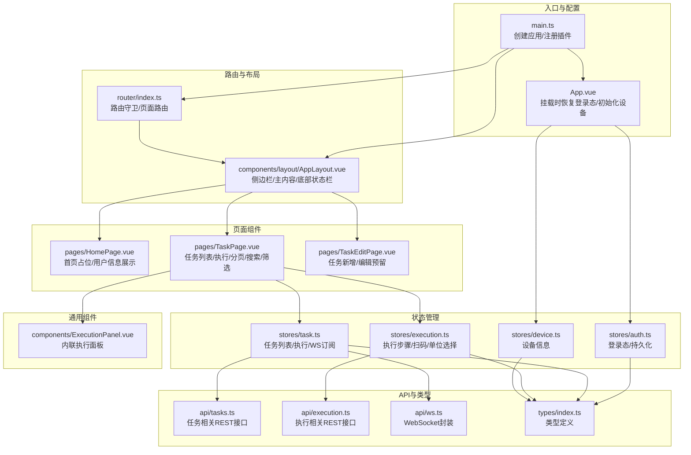
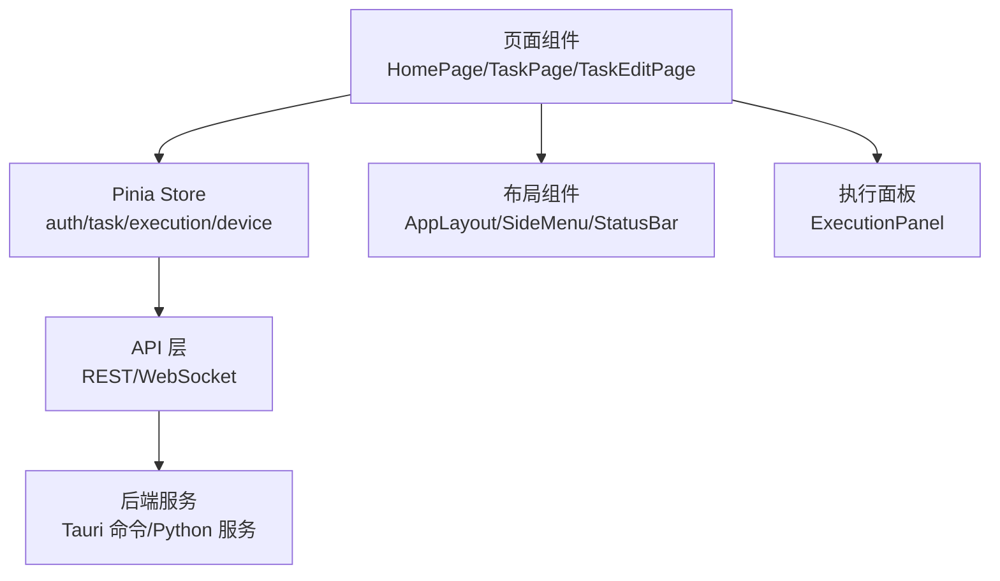
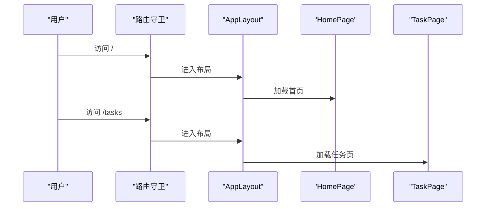
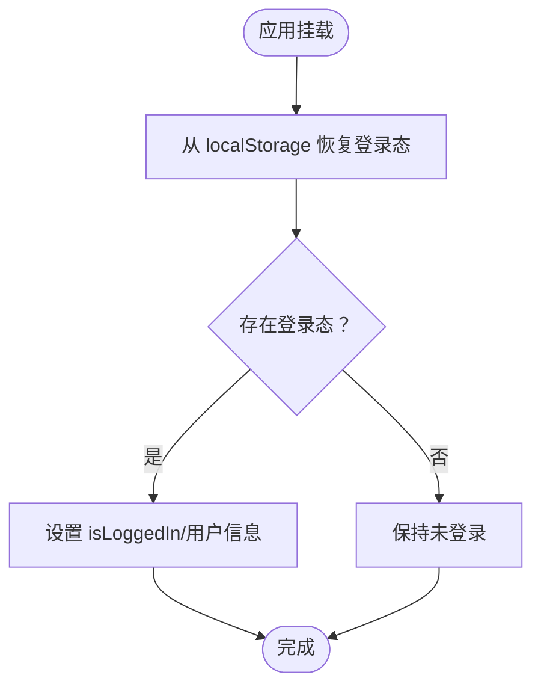
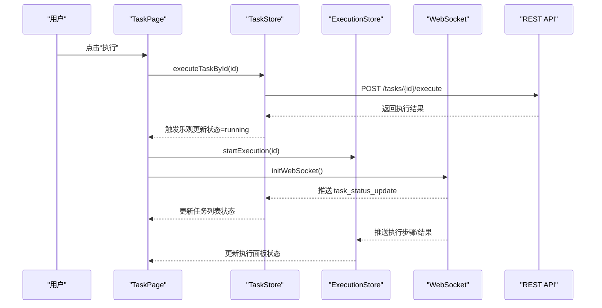
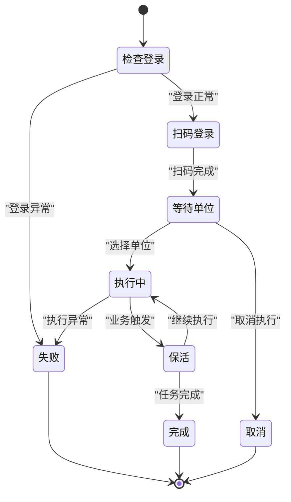
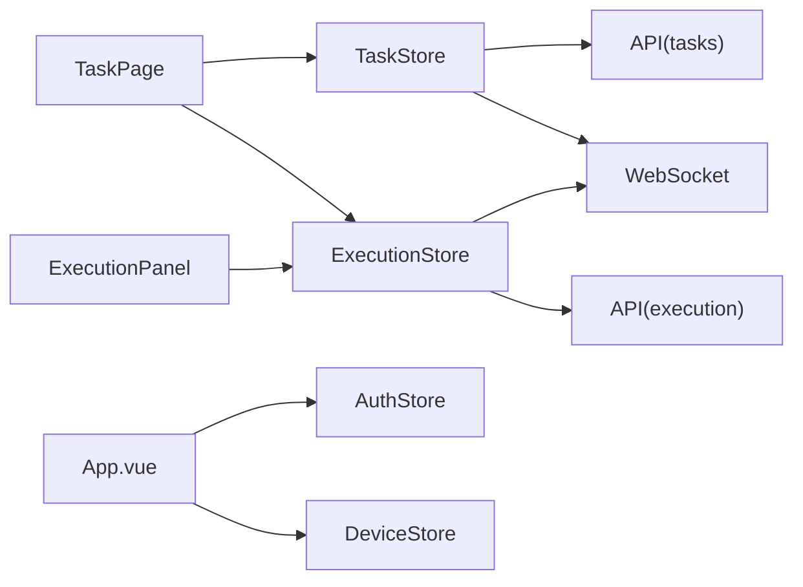

# Web管理后台

<cite>
**本文引用的文件**
- [main.ts](file://CCC-BrowserV4/frontend/src/main.ts)
- [App.vue](file://CCC-BrowserV4/frontend/src/App.vue)
- [router/index.ts](file://CCC-BrowserV4/frontend/src/router/index.ts)
- [components/layout/AppLayout.vue](file://CCC-BrowserV4/frontend/src/components/layout/AppLayout.vue)
- [stores/auth.ts](file://CCC-BrowserV4/frontend/src/stores/auth.ts)
- [stores/task.ts](file://CCC-BrowserV4/frontend/src/stores/task.ts)
- [stores/execution.ts](file://CCC-BrowserV4/frontend/src/stores/execution.ts)
- [pages/HomePage.vue](file://CCC-BrowserV4/frontend/src/pages/HomePage.vue)
- [pages/TaskPage.vue](file://CCC-BrowserV4/frontend/src/pages/TaskPage.vue)
- [components/ExecutionPanel.vue](file://CCC-BrowserV4/frontend/src/components/ExecutionPanel.vue)
- [types/index.ts](file://CCC-BrowserV4/frontend/src/types/index.ts)
- [api/tasks.ts](file://CCC-BrowserV4/frontend/src/api/tasks.ts)
</cite>

## 目录
1. [简介](#简介)
2. [项目结构](#项目结构)
3. [核心组件](#核心组件)
4. [架构总览](#架构总览)
5. [详细组件分析](#详细组件分析)
6. [依赖分析](#依赖分析)
7. [性能考虑](#性能考虑)
8. [故障排查指南](#故障排查指南)
9. [结论](#结论)
10. [附录](#附录)

## 简介
本项目为一个基于 Vue3 + Tauri 的跨平台桌面应用，提供浏览器自动化与任务执行的 Web 管理后台。系统采用前后端分离架构：前端使用 Vue3 + Pinia + Element Plus 构建，后端通过 Tauri 暴露命令接口并与 Python 后端服务交互。管理后台主要包含以下功能模块：
- 监控大盘：首页展示欢迎信息与当前用户/设备信息（功能开发中）。
- 租户管理：通过任务关联字段体现租户维度（如客户名称、经手人等）。
- 会话列表：以卡片网格形式展示任务列表，支持分页、搜索与状态筛选。
- 任务执行记录：通过 WebSocket 实时推送任务状态变更。
- 审计日志检索：提供任务日志查询接口（分页、翻页）。
- 会话快照管理：通过执行面板在不同步骤间进行扫码、单位选择与执行控制。
- 脚本模板库：通过任务编辑页进行新增与编辑（当前路由已预留）。

## 项目结构
前端采用按功能域组织的目录结构，核心包括：
- 入口与全局配置：main.ts、App.vue
- 路由与布局：router/index.ts、components/layout/AppLayout.vue
- 页面组件：pages/HomePage.vue、pages/TaskPage.vue、pages/TaskEditPage.vue
- 状态管理：stores/auth.ts、stores/task.ts、stores/execution.ts、stores/device.ts
- 类型定义：types/index.ts
- API 层：api/tasks.ts、api/execution.ts、api/request.ts、api/ws.ts
- 组件：components/ExecutionPanel.vue

**图表来源**
- [main.ts:1-23](file://CCC-BrowserV4/frontend/src/main.ts#L1-L23)
- [App.vue:1-21](file://CCC-BrowserV4/frontend/src/App.vue#L1-L21)
- [router/index.ts:1-63](file://CCC-BrowserV4/frontend/src/router/index.ts#L1-L63)
- [components/layout/AppLayout.vue:1-47](file://CCC-BrowserV4/frontend/src/components/layout/AppLayout.vue#L1-L47)
- [pages/HomePage.vue:1-62](file://CCC-BrowserV4/frontend/src/pages/HomePage.vue#L1-L62)
- [pages/TaskPage.vue:1-428](file://CCC-BrowserV4/frontend/src/pages/TaskPage.vue#L1-L428)
- [stores/auth.ts:1-79](file://CCC-BrowserV4/frontend/src/stores/auth.ts#L1-L79)
- [stores/task.ts:1-84](file://CCC-BrowserV4/frontend/src/stores/task.ts#L1-L84)
- [stores/execution.ts:1-229](file://CCC-BrowserV4/frontend/src/stores/execution.ts#L1-L229)
- [api/tasks.ts:1-41](file://CCC-BrowserV4/frontend/src/api/tasks.ts#L1-L41)
- [components/ExecutionPanel.vue:1-322](file://CCC-BrowserV4/frontend/src/components/ExecutionPanel.vue#L1-L322)

**章节来源**
- [main.ts:1-23](file://CCC-BrowserV4/frontend/src/main.ts#L1-L23)
- [App.vue:1-21](file://CCC-BrowserV4/frontend/src/App.vue#L1-L21)
- [router/index.ts:1-63](file://CCC-BrowserV4/frontend/src/router/index.ts#L1-L63)
- [components/layout/AppLayout.vue:1-47](file://CCC-BrowserV4/frontend/src/components/layout/AppLayout.vue#L1-L47)

## 核心组件
- 应用入口与全局插件注册：创建 Vue 应用实例，注册 Pinia、路由、Element Plus，并批量注册图标组件。
- 布局容器：左侧侧边栏、右侧主内容区与底部状态栏组合，承载各页面内容。
- 认证状态管理：登录态持久化（localStorage）、恢复登录态、登出清理。
- 任务状态管理：任务列表加载、分页、搜索、筛选；执行任务；WebSocket 推送任务状态更新。
- 执行状态管理：扫码登录、单位选择、执行进度、结果反馈；演示模式模拟流程。
- 页面组件：首页占位与用户信息展示；任务列表卡片网格、操作按钮、内联执行面板。
- API 封装：REST 接口与 WebSocket 封装，统一请求与事件处理。

**章节来源**
- [main.ts:1-23](file://CCC-BrowserV4/frontend/src/main.ts#L1-L23)
- [components/layout/AppLayout.vue:1-47](file://CCC-BrowserV4/frontend/src/components/layout/AppLayout.vue#L1-L47)
- [stores/auth.ts:1-79](file://CCC-BrowserV4/frontend/src/stores/auth.ts#L1-L79)
- [stores/task.ts:1-84](file://CCC-BrowserV4/frontend/src/stores/task.ts#L1-L84)
- [stores/execution.ts:1-229](file://CCC-BrowserV4/frontend/src/stores/execution.ts#L1-L229)
- [pages/HomePage.vue:1-62](file://CCC-BrowserV4/frontend/src/pages/HomePage.vue#L1-L62)
- [pages/TaskPage.vue:1-428](file://CCC-BrowserV4/frontend/src/pages/TaskPage.vue#L1-L428)
- [api/tasks.ts:1-41](file://CCC-BrowserV4/frontend/src/api/tasks.ts#L1-L41)

## 架构总览
前端采用“页面组件 + 状态管理 + API 层”的分层架构：
- 页面组件负责视图渲染与用户交互；
- Pinia Store 负责状态与副作用（异步请求、WebSocket 订阅）；
- API 层封装 REST 与 WebSocket，统一错误处理与数据格式；
- Element Plus 提供 UI 组件库与主题样式。

**图表来源**
- [pages/HomePage.vue:1-62](file://CCC-BrowserV4/frontend/src/pages/HomePage.vue#L1-L62)
- [pages/TaskPage.vue:1-428](file://CCC-BrowserV4/frontend/src/pages/TaskPage.vue#L1-L428)
- [stores/auth.ts:1-79](file://CCC-BrowserV4/frontend/src/stores/auth.ts#L1-L79)
- [stores/task.ts:1-84](file://CCC-BrowserV4/frontend/src/stores/task.ts#L1-L84)
- [stores/execution.ts:1-229](file://CCC-BrowserV4/frontend/src/stores/execution.ts#L1-L229)
- [components/ExecutionPanel.vue:1-322](file://CCC-BrowserV4/frontend/src/components/ExecutionPanel.vue#L1-L322)

## 详细组件分析

### 路由与导航
- 路由守卫：未登录访问受保护路由跳转登录；已登录访问登录页跳转首页。
- 功能路由：首页、任务列表、任务新增/编辑（预留）。
- 布局嵌套：根路由包裹 AppLayout，内部包含侧边栏、主内容与底部状态栏。

**图表来源**
- [router/index.ts:47-60](file://CCC-BrowserV4/frontend/src/router/index.ts#L47-L60)
- [components/layout/AppLayout.vue:1-47](file://CCC-BrowserV4/frontend/src/components/layout/AppLayout.vue#L1-L47)
- [pages/HomePage.vue:1-62](file://CCC-BrowserV4/frontend/src/pages/HomePage.vue#L1-L62)
- [pages/TaskPage.vue:1-428](file://CCC-BrowserV4/frontend/src/pages/TaskPage.vue#L1-L428)

**章节来源**
- [router/index.ts:1-63](file://CCC-BrowserV4/frontend/src/router/index.ts#L1-L63)
- [components/layout/AppLayout.vue:1-47](file://CCC-BrowserV4/frontend/src/components/layout/AppLayout.vue#L1-L47)

### 认证与登录态
- 登录态持久化：登录成功后写入 localStorage，应用挂载时恢复。
- 开发者登录：devLogin 快速登录（开发用途）。
- 登出清理：移除 localStorage 并清空状态。

**图表来源**
- [App.vue:13-19](file://CCC-BrowserV4/frontend/src/App.vue#L13-L19)
- [stores/auth.ts:44-58](file://CCC-BrowserV4/frontend/src/stores/auth.ts#L44-L58)

**章节来源**
- [App.vue:1-21](file://CCC-BrowserV4/frontend/src/App.vue#L1-L21)
- [stores/auth.ts:1-79](file://CCC-BrowserV4/frontend/src/stores/auth.ts#L1-L79)

### 任务列表与执行流程
- 任务列表：支持关键词搜索（带防抖）、状态筛选、分页；每个任务卡片展示状态标签、客户/经手人、子任务、时间与结果。
- 执行控制：点击“执行”触发任务执行；同时激活对应任务的内联执行面板。
- WebSocket 推送：任务状态更新实时刷新卡片状态。
- 日志检索：提供任务日志分页查询接口。

**图表来源**
- [pages/TaskPage.vue:255-267](file://CCC-BrowserV4/frontend/src/pages/TaskPage.vue#L255-L267)
- [stores/task.ts:57-80](file://CCC-BrowserV4/frontend/src/stores/task.ts#L57-L80)
- [stores/execution.ts:122-132](file://CCC-BrowserV4/frontend/src/stores/execution.ts#L122-L132)
- [api/tasks.ts:32-34](file://CCC-BrowserV4/frontend/src/api/tasks.ts#L32-L34)

**章节来源**
- [pages/TaskPage.vue:1-428](file://CCC-BrowserV4/frontend/src/pages/TaskPage.vue#L1-L428)
- [stores/task.ts:1-84](file://CCC-BrowserV4/frontend/src/stores/task.ts#L1-L84)
- [api/tasks.ts:1-41](file://CCC-BrowserV4/frontend/src/api/tasks.ts#L1-L41)

### 执行面板与步骤流转
- 步骤定义：检查登录、扫码登录、等待单位、执行中/保活、完成/失败/取消。
- 用户交互：扫码完成后点击“我已完成扫码”；选择单位后确认；执行中可取消。
- 演示模式：当后端不可用时，模拟扫码、单位选择与执行过程。

**图表来源**
- [stores/execution.ts:22-67](file://CCC-BrowserV4/frontend/src/stores/execution.ts#L22-L67)
- [components/ExecutionPanel.vue:1-322](file://CCC-BrowserV4/frontend/src/components/ExecutionPanel.vue#L1-L322)

**章节来源**
- [stores/execution.ts:1-229](file://CCC-BrowserV4/frontend/src/stores/execution.ts#L1-L229)
- [components/ExecutionPanel.vue:1-322](file://CCC-BrowserV4/frontend/src/components/ExecutionPanel.vue#L1-L322)

### 数据模型与类型
- 认证状态：isLoggedIn、userId、username、token、clientToken。
- 设备信息：deviceId、clientId。
- 任务信息：id、name、status、tenantId、deviceId、customerName、handlerAccount、subTasks、province、lastExecutedAt、nextExecutedAt、lastResult、remark、deleted、createdAt、updatedAt。
- 执行步骤：idle/checking_login/qr_scanning/waiting_company/executing/keeping_alive/completed/failed/cancelled。

**章节来源**
- [types/index.ts:1-42](file://CCC-BrowserV4/frontend/src/types/index.ts#L1-L42)

## 依赖分析
- 组件耦合：TaskPage 依赖 TaskStore 与 ExecutionStore；ExecutionPanel 依赖 ExecutionStore；App.vue 依赖认证与设备 Store。
- 外部依赖：Element Plus UI 组件库；Pinia 状态管理；Vue Router 路由。
- 接口契约：TaskStore 通过 REST 与 WebSocket 与后端交互；ExecutionStore 通过 REST 与 WebSocket 接收执行步骤与结果。

**图表来源**
- [pages/TaskPage.vue:144-150](file://CCC-BrowserV4/frontend/src/pages/TaskPage.vue#L144-L150)
- [components/ExecutionPanel.vue:112-118](file://CCC-BrowserV4/frontend/src/components/ExecutionPanel.vue#L112-L118)
- [stores/task.ts:4-6](file://CCC-BrowserV4/frontend/src/stores/task.ts#L4-L6)
- [stores/execution.ts:4](file://CCC-BrowserV4/frontend/src/stores/execution.ts#L4)

**章节来源**
- [stores/task.ts:1-84](file://CCC-BrowserV4/frontend/src/stores/task.ts#L1-L84)
- [stores/execution.ts:1-229](file://CCC-BrowserV4/frontend/src/stores/execution.ts#L1-L229)

## 性能考虑
- 列表渲染优化：使用卡片网格布局，结合分页与状态筛选减少一次性渲染量。
- 搜索防抖：输入搜索关键词时延迟请求，降低频繁网络请求。
- 乐观更新：执行任务后立即更新状态，提升交互体验。
- WebSocket 复用：任务页挂载时建立连接，卸载时销毁，避免资源泄漏。
- 图标与样式：批量注册 Element Plus 图标，统一样式引入，减少重复加载。

## 故障排查指南
- 登录态异常：检查 localStorage 中 auth_state 是否正确；确认 App.vue 挂载时 restoreFromStorage 是否被调用。
- 任务列表不刷新：确认 WebSocket 是否连接成功；检查 task_status_update 消息是否到达 TaskStore；核对后端推送逻辑。
- 执行面板无响应：确认 ExecutionStore 的 handleWsMessage 是否处理了相关消息；检查 taskId 与 activeTaskId 匹配。
- 网络请求失败：查看 TaskStore 的错误日志；确认 REST 接口路径与参数（分页、筛选）是否正确。
- 取消执行无效：确认 doCancel 是否被调用；检查后端取消接口是否可用。

**章节来源**
- [stores/auth.ts:44-58](file://CCC-BrowserV4/frontend/src/stores/auth.ts#L44-L58)
- [stores/task.ts:57-80](file://CCC-BrowserV4/frontend/src/stores/task.ts#L57-L80)
- [stores/execution.ts:110-121](file://CCC-BrowserV4/frontend/src/stores/execution.ts#L110-L121)
- [api/tasks.ts:5-7](file://CCC-BrowserV4/frontend/src/api/tasks.ts#L5-L7)

## 结论
本管理后台以 Vue3 + Pinia 为核心，结合 Element Plus 提供一致的 UI 体验；通过 REST 与 WebSocket 实现任务列表与执行状态的实时联动；路由守卫保障访问安全；状态管理清晰地拆分认证、任务与执行三类 Store。当前版本已具备任务列表、执行面板与日志查询的基础能力，后续可在租户管理、会话快照与脚本模板库等方面扩展。

## 附录
- 界面截图建议：首页欢迎页、任务列表卡片网格、执行面板扫码/单位选择/执行中/结果状态。
- 操作流程建议：登录 → 访问任务页 → 选择任务 → 点击执行 → 扫码/选择单位 → 查看执行结果 → 查看任务日志。
- 功能扩展方向：租户维度的数据过滤与权限控制、会话快照的录制与回放、脚本模板库的分类与导入导出。