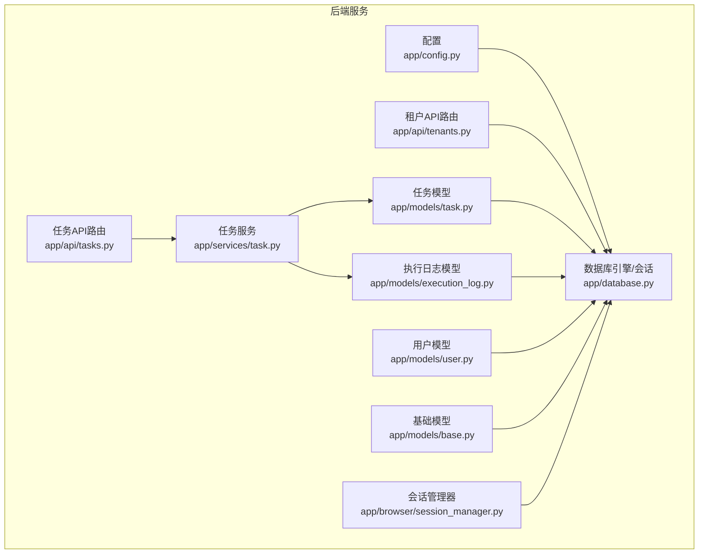
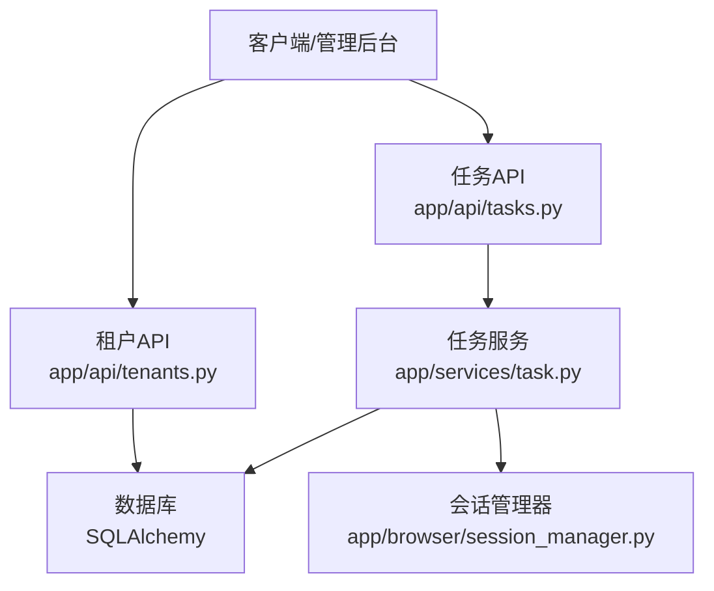
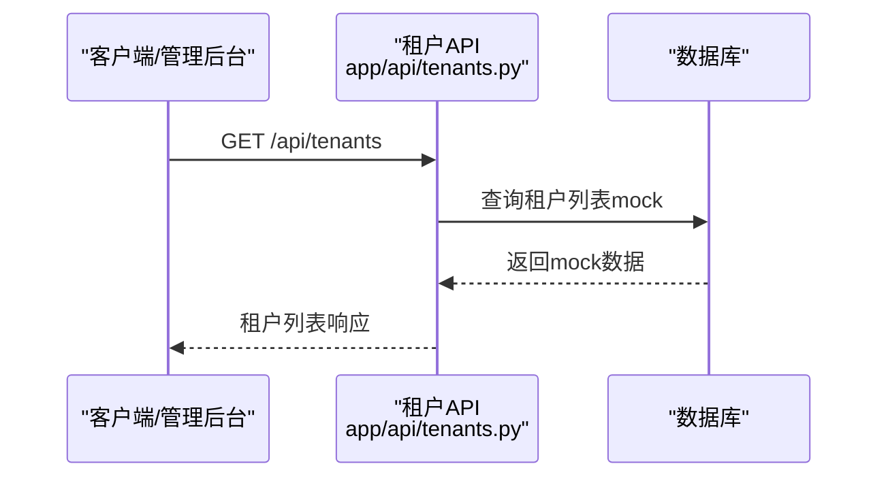
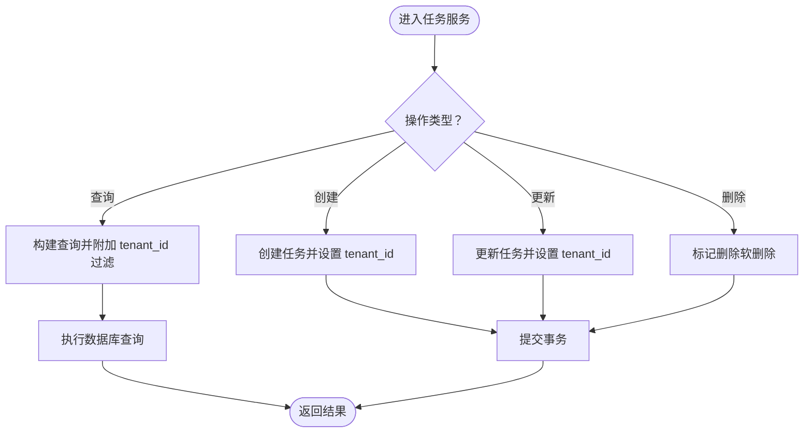
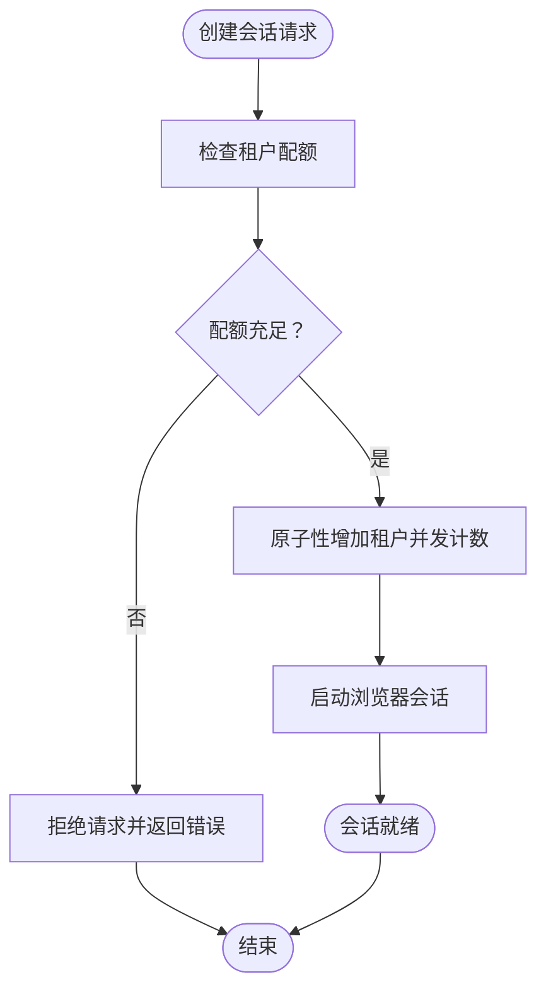
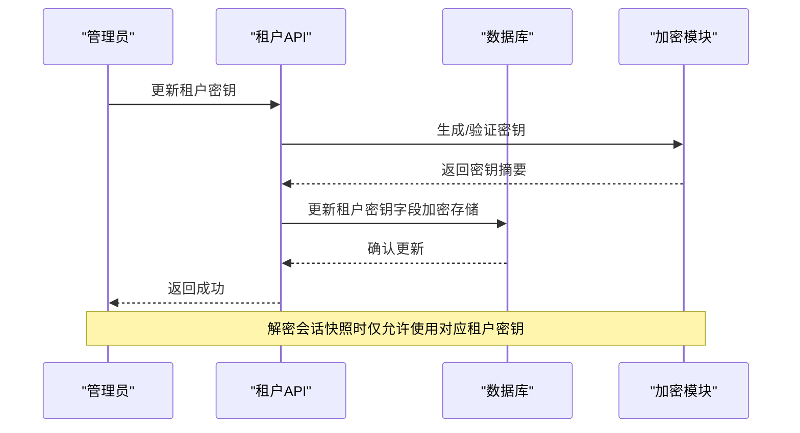
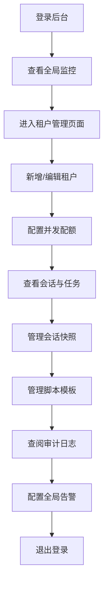
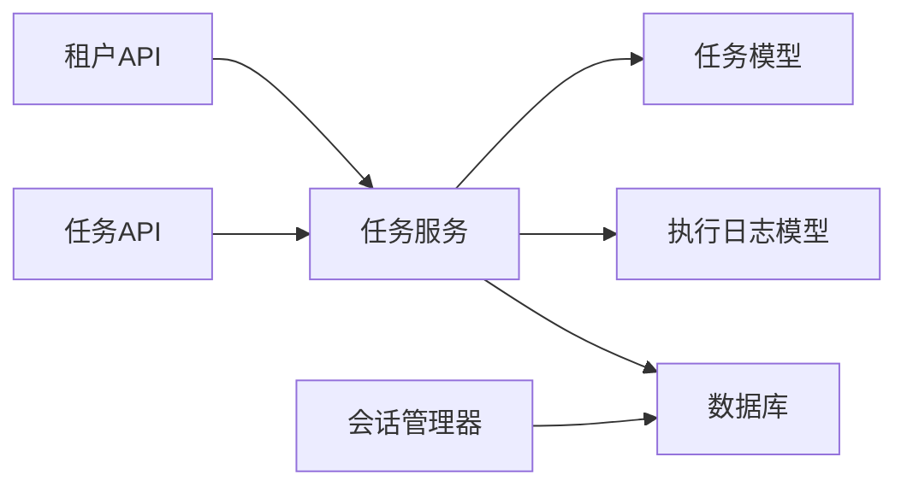

# 多租户管理

<cite>
**本文引用的文件**   
- [tenants.py](file://CCC_RPA_API/app/api/tenants.py)
- [task.py](file://CCC_RPA_API/app/models/task.py)
- [execution_log.py](file://CCC_RPA_API/app/models/execution_log.py)
- [base.py](file://CCC_RPA_API/app/models/base.py)
- [user.py](file://CCC_RPA_API/app/models/user.py)
- [config.py](file://CCC_RPA_API/app/config.py)
- [database.py](file://CCC_RPA_API/app/database.py)
- [tasks.py](file://CCC_RPA_API/app/api/tasks.py)
- [task_service.py](file://CCC_RPA_API/app/services/task.py)
- [session_manager.py](file://CCC_RPA_API/app/browser/session_manager.py)
- [project.md](file://project.md)
</cite>

## 目录
1. [简介](#简介)
2. [项目结构](#项目结构)
3. [核心组件](#核心组件)
4. [架构总览](#架构总览)
5. [详细组件分析](#详细组件分析)
6. [依赖分析](#依赖分析)
7. [性能考虑](#性能考虑)
8. [故障排查指南](#故障排查指南)
9. [结论](#结论)
10. [附录](#附录)

## 简介
本文件面向多租户管理模块，围绕租户的完整 CRUD、租户数据物理隔离、独立加密密钥管理以及会话并发配额控制进行系统化说明。结合项目文档中的需求描述与现有代码实现，梳理租户管理后台的功能边界、操作流程与安全配置要点，帮助开发者快速理解并落地多租户架构的设计思路与实现细节。

## 项目结构
- 后端采用 FastAPI + SQLAlchemy 架构，数据库连接与会话管理集中在 app/database.py 中，配置由 app/config.py 提供。
- 租户管理 API 路由位于 app/api/tenants.py，当前为占位实现，后续将接入真实数据库。
- 任务与执行日志模型位于 app/models 下，其中任务模型包含 tenant_id 字段，用于实现租户数据隔离。
- 浏览器会话管理位于 app/browser/session_manager.py，负责 Playwright 会话的生命周期与状态持久化，为后续会话并发配额与隔离提供基础能力。

图表来源
- [config.py:1-22](file://CCC_RPA_API/app/config.py#L1-L22)
- [database.py:1-19](file://CCC_RPA_API/app/database.py#L1-L19)
- [tenants.py:1-25](file://CCC_RPA_API/app/api/tenants.py#L1-L25)
- [tasks.py:1-76](file://CCC_RPA_API/app/api/tasks.py#L1-L76)
- [task_service.py:1-157](file://CCC_RPA_API/app/services/task.py#L1-L157)
- [task.py:1-25](file://CCC_RPA_API/app/models/task.py#L1-L25)
- [execution_log.py:1-17](file://CCC_RPA_API/app/models/execution_log.py#L1-L17)
- [user.py:1-17](file://CCC_RPA_API/app/models/user.py#L1-L17)
- [base.py:1-11](file://CCC_RPA_API/app/models/base.py#L1-L11)
- [session_manager.py:1-186](file://CCC_RPA_API/app/browser/session_manager.py#L1-L186)

章节来源
- [config.py:1-22](file://CCC_RPA_API/app/config.py#L1-L22)
- [database.py:1-19](file://CCC_RPA_API/app/database.py#L1-L19)
- [tenants.py:1-25](file://CCC_RPA_API/app/api/tenants.py#L1-L25)
- [tasks.py:1-76](file://CCC_RPA_API/app/api/tasks.py#L1-L76)
- [task_service.py:1-157](file://CCC_RPA_API/app/services/task.py#L1-L157)
- [task.py:1-25](file://CCC_RPA_API/app/models/task.py#L1-L25)
- [execution_log.py:1-17](file://CCC_RPA_API/app/models/execution_log.py#L1-L17)
- [user.py:1-17](file://CCC_RPA_API/app/models/user.py#L1-L17)
- [base.py:1-11](file://CCC_RPA_API/app/models/base.py#L1-L11)
- [session_manager.py:1-186](file://CCC_RPA_API/app/browser/session_manager.py#L1-L186)

## 核心组件
- 租户管理 API：提供租户列表查询接口，当前为占位实现，后续需接入数据库并补充创建、启用/禁用、配额配置等完整 CRUD。
- 任务与执行日志：任务模型包含 tenant_id 字段，配合服务层在查询/更新/删除时加入租户过滤条件，实现数据物理隔离。
- 数据库与配置：统一的数据库引擎与会话工厂，支持连接池与自动回收；配置类集中管理数据库连接参数。
- 会话管理器：负责 Playwright 会话的初始化、上下文管理、状态持久化与恢复，为后续并发配额与隔离提供基础设施。

章节来源
- [tenants.py:1-25](file://CCC_RPA_API/app/api/tenants.py#L1-L25)
- [task_service.py:44-157](file://CCC_RPA_API/app/services/task.py#L44-L157)
- [task.py:11-14](file://CCC_RPA_API/app/models/task.py#L11-L14)
- [database.py:1-19](file://CCC_RPA_API/app/database.py#L1-L19)
- [config.py:6-22](file://CCC_RPA_API/app/config.py#L6-L22)
- [session_manager.py:10-186](file://CCC_RPA_API/app/browser/session_manager.py#L10-L186)

## 架构总览
下图展示多租户管理模块在系统中的位置与交互关系：租户管理 API 与任务 API 共享数据库层；任务服务在执行 CRUD 时以 tenant_id 为依据进行数据隔离；会话管理器负责浏览器会话生命周期，为后续并发配额与隔离提供支撑。

图表来源
- [tenants.py:1-25](file://CCC_RPA_API/app/api/tenants.py#L1-L25)
- [tasks.py:1-76](file://CCC_RPA_API/app/api/tasks.py#L1-L76)
- [task_service.py:1-157](file://CCC_RPA_API/app/services/task.py#L1-L157)
- [database.py:1-19](file://CCC_RPA_API/app/database.py#L1-L19)
- [session_manager.py:1-186](file://CCC_RPA_API/app/browser/session_manager.py#L1-L186)

## 详细组件分析

### 租户管理 API（占位实现与后续扩展）
- 当前实现：提供租户列表查询接口，返回 mock 数据，便于前端联调与后台页面搭建。
- 后续扩展方向：
  - 引入租户模型与数据库表，完善创建、启用/禁用、配额配置等接口。
  - 在鉴权与权限层增加对租户维度的访问控制。
  - 与会话并发配额控制模块联动，确保租户操作符合其配额限制。

图表来源
- [tenants.py:21-24](file://CCC_RPA_API/app/api/tenants.py#L21-L24)

章节来源
- [tenants.py:1-25](file://CCC_RPA_API/app/api/tenants.py#L1-L25)

### 任务与执行日志（租户数据物理隔离）
- 数据模型：任务模型包含 tenant_id 字段，便于按租户维度筛选与隔离。
- 服务层逻辑：在查询、更新、删除等操作中，服务层应默认附加租户过滤条件，确保租户只能访问自身数据。
- 执行日志：执行日志模型与任务关联，同样受租户隔离策略影响。

图表来源
- [task_service.py:44-157](file://CCC_RPA_API/app/services/task.py#L44-L157)
- [task.py:11-14](file://CCC_RPA_API/app/models/task.py#L11-L14)

章节来源
- [task_service.py:44-157](file://CCC_RPA_API/app/services/task.py#L44-L157)
- [task.py:1-25](file://CCC_RPA_API/app/models/task.py#L1-L25)
- [execution_log.py:1-17](file://CCC_RPA_API/app/models/execution_log.py#L1-L17)

### 会话并发配额控制（设计与实现建议）
- 设计目标：为每个租户配置独立的并发会话上限，防止资源滥用与相互干扰。
- 实现建议：
  - 在会话管理器中引入租户维度的并发计数与配额检查。
  - 使用 Redis 或数据库记录租户当前并发数与配额阈值，创建会话前进行原子性判断与计数更新。
  - 超限时返回明确错误码，便于前端提示与重试策略处理。

图表来源
- [session_manager.py:10-186](file://CCC_RPA_API/app/browser/session_manager.py#L10-L186)
- [project.md:1290-1297](file://project.md#L1290-L1297)

章节来源
- [session_manager.py:1-186](file://CCC_RPA_API/app/browser/session_manager.py#L1-L186)
- [project.md:1290-1297](file://project.md#L1290-L1297)

### 独立加密密钥管理与数据隔离（设计与实现建议）
- 密钥分配：为每个租户分配独立的 AES-256-CBC 密钥，密钥存储在租户表的独立字段中，且仅管理员可见。
- 存储安全：会话快照与敏感配置采用 AES-256-CBC 加密存储，密钥参与加密过程但不落盘明文。
- 访问控制：密钥仅在必要时加载到内存，加密/解密操作在受控范围内执行，避免泄露风险。
- 审计与合规：所有密钥使用与解密操作纳入审计日志，保留不可篡改痕迹。

图表来源
- [project.md:1298-1303](file://project.md#L1298-L1303)

章节来源
- [project.md:1298-1303](file://project.md#L1298-L1303)

### 租户管理后台（功能与操作流程）
- 功能概览：集群全局监控大盘、租户管理页面、会话列表、任务执行记录、审计日志检索、会话快照管理、脚本模板库、全局告警配置。
- 操作流程（示意）：
  - 登录后台 → 查看全局监控 → 进入租户管理页面 → 新增/编辑租户 → 配置并发配额 → 查看会话与任务 → 管理快照与模板 → 查阅审计日志 → 配置告警。
- 安全配置：后台访问需通过统一鉴权与 RBAC 权限控制，确保不同角色只能访问授权范围内的功能与数据。

图表来源
- [project.md:1091-1097](file://project.md#L1091-L1097)

章节来源
- [project.md:1091-1097](file://project.md#L1091-L1097)

## 依赖分析
- 组件耦合：
  - API 层依赖服务层；服务层依赖模型层与数据库层；会话管理器与服务层存在协作关系。
  - 任务模型与执行日志模型共同支撑任务生命周期管理。
- 外部依赖：
  - 数据库连接由 SQLAlchemy 提供；会话管理器依赖 Playwright 与 Chromium。
  - 配置类集中管理数据库连接参数，便于环境切换与部署。

图表来源
- [tenants.py:1-25](file://CCC_RPA_API/app/api/tenants.py#L1-L25)
- [tasks.py:1-76](file://CCC_RPA_API/app/api/tasks.py#L1-L76)
- [task_service.py:1-157](file://CCC_RPA_API/app/services/task.py#L1-L157)
- [task.py:1-25](file://CCC_RPA_API/app/models/task.py#L1-L25)
- [execution_log.py:1-17](file://CCC_RPA_API/app/models/execution_log.py#L1-L17)
- [session_manager.py:1-186](file://CCC_RPA_API/app/browser/session_manager.py#L1-L186)

章节来源
- [tenants.py:1-25](file://CCC_RPA_API/app/api/tenants.py#L1-L25)
- [tasks.py:1-76](file://CCC_RPA_API/app/api/tasks.py#L1-L76)
- [task_service.py:1-157](file://CCC_RPA_API/app/services/task.py#L1-L157)
- [task.py:1-25](file://CCC_RPA_API/app/models/task.py#L1-L25)
- [execution_log.py:1-17](file://CCC_RPA_API/app/models/execution_log.py#L1-L17)
- [session_manager.py:1-186](file://CCC_RPA_API/app/browser/session_manager.py#L1-L186)

## 性能考虑
- 数据库连接池：通过连接池与连接回收参数优化数据库访问性能，减少连接建立开销。
- 会话并发：在会话管理器中引入并发计数与配额控制，避免资源争用导致的性能抖动。
- 任务批处理：对任务查询与更新操作使用分页与索引优化，降低大表扫描成本。

## 故障排查指南
- 数据隔离问题：确认服务层在查询/更新/删除任务时是否附加了 tenant_id 过滤条件。
- 会话异常：检查会话管理器的工作线程是否正常运行，必要时触发恢复流程。
- 配额超限：核对租户并发计数与配额阈值，确保原子性更新与一致性。

章节来源
- [task_service.py:44-157](file://CCC_RPA_API/app/services/task.py#L44-L157)
- [session_manager.py:147-186](file://CCC_RPA_API/app/browser/session_manager.py#L147-L186)
- [project.md:1290-1297](file://project.md#L1290-L1297)

## 结论
多租户管理模块以“租户维度的完整 CRUD + 物理隔离 + 独立密钥 + 并发配额”为核心目标。当前后端已完成数据库与会话管理的基础能力，租户管理 API 与任务隔离逻辑处于占位阶段，后续需补齐租户模型、密钥管理与配额控制，并完善后台功能与安全策略，以满足生产环境下的隔离、安全与可观测性要求。

## 附录
- 关键需求参考：
  - 租户完整 CRUD、启用/禁用、配置独立会话并发配额
  - 租户数据物理隔离
  - 每个租户独立 AES-256-CBC 密钥
  - 租户 Web 管理后台功能清单

章节来源
- [project.md:1069-1097](file://project.md#L1069-L1097)
- [project.md:1234-1247](file://project.md#L1234-L1247)
- [project.md:1298-1303](file://project.md#L1298-L1303)