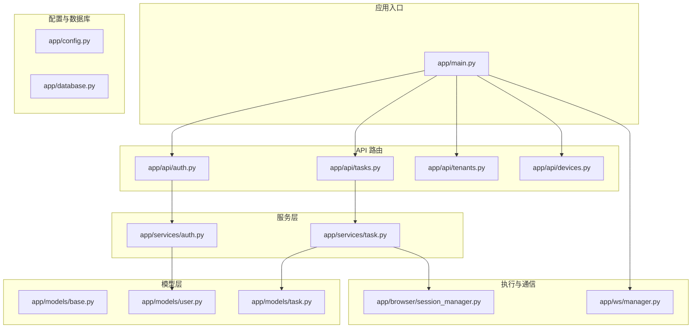
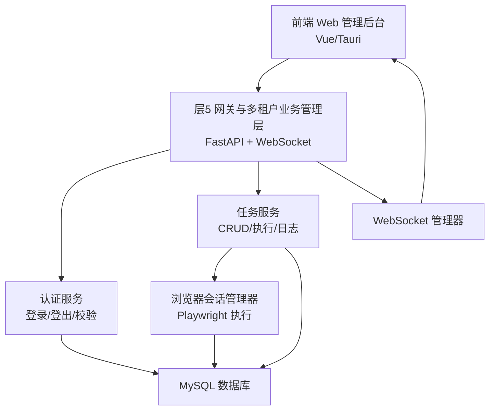
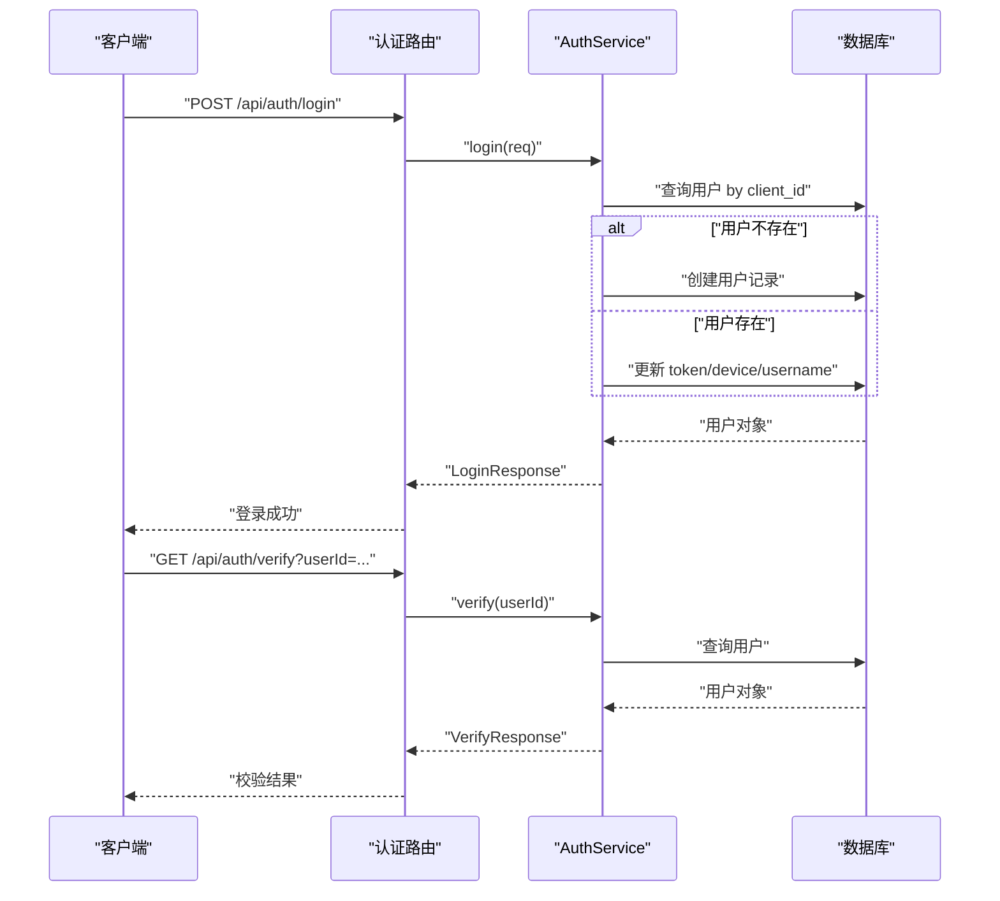
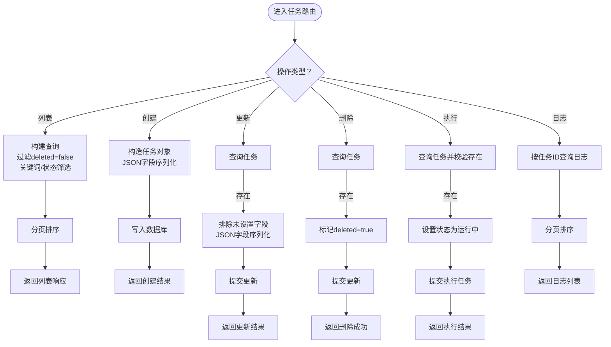
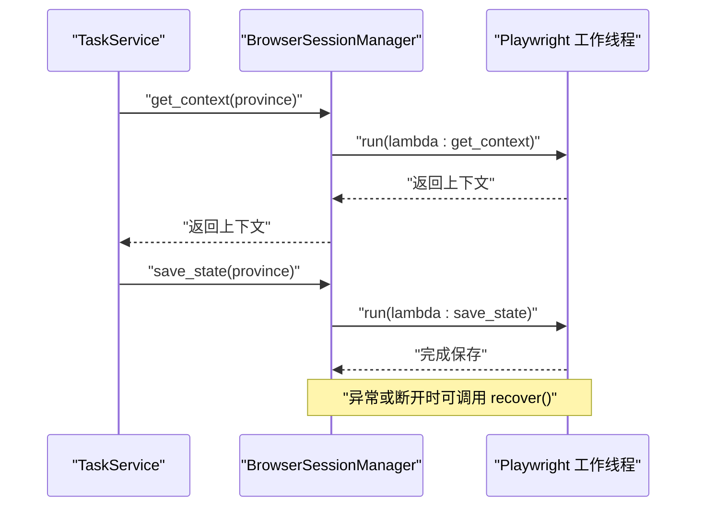
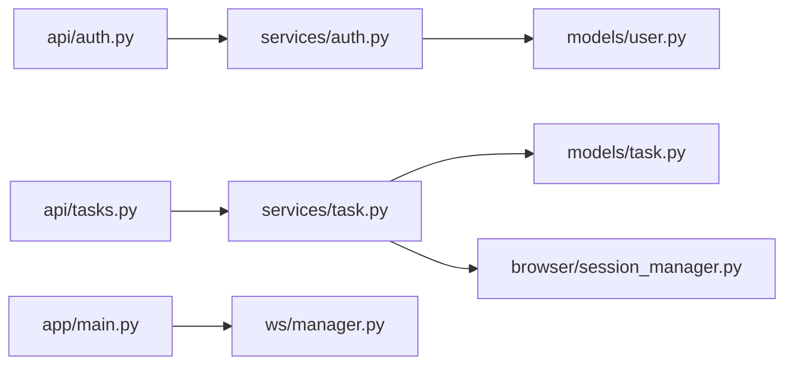

# 层5：网关与多租户业务管理层

<cite>
**本文档引用的文件**
- [main.py](file://CCC_RPA_API/app/main.py)
- [config.py](file://CCC_RPA_API/app/config.py)
- [base.py](file://CCC_RPA_API/app/models/base.py)
- [user.py](file://CCC_RPA_API/app/models/user.py)
- [task.py](file://CCC_RPA_API/app/models/task.py)
- [auth.py](file://CCC_RPA_API/app/api/auth.py)
- [tasks.py](file://CCC_RPA_API/app/api/tasks.py)
- [tenants.py](file://CCC_RPA_API/app/api/tenants.py)
- [devices.py](file://CCC_RPA_API/app/api/devices.py)
- [manager.py](file://CCC_RPA_API/app/ws/manager.py)
- [auth.py](file://CCC_RPA_API/app/services/auth.py)
- [task.py](file://CCC_RPA_API/app/services/task.py)
- [session_manager.py](file://CCC_RPA_API/app/browser/session_manager.py)
</cite>

## 目录
1. [引言](#引言)
2. [项目结构](#项目结构)
3. [核心组件](#核心组件)
4. [架构总览](#架构总览)
5. [详细组件分析](#详细组件分析)
6. [依赖分析](#依赖分析)
7. [性能考虑](#性能考虑)
8. [故障排查指南](#故障排查指南)
9. [结论](#结论)
10. [附录](#附录)

## 引言
本层是面向商用级 AI 浏览器系统的“网关与多租户业务管理层”。其核心职责包括：
- 统一 API 入口与路由组织
- 多租户数据模型与隔离
- 用户认证与会话管理
- 任务编排与执行调度
- 实时通信与状态推送
- 前端 Web 管理后台与监控告警的基础支撑

本层通过 FastAPI 提供 REST/WebSocket 接口，结合 Playwright 会话管理器实现稳定的自动化执行能力；同时以数据库模型与服务层封装业务逻辑，为上层应用提供稳定、可扩展的后端能力。

## 项目结构
后端采用分层架构：
- 应用入口与路由注册：app/main.py
- 配置与数据库连接：app/config.py、app/database.py
- 数据模型与基类：app/models/*
- API 路由：app/api/*
- 业务服务：app/services/*
- 浏览器会话与执行：app/browser/*
- WebSocket 管理：app/ws/*

图表来源
- [main.py:1-127](file://CCC_RPA_API/app/main.py#L1-L127)
- [config.py:1-22](file://CCC_RPA_API/app/config.py#L1-L22)
- [base.py:1-11](file://CCC_RPA_API/app/models/base.py#L1-L11)
- [user.py:1-17](file://CCC_RPA_API/app/models/user.py#L1-L17)
- [task.py:1-25](file://CCC_RPA_API/app/models/task.py#L1-L25)
- [auth.py:1-24](file://CCC_RPA_API/app/api/auth.py#L1-L24)
- [tasks.py:1-76](file://CCC_RPA_API/app/api/tasks.py#L1-L76)
- [tenants.py](file://CCC_RPA_API/app/api/tenants.py)
- [devices.py](file://CCC_RPA_API/app/api/devices.py)
- [auth.py:1-58](file://CCC_RPA_API/app/services/auth.py#L1-L58)
- [task.py:1-157](file://CCC_RPA_API/app/services/task.py#L1-L157)
- [session_manager.py:1-186](file://CCC_RPA_API/app/browser/session_manager.py#L1-L186)
- [manager.py:1-29](file://CCC_RPA_API/app/ws/manager.py#L1-L29)

章节来源
- [main.py:1-127](file://CCC_RPA_API/app/main.py#L1-L127)
- [config.py:1-22](file://CCC_RPA_API/app/config.py#L1-L22)

## 核心组件
- 应用入口与生命周期
  - 启动时创建数据库表与迁移字段，注入示例任务数据
  - 注册认证、任务、租户、设备路由
  - 启动/关闭时管理 Playwright 会话
  - 提供健康检查与 WebSocket 入口
- 认证与会话
  - 登录：根据 client_id 创建或更新用户记录，发放 token
  - 登出：标记用户为非活跃
  - 校验：验证用户有效性
- 任务管理
  - 列表、创建、查询、更新、删除
  - 执行任务：切换状态并提交到执行器
  - 日志查询：按任务维度分页查询执行日志
- 多租户与设备
  - 任务模型包含 tenant_id、device_id 字段，用于标识归属与执行设备
  - 租户与设备路由预留，便于后续扩展
- 实时通信
  - WebSocket 连接管理与广播
  - 支持前端实时接收执行状态与通知

章节来源
- [main.py:23-127](file://CCC_RPA_API/app/main.py#L23-L127)
- [auth.py:1-24](file://CCC_RPA_API/app/api/auth.py#L1-L24)
- [auth.py:1-58](file://CCC_RPA_API/app/services/auth.py#L1-L58)
- [tasks.py:1-76](file://CCC_RPA_API/app/api/tasks.py#L1-L76)
- [task.py:1-157](file://CCC_RPA_API/app/services/task.py#L1-L157)
- [task.py:1-25](file://CCC_RPA_API/app/models/task.py#L1-L25)
- [manager.py:1-29](file://CCC_RPA_API/app/ws/manager.py#L1-L29)

## 架构总览
下图展示层5在整体系统中的位置与交互关系：作为统一网关，承接前端请求，协调认证、任务编排与浏览器执行，并通过 WebSocket 推送状态。

图表来源
- [main.py:1-127](file://CCC_RPA_API/app/main.py#L1-L127)
- [auth.py:1-58](file://CCC_RPA_API/app/services/auth.py#L1-L58)
- [task.py:1-157](file://CCC_RPA_API/app/services/task.py#L1-L157)
- [session_manager.py:1-186](file://CCC_RPA_API/app/browser/session_manager.py#L1-L186)
- [manager.py:1-29](file://CCC_RPA_API/app/ws/manager.py#L1-L29)

## 详细组件分析

### 认证与会话组件
- 功能要点
  - 使用 client_id 作为用户唯一标识，token 用于会话凭证
  - 首次登录自动创建用户记录，后续登录更新 token 与设备信息
  - 登出将用户标记为非活跃，校验接口据此判断有效性
- 关键流程
  - 登录：查询/创建用户 → 更新 token/device → 返回响应
  - 校验：查询用户 → 返回有效/无效及用户信息

图表来源
- [auth.py:1-24](file://CCC_RPA_API/app/api/auth.py#L1-L24)
- [auth.py:1-58](file://CCC_RPA_API/app/services/auth.py#L1-L58)

章节来源
- [auth.py:1-24](file://CCC_RPA_API/app/api/auth.py#L1-L24)
- [auth.py:1-58](file://CCC_RPA_API/app/services/auth.py#L1-L58)

### 任务管理组件
- 功能要点
  - 支持关键词/状态筛选、分页列表
  - 支持创建、更新、删除（软删除）
  - 执行任务：设置运行中状态并提交到执行器
  - 查询执行日志：按任务 ID 分页查询
- 数据模型
  - 任务模型包含 tenant_id、device_id、customer_name、handler_account、sub_tasks、province 等字段，满足多租户与业务属性需求

图表来源
- [tasks.py:1-76](file://CCC_RPA_API/app/api/tasks.py#L1-L76)
- [task.py:1-157](file://CCC_RPA_API/app/services/task.py#L1-L157)
- [task.py:1-25](file://CCC_RPA_API/app/models/task.py#L1-L25)

章节来源
- [tasks.py:1-76](file://CCC_RPA_API/app/api/tasks.py#L1-L76)
- [task.py:1-157](file://CCC_RPA_API/app/services/task.py#L1-L157)
- [task.py:1-25](file://CCC_RPA_API/app/models/task.py#L1-L25)

### 多租户与设备管理
- 设计思路
  - 在任务模型中引入 tenant_id、device_id 字段，实现租户与设备的绑定
  - 通过租户路由与设备路由预留扩展点，未来可接入 RBAC、配额、计费等模块
- 隔离策略
  - 数据层面：查询/更新均基于任务的 tenant_id 进行过滤
  - 执行层面：按设备维度管理浏览器上下文，确保资源隔离

章节来源
- [task.py:1-25](file://CCC_RPA_API/app/models/task.py#L1-L25)
- [tenants.py](file://CCC_RPA_API/app/api/tenants.py)
- [devices.py](file://CCC_RPA_API/app/api/devices.py)

### 浏览器会话与执行
- 设计要点
  - 使用专用工作线程承载 Playwright，避免与 asyncio 事件循环冲突
  - 按省份维护 BrowserContext，持久化 storage_state，提升复用效率
  - 提供上下文创建、状态保存、关闭与恢复能力
- 关键流程
  - 初始化：启动 Chromium，等待就绪
  - 执行：将任务函数放入队列，阻塞等待结果
  - 恢复：关闭所有上下文并重建浏览器实例

图表来源
- [session_manager.py:1-186](file://CCC_RPA_API/app/browser/session_manager.py#L1-L186)
- [task.py:1-157](file://CCC_RPA_API/app/services/task.py#L1-L157)

章节来源
- [session_manager.py:1-186](file://CCC_RPA_API/app/browser/session_manager.py#L1-L186)

### WebSocket 通信
- 设计要点
  - ConnectionManager 维护所有连接，支持广播消息
  - 应用启动时捕获主事件循环，供工作线程广播使用
  - 提供 /ws 接口，客户端可订阅执行状态与通知
- 使用场景
  - 任务执行状态实时推送
  - 控制端触发扫描完成、选择公司等交互

章节来源
- [manager.py:1-29](file://CCC_RPA_API/app/ws/manager.py#L1-L29)
- [main.py:119-127](file://CCC_RPA_API/app/main.py#L119-L127)

## 依赖分析
- 组件耦合
  - API 路由仅依赖服务层，服务层依赖模型层与外部执行器
  - 会话管理器独立于路由，通过服务层间接被调用
  - WebSocket 管理器与应用入口耦合，负责全局广播
- 外部依赖
  - 数据库：MySQL（通过 SQLAlchemy ORM）
  - 浏览器自动化：Playwright（Chromium）
  - 实时通信：FastAPI WebSocket

图表来源
- [auth.py:1-24](file://CCC_RPA_API/app/api/auth.py#L1-L24)
- [tasks.py:1-76](file://CCC_RPA_API/app/api/tasks.py#L1-L76)
- [auth.py:1-58](file://CCC_RPA_API/app/services/auth.py#L1-L58)
- [task.py:1-157](file://CCC_RPA_API/app/services/task.py#L1-L157)
- [task.py:1-25](file://CCC_RPA_API/app/models/task.py#L1-L25)
- [user.py:1-17](file://CCC_RPA_API/app/models/user.py#L1-L17)
- [session_manager.py:1-186](file://CCC_RPA_API/app/browser/session_manager.py#L1-L186)
- [main.py:1-127](file://CCC_RPA_API/app/main.py#L1-L127)
- [manager.py:1-29](file://CCC_RPA_API/app/ws/manager.py#L1-L29)

章节来源
- [main.py:1-127](file://CCC_RPA_API/app/main.py#L1-L127)
- [tasks.py:1-76](file://CCC_RPA_API/app/api/tasks.py#L1-L76)
- [auth.py:1-24](file://CCC_RPA_API/app/api/auth.py#L1-L24)
- [task.py:1-157](file://CCC_RPA_API/app/services/task.py#L1-L157)
- [auth.py:1-58](file://CCC_RPA_API/app/services/auth.py#L1-L58)
- [session_manager.py:1-186](file://CCC_RPA_API/app/browser/session_manager.py#L1-L186)
- [manager.py:1-29](file://CCC_RPA_API/app/ws/manager.py#L1-L29)

## 性能考虑
- I/O 密集与 CPU 密集分离
  - WebSocket 与 API 请求在主线程处理
  - Playwright 执行放入专用工作线程，避免阻塞事件循环
- 数据库连接与迁移
  - 启动时集中迁移与初始化，减少运行期开销
- 缓存与复用
  - 按省份缓存 BrowserContext，持久化 storage_state，降低重复登录成本
- 并发与限流
  - 可在服务层增加任务队列与并发限制，防止资源争用
- 监控与可观测性
  - 建议集成指标埋点与日志聚合，配合前端监控面板

## 故障排查指南
- 认证问题
  - 登录失败：确认 client_id 是否正确，token 是否为空
  - 校验失败：确认用户是否存在且 is_active 为真
- 任务执行问题
  - 任务不存在：检查任务 ID 与软删除标志
  - 执行无响应：检查执行器提交与浏览器会话状态
- 浏览器会话问题
  - 初始化失败：查看工作线程日志，确认 Chromium 启动参数与权限
  - 会话断开：调用恢复流程重建上下文
- WebSocket 问题
  - 连接断开：检查客户端网络与服务端广播异常
  - 消息丢失：确认连接池与异常清理逻辑

章节来源
- [auth.py:1-58](file://CCC_RPA_API/app/services/auth.py#L1-L58)
- [task.py:1-157](file://CCC_RPA_API/app/services/task.py#L1-L157)
- [session_manager.py:1-186](file://CCC_RPA_API/app/browser/session_manager.py#L1-L186)
- [manager.py:1-29](file://CCC_RPA_API/app/ws/manager.py#L1-L29)

## 结论
层5网关与多租户业务管理层以清晰的分层设计实现了统一 API 入口、多租户数据隔离、认证会话管理、任务编排与执行调度以及实时通信能力。通过专用线程与浏览器上下文复用，系统在稳定性与性能之间取得平衡。建议在后续版本中补充 RBAC 权限控制、租户配额与计费模块，并完善 Web 管理后台与监控告警面板，以满足商用级部署要求。

## 附录
- 配置说明
  - 数据库连接：通过环境变量配置主机、端口、用户名、密码与数据库名
  - 启动项：应用启动时自动创建表与迁移字段，插入示例任务
- API 快速参考
  - 认证：登录、登出、校验
  - 任务：列表、创建、查询、更新、删除、执行、日志
  - WebSocket：/ws 广播通道
- 开发建议
  - 在服务层增加鉴权中间件，逐步引入四级角色权限体系
  - 为租户与设备路由补充 CRUD 与策略校验
  - 完善前端管理后台与监控面板的数据对接

章节来源
- [config.py:1-22](file://CCC_RPA_API/app/config.py#L1-L22)
- [main.py:30-102](file://CCC_RPA_API/app/main.py#L30-L102)
- [auth.py:1-24](file://CCC_RPA_API/app/api/auth.py#L1-L24)
- [tasks.py:1-76](file://CCC_RPA_API/app/api/tasks.py#L1-L76)
- [manager.py:1-29](file://CCC_RPA_API/app/ws/manager.py#L1-L29)