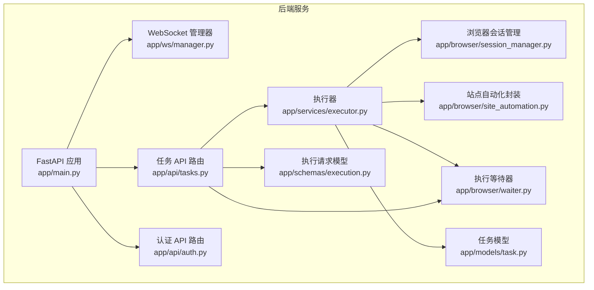
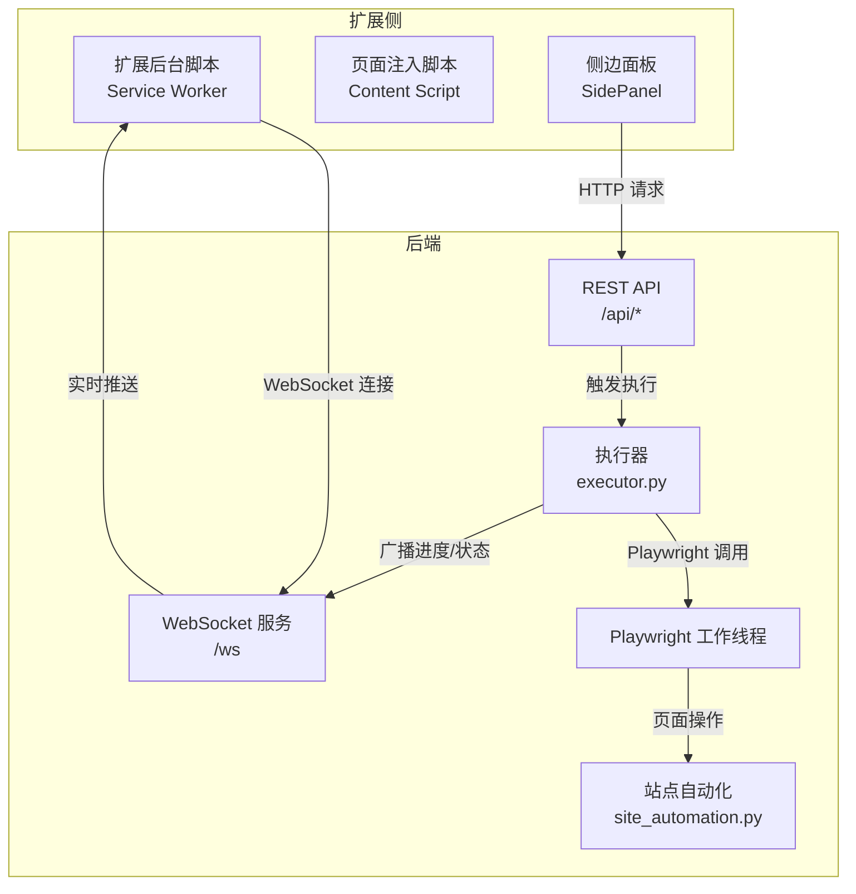
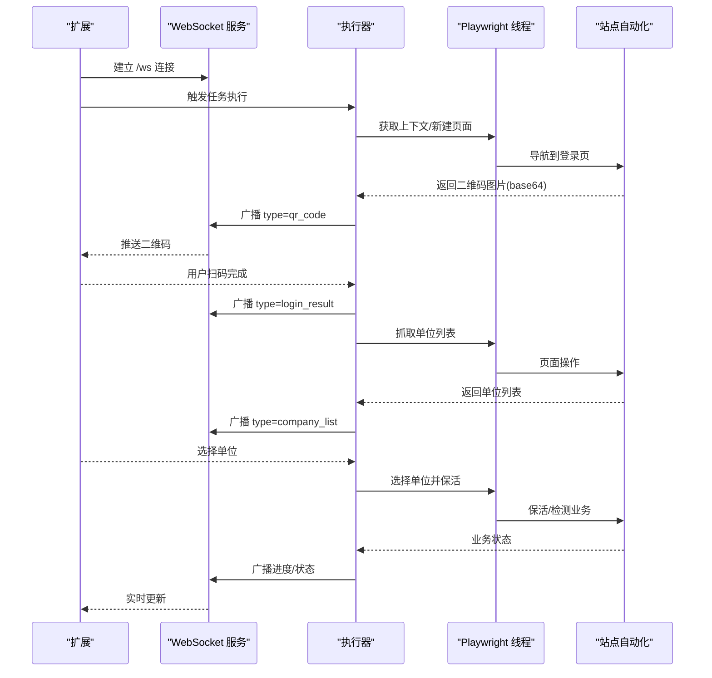
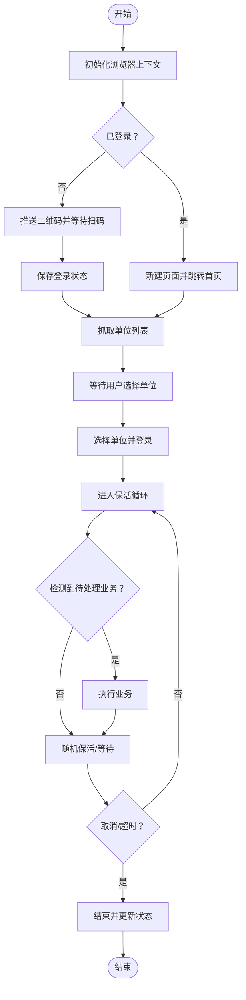
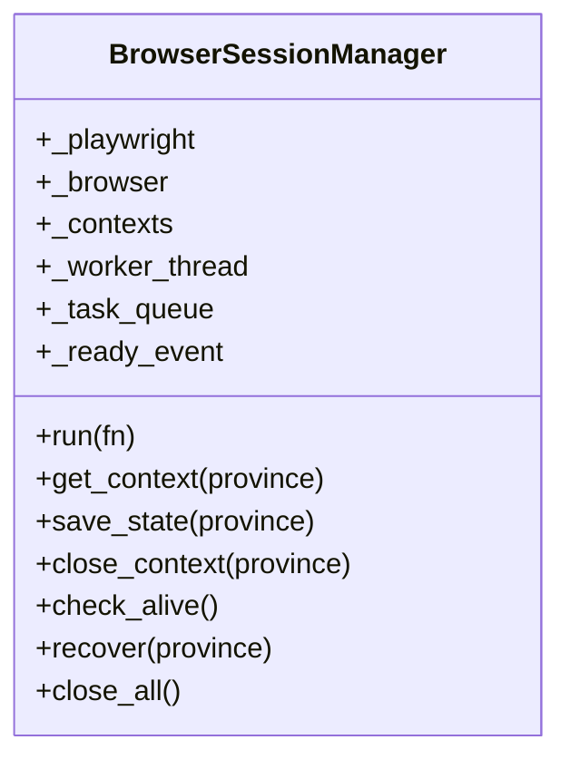
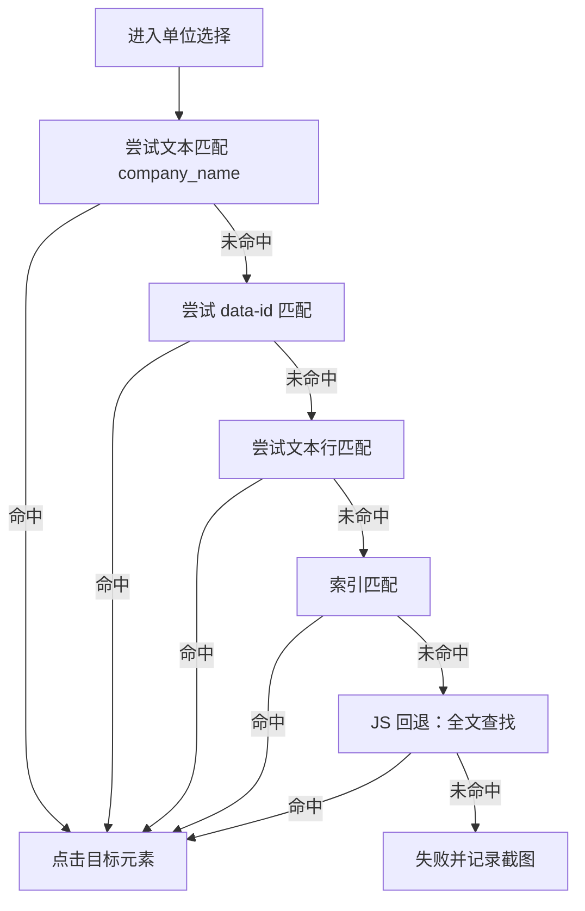
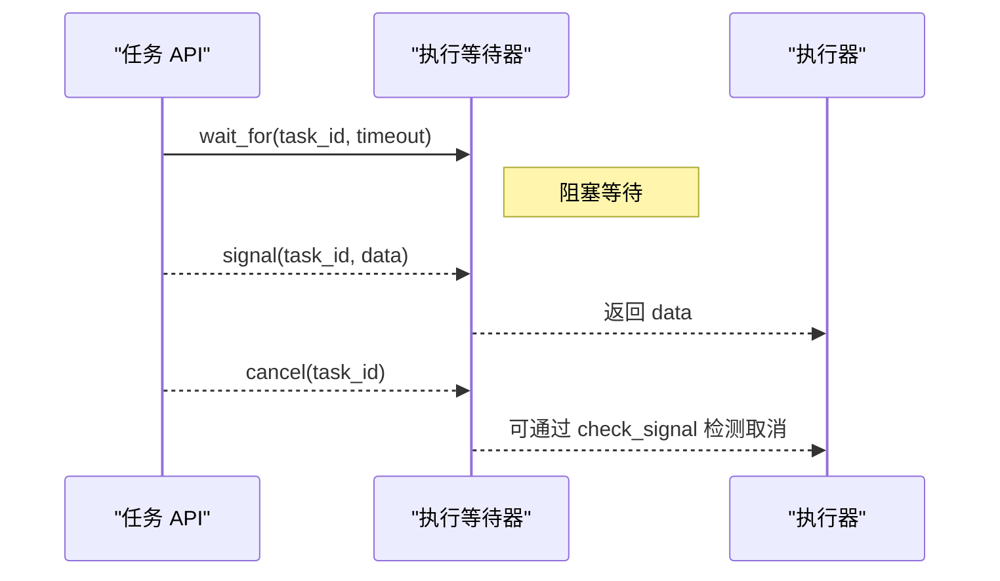
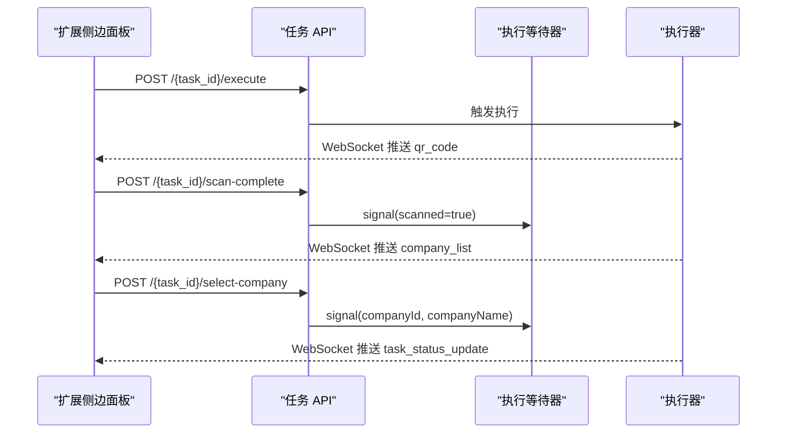
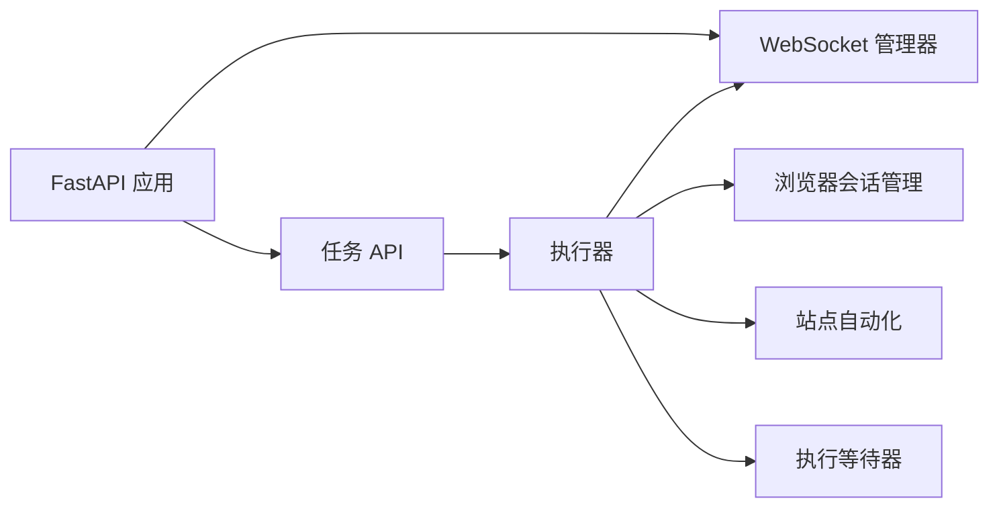

# Chrome V3 扩展可视化操作通路

<cite>
**本文档引用的文件**
- [main.py](file://CCC_RPA_API/app/main.py)
- [manager.py](file://CCC_RPA_API/app/ws/manager.py)
- [session_manager.py](file://CCC_RPA_API/app/browser/session_manager.py)
- [executor.py](file://CCC_RPA_API/app/services/executor.py)
- [site_automation.py](file://CCC_RPA_API/app/browser/site_automation.py)
- [waiter.py](file://CCC_RPA_API/app/browser/waiter.py)
- [tasks.py](file://CCC_RPA_API/app/api/tasks.py)
- [auth.py](file://CCC_RPA_API/app/api/auth.py)
- [execution.py](file://CCC_RPA_API/app/schemas/execution.py)
- [task.py](file://CCC_RPA_API/app/models/task.py)
</cite>

## 目录
1. [简介](#简介)
2. [项目结构](#项目结构)
3. [核心组件](#核心组件)
4. [架构总览](#架构总览)
5. [详细组件分析](#详细组件分析)
6. [依赖关系分析](#依赖关系分析)
7. [性能考虑](#性能考虑)
8. [故障排查指南](#故障排查指南)
9. [结论](#结论)
10. [附录](#附录)

## 简介
本文件面向希望基于 Chrome V3 扩展构建“可视化操作通路”的开发者，系统梳理后端调度网关与浏览器自动化执行的整体方案。文档重点覆盖以下方面：
- 扩展架构设计：Service Worker 后台服务、Content Script 页面注入、SidePanel 侧边面板的职责与协作
- 与调度网关的 WebSocket 通信协议、消息格式规范与实时同步机制
- 人工操作录制、自然语言 AI 指令输入界面与页面元素高亮识别技术
- 开发调试指南、跨域通信处理、安全策略配置与性能优化建议

说明：当前仓库主要提供后端调度网关与浏览器自动化执行能力，前端扩展工程位于其他目录；本文档以现有后端实现为基础，给出与扩展集成的对接建议与最佳实践。

## 项目结构
后端采用 FastAPI 提供 REST 与 WebSocket 接口，结合 Playwright 在专用线程中执行浏览器自动化任务，并通过 WebSocket 实时推送执行进度与状态。

图表来源
- [main.py:12-127](file://CCC_RPA_API/app/main.py#L12-L127)
- [manager.py:1-29](file://CCC_RPA_API/app/ws/manager.py#L1-L29)
- [tasks.py:1-76](file://CCC_RPA_API/app/api/tasks.py#L1-L76)
- [auth.py:1-24](file://CCC_RPA_API/app/api/auth.py#L1-L24)
- [executor.py:1-319](file://CCC_RPA_API/app/services/executor.py#L1-L319)
- [session_manager.py:1-186](file://CCC_RPA_API/app/browser/session_manager.py#L1-L186)
- [site_automation.py:1-743](file://CCC_RPA_API/app/browser/site_automation.py#L1-L743)
- [waiter.py:1-84](file://CCC_RPA_API/app/browser/waiter.py#L1-L84)
- [task.py:1-25](file://CCC_RPA_API/app/models/task.py#L1-L25)
- [execution.py:1-7](file://CCC_RPA_API/app/schemas/execution.py#L1-L7)

章节来源
- [main.py:12-127](file://CCC_RPA_API/app/main.py#L12-L127)
- [tasks.py:1-76](file://CCC_RPA_API/app/api/tasks.py#L1-L76)
- [auth.py:1-24](file://CCC_RPA_API/app/api/auth.py#L1-L24)

## 核心组件
- WebSocket 管理器：集中维护连接、广播消息，支持断线清理
- 执行器：编排任务生命周期，协调浏览器会话、站点自动化与等待器
- 浏览器会话管理：Playwright 工作线程、上下文池化、状态持久化
- 站点自动化封装：登录检查、二维码捕获、单位列表抓取、单位选择、保活与业务检测
- 执行等待器：基于线程事件的阻塞/唤醒机制，支持取消与轮询检查
- 任务 API：REST 接口驱动执行、扫码完成、单位选择、取消执行
- 认证 API：登录、登出、校验
- 数据模型与请求模型：任务实体、公司选择请求体

章节来源
- [manager.py:1-29](file://CCC_RPA_API/app/ws/manager.py#L1-L29)
- [executor.py:1-319](file://CCC_RPA_API/app/services/executor.py#L1-L319)
- [session_manager.py:1-186](file://CCC_RPA_API/app/browser/session_manager.py#L1-L186)
- [site_automation.py:1-743](file://CCC_RPA_API/app/browser/site_automation.py#L1-L743)
- [waiter.py:1-84](file://CCC_RPA_API/app/browser/waiter.py#L1-L84)
- [tasks.py:1-76](file://CCC_RPA_API/app/api/tasks.py#L1-L76)
- [auth.py:1-24](file://CCC_RPA_API/app/api/auth.py#L1-L24)
- [task.py:1-25](file://CCC_RPA_API/app/models/task.py#L1-L25)
- [execution.py:1-7](file://CCC_RPA_API/app/schemas/execution.py#L1-L7)

## 架构总览
下图展示后端与扩展侧的典型交互：扩展通过 WebSocket 与后端建立长连接，后端通过 Playwright 控制浏览器执行自动化任务，并将进度与状态实时推送给扩展。

图表来源
- [main.py:119-127](file://CCC_RPA_API/app/main.py#L119-L127)
- [manager.py:17-26](file://CCC_RPA_API/app/ws/manager.py#L17-L26)
- [executor.py:22-33](file://CCC_RPA_API/app/services/executor.py#L22-L33)
- [session_manager.py:42-77](file://CCC_RPA_API/app/browser/session_manager.py#L42-L77)
- [site_automation.py:38-58](file://CCC_RPA_API/app/browser/site_automation.py#L38-L58)

## 详细组件分析

### WebSocket 通信协议与消息格式
- 连接建立：客户端通过 /ws 建立 WebSocket 连接，后端接受并登记
- 广播机制：执行器在工作线程中通过主事件循环安全广播消息
- 消息类型与字段
  - 扫码二维码推送：type=qr_code，data={taskId, qrImage}
  - 登录结果：type=login_result，data={taskId, success, message}
  - 执行进度：type=execution_progress，data={taskId, step, message}
  - 执行错误：type=execution_error，data={taskId, message}
  - 单位列表：type=company_list，data={taskId, companies}
  - 任务状态更新：type=task_status_update，data={taskId, status, lastResult, lastExecutedAt}

图表来源
- [main.py:119-127](file://CCC_RPA_API/app/main.py#L119-L127)
- [manager.py:17-26](file://CCC_RPA_API/app/ws/manager.py#L17-L26)
- [executor.py:125-144](file://CCC_RPA_API/app/services/executor.py#L125-L144)
- [executor.py:165-166](file://CCC_RPA_API/app/services/executor.py#L165-L166)
- [executor.py:280-284](file://CCC_RPA_API/app/services/executor.py#L280-L284)

章节来源
- [main.py:119-127](file://CCC_RPA_API/app/main.py#L119-L127)
- [manager.py:17-26](file://CCC_RPA_API/app/ws/manager.py#L17-L26)
- [executor.py:22-33](file://CCC_RPA_API/app/services/executor.py#L22-L33)

### 执行器与任务生命周期
- 初始化与数据库准备：启动时创建表结构与迁移字段，插入示例任务
- 任务执行流程
  - 获取浏览器上下文（按省份隔离）
  - 检查登录状态，必要时推送二维码并等待扫码
  - 保存登录状态，抓取单位列表并推送至前端
  - 等待用户选择单位，切换到目标单位
  - 进入保活循环：随机保活、检测待处理业务、分段等待取消信号
  - 更新任务状态与日志，广播完成事件

图表来源
- [executor.py:78-315](file://CCC_RPA_API/app/services/executor.py#L78-L315)
- [session_manager.py:98-126](file://CCC_RPA_API/app/browser/session_manager.py#L98-L126)
- [site_automation.py:194-291](file://CCC_RPA_API/app/browser/site_automation.py#L194-L291)
- [site_automation.py:614-680](file://CCC_RPA_API/app/browser/site_automation.py#L614-L680)

章节来源
- [executor.py:78-315](file://CCC_RPA_API/app/services/executor.py#L78-L315)
- [session_manager.py:98-126](file://CCC_RPA_API/app/browser/session_manager.py#L98-L126)

### 浏览器会话管理与 Playwright 工作线程
- 专用线程：启动 Playwright 与 Chromium，主线程只负责事件循环
- 上下文池化：按省份隔离，持久化 storage_state，自动恢复
- 安全规避：设置 user_agent、viewport，移除 webdriver 标记
- 超时与异常：队列任务带超时，异常包装后回传，支持恢复

图表来源
- [session_manager.py:10-186](file://CCC_RPA_API/app/browser/session_manager.py#L10-L186)

章节来源
- [session_manager.py:10-186](file://CCC_RPA_API/app/browser/session_manager.py#L10-L186)

### 站点自动化与页面元素识别
- 登录检查：通过可见元素判断是否已登录
- 二维码捕获：优先元素截图，失败时整页降级
- 单位列表抓取：多级选择器降级策略，文本提取与正则辅助
- 单位选择：优先文本匹配，其次 data-id，再索引匹配，最后 JS 回退
- 保活与业务检测：随机滚动/移动/等待，检测徽章与关键词，避免误触

图表来源
- [site_automation.py:294-540](file://CCC_RPA_API/app/browser/site_automation.py#L294-L540)

章节来源
- [site_automation.py:38-58](file://CCC_RPA_API/app/browser/site_automation.py#L38-L58)
- [site_automation.py:148-173](file://CCC_RPA_API/app/browser/site_automation.py#L148-L173)
- [site_automation.py:194-291](file://CCC_RPA_API/app/browser/site_automation.py#L194-L291)
- [site_automation.py:294-540](file://CCC_RPA_API/app/browser/site_automation.py#L294-L540)
- [site_automation.py:614-680](file://CCC_RPA_API/app/browser/site_automation.py#L614-L680)

### 执行等待器与取消机制
- 阻塞等待：wait_for 支持超时，返回 data 或抛出超时异常
- 唤醒与取消：signal 设置数据并唤醒；cancel 写入取消标记
- 保活轮询：check_signal 非阻塞检查，便于分段等待

图表来源
- [waiter.py:14-84](file://CCC_RPA_API/app/browser/waiter.py#L14-L84)
- [tasks.py:60-75](file://CCC_RPA_API/app/api/tasks.py#L60-L75)

章节来源
- [waiter.py:14-84](file://CCC_RPA_API/app/browser/waiter.py#L14-L84)
- [tasks.py:60-75](file://CCC_RPA_API/app/api/tasks.py#L60-L75)

### REST API 与扩展集成要点
- 任务执行：POST /api/tasks/{task_id}/execute
- 扫码完成：POST /api/tasks/{task_id}/scan-complete
- 选择单位：POST /api/tasks/{task_id}/select-company
- 取消执行：POST /api/tasks/{task_id}/cancel-execution
- 认证接口：登录、登出、校验

图表来源
- [tasks.py:47-75](file://CCC_RPA_API/app/api/tasks.py#L47-L75)
- [execution.py:4-7](file://CCC_RPA_API/app/schemas/execution.py#L4-L7)

章节来源
- [tasks.py:47-75](file://CCC_RPA_API/app/api/tasks.py#L47-L75)
- [execution.py:4-7](file://CCC_RPA_API/app/schemas/execution.py#L4-L7)

## 依赖关系分析
- 组件耦合
  - 执行器依赖浏览器会话管理、站点自动化、等待器与 WebSocket 管理器
  - API 路由依赖执行等待器与服务层
  - WebSocket 管理器与主事件循环耦合，确保线程安全广播
- 外部依赖
  - FastAPI、SQLAlchemy、Playwright
  - CORS 中间件允许任意来源（开发环境）

图表来源
- [main.py:12-28](file://CCC_RPA_API/app/main.py#L12-L28)
- [executor.py:12-15](file://CCC_RPA_API/app/services/executor.py#L12-L15)
- [tasks.py:1-10](file://CCC_RPA_API/app/api/tasks.py#L1-L10)

章节来源
- [main.py:12-28](file://CCC_RPA_API/app/main.py#L12-L28)
- [executor.py:12-15](file://CCC_RPA_API/app/services/executor.py#L12-L15)
- [tasks.py:1-10](file://CCC_RPA_API/app/api/tasks.py#L1-L10)

## 性能考虑
- 线程隔离：Playwright 操作在专用线程执行，避免阻塞主事件循环与 WebSocket 广播
- 保活策略：随机滚动、鼠标移动、键盘 Tab 等低风险动作，降低风控概率
- 选择器降级：多级选择器与 JS 回退提升稳定性，减少失败重试成本
- 状态持久化：按省份存储 storage_state，减少重复登录开销
- 超时控制：任务队列与等待器超时参数合理设置，避免资源泄漏

## 故障排查指南
- 浏览器异常恢复
  - 检测到浏览器关闭时，执行器广播进度提示并触发会话恢复
  - 重新打开目标页面并记录检查点截图
- 登录失败
  - 二维码截图失败时降级为整页截图
  - 登录页导航失败时回退到首页点击策略
- 单位选择失败
  - 选择器全部失败时进行 JS 回退匹配
  - 保存失败截图便于定位问题
- WebSocket 断连
  - 广播时捕获异常并清理无效连接
  - 主事件循环不可用时记录告警

章节来源
- [executor.py:42-69](file://CCC_RPA_API/app/services/executor.py#L42-L69)
- [site_automation.py:148-173](file://CCC_RPA_API/app/browser/site_automation.py#L148-L173)
- [site_automation.py:426-461](file://CCC_RPA_API/app/browser/site_automation.py#L426-L461)
- [manager.py:17-26](file://CCC_RPA_API/app/ws/manager.py#L17-L26)

## 结论
该方案通过 WebSocket 实现实时状态推送，借助 Playwright 在专用线程中稳定执行页面自动化，并以多级降级策略提升鲁棒性。结合扩展侧的 SidePanel 与 Content Script，可构建高效、可视化的操作通路：用户在面板中发起任务、扫码登录、选择单位，后端实时反馈进度，扩展侧据此更新 UI 并提供高亮识别与自然语言指令入口。

## 附录
- 开发调试建议
  - 使用浏览器开发者工具观察 WebSocket 消息与页面截图输出
  - 在 Playwright 线程中打印页面 URL、标题与截图路径，便于定位页面状态
  - 对关键节点增加检查点截图，保留现场证据
- 跨域与安全
  - CORS 允许任意来源（开发环境），生产需限定来源
  - 严格校验前端传入的 company_id 与 company_name，防止注入
- 性能优化
  - 合理设置保活间隔与等待时间，避免频繁操作
  - 缓存常用上下文，减少重复初始化
  - 选择器优先使用稳定类名，降低 DOM 变更带来的脆弱性