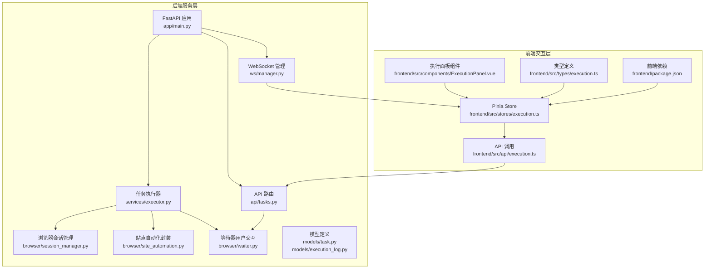
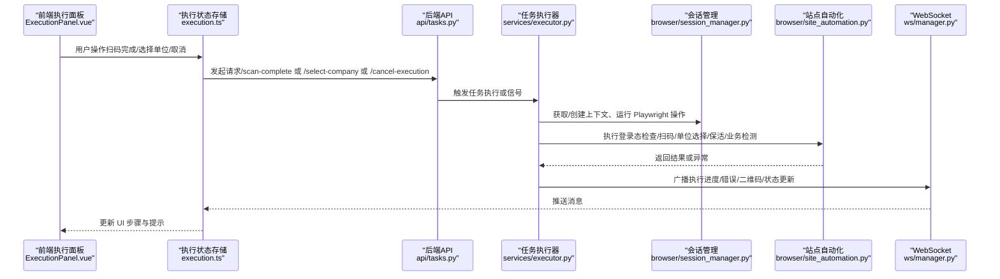
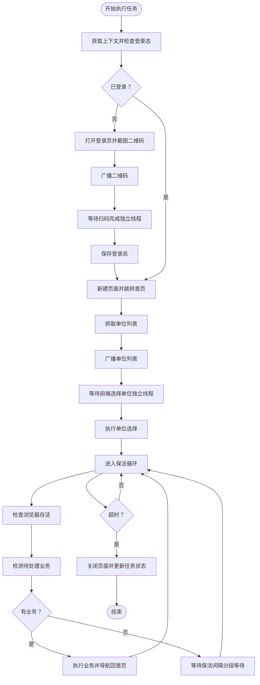
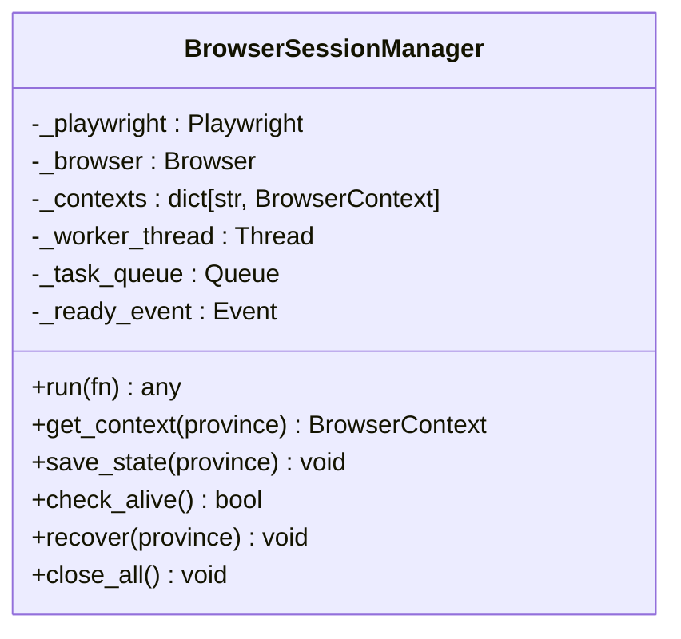
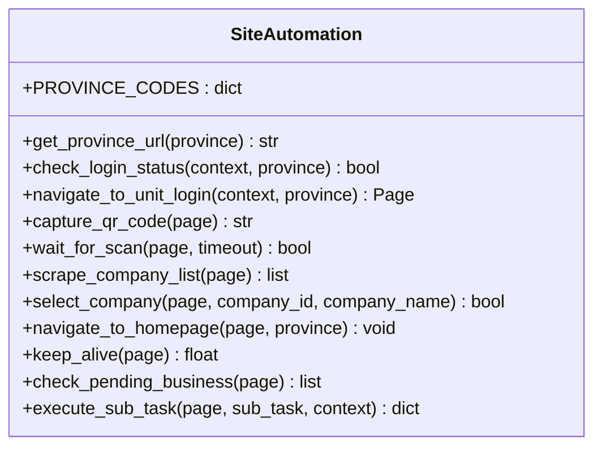
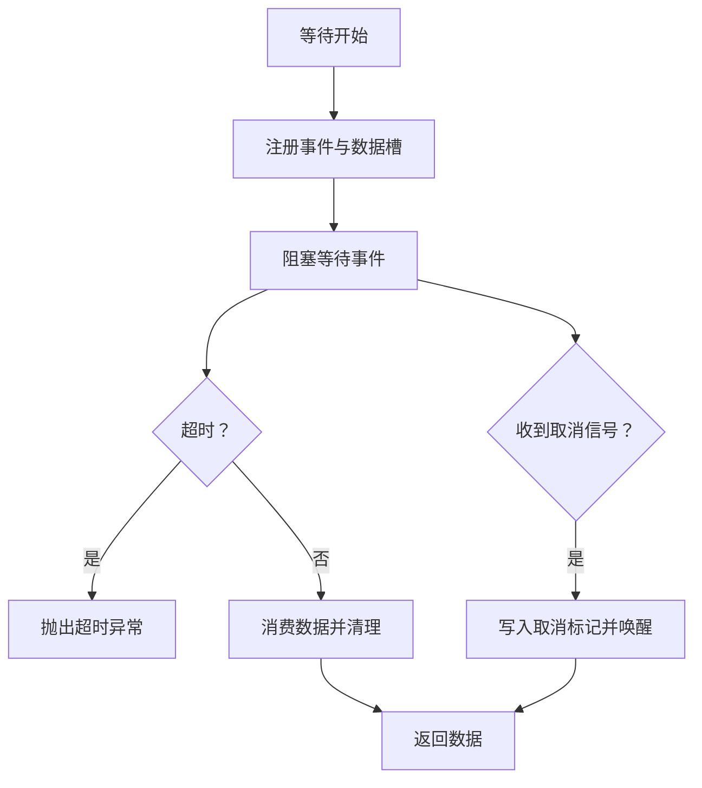
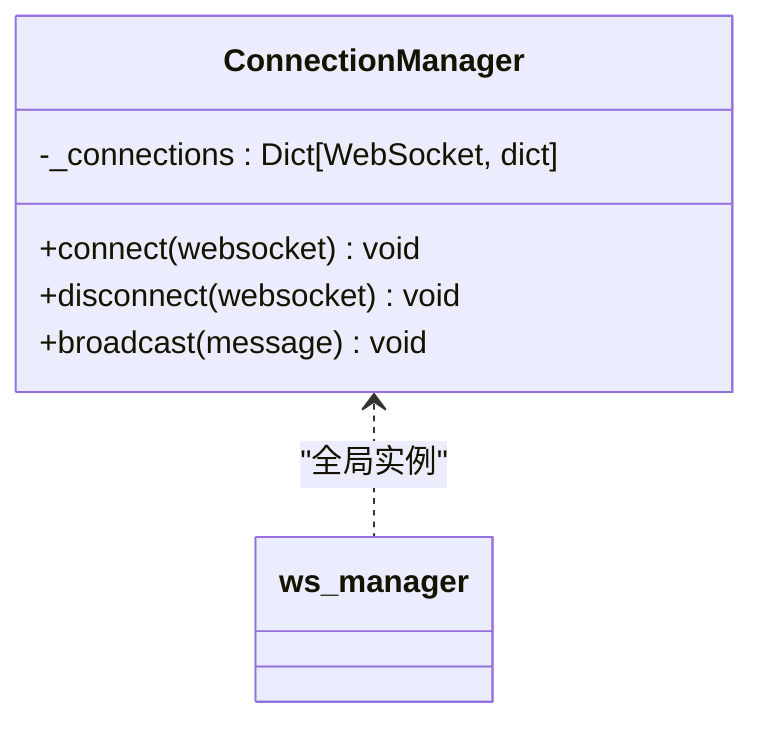
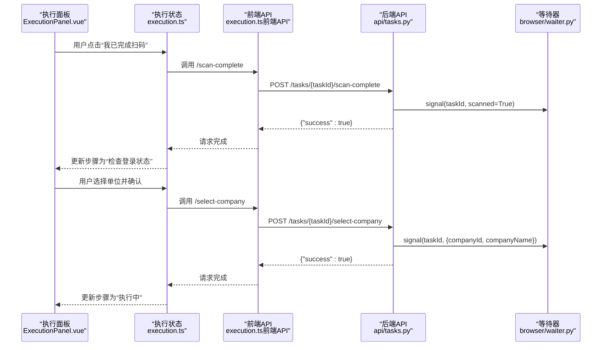
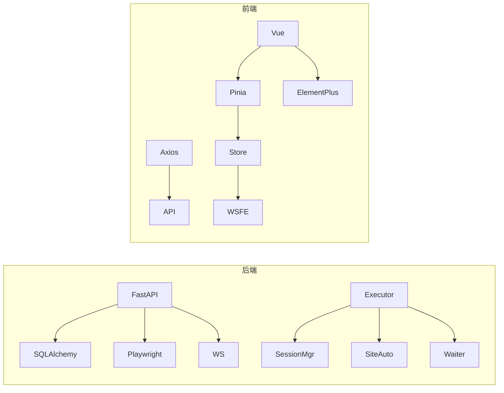
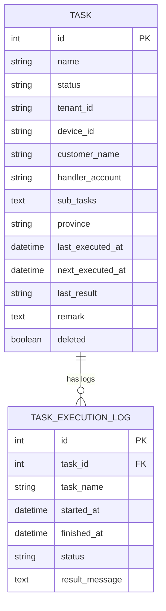

# Playwright 远程脚本自动化通路

<cite>
**本文档引用的文件**
- [main.py](file://CCC_RPA_API/app/main.py)
- [executor.py](file://CCC_RPA_API/app/services/executor.py)
- [site_automation.py](file://CCC_RPA_API/app/browser/site_automation.py)
- [session_manager.py](file://CCC_RPA_API/app/browser/session_manager.py)
- [waiter.py](file://CCC_RPA_API/app/browser/waiter.py)
- [human_behavior.py](file://CCC_RPA_API/app/browser/human_behavior.py)
- [manager.py](file://CCC_RPA_API/app/ws/manager.py)
- [tasks.py](file://CCC_RPA_API/app/api/tasks.py)
- [task.py](file://CCC_RPA_API/app/models/task.py)
- [execution_log.py](file://CCC_RPA_API/app/models/execution_log.py)
- [execution.ts](file://CCC-BrowserV4/frontend/src/stores/execution.ts)
- [execution.ts（前端API）](file://CCC-BrowserV4/frontend/src/api/execution.ts)
- [execution.ts（类型定义）](file://CCC-BrowserV4/frontend/src/types/execution.ts)
- [ExecutionPanel.vue](file://CCC-BrowserV4/frontend/src/components/ExecutionPanel.vue)
- [package.json（前端）](file://CCC-BrowserV4/frontend/package.json)
</cite>

## 目录
1. [简介](#简介)
2. [项目结构](#项目结构)
3. [核心组件](#核心组件)
4. [架构总览](#架构总览)
5. [详细组件分析](#详细组件分析)
6. [依赖分析](#依赖分析)
7. [性能考虑](#性能考虑)
8. [故障排查指南](#故障排查指南)
9. [结论](#结论)
10. [附录](#附录)

## 简介
本项目围绕“远程脚本自动化通路”构建，基于 Playwright 实现对 122.gov.cn 省级平台的自动化操作，涵盖登录态维护、单位选择、业务检测与执行、页面保活、异常恢复与重试、以及前后端协同的 WebSocket 通信。系统同时提供 Python 后端（FastAPI）与 Vue 前端（含 Tauri 支持），形成完整的远程自动化执行链路。

## 项目结构
系统分为三层：
- 后端服务层（Python/FastAPI）：提供 REST API、WebSocket 广播、任务调度与执行、数据库模型与服务。
- 自动化引擎层（Playwright）：封装浏览器会话、页面操作、真人行为模拟、异常恢复。
- 前端交互层（Vue/Pinia/Tauri）：展示执行步骤、推送二维码、接收实时状态、用户交互。

**图表来源**
- [main.py:1-127](file://CCC_RPA_API/app/main.py#L1-L127)
- [executor.py:1-318](file://CCC_RPA_API/app/services/executor.py#L1-L318)
- [session_manager.py:1-186](file://CCC_RPA_API/app/browser/session_manager.py#L1-L186)
- [site_automation.py:1-683](file://CCC_RPA_API/app/browser/site_automation.py#L1-L683)
- [waiter.py:1-84](file://CCC_RPA_API/app/browser/waiter.py#L1-L84)
- [manager.py:1-29](file://CCC_RPA_API/app/ws/manager.py#L1-L29)
- [tasks.py:1-76](file://CCC_RPA_API/app/api/tasks.py#L1-L76)
- [task.py:1-25](file://CCC_RPA_API/app/models/task.py#L1-L25)
- [execution_log.py:1-17](file://CCC_RPA_API/app/models/execution_log.py#L1-L17)
- [execution.ts:1-229](file://CCC-BrowserV4/frontend/src/stores/execution.ts#L1-L229)
- [execution.ts（前端API）:1-20](file://CCC-BrowserV4/frontend/src/api/execution.ts#L1-L20)
- [execution.ts（类型定义）:1-17](file://CCC-BrowserV4/frontend/src/types/execution.ts#L1-L17)
- [ExecutionPanel.vue:1-322](file://CCC-BrowserV4/frontend/src/components/ExecutionPanel.vue#L1-L322)
- [package.json（前端）:1-29](file://CCC-BrowserV4/frontend/package.json#L1-L29)

**章节来源**
- [main.py:1-127](file://CCC_RPA_API/app/main.py#L1-L127)
- [executor.py:1-318](file://CCC_RPA_API/app/services/executor.py#L1-L318)
- [session_manager.py:1-186](file://CCC_RPA_API/app/browser/session_manager.py#L1-L186)
- [site_automation.py:1-683](file://CCC_RPA_API/app/browser/site_automation.py#L1-L683)
- [waiter.py:1-84](file://CCC_RPA_API/app/browser/waiter.py#L1-L84)
- [manager.py:1-29](file://CCC_RPA_API/app/ws/manager.py#L1-L29)
- [tasks.py:1-76](file://CCC_RPA_API/app/api/tasks.py#L1-L76)
- [task.py:1-25](file://CCC_RPA_API/app/models/task.py#L1-L25)
- [execution_log.py:1-17](file://CCC_RPA_API/app/models/execution_log.py#L1-L17)
- [execution.ts:1-229](file://CCC-BrowserV4/frontend/src/stores/execution.ts#L1-L229)
- [execution.ts（前端API）:1-20](file://CCC-BrowserV4/frontend/src/api/execution.ts#L1-L20)
- [execution.ts（类型定义）:1-17](file://CCC-BrowserV4/frontend/src/types/execution.ts#L1-L17)
- [ExecutionPanel.vue:1-322](file://CCC-BrowserV4/frontend/src/components/ExecutionPanel.vue#L1-L322)
- [package.json（前端）:1-29](file://CCC-BrowserV4/frontend/package.json#L1-L29)

## 核心组件
- 任务执行器：负责任务生命周期管理、Playwright 操作调度、异常恢复、广播状态。
- 浏览器会话管理：按省份隔离上下文、持久化登录态、专用工作线程执行 Playwright 操作。
- 站点自动化封装：登录态检查、扫码登录、单位列表抓取、单位选择、页面保活、业务检测与执行。
- 等待器：以线程事件实现用户交互阻塞/唤醒，支持取消与轮询检查。
- WebSocket 管理：向前端广播执行进度、错误、二维码、任务状态更新。
- 前端执行状态管理：根据 WebSocket 消息驱动 UI 步骤流转，支持演示模式与真实交互。

**章节来源**
- [executor.py:1-318](file://CCC_RPA_API/app/services/executor.py#L1-L318)
- [session_manager.py:1-186](file://CCC_RPA_API/app/browser/session_manager.py#L1-L186)
- [site_automation.py:1-683](file://CCC_RPA_API/app/browser/site_automation.py#L1-L683)
- [waiter.py:1-84](file://CCC_RPA_API/app/browser/waiter.py#L1-L84)
- [manager.py:1-29](file://CCC_RPA_API/app/ws/manager.py#L1-L29)
- [execution.ts:1-229](file://CCC-BrowserV4/frontend/src/stores/execution.ts#L1-L229)

## 架构总览
系统采用“后端服务 + Playwright 引擎 + 前端交互”的分层架构。后端通过 API 与 WebSocket 提供控制面，Playwright 在专用线程中执行浏览器操作，前端通过 Pinia Store 与 WebSocket 实时渲染执行状态。

**图表来源**
- [ExecutionPanel.vue:1-322](file://CCC-BrowserV4/frontend/src/components/ExecutionPanel.vue#L1-L322)
- [execution.ts:1-229](file://CCC-BrowserV4/frontend/src/stores/execution.ts#L1-L229)
- [execution.ts（前端API）:1-20](file://CCC-BrowserV4/frontend/src/api/execution.ts#L1-L20)
- [tasks.py:1-76](file://CCC_RPA_API/app/api/tasks.py#L1-L76)
- [executor.py:1-318](file://CCC_RPA_API/app/services/executor.py#L1-L318)
- [session_manager.py:1-186](file://CCC_RPA_API/app/browser/session_manager.py#L1-L186)
- [site_automation.py:1-683](file://CCC_RPA_API/app/browser/site_automation.py#L1-L683)
- [manager.py:1-29](file://CCC_RPA_API/app/ws/manager.py#L1-L29)

## 详细组件分析

### 组件一：任务执行器（executor）
职责与流程
- 任务提交：通过线程池提交执行逻辑。
- 初始化与登录态检查：获取省份上下文，检查登录态；未登录则引导扫码登录并保存状态。
- 单位选择：抓取单位列表，等待前端选择，执行单位切换。
- 保活与业务执行：在限定时间内持续保活，检测待处理业务并执行。
- 异常恢复：检测浏览器存活，异常时恢复会话并重建页面。
- 状态广播：通过 WebSocket 推送执行进度、错误、任务状态更新。

**图表来源**
- [executor.py:78-314](file://CCC_RPA_API/app/services/executor.py#L78-L314)

**章节来源**
- [executor.py:1-318](file://CCC_RPA_API/app/services/executor.py#L1-L318)

### 组件二：浏览器会话管理（BrowserSessionManager）
职责与特性
- 专用工作线程：启动 Chromium，所有 Playwright 操作在专用线程中执行，避免与 asyncio 冲突。
- 上下文隔离：按省份管理 BrowserContext，支持 storage_state 持久化登录态。
- 任务队列：通过队列与事件实现线程安全的异步调用，支持超时与异常透传。
- 异常恢复：检测浏览器断开后自动重建，恢复指定省份上下文。

**图表来源**
- [session_manager.py:10-186](file://CCC_RPA_API/app/browser/session_manager.py#L10-L186)

**章节来源**
- [session_manager.py:1-186](file://CCC_RPA_API/app/browser/session_manager.py#L1-L186)

### 组件三：站点自动化封装（SiteAutomation）
职责与策略
- 登录态检查：通过元素可见性判断是否已登录。
- 扫码登录：优先直连登录页，失败则回退到首页点击，支持截图与降级策略。
- 单位列表抓取：多级选择器降级策略，必要时从页面文本提取单位信息。
- 单位选择：多策略匹配（名称、data-id、索引），支持 JS 回退与点击登录按钮。
- 页面保活：随机滚动、点击刷新、随机点击链接、随机等待，维持会话活跃。
- 业务检测：通过徽标计数与关键词匹配检测待处理业务。

**图表来源**
- [site_automation.py:16-683](file://CCC_RPA_API/app/browser/site_automation.py#L16-L683)

**章节来源**
- [site_automation.py:1-683](file://CCC_RPA_API/app/browser/site_automation.py#L1-L683)

### 组件四：等待器（ExecutionWaiter）
职责与机制
- 阻塞等待：为用户扫码与单位选择提供阻塞等待，避免占用 Playwright 线程。
- 信号唤醒：支持正常唤醒、取消（带标记）、非阻塞检查。
- 保活循环：在长时间保活阶段，非阻塞检查取消信号，确保快速响应。

**图表来源**
- [waiter.py:7-84](file://CCC_RPA_API/app/browser/waiter.py#L7-L84)

**章节来源**
- [waiter.py:1-84](file://CCC_RPA_API/app/browser/waiter.py#L1-L84)

### 组件五：WebSocket 管理（ConnectionManager）
职责与特性
- 连接管理：维护所有 WebSocket 连接，支持广播消息。
- 容错处理：发送失败自动清理无效连接，保证广播稳定性。
- 与后端集成：在执行器中安全地从工作线程广播消息至主事件循环。

**图表来源**
- [manager.py:5-29](file://CCC_RPA_API/app/ws/manager.py#L5-L29)

**章节来源**
- [manager.py:1-29](file://CCC_RPA_API/app/ws/manager.py#L1-L29)

### 组件六：前端执行状态与交互（Pinia Store + 组件）
职责与流程
- 状态驱动：根据 WebSocket 消息更新执行步骤（检查登录、扫码、等待单位、执行中、保活、完成、失败、取消）。
- 用户交互：扫码完成、选择单位、取消执行，分别调用后端 API 并触发等待器信号。
- 演示模式：在后端不可用时，前端模拟完整流程，便于开发与测试。

**图表来源**
- [ExecutionPanel.vue:1-322](file://CCC-BrowserV4/frontend/src/components/ExecutionPanel.vue#L1-L322)
- [execution.ts:1-229](file://CCC-BrowserV4/frontend/src/stores/execution.ts#L1-L229)
- [execution.ts（前端API）:1-20](file://CCC-BrowserV4/frontend/src/api/execution.ts#L1-L20)
- [tasks.py:60-75](file://CCC_RPA_API/app/api/tasks.py#L60-L75)
- [waiter.py:34-54](file://CCC_RPA_API/app/browser/waiter.py#L34-L54)

**章节来源**
- [execution.ts:1-229](file://CCC-BrowserV4/frontend/src/stores/execution.ts#L1-L229)
- [ExecutionPanel.vue:1-322](file://CCC-BrowserV4/frontend/src/components/ExecutionPanel.vue#L1-L322)
- [execution.ts（前端API）:1-20](file://CCC-BrowserV4/frontend/src/api/execution.ts#L1-L20)
- [execution.ts（类型定义）:1-17](file://CCC-BrowserV4/frontend/src/types/execution.ts#L1-L17)
- [tasks.py:1-76](file://CCC_RPA_API/app/api/tasks.py#L1-L76)
- [waiter.py:1-84](file://CCC_RPA_API/app/browser/waiter.py#L1-L84)

## 依赖分析
- 后端依赖
  - FastAPI：提供 REST API 与 WebSocket。
  - SQLAlchemy：ORM 模型与数据库操作。
  - Playwright：浏览器自动化与上下文管理。
  - 线程池与事件：并发执行与用户交互等待。
- 前端依赖
  - Vue 3 + Pinia：状态管理与组件化 UI。
  - Element Plus：UI 组件库。
  - Axios：HTTP 请求封装。
  - Tauri：桌面应用能力（与后端服务解耦）。

**图表来源**
- [main.py:1-127](file://CCC_RPA_API/app/main.py#L1-L127)
- [executor.py:1-318](file://CCC_RPA_API/app/services/executor.py#L1-L318)
- [session_manager.py:1-186](file://CCC_RPA_API/app/browser/session_manager.py#L1-L186)
- [site_automation.py:1-683](file://CCC_RPA_API/app/browser/site_automation.py#L1-L683)
- [waiter.py:1-84](file://CCC_RPA_API/app/browser/waiter.py#L1-L84)
- [manager.py:1-29](file://CCC_RPA_API/app/ws/manager.py#L1-L29)
- [execution.ts:1-229](file://CCC-BrowserV4/frontend/src/stores/execution.ts#L1-L229)
- [execution.ts（前端API）:1-20](file://CCC-BrowserV4/frontend/src/api/execution.ts#L1-L20)
- [package.json（前端）:1-29](file://CCC-BrowserV4/frontend/package.json#L1-L29)

**章节来源**
- [main.py:1-127](file://CCC_RPA_API/app/main.py#L1-L127)
- [executor.py:1-318](file://CCC_RPA_API/app/services/executor.py#L1-L318)
- [session_manager.py:1-186](file://CCC_RPA_API/app/browser/session_manager.py#L1-L186)
- [site_automation.py:1-683](file://CCC_RPA_API/app/browser/site_automation.py#L1-L683)
- [waiter.py:1-84](file://CCC_RPA_API/app/browser/waiter.py#L1-L84)
- [manager.py:1-29](file://CCC_RPA_API/app/ws/manager.py#L1-L29)
- [execution.ts:1-229](file://CCC-BrowserV4/frontend/src/stores/execution.ts#L1-L229)
- [execution.ts（前端API）:1-20](file://CCC-BrowserV4/frontend/src/api/execution.ts#L1-L20)
- [package.json（前端）:1-29](file://CCC-BrowserV4/frontend/package.json#L1-L29)

## 性能考虑
- 线程隔离与队列执行：Playwright 操作在专用线程执行，避免阻塞主事件循环，降低上下文切换成本。
- 保活策略：随机滚动、点击与等待，减少被风控概率，同时降低固定脚本的可识别性。
- 选择器降级：单位列表抓取采用多级选择器与文本提取，提升稳定性与容错性。
- 分段等待：保活循环中分段等待并检查取消信号，提高交互响应速度。
- 存储状态持久化：按省份保存 storage_state，减少重复登录成本。
- WebSocket 广播：集中管理连接，发送失败自动清理，避免广播风暴。

[本节为通用性能建议，无需特定文件来源]

## 故障排查指南
常见问题与定位
- 浏览器断开：执行器会检测并触发恢复流程，若仍失败需检查 Chromium 启动参数与系统环境。
- 登录态失效：前端扫码完成后需确保后端收到信号并保存状态；若未保存，需重新扫码。
- 单位选择失败：检查选择器策略与页面结构变化；必要时启用 JS 回退。
- 业务检测异常：确认徽标选择器与关键词配置，必要时增加文本匹配策略。
- WebSocket 断连：前端监听连接状态，后端自动清理无效连接；检查网络与防火墙。

**章节来源**
- [executor.py:42-70](file://CCC_RPA_API/app/services/executor.py#L42-L70)
- [site_automation.py:10-14](file://CCC_RPA_API/app/browser/site_automation.py#L10-L14)
- [site_automation.py:294-541](file://CCC_RPA_API/app/browser/site_automation.py#L294-L541)
- [site_automation.py:623-676](file://CCC_RPA_API/app/browser/site_automation.py#L623-L676)
- [manager.py:17-26](file://CCC_RPA_API/app/ws/manager.py#L17-L26)

## 结论
本系统通过“后端 API + Playwright 引擎 + 前端交互”的组合，实现了对省级平台的远程自动化执行。其关键优势在于：
- 明确的线程隔离与任务队列，保障执行稳定；
- 多策略的页面操作与真人行为模拟，提升抗风控能力；
- 完整的用户交互与状态广播，提供良好的可观测性；
- 前后端解耦与演示模式，便于开发与运维。

对于批量自动化场景，建议结合任务调度、日志审计与告警机制，进一步完善可靠性与可维护性。

[本节为总结性内容，无需特定文件来源]

## 附录

### 数据模型（Task 与 TaskExecutionLog）

**图表来源**
- [task.py:8-25](file://CCC_RPA_API/app/models/task.py#L8-L25)
- [execution_log.py:7-17](file://CCC_RPA_API/app/models/execution_log.py#L7-L17)

**章节来源**
- [task.py:1-25](file://CCC_RPA_API/app/models/task.py#L1-L25)
- [execution_log.py:1-17](file://CCC_RPA_API/app/models/execution_log.py#L1-L17)

### API 使用示例（后端）
- 获取任务列表：GET /api/tasks
- 创建任务：POST /api/tasks
- 获取任务详情：GET /api/tasks/{task_id}
- 更新任务：PUT /api/tasks/{task_id}
- 删除任务：DELETE /api/tasks/{task_id}
- 执行任务：POST /api/tasks/{task_id}/execute
- 获取任务日志：GET /api/tasks/{task_id}/logs
- 扫码完成：POST /api/tasks/{task_id}/scan-complete
- 选择单位：POST /api/tasks/{task_id}/select-company
- 取消执行：POST /api/tasks/{task_id}/cancel-execution

**章节来源**
- [tasks.py:1-76](file://CCC_RPA_API/app/api/tasks.py#L1-L76)

### 前端交互要点
- 执行面板根据 WebSocket 消息更新步骤与提示。
- 用户扫码完成后调用后端接口，触发等待器信号。
- 选择单位后调用后端接口，传递公司 ID 与名称。
- 支持取消执行，后端等待器收到取消标记。

**章节来源**
- [ExecutionPanel.vue:1-322](file://CCC-BrowserV4/frontend/src/components/ExecutionPanel.vue#L1-L322)
- [execution.ts:1-229](file://CCC-BrowserV4/frontend/src/stores/execution.ts#L1-L229)
- [execution.ts（前端API）:1-20](file://CCC-BrowserV4/frontend/src/api/execution.ts#L1-L20)
- [execution.ts（类型定义）:1-17](file://CCC-BrowserV4/frontend/src/types/execution.ts#L1-L17)

### 性能优化与最佳实践
- 使用专用线程执行 Playwright 操作，避免与 asyncio 事件循环冲突。
- 合理设置保活间隔与随机波动，平衡稳定性与效率。
- 多策略降级与 JS 回退，增强页面结构变化的适应性。
- 通过 storage_state 持久化登录态，减少重复登录成本。
- 前端分段等待与非阻塞检查，提升用户体验与响应速度。

[本节为通用指导，无需特定文件来源]