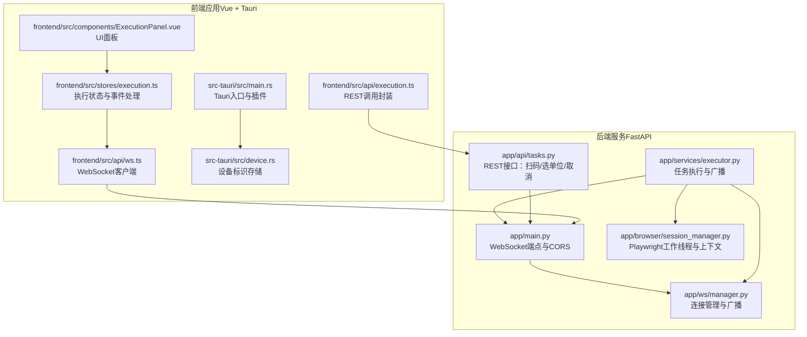
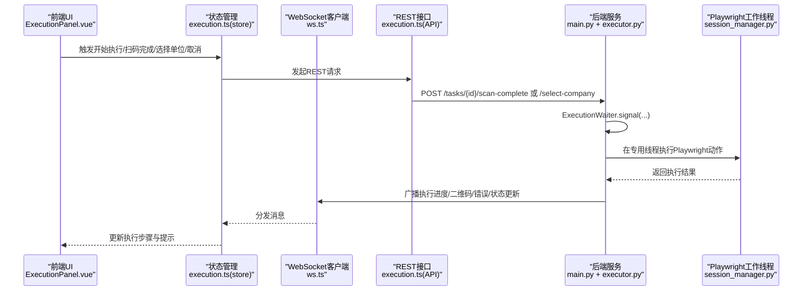
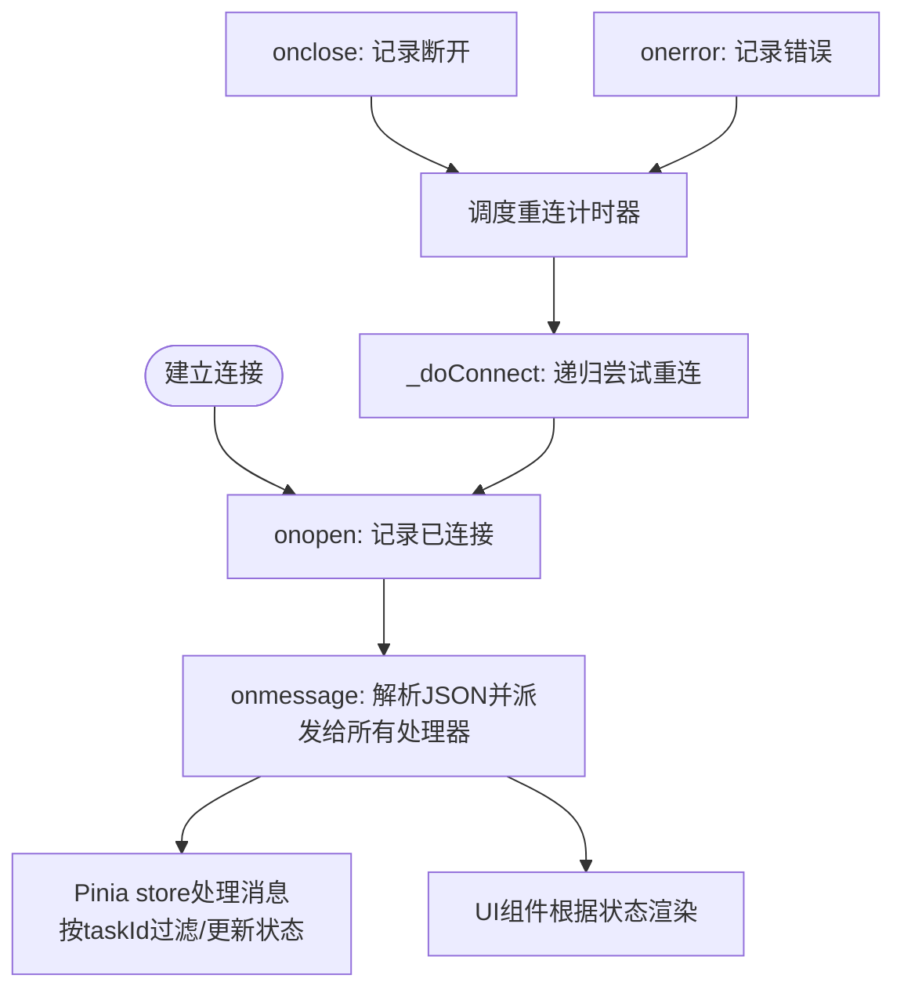
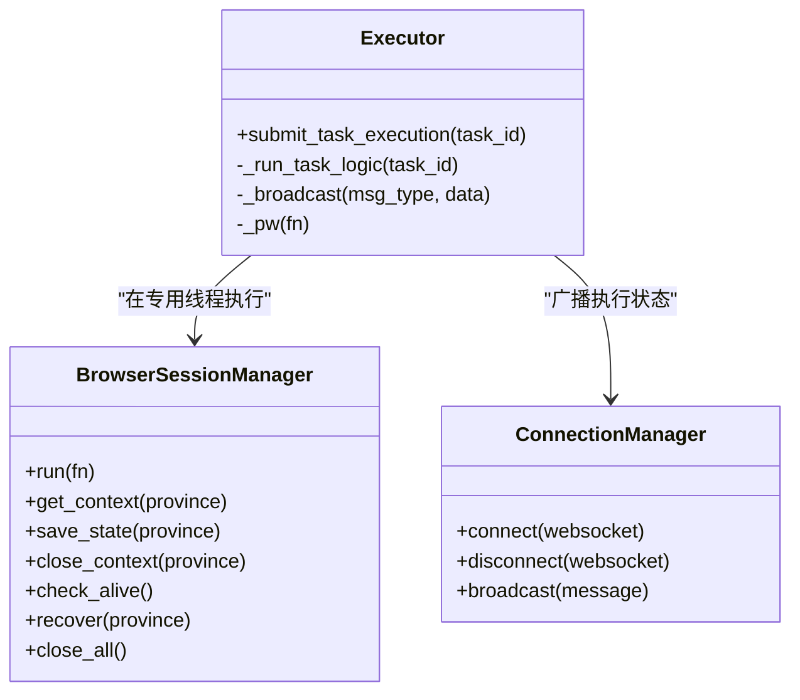
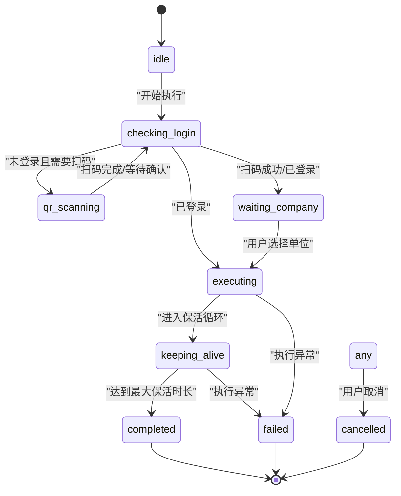
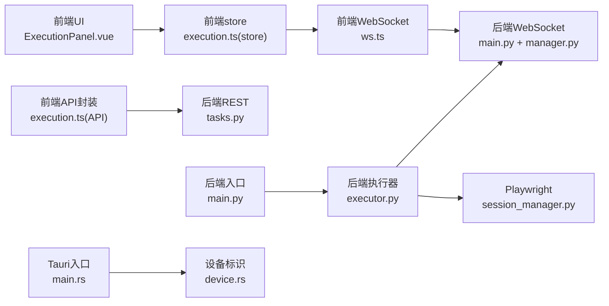

# 双通路双向消息桥接

<cite>
**本文档引用的文件**
- [main.py](file://CCC_RPA_API/app/main.py)
- [manager.py](file://CCC_RPA_API/app/ws/manager.py)
- [session_manager.py](file://CCC_RPA_API/app/browser/session_manager.py)
- [executor.py](file://CCC_RPA_API/app/services/executor.py)
- [tasks.py](file://CCC_RPA_API/app/api/tasks.py)
- [ws.ts](file://CCC-BrowserV4/frontend/src/api/ws.ts)
- [execution.ts](file://CCC-BrowserV4/frontend/src/api/execution.ts)
- [execution.ts（store）](file://CCC-BrowserV4/frontend/src/stores/execution.ts)
- [ExecutionPanel.vue](file://CCC-BrowserV4/frontend/src/components/ExecutionPanel.vue)
- [main.rs](file://CCC-BrowserV4/src-tauri/src/main.rs)
- [device.rs](file://CCC-BrowserV4/src-tauri/src/device.rs)
</cite>

## 目录
1. [简介](#简介)
2. [项目结构](#项目结构)
3. [核心组件](#核心组件)
4. [架构总览](#架构总览)
5. [详细组件分析](#详细组件分析)
6. [依赖分析](#依赖分析)
7. [性能考虑](#性能考虑)
8. [故障排除指南](#故障排除指南)
9. [结论](#结论)
10. [附录](#附录)

## 简介
本技术文档面向“双通路双向消息桥接系统”，聚焦以下目标：
- 解释 Playwright 自动化脚本执行与 Chrome 扩展/桌面应用可视化操作之间的消息传递机制、数据同步策略与状态一致性保障。
- 阐述 WebSocket 实时通信协议、消息队列管理与断线重连机制。
- 说明人工操作录制到 Playwright 脚本的转换思路、脚本生成规则与质量保证措施。
- 明确消息格式规范、事件类型定义、错误处理策略与性能监控指标。
- 提供集成示例、调试工具使用指南与故障排除方法。

## 项目结构
该仓库包含两套互补的执行通道：
- 后端服务（FastAPI）：负责任务编排、Playwright 会话管理、WebSocket 广播与业务逻辑执行。
- 前端应用（Vue + Tauri）：负责用户交互、WebSocket 接收、状态展示与与后端的 REST API 交互；Tauri 提供设备标识与系统能力桥接。

图表来源
- [main.py:119-127](file://CCC_RPA_API/app/main.py#L119-L127)
- [manager.py:5-29](file://CCC_RPA_API/app/ws/manager.py#L5-L29)
- [executor.py:10-33](file://CCC_RPA_API/app/services/executor.py#L10-L33)
- [session_manager.py:10-78](file://CCC_RPA_API/app/browser/session_manager.py#L10-L78)
- [tasks.py:47-76](file://CCC_RPA_API/app/api/tasks.py#L47-L76)
- [ws.ts:8-88](file://CCC-BrowserV4/frontend/src/api/ws.ts#L8-L88)
- [execution.ts（store）:6-67](file://CCC-BrowserV4/frontend/src/stores/execution.ts#L6-L67)
- [execution.ts（API）:1-20](file://CCC-BrowserV4/frontend/src/api/execution.ts#L1-L20)
- [ExecutionPanel.vue:1-108](file://CCC-BrowserV4/frontend/src/components/ExecutionPanel.vue#L1-L108)
- [main.rs:7-28](file://CCC-BrowserV4/src-tauri/src/main.rs#L7-L28)
- [device.rs:6-31](file://CCC-BrowserV4/src-tauri/src/device.rs#L6-L31)

章节来源
- [main.py:1-127](file://CCC_RPA_API/app/main.py#L1-L127)
- [ws.ts:1-88](file://CCC-BrowserV4/frontend/src/api/ws.ts#L1-L88)
- [execution.ts（store）:1-229](file://CCC-BrowserV4/frontend/src/stores/execution.ts#L1-L229)
- [execution.ts（API）:1-20](file://CCC-BrowserV4/frontend/src/api/execution.ts#L1-L20)
- [ExecutionPanel.vue:1-322](file://CCC-BrowserV4/frontend/src/components/ExecutionPanel.vue#L1-L322)
- [main.rs:1-29](file://CCC-BrowserV4/src-tauri/src/main.rs#L1-L29)
- [device.rs:1-32](file://CCC-BrowserV4/src-tauri/src/device.rs#L1-L32)

## 核心组件
- WebSocket 通道
  - 后端：WebSocket 端点与连接管理，支持广播消息。
  - 前端：WebSocket 客户端，自动断线重连，消息派发给状态管理。
- Playwright 执行引擎
  - 专用工作线程与任务队列，确保同步 API 在异步事件循环中安全执行。
  - 按省份维护浏览器上下文，持久化 storage_state，支持恢复与保活。
- 任务执行编排
  - 登录检查、扫码登录、单位选择、业务保活与执行、状态更新与日志记录。
- 前端交互与状态
  - 执行状态机、UI 面板、REST API 调用封装、演示模式与错误兜底。

章节来源
- [manager.py:5-29](file://CCC_RPA_API/app/ws/manager.py#L5-L29)
- [ws.ts:8-88](file://CCC-BrowserV4/frontend/src/api/ws.ts#L8-L88)
- [session_manager.py:10-186](file://CCC_RPA_API/app/browser/session_manager.py#L10-L186)
- [executor.py:78-319](file://CCC_RPA_API/app/services/executor.py#L78-L319)
- [execution.ts（store）:6-229](file://CCC-BrowserV4/frontend/src/stores/execution.ts#L6-L229)
- [ExecutionPanel.vue:1-322](file://CCC-BrowserV4/frontend/src/components/ExecutionPanel.vue#L1-L322)

## 架构总览
系统通过 WebSocket 实现“后端广播 + 前端订阅”的双向消息桥接，同时通过 REST API 支持人工操作的关键节点确认（扫码完成、选择单位、取消执行）。Playwright 在专用线程中执行自动化，确保与 FastAPI 异步事件循环兼容。

图表来源
- [ExecutionPanel.vue:1-108](file://CCC-BrowserV4/frontend/src/components/ExecutionPanel.vue#L1-L108)
- [execution.ts（store）:6-67](file://CCC-BrowserV4/frontend/src/stores/execution.ts#L6-L67)
- [ws.ts:8-88](file://CCC-BrowserV4/frontend/src/api/ws.ts#L8-L88)
- [execution.ts（API）:1-20](file://CCC-BrowserV4/frontend/src/api/execution.ts#L1-L20)
- [main.py:119-127](file://CCC_RPA_API/app/main.py#L119-L127)
- [executor.py:22-33](file://CCC_RPA_API/app/services/executor.py#L22-L33)
- [session_manager.py:80-96](file://CCC_RPA_API/app/browser/session_manager.py#L80-L96)

## 详细组件分析

### WebSocket 消息桥接与断线重连
- 后端
  - WebSocket 端点接收文本帧，连接管理器维护活跃连接并进行广播。
  - 使用主事件循环安全地从工作线程触发广播，避免事件循环冲突。
- 前端
  - 自动根据协议选择 ws/wss，统一消息格式 {type, data}。
  - 断线定时器与指数退避策略，确保在网络抖动时稳定恢复。
  - 消息派发到 Pinia store，store 内部按 taskId 过滤并更新 UI 状态。

图表来源
- [manager.py:10-26](file://CCC_RPA_API/app/ws/manager.py#L10-L26)
- [ws.ts:20-64](file://CCC-BrowserV4/frontend/src/api/ws.ts#L20-L64)
- [execution.ts（store）:22-67](file://CCC-BrowserV4/frontend/src/stores/execution.ts#L22-L67)

章节来源
- [main.py:119-127](file://CCC_RPA_API/app/main.py#L119-L127)
- [manager.py:5-29](file://CCC_RPA_API/app/ws/manager.py#L5-L29)
- [ws.ts:1-88](file://CCC-BrowserV4/frontend/src/api/ws.ts#L1-L88)
- [execution.ts（store）:1-229](file://CCC-BrowserV4/frontend/src/stores/execution.ts#L1-L229)

### Playwright 执行引擎与状态一致性
- 专用工作线程与队列
  - 启动时创建守护线程，主线程通过队列提交任务，事件对象同步等待结果。
  - 超时控制与异常透传，避免阻塞与静默失败。
- 上下文与状态持久化
  - 按省份隔离上下文，自动读取/保存 storage_state，减少重复登录成本。
  - 浏览器存活检查与自动恢复，异常时重建上下文并回到起始页。
- 与后端的协作
  - 执行过程中通过广播推送 UI 所需的中间态（二维码、单位列表、进度、错误、最终状态）。
  - 与 ExecutionWaiter 协作，阻塞等待人工操作（扫码/选单位），支持取消与超时。

图表来源
- [session_manager.py:10-186](file://CCC_RPA_API/app/browser/session_manager.py#L10-L186)
- [manager.py:5-29](file://CCC_RPA_API/app/ws/manager.py#L5-L29)
- [executor.py:78-319](file://CCC_RPA_API/app/services/executor.py#L78-L319)

章节来源
- [session_manager.py:1-186](file://CCC_RPA_API/app/browser/session_manager.py#L1-L186)
- [executor.py:1-319](file://CCC_RPA_API/app/services/executor.py#L1-L319)

### 前端状态机与 UI 协作
- 状态机
  - 包含 idle/checking_login/qr_scanning/waiting_company/executing/keeping_alive/completed/failed/cancelled 等步骤。
  - store 根据收到的消息类型更新步骤与提示语，必要时回退到演示模式。
- UI 面板
  - 根据当前步骤渲染不同内容（二维码、单位列表、执行中/保活中、结果与错误）。
  - 提供用户交互按钮（扫码完成、选择单位、取消执行）并调用 API。

图表来源
- [execution.ts（store）:1-229](file://CCC-BrowserV4/frontend/src/stores/execution.ts#L1-L229)
- [ExecutionPanel.vue:1-108](file://CCC-BrowserV4/frontend/src/components/ExecutionPanel.vue#L1-L108)

章节来源
- [execution.ts（store）:1-229](file://CCC-BrowserV4/frontend/src/stores/execution.ts#L1-L229)
- [ExecutionPanel.vue:1-322](file://CCC-BrowserV4/frontend/src/components/ExecutionPanel.vue#L1-L322)

### 人工操作到 Playwright 脚本的转换与质量保证
- 转换思路
  - 关键节点以 REST API 作为“录制触发器”：扫码完成、选择单位、取消执行。
  - 后端在专用线程中执行 Playwright 动作，前端通过 WebSocket 实时反馈中间态。
- 脚本生成规则
  - 登录检查与扫码登录：若未登录则打开登录页并抓取二维码，等待前端确认。
  - 单位选择：抓取单位列表，等待前端选择后切换至目标单位。
  - 业务保活：在业务页面循环执行保活与待处理业务检测，支持取消与超时。
- 质量保证
  - 超时与取消：明确的超时阈值与取消信号，避免无限等待。
  - 恢复与健壮性：浏览器异常时自动恢复上下文并回到起始页。
  - 日志与状态：完整的执行日志与任务状态更新，便于审计与回溯。

章节来源
- [tasks.py:47-76](file://CCC_RPA_API/app/api/tasks.py#L47-L76)
- [executor.py:78-319](file://CCC_RPA_API/app/services/executor.py#L78-L319)
- [execution.ts（API）:1-20](file://CCC-BrowserV4/frontend/src/api/execution.ts#L1-L20)

## 依赖分析
- 组件耦合
  - 后端：executor 依赖 session_manager 与 ws_manager；main.py 提供 WebSocket 端点与事件循环引用。
  - 前端：store 依赖 ws.ts；ExecutionPanel.vue 依赖 store；execution.ts(API) 依赖 tasks 路由。
- 外部依赖
  - FastAPI（WebSocket、CORS）、Playwright（Chromium）、Tauri（设备标识存储）。
- 潜在风险
  - 事件循环与同步 API 的并发冲突，通过专用线程与队列规避。
  - WebSocket 断线导致的状态不同步，通过断线重连与消息过滤缓解。

图表来源
- [ws.ts:1-88](file://CCC-BrowserV4/frontend/src/api/ws.ts#L1-L88)
- [execution.ts（store）:1-229](file://CCC-BrowserV4/frontend/src/stores/execution.ts#L1-L229)
- [ExecutionPanel.vue:1-322](file://CCC-BrowserV4/frontend/src/components/ExecutionPanel.vue#L1-L322)
- [execution.ts（API）:1-20](file://CCC-BrowserV4/frontend/src/api/execution.ts#L1-L20)
- [tasks.py:1-76](file://CCC_RPA_API/app/api/tasks.py#L1-L76)
- [executor.py:1-319](file://CCC_RPA_API/app/services/executor.py#L1-L319)
- [session_manager.py:1-186](file://CCC_RPA_API/app/browser/session_manager.py#L1-L186)
- [main.py:1-127](file://CCC_RPA_API/app/main.py#L1-L127)
- [main.rs:1-29](file://CCC-BrowserV4/src-tauri/src/main.rs#L1-L29)
- [device.rs:1-32](file://CCC-BrowserV4/src-tauri/src/device.rs#L1-L32)

章节来源
- [main.py:1-127](file://CCC_RPA_API/app/main.py#L1-L127)
- [manager.py:1-29](file://CCC_RPA_API/app/ws/manager.py#L1-L29)
- [session_manager.py:1-186](file://CCC_RPA_API/app/browser/session_manager.py#L1-L186)
- [executor.py:1-319](file://CCC_RPA_API/app/services/executor.py#L1-L319)
- [tasks.py:1-76](file://CCC_RPA_API/app/api/tasks.py#L1-L76)
- [ws.ts:1-88](file://CCC-BrowserV4/frontend/src/api/ws.ts#L1-L88)
- [execution.ts（store）:1-229](file://CCC-BrowserV4/frontend/src/stores/execution.ts#L1-L229)
- [execution.ts（API）:1-20](file://CCC-BrowserV4/frontend/src/api/execution.ts#L1-L20)
- [ExecutionPanel.vue:1-322](file://CCC-BrowserV4/frontend/src/components/ExecutionPanel.vue#L1-L322)
- [main.rs:1-29](file://CCC-BrowserV4/src-tauri/src/main.rs#L1-L29)
- [device.rs:1-32](file://CCC-BrowserV4/src-tauri/src/device.rs#L1-L32)

## 性能考虑
- 事件循环与线程模型
  - 专用 Playwright 工作线程避免与 FastAPI 事件循环冲突；线程池与队列提升吞吐。
- I/O 与网络
  - WebSocket 广播采用单次序列化与批量发送，减少 CPU 开销；断线重连指数退避降低风暴效应。
- 前端渲染
  - 状态机驱动的细粒度更新，避免不必要的重渲染；演示模式在后端不可用时提供快速反馈。
- 存储与持久化
  - storage_state 按省份持久化，减少重复登录与初始化时间。

## 故障排除指南
- WebSocket 连接问题
  - 现象：断线频繁或无法连接。
  - 排查：检查协议（ws/wss）、CORS 配置、后端端口可达性；查看前端断线重连日志。
  - 参考
    - [main.py:14-21](file://CCC_RPA_API/app/main.py#L14-L21)
    - [ws.ts:15-64](file://CCC-BrowserV4/frontend/src/api/ws.ts#L15-L64)
- Playwright 初始化失败
  - 现象：浏览器未就绪或超时。
  - 排查：确认 Chromium 启动参数、headless 设置、工作线程 ready 事件；查看初始化日志。
  - 参考
    - [session_manager.py:30-78](file://CCC_RPA_API/app/browser/session_manager.py#L30-L78)
- 执行异常与状态不同步
  - 现象：前端显示“执行异常”或状态停滞。
  - 排查：检查后端广播链路、store 消息过滤（按 taskId）、ExecutionWaiter 信号是否到达。
  - 参考
    - [executor.py:22-33](file://CCC_RPA_API/app/services/executor.py#L22-L33)
    - [execution.ts（store）:22-67](file://CCC-BrowserV4/frontend/src/stores/execution.ts#L22-L67)
- 人工操作未生效
  - 现象：扫码完成/选择单位后无反应。
  - 排查：确认 REST 请求是否成功、ExecutionWaiter.signal 是否被调用、前端是否正确调用 API。
  - 参考
    - [tasks.py:60-75](file://CCC_RPA_API/app/api/tasks.py#L60-L75)
    - [execution.ts（API）:1-20](file://CCC-BrowserV4/frontend/src/api/execution.ts#L1-L20)

章节来源
- [main.py:14-21](file://CCC_RPA_API/app/main.py#L14-L21)
- [ws.ts:15-64](file://CCC-BrowserV4/frontend/src/api/ws.ts#L15-L64)
- [session_manager.py:30-78](file://CCC_RPA_API/app/browser/session_manager.py#L30-L78)
- [executor.py:22-33](file://CCC_RPA_API/app/services/executor.py#L22-L33)
- [execution.ts（store）:22-67](file://CCC-BrowserV4/frontend/src/stores/execution.ts#L22-L67)
- [tasks.py:60-75](file://CCC_RPA_API/app/api/tasks.py#L60-L75)
- [execution.ts（API）:1-20](file://CCC-BrowserV4/frontend/src/api/execution.ts#L1-L20)

## 结论
本系统通过“REST 关键节点 + WebSocket 实时广播”的双通路设计，实现了人工操作与 Playwright 自动化的无缝衔接。专用线程与队列确保了执行引擎的稳定性，断线重连与状态机提升了用户体验。建议在生产环境中进一步完善可观测性（埋点、指标上报）与容错策略（幂等、补偿机制）。

## 附录

### 消息格式规范与事件类型
- 消息格式
  - 字段：type（字符串）、data（任意结构）
  - 示例：后端广播 { type: "...", data: { taskId, ... } }
- 事件类型
  - qr_code：推送二维码图片（base64 或 URL）
  - company_list：推送单位列表
  - execution_progress：执行进度与提示语
  - login_result：登录结果
  - execution_error：执行异常
  - task_status_update：任务状态更新（completed/failed）

章节来源
- [ws.ts:1-8](file://CCC-BrowserV4/frontend/src/api/ws.ts#L1-L8)
- [execution.ts（store）:27-66](file://CCC-BrowserV4/frontend/src/stores/execution.ts#L27-L66)
- [executor.py:100-306](file://CCC_RPA_API/app/services/executor.py#L100-L306)

### 集成示例与调试工具
- 集成示例
  - 前端 WebSocket 连接与消息处理：参考 [ws.ts:8-88](file://CCC-BrowserV4/frontend/src/api/ws.ts#L8-L88)，[execution.ts（store）:22-67](file://CCC-BrowserV4/frontend/src/stores/execution.ts#L22-L67)
  - 后端 WebSocket 广播与连接管理：参考 [main.py:119-127](file://CCC_RPA_API/app/main.py#L119-L127)，[manager.py:10-26](file://CCC_RPA_API/app/ws/manager.py#L10-L26)
  - Playwright 执行与恢复：参考 [session_manager.py:80-186](file://CCC_RPA_API/app/browser/session_manager.py#L80-L186)，[executor.py:42-69](file://CCC_RPA_API/app/services/executor.py#L42-L69)
- 调试工具
  - 浏览器开发者工具：观察 WebSocket 帧、Network 请求、Console 错误。
  - 后端日志：关注广播失败、超时、恢复日志。
  - Tauri 设备标识：检查设备.json 是否生成与读取正常。

章节来源
- [ws.ts:1-88](file://CCC-BrowserV4/frontend/src/api/ws.ts#L1-L88)
- [execution.ts（store）:1-229](file://CCC-BrowserV4/frontend/src/stores/execution.ts#L1-L229)
- [main.py:119-127](file://CCC_RPA_API/app/main.py#L119-L127)
- [manager.py:1-29](file://CCC_RPA_API/app/ws/manager.py#L1-L29)
- [session_manager.py:1-186](file://CCC_RPA_API/app/browser/session_manager.py#L1-L186)
- [executor.py:1-319](file://CCC_RPA_API/app/services/executor.py#L1-L319)
- [main.rs:1-29](file://CCC-BrowserV4/src-tauri/src/main.rs#L1-L29)
- [device.rs:1-32](file://CCC-BrowserV4/src-tauri/src/device.rs#L1-L32)