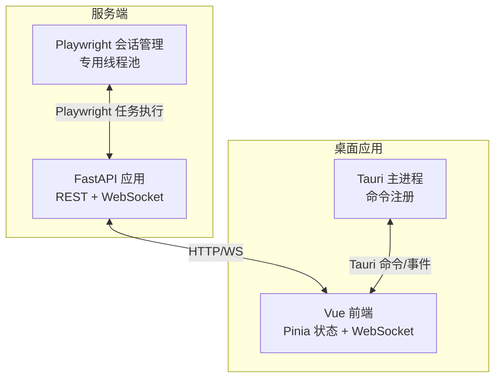
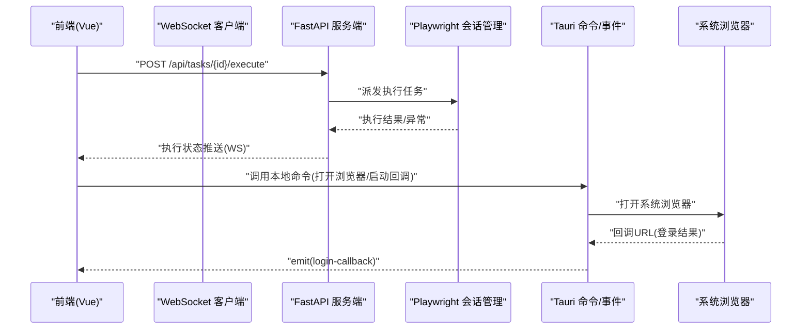
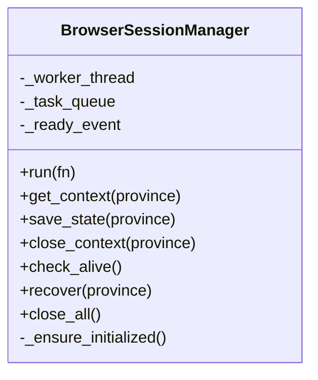
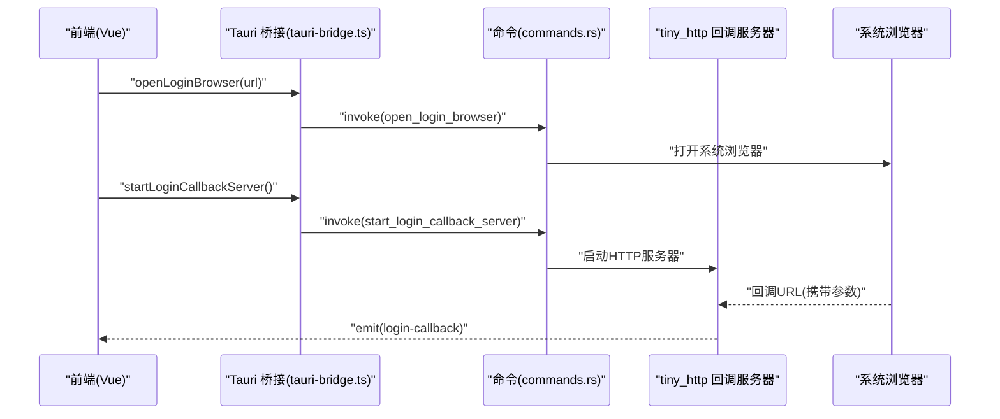
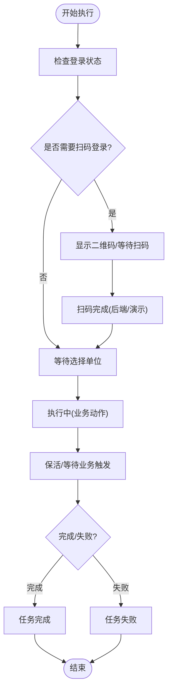
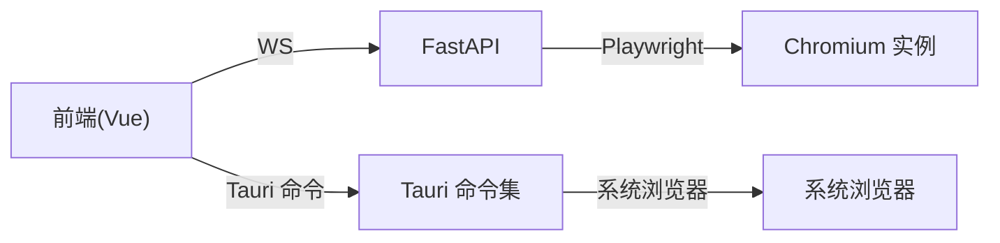

# 双通路操控体系

<cite>
**本文档引用的文件**
- [main.py](file://CCC_RPA_API/app/main.py)
- [session_manager.py](file://CCC_RPA_API/app/browser/session_manager.py)
- [tasks.py](file://CCC_RPA_API/app/api/tasks.py)
- [main.rs](file://CCC-BrowserV4/src-tauri/src/main.rs)
- [commands.rs](file://CCC-BrowserV4/src-tauri/src/commands.rs)
- [device.rs](file://CCC-BrowserV4/src-tauri/src/device.rs)
- [tauri-bridge.ts](file://CCC-BrowserV4/frontend/src/utils/tauri-bridge.ts)
- [ws.ts](file://CCC-BrowserV4/frontend/src/api/ws.ts)
- [execution.ts](file://CCC-BrowserV4/frontend/src/stores/execution.ts)
- [TaskPage.vue](file://CCC-BrowserV4/frontend/src/pages/TaskPage.vue)
</cite>

## 目录
1. [引言](#引言)
2. [项目结构](#项目结构)
3. [核心组件](#核心组件)
4. [架构总览](#架构总览)
5. [详细组件分析](#详细组件分析)
6. [依赖关系分析](#依赖关系分析)
7. [性能考量](#性能考量)
8. [故障排查指南](#故障排查指南)
9. [结论](#结论)
10. [附录](#附录)

## 引言
本文件面向商用级 AI 浏览器系统，系统性阐述“双通路操控体系”的技术实现与架构设计，包括：
- Playwright 远程脚本自动化通路：以服务端为中心的无头浏览器控制与任务编排。
- Chrome V3 扩展/桌面应用可视化操作通路：基于 Tauri/Vue 的本地 GUI 交互与事件驱动。

重点说明两种操控方式的差异、优势与适用场景；并通过消息桥接、状态同步与一致性保障机制，实现两者的协同与互操作。

## 项目结构
系统由三部分组成：
- 服务端（Python FastAPI）：提供任务编排、Playwright 会话管理、WebSocket 推送与 REST API。
- 桌面应用（Tauri + Vue）：提供可视化界面、本地命令桥接、登录回调处理与执行状态展示。
- 通信链路：前端通过 WebSocket 实时接收执行状态；本地命令通过 Tauri 暴露的命令与事件与桌面层交互。

图表来源
- [main.py:1-127](file://CCC_RPA_API/app/main.py#L1-L127)
- [session_manager.py:1-183](file://CCC_RPA_API/app/browser/session_manager.py#L1-L183)
- [main.rs:1-29](file://CCC-BrowserV4/src-tauri/src/main.rs#L1-L29)
- [ws.ts:1-88](file://CCC-BrowserV4/frontend/src/api/ws.ts#L1-L88)

章节来源
- [main.py:1-127](file://CCC_RPA_API/app/main.py#L1-L127)
- [main.rs:1-29](file://CCC-BrowserV4/src-tauri/src/main.rs#L1-L29)

## 核心组件
- 服务端任务与执行编排：REST 接口负责任务 CRUD、执行触发与日志查询；WebSocket 管理器负责广播执行状态。
- Playwright 会话管理：单实例、多上下文、持久化 storage_state 的专用线程模型，确保跨线程安全与稳定性。
- 桌面应用命令与事件：设备标识、登录回调、令牌生成等本地能力通过 Tauri 暴露；前端通过 WebSocket 与后端实时联动。
- 前端状态与交互：Pinia 管理执行步骤与消息；Vue 组件驱动任务列表与执行面板；WebSocket 封装负责连接与重连。

章节来源
- [tasks.py:1-76](file://CCC_RPA_API/app/api/tasks.py#L1-L76)
- [session_manager.py:1-183](file://CCC_RPA_API/app/browser/session_manager.py#L1-L183)
- [commands.rs:1-92](file://CCC-BrowserV4/src-tauri/src/commands.rs#L1-L92)
- [execution.ts:1-229](file://CCC-BrowserV4/frontend/src/stores/execution.ts#L1-L229)

## 架构总览
双通路协同的关键在于：
- 服务端作为统一编排中心：接收前端执行请求，调度 Playwright 执行任务，并通过 WebSocket 推送执行状态。
- 桌面应用作为本地交互入口：通过 Tauri 命令与本地环境交互（如打开系统浏览器、启动本地回调服务器），并通过 WebSocket 接收服务端状态。
- 两者通过标准协议互通：HTTP/WS 与 Tauri 命令/事件，形成解耦的桥接层。

图表来源
- [tasks.py:47-52](file://CCC_RPA_API/app/api/tasks.py#L47-L52)
- [session_manager.py:77-93](file://CCC_RPA_API/app/browser/session_manager.py#L77-L93)
- [ws.ts:1-88](file://CCC-BrowserV4/frontend/src/api/ws.ts#L1-L88)
- [commands.rs:32-91](file://CCC-BrowserV4/src-tauri/src/commands.rs#L32-L91)

## 详细组件分析

### Playwright 远程脚本自动化通路
- 设计要点
  - 单实例 + 多上下文：按“省份”维度隔离上下文，支持持久化 storage_state，提升会话复用效率。
  - 专用工作线程：所有 Playwright 操作在独立线程执行，避免与 asyncio 事件循环冲突。
  - 队列化执行：通过线程安全队列承载任务，统一调度与超时控制。
- 关键流程
  - 初始化：启动 Chromium，设置无头参数与反检测脚本，准备 storage_state 目录。
  - 上下文管理：按需创建/恢复上下文，自动加载历史登录态。
  - 执行与回收：执行完成后保存状态或关闭上下文，必要时整体恢复浏览器实例。

图表来源
- [session_manager.py:1-183](file://CCC_RPA_API/app/browser/session_manager.py#L1-L183)

章节来源
- [session_manager.py:1-183](file://CCC_RPA_API/app/browser/session_manager.py#L1-L183)

### Chrome V3 扩展/桌面应用可视化操作通路
- 设计要点
  - Tauri 命令注册：将设备标识、令牌生成、打开浏览器、启动登录回调等本地能力暴露给前端。
  - 登录回调服务器：本地 tiny_http 服务器监听随机端口，接收一次回调后立即响应并通知前端。
  - 前端状态与事件：通过 Pinia 管理执行步骤与消息，监听 Tauri 事件与 WebSocket 推送。
- 关键流程
  - 设备初始化：首次运行生成设备 ID 并持久化。
  - 登录流程：前端调用命令打开系统浏览器，本地启动回调服务器，收到回调后通过事件通知前端。
  - 执行面板：前端根据 WebSocket 推送更新 UI 步骤与消息。

图表来源
- [tauri-bridge.ts:1-33](file://CCC-BrowserV4/frontend/src/utils/tauri-bridge.ts#L1-L33)
- [commands.rs:32-91](file://CCC-BrowserV4/src-tauri/src/commands.rs#L32-L91)
- [device.rs:1-32](file://CCC-BrowserV4/src-tauri/src/device.rs#L1-L32)

章节来源
- [main.rs:1-29](file://CCC-BrowserV4/src-tauri/src/main.rs#L1-L29)
- [commands.rs:1-92](file://CCC-BrowserV4/src-tauri/src/commands.rs#L1-L92)
- [device.rs:1-32](file://CCC-BrowserV4/src-tauri/src/device.rs#L1-L32)
- [tauri-bridge.ts:1-33](file://CCC-BrowserV4/frontend/src/utils/tauri-bridge.ts#L1-L33)

### 消息桥接、数据同步与状态一致性
- WebSocket 推送
  - 服务端在任务执行过程中通过 WebSocket 广播执行进度、扫码、单位选择、登录结果、错误与状态变更等消息。
  - 前端订阅并按 taskId 过滤消息，更新执行步骤与提示信息。
- Tauri 事件
  - 登录回调通过 Tauri emit 事件推送到前端，前端据此进入下一步流程。
- 状态一致性
  - 前端执行状态由 Pinia 统一管理，避免 UI 与后端状态不一致。
  - 任务状态变更通过 WebSocket 更新，前端乐观更新与后端最终状态对齐。

图表来源
- [execution.ts:22-67](file://CCC-BrowserV4/frontend/src/stores/execution.ts#L22-L67)
- [TaskPage.vue:255-267](file://CCC-BrowserV4/frontend/src/pages/TaskPage.vue#L255-L267)

章节来源
- [ws.ts:1-88](file://CCC-BrowserV4/frontend/src/api/ws.ts#L1-L88)
- [execution.ts:1-229](file://CCC-BrowserV4/frontend/src/stores/execution.ts#L1-L229)
- [TaskPage.vue:1-428](file://CCC-BrowserV4/frontend/src/pages/TaskPage.vue#L1-L428)

### 接口规范与最佳实践
- 服务端 REST 接口
  - 触发执行：POST /api/tasks/{task_id}/execute
  - 查询日志：GET /api/tasks/{task_id}/logs
  - 扫码完成：POST /api/tasks/{task_id}/scan-complete
  - 选择单位：POST /api/tasks/{task_id}/select-company
  - 取消执行：POST /api/tasks/{task_id}/cancel-execution
- WebSocket 消息类型
  - qr_code：下发二维码图片与提示
  - company_list：下发可选单位列表
  - execution_progress：执行步骤与消息
  - login_result：登录结果
  - execution_error：执行异常
  - task_status_update：任务状态变更
- 前端调用建议
  - 使用 Pinia 管理执行状态，避免重复请求与竞态。
  - 对 WebSocket 断线进行指数退避重连，确保状态最终一致。
  - 在演示模式下，前端可模拟扫码与执行流程，降低对后端依赖。

章节来源
- [tasks.py:1-76](file://CCC_RPA_API/app/api/tasks.py#L1-L76)
- [execution.ts:69-121](file://CCC-BrowserV4/frontend/src/stores/execution.ts#L69-L121)
- [ws.ts:1-88](file://CCC-BrowserV4/frontend/src/api/ws.ts#L1-L88)

## 依赖关系分析
- 服务端
  - FastAPI 提供路由与 WebSocket 管理器；Playwright 会话管理器在专用线程执行。
- 桌面应用
  - Tauri 注册命令与插件；前端通过桥接调用命令并监听事件。
- 通信
  - 前端通过 WebSocket 与服务端通信；通过 Tauri 与本地环境交互。

图表来源
- [main.py:119-127](file://CCC_RPA_API/app/main.py#L119-L127)
- [main.rs:12-18](file://CCC-BrowserV4/src-tauri/src/main.rs#L12-L18)
- [session_manager.py:39-74](file://CCC_RPA_API/app/browser/session_manager.py#L39-L74)

章节来源
- [main.py:1-127](file://CCC_RPA_API/app/main.py#L1-L127)
- [main.rs:1-29](file://CCC-BrowserV4/src-tauri/src/main.rs#L1-L29)

## 性能考量
- Playwright 通路
  - 专用线程避免与 asyncio 冲突；上下文按省份隔离，减少全局干扰。
  - storage_state 持久化降低重复登录成本；上下文失效自动重建，提升鲁棒性。
- 桌面应用通路
  - tiny_http 轻量回调服务器，仅处理一次请求，避免资源泄漏。
  - Tauri 命令调用开销低，适合高频本地交互。
- 通信优化
  - WebSocket 按 taskId 过滤消息，减少前端处理负担。
  - 断线重连与心跳策略，保障长连接稳定性。

## 故障排查指南
- Playwright 初始化失败
  - 现象：专用线程未就绪或超时。
  - 排查：检查 Chromium 启动参数与权限；查看工作线程错误日志。
- WebSocket 连接异常
  - 现象：断线或消息解析失败。
  - 排查：确认服务端 WebSocket 路由；检查前端重连逻辑与协议。
- 登录回调未到达
  - 现象：前端未收到 login-callback 事件。
  - 排查：确认本地回调服务器端口与 URL 参数解析；检查 Tauri 事件发射。
- 执行状态不同步
  - 现象：UI 显示与后端状态不一致。
  - 排查：确认 WebSocket 消息过滤与 taskId 匹配；避免并发修改状态。

章节来源
- [session_manager.py:39-74](file://CCC_RPA_API/app/browser/session_manager.py#L39-L74)
- [ws.ts:44-55](file://CCC-BrowserV4/frontend/src/api/ws.ts#L44-L55)
- [commands.rs:52-88](file://CCC-BrowserV4/src-tauri/src/commands.rs#L52-L88)
- [execution.ts:22-67](file://CCC-BrowserV4/frontend/src/stores/execution.ts#L22-L67)

## 结论
双通路操控体系通过“服务端编排 + 本地交互”的组合，兼顾了自动化执行的稳定性和可视化操作的人性化体验。Playwright 通路适合大规模、高可靠性的任务执行；桌面应用通路适合需要本地交互与登录流程可视化的场景。二者通过 WebSocket 与 Tauri 事件实现解耦互通，配合统一的状态管理与消息过滤，确保了系统的一致性与可维护性。

## 附录
- 术语
  - 扫码登录：通过系统浏览器打开登录页，本地回调服务器接收一次性回调参数，用于完成登录态注入。
  - 保活：在业务空闲阶段维持页面活跃，等待业务触发。
- 最佳实践
  - 优先使用服务端通路进行批量任务与复杂流程编排。
  - 本地通路用于调试、演示与需要人工干预的环节。
  - 前端应具备降级能力（演示模式），在网络或后端异常时仍可提供基本体验。