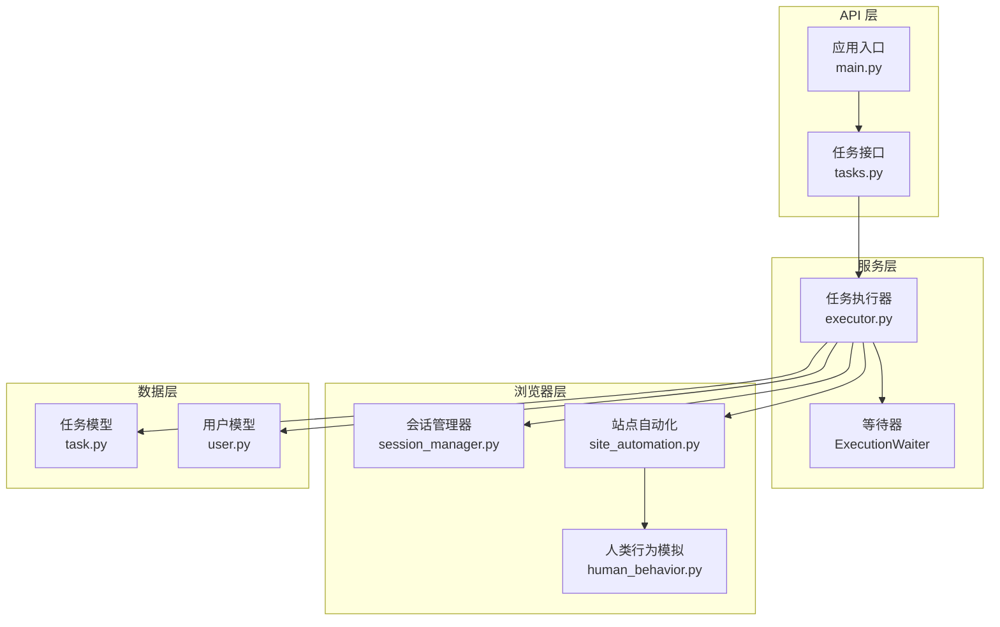
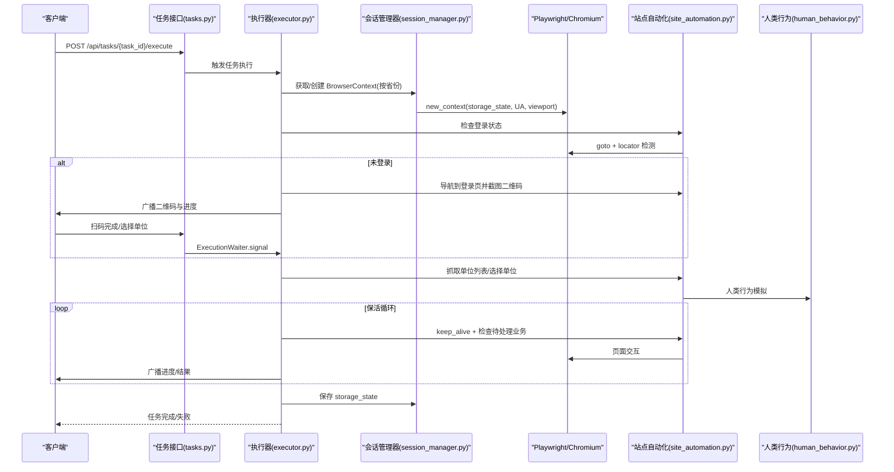
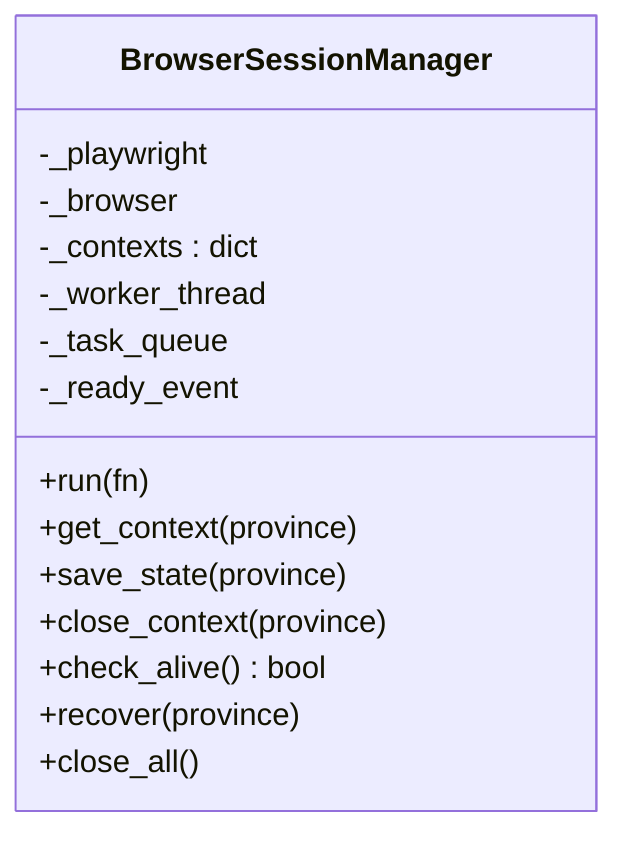
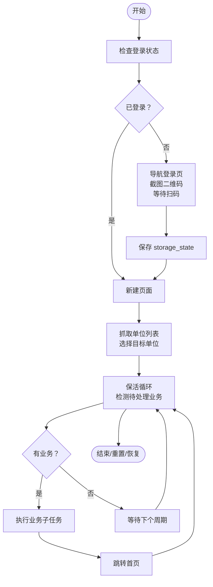
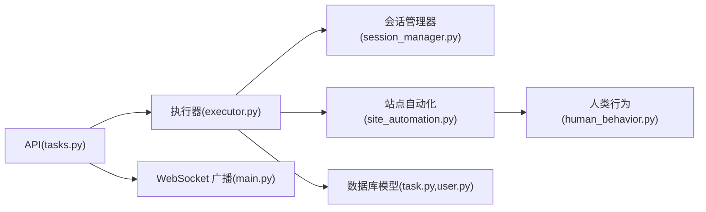

# 强隔离沙箱会话机制

<cite>
**本文档引用的文件**
- [session_manager.py](file://CCC_RPA_API/app/browser/session_manager.py)
- [site_automation.py](file://CCC_RPA_API/app/browser/site_automation.py)
- [human_behavior.py](file://CCC_RPA_API/app/browser/human_behavior.py)
- [executor.py](file://CCC_RPA_API/app/services/executor.py)
- [tasks.py](file://CCC_RPA_API/app/api/tasks.py)
- [main.py](file://CCC_RPA_API/app/main.py)
- [task.py](file://CCC_RPA_API/app/models/task.py)
- [user.py](file://CCC_RPA_API/app/models/user.py)
</cite>

## 目录
1. [简介](#简介)
2. [项目结构](#项目结构)
3. [核心组件](#核心组件)
4. [架构总览](#架构总览)
5. [详细组件分析](#详细组件分析)
6. [依赖关系分析](#依赖关系分析)
7. [性能考虑](#性能考虑)
8. [故障排查指南](#故障排查指南)
9. [结论](#结论)
10. [附录](#附录)

## 简介
本文件面向商用级 AI 浏览器系统，系统性阐述“强隔离沙箱会话机制”的实现与落地。当前仓库中的 Python 后端以 Playwright 为基础，通过专用工作线程承载 Chromium 实例，结合浏览器上下文级别的存储隔离、指纹伪装与行为模拟，形成多维度的“弱隔离”能力；同时，系统通过 API 层与前端交互，支持扫码登录、单位选择、业务保活等流程。

需要特别说明的是：当前代码库并未直接使用 Linux Namespace/Cgroup、Kubernetes Pod 或 Windows Job 对象进行强隔离。若需实现“强隔离”，应在现有架构之上叠加容器或虚拟化层，将每个会话置于独立的 Pod/容器/VM 中，并在网络、文件系统、进程等层面实施严格隔离。本文将分别给出基于现有实现的“弱隔离”分析与“强隔离”建议方案。

## 项目结构
后端采用 FastAPI + SQLAlchemy 架构，核心模块围绕“任务编排 + 浏览器会话管理 + 自动化脚本”展开：
- API 层：提供任务 CRUD、执行控制、扫码完成与单位选择等接口
- 服务层：任务执行器协调 Playwright 会话、等待用户输入、广播状态
- 浏览器层：会话管理器负责 Chromium 生命周期与上下文隔离，站点自动化脚本实现业务流程
- 数据模型：任务与用户模型定义数据库表结构

图表来源
- [main.py:30-127](file://CCC_RPA_API/app/main.py#L30-L127)
- [tasks.py:1-76](file://CCC_RPA_API/app/api/tasks.py#L1-L76)
- [executor.py:1-308](file://CCC_RPA_API/app/services/executor.py#L1-L308)
- [session_manager.py:1-183](file://CCC_RPA_API/app/browser/session_manager.py#L1-L183)
- [site_automation.py:1-562](file://CCC_RPA_API/app/browser/site_automation.py#L1-L562)
- [human_behavior.py:1-86](file://CCC_RPA_API/app/browser/human_behavior.py#L1-L86)
- [task.py:1-25](file://CCC_RPA_API/app/models/task.py#L1-L25)
- [user.py:1-17](file://CCC_RPA_API/app/models/user.py#L1-L17)

章节来源
- [main.py:30-127](file://CCC_RPA_API/app/main.py#L30-L127)
- [tasks.py:1-76](file://CCC_RPA_API/app/api/tasks.py#L1-L76)

## 核心组件
- 会话管理器（BrowserSessionManager）
  - 专用工作线程承载 Playwright 与 Chromium，避免与 asyncio 冲突
  - 按“省份”维度创建独立 BrowserContext，实现存储与指纹的逻辑隔离
  - 提供 storage_state 持久化，支持断点续跑
- 站点自动化（SiteAutomation）
  - 封装 122.gov.cn 登录、单位选择、业务保活等流程
  - 提供二维码截图、等待扫码、抓取单位列表、保活循环等能力
- 人类行为模拟（HumanBehavior）
  - 随机延迟、鼠标移动轨迹、滚动与键盘输入模拟，降低被检测概率
- 任务执行器（Executor）
  - 统筹任务生命周期：登录检查、扫码等待、单位选择、业务保活、结果回传
  - 在独立线程池中执行阻塞等待，避免阻塞 Playwright 工作线程
- API 与模型
  - FastAPI 提供任务接口与 WebSocket 广播
  - SQLAlchemy 定义任务与用户模型

章节来源
- [session_manager.py:7-183](file://CCC_RPA_API/app/browser/session_manager.py#L7-L183)
- [site_automation.py:16-562](file://CCC_RPA_API/app/browser/site_automation.py#L16-L562)
- [human_behavior.py:12-86](file://CCC_RPA_API/app/browser/human_behavior.py#L12-L86)
- [executor.py:68-308](file://CCC_RPA_API/app/services/executor.py#L68-L308)
- [tasks.py:13-76](file://CCC_RPA_API/app/api/tasks.py#L13-L76)
- [task.py:8-25](file://CCC_RPA_API/app/models/task.py#L8-L25)
- [user.py:7-17](file://CCC_RPA_API/app/models/user.py#L7-L17)

## 架构总览
下图展示从 API 请求到浏览器自动化执行的完整链路，以及各组件之间的依赖关系。

图表来源
- [tasks.py:47-76](file://CCC_RPA_API/app/api/tasks.py#L47-L76)
- [executor.py:68-308](file://CCC_RPA_API/app/services/executor.py#L68-L308)
- [session_manager.py:96-132](file://CCC_RPA_API/app/browser/session_manager.py#L96-L132)
- [site_automation.py:38-562](file://CCC_RPA_API/app/browser/site_automation.py#L38-L562)
- [human_behavior.py:12-86](file://CCC_RPA_API/app/browser/human_behavior.py#L12-L86)

## 详细组件分析

### 会话管理器（BrowserSessionManager）
- 专用工作线程
  - 启动 Playwright 与 Chromium，设置禁用自动化特征标志，避免被检测
  - 通过队列与事件实现线程安全的任务调度，避免死锁
- 上下文隔离
  - 按“省份”键维护 BrowserContext 映射，每个上下文拥有独立 Cookie、LocalStorage、IndexedDB
  - storage_state 文件持久化，支持断点续跑与状态恢复
- 生命周期管理
  - 提供 check_alive、recover、close_all 等方法，保障异常恢复与资源回收

图表来源
- [session_manager.py:7-183](file://CCC_RPA_API/app/browser/session_manager.py#L7-L183)

章节来源
- [session_manager.py:27-183](file://CCC_RPA_API/app/browser/session_manager.py#L27-L183)

### 站点自动化（SiteAutomation）
- 登录流程
  - 检查登录状态、导航到单位登录页、二维码截图、等待扫码
- 单位选择
  - 多选择器降级策略，支持 data-id、文本匹配与索引回退
- 业务保活
  - 随机滚动、点击刷新、随机点击链接、随机等待，维持会话活跃
- 待处理业务检测
  - 基于徽标计数与关键词匹配，识别业务类型与数量

图表来源
- [site_automation.py:38-562](file://CCC_RPA_API/app/browser/site_automation.py#L38-L562)
- [executor.py:142-256](file://CCC_RPA_API/app/services/executor.py#L142-L256)

章节来源
- [site_automation.py:16-562](file://CCC_RPA_API/app/browser/site_automation.py#L16-L562)

### 人类行为模拟（HumanBehavior）
- 鼠标移动轨迹与点击：在元素边界内随机偏移，模拟真实点击
- 键盘输入：逐字符输入并加入随机延迟
- 滚动与等待：多次小幅度滚动与随机等待，降低检测概率

章节来源
- [human_behavior.py:12-86](file://CCC_RPA_API/app/browser/human_behavior.py#L12-L86)

### 任务执行器（Executor）
- 线程池与事件循环
  - 使用线程池执行阻塞等待（扫码、单位选择），避免阻塞 Playwright 工作线程
  - 通过主事件循环安全广播 WebSocket 消息
- 会话恢复
  - 在关键步骤前检查浏览器存活，异常时自动恢复并重建上下文
- 任务生命周期
  - 初始化 → 登录检查 → 扫码/选择单位 → 保活循环 → 结束与日志记录

章节来源
- [executor.py:17-308](file://CCC_RPA_API/app/services/executor.py#L17-L308)

### API 与模型
- 任务接口
  - 提供任务执行、扫码完成、单位选择、取消执行等接口
- WebSocket 广播
  - 在执行过程中向客户端推送二维码、进度与错误信息
- 数据模型
  - 任务与用户模型定义字段与索引，支撑任务调度与权限控制

章节来源
- [tasks.py:13-76](file://CCC_RPA_API/app/api/tasks.py#L13-L76)
- [main.py:12-127](file://CCC_RPA_API/app/main.py#L12-L127)
- [task.py:8-25](file://CCC_RPA_API/app/models/task.py#L8-L25)
- [user.py:7-17](file://CCC_RPA_API/app/models/user.py#L7-L17)

## 依赖关系分析
- 组件耦合
  - 执行器依赖会话管理器与站点自动化；站点自动化依赖人类行为模拟
  - API 层通过执行器间接依赖数据库模型与 WebSocket 管理器
- 外部依赖
  - Playwright/Chromium：浏览器自动化与上下文隔离
  - FastAPI/SQLAlchemy：接口与数据持久化
  - WebSocket：实时状态推送

图表来源
- [tasks.py:1-76](file://CCC_RPA_API/app/api/tasks.py#L1-L76)
- [executor.py:1-308](file://CCC_RPA_API/app/services/executor.py#L1-L308)
- [session_manager.py:1-183](file://CCC_RPA_API/app/browser/session_manager.py#L1-L183)
- [site_automation.py:1-562](file://CCC_RPA_API/app/browser/site_automation.py#L1-L562)
- [human_behavior.py:1-86](file://CCC_RPA_API/app/browser/human_behavior.py#L1-L86)
- [task.py:1-25](file://CCC_RPA_API/app/models/task.py#L1-L25)
- [user.py:1-17](file://CCC_RPA_API/app/models/user.py#L1-L17)
- [main.py:12-127](file://CCC_RPA_API/app/main.py#L12-L127)

章节来源
- [executor.py:1-308](file://CCC_RPA_API/app/services/executor.py#L1-L308)
- [session_manager.py:1-183](file://CCC_RPA_API/app/browser/session_manager.py#L1-L183)

## 性能考虑
- 线程模型
  - 专用工作线程承载 Playwright，避免与 asyncio 事件循环竞争
  - 独立线程池处理阻塞等待，减少主线程阻塞
- 存储与状态
  - storage_state 持久化减少重复登录成本，提升吞吐
- 网络与渲染
  - headless=False 便于调试与截图，生产环境可改为 headless 提升性能
  - viewport 固定尺寸降低资源消耗
- 可靠性
  - 会话存活检查与自动恢复，降低长时间运行风险

## 故障排查指南
- 浏览器异常
  - 现象：页面报错“浏览器已关闭”
  - 处理：执行器会在关键步骤前检查存活，必要时调用 recover 重建上下文
- 扫码超时
  - 现象：等待扫码阶段超时
  - 处理：检查 WebSocket 广播与前端交互，确认扫码完成信号是否到达
- 单位选择失败
  - 现象：选择器匹配不到目标单位
  - 处理：查看站点自动化降级策略与日志，确认页面结构是否变化
- 会话状态丢失
  - 现象：重启后登录状态未恢复
  - 处理：确认 storage_state 文件是否存在且可读

章节来源
- [executor.py:35-60](file://CCC_RPA_API/app/services/executor.py#L35-L60)
- [executor.py:162-171](file://CCC_RPA_API/app/services/executor.py#L162-L171)
- [site_automation.py:294-420](file://CCC_RPA_API/app/browser/site_automation.py#L294-L420)
- [session_manager.py:126-132](file://CCC_RPA_API/app/browser/session_manager.py#L126-L132)

## 结论
当前系统通过专用工作线程与 BrowserContext 隔离实现了“弱隔离”的会话管理，并结合人类行为模拟与存储状态持久化提升了稳定性与抗检测能力。若需达到“强隔离”，建议在现有基础上引入容器/虚拟化层，将每个会话置于独立 Pod/容器/VM 中，配合网络命名空间、cgroup、用户命名空间等实现更严格的资源与网络隔离，并在入口处增加沙箱与安全策略。

## 附录

### 强隔离沙箱会话机制建议方案（概念设计）
- 进程层隔离
  - 每个会话运行在独立容器/VM 中，进程树与资源受 cgroup 管控
- 网络层隔离
  - 每个会话分配独立网络命名空间与出口 IP，限制 DNS 与出站流量
- 文件层隔离
  - 每个会话 UserData 目录映射到独立卷，禁止跨会话访问
- 插件与扩展
  - 每个会话独立加载扩展实例，扩展权限最小化
- 指纹与渲染
  - 随机化 UA、WebGL/Canvas 指纹，启用硬件加速白名单
- 安全边界与验证
  - 通过 eBPF/Seccomp 限制系统调用，审计关键 API 调用
  - 隔离效果验证：端到端连通性测试、指纹一致性测试、跨会话数据泄露检测