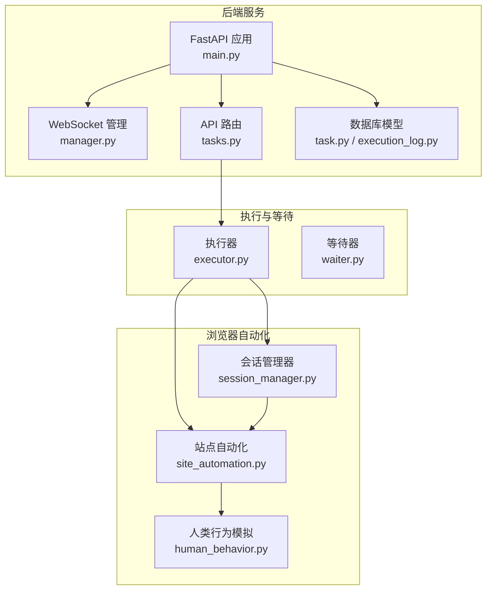
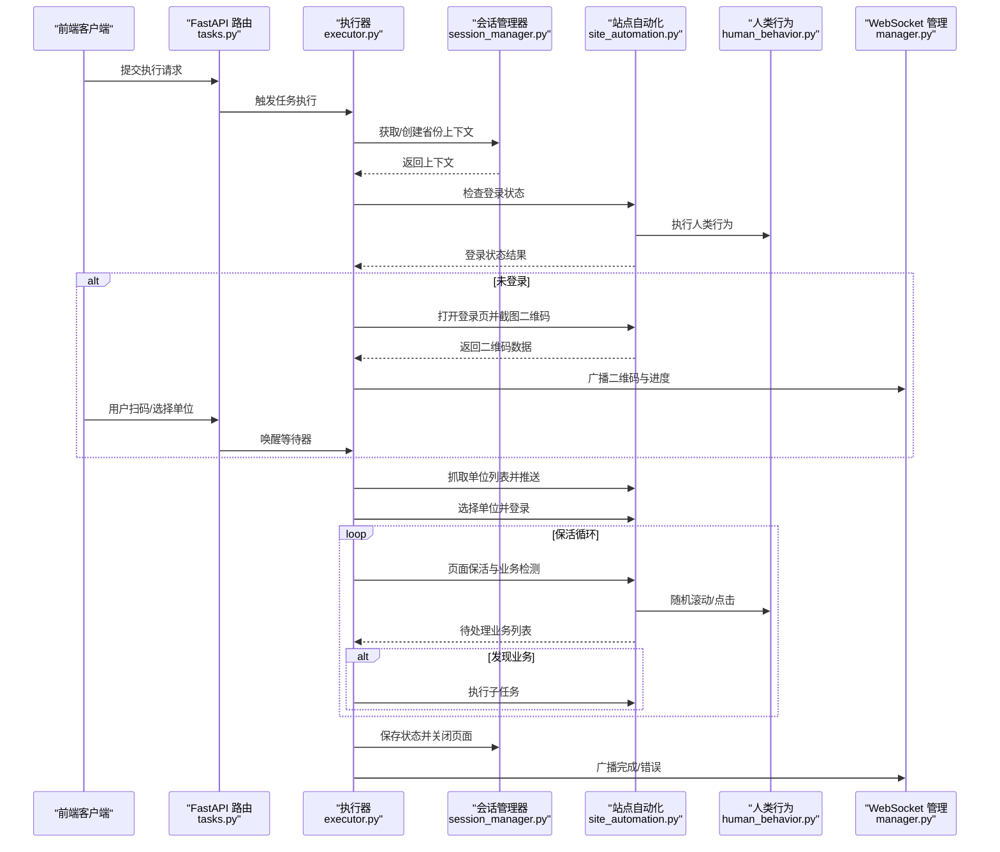
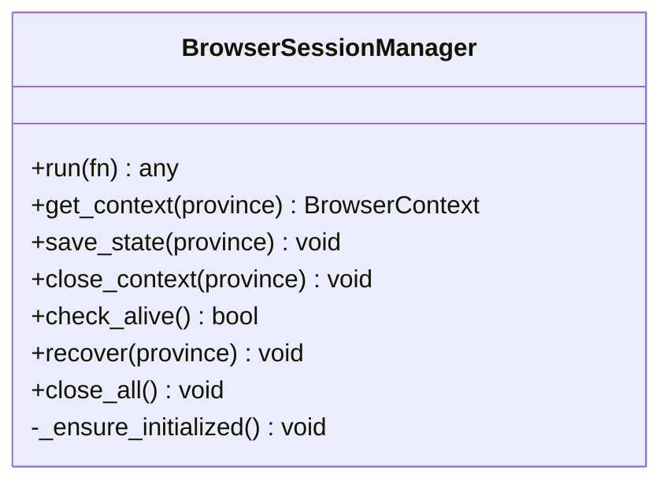
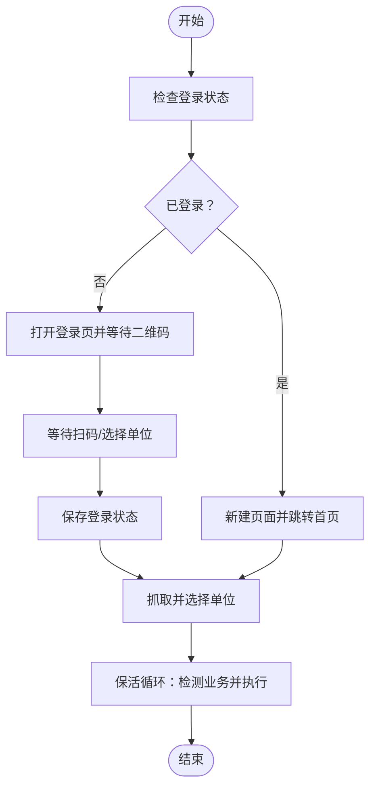
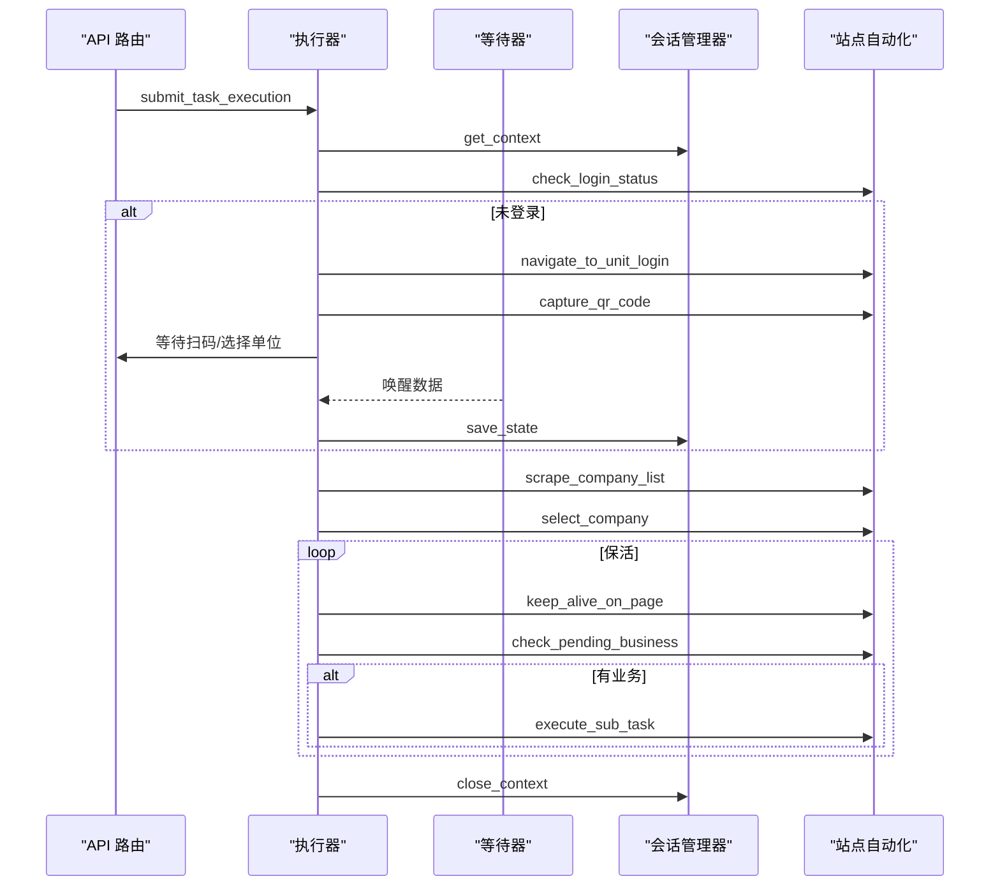
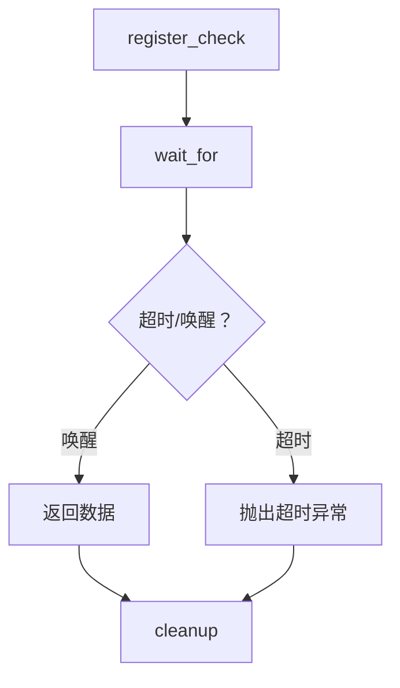
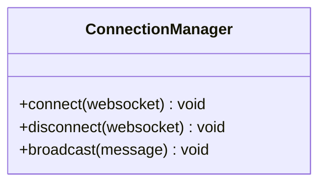
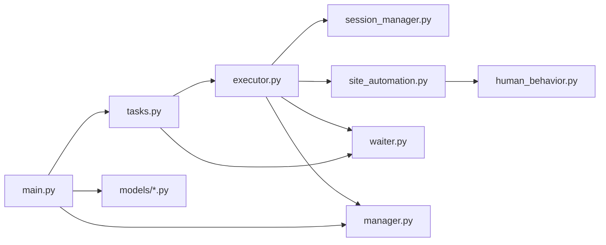

# 插件与扩展隔离层

<cite>
**本文引用的文件**
- [session_manager.py](file://CCC_RPA_API/app/browser/session_manager.py)
- [site_automation.py](file://CCC_RPA_API/app/browser/site_automation.py)
- [executor.py](file://CCC_RPA_API/app/services/executor.py)
- [waiter.py](file://CCC_RPA_API/app/browser/waiter.py)
- [manager.py](file://CCC_RPA_API/app/ws/manager.py)
- [main.py](file://CCC_RPA_API/app/main.py)
- [human_behavior.py](file://CCC_RPA_API/app/browser/human_behavior.py)
- [task.py](file://CCC_RPA_API/app/models/task.py)
- [execution_log.py](file://CCC_RPA_API/app/models/execution_log.py)
- [tasks.py](file://CCC_RPA_API/app/api/tasks.py)
</cite>

## 目录
1. [简介](#简介)
2. [项目结构](#项目结构)
3. [核心组件](#核心组件)
4. [架构总览](#架构总览)
5. [详细组件分析](#详细组件分析)
6. [依赖分析](#依赖分析)
7. [性能考量](#性能考量)
8. [故障排查指南](#故障排查指南)
9. [结论](#结论)
10. [附录](#附录)

## 简介
本文件面向“插件与扩展隔离层”的技术设计与实现，围绕 Chrome V3 扩展的独立实例化机制展开，结合现有代码库中的浏览器会话管理、自动化流程与通信控制能力，系统阐述以下主题：
- 每会话独立扩展实例：通过按省份维度的浏览器上下文隔离，确保扩展存储、后台脚本、内容脚本完全隔离。
- 权限与数据隔离：通过专用工作线程与存储状态文件分离，阻断扩展间的数据与权限共享。
- Service Worker/内容脚本/SidePanel 隔离：以“专用线程 + 存储状态文件”实现逻辑隔离；前端侧通过 WebSocket 与后端交互，避免跨扩展脚本污染。
- 生命周期与资源限制：线程池、超时与恢复策略保障稳定性；数据库与会话状态持久化提升容错。
- 异常处理与自动恢复：浏览器异常检测与恢复、保活循环与业务触发联动。
- 验证与冲突治理：通过日志、截图与状态文件校验隔离有效性；提供冲突检测与解决建议。

## 项目结构
本项目采用前后端分离与职责清晰的分层组织：
- 后端服务（FastAPI）：提供任务编排、执行控制、WebSocket 广播与数据库交互。
- 浏览器自动化层：基于 Playwright 的专用工作线程，按省份隔离上下文，持久化 storage_state。
- 业务自动化层：针对目标站点的页面行为与业务流程封装。
- 通信与等待层：基于线程事件的等待/唤醒机制，配合 WebSocket 推送进度与二维码。

图表来源
- [main.py:30-127](file://CCC_RPA_API/app/main.py#L30-L127)
- [manager.py:1-29](file://CCC_RPA_API/app/ws/manager.py#L1-L29)
- [tasks.py:1-76](file://CCC_RPA_API/app/api/tasks.py#L1-L76)
- [session_manager.py:10-186](file://CCC_RPA_API/app/browser/session_manager.py#L10-L186)
- [site_automation.py:16-743](file://CCC_RPA_API/app/browser/site_automation.py#L16-L743)
- [human_behavior.py:12-86](file://CCC_RPA_API/app/browser/human_behavior.py#L12-L86)
- [executor.py:78-319](file://CCC_RPA_API/app/services/executor.py#L78-L319)
- [waiter.py:7-84](file://CCC_RPA_API/app/browser/waiter.py#L7-L84)
- [task.py:8-25](file://CCC_RPA_API/app/models/task.py#L8-L25)
- [execution_log.py:7-17](file://CCC_RPA_API/app/models/execution_log.py#L7-L17)

章节来源
- [main.py:30-127](file://CCC_RPA_API/app/main.py#L30-L127)
- [session_manager.py:10-186](file://CCC_RPA_API/app/browser/session_manager.py#L10-L186)
- [site_automation.py:16-743](file://CCC_RPA_API/app/browser/site_automation.py#L16-L743)
- [executor.py:78-319](file://CCC_RPA_API/app/services/executor.py#L78-L319)
- [waiter.py:7-84](file://CCC_RPA_API/app/browser/waiter.py#L7-L84)
- [manager.py:1-29](file://CCC_RPA_API/app/ws/manager.py#L1-L29)
- [task.py:8-25](file://CCC_RPA_API/app/models/task.py#L8-L25)
- [execution_log.py:7-17](file://CCC_RPA_API/app/models/execution_log.py#L7-L17)
- [tasks.py:1-76](file://CCC_RPA_API/app/api/tasks.py#L1-L76)

## 核心组件
- 会话管理器（BrowserSessionManager）
  - 专用工作线程承载 Playwright/Chromium，避免与主事件循环冲突。
  - 按省份维护 BrowserContext，持久化 storage_state 文件，实现扩展存储隔离。
  - 提供运行任务、获取上下文、保存状态、关闭上下文、健康检查与恢复等能力。
- 站点自动化（SiteAutomation）
  - 封装目标站点的登录、扫码、单位选择、业务检测与保活等流程。
  - 通过多策略选择器与 JS 回退，增强页面适配性；提供截图与日志辅助定位问题。
- 执行器（executor）
  - 统筹任务生命周期：初始化浏览器、检查登录、扫码、抓取单位、选择单位、保活循环与完成收尾。
  - 在专用线程中执行 Playwright 操作，并在必要时进行浏览器异常恢复。
  - 通过 WebSocket 广播进度、二维码与错误信息。
- 等待器（ExecutionWaiter）
  - 基于线程事件的阻塞/唤醒机制，支撑扫码与单位选择等用户交互。
  - 支持取消、检查信号与清理，便于保活循环响应中断。
- WebSocket 管理（ConnectionManager）
  - 统一管理连接与广播，保证前端实时接收执行状态。
- 人类行为模拟（HumanBehavior）
  - 提供随机滚动、点击、输入与等待，降低被风控识别概率。
- 数据模型与 API
  - 任务与执行日志模型定义字段与索引；API 路由提供执行、取消与状态更新接口。

章节来源
- [session_manager.py:10-186](file://CCC_RPA_API/app/browser/session_manager.py#L10-L186)
- [site_automation.py:16-743](file://CCC_RPA_API/app/browser/site_automation.py#L16-L743)
- [executor.py:78-319](file://CCC_RPA_API/app/services/executor.py#L78-L319)
- [waiter.py:7-84](file://CCC_RPA_API/app/browser/waiter.py#L7-L84)
- [manager.py:1-29](file://CCC_RPA_API/app/ws/manager.py#L1-L29)
- [human_behavior.py:12-86](file://CCC_RPA_API/app/browser/human_behavior.py#L12-L86)
- [task.py:8-25](file://CCC_RPA_API/app/models/task.py#L8-L25)
- [execution_log.py:7-17](file://CCC_RPA_API/app/models/execution_log.py#L7-L17)
- [tasks.py:1-76](file://CCC_RPA_API/app/api/tasks.py#L1-L76)

## 架构总览
下图展示从任务提交到执行完成的关键交互与隔离点：

图表来源
- [tasks.py:47-76](file://CCC_RPA_API/app/api/tasks.py#L47-L76)
- [executor.py:78-319](file://CCC_RPA_API/app/services/executor.py#L78-L319)
- [session_manager.py:98-144](file://CCC_RPA_API/app/browser/session_manager.py#L98-L144)
- [site_automation.py:38-541](file://CCC_RPA_API/app/browser/site_automation.py#L38-L541)
- [human_behavior.py:12-86](file://CCC_RPA_API/app/browser/human_behavior.py#L12-L86)
- [manager.py:17-28](file://CCC_RPA_API/app/ws/manager.py#L17-L28)

## 详细组件分析

### 会话管理器（BrowserSessionManager）
- 独立工作线程与 Playwright 生命周期
  - 通过专用线程启动 Chromium，避免与 FastAPI 的 asyncio 事件循环冲突。
  - 提供幂等初始化、任务队列与结果回传，支持超时与异常包装。
- 按省份隔离的上下文
  - 以省份为键维护 BrowserContext，首次创建时读取对应 storage_state 文件，实现扩展存储隔离。
  - 提供上下文存活检测、恢复与关闭，确保异常后的可恢复性。
- 存储与状态
  - storage_state 文件位于 data/browser_states 目录，按 province 命名，避免扩展间数据交叉污染。

图表来源
- [session_manager.py:10-186](file://CCC_RPA_API/app/browser/session_manager.py#L10-L186)

章节来源
- [session_manager.py:10-186](file://CCC_RPA_API/app/browser/session_manager.py#L10-L186)

### 站点自动化（SiteAutomation）
- 登录与扫码流程
  - 直达登录页与首页点击两种策略，二维码元素单独截图并返回前端显示。
- 单位选择与登录
  - 多选择器降级策略与 JS 回退，兼顾稳定性与兼容性；失败时截图辅助诊断。
- 业务检测与保活
  - 保活循环在当前业务页执行，不触发导航；检测待处理业务并触发子任务。
- 错误识别
  - 识别浏览器关闭类错误，及时抛出以便上层恢复。

图表来源
- [site_automation.py:38-541](file://CCC_RPA_API/app/browser/site_automation.py#L38-L541)

章节来源
- [site_automation.py:16-743](file://CCC_RPA_API/app/browser/site_automation.py#L16-L743)

### 执行器（executor）
- 任务生命周期编排
  - 初始化浏览器、检查登录、扫码/选择单位、抓取单位列表、选择单位、保活循环、完成收尾。
- 线程与恢复
  - 在专用线程中执行 Playwright 操作；若检测到浏览器异常，广播进度并恢复会话。
- 业务触发与取消
  - 保活循环中周期性检测待处理业务并执行；支持取消信号与分段等待，快速响应中断。

图表来源
- [executor.py:78-319](file://CCC_RPA_API/app/services/executor.py#L78-L319)
- [waiter.py:14-84](file://CCC_RPA_API/app/browser/waiter.py#L14-L84)
- [session_manager.py:98-144](file://CCC_RPA_API/app/browser/session_manager.py#L98-L144)
- [site_automation.py:194-743](file://CCC_RPA_API/app/browser/site_automation.py#L194-L743)

章节来源
- [executor.py:78-319](file://CCC_RPA_API/app/services/executor.py#L78-L319)
- [waiter.py:7-84](file://CCC_RPA_API/app/browser/waiter.py#L7-L84)

### 等待器（ExecutionWaiter）
- 阻塞等待与唤醒
  - 通过线程事件实现阻塞等待与唤醒，支持超时与取消。
- 保活循环集成
  - 提供非阻塞检查信号的能力，便于保活循环快速响应取消。

图表来源
- [waiter.py:14-84](file://CCC_RPA_API/app/browser/waiter.py#L14-L84)

章节来源
- [waiter.py:7-84](file://CCC_RPA_API/app/browser/waiter.py#L7-L84)

### WebSocket 管理（ConnectionManager）
- 广播与连接管理
  - 统一接受连接、广播消息、清理无效连接，确保前端实时接收执行状态。

图表来源
- [manager.py:5-29](file://CCC_RPA_API/app/ws/manager.py#L5-L29)

章节来源
- [manager.py:1-29](file://CCC_RPA_API/app/ws/manager.py#L1-L29)

### 人类行为模拟（HumanBehavior）
- 随机滚动、点击、输入与等待
  - 通过随机参数与分步动作，降低被风控识别概率，提升自动化稳定性。

章节来源
- [human_behavior.py:12-86](file://CCC_RPA_API/app/browser/human_behavior.py#L12-L86)

### 数据模型与 API
- 任务与执行日志
  - 定义任务状态、时间戳与结果字段，支持任务调度与审计。
- API 路由
  - 提供执行、取消、扫码完成与单位选择等接口，配合等待器实现交互。

章节来源
- [task.py:8-25](file://CCC_RPA_API/app/models/task.py#L8-L25)
- [execution_log.py:7-17](file://CCC_RPA_API/app/models/execution_log.py#L7-L17)
- [tasks.py:1-76](file://CCC_RPA_API/app/api/tasks.py#L1-L76)

## 依赖分析
- 组件耦合
  - 执行器依赖会话管理器与站点自动化，同时通过等待器与 WebSocket 管理器与外部交互。
  - 站点自动化依赖人类行为模拟，提高页面交互的真实性。
- 外部依赖
  - Playwright/Chromium 作为底层自动化引擎；SQLite/SQLAlchemy 作为数据持久化。
- 潜在环路
  - 代码层未发现循环依赖；各模块职责清晰，通过接口解耦。

图表来源
- [executor.py:13-15](file://CCC_RPA_API/app/services/executor.py#L13-L15)
- [session_manager.py:10-186](file://CCC_RPA_API/app/browser/session_manager.py#L10-L186)
- [site_automation.py:5](file://CCC_RPA_API/app/browser/site_automation.py#L5)
- [human_behavior.py:12-86](file://CCC_RPA_API/app/browser/human_behavior.py#L12-L86)
- [waiter.py:7-84](file://CCC_RPA_API/app/browser/waiter.py#L7-L84)
- [manager.py:1-29](file://CCC_RPA_API/app/ws/manager.py#L1-L29)
- [tasks.py:1-76](file://CCC_RPA_API/app/api/tasks.py#L1-L76)
- [main.py:30-127](file://CCC_RPA_API/app/main.py#L30-L127)
- [task.py:8-25](file://CCC_RPA_API/app/models/task.py#L8-L25)
- [execution_log.py:7-17](file://CCC_RPA_API/app/models/execution_log.py#L7-L17)

章节来源
- [executor.py:13-15](file://CCC_RPA_API/app/services/executor.py#L13-L15)
- [tasks.py:1-76](file://CCC_RPA_API/app/api/tasks.py#L1-L76)
- [main.py:30-127](file://CCC_RPA_API/app/main.py#L30-L127)

## 性能考量
- 线程与并发
  - 专用工作线程承载 Playwright，避免主线程阻塞；线程池限制并发数量，防止资源争用。
- I/O 与网络
  - 页面等待与截图操作较多，建议在边缘节点或本地 SSD 上优化 I/O；合理设置超时与重试。
- 存储隔离
  - storage_state 文件按省份拆分，减少锁竞争；建议定期清理历史状态文件，控制磁盘占用。
- 保活策略
  - 随机滚动与点击频率需平衡稳定性与效率；可根据站点风控强度动态调整。

## 故障排查指南
- 浏览器异常与恢复
  - 检查会话管理器的健康检查与恢复流程；确认 storage_state 文件是否存在且可读。
- 扫码与单位选择
  - 确认 WebSocket 广播正常；检查等待器唤醒与清理逻辑；查看前端是否正确上报扫码完成与单位选择。
- 页面元素匹配失败
  - 使用站点自动化提供的截图与日志定位页面结构变化；必要时调整选择器策略或启用 JS 回退。
- 数据库与状态
  - 核对任务与执行日志的状态流转；关注超时与异常分支的日志输出。

章节来源
- [session_manager.py:147-186](file://CCC_RPA_API/app/browser/session_manager.py#L147-L186)
- [executor.py:42-70](file://CCC_RPA_API/app/services/executor.py#L42-L70)
- [site_automation.py:148-192](file://CCC_RPA_API/app/browser/site_automation.py#L148-L192)
- [waiter.py:14-84](file://CCC_RPA_API/app/browser/waiter.py#L14-L84)
- [manager.py:17-28](file://CCC_RPA_API/app/ws/manager.py#L17-L28)

## 结论
本隔离层通过“专用工作线程 + 按省份上下文 + storage_state 文件”的组合，实现了扩展存储、后台脚本与内容脚本的逻辑隔离；配合 WebSocket 与等待器机制，确保前端交互与后端执行的解耦与可控。执行器在异常时具备恢复能力，保活循环与业务检测形成闭环，整体满足 Chrome V3 扩展的独立实例化与安全隔离需求。

## 附录
- 隔离验证清单
  - 每个省份拥有独立 storage_state 文件，且文件名唯一。
  - 专用工作线程启动成功，主线程无阻塞。
  - 扫码与单位选择通过 WebSocket 广播与等待器唤醒完成。
  - 异常时浏览器恢复成功，上下文重建并重新打开页面。
- 冲突检测与解决
  - 若出现页面元素匹配失败，优先启用 JS 回退策略并调整选择器。
  - 若浏览器异常频繁，检查 storage_state 文件完整性与磁盘空间。
- 跨会话数据保护
  - storage_state 文件按省份命名，避免跨会话共享；建议定期备份关键状态文件。