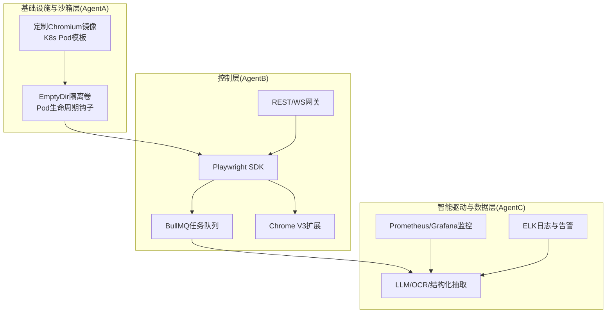
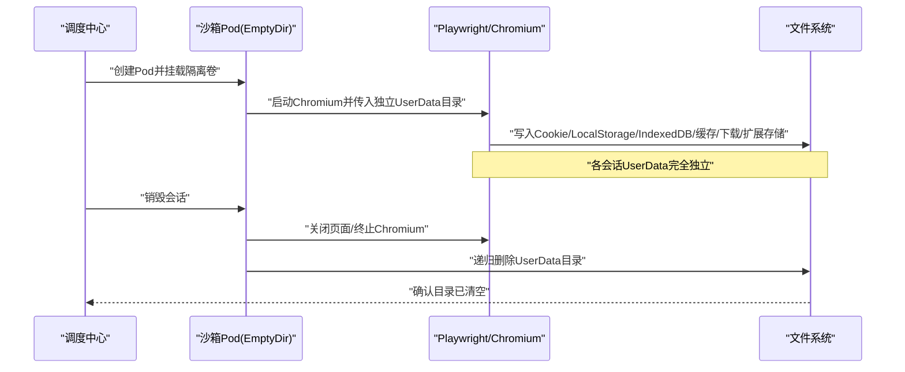
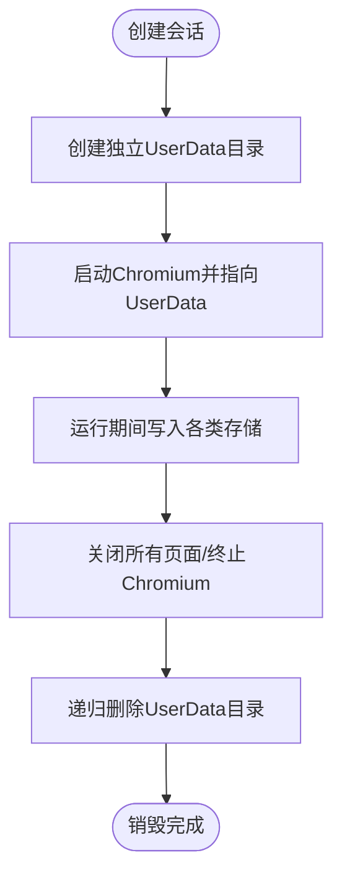
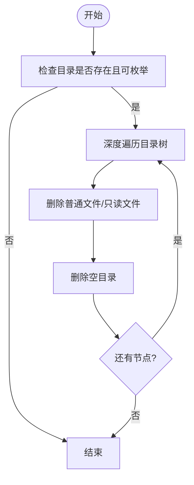
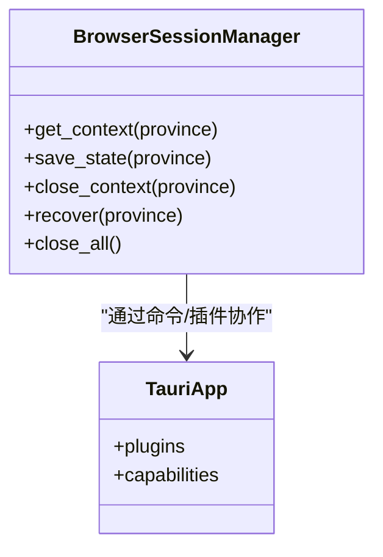
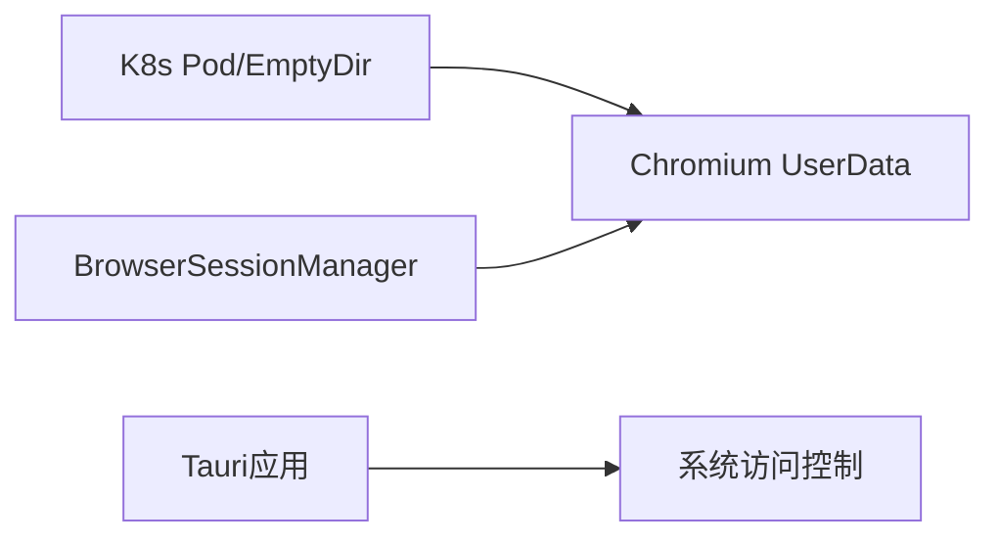

# 文件系统隔离层

<cite>
**本文引用的文件**
- [project.md](file://project.md)
- [session_manager.py](file://CCC_RPA_API/app/browser/session_manager.py)
- [site_automation.py](file://CCC_RPA_API/app/browser/site_automation.py)
- [main.rs](file://CCC-BrowserV4/src-tauri/src/main.rs)
- [default.json](file://CCC-BrowserV4/src-tauri/capabilities/default.json)
- [capabilities.json](file://CCC-BrowserV4/src-tauri/gen/schemas/capabilities.json)
</cite>

## 目录
1. [简介](#简介)
2. [项目结构](#项目结构)
3. [核心组件](#核心组件)
4. [架构总览](#架构总览)
5. [组件详解](#组件详解)
6. [依赖关系分析](#依赖关系分析)
7. [性能考量](#性能考量)
8. [故障排查指南](#故障排查指南)
9. [结论](#结论)
10. [附录](#附录)

## 简介
本文件系统隔离层围绕“每个沙箱会话拥有独立的用户数据目录”展开，目标是实现跨平台的强隔离：在文件系统层面，确保每个会话的 UserData、磁盘缓存、下载目录、扩展本地存储相互独立；在网络与进程层面亦实现独立隔离。本文将结合项目文档与现有代码，系统阐述：
- UserData 目录独立机制与会话生命周期
- Linux Namespace 与 Windows NTFS ACL 在隔离中的作用与边界
- 文件系统结构设计、权限继承策略、会话销毁时的递归删除算法
- 跨平台隔离实现差异对比
- 隔离效果验证方法与常见问题解决方案

## 项目结构
本仓库包含三层与四层协同：
- 基础设施与沙箱层（AgentA）：定制 Chromium 镜像、K8s Pod 编排、EmptyDir 挂载隔离目录、Pod 生命周期钩子
- 控制层（AgentB）：REST/WS API 网关、Playwright SDK、BullMQ 任务队列、Chrome V3 扩展
- 智能驱动与数据层（AgentC）：LLM/OCR/结构化抽取、监控与运维

**章节来源**
- [project.md: 237-261:237-261](file://project.md#L237-L261)
- [project.md: 263-291:263-291](file://project.md#L263-L291)

## 核心组件
- 会话生命周期与销毁策略：会话销毁时需“全量删除 UserData 目录”，以保证文件层强隔离
- Playwright 浏览器会话管理：在专用工作线程中创建/复用 BrowserContext，支持 storage_state 持久化
- Tauri 应用与权限：通过插件与能力配置，限定应用对系统资源的访问范围

**章节来源**
- [project.md: 263-276:263-276](file://project.md#L263-L276)
- [session_manager.py: 10-186:10-186](file://CCC_RPA_API/app/browser/session_manager.py#L10-L186)
- [main.rs: 7-28:7-28](file://CCC-BrowserV4/src-tauri/src/main.rs#L7-L28)
- [default.json: 1-12:1-12](file://CCC-BrowserV4/src-tauri/capabilities/default.json#L1-L12)
- [capabilities.json: 1-1:1-1](file://CCC-BrowserV4/src-tauri/gen/schemas/capabilities.json#L1-L1)

## 架构总览
下图展示了会话创建、运行与销毁过程中的文件系统隔离要点：每个会话拥有独立的 UserData 目录，销毁时进行递归删除，确保 Cookie、LocalStorage、IndexedDB、缓存、下载目录、扩展本地存储彼此隔离。

**图表来源**
- [project.md: 263-276:263-276](file://project.md#L263-L276)
- [project.md: 277-291:277-291](file://project.md#L277-L291)

## 组件详解

### 1) UserData 目录独立机制
- 会话维度：每个 sessionId 对应一组独立的浏览器存储（Cookie、LocalStorage、IndexedDB、缓存、下载、扩展存储），这些都位于独立的 UserData 目录中
- 生命周期：销毁时需“全量删除 UserData 目录”，避免残留导致会话间数据交叉
- 与 Playwright 的关系：当前代码通过 storage_state 持久化与恢复，但未显式设置独立的 UserData 目录参数；建议在创建 BrowserContext 时显式传入 userDataDir 参数，确保与项目文档要求一致

**章节来源**
- [project.md: 263-276:263-276](file://project.md#L263-L276)
- [project.md: 277-291:277-291](file://project.md#L277-L291)
- [session_manager.py: 98-126:98-126](file://CCC_RPA_API/app/browser/session_manager.py#L98-L126)

### 2) Linux Namespace 中的 mount namespace 隔离原理
- Mount Namespace：每个沙箱进程拥有独立的挂载视图，可将 EmptyDir 或临时卷挂载到 Chromium 的 UserData 路径，从而实现“只对当前会话可见”的隔离
- Pod 编排：通过 K8s Pod 模板的 EmptyDir 挂载，配合 Pod 生命周期钩子，在启动前初始化隔离目录、销毁前强制终止进程并清理临时文件
- 优势：天然的文件系统隔离，避免宿主机与其它会话污染

**章节来源**
- [project.md: 251-261:251-261](file://project.md#L251-L261)
- [project.md: 277-291:277-291](file://project.md#L277-L291)

### 3) Windows 平台 NTFS ACL 权限控制机制
- 通过 NTFS ACL 限制不同会话进程对 UserData 目录的访问权限，仅允许当前会话进程读写
- 建议：在会话创建时设置目录 ACL，销毁时回收权限，防止跨会话读取
- 注意：Windows 下还需考虑路径长度、Unicode 权限继承、以及进程令牌的影响

**章节来源**
- [project.md: 277-291:277-291](file://project.md#L277-L291)

### 4) UserData 目录结构设计
- 建议采用如下层级（示例）：
  - 用户数据根：{root}/sessions/{sessionId}/
  - 子目录：
    - Default/IndexedDB/Local Storage/Cache/Download
    - Extensions/{extension_id}/
    - BlobStorage/Cache/Code Cache/
- 作用：将 Cookie、LocalStorage、IndexedDB、缓存、下载、扩展存储分门别类，便于销毁与审计

**章节来源**
- [project.md: 277-291:277-291](file://project.md#L277-L291)

### 5) 文件权限继承策略
- Linux：基于 umask 与 chown/chmod，确保目录属主为当前会话进程用户，组内可读写，其他不可访问
- Windows：基于 DACL 设置，仅允许当前会话服务账户或进程令牌访问，拒绝继承父级权限
- 建议：在创建目录时立即固化权限，避免默认继承带来的安全风险

**章节来源**
- [project.md: 277-291:277-291](file://project.md#L277-L291)

### 6) 会话销毁时的递归删除算法
- 算法目标：彻底清除 UserData 目录，包括隐藏文件与深层子目录
- 关键点：
  - 避免删除非会话相关文件（如宿主机共享卷）
  - 处理符号链接与只读属性
  - 并发安全：确保销毁期间无进程持有句柄
- 复杂度：O(N)，N 为目录树节点数；建议分批删除并记录失败项以便重试

**章节来源**
- [project.md: 263-276:263-276](file://project.md#L263-L276)

### 7) 跨平台文件系统隔离实现差异对比
- Linux（推荐）：Mount Namespace + EmptyDir + umask/ACL，隔离强、易审计
- Windows（替代方案）：NTFS ACL + 进程令牌，需谨慎处理权限继承与路径长度
- 共同点：销毁时均需递归删除 UserData 目录，避免残留

**章节来源**
- [project.md: 251-261:251-261](file://project.md#L251-L261)
- [project.md: 277-291:277-291](file://project.md#L277-L291)

### 8) 与现有代码的关系映射
- Playwright 会话管理：当前代码通过 storage_state 持久化与恢复，但未显式传入 userDataDir；建议补充以满足“独立 UserData”要求
- Tauri 应用：通过能力配置限制系统访问，减少侧向信息泄露风险

**图表来源**
- [session_manager.py: 10-186:10-186](file://CCC_RPA_API/app/browser/session_manager.py#L10-L186)
- [main.rs: 7-28:7-28](file://CCC-BrowserV4/src-tauri/src/main.rs#L7-L28)
- [default.json: 1-12:1-12](file://CCC-BrowserV4/src-tauri/capabilities/default.json#L1-L12)
- [capabilities.json: 1-1:1-1](file://CCC-BrowserV4/src-tauri/gen/schemas/capabilities.json#L1-L1)

**章节来源**
- [session_manager.py: 10-186:10-186](file://CCC_RPA_API/app/browser/session_manager.py#L10-L186)
- [main.rs: 7-28:7-28](file://CCC-BrowserV4/src-tauri/src/main.rs#L7-L28)
- [default.json: 1-12:1-12](file://CCC-BrowserV4/src-tauri/capabilities/default.json#L1-L12)
- [capabilities.json: 1-1:1-1](file://CCC-BrowserV4/src-tauri/gen/schemas/capabilities.json#L1-L1)

## 依赖关系分析
- 会话生命周期依赖 K8s Pod 与 EmptyDir 的挂载隔离
- Playwright 依赖 Chromium 的 UserData 目录参数（建议显式传入）
- Tauri 应用通过能力配置限制系统访问范围

**图表来源**
- [project.md: 251-261:251-261](file://project.md#L251-L261)
- [session_manager.py: 10-186:10-186](file://CCC_RPA_API/app/browser/session_manager.py#L10-L186)
- [main.rs: 7-28:7-28](file://CCC-BrowserV4/src-tauri/src/main.rs#L7-L28)

**章节来源**
- [project.md: 251-261:251-261](file://project.md#L251-L261)
- [session_manager.py: 10-186:10-186](file://CCC_RPA_API/app/browser/session_manager.py#L10-L186)
- [main.rs: 7-28:7-28](file://CCC-BrowserV4/src-tauri/src/main.rs#L7-L28)

## 性能考量
- 磁盘 IO：频繁写入 IndexedDB/缓存会增加 IO 压力，建议在 Pod 内使用 SSD 或 tmpfs（受内存限制）
- 清理成本：递归删除大量小文件的代价较高，可在销毁前合并小文件或压缩缓存
- 并发销毁：批量销毁时应串行或分批执行，避免竞争与死锁

## 故障排查指南
- 现象：会话间 Cookie/LocalStorage 互通
  - 排查：确认是否为同一 UserData 目录或共享缓存
  - 处置：强制传入独立 userDataDir，销毁时递归删除
- 现象：销毁后仍有残留文件
  - 排查：是否存在符号链接、只读属性、进程仍持有句柄
  - 处置：删除前解除只读、终止进程、重试删除
- 现象：Windows 下权限不足
  - 排查：NTFS ACL 是否正确设置
  - 处置：在创建目录时固化 ACL，避免继承

**章节来源**
- [project.md: 263-276:263-276](file://project.md#L263-L276)
- [project.md: 641-657:641-657](file://project.md#L641-L657)

## 结论
- 项目文档明确了“文件层强隔离”的要求，包括独立的 UserData、缓存、下载、扩展存储
- 当前代码侧重 storage_state 的持久化与恢复，建议补充独立 userDataDir 参数以满足强隔离
- Linux 通过 Mount Namespace 与 EmptyDir 更易实现强隔离；Windows 通过 NTFS ACL 辅助，需更谨慎地处理权限继承与进程令牌
- 销毁阶段的递归删除是保障隔离的关键，应纳入自动化流程并具备重试与审计能力

## 附录
- 验证方法（摘自项目文档）：
  - 并行会话登录不同账号，验证 Cookie、LocalStorage 互相不可读取
  - 配置不同代理 IP，抓包验证出站网络 IP 独立
  - 销毁后确认 UserData 目录全部删除，无残留
  - 单会话崩溃不影响其他会话运行

**章节来源**
- [project.md: 660-669:660-669](file://project.md#L660-L669)